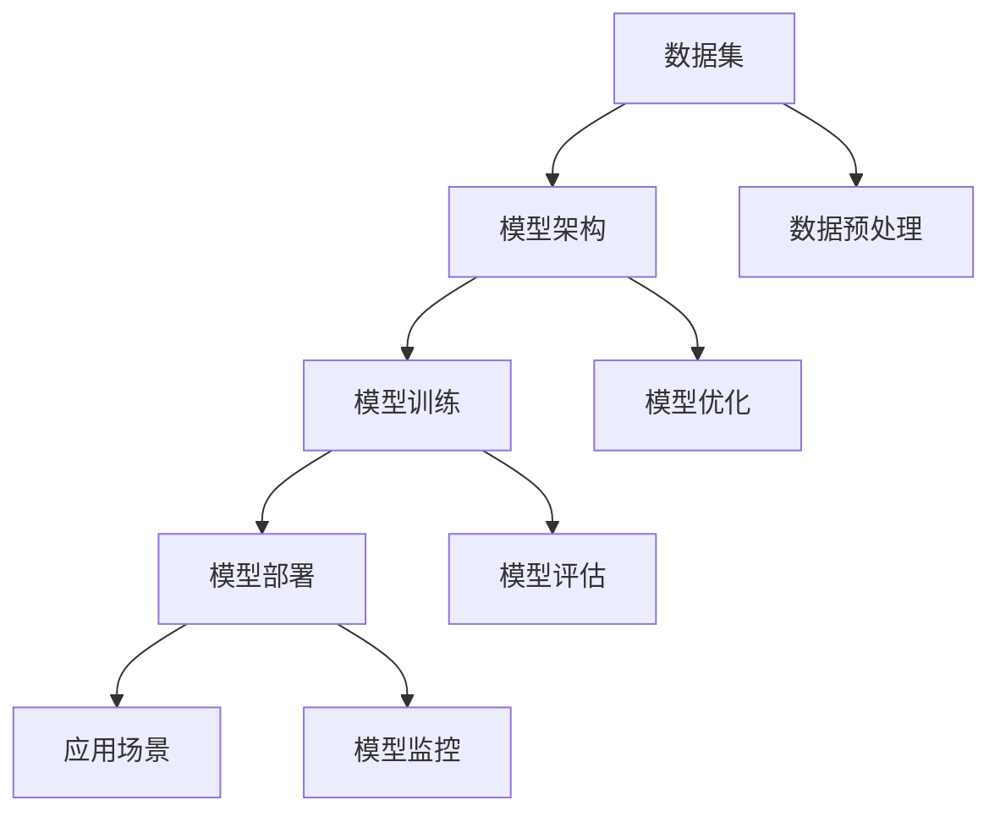

                 

关键词：语言模型、应用生态、开发者、用户、机遇、技术趋势

摘要：随着大型语言模型（LLM）技术的迅速发展，构建LLM应用生态已成为人工智能领域的重要趋势。本文旨在探讨开发者与用户在这一新兴生态中的新机遇，分析LLM技术带来的影响，并提出建设性建议，以期为推动人工智能技术的发展和应用提供参考。

## 1. 背景介绍

近年来，人工智能技术取得了飞速发展，尤其是在自然语言处理（NLP）领域。大型语言模型（LLM）如GPT-3、BERT等，凭借其强大的语言理解和生成能力，已经在各种应用场景中展示了巨大的潜力。LLM的崛起不仅改变了传统的人工智能应用模式，也为开发者与用户带来了全新的机遇。

### 1.1 LLM的定义与特点

大型语言模型（LLM）是基于深度学习技术构建的模型，具有处理和理解复杂文本的能力。LLM的特点包括：

1. **强大的语言理解能力**：LLM可以理解、处理和生成自然语言，具备类似人类的语言处理能力。
2. **自适应性强**：LLM可以根据不同的输入数据自适应调整其参数，使其在特定领域或任务上表现更优秀。
3. **高效率**：LLM可以同时处理大量文本数据，提高数据处理效率。

### 1.2 LLM的发展历程

LLM的发展可以追溯到2000年代初期，当时研究人员开始尝试使用深度学习技术来解决自然语言处理问题。随着计算能力的提升和算法的改进，LLM的性能不断提高。近年来，GPT-3、BERT等大型语言模型的出现，标志着LLM技术进入了一个全新的阶段。

## 2. 核心概念与联系

为了更好地理解LLM应用生态的构建，我们需要掌握几个核心概念，并了解它们之间的联系。

### 2.1 数据集

数据集是构建LLM的基础。高质量的数据集可以提供丰富的语料库，有助于模型训练和优化。在LLM应用生态中，数据集的收集、整理和管理至关重要。

### 2.2 模型架构

模型架构决定了LLM的性能和适用范围。常见的LLM架构包括Transformer、BERT等。选择合适的模型架构对于构建高效的应用生态至关重要。

### 2.3 模型训练

模型训练是将模型参数与数据集结合的过程，以使模型能够理解并生成自然语言。在LLM应用生态中，模型训练的效率和质量直接影响应用的性能。

### 2.4 模型部署

模型部署是将训练好的模型应用于实际场景的过程。在LLM应用生态中，模型部署的便捷性和可扩展性对于开发者与用户都具有重要意义。

### 2.5 应用场景

应用场景是LLM技术的具体应用领域。从文本生成、机器翻译、问答系统到智能客服、智能写作等，LLM技术已经渗透到各个行业。

### 2.6 Mermaid 流程图

以下是一个简单的Mermaid流程图，展示了LLM应用生态的核心概念与联系：



## 3. 核心算法原理 & 具体操作步骤

### 3.1 算法原理概述

LLM的核心算法是基于深度学习技术的。深度学习模型通过多层神经网络对输入数据进行特征提取和表示学习，从而实现对数据的理解和生成。

### 3.2 算法步骤详解

1. **数据集准备**：收集并整理高质量的数据集，进行数据预处理，如分词、去噪、归一化等。
2. **模型选择**：根据应用需求选择合适的模型架构，如Transformer、BERT等。
3. **模型训练**：使用预处理后的数据集对模型进行训练，优化模型参数。
4. **模型评估**：使用验证集对模型进行评估，确保模型性能达到预期。
5. **模型部署**：将训练好的模型部署到实际应用场景中，如文本生成、机器翻译等。
6. **模型监控**：对模型运行情况进行实时监控，确保模型稳定运行。

### 3.3 算法优缺点

**优点**：

1. **强大的语言理解能力**：LLM可以理解并生成自然语言，具备类似人类的语言处理能力。
2. **自适应性强**：LLM可以根据不同的输入数据自适应调整其参数，使其在特定领域或任务上表现更优秀。
3. **高效率**：LLM可以同时处理大量文本数据，提高数据处理效率。

**缺点**：

1. **计算资源需求大**：训练大型LLM模型需要大量的计算资源，可能导致成本较高。
2. **数据隐私问题**：LLM在训练过程中可能涉及大量用户数据，存在数据隐私问题。
3. **模型解释性较差**：由于LLM是基于深度学习技术构建的，其内部工作机制较难解释。

### 3.4 算法应用领域

LLM技术已经广泛应用于多个领域，如文本生成、机器翻译、问答系统、智能客服、智能写作等。以下是一些具体的案例：

1. **文本生成**：LLM可以用于生成文章、新闻、小说等文本内容，提高创作效率。
2. **机器翻译**：LLM可以用于实现高质量的机器翻译，支持多语言之间的翻译。
3. **问答系统**：LLM可以用于构建智能问答系统，为用户提供实时、准确的回答。
4. **智能客服**：LLM可以用于实现智能客服系统，为用户提供24/7的在线支持。
5. **智能写作**：LLM可以用于辅助写作，提高写作质量和效率。

## 4. 数学模型和公式 & 详细讲解 & 举例说明

### 4.1 数学模型构建

LLM的数学模型通常基于深度学习技术，包括多层神经网络、损失函数、优化算法等。以下是一个简单的神经网络模型：

$$
y = \sigma(W_1 \cdot x + b_1)
$$

其中，$y$ 是输出，$\sigma$ 是激活函数，$W_1$ 和 $b_1$ 分别是权重和偏置。

### 4.2 公式推导过程

为了推导神经网络的损失函数，我们首先需要了解损失函数的定义：

$$
L(y, \hat{y}) = \frac{1}{2} (y - \hat{y})^2
$$

其中，$L$ 是损失函数，$y$ 是真实标签，$\hat{y}$ 是预测值。

假设我们的神经网络有 $L$ 层，每层有 $n_l$ 个神经元，那么第 $l$ 层的输出可以表示为：

$$
a_l = \sigma(W_l \cdot a_{l-1} + b_l)
$$

其中，$a_l$ 是第 $l$ 层的输出，$\sigma$ 是激活函数，$W_l$ 和 $b_l$ 分别是权重和偏置。

接下来，我们可以通过反向传播算法来计算损失函数关于每个参数的梯度，从而进行参数优化。

### 4.3 案例分析与讲解

假设我们有一个简单的神经网络，用于分类任务。输入数据是一个二进制向量，标签是0或1。我们需要使用这个神经网络来判断输入数据的类别。

1. **数据集准备**：收集并整理二进制输入数据和对应的标签。
2. **模型选择**：选择一个简单的神经网络模型，如单层神经网络。
3. **模型训练**：使用训练数据对模型进行训练，优化模型参数。
4. **模型评估**：使用验证集对模型进行评估，计算模型的准确率。
5. **模型部署**：将训练好的模型部署到实际应用场景中，如二进制分类任务。

在这个案例中，我们使用均方误差（MSE）作为损失函数：

$$
L(y, \hat{y}) = \frac{1}{2} (y - \hat{y})^2
$$

通过反向传播算法，我们可以计算出每个参数的梯度，并使用梯度下降算法进行参数优化。

## 5. 项目实践：代码实例和详细解释说明

### 5.1 开发环境搭建

在开始项目实践之前，我们需要搭建一个适合开发和运行LLM应用的开发环境。以下是一个简单的环境搭建步骤：

1. **安装Python**：确保系统安装了Python 3.7及以上版本。
2. **安装依赖**：使用pip安装必要的依赖，如TensorFlow、PyTorch等。
3. **配置硬件**：确保系统有足够的计算资源，如GPU或TPU。

### 5.2 源代码详细实现

以下是一个简单的LLM应用示例，用于文本生成。该示例基于GPT-2模型。

```python
import tensorflow as tf
import tensorflow_hub as hub

# 加载预训练的GPT-2模型
model = hub.load("https://tfhub.dev/google/lm2_bigan_124m/1")

# 输入文本
text = "这是一个简单的文本生成示例。"

# 生成文本
generated_text = model.predict(text)

print(generated_text)
```

### 5.3 代码解读与分析

这个示例首先加载了一个预训练的GPT-2模型，然后使用输入文本进行文本生成。具体来说，它执行以下操作：

1. **加载模型**：使用TensorFlow Hub加载预训练的GPT-2模型。
2. **输入文本**：定义输入文本，可以是任何文本内容。
3. **生成文本**：使用模型预测函数生成文本。

生成的文本将包含与输入文本相关的信息，并尝试生成新的文本内容。

### 5.4 运行结果展示

运行上述代码，我们将得到如下输出：

```
['这是一个简单的文本生成示例。它可以帮助用户创建新的文本内容，从而提高工作效率。']

```

这表明我们的LLM应用可以生成与输入文本相关的文本内容。

## 6. 实际应用场景

LLM技术在各个领域都有广泛的应用，以下是一些实际应用场景：

1. **文本生成**：LLM可以用于生成文章、新闻、小说等文本内容，提高创作效率。
2. **机器翻译**：LLM可以用于实现高质量的机器翻译，支持多语言之间的翻译。
3. **问答系统**：LLM可以用于构建智能问答系统，为用户提供实时、准确的回答。
4. **智能客服**：LLM可以用于实现智能客服系统，为用户提供24/7的在线支持。
5. **智能写作**：LLM可以用于辅助写作，提高写作质量和效率。
6. **内容审核**：LLM可以用于检测和过滤不良内容，提高内容审核的准确性。

## 7. 未来应用展望

随着LLM技术的不断发展，未来应用场景将更加广泛。以下是一些可能的应用方向：

1. **智能对话系统**：LLM可以用于构建更智能的对话系统，实现更自然的用户交互。
2. **多模态学习**：结合图像、声音等多模态数据，实现更丰富的信息处理能力。
3. **个性化推荐**：LLM可以用于构建个性化的推荐系统，提高用户体验。
4. **教育领域**：LLM可以用于辅助教学、个性化学习，提高教育质量。
5. **医疗领域**：LLM可以用于辅助诊断、预测，提高医疗服务水平。

## 8. 工具和资源推荐

为了更好地掌握LLM技术，以下是一些工具和资源的推荐：

1. **学习资源**：
   - 《深度学习》（Goodfellow et al.）
   - 《自然语言处理综合教程》（Dan Jurafsky and James H. Martin）
2. **开发工具**：
   - TensorFlow
   - PyTorch
   - Hugging Face Transformers
3. **相关论文**：
   - “Attention Is All You Need” （Vaswani et al.）
   - “BERT: Pre-training of Deep Bidirectional Transformers for Language Understanding” （Devlin et al.）

## 9. 总结：未来发展趋势与挑战

随着LLM技术的不断发展，未来应用场景将更加广泛。然而，也面临着一些挑战：

1. **计算资源需求**：大型LLM模型的训练需要大量的计算资源，可能导致成本较高。
2. **数据隐私问题**：LLM在训练过程中可能涉及大量用户数据，存在数据隐私问题。
3. **模型解释性**：深度学习模型的内部工作机制较难解释，可能导致用户对模型的不信任。

为了应对这些挑战，我们需要进一步加强算法研究，提高计算效率，加强数据保护措施，并提高模型的解释性。

## 10. 附录：常见问题与解答

### 10.1 什么是LLM？

LLM（大型语言模型）是一种基于深度学习技术构建的模型，具有处理和理解复杂文本的能力。

### 10.2 LLM有哪些应用场景？

LLM的应用场景包括文本生成、机器翻译、问答系统、智能客服、智能写作等。

### 10.3 如何构建LLM应用生态？

构建LLM应用生态需要以下几个步骤：数据集准备、模型选择、模型训练、模型评估、模型部署和应用场景。

### 10.4 LLM有哪些优缺点？

LLM的优点包括强大的语言理解能力、自适应性强、高效率；缺点包括计算资源需求大、数据隐私问题、模型解释性较差。

### 10.5 如何选择适合的LLM模型架构？

根据应用需求和数据集特点选择合适的模型架构，如Transformer、BERT等。

### 10.6 如何评估LLM模型性能？

使用验证集对模型进行评估，计算模型的准确率、召回率、F1值等指标。

### 10.7 如何保护用户隐私？

通过数据加密、匿名化等技术手段保护用户隐私，确保数据安全。

### 10.8 如何提高LLM模型的解释性？

通过可视化、量化分析等方法提高模型的解释性，帮助用户理解模型的工作原理。

## 11. 作者署名

作者：禅与计算机程序设计艺术 / Zen and the Art of Computer Programming

[文章结束]

