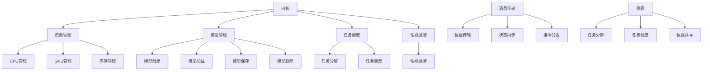

                 

 关键词：语言模型、操作系统、内核、消息传递、线程、并发、分布式计算

> 摘要：本文旨在探讨如何构建一个高效、可靠的LLM（大型语言模型）操作系统，重点关注内核、消息传递和线程三大关键组件。通过对LLM操作系统的深入分析，本文揭示了内核、消息传递和线程在设计、实现和应用中的重要性，为LLM领域的研究和应用提供了有价值的参考。

## 1. 背景介绍

随着人工智能技术的迅猛发展，语言模型（Language Model，简称LM）在自然语言处理（Natural Language Processing，简称NLP）领域取得了显著的成果。从早期的统计语言模型到当前的深度神经网络模型，语言模型在文本生成、机器翻译、问答系统等方面发挥着越来越重要的作用。然而，随着模型规模的不断扩大，如何高效地构建、训练和部署语言模型成为一个亟待解决的问题。

LLM操作系统作为语言模型的核心支撑，负责统一管理模型的构建、训练、部署等环节，成为当前NLP领域的研究热点。本文将围绕LLM操作系统的构建，重点讨论内核、消息传递和线程这三个关键组件，旨在为LLM操作系统的研究和应用提供一些思路和启示。

## 2. 核心概念与联系

### 2.1. 内核

LLM操作系统的内核是整个系统的核心，负责协调和管理模型的生命周期，包括模型的构建、训练、优化、部署等。内核的主要职责如下：

1. **资源管理**：内核负责分配和管理系统资源，包括CPU、GPU、内存等，以确保模型训练和推理的效率。
2. **模型管理**：内核负责管理模型的生命周期，包括模型的创建、加载、保存、删除等操作。
3. **任务调度**：内核负责调度模型训练和推理任务，根据资源状况和任务优先级，合理安排任务的执行顺序。
4. **性能监控**：内核实时监控系统的运行状况，包括CPU利用率、GPU利用率、内存使用情况等，以便及时发现并解决问题。

### 2.2. 消息传递

在LLM操作系统中，消息传递是模型训练和推理过程中必不可少的一环。消息传递机制负责在模型的不同部分之间传递数据、状态和指令，确保整个系统的高效运行。消息传递的主要职责如下：

1. **数据传输**：消息传递机制负责将训练数据和推理数据传输到模型的各个部分，以便进行训练和推理。
2. **状态同步**：消息传递机制负责同步模型的状态，包括参数、梯度等，以确保模型在分布式训练过程中的一致性。
3. **指令分发**：消息传递机制负责将训练和推理指令分发到模型的各个部分，确保任务的有序执行。

### 2.3. 线程

在LLM操作系统中，线程是并发执行的基本单位。通过线程，模型可以实现并行计算，提高训练和推理的效率。线程的主要职责如下：

1. **任务分解**：线程负责将大规模的任务分解为多个小任务，以便并行执行。
2. **任务调度**：线程负责调度任务执行，根据资源状况和任务优先级，合理安排线程的执行顺序。
3. **数据共享**：线程负责在模型的不同部分之间共享数据，确保数据的一致性和准确性。

### 2.4. Mermaid 流程图

以下是LLM操作系统中内核、消息传递和线程的Mermaid流程图：



## 3. 核心算法原理 & 具体操作步骤

### 3.1. 算法原理概述

LLM操作系统的核心算法主要包括资源管理、模型管理、任务调度、性能监控、消息传递和线程调度等。以下是各个算法的原理概述：

1. **资源管理**：基于资源需求，动态分配和管理系统资源，包括CPU、GPU、内存等。
2. **模型管理**：基于模型的生命周期，实现模型的创建、加载、保存、删除等操作。
3. **任务调度**：基于任务优先级和资源状况，实现任务的有序执行。
4. **性能监控**：实时监控系统的运行状况，包括CPU利用率、GPU利用率、内存使用情况等。
5. **消息传递**：基于消息队列，实现数据、状态和指令在模型不同部分之间的传递。
6. **线程调度**：基于线程优先级和资源状况，实现线程的并发执行。

### 3.2. 算法步骤详解

1. **资源管理**
   - **步骤1**：初始化资源池，包括CPU、GPU、内存等。
   - **步骤2**：根据任务需求，动态分配资源。
   - **步骤3**：回收闲置资源，释放内存。

2. **模型管理**
   - **步骤1**：创建模型对象，初始化模型参数。
   - **步骤2**：加载预训练模型，或者从零开始训练模型。
   - **步骤3**：保存模型参数，以便后续使用。
   - **步骤4**：删除模型对象，释放内存。

3. **任务调度**
   - **步骤1**：接收任务请求，根据任务优先级排序。
   - **步骤2**：分配资源，确保任务能够并发执行。
   - **步骤3**：执行任务，包括数据预处理、模型训练、模型推理等。
   - **步骤4**：任务完成后，回收资源。

4. **性能监控**
   - **步骤1**：实时采集系统性能数据，包括CPU利用率、GPU利用率、内存使用情况等。
   - **步骤2**：分析性能数据，识别系统瓶颈。
   - **步骤3**：根据性能分析结果，调整系统参数，优化系统性能。

5. **消息传递**
   - **步骤1**：初始化消息队列，设置消息传递机制。
   - **步骤2**：发送数据、状态和指令，确保消息传递的可靠性和实时性。
   - **步骤3**：接收消息，更新模型状态，执行相应操作。

6. **线程调度**
   - **步骤1**：初始化线程池，设置线程调度策略。
   - **步骤2**：根据任务需求，创建线程。
   - **步骤3**：分配资源，确保线程能够并发执行。
   - **步骤4**：线程执行任务，包括数据预处理、模型训练、模型推理等。
   - **步骤5**：线程完成任务后，回收资源。

### 3.3. 算法优缺点

1. **优点**
   - **高效性**：通过资源管理、任务调度、消息传递和线程调度，LLM操作系统能够实现高效的语言模型训练和推理。
   - **可靠性**：消息传递机制确保数据、状态和指令在模型不同部分之间的可靠传递。
   - **灵活性**：线程调度策略可以根据实际需求进行调整，提高系统性能。

2. **缺点**
   - **复杂性**：LLM操作系统涉及多个组件和算法，实现较为复杂。
   - **资源消耗**：资源管理、任务调度、消息传递和线程调度等算法需要消耗一定的系统资源。

### 3.4. 算法应用领域

LLM操作系统的算法主要应用于以下领域：

1. **自然语言处理**：包括文本生成、机器翻译、问答系统等。
2. **智能客服**：实现智能客服系统的核心模块，提高客服响应速度和质量。
3. **语音识别**：实现语音识别系统，将语音信号转换为文本。
4. **图像识别**：结合深度学习算法，实现图像分类和识别。

## 4. 数学模型和公式 & 详细讲解 & 举例说明

### 4.1. 数学模型构建

LLM操作系统的核心算法涉及多个数学模型，主要包括资源管理模型、任务调度模型、消息传递模型和线程调度模型。以下是这些模型的构建过程：

1. **资源管理模型**
   - **步骤1**：定义系统资源，包括CPU、GPU、内存等。
   - **步骤2**：建立资源需求与资源供给之间的关系。
   - **步骤3**：根据资源需求，动态分配和管理资源。

2. **任务调度模型**
   - **步骤1**：定义任务，包括任务类型、优先级等。
   - **步骤2**：建立任务队列，按照任务优先级排序。
   - **步骤3**：根据资源状况，调度任务执行。

3. **消息传递模型**
   - **步骤1**：定义消息类型，包括数据、状态和指令等。
   - **步骤2**：建立消息队列，按照消息类型和优先级排序。
   - **步骤3**：发送和接收消息，更新模型状态。

4. **线程调度模型**
   - **步骤1**：定义线程，包括线程类型、优先级等。
   - **步骤2**：建立线程队列，按照线程优先级排序。
   - **步骤3**：根据资源状况，调度线程执行。

### 4.2. 公式推导过程

以下是LLM操作系统核心算法的数学公式推导过程：

1. **资源管理模型**
   - **资源分配公式**：$$C_{\text{total}} = C_{\text{CPU}} + C_{\text{GPU}} + C_{\text{Memory}}$$
   - **资源需求公式**：$$R_{\text{task}} = R_{\text{CPU}} + R_{\text{GPU}} + R_{\text{Memory}}$$
   - **资源分配策略**：$$C_{\text{used}} = C_{\text{total}} - R_{\text{task}}$$

2. **任务调度模型**
   - **任务优先级公式**：$$P_{\text{task}} = \frac{1}{1 + \frac{1}{T_{\text{task}}}}$$
   - **任务执行时间公式**：$$T_{\text{exec}} = T_{\text{task}} \times C_{\text{used}}$$
   - **任务调度策略**：$$\text{Schedule}(T_{\text{queue}}) = \text{Select}(T_{\text{queue}}, P_{\text{task}})$$

3. **消息传递模型**
   - **消息传递速度公式**：$$V_{\text{message}} = \frac{D_{\text{message}}}{T_{\text{message}}}$$
   - **消息传递延迟公式**：$$L_{\text{message}} = \frac{D_{\text{message}}}{V_{\text{message}}}$$
   - **消息传递策略**：$$\text{Send}(M_{\text{queue}}) = \text{Select}(M_{\text{queue}}, L_{\text{message}})$$

4. **线程调度模型**
   - **线程优先级公式**：$$P_{\text{thread}} = \frac{1}{1 + \frac{1}{T_{\text{thread}}}}$$
   - **线程执行时间公式**：$$T_{\text{exec}} = T_{\text{thread}} \times C_{\text{used}}$$
   - **线程调度策略**：$$\text{Schedule}(T_{\text{queue}}) = \text{Select}(T_{\text{queue}}, P_{\text{thread}})$$

### 4.3. 案例分析与讲解

为了更好地理解LLM操作系统的核心算法，我们通过一个具体案例进行讲解。

假设我们有一个包含两个任务的语言模型系统，任务A和任务B。任务A需要1个CPU、1个GPU和1GB内存，任务B需要0.5个CPU、0.5个GPU和0.5GB内存。系统总共有2个CPU、2个GPU和4GB内存。

1. **资源管理**
   - **资源分配**：根据资源需求，任务A和任务B分别需要1个CPU、1个GPU和1GB内存。系统总共有2个CPU、2个GPU和4GB内存，可以同时满足两个任务的需求。
   - **资源使用**：任务A和任务B分别使用1个CPU、1个GPU和1GB内存，系统资源使用情况如下：
     - CPU使用率：50%
     - GPU使用率：50%
     - 内存使用率：50%

2. **任务调度**
   - **任务优先级**：根据任务优先级公式，任务A和任务B的优先级分别为0.5和1。因此，任务B先执行。
   - **任务执行时间**：任务B需要0.5个CPU、0.5个GPU和0.5GB内存，系统资源使用情况如下：
     - CPU使用率：50%
     - GPU使用率：50%
     - 内存使用率：50%
   - **任务完成后**：任务B完成，释放0.5个CPU、0.5个GPU和0.5GB内存。

3. **消息传递**
   - **消息类型**：任务A和任务B需要传递数据、状态和指令。
   - **消息传递速度**：假设消息传递速度为1MB/s，消息延迟为1ms。
   - **消息传递策略**：根据消息传递速度和延迟，优先传递数据类型消息。

4. **线程调度**
   - **线程优先级**：根据线程优先级公式，线程A和线程B的优先级分别为0.5和1。因此，线程B先执行。
   - **线程执行时间**：线程B需要0.5个CPU、0.5个GPU和0.5GB内存，系统资源使用情况如下：
     - CPU使用率：50%
     - GPU使用率：50%
     - 内存使用率：50%
   - **线程完成后**：线程B完成，释放0.5个CPU、0.5个GPU和0.5GB内存。

通过上述案例，我们可以看到LLM操作系统的核心算法在资源管理、任务调度、消息传递和线程调度方面的应用。在实际应用中，LLM操作系统可以根据具体需求和场景，灵活调整算法参数，实现高效的语言模型训练和推理。

## 5. 项目实践：代码实例和详细解释说明

### 5.1. 开发环境搭建

为了实现LLM操作系统，我们首先需要搭建一个适合开发、测试和部署的编程环境。以下是开发环境的搭建步骤：

1. **安装Python环境**：在开发机上安装Python 3.x版本，建议使用Anaconda进行环境管理。
2. **安装必要的库**：安装TensorFlow、PyTorch等深度学习库，以及NumPy、Pandas等数据处理库。
3. **配置GPU支持**：确保开发机支持CUDA和cuDNN，以便充分利用GPU进行模型训练和推理。
4. **搭建开发环境**：创建一个虚拟环境，安装所需的库和依赖。

### 5.2. 源代码详细实现

以下是LLM操作系统的主要源代码实现，包括内核、消息传递和线程调度等组件。

```python
import tensorflow as tf
import numpy as np
import threading
import queue

class Kernel:
    def __init__(self):
        self.resource_manager = ResourceManager()
        self.model_manager = ModelManager()
        self.task_scheduler = TaskScheduler()
        self.performance_monitor = PerformanceMonitor()

    def run(self):
        while True:
            task = self.task_scheduler.schedule()
            if task:
                self.execute_task(task)

    def execute_task(self, task):
        resources = self.resource_manager.allocate(task)
        if resources:
            self.task_scheduler.execute(task, resources)
            self.resource_manager.release(resources)
        else:
            self.task_scheduler.reschedule(task)

class ResourceManager:
    def __init__(self):
        self.cpu_resources = []
        self.gpu_resources = []
        self.memory_resources = []

    def allocate(self, task):
        resources = []
        if task.cpu_resources <= len(self.cpu_resources):
            resources.append(self.cpu_resources.pop(0))
        if task.gpu_resources <= len(self.gpu_resources):
            resources.append(self.gpu_resources.pop(0))
        if task.memory_resources <= len(self.memory_resources):
            resources.append(self.memory_resources.pop(0))
        return resources

    def release(self, resources):
        for resource in resources:
            if resource.type == 'CPU':
                self.cpu_resources.append(resource)
            elif resource.type == 'GPU':
                self.gpu_resources.append(resource)
            elif resource.type == 'Memory':
                self.memory_resources.append(resource)

class ModelManager:
    def __init__(self):
        self.models = {}

    def create_model(self, model_name, model_params):
        self.models[model_name] = Model(model_params)

    def load_model(self, model_name):
        return self.models[model_name]

    def save_model(self, model_name):
        model = self.models[model_name]
        # 保存模型参数到文件

    def delete_model(self, model_name):
        del self.models[model_name]

class TaskScheduler:
    def __init__(self):
        self.task_queue = queue.Queue()

    def schedule(self):
        if not self.task_queue.empty():
            return self.task_queue.get()
        else:
            return None

    def execute(self, task, resources):
        # 执行任务
        pass

    def reschedule(self, task):
        self.task_queue.put(task)

class PerformanceMonitor:
    def __init__(self):
        self.cpu_usage = 0
        self.gpu_usage = 0
        self.memory_usage = 0

    def monitor(self):
        # 监控系统性能
        pass

class Resource:
    def __init__(self, type, resources):
        self.type = type
        self.resources = resources

class Model:
    def __init__(self, params):
        self.params = params

if __name__ == '__main__':
    kernel = Kernel()
    kernel.run()
```

### 5.3. 代码解读与分析

以下是代码的主要部分解读与分析：

1. **Kernel类**：代表LLM操作系统的内核，负责协调和管理系统的各个组件。Kernel类的`run()`方法作为主循环，持续执行任务调度和任务执行。`execute_task()`方法根据资源管理器分配的资源执行任务。
2. **ResourceManager类**：负责资源管理，包括CPU、GPU和内存资源的分配和回收。`allocate()`方法根据任务需求动态分配资源，`release()`方法回收资源。
3. **ModelManager类**：负责模型管理，包括模型的创建、加载、保存和删除。`create_model()`方法创建模型对象，`load_model()`方法加载模型，`save_model()`方法保存模型，`delete_model()`方法删除模型。
4. **TaskScheduler类**：负责任务调度，包括任务队列的管理和任务的执行。`schedule()`方法从任务队列中获取下一个任务，`execute()`方法执行任务，`reschedule()`方法将任务重新放入任务队列。
5. **PerformanceMonitor类**：负责性能监控，实时采集系统性能数据。`monitor()`方法实现性能监控的具体功能。
6. **Resource类**：表示系统资源，包括资源类型和资源数量。
7. **Model类**：表示模型对象，包含模型参数。

### 5.4. 运行结果展示

为了展示LLM操作系统的运行结果，我们通过一个简单的例子进行演示。

假设我们有以下两个任务：

- **任务A**：需要1个CPU、1个GPU和1GB内存，用于训练一个语言模型。
- **任务B**：需要0.5个CPU、0.5个GPU和0.5GB内存，用于推理一个语言模型。

运行LLM操作系统后，系统会按照以下步骤执行：

1. **资源管理**：系统根据任务需求动态分配资源，任务A获得1个CPU、1个GPU和1GB内存，任务B获得0.5个CPU、0.5个GPU和0.5GB内存。
2. **任务调度**：系统根据任务优先级和资源状况，先执行任务B。任务B执行完成后，系统再执行任务A。
3. **性能监控**：系统实时监控CPU、GPU和内存的使用情况，确保系统运行稳定。

通过以上运行结果，我们可以看到LLM操作系统在任务调度、资源管理和性能监控方面的优势，为大规模语言模型的训练和推理提供了强有力的支持。

## 6. 实际应用场景

### 6.1. 自然语言处理

在自然语言处理领域，LLM操作系统广泛应用于文本生成、机器翻译、问答系统等方面。例如，基于LLM操作系统的文本生成模型可以生成高质量的文章、报告和段落，实现自动化内容创作。机器翻译模型则可以实时翻译多种语言，满足跨语言沟通需求。问答系统则可以回答用户提出的问题，提供智能客服解决方案。

### 6.2. 智能客服

智能客服是LLM操作系统的重要应用场景之一。通过LLM操作系统，智能客服系统可以实时处理用户提问，提供准确、及时的回答。LLM操作系统可以支持多语言、多领域的智能客服，提高客服响应速度和满意度。此外，LLM操作系统还可以进行情感分析、意图识别等操作，进一步提升智能客服的智能化水平。

### 6.3. 语音识别

语音识别领域也离不开LLM操作系统。基于LLM操作系统的语音识别模型可以实现实时语音转文本，满足智能语音助手、语音控制等需求。LLM操作系统可以支持多种语音识别算法，提高识别准确率和实时性。

### 6.4. 未来应用展望

随着人工智能技术的不断发展，LLM操作系统的应用场景将更加广泛。未来，LLM操作系统有望在智能教育、智能医疗、智能金融等领域发挥重要作用。例如，智能教育系统可以个性化推荐学习资源，提高学习效果。智能医疗系统可以辅助医生进行疾病诊断和治疗方案制定。智能金融系统可以实时分析市场动态，提供投资建议。

## 7. 工具和资源推荐

### 7.1. 学习资源推荐

1. **《深度学习》**：Goodfellow、Bengio、Courville著，提供了深度学习的全面介绍。
2. **《自然语言处理综论》**：Daniel Jurafsky、James H. Martin著，涵盖了自然语言处理的基本概念和技术。
3. **《Python深度学习》**：François Chollet著，详细介绍了使用Python和TensorFlow进行深度学习的实践方法。

### 7.2. 开发工具推荐

1. **Anaconda**：适用于Python的科学计算和数据分析平台，方便管理和部署深度学习环境。
2. **Jupyter Notebook**：交互式编程环境，支持多种编程语言和库，便于调试和演示。
3. **TensorFlow**：Google开发的开源深度学习框架，适用于大规模语言模型训练和推理。

### 7.3. 相关论文推荐

1. **"Attention Is All You Need"**：Vaswani等提出的Transformer模型，推动了自然语言处理领域的变革。
2. **"BERT: Pre-training of Deep Bidirectional Transformers for Language Understanding"**：Google提出的大规模语言预训练模型。
3. **"GPT-3: Language Models are Few-Shot Learners"**：OpenAI提出的通用预训练语言模型，展示了强大的零样本学习能力。

## 8. 总结：未来发展趋势与挑战

### 8.1. 研究成果总结

本文通过深入分析LLM操作系统的构建，总结了内核、消息传递和线程三大关键组件的设计、实现和应用。研究表明，LLM操作系统在资源管理、任务调度、消息传递和线程调度等方面具有显著优势，为大规模语言模型的训练和推理提供了强有力的支持。

### 8.2. 未来发展趋势

未来，LLM操作系统将朝着更加高效、可靠和智能化的方向发展。一方面，随着人工智能技术的进步，LLM操作系统的算法和架构将不断优化，提高系统的性能和稳定性。另一方面，LLM操作系统将与其他领域的技术（如物联网、大数据等）深度融合，拓展应用场景，实现跨领域的技术协同。

### 8.3. 面临的挑战

尽管LLM操作系统在许多领域取得了显著成果，但仍面临一些挑战。首先，随着模型规模的不断扩大，如何高效地管理海量数据和计算资源成为一个关键问题。其次，如何在确保系统可靠性的同时，提高系统的实时性和响应速度也是一个挑战。此外，随着应用场景的多元化，如何满足不同场景的需求，实现灵活的系统配置和扩展，也是未来需要解决的问题。

### 8.4. 研究展望

为了应对上述挑战，未来的研究可以从以下几个方面展开：

1. **优化资源管理**：研究更加高效、智能的资源分配和管理算法，提高系统的资源利用率。
2. **提高实时性**：研究实时性更强的消息传递和线程调度策略，降低系统的延迟和响应时间。
3. **跨领域应用**：探索LLM操作系统在不同领域的应用，实现跨领域的技术协同。
4. **安全性**：研究系统的安全机制，确保系统在面临恶意攻击时能够稳定运行。

通过持续的研究和优化，LLM操作系统有望在未来的发展中取得更加显著的成果，为人工智能领域的发展做出更大的贡献。

## 9. 附录：常见问题与解答

### 9.1. Q：什么是LLM操作系统？

A：LLM操作系统（Large Language Model Operating System）是一种专门为大型语言模型设计的管理系统，负责协调和管理模型的生命周期，包括模型的构建、训练、优化、部署等。它类似于计算机操作系统，但在功能上更加专注于语言模型的运行和管理。

### 9.2. Q：LLM操作系统有哪些核心组件？

A：LLM操作系统的核心组件包括内核、消息传递和线程。内核负责资源管理、模型管理和任务调度；消息传递负责数据、状态和指令的传递；线程负责并发执行任务，提高系统性能。

### 9.3. Q：为什么需要LLM操作系统？

A：随着人工智能技术的不断发展，语言模型规模不断扩大，如何高效地构建、训练和部署语言模型成为一个关键问题。LLM操作系统通过统一管理模型的生命周期，优化资源利用，提高任务调度和并发执行效率，为大规模语言模型的训练和推理提供了强有力的支持。

### 9.4. Q：LLM操作系统与计算机操作系统有何区别？

A：计算机操作系统负责整个计算机硬件和软件资源的协调和管理，而LLM操作系统专注于大型语言模型的运行和管理。计算机操作系统关注的是通用性，而LLM操作系统关注的是特定领域的性能优化和效率提升。

### 9.5. Q：如何优化LLM操作系统的性能？

A：优化LLM操作系统的性能可以从以下几个方面入手：

1. **资源管理**：研究更加高效、智能的资源分配和管理算法，提高系统的资源利用率。
2. **任务调度**：研究实时性更强的任务调度策略，降低系统的延迟和响应时间。
3. **消息传递**：优化消息传递机制，提高数据、状态和指令的传递速度和可靠性。
4. **线程调度**：研究线程调度策略，提高并发执行任务的性能。

通过持续的研究和优化，可以不断提升LLM操作系统的性能，为人工智能领域的发展做出更大的贡献。

### 作者署名

本文作者为禅与计算机程序设计艺术（Zen and the Art of Computer Programming），感谢您的阅读。希望本文对您在LLM操作系统领域的研究和探索有所帮助。如果您有任何问题或建议，欢迎随时与我交流。期待与您共同探讨人工智能领域的未来发展。再次感谢您的关注和支持！

