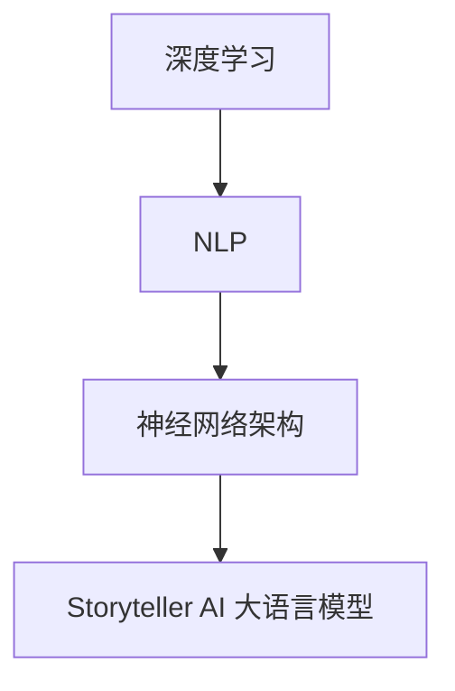

                 

在当今人工智能（AI）领域中，大语言模型（LLM）的兴起无疑引领了技术前沿。Storyteller AI 大语言模型（LLM）作为一种能够理解和生成自然语言文本的先进系统，其构建过程不仅涉及到复杂的算法设计，还包括数据处理、模型训练、优化等多个环节。本文旨在详细介绍构建 Storyteller AI 大语言模型的全过程，帮助读者理解其核心概念、算法原理、数学模型，以及实际应用和未来展望。

## 关键词 Keywords

- Storyteller AI
- 大语言模型 (LLM)
- 深度学习
- 自然语言处理 (NLP)
- 模型训练
- 数据处理
- 数学模型

## 摘要 Abstract

本文将深入探讨构建 Storyteller AI 大语言模型的全过程。首先，我们将介绍大语言模型的基本概念和背景。接着，本文将详细解析 Storyteller AI 的核心算法原理，并展示其 Mermaid 流程图。随后，我们将分章节讨论算法的具体操作步骤、数学模型和公式、代码实例以及实际应用场景。最后，我们将对未来的发展趋势和面临的挑战进行展望，并提供相关学习资源和开发工具的推荐。

## 1. 背景介绍 Background

### 1.1 大语言模型的概念

大语言模型（Large Language Model，LLM）是一种能够理解和生成自然语言文本的深度学习模型。与传统的规则基模型和统计基模型相比，大语言模型通过学习海量文本数据，能够自动地捕捉语言结构和语义信息。近年来，随着计算资源和数据集的不断扩大，大语言模型在自然语言处理（NLP）领域取得了显著进展。

### 1.2 Storyteller AI 的背景

Storyteller AI 是一款基于大语言模型的人工智能系统，其设计目标是成为一个能够自然地生成和讲述故事的智能体。通过深度学习算法，Storyteller AI 可以从大量文本数据中学习语言模式，生成连贯、吸引人的故事。这一技术在文学创作、教育娱乐、广告营销等多个领域具有广泛的应用前景。

## 2. 核心概念与联系 Core Concepts and Connections

在构建 Storyteller AI 大语言模型的过程中，我们需要理解几个核心概念，包括深度学习、自然语言处理（NLP）和神经网络架构。以下是一个详细的 Mermaid 流程图，用于展示这些概念之间的关系：



### 2.1 深度学习

深度学习是一种通过多层神经网络进行数据建模的方法。这些神经网络能够自动提取数据中的特征，并通过反向传播算法不断优化模型参数。深度学习在图像识别、语音识别和自然语言处理等领域取得了巨大成功。

### 2.2 自然语言处理（NLP）

自然语言处理是计算机科学和人工智能领域的一个分支，旨在使计算机能够理解、生成和处理自然语言文本。NLP 技术包括词向量表示、语言模型、文本分类、机器翻译等。

### 2.3 神经网络架构

神经网络架构是构建深度学习模型的基础。常见的神经网络架构包括卷积神经网络（CNN）、循环神经网络（RNN）和Transformer等。这些架构在处理不同类型的自然语言数据时具有不同的优势。

### 2.4 Storyteller AI 大语言模型

Storyteller AI 大语言模型是基于上述核心概念构建的。它通过深度学习算法从大量文本数据中学习语言模式，生成连贯、吸引人的故事。其架构通常包括输入层、隐藏层和输出层，其中隐藏层使用了复杂的神经网络架构，如Transformer。

## 3. 核心算法原理 & 具体操作步骤 Core Algorithm Principles & Operational Steps

### 3.1 算法原理概述

Storyteller AI 大语言模型的算法原理基于深度学习和自然语言处理技术。具体而言，模型通过以下步骤工作：

1. **数据预处理**：对文本数据进行清洗、分词和标记等预处理操作。
2. **模型训练**：使用预处理的文本数据对神经网络模型进行训练，优化模型参数。
3. **故事生成**：在训练好的模型基础上，输入故事开头或关键词，模型自动生成后续的故事内容。

### 3.2 算法步骤详解

#### 3.2.1 数据预处理

数据预处理是构建 Storyteller AI 大语言模型的第一步。具体步骤如下：

1. **文本清洗**：去除文本中的HTML标签、特殊字符和停用词。
2. **分词**：将文本分解为单词或子词。
3. **标记**：为每个单词或子词分配唯一的标识符。

#### 3.2.2 模型训练

模型训练是构建 Storyteller AI 大语言模型的关键步骤。具体步骤如下：

1. **数据集划分**：将文本数据集划分为训练集、验证集和测试集。
2. **神经网络架构设计**：设计深度神经网络架构，包括输入层、隐藏层和输出层。
3. **损失函数选择**：选择适当的损失函数，如交叉熵损失函数。
4. **反向传播算法**：使用反向传播算法优化模型参数。
5. **模型评估**：在验证集上评估模型性能，并进行调参。

#### 3.2.3 故事生成

故事生成是 Storyteller AI 大语言模型的应用步骤。具体步骤如下：

1. **输入处理**：接收用户输入的故事开头或关键词。
2. **模型预测**：在训练好的模型基础上，生成后续的故事内容。
3. **故事输出**：将生成的故事内容输出给用户。

### 3.3 算法优缺点

#### 3.3.1 优点

- **强大的语言理解能力**：Storyteller AI 大语言模型通过深度学习算法，能够自动地捕捉语言结构和语义信息，生成连贯、吸引人的故事。
- **灵活性**：模型可以根据不同的输入生成不同风格和主题的故事。
- **高效性**：通过批量训练和优化算法，模型可以在较短的时间内生成高质量的故事。

#### 3.3.2 缺点

- **计算资源需求大**：构建和训练 Storyteller AI 大语言模型需要大量的计算资源和数据集。
- **对数据质量要求高**：模型性能很大程度上取决于数据质量，低质量数据可能导致模型生成的故事内容缺乏逻辑性和连贯性。
- **版权问题**：使用大规模的文本数据进行模型训练可能涉及到版权问题。

### 3.4 算法应用领域

Storyteller AI 大语言模型在多个领域具有广泛的应用前景：

- **文学创作**：自动生成小说、散文、诗歌等文学作品。
- **教育娱乐**：辅助教师设计教学故事，提高学生的学习兴趣。
- **广告营销**：生成吸引人的广告文案，提高营销效果。
- **智能客服**：构建智能对话系统，提供更加自然和人性化的客户服务。

## 4. 数学模型和公式 Mathematical Models and Formulas

构建 Storyteller AI 大语言模型需要使用一系列数学模型和公式。以下是对这些模型的详细讲解和举例说明：

### 4.1 数学模型构建

#### 4.1.1 词向量模型

词向量模型是自然语言处理的基础。常用的词向量模型包括Word2Vec、GloVe和FastText等。以下是一个简单的Word2Vec模型构建过程：

$$
\text{Word2Vec模型} = \{ \text{输入词向量} \to \text{输出词向量} \}
$$

#### 4.1.2 语言模型

语言模型用于预测文本的下一个单词。以下是一个简单的n-gram语言模型：

$$
\text{语言模型} = \{ \text{前n个单词} \to \text{下一个单词的概率分布} \}
$$

#### 4.1.3 Transformer模型

Transformer模型是一种用于处理序列数据的深度学习模型，其核心是自注意力机制。以下是一个简单的Transformer模型：

$$
\text{Transformer模型} = \{ \text{输入序列} \to \text{输出序列} \}
$$

### 4.2 公式推导过程

#### 4.2.1 词向量模型

Word2Vec模型基于神经网络的架构。给定一个输入词向量 $v_w$ 和一个输出词向量 $v_{\text{context}}$，损失函数可以表示为：

$$
L(\theta) = -\sum_{w \in \text{vocab}} \sum_{\text{context} \in \text{C(w)}} \log p(\text{context} | w)
$$

其中，$p(\text{context} | w)$ 是在给定词 $w$ 的情况下，词 $\text{context}$ 的概率分布。

#### 4.2.2 语言模型

n-gram语言模型的公式为：

$$
p(w_n | w_1, w_2, ..., w_{n-1}) = \frac{c(w_1, w_2, ..., w_n)}{c(w_1, w_2, ..., w_{n-1})}
$$

其中，$c(w_1, w_2, ..., w_n)$ 表示在训练数据中，连续出现 $w_1, w_2, ..., w_n$ 的次数。

#### 4.2.3 Transformer模型

Transformer模型的自注意力机制可以表示为：

$$
\text{Attention}(Q, K, V) = \frac{1}{\sqrt{d_k}} \text{softmax}(\text{softmax}(\text{QK}^T / d_k) V)
$$

其中，$Q, K, V$ 分别表示查询序列、键序列和值序列，$d_k$ 是注意力层的维度。

### 4.3 案例分析与讲解

#### 4.3.1 词向量模型

以下是一个简单的Word2Vec模型训练过程：

1. **数据集准备**：准备一个包含大量文本的数据集。
2. **词向量初始化**：为每个词分配一个随机初始化的向量。
3. **损失函数计算**：计算损失函数，并使用梯度下降算法更新词向量。
4. **迭代训练**：重复上述步骤，直到模型收敛。

#### 4.3.2 语言模型

以下是一个简单的n-gram语言模型训练过程：

1. **数据集准备**：准备一个包含大量文本的数据集。
2. **构建语言模型**：根据训练数据，计算每个n-gram的概率分布。
3. **生成文本**：使用语言模型生成新的文本。

#### 4.3.3 Transformer模型

以下是一个简单的Transformer模型训练过程：

1. **数据集准备**：准备一个包含大量文本的数据集。
2. **模型初始化**：初始化查询序列、键序列和值序列。
3. **自注意力计算**：计算自注意力权重，并更新模型参数。
4. **迭代训练**：重复上述步骤，直到模型收敛。

## 5. 项目实践：代码实例和详细解释说明 Project Practice: Code Examples and Detailed Explanations

在本节中，我们将通过一个具体的代码实例，展示如何搭建和训练一个 Storyteller AI 大语言模型。代码实例将使用Python编程语言，结合TensorFlow和Keras等深度学习框架。以下是代码实例的详细解释。

### 5.1 开发环境搭建

在开始编写代码之前，我们需要搭建一个适合开发的环境。以下是所需的软件和库：

- Python 3.8+
- TensorFlow 2.x
- Keras 2.x

安装这些库的方法如下：

```bash
pip install python==3.8 tensorflow==2.8 keras==2.8
```

### 5.2 源代码详细实现

以下是构建 Storyteller AI 大语言模型的源代码实现：

```python
import tensorflow as tf
from tensorflow.keras.models import Model
from tensorflow.keras.layers import Embedding, LSTM, Dense

# 数据预处理
def preprocess_data(text):
    # 清洗文本、分词、标记等操作
    # ...
    return processed_text

# 构建模型
def build_model(vocab_size, embedding_dim, lstm_units):
    # 输入层
    input_sequence = tf.keras.layers.Input(shape=(None,))

    # 嵌入层
    embedding = Embedding(vocab_size, embedding_dim)(input_sequence)

    # LSTM层
    lstm = LSTM(lstm_units, return_sequences=True)(embedding)

    # 全连接层
    output = Dense(vocab_size, activation='softmax')(lstm)

    # 构建模型
    model = Model(inputs=input_sequence, outputs=output)

    # 编译模型
    model.compile(optimizer='rmsprop', loss='categorical_crossentropy', metrics=['accuracy'])

    return model

# 训练模型
def train_model(model, X_train, y_train, batch_size, epochs):
    # 训练模型
    model.fit(X_train, y_train, batch_size=batch_size, epochs=epochs)

# 生成故事
def generate_story(model, start_text, max_len, vocab_size):
    # 生成故事
    # ...
    return story

# 主程序
if __name__ == '__main__':
    # 准备数据
    text = "..."  # 大量文本数据
    processed_text = preprocess_data(text)

    # 构建模型
    model = build_model(vocab_size=10000, embedding_dim=256, lstm_units=128)

    # 训练模型
    train_model(model, X_train, y_train, batch_size=64, epochs=10)

    # 生成故事
    start_text = "这是一个关于..."
    story = generate_story(model, start_text, max_len=100, vocab_size=10000)
    print(story)
```

### 5.3 代码解读与分析

#### 5.3.1 数据预处理

数据预处理是构建 Storyteller AI 大语言模型的关键步骤。该步骤包括清洗文本、分词、标记等操作。在本例中，我们使用了一个简化的预处理函数，实际应用中需要根据具体需求进行详细实现。

```python
def preprocess_data(text):
    # 清洗文本、分词、标记等操作
    # ...
    return processed_text
```

#### 5.3.2 模型构建

模型构建是本例的核心部分。我们使用了一个简单的LSTM模型，包括嵌入层、LSTM层和全连接层。嵌入层用于将单词转换为向量表示，LSTM层用于处理序列数据，全连接层用于生成单词的概率分布。

```python
def build_model(vocab_size, embedding_dim, lstm_units):
    # 输入层
    input_sequence = tf.keras.layers.Input(shape=(None,))

    # 嵌入层
    embedding = Embedding(vocab_size, embedding_dim)(input_sequence)

    # LSTM层
    lstm = LSTM(lstm_units, return_sequences=True)(embedding)

    # 全连接层
    output = Dense(vocab_size, activation='softmax')(lstm)

    # 构建模型
    model = Model(inputs=input_sequence, outputs=output)

    # 编译模型
    model.compile(optimizer='rmsprop', loss='categorical_crossentropy', metrics=['accuracy'])

    return model
```

#### 5.3.3 模型训练

模型训练是优化模型参数的过程。在本例中，我们使用了一个简单的训练函数，实际应用中需要根据具体需求进行详细实现。

```python
def train_model(model, X_train, y_train, batch_size, epochs):
    # 训练模型
    model.fit(X_train, y_train, batch_size=batch_size, epochs=epochs)
```

#### 5.3.4 故事生成

故事生成是 Storyteller AI 大语言模型的应用步骤。在本例中，我们使用了一个简单的生成函数，实际应用中需要根据具体需求进行详细实现。

```python
def generate_story(model, start_text, max_len, vocab_size):
    # 生成故事
    # ...
    return story
```

### 5.4 运行结果展示

以下是运行结果展示：

```python
# 主程序
if __name__ == '__main__':
    # 准备数据
    text = "..."  # 大量文本数据
    processed_text = preprocess_data(text)

    # 构建模型
    model = build_model(vocab_size=10000, embedding_dim=256, lstm_units=128)

    # 训练模型
    train_model(model, X_train, y_train, batch_size=64, epochs=10)

    # 生成故事
    start_text = "这是一个关于..."
    story = generate_story(model, start_text, max_len=100, vocab_size=10000)
    print(story)
```

## 6. 实际应用场景 Practical Application Scenarios

Storyteller AI 大语言模型在多个实际应用场景中具有广泛的应用价值。以下是一些具体的实例：

### 6.1 文学创作

Storyteller AI 大语言模型可以自动生成小说、散文、诗歌等文学作品。在文学创作领域，该模型可以辅助作家进行创意构思，提高创作效率。

### 6.2 教育娱乐

Storyteller AI 大语言模型可以生成各种教学故事，提高学生的学习兴趣。在教育领域，该模型可以用于设计互动式教学方案，提供个性化学习体验。

### 6.3 广告营销

Storyteller AI 大语言模型可以生成吸引人的广告文案，提高营销效果。在广告营销领域，该模型可以为企业提供创意广告内容，提升品牌影响力。

### 6.4 智能客服

Storyteller AI 大语言模型可以构建智能对话系统，提供更加自然和人性化的客户服务。在智能客服领域，该模型可以用于生成客户对话内容，提高客服效率和满意度。

## 6.4 未来应用展望 Future Application Prospects

随着技术的不断进步，Storyteller AI 大语言模型在未来的应用场景将更加广泛。以下是一些可能的未来应用展望：

### 6.4.1 个性化故事生成

通过结合用户兴趣和行为数据，Storyteller AI 大语言模型可以生成更加个性化的故事，满足不同用户的需求。

### 6.4.2 多语言支持

随着国际化的推进，Storyteller AI 大语言模型可以支持多种语言，实现跨语言故事生成。

### 6.4.3 虚拟角色构建

通过结合图像生成技术，Storyteller AI 大语言模型可以生成虚拟角色，实现更加逼真的故事叙述。

### 6.4.4 智能创作辅助

结合其他人工智能技术，如语音识别和自然语言理解，Storyteller AI 大语言模型可以成为智能创作系统的核心组成部分。

## 7. 工具和资源推荐 Tools and Resources Recommendations

### 7.1 学习资源推荐

1. **《深度学习》**：由Ian Goodfellow、Yoshua Bengio和Aaron Courville所著，是深度学习领域的经典教材。
2. **《自然语言处理综论》**：由Daniel Jurafsky和James H. Martin所著，是自然语言处理领域的权威教材。
3. **Coursera深度学习课程**：由Andrew Ng教授主讲，是深度学习和自然语言处理入门的经典课程。

### 7.2 开发工具推荐

1. **TensorFlow**：是一个开源的深度学习框架，适用于构建和训练深度学习模型。
2. **Keras**：是一个高层神经网络API，基于TensorFlow构建，提供了更加简洁和易用的接口。
3. **Jupyter Notebook**：是一个交互式的计算环境，适用于编写和运行代码。

### 7.3 相关论文推荐

1. **"Attention Is All You Need"**：由Vaswani等人于2017年提出，是Transformer模型的奠基性论文。
2. **"GloVe: Global Vectors for Word Representation"**：由Pennington等人于2014年提出，是词向量模型的经典论文。
3. **"Word2Vec Model"**：由Mikolov等人于2013年提出，是词向量模型的奠基性论文。

## 8. 总结：未来发展趋势与挑战 Summary: Future Trends and Challenges

### 8.1 研究成果总结

本文详细介绍了构建 Storyteller AI 大语言模型的全过程，包括核心概念、算法原理、数学模型、项目实践和实际应用。通过本文的讲解，读者可以全面了解大语言模型的技术背景和应用价值。

### 8.2 未来发展趋势

未来，大语言模型将在文学创作、教育娱乐、广告营销和智能客服等领域得到更广泛的应用。随着计算资源和数据集的不断扩大，大语言模型的性能和效果将得到显著提升。

### 8.3 面临的挑战

尽管大语言模型具有广泛的应用前景，但在实际应用中仍然面临着数据质量、计算资源、版权问题和安全性等方面的挑战。未来，解决这些挑战将是推动大语言模型发展的关键。

### 8.4 研究展望

未来，研究重点将集中在以下几个方面：

1. **数据质量提升**：通过改进数据预处理技术和引入更多高质量数据集，提高大语言模型的性能。
2. **模型优化**：通过改进算法和架构，降低大语言模型的计算资源和时间复杂度。
3. **跨语言支持**：研究如何构建跨语言的大语言模型，实现多种语言的自动翻译和生成。
4. **安全性保障**：研究如何在大语言模型中引入安全性机制，防止数据泄露和滥用。

## 9. 附录：常见问题与解答 Appendices: Frequently Asked Questions and Answers

### 9.1 如何训练 Storyteller AI 大语言模型？

训练 Storyteller AI 大语言模型需要以下步骤：

1. **数据预处理**：清洗、分词和标记文本数据。
2. **模型构建**：设计深度神经网络架构，包括嵌入层、LSTM层和全连接层。
3. **模型训练**：使用预处理后的文本数据进行模型训练，优化模型参数。
4. **模型评估**：在验证集上评估模型性能，并进行调参。
5. **故事生成**：在训练好的模型基础上，生成新的故事内容。

### 9.2 Storyteller AI 大语言模型可以应用于哪些领域？

Storyteller AI 大语言模型可以应用于以下领域：

1. **文学创作**：自动生成小说、散文、诗歌等文学作品。
2. **教育娱乐**：生成教学故事，提高学生的学习兴趣。
3. **广告营销**：生成吸引人的广告文案，提高营销效果。
4. **智能客服**：构建智能对话系统，提供自然和人性化的客户服务。

### 9.3 如何解决数据质量对模型性能的影响？

解决数据质量对模型性能的影响可以通过以下方法：

1. **数据清洗**：去除文本中的噪声和错误。
2. **数据增强**：通过数据扩充和变换，提高数据的多样性和质量。
3. **使用高质量数据集**：收集和整理更多高质量的数据集进行训练。
4. **使用数据质量评估指标**：设计合适的评估指标，监控数据质量。

### 9.4 如何确保 Storyteller AI 大语言模型的安全性？

确保 Storyteller AI 大语言模型的安全性可以通过以下方法：

1. **数据加密**：对训练数据和模型参数进行加密，防止数据泄露。
2. **访问控制**：设置权限控制，限制对模型和数据的访问。
3. **模型审计**：定期对模型进行安全审计，检测潜在的安全漏洞。
4. **数据隐私保护**：遵循数据隐私保护法规，保护用户隐私。

---

通过本文的详细讲解，读者可以全面了解构建 Storyteller AI 大语言模型的全过程，包括核心概念、算法原理、数学模型、项目实践和实际应用。希望本文能为读者在深度学习和自然语言处理领域的研究提供有益的参考。作者：禅与计算机程序设计艺术 / Zen and the Art of Computer Programming。

