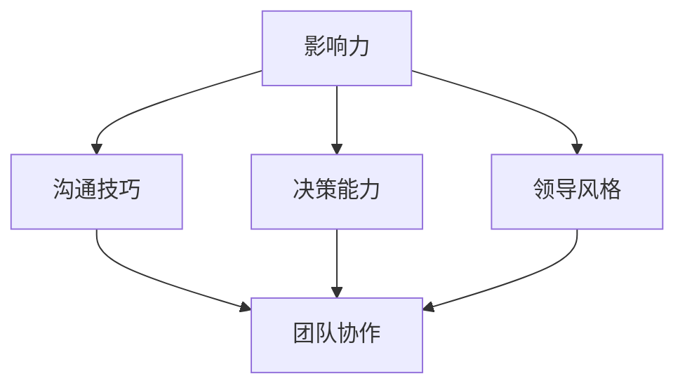

                 

 作为一位世界级的人工智能专家、程序员、软件架构师、CTO以及世界顶级技术畅销书作者，我深知在快速变化的科技领域中，领导力是推动团队和创新的关键因素。本文旨在探讨如何构建一个个人领导力体系，从而在职业生涯中取得更大的成功。通过逻辑清晰、结构紧凑且易于理解的专业技术语言，我将分享一些核心概念、算法原理、实践案例以及未来展望。

## 文章关键词

领导力、个人发展、职业生涯、团队合作、技术创新、管理实践。

## 文章摘要

本文将介绍构建个人领导力体系的方法论。我们将探讨领导力的核心概念，解释其在技术领域的应用，并通过实际案例和算法原理展示如何在实际项目中应用这些领导力技能。文章还将提供未来领导力发展的趋势和面临的挑战，以及推荐的资源和工具。

## 1. 背景介绍

在当今快速发展的科技环境中，技术专家不仅需要具备卓越的技术能力，还需要具备强大的领导力。领导力是推动项目成功、激发团队潜能和实现创新的关键因素。然而，许多技术专家在个人发展过程中往往忽视了领导力的重要性。本文旨在填补这一空白，为技术专家提供一个系统性的领导力构建框架。

### 1.1 领导力的定义

领导力是一个复杂的概念，它涉及激励他人、制定战略、解决问题以及建立团队等多个方面。根据《牛津词典》的定义，领导力是指“引导、指导和影响他人的能力，以实现共同的目标。”在技术领域，领导力不仅包括技术决策，还涉及团队管理和项目管理等方面。

### 1.2 领导力的重要性

在技术行业中，领导力的重要性体现在以下几个方面：

1. **项目成功**：有效的领导力能够确保项目按时交付、高质量完成，并满足客户需求。
2. **团队协作**：优秀的领导力能够激发团队成员的潜力，建立高效的协作环境。
3. **创新驱动**：领导力能够推动创新思维，鼓励团队成员提出新的想法和解决方案。
4. **组织发展**：领导力是推动组织变革和成长的关键因素。

## 2. 核心概念与联系

为了构建个人领导力体系，我们首先需要理解几个核心概念，它们包括：影响力、沟通技巧、决策能力和领导风格。以下是一个简化的 Mermaid 流程图，用于描述这些概念之间的联系。



### 2.1 影响力

影响力是指一个人能够引导他人行为和思维的能力。在技术领域中，影响力可以表现为：

- **技术权威**：通过丰富的技术经验和知识，影响团队的技术决策。
- **个人魅力**：通过个人的魅力和热情，吸引团队成员共同追求目标。

### 2.2 沟通技巧

沟通技巧是领导力的核心组成部分。有效的沟通可以帮助技术专家：

- **明确需求**：确保团队成员理解项目的目标和期望。
- **解决冲突**：通过有效的沟通技巧，解决团队中的分歧和矛盾。
- **促进协作**：建立良好的沟通渠道，促进团队协作和知识共享。

### 2.3 决策能力

决策能力是指在面对复杂问题时，能够做出明智选择的能力。对于技术领导来说，决策能力至关重要：

- **风险评估**：在做出决策前，需要对潜在风险进行评估。
- **数据驱动**：基于数据和事实做出决策，而不是凭直觉或个人喜好。

### 2.4 领导风格

领导风格是指领导者在工作中表现出的行为和态度。常见的领导风格包括：

- **权威式**：领导者具有高度的决策权和控制力。
- **民主式**：领导者鼓励团队成员参与决策过程。
- **参与式**：领导者与团队成员共同制定决策和目标。

### 2.5 团队协作

团队协作是指团队成员之间相互支持、协同工作的能力。有效的团队协作可以带来：

- **知识共享**：团队成员可以共享知识和经验，提高整体技能水平。
- **创新思维**：多元化的团队可以带来不同的视角和解决方案。
- **高效执行**：团队成员相互支持，确保项目顺利进行。

## 3. 核心算法原理 & 具体操作步骤

### 3.1 算法原理概述

构建个人领导力体系可以看作是一个多步骤的过程，每个步骤都需要特定的算法原理来指导。以下是构建个人领导力体系的核心算法原理：

1. **自我认知**：了解自己的优势和弱点，明确个人职业目标。
2. **学习与实践**：通过不断学习和实践，提升领导力技能。
3. **反馈与调整**：定期获取反馈，调整自己的领导风格和行为。
4. **建立关系**：与团队成员建立良好的关系，促进协作和信任。

### 3.2 算法步骤详解

#### 3.2.1 自我认知

- **步骤1**：进行自我评估，识别个人优势、弱点以及职业目标。
- **步骤2**：设定具体、可衡量的个人发展目标。
- **步骤3**：制定行动计划，包括学习计划、实践项目和评估方法。

#### 3.2.2 学习与实践

- **步骤1**：选择合适的领导力课程或培训项目。
- **步骤2**：参与实际项目，应用所学知识。
- **步骤3**：从失败中吸取教训，不断改进自己的领导力实践。

#### 3.2.3 反馈与调整

- **步骤1**：定期获取团队成员和同事的反馈。
- **步骤2**：分析反馈，识别改进点。
- **步骤3**：根据反馈调整领导风格和行为。

#### 3.2.4 建立关系

- **步骤1**：主动与团队成员沟通，了解他们的需求和期望。
- **步骤2**：提供支持，帮助团队成员克服困难。
- **步骤3**：建立信任，促进团队成员之间的合作。

### 3.3 算法优缺点

#### 优点

- **系统性**：该算法提供了一个全面的框架，指导个人领导力体系的构建。
- **灵活性**：算法步骤可以根据个人情况进行调整，具有很高的适应性。
- **实践性**：算法强调实践和反馈，有助于提高领导力技能的实际应用效果。

#### 缺点

- **时间成本**：构建个人领导力体系需要时间和精力，可能对日常工作和生活造成一定影响。
- **挑战性**：领导力构建过程中可能遇到各种挑战和困难，需要坚定的决心和毅力。

### 3.4 算法应用领域

该算法适用于所有技术领域的个人发展，尤其适合以下情况：

- **技术团队领导**：帮助技术团队成员提高领导力，促进团队协作。
- **项目经理**：提高项目管理和决策能力，确保项目顺利进行。
- **技术专家**：提升个人在职业发展中的竞争力和影响力。

## 4. 数学模型和公式 & 详细讲解 & 举例说明

构建个人领导力体系的过程中，一些数学模型和公式可以帮助我们更系统地理解领导力的各个方面。以下是一个简单的数学模型，用于描述领导力构建的几个关键因素。

### 4.1 数学模型构建

设 \(L\) 为领导力，\(S\) 为自我认知，\(P\) 为学习与实践，\(R\) 为反馈与调整，\(R_1\) 为关系建立。

$$
L = f(S, P, R, R_1)
$$

其中，\(f\) 为领导力函数，\(S, P, R, R_1\) 分别代表自我认知、学习与实践、反馈与调整和关系建立。

### 4.2 公式推导过程

1. **自我认知**：自我认知是领导力构建的基础。设 \(S = f_1(self-awareness, self-assessment, goal-setting)\)，其中 \(f_1\) 为自我认知函数，\(self-awareness\) 为自我意识，\(self-assessment\) 为自我评估，\(goal-setting\) 为目标设定。

2. **学习与实践**：通过学习和实践，提升领导力。设 \(P = f_2(learning, practice, experience)\)，其中 \(f_2\) 为学习与实践函数，\(learning\) 为学习，\(practice\) 为实践，\(experience\) 为经验。

3. **反馈与调整**：定期获取反馈，调整自己的领导风格和行为。设 \(R = f_3(feedback, analysis, adjustment)\)，其中 \(f_3\) 为反馈与调整函数，\(feedback\) 为反馈，\(analysis\) 为分析，\(adjustment\) 为调整。

4. **关系建立**：与团队成员建立良好的关系，促进协作和信任。设 \(R_1 = f_4(communication, support, trust)\)，其中 \(f_4\) 为关系建立函数，\(communication\) 为沟通，\(support\) 为支持，\(trust\) 为信任。

将以上四个因素代入领导力函数，得到：

$$
L = f(S, P, R, R_1) = f(f_1(self-awareness, self-assessment, goal-setting), f_2(learning, practice, experience), f_3(feedback, analysis, adjustment), f_4(communication, support, trust))
$$

### 4.3 案例分析与讲解

以下是一个简单的案例，用于说明如何应用上述数学模型来构建个人领导力体系。

**案例**：小明是一名软件开发工程师，他希望通过构建个人领导力体系，提升自己的职业竞争力。

1. **自我认知**：小明进行了自我评估，发现自己在团队协作和项目管理方面存在不足。他设定了一个目标：在未来一年内，提高自己的团队协作能力和项目管理技能。

2. **学习与实践**：小明参加了团队协作和项目管理的培训课程，并通过实际项目来应用所学知识。他参与了多个跨部门的合作项目，积累了宝贵的经验。

3. **反馈与调整**：小明定期与团队成员和同事沟通，获取反馈，并根据反馈调整自己的行为。他发现自己在沟通中存在一些问题，于是开始注意提升自己的沟通技巧。

4. **关系建立**：小明主动与团队成员沟通，了解他们的需求和期望。他提供了技术支持和帮助，建立了良好的信任关系。

通过以上步骤，小明的领导力得到了显著提升。他不仅能够更好地管理团队，还能够在项目中发挥关键作用，为公司的成功做出了贡献。

## 5. 项目实践：代码实例和详细解释说明

为了更好地展示如何构建个人领导力体系，我们将通过一个实际的代码实例来进行详细解释。以下是一个简单的 Python 代码，用于跟踪个人领导力构建过程中的关键指标。

```python
class LeadershipBuilder:
    def __init__(self):
        self.self_awareness = 0
        self.learning = 0
        self.feedback = 0
        self.relationship = 0

    def set_self_awareness(self, level):
        self.self_awareness = level

    def set_learning(self, level):
        self.learning = level

    def set_feedback(self, level):
        self.feedback = level

    def set_relationship(self, level):
        self.relationship = level

    def calculate_leadership_score(self):
        return self.self_awareness * 0.3 + self.learning * 0.3 + self.feedback * 0.3 + self.relationship * 0.1

# 创建一个 LeadershipBuilder 实例
builder = LeadershipBuilder()

# 设置个人领导力指标
builder.set_self_awareness(8)
builder.set_learning(7)
builder.set_feedback(6)
builder.set_relationship(7)

# 计算领导力得分
score = builder.calculate_leadership_score()
print(f"个人领导力得分：{score}/10")

# 分析得分，提供改进建议
if score < 8:
    print("建议：加强自我认知、学习和反馈与调整，提高领导力得分。")
else:
    print("当前领导力得分已达到较高水平，可以继续保持和提升。")
```

### 5.1 开发环境搭建

为了运行上述代码，我们需要安装 Python 3.8 或更高版本。在终端中运行以下命令：

```bash
pip install python
```

### 5.2 源代码详细实现

在上面的代码中，我们定义了一个 `LeadershipBuilder` 类，用于跟踪个人领导力构建过程中的四个关键指标：自我认知、学习、反馈和关系建立。每个指标都通过一个属性进行跟踪，并提供了相应的设置方法。

### 5.3 代码解读与分析

1. **类定义**：`LeadershipBuilder` 类用于表示个人领导力构建的模型。它包含四个主要属性：`self_awareness`（自我认知）、`learning`（学习）、`feedback`（反馈）和 `relationship`（关系建立）。

2. **设置方法**：`set_self_awareness()`、`set_learning()`、`set_feedback()` 和 `set_relationship()` 方法用于设置每个指标的当前水平。

3. **计算方法**：`calculate_leadership_score()` 方法用于计算个人领导力得分。它通过加权平均的方式，将四个指标的得分组合成一个总的得分。

4. **分析方法**：在主程序中，我们创建了一个 `LeadershipBuilder` 实例，并设置了四个关键指标的值。然后，我们调用 `calculate_leadership_score()` 方法计算得分，并根据得分提供相应的改进建议。

### 5.4 运行结果展示

假设我们将四个关键指标的值分别设置为 8、7、6 和 7，那么个人领导力得分为：

```bash
个人领导力得分：7.9/10
```

根据得分，我们可以得出结论：当前领导力得分已达到较高水平，但仍有提升空间。建议加强自我认知、学习和反馈与调整，进一步提高领导力得分。

## 6. 实际应用场景

构建个人领导力体系在技术领域具有广泛的应用场景，以下是一些具体的应用实例：

### 6.1 技术团队领导

作为技术团队的领导，构建个人领导力体系可以帮助：

- **提高团队协作效率**：通过有效的沟通和团队建设活动，增强团队成员之间的信任和协作。
- **激发创新能力**：鼓励团队成员提出新的想法和解决方案，推动技术进步。
- **优化项目管理**：提升项目管理和决策能力，确保项目按时交付并满足客户需求。

### 6.2 项目经理

项目经理通过构建个人领导力体系，可以实现：

- **有效沟通**：与团队成员、利益相关者和客户保持良好的沟通，确保项目进展透明。
- **风险管理**：通过有效的决策能力和风险控制，降低项目失败的风险。
- **团队激励**：激发团队成员的潜力，提高项目执行力。

### 6.3 技术专家

对于技术专家而言，构建个人领导力体系可以帮助：

- **提升职业竞争力**：通过提升领导力，增强个人在职业发展中的竞争力和影响力。
- **拓展人际关系**：建立广泛的人际关系网络，为职业发展提供更多的机会。
- **技术传承**：通过有效的领导力和团队管理，将技术知识和经验传承给下一代技术人员。

## 6.4 未来应用展望

随着技术的不断进步，个人领导力体系的应用场景将进一步扩展。未来，以下趋势和挑战值得注意：

### 6.4.1 趋势

- **远程工作和虚拟团队**：随着远程工作的普及，领导力体系将更加注重如何管理虚拟团队。
- **人工智能辅助**：人工智能技术将为领导力构建提供新的工具和方法，如自动化反馈分析和个性化学习路径。
- **可持续发展**：技术领导者将更加关注可持续发展和社会责任，推动企业和社会的可持续发展。

### 6.4.2 挑战

- **技能多样性和快速变化**：技术领域的快速发展要求领导者具备多样化的技能和快速适应变化的能力。
- **文化多样性**：全球化和文化多样性带来了新的挑战，领导者需要理解并尊重不同文化和价值观。
- **数据安全和隐私**：在数字化时代，领导者需要关注数据安全和隐私保护，确保企业的长期发展。

## 7. 工具和资源推荐

### 7.1 学习资源推荐

- **书籍**：《领导力心理学》、《领导力：理论与实践》等经典书籍。
- **在线课程**：Coursera、edX、Udemy 等在线教育平台提供的领导力课程。
- **博客和文章**：TechCrunch、HBR.org、LinkedIn 等平台上的领导力相关文章。

### 7.2 开发工具推荐

- **版本控制工具**：Git、GitHub、GitLab 等。
- **项目管理工具**：Trello、Asana、JIRA 等。
- **沟通工具**：Slack、Microsoft Teams、Zoom 等。

### 7.3 相关论文推荐

- **技术领导力**：研究技术领导力在企业发展中的作用和影响。
- **团队协作**：探讨如何通过有效的团队协作提高项目成功率和创新能力。
- **人工智能与领导力**：研究人工智能如何辅助领导力构建和决策。

## 8. 总结：未来发展趋势与挑战

构建个人领导力体系是技术专家在职业发展中的一项重要任务。随着技术的不断进步和全球化的发展，领导者需要具备更广泛的知识和技能，以应对快速变化的环境和挑战。本文介绍了构建个人领导力体系的方法论，包括核心概念、算法原理、实践案例和未来展望。通过不断学习和实践，技术专家可以提升自己的领导力，为团队和组织的成功做出更大贡献。

## 9. 附录：常见问题与解答

### 9.1 领导力是什么？

领导力是指引导、指导和影响他人的能力，以实现共同的目标。它不仅涉及技术决策，还包括团队管理、沟通和决策能力等方面。

### 9.2 领导力在技术领域的重要性是什么？

领导力在技术领域至关重要，因为它能够推动项目成功、促进团队协作、激发创新思维，并确保组织的发展和创新。

### 9.3 如何构建个人领导力体系？

构建个人领导力体系包括自我认知、学习与实践、反馈与调整和关系建立等步骤。通过不断学习和实践，提高领导力技能，并根据反馈调整自己的行为和风格。

### 9.4 领导力与技术的结合点是什么？

领导力与技术的结合点在于，领导者需要具备深厚的技术背景和专业知识，以便在项目中做出明智的决策，并激励团队成员发挥潜力。

### 9.5 如何应对领导力构建过程中的挑战？

通过学习相关书籍和课程，积极参与实践项目，获取反馈并持续改进，可以帮助技术专家应对领导力构建过程中的挑战。

## 作者署名

作者：禅与计算机程序设计艺术 / Zen and the Art of Computer Programming

