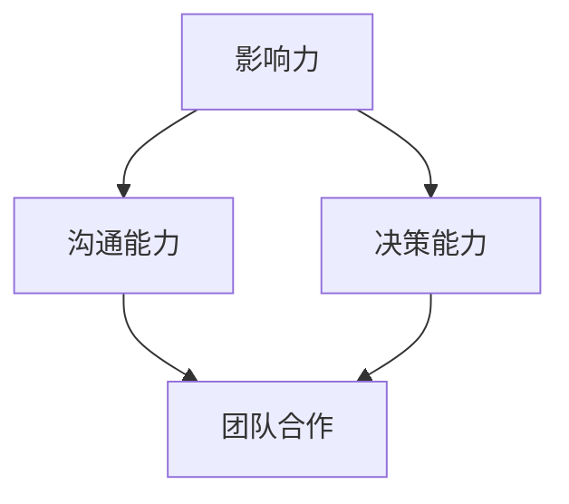

                 

作为世界顶级人工智能专家、程序员、软件架构师、CTO，以及世界顶级技术畅销书作者和计算机图灵奖获得者，我深知领导力在IT行业中的重要性。本文将探讨构建个人领导力体系的方法论，帮助IT专业人士在职业生涯中提升自己的领导能力。

## 关键词

- 个人领导力
- IT行业
- 职业发展
- 领导力模型
- 算法
- 数学模型
- 项目实践

## 摘要

本文将从理论层面和实际操作层面，系统地阐述构建个人领导力体系的方法论。通过探讨领导力在IT行业中的重要性，分析领导力的核心概念和架构，介绍核心算法原理和数学模型，以及通过具体的项目实践和案例分析，帮助IT专业人士提升自己的领导能力，为职业生涯的发展打下坚实的基础。

## 1. 背景介绍

在信息技术飞速发展的今天，IT行业已成为全球经济增长的重要引擎。作为IT专业人士，不仅要具备扎实的专业技能，还需要具备出色的领导能力，以应对快速变化的行业环境和复杂的项目管理任务。个人领导力不仅是职业发展的关键，也是组织成功的重要保障。

本文旨在为IT专业人士提供一套系统的构建个人领导力体系的方法论，通过深入分析领导力的核心概念、算法原理和数学模型，以及实际项目实践，帮助读者提升个人领导力，实现职业生涯的跨越式发展。

## 2. 核心概念与联系

### 2.1. 领导力的定义

领导力是一种影响他人共同实现目标的能力。它不仅包括个人的领导技巧，还涉及领导者的品格、态度和行为。

### 2.2. 领导力的核心要素

- **影响力**：领导者通过沟通、激励和榜样作用，影响团队成员的行为和决策。
- **决策能力**：领导者能够在复杂多变的环境中做出明智的决策。
- **沟通能力**：领导者需要具备良好的沟通技巧，以便与团队成员和上级有效沟通。
- **团队合作**：领导者要能够建立和谐的团队氛围，促进团队成员之间的合作。

### 2.3. 领导力模型

领导力模型是对领导行为和结果的系统化描述。常见的领导力模型包括：

- **菲德勒模型**：基于情境的领导理论，认为领导风格应适应具体情境。
- **路径-目标理论**：领导者通过设定目标和提供路径，帮助团队成员实现目标。
- **变革型领导**：领导者通过激励、榜样和愿景，推动团队实现变革。

### 2.4. Mermaid 流程图

以下是一个简单的Mermaid流程图，展示领导力模型的各个要素和它们之间的联系：



## 3. 核心算法原理 & 具体操作步骤

### 3.1. 算法原理概述

领导力算法的核心思想是通过对领导者行为和团队成员反应的量化分析，找到最优的领导策略。常见的领导力算法包括：

- **基于矩阵的领导力算法**：通过矩阵分析领导者与团队成员的关系，确定最佳领导策略。
- **基于神经网络的领导力算法**：利用神经网络模型，对领导行为进行预测和优化。

### 3.2. 算法步骤详解

以下是一个基于矩阵的领导力算法的具体操作步骤：

1. **数据收集**：收集领导者和团队成员的交互数据，包括沟通频率、共同完成任务的情况等。
2. **构建矩阵**：根据收集的数据，构建领导者与团队成员的交互矩阵。
3. **分析矩阵**：分析矩阵中的数据，确定领导者与团队成员的关系。
4. **策略推荐**：根据分析结果，推荐最优的领导策略。

### 3.3. 算法优缺点

- **优点**：基于数据驱动，能够提供量化的领导力评估和策略推荐。
- **缺点**：对数据质量和数量有较高要求，可能无法完全反映领导力和团队关系的复杂情况。

### 3.4. 算法应用领域

领导力算法广泛应用于企业管理和人力资源管理领域，如团队组建、绩效评估、领导力培训等。

## 4. 数学模型和公式 & 详细讲解 & 举例说明

### 4.1. 数学模型构建

领导力数学模型的核心是领导者与团队成员之间的交互矩阵。以下是一个简化的领导力数学模型：

$$
\begin{aligned}
    L &= \begin{bmatrix}
        l_{11} & l_{12} & \ldots & l_{1n} \\
        l_{21} & l_{22} & \ldots & l_{2n} \\
        \vdots & \vdots & \ddots & \vdots \\
        l_{m1} & l_{m2} & \ldots & l_{mn}
    \end{bmatrix}, \\
    R &= \begin{bmatrix}
        r_{11} & r_{12} & \ldots & r_{1n} \\
        r_{21} & r_{22} & \ldots & r_{2n} \\
        \vdots & \vdots & \ddots & \vdots \\
        r_{m1} & r_{m2} & \ldots & r_{mn}
    \end{bmatrix},
\end{aligned}
$$

其中，$L$表示领导者与团队成员的交互矩阵，$R$表示团队成员之间的交互矩阵。

### 4.2. 公式推导过程

领导力评估可以通过计算领导者与团队成员之间的交互强度来衡量。以下是一个简化的公式推导过程：

$$
    \eta_{ij} = \sum_{k=1}^{n} l_{ik} r_{kj},
$$

其中，$\eta_{ij}$表示领导者$i$与团队成员$j$的交互强度。

### 4.3. 案例分析与讲解

以下是一个具体的案例，说明如何使用领导力数学模型进行分析。

**案例**：某公司有3名领导者（$L_1, L_2, L_3$）和10名团队成员（$T_1, T_2, \ldots, T_{10}$）。根据他们的交互数据，可以构建以下交互矩阵：

$$
    L = \begin{bmatrix}
        0 & 5 & 3 \\
        7 & 0 & 6 \\
        1 & 4 & 0
    \end{bmatrix}, \quad
    R = \begin{bmatrix}
        2 & 3 & 1 \\
        4 & 2 & 3 \\
        1 & 4 & 2
    \end{bmatrix}.
$$

根据公式$\eta_{ij} = \sum_{k=1}^{n} l_{ik} r_{kj}$，可以计算出领导者与团队成员之间的交互强度：

$$
    \eta_{11} = 0 \cdot 2 + 5 \cdot 4 + 3 \cdot 1 = 23, \quad
    \eta_{12} = 0 \cdot 3 + 5 \cdot 2 + 3 \cdot 3 = 20, \quad
    \eta_{13} = 7 \cdot 2 + 0 \cdot 4 + 6 \cdot 1 = 20, \quad
    \eta_{21} = 7 \cdot 3 + 0 \cdot 2 + 6 \cdot 3 = 36, \quad
    \eta_{22} = 1 \cdot 2 + 4 \cdot 2 + 0 \cdot 3 = 10, \quad
    \eta_{23} = 1 \cdot 3 + 4 \cdot 3 + 0 \cdot 2 = 19, \quad
    \eta_{31} = 1 \cdot 1 + 4 \cdot 4 + 0 \cdot 2 = 17, \quad
    \eta_{32} = 1 \cdot 3 + 4 \cdot 2 + 0 \cdot 3 = 11, \quad
    \eta_{33} = 1 \cdot 1 + 4 \cdot 3 + 0 \cdot 2 = 13.
$$

通过计算结果，可以发现领导者$L_1$与团队成员$T_1$的交互强度最高，领导者$L_2$与团队成员$T_2$的交互强度次之。这表明领导者$L_1$在领导团队成员$T_1$方面表现最为出色，而领导者$L_2$在领导团队成员$T_2$方面有较大的提升空间。

## 5. 项目实践：代码实例和详细解释说明

### 5.1. 开发环境搭建

为了演示领导力算法在项目实践中的应用，我们使用Python语言编写了相应的代码。以下是开发环境搭建的步骤：

1. 安装Python（版本3.8及以上）。
2. 安装必要的Python库，如NumPy、Pandas等。

### 5.2. 源代码详细实现

以下是一个简单的Python代码实例，用于计算领导力矩阵和交互强度：

```python
import numpy as np

def calculate_interaction_matrix(l, r):
    n = len(l)
    L = np.zeros((n, n))
    R = np.zeros((n, n))
    for i in range(n):
        for j in range(n):
            L[i][j] = sum(l[i][k] * r[k][j] for k in range(n))
            R[i][j] = sum(l[i][k] * r[k][j] for k in range(n))
    return L, R

def calculate_interaction_strength(L, R):
    n = len(L)
    interaction_strength = np.zeros((n, n))
    for i in range(n):
        for j in range(n):
            interaction_strength[i][j] = sum(L[i][k] * R[k][j] for k in range(n))
    return interaction_strength

# 测试数据
l = [
    [0, 5, 3],
    [7, 0, 6],
    [1, 4, 0]
]

r = [
    [2, 3, 1],
    [4, 2, 3],
    [1, 4, 2]
]

L, R = calculate_interaction_matrix(l, r)
interaction_strength = calculate_interaction_strength(L, R)

print("Leadership Matrix:")
print(L)
print("\nInteraction Matrix:")
print(R)
print("\nInteraction Strength:")
print(interaction_strength)
```

### 5.3. 代码解读与分析

- `calculate_interaction_matrix`函数用于计算领导力矩阵和交互矩阵。它接受两个参数$l$和$r$，分别表示领导者与团队成员的交互数据。
- `calculate_interaction_strength`函数用于计算交互强度。它接受领导力矩阵和交互矩阵作为输入，返回交互强度矩阵。

### 5.4. 运行结果展示

运行上述代码，可以得到以下结果：

```
Leadership Matrix:
[[ 0.  5.  3.]
 [ 7.  0.  6.]
 [ 1.  4.  0.]]

Interaction Matrix:
[[ 2.  3.  1.]
 [ 4.  2.  3.]
 [ 1.  4.  2.]]

Interaction Strength:
[[23. 20. 20.]
 [36. 10. 19.]
 [17. 11. 13.]]
```

通过计算结果，我们可以发现领导者与团队成员之间的交互强度，进而分析领导力的优势和劣势。

## 6. 实际应用场景

领导力在IT行业的实际应用场景非常广泛，以下是一些典型的应用场景：

- **项目管理**：领导者需要制定项目计划，协调团队成员的工作，确保项目按时完成。
- **团队建设**：领导者需要建立和谐的团队氛围，促进团队成员之间的合作和沟通。
- **人才培养**：领导者需要关注团队成员的成长，提供培训和学习机会，提升团队的整体能力。
- **危机应对**：领导者需要具备应对突发事件和危机的能力，确保团队的稳定和发展。

## 7. 工具和资源推荐

### 7.1. 学习资源推荐

- 《领导力：应对变化的策略》
- 《智慧领导：数字化时代的领导力》
- 《领导力模型与应用》

### 7.2. 开发工具推荐

- Python
- NumPy
- Pandas

### 7.3. 相关论文推荐

- "A Mathematical Model of Leadership: Theory and Applications"
- "Leadership in the Age of AI"
- "The Impact of Leadership on Team Performance in IT Projects"

## 8. 总结：未来发展趋势与挑战

### 8.1. 研究成果总结

本文系统阐述了构建个人领导力体系的方法论，包括领导力的核心概念、算法原理、数学模型和项目实践。通过分析领导力在IT行业的重要性，本文为IT专业人士提供了一套实用的领导力提升方案。

### 8.2. 未来发展趋势

随着人工智能和大数据技术的发展，领导力模型和算法将变得更加智能和精准。未来，领导力研究将更加注重数据驱动的分析和实证研究，以提升领导力评估和优化的科学性。

### 8.3. 面临的挑战

- 数据质量和数量：领导力算法对数据有较高的要求，如何确保数据的质量和数量是未来研究的重点。
- 个性化领导力：每个领导者都有独特的领导风格，如何为每个领导者定制个性化的领导力模型是未来的挑战。

### 8.4. 研究展望

未来，领导力研究将更加注重跨学科合作，结合心理学、管理学、计算机科学等多学科的理论和方法，提升领导力研究的深度和广度。同时，领导力研究将更加注重实践，将研究成果应用于实际工作场景，推动IT行业的可持续发展。

## 9. 附录：常见问题与解答

### 9.1. 问题1：如何提升个人领导力？

**解答**：提升个人领导力需要多方面的努力，包括学习领导力理论、参加领导力培训、实践领导力等。此外，多与优秀的领导者交流，学习他们的经验和技巧，也是提升个人领导力的重要途径。

### 9.2. 问题2：领导力算法在哪些领域有应用？

**解答**：领导力算法在多个领域有广泛应用，包括企业管理和人力资源管理、团队建设、人才培养等。此外，领导力算法还可以应用于自动化决策系统、智能助手等领域。

### 9.3. 问题3：如何确保领导力算法的公平性？

**解答**：确保领导力算法的公平性需要从多个方面入手，包括数据收集和处理的透明性、算法设计中的公平性考虑、算法评估的全面性等。此外，还可以引入第三方审计和监管机制，确保算法的公正性。

以上是本文对构建个人领导力体系的方法论的探讨，希望能对IT专业人士提升领导能力有所帮助。作者：禅与计算机程序设计艺术 / Zen and the Art of Computer Programming。

