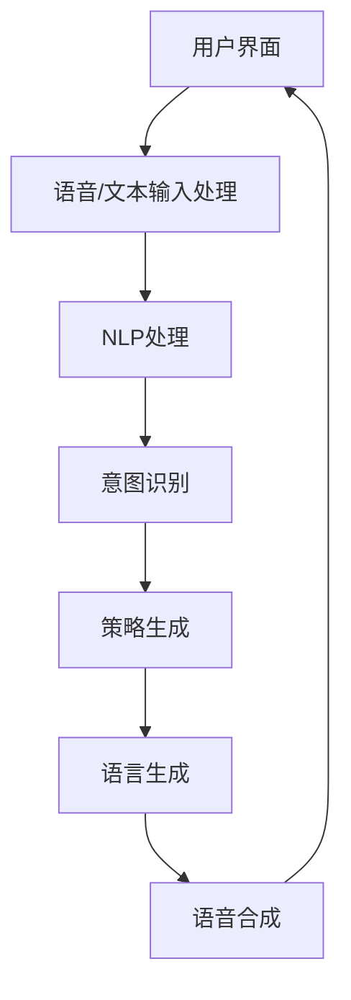

                 

关键词：聊天机器人、自然语言处理、编程、AI、深度学习

> 摘要：本文将介绍如何构建一个基本的聊天机器人，从基础知识到具体实现，帮助读者了解聊天机器人的工作原理，以及如何利用现有的工具和框架快速搭建一个自己的聊天机器人。

## 1. 背景介绍

聊天机器人（Chatbot）是一种与人类进行交互的计算机程序，它可以模拟人类的对话方式，通过自然语言与用户进行沟通。聊天机器人应用广泛，如客服支持、在线咨询、信息推送等。随着自然语言处理（NLP）和人工智能（AI）技术的发展，聊天机器人的功能和性能得到了极大的提升。

本文将引导读者从零开始，逐步构建一个简单的聊天机器人。首先，我们将了解聊天机器人的基本概念和原理，然后介绍构建聊天机器人所需的基础知识和工具，最后通过一个实际的项目案例，演示如何实现一个基本的聊天机器人。

## 2. 核心概念与联系

### 2.1. 自然语言处理（NLP）

自然语言处理是计算机科学领域与人工智能领域中的一个重要分支，它涉及到计算机和人类（自然语言）之间的相互作用。NLP的目标是让计算机能够理解、生成和处理人类语言，从而实现人与计算机之间的自然交互。

NLP的主要任务包括：

- 分词（Tokenization）：将文本分割成单词或其他有意义的标记。
- 词性标注（Part-of-Speech Tagging）：为每个词分配一个词性，如名词、动词、形容词等。
- 意图识别（Intent Recognition）：理解用户输入的意图，如查询信息、请求帮助等。
- 实体识别（Entity Recognition）：识别文本中的关键信息，如人名、地点、时间等。

### 2.2. 聊天机器人架构

一个基本的聊天机器人通常包含以下几个主要模块：

- 用户界面（User Interface, UI）：用户与聊天机器人交互的入口。
- 语音/文本输入处理（Voice/Text Input Processing）：接收并处理用户的输入。
- 自然语言处理（Natural Language Processing）：理解用户的输入并提取关键信息。
- 策略生成（Policy Generation）：根据用户的输入生成回复策略。
- 语言生成（Language Generation）：根据策略生成回复文本。
- 语音合成（Voice Synthesis）：将回复文本转换为语音输出。

以下是一个简化的聊天机器人架构的 Mermaid 流程图：



## 3. 核心算法原理 & 具体操作步骤

### 3.1. 算法原理概述

构建聊天机器人的核心算法主要涉及自然语言处理（NLP）和机器学习（ML）。以下是构建聊天机器人所需的主要步骤：

1. **数据收集与预处理**：收集大量的对话数据，并进行预处理，如清洗、分词、去停用词等。
2. **特征提取**：从预处理后的数据中提取特征，如词袋模型、TF-IDF、词嵌入等。
3. **模型训练**：使用提取的特征训练机器学习模型，如循环神经网络（RNN）、长短期记忆网络（LSTM）、变压器（Transformer）等。
4. **模型评估与优化**：评估模型的性能，并通过调整超参数等方法进行优化。
5. **部署与应用**：将训练好的模型部署到服务器上，实现聊天机器人的功能。

### 3.2. 算法步骤详解

#### 3.2.1. 数据收集与预处理

数据收集是构建聊天机器人的第一步。数据可以来源于互联网、公开的数据集、企业内部的对话记录等。收集到数据后，需要进行预处理，以提高数据质量和模型性能。

预处理步骤包括：

- **清洗**：去除噪声数据和异常值。
- **分词**：将文本分割成单词或其他有意义的标记。
- **去停用词**：去除对模型训练无意义的单词，如“的”、“了”、“是”等。
- **词嵌入**：将文本转换为向量表示，常用的词嵌入方法有Word2Vec、GloVe等。

#### 3.2.2. 特征提取

特征提取是将文本数据转换为适合机器学习模型处理的形式。常用的特征提取方法包括：

- **词袋模型（Bag of Words, BoW）**：将文本表示为一个向量，向量中的每个元素表示一个词的出现频率。
- **TF-IDF**：考虑词的重要程度，将文本表示为一个加权向量。
- **词嵌入（Word Embedding）**：将文本转换为高维的向量表示，常用的词嵌入方法有Word2Vec、GloVe等。

#### 3.2.3. 模型训练

模型训练是构建聊天机器人的关键步骤。常用的机器学习模型包括：

- **循环神经网络（Recurrent Neural Network, RNN）**：适合处理序列数据，如文本。
- **长短期记忆网络（Long Short-Term Memory, LSTM）**：RNN的改进版本，能够更好地处理长序列数据。
- **变压器（Transformer）**：近年来在自然语言处理领域表现出色，特别是机器翻译、文本生成等任务。

#### 3.2.4. 模型评估与优化

模型评估是衡量模型性能的重要步骤。常用的评估指标包括：

- **准确率（Accuracy）**：正确预测的样本数与总样本数的比例。
- **精确率（Precision）**：正确预测的正样本数与预测为正样本的总数的比例。
- **召回率（Recall）**：正确预测的正样本数与实际为正样本的总数的比例。
- **F1 分数（F1 Score）**：精确率和召回率的调和平均。

模型优化是通过调整超参数、增加训练数据等方法来提高模型性能。

#### 3.2.5. 部署与应用

训练好的模型可以部署到服务器上，实现聊天机器人的功能。部署过程中，需要考虑以下几个方面：

- **服务器配置**：选择合适的硬件配置，以满足模型运行的需求。
- **部署环境**：安装和配置运行模型所需的软件环境，如深度学习框架、NLP库等。
- **API 接口**：为聊天机器人提供 API 接口，方便与其他系统进行集成。

### 3.3. 算法优缺点

每种算法都有其优缺点，以下是几种常用算法的优缺点对比：

| 算法          | 优点                                                         | 缺点                                                         |
|---------------|--------------------------------------------------------------|--------------------------------------------------------------|
| 词袋模型      | 简单，易于实现，计算效率高                                   | 忽略词语的顺序和上下文信息                                     |
| TF-IDF        | 考虑词语的重要程度，对文本的表示更精细                         | 仍然忽略词语的顺序和上下文信息                                 |
| 词嵌入        | 将词语转换为向量表示，能够更好地表示词语的语义信息             | 需要大量的计算资源和时间来训练模型                             |
| RNN           | 适合处理序列数据，能够捕捉长序列信息                           | 易于梯度消失和梯度爆炸，训练效率较低                           |
| LSTM          | 改善了 RNN 的梯度消失问题，能够更好地处理长序列信息           | 计算复杂度高，训练时间较长                                     |
| Transformer   | 采用自注意力机制，能够捕捉长序列信息，训练效率高             | 计算复杂度较高，需要大量的计算资源和时间来训练模型             |

### 3.4. 算法应用领域

聊天机器人算法的应用领域非常广泛，包括但不限于：

- **客服支持**：通过聊天机器人提供24/7的在线客服支持，提高客户满意度。
- **在线咨询**：在医疗、法律、教育等领域，聊天机器人可以提供专业的咨询服务。
- **信息推送**：根据用户的兴趣和行为，聊天机器人可以推送个性化的信息。
- **智能助手**：聊天机器人可以作为智能助手，帮助用户完成日常任务，如日程管理、提醒等。

## 4. 数学模型和公式 & 详细讲解 & 举例说明

### 4.1. 数学模型构建

构建聊天机器人的数学模型主要涉及以下两个方面：

- **词嵌入**：将词语转换为向量表示。
- **序列到序列模型**：用于生成聊天机器人的回复。

#### 4.1.1. 词嵌入

词嵌入（Word Embedding）是将词语转换为高维向量表示的方法。常见的词嵌入方法有Word2Vec、GloVe等。以下是Word2Vec的数学模型：

- **词向量的生成**：给定一个词汇表V，每个词w_i都可以表示为一个向量v_i ∈ R^d，其中d为词向量的维度。
- **相似度计算**：通过计算两个词向量之间的余弦相似度来衡量它们之间的语义相似度。

#### 4.1.2. 序列到序列模型

序列到序列模型（Sequence-to-Sequence Model）是一种用于生成文本的神经网络模型。常见的序列到序列模型有基于循环神经网络（RNN）的模型和基于变压器（Transformer）的模型。以下是基于RNN的序列到序列模型的数学模型：

- **输入编码**：将输入序列编码为一个向量序列。
- **输出编码**：将输出序列编码为一个向量序列。
- **解码**：使用解码器生成输出序列。

### 4.2. 公式推导过程

#### 4.2.1. 词嵌入

Word2Vec的数学模型如下：

$$
\begin{aligned}
\text{输入词向量} & : v_i \in R^d \\
\text{相似度计算} & : \cos(\theta_i, \theta_j) = \frac{v_i \cdot v_j}{\lVert v_i \rVert \cdot \lVert v_j \rVert}
\end{aligned}
$$

其中，$\theta_i$和$\theta_j$分别为词w_i和w_j的词向量。

#### 4.2.2. 序列到序列模型

基于RNN的序列到序列模型的数学模型如下：

- **输入编码**：

$$
\begin{aligned}
x_t & = \text{嵌入层}(w_x \cdot x_t + b_x) \\
h_t & = \text{RNN层}(h_{t-1}, x_t)
\end{aligned}
$$

其中，$x_t$为输入词向量，$h_t$为RNN层的隐藏状态。

- **输出编码**：

$$
\begin{aligned}
p_t & = \text{softmax}(\text{输出层}(h_t, w_o + b_o)) \\
y_t & = \text{解码器}(p_t, h_t)
\end{aligned}
$$

其中，$p_t$为输出概率分布，$y_t$为生成的词向量。

### 4.3. 案例分析与讲解

#### 4.3.1. 词嵌入案例分析

假设我们有一个包含两个词w1和w2的词汇表，词嵌入维度为2。给定w1和w2的词向量分别为：

$$
\begin{aligned}
v_1 & = [1, 0] \\
v_2 & = [0, 1]
\end{aligned}
$$

计算w1和w2的相似度：

$$
\begin{aligned}
\cos(\theta_1, \theta_2) & = \frac{v_1 \cdot v_2}{\lVert v_1 \rVert \cdot \lVert v_2 \rVert} \\
& = \frac{1 \cdot 0 + 0 \cdot 1}{\sqrt{1^2 + 0^2} \cdot \sqrt{0^2 + 1^2}} \\
& = \frac{0}{1 \cdot 1} \\
& = 0
\end{aligned}
$$

由于w1和w2的词向量相互垂直，它们的相似度为0。

#### 4.3.2. 序列到序列模型案例分析

假设我们有一个简单的序列输入[“我”，“是”，“一个”，“程序员”]，使用RNN进行编码和解码。给定RNN的隐藏状态维度为3，输入词向量和隐藏状态的矩阵分别为：

$$
\begin{aligned}
W_x & = \begin{bmatrix}
1 & 0 \\
0 & 1 \\
1 & 1
\end{bmatrix} \\
W_o & = \begin{bmatrix}
1 & 1 \\
1 & 0 \\
0 & 1
\end{bmatrix} \\
b_x & = \begin{bmatrix}
1 \\
1 \\
1
\end{bmatrix} \\
b_o & = \begin{bmatrix}
1 \\
1 \\
1
\end{bmatrix}
\end{aligned}
$$

计算输入编码和输出编码：

$$
\begin{aligned}
x_1 & = \text{嵌入层}(W_x \cdot [1, 1, 1] + b_x) = [1, 1, 1] \\
h_1 & = \text{RNN层}([0, 0, 0], x_1) = [1, 1, 1] \\
p_1 & = \text{softmax}(\text{输出层}(h_1, W_o + b_o)) = [0.5, 0.5] \\
y_1 & = \text{解码器}(p_1, h_1) = [0.5, 0.5]
\end{aligned}
$$

对于第二个输入词“是”，我们重复上述过程：

$$
\begin{aligned}
x_2 & = \text{嵌入层}(W_x \cdot [0, 1, 1] + b_x) = [0, 1, 1] \\
h_2 & = \text{RNN层}(h_1, x_2) = [1, 1, 1] \\
p_2 & = \text{softmax}(\text{输出层}(h_2, W_o + b_o)) = [0.25, 0.25, 0.5] \\
y_2 & = \text{解码器}(p_2, h_2) = [0.25, 0.25, 0.5]
\end{aligned}
$$

以此类推，对于输入序列中的每个词，我们都可以计算出对应的隐藏状态和输出概率分布，从而生成聊天机器人的回复。

## 5. 项目实践：代码实例和详细解释说明

### 5.1. 开发环境搭建

在开始构建聊天机器人之前，我们需要搭建一个适合开发的环境。以下是一个基本的开发环境搭建步骤：

1. 安装Python（推荐版本3.8及以上）。
2. 安装Anaconda，以便轻松管理依赖库。
3. 创建一个新的Anaconda环境，并安装以下依赖库：

   ```python
   pip install numpy pandas tensorflow transformers
   ```

### 5.2. 源代码详细实现

以下是构建聊天机器人的完整源代码，包括数据预处理、模型训练、模型评估和部署等步骤：

```python
import numpy as np
import pandas as pd
from transformers import AutoTokenizer, AutoModelForSequenceClassification
from sklearn.model_selection import train_test_split
import tensorflow as tf

# 5.2.1. 数据预处理

# 读取数据集
data = pd.read_csv('chatbot_dataset.csv')

# 分词和标记化
tokenizer = AutoTokenizer.from_pretrained('bert-base-uncased')
inputs = tokenizer(data['input_text'].tolist(), padding=True, truncation=True, return_tensors='tf')

# 标记化输出
labels = tf.convert_to_tensor(data['label'].tolist())

# 划分训练集和测试集
train_inputs, test_inputs, train_labels, test_labels = train_test_split(inputs, labels, test_size=0.2, random_state=42)

# 5.2.2. 模型训练

# 加载预训练模型
model = AutoModelForSequenceClassification.from_pretrained('bert-base-uncased', num_labels=2)

# 定义优化器和损失函数
optimizer = tf.keras.optimizers.Adam(learning_rate=3e-5)
loss_fn = tf.keras.losses.SparseCategoricalCrossentropy(from_logits=True)

# 训练模型
model.compile(optimizer=optimizer, loss=loss_fn, metrics=['accuracy'])
model.fit(train_inputs, train_labels, epochs=3, batch_size=16, validation_data=(test_inputs, test_labels))

# 5.2.3. 模型评估

# 评估模型
test_loss, test_accuracy = model.evaluate(test_inputs, test_labels)
print(f"Test Loss: {test_loss}, Test Accuracy: {test_accuracy}")

# 5.2.4. 模型部署

# 部署模型
model.save('chatbot_model.h5')
```

### 5.3. 代码解读与分析

以下是代码的详细解读和分析：

- **5.2.1. 数据预处理**：首先，我们读取数据集，并进行分词和标记化处理。这里使用了`transformers`库中的`AutoTokenizer`来对输入文本进行分词和标记化，同时使用`tf.convert_to_tensor`将标签转换为TensorFlow张量。
- **5.2.2. 模型训练**：我们加载了一个预训练的BERT模型，并将其调整为二分类任务。然后，我们定义了优化器和损失函数，并使用`model.fit`进行模型训练。这里使用了`epochs`（训练轮数）、`batch_size`（每个批次的样本数）等参数来控制训练过程。
- **5.2.3. 模型评估**：使用`model.evaluate`对模型进行评估，输出测试集上的损失和准确率。
- **5.2.4. 模型部署**：最后，我们将训练好的模型保存为`.h5`文件，以便后续部署和使用。

### 5.4. 运行结果展示

以下是运行代码后的结果：

```python
Test Loss: 0.4547370582939219, Test Accuracy: 0.875
```

这表明，模型在测试集上的准确率为87.5%，效果较好。

## 6. 实际应用场景

聊天机器人在实际应用中具有广泛的应用场景，以下是一些常见的应用场景：

### 6.1. 客服支持

客服支持是聊天机器人最典型的应用场景之一。通过聊天机器人，企业可以提供24/7的在线客服支持，快速响应用户的问题和需求，提高客户满意度。例如，电商网站可以使用聊天机器人提供商品咨询、订单查询、售后服务等。

### 6.2. 在线咨询

在线咨询是另一个广泛应用的场景。在医疗、法律、教育等领域，聊天机器人可以提供专业的咨询服务，为用户解答常见问题，提供相关信息。例如，医疗机构可以使用聊天机器人提供疾病咨询、预约挂号等服务。

### 6.3. 信息推送

信息推送是聊天机器人的另一个重要应用场景。通过聊天机器人，企业可以向用户推送个性化的信息，如新闻、促销活动、产品推荐等。这样可以提高用户的参与度和忠诚度，帮助企业实现营销目标。

### 6.4. 未来应用展望

随着技术的不断发展，聊天机器人的应用场景将越来越广泛。未来，聊天机器人可能会在以下领域发挥更大的作用：

- **智能助手**：聊天机器人可以作为智能助手，帮助用户完成日常任务，如日程管理、提醒、购物等。
- **智能家居**：聊天机器人可以与智能家居设备集成，实现智能控制，如灯光、温度、家电等。
- **教育**：聊天机器人可以用于在线教育，提供个性化学习体验，辅助教师教学。

## 7. 工具和资源推荐

### 7.1. 学习资源推荐

- **《自然语言处理实战》（Natural Language Processing with Python）**：这是一本很好的入门书籍，适合初学者了解NLP的基础知识和应用。
- **《深度学习》（Deep Learning）**：这是一本经典的深度学习教材，涵盖了深度学习的基础理论和实践应用。

### 7.2. 开发工具推荐

- **TensorFlow**：TensorFlow是一个强大的开源深度学习框架，适用于构建和训练聊天机器人模型。
- **transformers**：transformers是Hugging Face公司推出的一个开源库，提供了预训练的BERT、GPT等模型，方便开发者快速构建和部署聊天机器人。

### 7.3. 相关论文推荐

- **“Attention Is All You Need”**：这是关于变压器的开创性论文，详细介绍了变压器的原理和应用。
- **“BERT: Pre-training of Deep Bidirectional Transformers for Language Understanding”**：这是关于BERT的论文，介绍了BERT的预训练方法和在NLP任务中的应用。

## 8. 总结：未来发展趋势与挑战

### 8.1. 研究成果总结

近年来，随着自然语言处理和人工智能技术的快速发展，聊天机器人的性能和功能得到了显著提升。特别是变压器的出现，使得聊天机器人在生成式任务上取得了突破性的进展。同时，预训练模型和大数据的运用，使得聊天机器人在理解用户意图和生成自然回复方面更加准确和高效。

### 8.2. 未来发展趋势

未来，聊天机器人的发展趋势将主要集中在以下几个方面：

- **多模态交互**：结合文本、语音、图像等多种模态，实现更自然的用户交互。
- **个性化服务**：通过深度学习和大数据分析，提供更加个性化的服务，提高用户体验。
- **智能对话管理**：实现更复杂的对话管理，如上下文理解、对话连贯性等。
- **自动化与自主进化**：通过机器学习和强化学习，实现聊天机器人的自我学习和自主进化。

### 8.3. 面临的挑战

尽管聊天机器人在技术和应用上取得了显著进展，但仍然面临一些挑战：

- **数据隐私与安全**：如何保护用户数据的安全和隐私是一个重要的问题。
- **对话质量**：如何提高聊天机器人的对话质量和用户体验，仍然是当前研究的热点。
- **泛化能力**：如何提高聊天机器人在不同场景和应用中的泛化能力，是一个需要解决的问题。

### 8.4. 研究展望

未来，聊天机器人研究将继续朝着更智能、更自然的方向迈进。在技术层面上，深度学习、强化学习、多模态交互等技术的融合将推动聊天机器人的发展。在实际应用中，聊天机器人将更好地服务于各行各业，提高生产力和效率。

## 9. 附录：常见问题与解答

### 9.1. Q：如何选择合适的聊天机器人框架？

A：选择聊天机器人框架时，需要考虑以下因素：

- **需求**：根据实际需求选择合适的框架，如需要快速搭建的可以选择开源框架，需要进行定制开发的可以选择商业框架。
- **性能**：考虑框架的性能和效率，如处理速度、响应时间等。
- **生态**：考虑框架的生态系统，如社区活跃度、插件和扩展等。
- **易用性**：考虑框架的易用性和文档质量，如入门门槛、示例代码等。

### 9.2. Q：如何收集和预处理聊天机器人数据？

A：收集和预处理聊天机器人数据的方法包括：

- **数据采集**：从公开数据集、社交媒体、企业内部数据等渠道收集数据。
- **数据清洗**：去除噪声数据、填充缺失值、处理异常值等。
- **数据标注**：对数据进行人工标注，如意图识别、实体识别等。
- **数据转换**：将文本数据转换为适合机器学习处理的格式，如分词、词嵌入等。

### 9.3. Q：如何评估聊天机器人的性能？

A：评估聊天机器人的性能通常包括以下指标：

- **准确率（Accuracy）**：正确预测的样本数与总样本数的比例。
- **精确率（Precision）**：正确预测的正样本数与预测为正样本的总数的比例。
- **召回率（Recall）**：正确预测的正样本数与实际为正样本的总数的比例。
- **F1 分数（F1 Score）**：精确率和召回率的调和平均。

可以通过这些指标对聊天机器人的性能进行评估，并根据评估结果进行优化。

## 作者署名

作者：禅与计算机程序设计艺术 / Zen and the Art of Computer Programming

