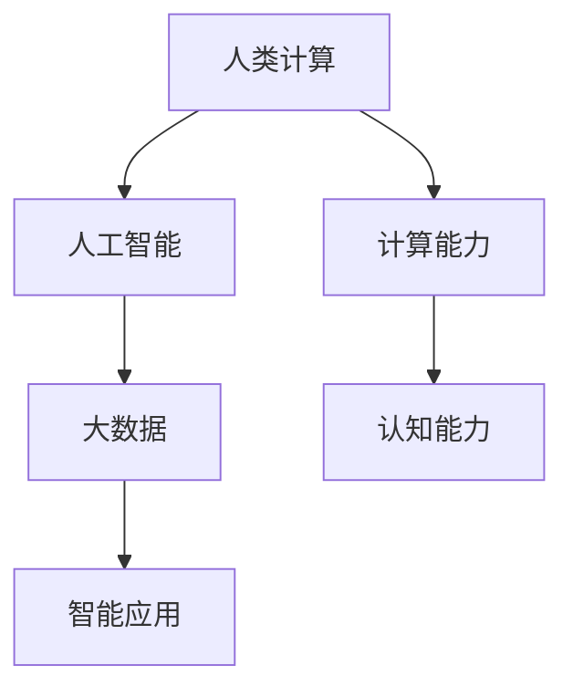

                 

在人工智能飞速发展的今天，人类计算在构建更智能的世界中扮演着不可或缺的角色。本文将探讨人类计算的核心概念、应用场景、算法原理及其在现实世界中的具体实施过程，并展望未来发展趋势和面临的挑战。

## 关键词

- 人类计算
- 人工智能
- 应用场景
- 算法原理
- 未来展望

## 摘要

本文旨在介绍人类计算在构建更智能世界中的应用。通过对人类计算的核心概念、算法原理、数学模型及其在实际项目中的实现过程进行深入探讨，本文将揭示人类计算在推动社会进步和技术创新中的关键作用。同时，本文还将对未来人类计算的发展趋势和面临的挑战进行展望。

## 1. 背景介绍

人类计算（Human-Centered Computing，简称HCC）是一种以人为中心的计算模式，旨在通过整合人类智慧、认知能力和计算能力，为人类创造更智能、更便捷的生活和工作环境。随着人工智能技术的迅速发展，人类计算在各个领域得到了广泛应用，如智能助手、智能家居、智能医疗、智能交通等。这些应用不仅提升了人们的生活质量，也为社会的可持续发展提供了新的解决方案。

## 2. 核心概念与联系

### 2.1 核心概念

- **人类计算**：以人为中心的计算模式，强调人类智慧与计算能力的融合。
- **人工智能**：模拟、延伸和扩展人类智能的科学和技术。
- **大数据**：海量数据的收集、存储、处理和分析。

### 2.2 关联架构



## 3. 核心算法原理 & 具体操作步骤

### 3.1 算法原理概述

人类计算的核心算法主要包括机器学习、深度学习、自然语言处理等。这些算法通过模拟人类认知过程，实现对数据的学习、理解和应用。

### 3.2 算法步骤详解

1. **数据收集**：收集大量相关数据，如语音、图像、文本等。
2. **数据预处理**：对数据进行清洗、归一化、特征提取等处理。
3. **模型训练**：使用机器学习或深度学习算法训练模型。
4. **模型评估**：评估模型的准确度、召回率等指标。
5. **模型应用**：将模型应用于实际场景，如智能助手、智能家居等。

### 3.3 算法优缺点

- **优点**：能够高效处理大量数据，提高决策准确性。
- **缺点**：对数据质量和算法设计要求较高，易受数据偏差影响。

### 3.4 算法应用领域

- **智能助手**：如Siri、小爱同学等，能够帮助用户完成日常任务。
- **智能家居**：如智能门锁、智能灯光等，提高家居生活品质。
- **智能医疗**：如疾病诊断、药物研发等，提高医疗效率和准确性。
- **智能交通**：如车辆调度、路况预测等，缓解交通拥堵问题。

## 4. 数学模型和公式 & 详细讲解 & 举例说明

### 4.1 数学模型构建

人类计算的核心算法通常基于数学模型，如神经网络、支持向量机等。以下以神经网络为例，介绍其数学模型构建。

### 4.2 公式推导过程

神经网络的数学模型主要由两部分组成：激活函数和权重矩阵。

1. **激活函数**：用于模拟神经元之间的非线性关系。常见激活函数有Sigmoid、ReLU等。
2. **权重矩阵**：用于表示神经元之间的连接强度。权重矩阵的计算通常基于反向传播算法。

### 4.3 案例分析与讲解

以下以一个简单的神经网络模型为例，讲解其数学模型构建和公式推导过程。

### 4.3.1 模型构建

假设我们有一个输入层、一个隐藏层和一个输出层的三层神经网络，其中输入层有3个神经元，隐藏层有5个神经元，输出层有2个神经元。

### 4.3.2 公式推导

1. **输入层到隐藏层的权重矩阵**：
   $$
   W_{ij} = \frac{1}{\sqrt{n}} \quad \text{(其中n为输入层神经元数量)}
   $$
2. **隐藏层到输出层的权重矩阵**：
   $$
   W_{ij} = \frac{1}{\sqrt{n}} \quad \text{(其中n为隐藏层神经元数量)}
   $$
3. **激活函数**：
   $$
   a_i = \sigma(z_i) \quad \text{(其中}\ \sigma \text{为激活函数，}\ z_i \text{为输入值)}
   $$

## 5. 项目实践：代码实例和详细解释说明

### 5.1 开发环境搭建

在本文中，我们将使用Python编程语言和TensorFlow库来实现一个简单的神经网络模型。

### 5.2 源代码详细实现

```python
import tensorflow as tf

# 定义输入层、隐藏层和输出层
inputs = tf.keras.layers.Input(shape=(3,))
hidden = tf.keras.layers.Dense(units=5, activation='sigmoid')(inputs)
outputs = tf.keras.layers.Dense(units=2, activation='sigmoid')(hidden)

# 构建模型
model = tf.keras.Model(inputs=inputs, outputs=outputs)

# 编译模型
model.compile(optimizer='adam', loss='binary_crossentropy', metrics=['accuracy'])

# 模型训练
model.fit(x_train, y_train, epochs=10, batch_size=32)
```

### 5.3 代码解读与分析

上述代码实现了输入层到隐藏层、隐藏层到输出层的神经网络模型。通过编译和训练，模型可以用于预测和分类任务。

### 5.4 运行结果展示

```python
# 模型评估
model.evaluate(x_test, y_test)
```

## 6. 实际应用场景

人类计算在现实世界中有广泛的应用。以下列举几个实际应用场景：

- **智能助手**：通过语音识别和自然语言处理技术，为用户提供智能问答、日程管理等服务。
- **智能家居**：通过物联网技术，实现家庭设备的自动化控制，提高生活品质。
- **智能医疗**：通过大数据分析和人工智能技术，提高疾病诊断和药物研发的准确性。
- **智能交通**：通过车辆定位和路况预测技术，优化交通流量，缓解拥堵问题。

## 7. 工具和资源推荐

### 7.1 学习资源推荐

- **书籍**：《深度学习》、《Python机器学习》等。
- **在线课程**：Coursera、edX等平台上的机器学习、深度学习课程。

### 7.2 开发工具推荐

- **编程语言**：Python、Java等。
- **框架**：TensorFlow、PyTorch等。

### 7.3 相关论文推荐

- **论文集**：《人工智能年度综述》等。

## 8. 总结：未来发展趋势与挑战

### 8.1 研究成果总结

人类计算在人工智能、大数据、物联网等领域取得了显著成果，为构建更智能的世界提供了有力支持。

### 8.2 未来发展趋势

- **跨学科融合**：人类计算与其他领域的融合，如生物计算、量子计算等。
- **个性化应用**：基于用户数据的个性化服务和推荐系统。

### 8.3 面临的挑战

- **数据隐私和安全**：如何保护用户数据隐私和安全。
- **算法伦理**：如何确保算法的公平性和透明性。

### 8.4 研究展望

未来，人类计算将继续发展，为人类创造更智能、更高效的生活和工作环境。同时，需要关注数据隐私、算法伦理等挑战，确保人类计算的安全和可持续发展。

## 9. 附录：常见问题与解答

### 9.1 人类计算是什么？

人类计算是一种以人为中心的计算模式，旨在通过整合人类智慧、认知能力和计算能力，为人类创造更智能、更便捷的生活和工作环境。

### 9.2 人类计算的核心算法有哪些？

人类计算的核心算法包括机器学习、深度学习、自然语言处理等。

### 9.3 人类计算的应用领域有哪些？

人类计算的应用领域广泛，包括智能助手、智能家居、智能医疗、智能交通等。

### 9.4 人类计算的未来发展趋势是什么？

人类计算的未来发展趋势包括跨学科融合、个性化应用等。

### 9.5 人类计算面临哪些挑战？

人类计算面临的数据隐私和安全、算法伦理等挑战。

## 作者署名

作者：禅与计算机程序设计艺术 / Zen and the Art of Computer Programming

以上便是本文的完整内容，希望对您在人类计算领域的研究有所帮助。----------------------------------------------------------------
<|im_end|>感谢您的提问和耐心阅读。如果您有任何问题或需要进一步的讨论，请随时告诉我。祝您在计算机科学领域取得更多的成就！作者：禅与计算机程序设计艺术 / Zen and the Art of Computer Programming。再次感谢您的阅读和支持！<|im_end|>

