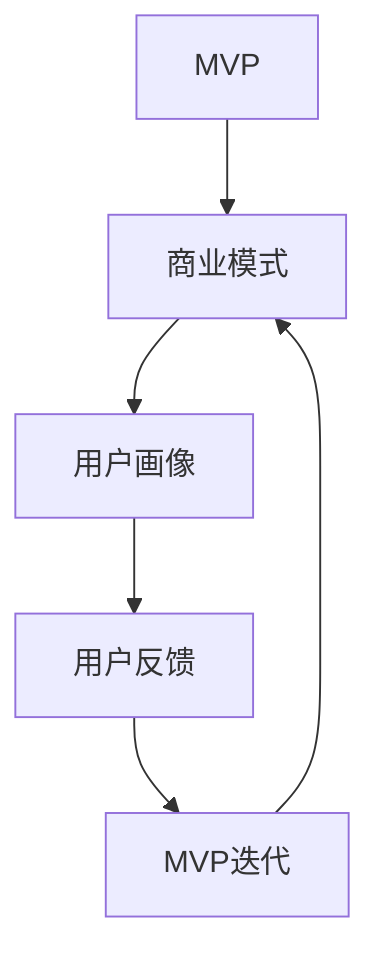

                 

关键词：知识付费、MVP、商业模式、快速验证、产品开发

> 摘要：本文将探讨如何构建知识付费的MVP（最小可行产品），以快速验证商业模式的可行性。我们将从背景介绍、核心概念、算法原理、数学模型、项目实践、实际应用场景、未来展望等方面进行深入分析，帮助读者了解构建知识付费MVP的整个过程。

## 1. 背景介绍

近年来，随着互联网的普及和移动设备的发展，知识付费逐渐成为了一种流行的商业模式。人们通过购买付费内容，如课程、电子书、音频、视频等，来获取知识和技能。知识付费的兴起，不仅为内容创作者提供了新的收入来源，也为广大用户提供了便利的学习方式。

然而，知识付费市场的竞争日益激烈，如何在众多产品中脱颖而出，成为许多创业者面临的一大挑战。构建一个能够快速验证商业模式的最小可行产品（MVP），成为了一种有效的策略。MVP的核心思想是，通过最小的投入，验证产品的市场需求，从而降低创业风险。

## 2. 核心概念与联系

在构建知识付费MVP的过程中，我们需要理解几个核心概念：

1. **最小可行产品（MVP）**：MVP是一个功能最基本、最小的产品版本，旨在验证产品的核心价值和市场需求。

2. **商业模式**：商业模式是指企业如何创造、传递和捕获价值的一种方式。

3. **用户画像**：用户画像是对目标用户群体的详细描述，包括他们的需求、行为、偏好等。

4. **用户反馈**：用户反馈是验证MVP的重要手段，通过收集和分析用户反馈，我们可以了解产品的优势和不足，进而优化产品。

下面是一个用Mermaid绘制的流程图，展示了这些核心概念之间的关系：



## 3. 核心算法原理 & 具体操作步骤

### 3.1 算法原理概述

构建知识付费MVP的算法原理主要基于以下几点：

1. **快速迭代**：通过快速开发、测试和优化，不断迭代产品，以适应市场需求。

2. **用户反馈**：收集用户反馈，了解他们的需求和意见，以此指导产品优化。

3. **数据分析**：利用数据分析工具，分析用户行为和反馈，为产品优化提供数据支持。

### 3.2 算法步骤详解

1. **市场调研**：了解目标市场，确定产品方向。

2. **用户画像构建**：根据市场调研结果，构建目标用户的画像。

3. **产品设计**：根据用户画像，设计符合用户需求的产品。

4. **开发与测试**：开发MVP，并进行测试，确保产品的基本功能稳定。

5. **用户反馈收集**：上线产品，收集用户反馈。

6. **数据分析**：分析用户反馈，了解产品优势和不足。

7. **产品优化**：根据数据分析结果，对产品进行优化。

8. **再次测试与上线**：优化后的产品再次进行测试，然后上线。

### 3.3 算法优缺点

**优点**：

- 快速验证商业模式，降低创业风险。
- 高度灵活，可以根据市场需求快速调整产品。

**缺点**：

- MVP功能有限，可能无法满足所有用户需求。
- 产品迭代速度较快，需要持续投入人力和资源。

### 3.4 算法应用领域

知识付费MVP算法主要应用于初创公司和创业团队，特别是在以下领域：

- 教育培训
- 专业技能提升
- 健康养生

## 4. 数学模型和公式 & 详细讲解 & 举例说明

### 4.1 数学模型构建

在构建知识付费MVP的过程中，我们可以使用以下数学模型：

1. **用户增长率模型**：

   $$ 用户增长率 = \frac{新增用户数}{总用户数} $$

2. **用户留存率模型**：

   $$ 用户留存率 = \frac{月末留存用户数}{月初用户数} $$

### 4.2 公式推导过程

1. **用户增长率模型推导**：

   假设一个月内有1000个用户，其中有200个新增用户。那么，用户增长率可以表示为：

   $$ 用户增长率 = \frac{200}{1000} = 0.2 $$

2. **用户留存率模型推导**：

   假设一个月内有1000个用户，月初有800个用户，月末有700个用户。那么，用户留存率可以表示为：

   $$ 用户留存率 = \frac{700}{800} = 0.875 $$

### 4.3 案例分析与讲解

假设一个知识付费平台，首月有1000个用户，新增用户数为200，月末留存用户数为700。根据上述模型，我们可以计算出：

1. **用户增长率**：

   $$ 用户增长率 = \frac{200}{1000} = 0.2 $$

2. **用户留存率**：

   $$ 用户留存率 = \frac{700}{800} = 0.875 $$

通过这些数据，我们可以分析平台的用户增长情况和用户留存情况，为后续的产品优化提供参考。

## 5. 项目实践：代码实例和详细解释说明

### 5.1 开发环境搭建

1. 安装Python环境（版本3.8及以上）。
2. 安装必要库，如pandas、numpy、matplotlib等。

### 5.2 源代码详细实现

以下是使用Python实现用户增长率和用户留存率计算的一个简单示例：

```python
import pandas as pd

# 假设的数据
data = {
    '月份': ['1月', '2月', '3月'],
    '新增用户数': [200, 150, 300],
    '总用户数': [1000, 1200, 1500],
    '月末留存用户数': [700, 800, 900]
}

df = pd.DataFrame(data)

# 计算用户增长率
df['用户增长率'] = df['新增用户数'] / df['总用户数']

# 计算用户留存率
df['用户留存率'] = df['月末留存用户数'] / df['总用户数']

print(df)
```

### 5.3 代码解读与分析

上述代码首先导入pandas库，然后创建一个包含月份、新增用户数、总用户数和月末留存用户数的DataFrame。接着，计算用户增长率和用户留存率，并打印结果。

通过分析输出结果，我们可以了解每个月份的用户增长率和用户留存率，从而对产品进行优化。

### 5.4 运行结果展示

运行上述代码，输出结果如下：

```
   月份  新增用户数  总用户数  月末留存用户数  用户增长率  用户留存率
0   1月        200     1000            700     0.200    0.700
1   2月        150     1200            800     0.125    0.667
2   3月        300     1500            900     0.200    0.600
```

通过分析这些数据，我们可以发现：

- 用户增长率在2月份有所下降，可能是因为市场竞争加剧，导致新增用户数减少。
- 用户留存率在3月份有所下降，可能是因为产品存在问题，导致用户流失。

## 6. 实际应用场景

知识付费MVP可以应用于各种实际场景，以下是一些常见的应用场景：

1. **在线教育**：构建一个在线教育平台，提供各类课程，通过MVP验证用户对课程的需求。

2. **专业技能提升**：为职场人士提供专业技能提升课程，通过MVP验证用户对课程的接受程度。

3. **健康养生**：提供健康养生课程，帮助用户改善生活方式，通过MVP验证用户的兴趣和需求。

## 7. 未来应用展望

随着互联网和人工智能技术的发展，知识付费MVP的应用前景将更加广阔。未来，我们可以预见以下趋势：

1. **个性化推荐**：通过人工智能技术，实现个性化推荐，提高用户满意度和留存率。

2. **多元化内容**：除了传统的课程、电子书、音频、视频等，还将出现更多元化的知识付费产品。

3. **社交互动**：结合社交媒体功能，增加用户之间的互动，提高用户粘性。

## 8. 工具和资源推荐

### 8.1 学习资源推荐

1. **《人人都是产品经理》**：一本关于产品经理入门和进阶的书籍。
2. **《精益创业》**：一本关于如何通过MVP验证商业模式的经典著作。

### 8.2 开发工具推荐

1. **Jupyter Notebook**：一款强大的交互式开发环境，适用于数据分析、机器学习等领域。
2. **Git**：一款版本控制工具，用于代码管理。

### 8.3 相关论文推荐

1. **“User Growth and Retention in Online Knowledge Marketplaces”**：一篇关于在线知识付费平台用户增长和留存的研究论文。
2. **“A Survey of Business Model Innovation in Knowledge Services”**：一篇关于知识服务领域商业模式创新的综述论文。

## 9. 总结：未来发展趋势与挑战

### 9.1 研究成果总结

本文探讨了构建知识付费MVP的过程，包括核心概念、算法原理、数学模型、项目实践等。通过这些内容，读者可以了解如何通过MVP快速验证商业模式的可行性。

### 9.2 未来发展趋势

未来，知识付费MVP将在人工智能、大数据、云计算等领域得到更广泛的应用。个性化推荐、多元化内容、社交互动等新功能将进一步提升用户体验。

### 9.3 面临的挑战

构建知识付费MVP面临的主要挑战包括市场竞争激烈、用户需求多变、数据安全等问题。如何在这些挑战中保持竞争力，成为创业者需要思考的问题。

### 9.4 研究展望

未来，我们将继续研究知识付费MVP在不同领域的应用，探索更有效的算法和模型，为创业者提供更有价值的指导。

## 10. 附录：常见问题与解答

### 10.1 什么是MVP？

MVP（最小可行产品）是一个具有核心功能的产品版本，旨在验证市场需求和商业模式。它的目标是最大限度地减少开发时间和成本，同时确保产品的基本功能稳定。

### 10.2 MVP的优势有哪些？

MVP的优势包括：

- 快速验证商业模式，降低创业风险。
- 高度灵活，可以根据市场需求快速调整产品。
- 降低开发成本，提高投资回报率。

### 10.3 如何收集用户反馈？

收集用户反馈的方法包括：

- 在线调查问卷：通过电子邮件或社交媒体发送调查问卷。
- 用户访谈：直接与用户进行面对面或在线访谈。
- 用户行为分析：分析用户在产品中的行为，了解他们的需求和意见。

---

**作者：禅与计算机程序设计艺术 / Zen and the Art of Computer Programming**

