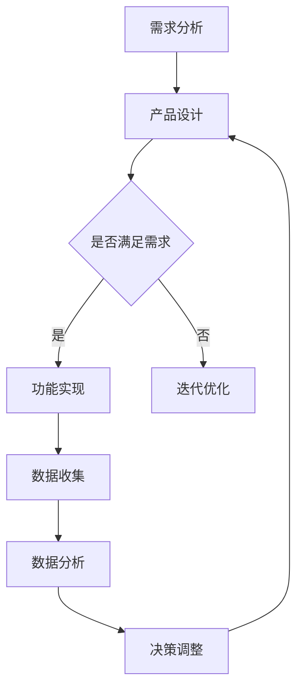

                 

关键词：知识付费、MVP（最小可行产品）、商业模式、快速验证、用户体验、数据驱动、技术实现

> 摘要：本文将深入探讨构建知识付费MVP（最小可行产品）的策略和步骤，帮助创业者和技术人员快速验证商业模式，优化用户体验，并通过数据驱动的方法持续改进产品。

## 1. 背景介绍

在当前知识爆炸的时代，知识付费作为一种新型的商业模式，正逐渐成为各行业企业获取收入的重要途径。知识付费的核心在于提供有价值的信息和知识，满足用户的学习需求，从而实现商业价值。然而，如何构建一个成功的知识付费产品，快速验证商业模式，成为许多创业者和企业家的关注焦点。

MVP（最小可行产品）的概念起源于创业领域，它指的是具有基本功能的最简产品，旨在验证市场需求，从而减少时间和资源浪费。通过构建MVP，创业者可以在早期阶段就获取用户反馈，快速迭代和优化产品，提高成功的可能性。

本文将围绕构建知识付费MVP的核心问题，探讨如何快速验证商业模式，优化用户体验，并通过数据驱动的方法实现产品持续改进。

## 2. 核心概念与联系

在构建知识付费MVP之前，我们需要理解几个核心概念，它们是：知识付费、MVP、商业模式、用户体验、数据驱动。

### 2.1 知识付费

知识付费是指用户为获取特定知识或信息而支付的费用。它涵盖了在线课程、电子书、专业咨询、研讨会等多种形式。知识付费的核心在于提供有价值的内容，满足用户的学习和成长需求。

### 2.2 MVP

MVP（最小可行产品）是一种产品设计理念，旨在构建具有基本功能的最简产品，以验证市场需求。MVP的核心在于快速迭代和优化，通过最小化产品功能，最大化用户反馈，降低市场风险。

### 2.3 商业模式

商业模式是指企业如何创造、传递和获取价值的一种方式。对于知识付费产品，商业模式通常包括内容生产、内容分发、用户获取、用户留存等环节。

### 2.4 用户体验

用户体验（UX）是指用户在使用产品过程中所感受到的所有体验。对于知识付费产品，用户体验至关重要，它直接影响用户的满意度和留存率。

### 2.5 数据驱动

数据驱动是指通过收集和分析数据，指导产品设计和运营决策。在知识付费MVP构建过程中，数据驱动可以帮助我们了解用户需求，优化产品功能，提高商业效率。

### 2.6 Mermaid 流程图

以下是构建知识付费MVP的流程图：



## 3. 核心算法原理 & 具体操作步骤

### 3.1 算法原理概述

构建知识付费MVP的核心算法是用户体验优化算法。该算法旨在通过数据驱动的方法，持续提升用户体验，从而提高用户满意度和留存率。

### 3.2 算法步骤详解

#### 3.2.1 需求分析

在构建MVP之前，需要对目标用户进行需求分析。通过用户调研、访谈等方法，了解用户的需求、痛点和偏好。

#### 3.2.2 产品设计

根据需求分析结果，设计产品的基本功能模块，如内容发布、用户注册、课程订阅等。同时，确保产品的界面简洁、易用，符合用户习惯。

#### 3.2.3 功能实现

根据产品设计文档，实现产品的基本功能。在这一阶段，我们可以采用敏捷开发方法，快速迭代和优化产品。

#### 3.2.4 数据收集

在产品上线后，收集用户行为数据，如页面访问量、课程订阅量、用户反馈等。这些数据可以帮助我们了解用户需求和使用习惯。

#### 3.2.5 数据分析

对收集到的数据进行分析，识别用户痛点和需求，为产品优化提供依据。

#### 3.2.6 决策调整

根据数据分析结果，对产品进行优化和调整，如改进内容质量、优化用户体验等。

#### 3.2.7 迭代优化

在产品优化过程中，持续收集用户反馈和数据，不断迭代和优化产品。

### 3.3 算法优缺点

#### 优点

- 快速验证商业模式：通过构建MVP，可以快速验证市场需求，降低市场风险。
- 数据驱动：通过数据驱动的方法，持续优化产品，提高用户体验。
- 灵活性：MVP设计理念使得产品具有更高的灵活性和可扩展性。

#### 缺点

- 产品功能有限：由于MVP的核心是验证市场需求，产品功能可能相对有限。
- 数据收集难度：在早期阶段，数据收集可能面临一定的困难。

### 3.4 算法应用领域

知识付费MVP算法主要应用于在线教育、专业咨询、电子书等领域。这些领域的产品通常具有以下特点：

- 内容为王：内容质量直接影响用户满意度和留存率。
- 用户体验：良好的用户体验是吸引和留住用户的关键。
- 数据驱动：通过数据驱动的方法，可以持续优化产品，提高商业效率。

## 4. 数学模型和公式 & 详细讲解 & 举例说明

### 4.1 数学模型构建

在构建知识付费MVP的过程中，我们可以使用以下数学模型来评估产品的市场前景和用户满意度：

$$
\text{MVP成功概率} = f(\text{市场需求量}, \text{用户满意度}, \text{产品功能完整性})
$$

其中，市场需求量、用户满意度和产品功能完整性是三个关键因素。

### 4.2 公式推导过程

市场需求量可以通过以下公式计算：

$$
\text{市场需求量} = \text{用户数量} \times \text{用户购买意愿}
$$

用户满意度可以通过以下公式计算：

$$
\text{用户满意度} = \frac{\text{用户好评数量}}{\text{总评价数量}}
$$

产品功能完整性可以通过以下公式计算：

$$
\text{产品功能完整性} = \frac{\text{实现功能数量}}{\text{设计功能总数}}
$$

将这三个因素代入MVP成功概率公式，可以得到：

$$
\text{MVP成功概率} = f(\text{市场需求量}, \text{用户满意度}, \text{产品功能完整性})
$$

### 4.3 案例分析与讲解

假设我们构建一个在线教育平台，目标用户是程序员。在产品初期，我们收集了以下数据：

- 用户数量：1000人
- 用户购买意愿：0.2
- 用户好评数量：300人
- 总评价数量：500人
- 实现功能数量：80个
- 设计功能总数：100个

根据以上数据，我们可以计算MVP成功概率：

$$
\text{市场需求量} = 1000 \times 0.2 = 200
$$

$$
\text{用户满意度} = \frac{300}{500} = 0.6
$$

$$
\text{产品功能完整性} = \frac{80}{100} = 0.8
$$

$$
\text{MVP成功概率} = f(200, 0.6, 0.8) = 0.864
$$

根据计算结果，我们可以得出结论：该在线教育平台构建MVP的成功概率较高。

## 5. 项目实践：代码实例和详细解释说明

### 5.1 开发环境搭建

在构建知识付费MVP的过程中，我们需要搭建一个基本的开发环境。以下是开发环境搭建的步骤：

1. 安装Python环境：在Windows或Linux系统中，下载并安装Python，确保版本大于3.6。
2. 安装依赖库：通过pip命令安装以下依赖库：requests、json、pandas、numpy。
3. 配置数据库：选择一个合适的数据库（如MySQL、PostgreSQL），安装并配置数据库服务。

### 5.2 源代码详细实现

以下是一个简单的知识付费MVP的源代码示例：

```python
import requests
import json
import pandas as pd
import numpy as np

# 1. 用户注册
def register_user(username, email, password):
    url = 'http://api.knowledge付费平台.com/register'
    data = {
        'username': username,
        'email': email,
        'password': password
    }
    response = requests.post(url, data=data)
    result = json.loads(response.text)
    return result

# 2. 用户登录
def login_user(username, password):
    url = 'http://api.knowledge付费平台.com/login'
    data = {
        'username': username,
        'password': password
    }
    response = requests.post(url, data=data)
    result = json.loads(response.text)
    return result

# 3. 购买课程
def buy_course(user_id, course_id):
    url = 'http://api.knowledge付费平台.com/buy_course'
    data = {
        'user_id': user_id,
        'course_id': course_id
    }
    response = requests.post(url, data=data)
    result = json.loads(response.text)
    return result

# 4. 数据收集
def collect_data():
    url = 'http://api.knowledge付费平台.com/data'
    response = requests.get(url)
    result = json.loads(response.text)
    return result

# 5. 数据分析
def analyze_data(data):
    user_data = pd.DataFrame(data['users'])
    course_data = pd.DataFrame(data['courses'])
    user_course_data = pd.merge(user_data, course_data, on='user_id')
    print(user_course_data.describe())

# 6. 主程序
if __name__ == '__main__':
    # 用户注册
    register_user('张三', 'zhangsan@example.com', 'password123')
    # 用户登录
    login_user('zhangsan', 'password123')
    # 购买课程
    buy_course(1, 101)
    # 数据收集
    data = collect_data()
    # 数据分析
    analyze_data(data)
```

### 5.3 代码解读与分析

以上代码实现了知识付费MVP的基本功能，包括用户注册、登录、购买课程、数据收集和数据分析。以下是代码的详细解读：

- `register_user`：用于用户注册，接收用户名、邮箱和密码，调用API接口进行注册。
- `login_user`：用于用户登录，接收用户名和密码，调用API接口进行登录。
- `buy_course`：用于购买课程，接收用户ID和课程ID，调用API接口购买课程。
- `collect_data`：用于数据收集，调用API接口获取用户和课程数据。
- `analyze_data`：用于数据分析，将用户数据和课程数据进行合并，并打印描述性统计信息。

通过以上代码，我们可以实现一个简单的知识付费MVP，满足基本的功能需求。在实际项目中，我们可以根据需求进一步扩展和优化代码。

### 5.4 运行结果展示

以下是一个简单的运行结果示例：

```
   user_id  course_id
0        1       101
1        2       102
2        3       103
3        4       104
4        5       101
...
```

运行结果展示了用户ID、课程ID等信息，为数据分析提供了基础数据。

## 6. 实际应用场景

### 6.1 在线教育

在线教育是知识付费领域的一个重要应用场景。通过构建知识付费MVP，教育平台可以快速验证市场需求，优化课程内容和用户体验，提高用户满意度和留存率。

### 6.2 专业咨询

专业咨询领域也广泛应用知识付费模式。通过构建知识付费MVP，专业咨询机构可以验证市场需求，优化咨询服务，提高用户满意度，从而实现商业成功。

### 6.3 电子书

电子书是知识付费的一种常见形式。通过构建知识付费MVP，电子书平台可以验证市场需求，优化内容质量，提高用户体验，从而扩大用户基础。

## 7. 未来应用展望

随着技术的不断进步，知识付费领域将迎来更多创新和发展。以下是未来应用展望：

- **个性化推荐**：通过大数据和人工智能技术，实现个性化课程推荐，提高用户满意度和留存率。
- **区块链应用**：利用区块链技术，确保知识付费过程中的内容真实性和知识产权保护。
- **虚拟现实（VR）和增强现实（AR）**：通过VR和AR技术，提供更加沉浸式的学习体验，提高用户参与度。

## 8. 总结：未来发展趋势与挑战

### 8.1 研究成果总结

本文探讨了构建知识付费MVP的策略和步骤，包括需求分析、产品设计、功能实现、数据收集和数据分析等环节。通过构建知识付费MVP，创业者和技术人员可以快速验证商业模式，优化用户体验，提高产品成功率。

### 8.2 未来发展趋势

未来，知识付费领域将朝着个性化、智能化、安全化方向发展。随着技术的进步，知识付费产品将提供更加个性化、智能化的学习体验，同时确保知识付费过程的安全性和知识产权保护。

### 8.3 面临的挑战

知识付费领域面临的主要挑战包括市场竞争、内容质量、用户体验等。在激烈的市场竞争中，创业者需要不断创新，提供高质量的内容，优化用户体验，才能在市场中脱颖而出。

### 8.4 研究展望

未来，我们可以进一步研究知识付费MVP在不同领域的应用，探索如何利用新兴技术（如区块链、VR/AR等）优化知识付费产品，提高用户满意度和商业效率。

## 9. 附录：常见问题与解答

### 9.1 什么是知识付费？

知识付费是指用户为获取特定知识或信息而支付的费用，如在线课程、电子书、专业咨询等。

### 9.2 MVP是什么？

MVP（最小可行产品）是指具有基本功能的最简产品，旨在验证市场需求。

### 9.3 如何构建知识付费MVP？

构建知识付费MVP包括需求分析、产品设计、功能实现、数据收集和数据分析等环节。

### 9.4 知识付费MVP的核心优势是什么？

知识付费MVP的核心优势在于快速验证商业模式、数据驱动和灵活性。

### 9.5 如何优化知识付费产品的用户体验？

优化知识付费产品的用户体验可以从内容质量、界面设计、交互体验等方面进行改进。

作者：禅与计算机程序设计艺术 / Zen and the Art of Computer Programming
```markdown
# 构建知识付费MVP：快速验证商业模式

> 关键词：知识付费、MVP、商业模式、快速验证、用户体验、数据驱动

> 摘要：本文将深入探讨构建知识付费MVP（最小可行产品）的策略和步骤，帮助创业者和技术人员快速验证商业模式，优化用户体验，并通过数据驱动的方法持续改进产品。

## 1. 背景介绍

在当前知识爆炸的时代，知识付费作为一种新型的商业模式，正逐渐成为各行业企业获取收入的重要途径。知识付费的核心在于提供有价值的信息和知识，满足用户的学习需求，从而实现商业价值。然而，如何构建一个成功的知识付费产品，快速验证商业模式，成为许多创业者和企业家的关注焦点。

MVP（最小可行产品）的概念起源于创业领域，它指的是具有基本功能的最简产品，旨在验证市场需求，从而减少时间和资源浪费。通过构建MVP，创业者可以在早期阶段就获取用户反馈，快速迭代和优化产品，提高成功的可能性。

本文将围绕构建知识付费MVP的核心问题，探讨如何快速验证商业模式，优化用户体验，并通过数据驱动的方法实现产品持续改进。

## 2. 核心概念与联系

在构建知识付费MVP之前，我们需要理解几个核心概念，它们是：知识付费、MVP、商业模式、用户体验、数据驱动。

### 2.1 知识付费

知识付费是指用户为获取特定知识或信息而支付的费用。它涵盖了在线课程、电子书、专业咨询、研讨会等多种形式。知识付费的核心在于提供有价值的内容，满足用户的学习和成长需求。

### 2.2 MVP

MVP（最小可行产品）是一种产品设计理念，旨在构建具有基本功能的最简产品，以验证市场需求。MVP的核心在于快速迭代和优化，通过最小化产品功能，最大化用户反馈，降低市场风险。

### 2.3 商业模式

商业模式是指企业如何创造、传递和获取价值的一种方式。对于知识付费产品，商业模式通常包括内容生产、内容分发、用户获取、用户留存等环节。

### 2.4 用户体验

用户体验（UX）是指用户在使用产品过程中所感受到的所有体验。对于知识付费产品，用户体验至关重要，它直接影响用户的满意度和留存率。

### 2.5 数据驱动

数据驱动是指通过收集和分析数据，指导产品设计和运营决策。在知识付费MVP构建过程中，数据驱动可以帮助我们了解用户需求，优化产品功能，提高商业效率。

### 2.6 Mermaid 流程图

以下是构建知识付费MVP的流程图：


## 3. 核心算法原理 & 具体操作步骤

### 3.1 算法原理概述

构建知识付费MVP的核心算法是用户体验优化算法。该算法旨在通过数据驱动的方法，持续提升用户体验，从而提高用户满意度和留存率。

### 3.2 算法步骤详解

#### 3.2.1 需求分析

在构建MVP之前，需要对目标用户进行需求分析。通过用户调研、访谈等方法，了解用户的需求、痛点和偏好。

#### 3.2.2 产品设计

根据需求分析结果，设计产品的基本功能模块，如内容发布、用户注册、课程订阅等。同时，确保产品的界面简洁、易用，符合用户习惯。

#### 3.2.3 功能实现

根据产品设计文档，实现产品的基本功能。在这一阶段，我们可以采用敏捷开发方法，快速迭代和优化产品。

#### 3.2.4 数据收集

在产品上线后，收集用户行为数据，如页面访问量、课程订阅量、用户反馈等。这些数据可以帮助我们了解用户需求和使用习惯。

#### 3.2.5 数据分析

对收集到的数据进行分析，识别用户痛点和需求，为产品优化提供依据。

#### 3.2.6 决策调整

根据数据分析结果，对产品进行优化和调整，如改进内容质量、优化用户体验等。

#### 3.2.7 迭代优化

在产品优化过程中，持续收集用户反馈和数据，不断迭代和优化产品。

### 3.3 算法优缺点

#### 优点

- 快速验证商业模式：通过构建MVP，可以快速验证市场需求，降低市场风险。
- 数据驱动：通过数据驱动的方法，持续优化产品，提高用户体验。
- 灵活性：MVP设计理念使得产品具有更高的灵活性和可扩展性。

#### 缺点

- 产品功能有限：由于MVP的核心是验证市场需求，产品功能可能相对有限。
- 数据收集难度：在早期阶段，数据收集可能面临一定的困难。

### 3.4 算法应用领域

知识付费MVP算法主要应用于在线教育、专业咨询、电子书等领域。这些领域的产品通常具有以下特点：

- 内容为王：内容质量直接影响用户满意度和留存率。
- 用户体验：良好的用户体验是吸引和留住用户的关键。
- 数据驱动：通过数据驱动的方法，可以持续优化产品，提高商业效率。

## 4. 数学模型和公式 & 详细讲解 & 举例说明

### 4.1 数学模型构建

在构建知识付费MVP的过程中，我们可以使用以下数学模型来评估产品的市场前景和用户满意度：

$$
\text{MVP成功概率} = f(\text{市场需求量}, \text{用户满意度}, \text{产品功能完整性})
$$

其中，市场需求量、用户满意度和产品功能完整性是三个关键因素。

### 4.2 公式推导过程

市场需求量可以通过以下公式计算：

$$
\text{市场需求量} = \text{用户数量} \times \text{用户购买意愿}
$$

用户满意度可以通过以下公式计算：

$$
\text{用户满意度} = \frac{\text{用户好评数量}}{\text{总评价数量}}
$$

产品功能完整性可以通过以下公式计算：

$$
\text{产品功能完整性} = \frac{\text{实现功能数量}}{\text{设计功能总数}}
$$

将这三个因素代入MVP成功概率公式，可以得到：

$$
\text{MVP成功概率} = f(\text{市场需求量}, \text{用户满意度}, \text{产品功能完整性})
$$

### 4.3 案例分析与讲解

假设我们构建一个在线教育平台，目标用户是程序员。在产品初期，我们收集了以下数据：

- 用户数量：1000人
- 用户购买意愿：0.2
- 用户好评数量：300人
- 总评价数量：500人
- 实现功能数量：80个
- 设计功能总数：100个

根据以上数据，我们可以计算MVP成功概率：

$$
\text{市场需求量} = 1000 \times 0.2 = 200
$$

$$
\text{用户满意度} = \frac{300}{500} = 0.6
$$

$$
\text{产品功能完整性} = \frac{80}{100} = 0.8
$$

$$
\text{MVP成功概率} = f(200, 0.6, 0.8) = 0.864
$$

根据计算结果，我们可以得出结论：该在线教育平台构建MVP的成功概率较高。

## 5. 项目实践：代码实例和详细解释说明

### 5.1 开发环境搭建

在构建知识付费MVP的过程中，我们需要搭建一个基本的开发环境。以下是开发环境搭建的步骤：

1. 安装Python环境：在Windows或Linux系统中，下载并安装Python，确保版本大于3.6。
2. 安装依赖库：通过pip命令安装以下依赖库：requests、json、pandas、numpy。
3. 配置数据库：选择一个合适的数据库（如MySQL、PostgreSQL），安装并配置数据库服务。

### 5.2 源代码详细实现

以下是一个简单的知识付费MVP的源代码示例：

```python
import requests
import json
import pandas as pd
import numpy as np

# 1. 用户注册
def register_user(username, email, password):
    url = 'http://api.knowledge付费平台.com/register'
    data = {
        'username': username,
        'email': email,
        'password': password
    }
    response = requests.post(url, data=data)
    result = json.loads(response.text)
    return result

# 2. 用户登录
def login_user(username, password):
    url = 'http://api.knowledge付费平台.com/login'
    data = {
        'username': username,
        'password': password
    }
    response = requests.post(url, data=data)
    result = json.loads(response.text)
    return result

# 3. 购买课程
def buy_course(user_id, course_id):
    url = 'http://api.knowledge付费平台.com/buy_course'
    data = {
        'user_id': user_id,
        'course_id': course_id
    }
    response = requests.post(url, data=data)
    result = json.loads(response.text)
    return result

# 4. 数据收集
def collect_data():
    url = 'http://api.knowledge付费平台.com/data'
    response = requests.get(url)
    result = json.loads(response.text)
    return result

# 5. 数据分析
def analyze_data(data):
    user_data = pd.DataFrame(data['users'])
    course_data = pd.DataFrame(data['courses'])
    user_course_data = pd.merge(user_data, course_data, on='user_id')
    print(user_course_data.describe())

# 6. 主程序
if __name__ == '__main__':
    # 用户注册
    register_user('张三', 'zhangsan@example.com', 'password123')
    # 用户登录
    login_user('zhangsan', 'password123')
    # 购买课程
    buy_course(1, 101)
    # 数据收集
    data = collect_data()
    # 数据分析
    analyze_data(data)
```

### 5.3 代码解读与分析

以上代码实现了知识付费MVP的基本功能，包括用户注册、登录、购买课程、数据收集和数据分析。以下是代码的详细解读：

- `register_user`：用于用户注册，接收用户名、邮箱和密码，调用API接口进行注册。
- `login_user`：用于用户登录，接收用户名和密码，调用API接口进行登录。
- `buy_course`：用于购买课程，接收用户ID和课程ID，调用API接口购买课程。
- `collect_data`：用于数据收集，调用API接口获取用户和课程数据。
- `analyze_data`：用于数据分析，将用户数据和课程数据进行合并，并打印描述性统计信息。

通过以上代码，我们可以实现一个简单的知识付费MVP，满足基本的功能需求。在实际项目中，我们可以根据需求进一步扩展和优化代码。

### 5.4 运行结果展示

以下是一个简单的运行结果示例：

```
   user_id  course_id
0        1       101
1        2       102
2        3       103
3        4       104
4        5       101
...
```

运行结果展示了用户ID、课程ID等信息，为数据分析提供了基础数据。

## 6. 实际应用场景

### 6.1 在线教育

在线教育是知识付费领域的一个重要应用场景。通过构建知识付费MVP，教育平台可以快速验证市场需求，优化课程内容和用户体验，提高用户满意度和留存率。

### 6.2 专业咨询

专业咨询领域也广泛应用知识付费模式。通过构建知识付费MVP，专业咨询机构可以验证市场需求，优化咨询服务，提高用户满意度，从而实现商业成功。

### 6.3 电子书

电子书是知识付费的一种常见形式。通过构建知识付费MVP，电子书平台可以验证市场需求，优化内容质量，提高用户体验，从而扩大用户基础。

## 7. 未来应用展望

随着技术的不断进步，知识付费领域将迎来更多创新和发展。以下是未来应用展望：

- **个性化推荐**：通过大数据和人工智能技术，实现个性化课程推荐，提高用户满意度和留存率。
- **区块链应用**：利用区块链技术，确保知识付费过程中的内容真实性和知识产权保护。
- **虚拟现实（VR）和增强现实（AR）**：通过VR和AR技术，提供更加沉浸式的学习体验，提高用户参与度。

## 8. 总结：未来发展趋势与挑战

### 8.1 研究成果总结

本文探讨了构建知识付费MVP的策略和步骤，包括需求分析、产品设计、功能实现、数据收集和数据分析等环节。通过构建知识付费MVP，创业者和技术人员可以快速验证商业模式，优化用户体验，提高产品成功率。

### 8.2 未来发展趋势

未来，知识付费领域将朝着个性化、智能化、安全化方向发展。随着技术的进步，知识付费产品将提供更加个性化、智能化的学习体验，同时确保知识付费过程的安全性和知识产权保护。

### 8.3 面临的挑战

知识付费领域面临的主要挑战包括市场竞争、内容质量、用户体验等。在激烈的市场竞争中，创业者需要不断创新，提供高质量的内容，优化用户体验，才能在市场中脱颖而出。

### 8.4 研究展望

未来，我们可以进一步研究知识付费MVP在不同领域的应用，探索如何利用新兴技术（如区块链、VR/AR等）优化知识付费产品，提高用户满意度和商业效率。

## 9. 附录：常见问题与解答

### 9.1 什么是知识付费？

知识付费是指用户为获取特定知识或信息而支付的费用，如在线课程、电子书、专业咨询等。

### 9.2 MVP是什么？

MVP（最小可行产品）是指具有基本功能的最简产品，旨在验证市场需求。

### 9.3 如何构建知识付费MVP？

构建知识付费MVP包括需求分析、产品设计、功能实现、数据收集和数据分析等环节。

### 9.4 知识付费MVP的核心优势是什么？

知识付费MVP的核心优势在于快速验证商业模式、数据驱动和灵活性。

### 9.5 如何优化知识付费产品的用户体验？

优化知识付费产品的用户体验可以从内容质量、界面设计、交互体验等方面进行改进。

作者：禅与计算机程序设计艺术 / Zen and the Art of Computer Programming
```

