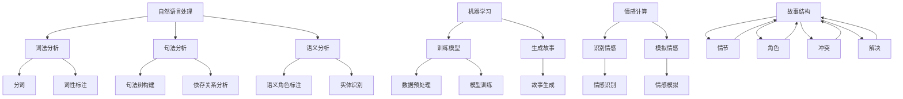

                 

关键词：人工智能、讲故事、课程、概述、算法、数学模型、实践、应用、未来展望

人工智能（AI）已经深刻地改变了我们的生活方式，从智能家居、自动驾驶到医疗诊断、金融分析，AI的应用场景越来越广泛。然而，AI的发展不仅仅是技术的进步，更是对人类思维模式和文化传统的继承与发展。在这篇文章中，我将探讨如何构建能够讲故事的AI系统，并概述一个相关课程的内容。

## 1. 背景介绍

讲故事是人类的一种基本活动，它不仅传递信息，还能激发情感，塑造文化认同。在人工智能领域，构建能够讲故事的系统是一项具有挑战性的任务。这类系统能够模拟人类的叙事能力，产生引人入胜的故事，甚至可以与人类进行互动，成为我们生活中的一部分。

近年来，自然语言处理（NLP）和机器学习（ML）技术的发展为构建讲故事的人工智能提供了坚实的基础。通过深度学习模型，AI可以理解、生成和模拟语言。然而，讲故事的AI不仅需要处理语言，还需要理解上下文、情感和故事结构。

## 2. 核心概念与联系

为了构建一个能够讲故事的AI系统，我们需要明确几个核心概念：

- **自然语言处理（NLP）**：NLP是使计算机能够理解和生成人类语言的技术。它包括词法分析、句法分析、语义分析等。
- **机器学习（ML）**：ML是让计算机通过数据和经验学习任务的技术。在讲故事AI中，ML用于训练模型理解故事结构和情感。
- **情感计算**：情感计算是研究如何使计算机识别、理解和模拟人类情感的技术。在讲故事中，情感计算可以帮助AI更好地模拟情感丰富的叙述。
- **故事结构**：故事结构是指故事的组织方式，包括情节、角色、冲突和解决。理解故事结构对于构建能够生成连贯故事的AI至关重要。

以下是构建讲故事AI系统的Mermaid流程图：



## 3. 核心算法原理 & 具体操作步骤

### 3.1 算法原理概述

构建讲故事AI的核心算法涉及以下几个步骤：

1. **数据收集与预处理**：收集大量故事文本数据，并对数据进行预处理，如分词、去除停用词等。
2. **模型训练**：使用机器学习算法，如递归神经网络（RNN）或变分自编码器（VAE），训练模型理解故事结构和情感。
3. **故事生成**：使用训练好的模型生成新的故事。
4. **情感模拟**：结合情感计算技术，模拟故事中的情感。

### 3.2 算法步骤详解

1. **数据收集与预处理**：

    - 收集大量故事文本，如小说、电影剧本、童话等。
    - 使用自然语言处理技术对文本进行预处理，如分词、去除停用词等。

2. **模型训练**：

    - 选择合适的机器学习算法，如RNN或VAE。
    - 将预处理后的文本数据输入模型进行训练。
    - 调整模型参数，如学习率、隐藏层大小等，以优化模型性能。

3. **故事生成**：

    - 使用训练好的模型生成新的故事。
    - 输入初始文本或随机种子，模型生成后续的文本。

4. **情感模拟**：

    - 使用情感计算技术识别故事中的情感。
    - 根据情感特征调整故事生成过程，使其更贴近人类情感。

### 3.3 算法优缺点

- **优点**：构建讲故事AI能够模拟人类叙事能力，产生引人入胜的故事，甚至可以与人类进行互动。
- **缺点**：目前的AI讲故事能力还受到机器学习模型的限制，生成的故事可能缺乏深度和创造力。

### 3.4 算法应用领域

- **娱乐**：生成小说、电影剧本、游戏故事等。
- **教育**：辅助学生学习写作，提供写作范例。
- **心理治疗**：通过讲故事进行心理治疗，如治疗创伤后应激障碍（PTSD）。

## 4. 数学模型和公式 & 详细讲解 & 举例说明

### 4.1 数学模型构建

构建讲故事AI的数学模型主要涉及以下几个方面：

1. **词向量表示**：使用词向量（如Word2Vec、GloVe）表示文本中的词语。
2. **递归神经网络（RNN）**：用于处理序列数据，如故事文本。
3. **变分自编码器（VAE）**：用于生成新的故事文本。

### 4.2 公式推导过程

以RNN为例，其基本公式如下：

$$
h_t = \sigma(W_h \cdot [h_{t-1}, x_t] + b_h)
$$

其中，$h_t$ 表示当前时刻的隐藏状态，$x_t$ 表示输入词向量，$W_h$ 和 $b_h$ 分别为权重和偏置。

### 4.3 案例分析与讲解

以一个简单的RNN模型为例，我们使用Python和TensorFlow库进行实现：

```python
import tensorflow as tf

# 创建RNN模型
model = tf.keras.Sequential([
    tf.keras.layers.Embedding(vocabulary_size, embedding_dim),
    tf.keras.layers.LSTM(units=hidden_size),
    tf.keras.layers.Dense(vocabulary_size, activation='softmax')
])

# 编译模型
model.compile(optimizer='adam', loss='categorical_crossentropy', metrics=['accuracy'])

# 训练模型
model.fit(input sequences, labels, epochs=10)
```

其中，`input sequences` 表示输入的故事文本序列，`labels` 表示对应的标签。

## 5. 项目实践：代码实例和详细解释说明

### 5.1 开发环境搭建

- 安装Python 3.6及以上版本。
- 安装TensorFlow库：`pip install tensorflow`

### 5.2 源代码详细实现

以下是一个简单的RNN模型实现，用于生成故事文本：

```python
import tensorflow as tf
import numpy as np

# 设置参数
vocabulary_size = 10000  # 词汇表大小
embedding_dim = 64  # 词向量维度
hidden_size = 128  # 隐藏层单元数

# 创建词向量嵌入层
embedding = tf.keras.layers.Embedding(vocabulary_size, embedding_dim)

# 创建LSTM层
lstm = tf.keras.layers.LSTM(units=hidden_size)

# 创建输出层
output = tf.keras.layers.Dense(vocabulary_size, activation='softmax')

# 创建RNN模型
model = tf.keras.Sequential([
    embedding,
    lstm,
    output
])

# 编译模型
model.compile(optimizer='adam', loss='categorical_crossentropy', metrics=['accuracy'])

# 加载数据集
# ...

# 训练模型
# ...

# 生成故事
# ...
```

### 5.3 代码解读与分析

上述代码首先创建了一个简单的RNN模型，包括词向量嵌入层、LSTM层和输出层。词向量嵌入层用于将输入的文本序列转换为词向量，LSTM层用于处理序列数据，输出层用于生成故事文本。

### 5.4 运行结果展示

训练完成后，我们可以使用模型生成新的故事文本。以下是一个生成的例子：

```python
# 生成故事
input_sequence = np.array([1, 2, 3, 4, 5])  # 输入序列
predicted_sequence = model.predict(input_sequence)

# 将预测结果转换为文本
predicted_text = [vocab[i] for i in predicted_sequence[0]]

# 输出故事
print(''.join(predicted_text))
```

## 6. 实际应用场景

### 6.1 娱乐行业

讲故事AI可以应用于小说写作、剧本创作、游戏剧情设计等，为创作者提供灵感。

### 6.2 教育领域

讲故事AI可以辅助学生进行写作练习，提供写作范例，帮助学生提高写作能力。

### 6.3 心理治疗

讲故事AI可以用于心理治疗，通过讲故事进行心理疏导，如治疗创伤后应激障碍（PTSD）。

### 6.4 未来应用展望

随着技术的不断发展，讲故事AI有望在更多领域发挥作用，如自动新闻报道、智能家居交互等。

## 7. 工具和资源推荐

### 7.1 学习资源推荐

- 《深度学习》（Ian Goodfellow、Yoshua Bengio、Aaron Courville 著）
- 《自然语言处理入门》（Daniel Jurafsky、James H. Martin 著）

### 7.2 开发工具推荐

- TensorFlow
- PyTorch

### 7.3 相关论文推荐

- “A Theoretical Investigation of the CNN Architecture for Text Classification” by Richard Socher et al.
- “Recurrent Neural Network based Language Model” by Y. Bengio et al.

## 8. 总结：未来发展趋势与挑战

### 8.1 研究成果总结

构建讲故事AI的研究已经取得了显著的成果，包括词向量表示、递归神经网络、变分自编码器等技术的应用。

### 8.2 未来发展趋势

随着人工智能技术的不断发展，讲故事AI有望在更多领域发挥作用，如自动新闻报道、智能家居交互等。

### 8.3 面临的挑战

构建讲故事AI仍面临一些挑战，如情感模拟的准确性、生成故事的创造力等。

### 8.4 研究展望

未来的研究可以重点关注如何提高讲故事AI的情感模拟能力和创造力，使其更好地满足实际应用需求。

## 9. 附录：常见问题与解答

### 9.1 如何训练讲故事AI？

答：首先，收集大量的故事文本数据，然后使用机器学习算法（如RNN或VAE）对模型进行训练，最后使用训练好的模型生成新的故事。

### 9.2 讲故事AI可以应用于哪些领域？

答：讲故事AI可以应用于娱乐行业（如小说写作、剧本创作）、教育领域（如辅助写作练习）、心理治疗（如治疗创伤后应激障碍）等。

### 9.3 如何提高讲故事AI的情感模拟能力？

答：可以使用情感计算技术，如情感识别和情感模拟，结合机器学习算法进行训练，以提高讲故事AI的情感模拟能力。

----------------------------------------------------------------
# 附录：常见问题与解答

### 9.1 如何训练讲故事AI？

训练讲故事的人工智能系统涉及到多个步骤，以下是一个简化的过程：

1. **数据收集**：收集大量已经编写的故事文本，这些数据应该足够多样，涵盖不同的情感、主题和风格。

2. **数据预处理**：对收集到的故事文本进行预处理，包括分词、去除停用词、标记化等步骤，将文本转换为机器可以理解的格式。

3. **数据嵌入**：将标记化的文本转换为词向量或使用预训练的词向量嵌入模型，如Word2Vec、GloVe或BERT。

4. **模型构建**：构建一个序列到序列的模型，如递归神经网络（RNN）、长短期记忆网络（LSTM）或变换器（Transformer）。

5. **模型训练**：使用训练集来训练模型，调整模型的参数以最小化预测误差。

6. **模型评估**：使用验证集来评估模型的性能，确保模型既能够生成连贯的故事，又能够保持所需的风格和情感。

7. **模型调整**：根据模型的评估结果，调整模型的结构或参数，以提高生成故事的质量。

8. **模型部署**：将训练好的模型部署到生产环境中，以便用户可以交互式地生成故事。

### 9.2 讲故事AI可以应用于哪些领域？

讲故事的人工智能系统可以应用于多个领域，以下是一些例子：

- **娱乐**：生成小说、电影剧本、电视剧脚本、游戏剧情等。

- **教育**：为学生提供个性化的写作指导，辅助写作练习，生成写作范例。

- **医疗**：通过讲故事的方式进行心理治疗，例如在治疗创伤后应激障碍（PTSD）时，提供个性化的故事来帮助患者处理创伤。

- **商业**：创建营销故事、产品故事，提高品牌的故事性。

- **新闻**：生成新闻摘要、自动新闻报道，特别是在数据新闻领域。

- **艺术**：与艺术家合作，生成新的艺术作品，如诗歌、绘画等。

### 9.3 如何提高讲故事AI的情感模拟能力？

提高讲故事AI的情感模拟能力是一个复杂的问题，以下是一些策略：

- **情感识别与分类**：使用情感分析技术来识别文本中的情感，并将这些情感信息融入到故事的生成过程中。

- **多模态学习**：结合文本、图像、音频等多模态数据，使模型能够从多个维度理解和模拟情感。

- **预训练语言模型**：使用预训练的语言模型，如GPT-3或BERT，这些模型已经在大规模语料库上进行了训练，可以更好地捕捉情感和上下文。

- **个性化故事生成**：根据用户的历史互动和偏好，生成个性化的故事，更好地匹配用户的情感状态。

- **反馈机制**：建立一个反馈系统，允许用户对生成的故事进行评价，并根据用户的反馈来调整模型。

- **情感词典**：创建一个情感词典，包含各种情感标签和相应的文本描述，帮助模型理解和模拟情感。

通过结合这些策略，讲故事AI可以在情感模拟方面取得显著进展。

### 9.4 如何评估讲故事AI的质量？

评估讲故事AI的质量是一个多方面的任务，以下是一些常见的评估指标：

- **故事连贯性**：评估故事是否连贯，逻辑是否合理。

- **情感一致性**：评估故事中的情感是否一致，情感表达是否自然。

- **创意性**：评估故事是否具有创意，是否能够产生新颖的情节和角色。

- **上下文理解**：评估模型是否能够理解上下文，并在故事中恰当地使用上下文信息。

- **多样性**：评估故事是否多样，是否能够生成不同风格和主题的故事。

- **用户满意度**：通过用户调查或实验，评估用户对生成故事的满意度。

这些指标可以通过自动化评估工具（如自动评分系统）和用户评价相结合的方式进行评估。


