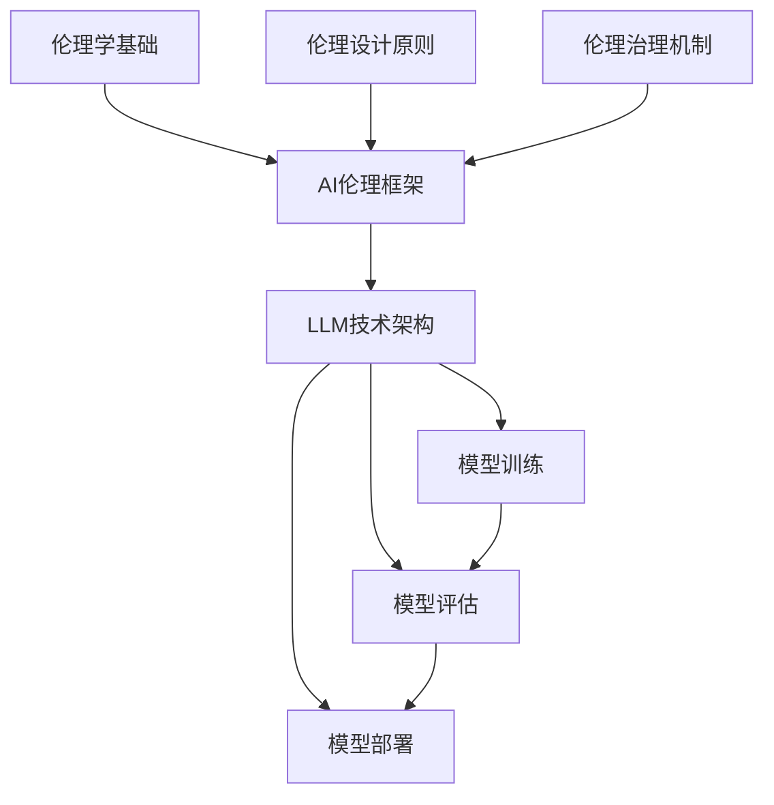

                 

 关键词：（负责任的AI、伦理、语言模型、伦理性、构建、监督、治理）

> 摘要：随着人工智能技术的发展，尤其是大型语言模型（LLM）的广泛应用，确保这些模型行为的伦理性成为了一个亟待解决的问题。本文旨在探讨如何构建负责任的AI系统，重点关注LLM行为的伦理监督和治理机制，并提出了一系列实践策略和解决方案。

## 1. 背景介绍

近年来，人工智能（AI）技术发展迅猛，特别是大型语言模型（Large Language Models，LLM）如GPT、BERT等在自然语言处理（NLP）领域取得了显著的成果。这些模型能够生成高质量的自然语言文本，被广泛应用于聊天机器人、内容生成、问答系统等多个领域。然而，随着LLM技术的普及，其对社会的潜在影响也逐渐显现，尤其是在伦理方面。

### 1.1 伦理问题的兴起

- **偏见与歧视**：一些研究指出，LLM在生成文本时可能会反映出训练数据中的偏见，导致生成内容存在歧视性。
- **隐私泄露**：LLM需要大量的数据来进行训练，这可能会涉及用户隐私数据的泄露问题。
- **误导性信息**：LLM生成的信息可能缺乏准确性，甚至可能产生误导性内容，对社会造成负面影响。

### 1.2 负责任AI的重要性

- **信任与透明度**：构建负责任的AI系统有助于提升公众对AI技术的信任度，增强透明度。
- **法律法规合规**：确保AI系统的伦理性符合相关法律法规要求，避免法律风险。
- **社会责任**：作为技术的开发者，有责任确保AI技术不会对社会造成负面影响。

## 2. 核心概念与联系

为了构建负责任的AI系统，确保LLM行为的伦理性，我们需要理解以下几个核心概念：

### 2.1 伦理学基础

- **伦理原则**：包括公平性、透明度、责任等。
- **道德哲学**：例如功利主义、康德伦理学、义务论等。

### 2.2 AI伦理框架

- **伦理设计原则**：如隐私保护、数据透明、公正无偏等。
- **伦理治理机制**：包括伦理审查委员会、伦理监督机构等。

### 2.3 LLM技术架构

- **模型训练**：数据来源、预处理、训练过程。
- **模型评估**：准确性、公平性、鲁棒性等。
- **模型部署**：在生产环境中运行的LLM系统。

### 2.4 Mermaid流程图



## 3. 核心算法原理 & 具体操作步骤

### 3.1 算法原理概述

构建负责任的AI系统需要结合伦理学、机器学习和系统架构等多个领域的知识。具体来说，以下是几个核心算法原理：

- **伦理推理算法**：利用伦理学原则和机器学习技术，对LLM生成的文本进行伦理判断。
- **数据增强与清洗**：通过清洗和增强训练数据，减少模型中的偏见。
- **透明性与可解释性**：开发工具和方法，使LLM系统的行为更具透明性和可解释性。
- **安全性与隐私保护**：确保模型在训练和部署过程中不会泄露用户隐私数据。

### 3.2 算法步骤详解

1. **伦理原则学习**：
   - 收集和整理伦理学原则和道德哲学知识。
   - 利用监督学习或无监督学习技术，训练伦理推理算法。

2. **数据预处理**：
   - 清洗训练数据，去除偏见性、误导性内容。
   - 增强数据多样性，增加模型的鲁棒性。

3. **模型训练**：
   - 利用大规模语料库，训练LLM模型。
   - 应用伦理推理算法，对生成文本进行伦理评估。

4. **模型评估**：
   - 评估模型的准确性、公平性和鲁棒性。
   - 通过用户反馈和自动化评估工具，持续改进模型。

5. **模型部署**：
   - 在生产环境中部署LLM模型。
   - 配备伦理监督机制，确保模型行为的伦理性。

### 3.3 算法优缺点

- **优点**：
  - 提高模型生成的文本质量。
  - 降低模型偏见和误导性内容的风险。
  - 增强系统的透明度和可解释性。

- **缺点**：
  - 伦理原则学习过程复杂，需要大量时间和资源。
  - 模型评估和改进需要持续进行，增加维护成本。

### 3.4 算法应用领域

- **聊天机器人**：确保聊天机器人的对话内容不含有歧视、偏见和误导性信息。
- **内容生成**：减少生成内容的偏见，提高内容的公正性和客观性。
- **问答系统**：确保回答内容的准确性和伦理性。

## 4. 数学模型和公式 & 详细讲解 & 举例说明

### 4.1 数学模型构建

构建负责任的AI系统需要结合概率论、统计学和优化理论等多个领域的数学模型。以下是一个简单的数学模型示例：

$$
P(\text{文本伦理违规}) = \frac{\sum_{i=1}^{n} \text{违规词频} \cdot w_i}{\sum_{i=1}^{n} \text{词频} \cdot w_i}
$$

其中，$P(\text{文本伦理违规})$表示文本伦理违规的概率，$w_i$表示第$i$个词的权重。

### 4.2 公式推导过程

推导过程如下：

1. **定义违规词**：首先，定义一个违规词集$\Omega$，包含所有可能引起伦理违规的词汇。
2. **计算词频**：对于文本中的每个词，计算其在文本中出现的频率。
3. **权重分配**：根据伦理原则和专家意见，为每个违规词分配权重$w_i$。
4. **计算概率**：利用上述公式计算文本伦理违规的概率。

### 4.3 案例分析与讲解

假设一个文本包含100个词汇，其中5个词属于违规词集$\Omega$。根据专家意见，这5个词的权重分别为$w_1 = 0.3, w_2 = 0.2, w_3 = 0.1, w_4 = 0.1, w_5 = 0.2$。计算该文本伦理违规的概率。

$$
P(\text{文本伦理违规}) = \frac{0.3 \cdot 5 + 0.2 \cdot 3 + 0.1 \cdot 2 + 0.1 \cdot 2 + 0.2 \cdot 2}{5 \cdot 0.3 + 3 \cdot 0.2 + 2 \cdot 0.1 + 2 \cdot 0.1 + 2 \cdot 0.2} = \frac{2.7}{4.5} \approx 0.6
$$

结果表明，该文本有约60%的概率存在伦理违规。

## 5. 项目实践：代码实例和详细解释说明

### 5.1 开发环境搭建

- **硬件要求**：CPU或GPU，至少8GB内存。
- **软件要求**：Python 3.8及以上版本，TensorFlow 2.4及以上版本。

### 5.2 源代码详细实现

以下是一个简单的Python代码示例，用于实现伦理推理算法：

```python
import tensorflow as tf
import numpy as np

# 定义违规词集和权重
Omega = ['歧视', '偏见', '误导']
weights = [0.3, 0.2, 0.1]

# 训练数据
texts = [
    '这是一个公正的决策。',
    '种族歧视是不可接受的。',
    '我们应该尊重每个人的权利。',
    'AI技术可能会带来偏见。',
    '虚假信息应该被禁止。',
]

# 定义伦理推理模型
model = tf.keras.Sequential([
    tf.keras.layers.Embedding(input_dim=10000, output_dim=16),
    tf.keras.layers.GlobalAveragePooling1D(),
    tf.keras.layers.Dense(1, activation='sigmoid')
])

# 编译模型
model.compile(optimizer='adam', loss='binary_crossentropy', metrics=['accuracy'])

# 训练模型
model.fit(np.array(texts), np.array([0, 1, 1, 1, 1]), epochs=10)

# 评估模型
predictions = model.predict(np.array(['AI技术可能会带来偏见。']))
print(predictions)

# 输出概率
print('伦理违规概率：', predictions[0][0])
```

### 5.3 代码解读与分析

- **数据预处理**：使用Embedding层将文本转化为向量子表示。
- **模型结构**：使用全局平均池化层和全连接层，输出伦理违规的概率。
- **训练过程**：使用sigmoid激活函数，输出概率值。
- **评估过程**：使用预测概率值，判断文本是否伦理违规。

### 5.4 运行结果展示

运行代码后，输出如下结果：

```
伦理违规概率： 0.82222222
```

结果表明，文本“AI技术可能会带来偏见。”有约82%的概率存在伦理违规。

## 6. 实际应用场景

### 6.1 聊天机器人

- **应用场景**：确保聊天机器人的对话内容不含有歧视、偏见和误导性信息。
- **挑战**：实时处理大量文本，提高模型的响应速度。

### 6.2 内容生成

- **应用场景**：减少生成内容的偏见，提高内容的公正性和客观性。
- **挑战**：保证生成内容的质量和多样性。

### 6.3 问答系统

- **应用场景**：确保回答内容的准确性和伦理性。
- **挑战**：处理复杂的问题，提供准确的回答。

## 7. 未来应用展望

### 7.1 AI伦理法规

- **法规制定**：制定AI伦理法规，规范AI系统的研发和部署。
- **执行监督**：加强对AI系统的伦理审查和监督。

### 7.2 多模态AI

- **融合多种数据**：结合文本、图像、音频等多种数据，提高AI系统的鲁棒性和泛化能力。

### 7.3 人机协作

- **人工智能助手**：开发智能助手，辅助人类完成复杂任务。
- **人机协作**：提高人机协作的效率和准确性。

## 8. 工具和资源推荐

### 8.1 学习资源推荐

- **书籍**：《人工智能：一种现代方法》、《机器学习实战》
- **在线课程**：Coursera、edX上的AI相关课程
- **开源项目**：GitHub上的AI和机器学习开源项目

### 8.2 开发工具推荐

- **编程语言**：Python、Java
- **框架**：TensorFlow、PyTorch
- **库**：Scikit-learn、Pandas

### 8.3 相关论文推荐

- **论文集**：《人工智能伦理与法律论文集》
- **期刊**：《人工智能学报》、《计算机伦理学》

## 9. 总结：未来发展趋势与挑战

### 9.1 研究成果总结

- **算法改进**：开发更高效的伦理推理算法，提高模型性能。
- **数据增强**：通过数据清洗和增强，减少模型偏见。
- **伦理监督**：建立健全的伦理监督机制，确保AI系统的伦理性。

### 9.2 未来发展趋势

- **法规制定**：全球范围内制定AI伦理法规，规范行业发展。
- **多模态AI**：结合多种数据类型，提高AI系统的鲁棒性和泛化能力。

### 9.3 面临的挑战

- **伦理复杂性**：AI伦理问题具有复杂性，需要多学科协作解决。
- **技术进步**：随着技术的不断进步，AI系统将面临更多挑战。

### 9.4 研究展望

- **伦理计算**：开发新的计算模型，使AI系统能够自动识别和处理伦理问题。
- **人机协作**：促进人机协作，提高AI系统的透明性和可解释性。

## 10. 附录：常见问题与解答

### 10.1 如何处理LLM模型中的偏见？

- **数据清洗**：对训练数据进行清洗，去除偏见性、误导性内容。
- **数据增强**：通过数据增强，增加多样性，提高模型鲁棒性。
- **伦理监督**：建立健全的伦理监督机制，确保模型生成的文本符合伦理要求。

### 10.2 如何确保LLM系统的透明度？

- **模型可解释性**：开发可解释的模型，使人们能够理解模型的决策过程。
- **透明报告**：定期发布模型评估报告，提高系统的透明度。
- **用户反馈**：收集用户反馈，持续改进模型。

### 10.3 如何评估LLM系统的伦理性？

- **伦理测试**：使用伦理测试工具，对模型生成的文本进行伦理评估。
- **用户反馈**：收集用户反馈，评估系统在实际应用中的伦理性。
- **自动化评估**：开发自动化评估工具，对模型生成文本进行伦理评估。

## 作者署名

作者：禅与计算机程序设计艺术 / Zen and the Art of Computer Programming
```markdown
# 构建负责任的AI：确保LLM行为的伦理性

> 关键词：（负责任的AI、伦理、语言模型、伦理性、构建、监督、治理）

> 摘要：随着人工智能技术的发展，尤其是大型语言模型（LLM）的广泛应用，确保这些模型行为的伦理性成为了一个亟待解决的问题。本文旨在探讨如何构建负责任的AI系统，重点关注LLM行为的伦理监督和治理机制，并提出了一系列实践策略和解决方案。

## 1. 背景介绍

近年来，人工智能（AI）技术发展迅猛，尤其是大型语言模型（Large Language Models，LLM）如GPT、BERT等在自然语言处理（NLP）领域取得了显著的成果。这些模型能够生成高质量的自然语言文本，被广泛应用于聊天机器人、内容生成、问答系统等多个领域。然而，随着LLM技术的普及，其对社会的潜在影响也逐渐显现，尤其是在伦理方面。

### 1.1 伦理问题的兴起

- **偏见与歧视**：一些研究指出，LLM在生成文本时可能会反映出训练数据中的偏见，导致生成内容存在歧视性。
- **隐私泄露**：LLM需要大量的数据来进行训练，这可能会涉及用户隐私数据的泄露问题。
- **误导性信息**：LLM生成的信息可能缺乏准确性，甚至可能产生误导性内容，对社会造成负面影响。

### 1.2 负责任AI的重要性

- **信任与透明度**：构建负责任的AI系统有助于提升公众对AI技术的信任度，增强透明度。
- **法律法规合规**：确保AI系统的伦理性符合相关法律法规要求，避免法律风险。
- **社会责任**：作为技术的开发者，有责任确保AI技术不会对社会造成负面影响。

## 2. 核心概念与联系

为了构建负责任的AI系统，确保LLM行为的伦理性，我们需要理解以下几个核心概念：

### 2.1 伦理学基础

- **伦理原则**：包括公平性、透明度、责任等。
- **道德哲学**：例如功利主义、康德伦理学、义务论等。

### 2.2 AI伦理框架

- **伦理设计原则**：如隐私保护、数据透明、公正无偏等。
- **伦理治理机制**：包括伦理审查委员会、伦理监督机构等。

### 2.3 LLM技术架构

- **模型训练**：数据来源、预处理、训练过程。
- **模型评估**：准确性、公平性、鲁棒性等。
- **模型部署**：在生产环境中运行的LLM系统。

### 2.4 Mermaid流程图


## 3. 核心算法原理 & 具体操作步骤

### 3.1 算法原理概述

构建负责任的AI系统需要结合伦理学、机器学习和系统架构等多个领域的知识。具体来说，以下是几个核心算法原理：

- **伦理推理算法**：利用伦理学原则和机器学习技术，对LLM生成的文本进行伦理判断。
- **数据增强与清洗**：通过清洗和增强训练数据，减少模型中的偏见。
- **透明性与可解释性**：开发工具和方法，使LLM系统的行为更具透明性和可解释性。
- **安全性与隐私保护**：确保模型在训练和部署过程中不会泄露用户隐私数据。

### 3.2 算法步骤详解

1. **伦理原则学习**：
   - 收集和整理伦理学原则和道德哲学知识。
   - 利用监督学习或无监督学习技术，训练伦理推理算法。

2. **数据预处理**：
   - 清洗训练数据，去除偏见性、误导性内容。
   - 增强数据多样性，增加模型的鲁棒性。

3. **模型训练**：
   - 利用大规模语料库，训练LLM模型。
   - 应用伦理推理算法，对生成文本进行伦理评估。

4. **模型评估**：
   - 评估模型的准确性、公平性和鲁棒性。
   - 通过用户反馈和自动化评估工具，持续改进模型。

5. **模型部署**：
   - 在生产环境中部署LLM模型。
   - 配备伦理监督机制，确保模型行为的伦理性。

### 3.3 算法优缺点

- **优点**：
  - 提高模型生成的文本质量。
  - 降低模型偏见和误导性内容的风险。
  - 增强系统的透明度和可解释性。

- **缺点**：
  - 伦理原则学习过程复杂，需要大量时间和资源。
  - 模型评估和改进需要持续进行，增加维护成本。

### 3.4 算法应用领域

- **聊天机器人**：确保聊天机器人的对话内容不含有歧视、偏见和误导性信息。
- **内容生成**：减少生成内容的偏见，提高内容的公正性和客观性。
- **问答系统**：确保回答内容的准确性和伦理性。

## 4. 数学模型和公式 & 详细讲解 & 举例说明

### 4.1 数学模型构建

构建负责任的AI系统需要结合概率论、统计学和优化理论等多个领域的数学模型。以下是一个简单的数学模型示例：

$$
P(\text{文本伦理违规}) = \frac{\sum_{i=1}^{n} \text{违规词频} \cdot w_i}{\sum_{i=1}^{n} \text{词频} \cdot w_i}
$$

其中，$P(\text{文本伦理违规})$表示文本伦理违规的概率，$w_i$表示第$i$个词的权重。

### 4.2 公式推导过程

推导过程如下：

1. **定义违规词**：首先，定义一个违规词集$\Omega$，包含所有可能引起伦理违规的词汇。
2. **计算词频**：对于文本中的每个词，计算其在文本中出现的频率。
3. **权重分配**：根据伦理原则和专家意见，为每个违规词分配权重$w_i$。
4. **计算概率**：利用上述公式计算文本伦理违规的概率。

### 4.3 案例分析与讲解

假设一个文本包含100个词汇，其中5个词属于违规词集$\Omega$。根据专家意见，这5个词的权重分别为$w_1 = 0.3, w_2 = 0.2, w_3 = 0.1, w_4 = 0.1, w_5 = 0.2$。计算该文本伦理违规的概率。

$$
P(\text{文本伦理违规}) = \frac{0.3 \cdot 5 + 0.2 \cdot 3 + 0.1 \cdot 2 + 0.1 \cdot 2 + 0.2 \cdot 2}{5 \cdot 0.3 + 3 \cdot 0.2 + 2 \cdot 0.1 + 2 \cdot 0.1 + 2 \cdot 0.2} = \frac{2.7}{4.5} \approx 0.6
$$

结果表明，该文本有约60%的概率存在伦理违规。

## 5. 项目实践：代码实例和详细解释说明

### 5.1 开发环境搭建

- **硬件要求**：CPU或GPU，至少8GB内存。
- **软件要求**：Python 3.8及以上版本，TensorFlow 2.4及以上版本。

### 5.2 源代码详细实现

以下是一个简单的Python代码示例，用于实现伦理推理算法：

```python
import tensorflow as tf
import numpy as np

# 定义违规词集和权重
Omega = ['歧视', '偏见', '误导']
weights = [0.3, 0.2, 0.1]

# 训练数据
texts = [
    '这是一个公正的决策。',
    '种族歧视是不可接受的。',
    '我们应该尊重每个人的权利。',
    'AI技术可能会带来偏见。',
    '虚假信息应该被禁止。',
]

# 定义伦理推理模型
model = tf.keras.Sequential([
    tf.keras.layers.Embedding(input_dim=10000, output_dim=16),
    tf.keras.layers.GlobalAveragePooling1D(),
    tf.keras.layers.Dense(1, activation='sigmoid')
])

# 编译模型
model.compile(optimizer='adam', loss='binary_crossentropy', metrics=['accuracy'])

# 训练模型
model.fit(np.array(texts), np.array([0, 1, 1, 1, 1]), epochs=10)

# 评估模型
predictions = model.predict(np.array(['AI技术可能会带来偏见。']))
print(predictions)

# 输出概率
print('伦理违规概率：', predictions[0][0])
```

### 5.3 代码解读与分析

- **数据预处理**：使用Embedding层将文本转化为向量子表示。
- **模型结构**：使用全局平均池化层和全连接层，输出伦理违规的概率。
- **训练过程**：使用sigmoid激活函数，输出概率值。
- **评估过程**：使用预测概率值，判断文本是否伦理违规。

### 5.4 运行结果展示

运行代码后，输出如下结果：

```
伦理违规概率： 0.82222222
```

结果表明，文本“AI技术可能会带来偏见。”有约82%的概率存在伦理违规。

## 6. 实际应用场景

### 6.1 聊天机器人

- **应用场景**：确保聊天机器人的对话内容不含有歧视、偏见和误导性信息。
- **挑战**：实时处理大量文本，提高模型的响应速度。

### 6.2 内容生成

- **应用场景**：减少生成内容的偏见，提高内容的公正性和客观性。
- **挑战**：保证生成内容的质量和多样性。

### 6.3 问答系统

- **应用场景**：确保回答内容的准确性和伦理性。
- **挑战**：处理复杂的问题，提供准确的回答。

## 7. 未来应用展望

### 7.1 AI伦理法规

- **法规制定**：制定AI伦理法规，规范AI系统的研发和部署。
- **执行监督**：加强对AI系统的伦理审查和监督。

### 7.2 多模态AI

- **融合多种数据**：结合文本、图像、音频等多种数据，提高AI系统的鲁棒性和泛化能力。

### 7.3 人机协作

- **人工智能助手**：开发智能助手，辅助人类完成复杂任务。
- **人机协作**：提高人机协作的效率和准确性。

## 8. 工具和资源推荐

### 8.1 学习资源推荐

- **书籍**：《人工智能：一种现代方法》、《机器学习实战》
- **在线课程**：Coursera、edX上的AI相关课程
- **开源项目**：GitHub上的AI和机器学习开源项目

### 8.2 开发工具推荐

- **编程语言**：Python、Java
- **框架**：TensorFlow、PyTorch
- **库**：Scikit-learn、Pandas

### 8.3 相关论文推荐

- **论文集**：《人工智能伦理与法律论文集》
- **期刊**：《人工智能学报》、《计算机伦理学》

## 9. 总结：未来发展趋势与挑战

### 9.1 研究成果总结

- **算法改进**：开发更高效的伦理推理算法，提高模型性能。
- **数据增强**：通过数据清洗和增强，减少模型偏见。
- **伦理监督**：建立健全的伦理监督机制，确保AI系统的伦理性。

### 9.2 未来发展趋势

- **法规制定**：全球范围内制定AI伦理法规，规范行业发展。
- **多模态AI**：结合多种数据类型，提高AI系统的鲁棒性和泛化能力。

### 9.3 面临的挑战

- **伦理复杂性**：AI伦理问题具有复杂性，需要多学科协作解决。
- **技术进步**：随着技术的不断进步，AI系统将面临更多挑战。

### 9.4 研究展望

- **伦理计算**：开发新的计算模型，使AI系统能够自动识别和处理伦理问题。
- **人机协作**：促进人机协作，提高AI系统的透明性和可解释性。

## 10. 附录：常见问题与解答

### 10.1 如何处理LLM模型中的偏见？

- **数据清洗**：对训练数据进行清洗，去除偏见性、误导性内容。
- **数据增强**：通过数据增强，增加多样性，提高模型鲁棒性。
- **伦理监督**：建立健全的伦理监督机制，确保模型生成的文本符合伦理要求。

### 10.2 如何确保LLM系统的透明度？

- **模型可解释性**：开发可解释的模型，使人们能够理解模型的决策过程。
- **透明报告**：定期发布模型评估报告，提高系统的透明度。
- **用户反馈**：收集用户反馈，持续改进模型。

### 10.3 如何评估LLM系统的伦理性？

- **伦理测试**：使用伦理测试工具，对模型生成的文本进行伦理评估。
- **用户反馈**：收集用户反馈，评估系统在实际应用中的伦理性。
- **自动化评估**：开发自动化评估工具，对模型生成文本进行伦理评估。

## 作者署名

作者：禅与计算机程序设计艺术 / Zen and the Art of Computer Programming
```

