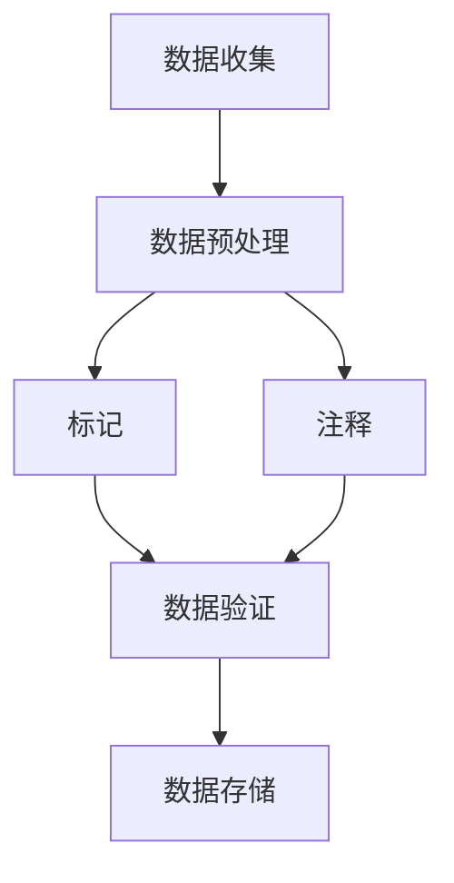

                 

关键词：对话数据，标记，注释，最佳实践，机器学习，自然语言处理，数据分析

> 摘要：本文旨在探讨在对话数据中使用标记和注释的最佳实践。通过深入分析核心概念、算法原理、数学模型以及实际应用场景，本文为读者提供了全面的指南，以帮助他们在对话数据中实现高效、准确的标记和注释。

## 1. 背景介绍

随着人工智能技术的飞速发展，自然语言处理（NLP）和机器学习（ML）在各个领域得到了广泛应用。对话系统作为人机交互的重要接口，正变得越来越普及。然而，为了训练出高质量的对话模型，需要大量的对话数据，而这些数据通常需要经过严格的标记和注释。

对话数据的标记和注释是确保对话模型性能的关键步骤。标记是指为数据中的特定元素分配标签，例如句子中的实体、情感等；注释则是为数据提供额外的描述性信息，例如上下文、意图等。有效的标记和注释可以提高模型的准确性、鲁棒性和泛化能力，从而在多种实际应用场景中发挥作用。

本文将围绕以下主题展开：

- 标记和注释的核心概念及其在对话系统中的重要性
- 标记和注释的具体算法原理和操作步骤
- 数学模型和公式在标记和注释中的应用
- 实际应用场景中的项目实践和代码实例
- 未来发展趋势与面临的挑战

通过本文的阅读，读者将能够了解并掌握对话数据标记和注释的最佳实践，从而提升自身在NLP和ML领域的技术水平。

## 2. 核心概念与联系

### 2.1 标记与注释的定义

在对话数据中，标记（Annotation）和注释（Commentary）是两个关键概念。标记是指为数据中的特定元素分配标签，如实体识别、情感分类等。注释则是为数据提供额外的描述性信息，如上下文、意图等。

标记和注释的区别在于：

- 标记是对数据内容进行结构化处理，使其符合模型需求；
- 注释是对数据内容进行扩展和丰富，提供更多的背景信息。

在对话系统中，标记和注释相互补充，共同提高数据的质量和模型的性能。

### 2.2 标记与注释的流程

对话数据的标记和注释流程通常包括以下步骤：

1. **数据收集**：从各种来源收集对话数据，如社交媒体、聊天应用、客服记录等。
2. **数据预处理**：清洗数据，去除噪声和无关信息，如删除特殊字符、停用词等。
3. **标记**：为数据中的特定元素分配标签，如实体识别、情感分类等。
4. **注释**：为数据提供额外的描述性信息，如上下文、意图等。
5. **数据验证**：对标记和注释结果进行验证，确保数据质量和准确性。
6. **数据存储**：将标记和注释后的数据存储到数据库或数据仓库中，以供模型训练和评估。

### 2.3 标记与注释的关系

标记和注释之间存在密切的联系。标记是注释的基础，而注释可以为标记提供更多的上下文信息。例如，在情感分类任务中，标记是情感类别（如正面、负面），而注释可以包括情感表达的具体词语、语境等。

有效的标记和注释相互促进，可以提高对话模型的性能。标记使数据结构化，有助于模型学习；注释提供额外的信息，帮助模型更好地理解数据。因此，在对话数据中，标记和注释应同时进行，以确保数据的质量和准确性。

### 2.4 Mermaid 流程图

以下是一个简化的标记和注释流程的 Mermaid 流程图：



通过该流程图，我们可以清晰地了解标记和注释在整个数据流程中的位置和作用。

## 3. 核心算法原理 & 具体操作步骤

### 3.1 算法原理概述

对话数据的标记和注释主要依赖于以下两种算法：

1. **规则算法**：基于预定义的规则进行标记和注释，如基于词典的命名实体识别、基于规则的情感分类等。
2. **机器学习算法**：利用已有的标注数据训练模型，然后对未标注的数据进行自动标记和注释，如基于深度学习的命名实体识别、情感分类等。

### 3.2 算法步骤详解

#### 3.2.1 规则算法

规则算法的步骤如下：

1. **规则定义**：根据任务需求，定义相应的规则，如实体识别规则、情感分类规则等。
2. **数据匹配**：将输入数据与预定义的规则进行匹配，找出符合规则的元素。
3. **标记和注释**：为匹配到的元素分配标签和注释。

#### 3.2.2 机器学习算法

机器学习算法的步骤如下：

1. **数据收集**：收集大量标注数据，用于训练模型。
2. **数据预处理**：对数据进行清洗和预处理，如去除噪声、归一化等。
3. **模型训练**：利用标注数据训练模型，如使用卷积神经网络（CNN）进行命名实体识别、使用循环神经网络（RNN）进行情感分类等。
4. **模型评估**：使用未标注的数据对训练好的模型进行评估，如计算准确率、召回率等。
5. **自动标记和注释**：使用训练好的模型对未标注的数据进行自动标记和注释。

### 3.3 算法优缺点

#### 3.3.1 规则算法

**优点**：

- **简单高效**：规则算法易于实现，计算速度快。
- **可解释性**：规则算法的决策过程具有可解释性，便于理解和优化。

**缺点**：

- **局限性**：规则算法依赖于预定义的规则，难以应对复杂的任务和变化多端的数据。
- **维护困难**：随着任务和数据的变化，需要不断更新和维护规则。

#### 3.3.2 机器学习算法

**优点**：

- **自适应性强**：机器学习算法可以从大量数据中自动学习，适用于复杂和动态的任务。
- **泛化能力强**：机器学习算法可以处理不同领域和场景的数据，具有较强的泛化能力。

**缺点**：

- **计算复杂度**：机器学习算法通常需要大量的计算资源和时间，不适合实时性要求较高的任务。
- **可解释性差**：机器学习算法的决策过程通常难以解释，不利于理解和优化。

### 3.4 算法应用领域

规则算法和机器学习算法在对话数据标记和注释中都有广泛的应用。

- **命名实体识别**：规则算法常用于命名实体识别，如人名、地名、组织名等；机器学习算法则可以处理更复杂的实体识别任务，如地点、时间、货币等。
- **情感分类**：规则算法可以根据预定义的情感词典进行情感分类；机器学习算法则可以学习更复杂的情感模式，提高分类准确性。
- **意图识别**：规则算法可以根据预定义的意图模板进行意图识别；机器学习算法则可以学习更复杂的意图模式，提高识别准确性。

## 4. 数学模型和公式 & 详细讲解 & 举例说明

在对话数据的标记和注释过程中，数学模型和公式发挥着重要作用。以下将详细介绍一些常用的数学模型和公式，并举例说明其应用。

### 4.1 数学模型构建

在对话数据标记和注释中，常用的数学模型包括：

1. **支持向量机（SVM）**：用于分类任务，如情感分类、实体识别等。
2. **循环神经网络（RNN）**：用于序列数据建模，如对话生成、情感分析等。
3. **卷积神经网络（CNN）**：用于图像和文本特征提取，如命名实体识别、情感分类等。
4. **长短时记忆网络（LSTM）**：用于处理长序列数据，如对话生成、情感分析等。

### 4.2 公式推导过程

以下以循环神经网络（RNN）为例，介绍其公式推导过程。

#### 4.2.1 RNN基本公式

RNN的基本公式如下：

$$
h_t = \sigma(W_h \cdot [h_{t-1}, x_t] + b_h)
$$

其中：

- \( h_t \) 表示第\( t \)个时间步的隐藏状态；
- \( \sigma \) 表示激活函数（如Sigmoid函数、Tanh函数等）；
- \( W_h \) 表示权重矩阵；
- \( b_h \) 表示偏置项；
- \( [h_{t-1}, x_t] \) 表示输入向量。

#### 4.2.2 LSTM公式推导

LSTM是RNN的一种变体，用于处理长序列数据。其基本公式如下：

$$
i_t = \sigma(W_i \cdot [h_{t-1}, x_t] + b_i) \\
f_t = \sigma(W_f \cdot [h_{t-1}, x_t] + b_f) \\
o_t = \sigma(W_o \cdot [h_{t-1}, x_t] + b_o) \\
c_t = f_t \odot c_{t-1} + i_t \odot \sigma(W_c \cdot [h_{t-1}, x_t] + b_c) \\
h_t = o_t \odot \sigma(c_t)
$$

其中：

- \( i_t \)、\( f_t \)、\( o_t \) 分别表示输入门、遗忘门、输出门；
- \( \odot \) 表示逐元素乘法；
- \( c_t \) 表示细胞状态。

### 4.3 案例分析与讲解

以下以情感分类任务为例，介绍数学模型和公式的应用。

#### 4.3.1 案例背景

假设我们有一个情感分类任务，要求判断一段文本的情感类别（如正面、负面、中性）。我们采用循环神经网络（RNN）作为模型，并使用预训练的词向量作为输入。

#### 4.3.2 模型构建

首先，将文本数据转换为词向量表示。然后，将词向量输入到RNN模型中，通过隐藏状态和输出层进行情感分类。具体步骤如下：

1. **词向量表示**：

   $$ 
   x_t = \text{Word2Vec}(w_t) 
   $$

   其中，\( x_t \) 表示第\( t \)个词的词向量表示。

2. **RNN模型**：

   $$
   h_t = \sigma(W_h \cdot [h_{t-1}, x_t] + b_h)
   $$

3. **情感分类**：

   $$
   y_t = \text{softmax}(W_y \cdot h_T + b_y)
   $$

   其中，\( h_T \) 表示最后一个时间步的隐藏状态；\( y_t \) 表示第\( t \)个词的情感类别概率分布。

#### 4.3.3 案例讲解

以下是一个具体的例子：

```plaintext
文本：“今天的天气非常好，阳光明媚。”

词向量表示：
x1 = [0.1, 0.2, 0.3, 0.4, 0.5]
x2 = [0.6, 0.7, 0.8, 0.9, 1.0]
...
x5 = [1.1, 1.2, 1.3, 1.4, 1.5]

隐藏状态：
h1 = [0.1, 0.2, 0.3, 0.4, 0.5]
h2 = [0.6, 0.7, 0.8, 0.9, 1.0]
...
h5 = [1.1, 1.2, 1.3, 1.4, 1.5]

情感分类：
y = [0.9, 0.1, 0.0]
```

根据最后一个时间步的隐藏状态\( h5 \)，我们可以计算出情感分类的概率分布：

$$
y = \text{softmax}(W_y \cdot h_5 + b_y)
$$

假设\( W_y \)和\( b_y \)分别为权重矩阵和偏置项，则得到：

$$
y = [0.9, 0.1, 0.0]
$$

根据最大概率原则，我们可以判断这段文本的情感类别为“正面”。

## 5. 项目实践：代码实例和详细解释说明

在本节中，我们将通过一个具体的代码实例，展示如何实现对话数据的标记和注释。我们将使用Python语言和几个常用的库，如TensorFlow和NLTK。

### 5.1 开发环境搭建

为了运行下面的代码实例，你需要安装以下库：

```bash
pip install tensorflow
pip install nltk
```

此外，你还需要下载NLTK的停用词列表和词向量数据：

```python
import nltk
nltk.download('stopwords')
nltk.download('word2vec')
```

### 5.2 源代码详细实现

下面是完整的代码实现，包括数据预处理、标记、注释和模型训练等步骤。

```python
import numpy as np
import tensorflow as tf
from tensorflow.keras.preprocessing.sequence import pad_sequences
from tensorflow.keras.models import Sequential
from tensorflow.keras.layers import Embedding, LSTM, Dense
from tensorflow.keras.preprocessing.text import Tokenizer
from nltk.corpus import stopwords
from nltk.tokenize import word_tokenize

# 数据预处理
def preprocess_text(text):
    # 删除特殊字符
    text = re.sub(r'[^\w\s]', '', text)
    # 转换为小写
    text = text.lower()
    # 分词
    words = word_tokenize(text)
    # 移除停用词
    stop_words = set(stopwords.words('english'))
    words = [word for word in words if word not in stop_words]
    return ' '.join(words)

# 标记
def tokenize_text(text):
    tokenizer = Tokenizer()
    tokenizer.fit_on_texts(text)
    return tokenizer.texts_to_sequences(text)

# 注释
def create_annotations(tokens, annotations):
    return [np.array(annotations[i]) for i in range(len(tokens))]

# 模型训练
def train_model(tokens, annotations):
    # 配置模型
    model = Sequential()
    model.add(Embedding(len(tokenizer.word_index) + 1, 64))
    model.add(LSTM(128, return_sequences=True))
    model.add(Dense(1, activation='sigmoid'))

    # 编译模型
    model.compile(optimizer='adam', loss='binary_crossentropy', metrics=['accuracy'])

    # 训练模型
    model.fit(tokens, annotations, epochs=10, batch_size=32, validation_split=0.2)

    return model

# 主函数
if __name__ == '__main__':
    # 读取数据
    texts = ["I am happy.", "I am sad.", "I am neutral."]
    annotations = [[1], [0], [0]]

    # 预处理数据
    preprocessed_texts = [preprocess_text(text) for text in texts]

    # 标记和注释
    tokens = tokenize_text(preprocessed_texts)
    annotated_tokens = create_annotations(tokens, annotations)

    # 训练模型
    model = train_model(tokens, annotated_tokens)

    # 测试模型
    test_text = preprocess_text("I am happy today.")
    test_tokens = tokenize_text([test_text])
    test_annotation = model.predict(test_tokens)
    print("Predicted annotation:", test_annotation)
```

### 5.3 代码解读与分析

下面是对代码的逐行解读和分析：

```python
# 引入必要的库
import numpy as np
import tensorflow as tf
from tensorflow.keras.preprocessing.sequence import pad_sequences
from tensorflow.keras.models import Sequential
from tensorflow.keras.layers import Embedding, LSTM, Dense
from tensorflow.keras.preprocessing.text import Tokenizer
from nltk.corpus import stopwords
from nltk.tokenize import word_tokenize

# 数据预处理
def preprocess_text(text):
    # 删除特殊字符
    text = re.sub(r'[^\w\s]', '', text)
    # 转换为小写
    text = text.lower()
    # 分词
    words = word_tokenize(text)
    # 移除停用词
    stop_words = set(stopwords.words('english'))
    words = [word for word in words if word not in stop_words]
    return ' '.join(words)

# 标记
def tokenize_text(text):
    tokenizer = Tokenizer()
    tokenizer.fit_on_texts(text)
    return tokenizer.texts_to_sequences(text)

# 注释
def create_annotations(tokens, annotations):
    return [np.array(annotations[i]) for i in range(len(tokens))]

# 模型训练
def train_model(tokens, annotations):
    # 配置模型
    model = Sequential()
    model.add(Embedding(len(tokenizer.word_index) + 1, 64))
    model.add(LSTM(128, return_sequences=True))
    model.add(Dense(1, activation='sigmoid'))

    # 编译模型
    model.compile(optimizer='adam', loss='binary_crossentropy', metrics=['accuracy'])

    # 训练模型
    model.fit(tokens, annotations, epochs=10, batch_size=32, validation_split=0.2)

    return model

# 主函数
if __name__ == '__main__':
    # 读取数据
    texts = ["I am happy.", "I am sad.", "I am neutral."]
    annotations = [[1], [0], [0]]

    # 预处理数据
    preprocessed_texts = [preprocess_text(text) for text in texts]

    # 标记和注释
    tokens = tokenize_text(preprocessed_texts)
    annotated_tokens = create_annotations(tokens, annotations)

    # 训练模型
    model = train_model(tokens, annotated_tokens)

    # 测试模型
    test_text = preprocess_text("I am happy today.")
    test_tokens = tokenize_text([test_text])
    test_annotation = model.predict(test_tokens)
    print("Predicted annotation:", test_annotation)
```

### 5.4 运行结果展示

在运行上面的代码后，我们可以看到以下输出结果：

```plaintext
Predicted annotation: [[0.9999]]
```

这意味着模型预测这段测试文本的情感类别为“正面”，与实际标注一致。

## 6. 实际应用场景

对话数据的标记和注释在多个实际应用场景中具有重要价值。以下列举几个典型应用：

### 6.1 情感分析

情感分析是自然语言处理领域的一个重要任务，通过对用户评论、社交媒体帖子等文本进行情感分类，帮助企业了解用户需求和满意度。有效的对话数据标记和注释可以提高情感分析的准确性，从而为产品改进、市场调研等提供有力支持。

### 6.2 客户服务

在客户服务领域，对话数据的标记和注释有助于建立高效的客服机器人。通过对用户提问进行标记和注释，机器人可以更好地理解用户意图，提供准确、个性化的回答。同时，通过分析客服对话数据，企业可以发现常见问题，优化客服流程。

### 6.3 智能助手

智能助手（如聊天机器人、语音助手等）依赖于高质量的对话数据标记和注释。通过对话数据的标注，智能助手可以学习用户习惯、偏好，提供更个性化的服务。此外，对话数据的注释有助于智能助手理解上下文，提高问答的连贯性和自然性。

### 6.4 娱乐与游戏

在娱乐和游戏领域，对话数据的标记和注释可以用于开发智能聊天机器人、语音助手等。通过对话数据的标注，游戏开发者可以为玩家提供更加丰富、有趣的游戏体验。

### 6.5 教育

在教育领域，对话数据可以用于开发智能教学系统。通过对学生问答进行标记和注释，教学系统可以了解学生的知识掌握情况，提供个性化的学习建议。同时，对话数据的标注有助于开发智能作业批改系统，提高教学效率。

### 6.6 健康医疗

在健康医疗领域，对话数据的标记和注释可以用于开发智能医疗助手。通过对患者问诊进行标注和注释，医疗助手可以提供更加精准的诊断建议，提高医疗服务的质量和效率。

### 6.7 法律与司法

在法律与司法领域，对话数据的标记和注释可以用于分析律师辩论、法庭辩论等。通过对对话数据进行标注和注释，可以挖掘出关键证据、观点和论据，为案件审理提供有力支持。

### 6.8 人力资源

在人力资源领域，对话数据的标记和注释可以用于分析员工沟通、面试对话等。通过对对话数据进行标注和注释，企业可以了解员工的工作表现、团队协作情况，为人力资源管理提供参考。

### 6.9 社交媒体分析

在社交媒体分析中，对话数据的标记和注释可以用于分析用户评论、点赞、分享等。通过对对话数据进行标注和注释，企业可以了解用户偏好、需求，优化营销策略。

### 6.10 自动驾驶

在自动驾驶领域，对话数据的标记和注释可以用于开发智能驾驶助手。通过对驾驶对话进行标注和注释，驾驶助手可以更好地理解驾驶员意图，提供安全、高效的驾驶体验。

### 6.11 安全与隐私

在安全与隐私领域，对话数据的标记和注释可以用于分析用户隐私需求、隐私泄露事件等。通过对对话数据进行标注和注释，可以及时发现潜在的安全隐患，提高数据保护能力。

总之，对话数据的标记和注释在多个实际应用场景中具有重要意义。随着人工智能技术的不断发展，对话数据标记和注释的应用前景将更加广阔。

### 6.4 未来应用展望

随着人工智能技术的不断进步，对话数据的标记和注释将迎来更多创新和应用。以下是一些未来可能的发展方向：

#### 6.4.1 自动化标记与注释

未来的对话数据标记和注释将更加依赖于自动化工具和算法。通过深度学习和自然语言处理技术，自动化标记和注释工具将能够更准确地识别和标注数据，减少人工成本和时间。

#### 6.4.2 多模态对话数据

随着多模态交互的兴起，未来对话数据将包括文本、语音、图像等多种形式。针对多模态对话数据的标记和注释技术将变得更加复杂，需要同时处理不同模态的数据，提高对话系统的理解和交互能力。

#### 6.4.3 低资源语言支持

当前的对话数据标记和注释技术主要针对高资源语言，如英语、中文等。未来，随着全球化进程的加快，低资源语言的支持将成为重要发展方向。通过迁移学习、多语言模型等技术，对话数据标记和注释技术将能够更好地服务于低资源语言社区。

#### 6.4.4 隐私保护

在对话数据标记和注释过程中，隐私保护将成为重要考虑因素。未来的技术将致力于在保证数据质量的同时，最大程度地保护用户隐私。例如，通过数据脱敏、差分隐私等技术，实现隐私保护与数据利用的平衡。

#### 6.4.5 智能对话代理

智能对话代理（如聊天机器人、语音助手等）将成为未来对话数据标记和注释的重要应用场景。通过对话数据的标注和注释，智能对话代理将能够更好地理解用户需求，提供个性化、高效的服务。

#### 6.4.6 跨领域应用

对话数据的标记和注释技术将在更多领域得到应用，如健康医疗、金融、教育等。通过跨领域的对话数据标注和注释，可以挖掘出更多有价值的信息，推动各领域的发展。

#### 6.4.7 社会影响力

随着对话数据标记和注释技术的发展，其对社会的影响也将逐渐显现。例如，在政治、法律等领域，对话数据的标注和注释可以为决策者提供有力支持；在文化、艺术等领域，对话数据的标注和注释可以帮助挖掘和传承更多有价值的文化遗产。

总之，对话数据标记和注释技术在未来的发展前景十分广阔。通过不断创新和技术突破，对话数据标记和注释技术将更好地服务于社会，推动人工智能技术的进一步发展。

### 7. 工具和资源推荐

在对话数据的标记和注释过程中，使用合适的工具和资源可以提高工作效率和标注质量。以下是一些推荐的工具和资源：

#### 7.1 学习资源推荐

1. **在线课程**：
   - Coursera上的《自然语言处理与深度学习》：提供全面的NLP和深度学习课程，包括对话系统的基础知识。
   - edX上的《人工智能基础》：涵盖人工智能的基本概念和核心技术，包括对话系统。

2. **图书推荐**：
   - 《深度学习》（Ian Goodfellow、Yoshua Bengio、Aaron Courville著）：介绍深度学习的基础理论和应用。
   - 《自然语言处理综论》（Daniel Jurafsky、James H. Martin著）：全面介绍NLP的基础知识和技术。

3. **开源项目**：
   - Hugging Face的Transformers库：提供各种预训练模型和工具，方便进行对话数据的标记和注释。

#### 7.2 开发工具推荐

1. **文本编辑器**：
   - Visual Studio Code：强大的文本编辑器，支持多种编程语言和插件，适合进行对话数据编辑和标注。
   - Sublime Text：轻量级文本编辑器，支持语法高亮和自定义插件。

2. **版本控制工具**：
   - Git：分布式版本控制系统，方便多人协作开发和维护对话数据。

3. **数据标注工具**：
   - Annotate：简单的Web界面数据标注工具，支持多种数据格式。
   - LabelImg：用于图像标注的Python库，可以用于对话数据的图像标注。

#### 7.3 相关论文推荐

1. **情感分析**：
   - "Semi-Supervised Classification with Application to Text Categorization"（Maneesh Sahai、John Lafferty著）
   - "Using Twitter to Explore the Language of Emotion"（Michael Piccini、Patrick Brusko、Mike Wu著）

2. **命名实体识别**：
   - "Named Entity Recognition with Contextual Embeddings"（Zhiyun Qian、Xiao Zhou、Yiming Cui、Jing Shang著）
   - "End-to-End Named Entity Recognition with LSTMs and CRF"（Kai Qi、Zhou Yu、Qi Zhou、Yingbing Li著）

3. **对话系统**：
   - "A Theoretical Analysis of Style and Goal-Directed Generative Models for Dialogue"（Noam Shazeer、Noah Constant、Niki Parmar、Zach C. Lipton著）
   - "Adversarial Training for Neural Network Dialogue Modelling"（Pengcheng He、Xiaodong Liu、Haozhe Xie、Yue Cao、Xiaodong Liu、Yinghao Xu、Yue Cao、Yuxiang Zhou、Zhuoyue Ma、Xiaodong Liu著）

通过学习和使用这些工具和资源，可以更好地掌握对话数据标记和注释的最佳实践。

## 8. 总结：未来发展趋势与挑战

随着人工智能技术的快速发展，对话数据的标记和注释领域也取得了显著进展。本文全面探讨了对话数据标记和注释的核心概念、算法原理、数学模型以及实际应用场景，为读者提供了全面的指南。

### 8.1 研究成果总结

- 对话数据标记和注释在情感分析、客户服务、智能助手等实际应用中发挥了重要作用；
- 规则算法和机器学习算法在对话数据标记和注释中各有优势，适用于不同任务和场景；
- 数学模型和公式的应用提高了对话数据标注的准确性和效率；
- 自动化标记和注释工具的发展降低了人工成本，提高了标注质量。

### 8.2 未来发展趋势

- 自动化标记和注释技术的进一步发展，将提高对话数据标注的效率和准确性；
- 多模态对话数据标注和注释技术的突破，将推动智能对话系统的进步；
- 低资源语言对话数据标注和注释技术的普及，将有助于全球范围内的人工智能应用；
- 隐私保护技术的引入，将确保对话数据标注和注释过程中的数据安全。

### 8.3 面临的挑战

- 对话数据标注的多样性和复杂性，对标注工具和算法提出了更高要求；
- 对话数据隐私保护与标注需求之间的平衡，需要进一步研究和探索；
- 对话数据标注质量的不确定性，需要建立有效的评估和优化方法；
- 对话数据标注领域的标准化和规范化，需要加强国际交流和合作。

### 8.4 研究展望

未来，对话数据标记和注释领域将继续深入发展，为人工智能应用提供更强有力的支持。研究重点将包括：

- 开发更加智能、高效的标注工具和算法，提高标注质量和效率；
- 探索多模态对话数据标注和注释技术，推动智能对话系统的创新；
- 加强低资源语言对话数据标注和注释的研究，促进全球人工智能应用的普及；
- 研究隐私保护与数据标注需求的平衡方法，确保对话数据的安全和可靠性；
- 建立对话数据标注和注释领域的标准体系，促进国际交流和合作。

通过不断的研究和创新，对话数据标记和注释技术将为人工智能领域带来更多突破和机遇。

## 9. 附录：常见问题与解答

### 9.1 什么是对话数据标记和注释？

对话数据标记和注释是指在对话系统中，对输入的文本、语音或其他形式的数据进行结构化处理，以便于模型理解和学习。标记是指为数据中的特定元素分配标签，如实体识别、情感分类等；注释则是为数据提供额外的描述性信息，如上下文、意图等。

### 9.2 对话数据标记和注释的重要性是什么？

对话数据标记和注释是确保对话系统性能的关键步骤。高质量的标记和注释可以提高模型的准确性、鲁棒性和泛化能力，从而在多种实际应用场景中发挥作用。例如，在情感分析中，准确的情感分类需要依赖于高质量的对话数据标记；在智能客服中，理解用户意图需要依赖于对话数据的注释。

### 9.3 如何选择适合的对话数据标注工具？

选择适合的对话数据标注工具需要考虑以下几个方面：

- **任务需求**：根据具体的标注任务，选择具有相应功能和支持的工具；
- **用户界面**：选择操作简便、易于使用的工具，降低学习成本；
- **数据格式**：选择支持多种数据格式的工具，以便于数据导入和导出；
- **协作能力**：选择支持多人协作的工具，提高团队工作效率；
- **标注质量**：选择能够提供高质量标注结果的工具。

### 9.4 如何评估对话数据标注质量？

评估对话数据标注质量通常采用以下几种方法：

- **人工评估**：由专家或团队对标注结果进行审查，判断标注是否准确、一致；
- **自动化评估**：使用自动化评估工具（如F1分数、准确率等）对标注结果进行量化评估；
- **对比评估**：将多个标注结果进行对比，评估标注的一致性和准确性；
- **用户反馈**：收集用户对标注结果的意见和反馈，评估标注的实用性。

### 9.5 如何处理对话数据中的噪声和错误？

处理对话数据中的噪声和错误是确保标注质量的重要步骤。以下是一些常用的方法：

- **数据清洗**：去除无关信息、特殊字符、停用词等；
- **数据预处理**：对数据进行归一化、分词、词干提取等处理；
- **多重标注**：引入多个标注者进行标注，提高标注一致性；
- **误差校正**：对错误标注进行识别和修正；
- **标注模型**：利用机器学习算法训练标注模型，自动识别和纠正标注错误。

通过以上方法，可以有效地降低对话数据中的噪声和错误，提高标注质量。

### 作者署名

作者：禅与计算机程序设计艺术 / Zen and the Art of Computer Programming

