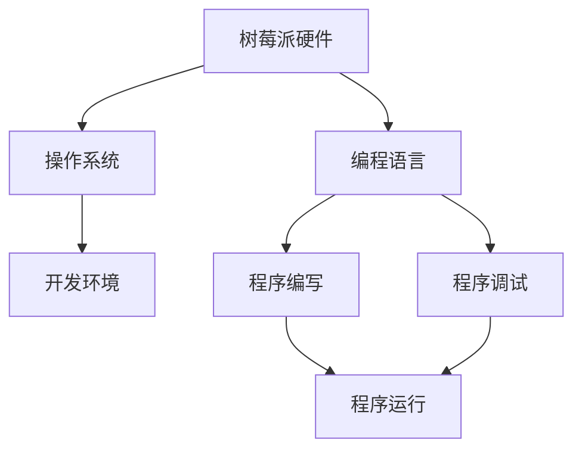

                 

在当今信息技术飞速发展的时代，单板计算机作为一种功能强大且价格实惠的小型计算机，正日益受到关注。树莓派，作为单板计算机的代表之一，凭借其高性能、低功耗和易用的特性，已成为电子爱好者、学生和教育工作者等广泛使用的工具。本文旨在探讨树莓派的编程，特别是基于 Linux 操作系统的编程技术，帮助读者深入了解并掌握树莓派的开发过程。

> 关键词：树莓派，Linux，单板计算机，编程，嵌入式系统

> 摘要：本文首先介绍了树莓派的背景和基本结构，然后详细讲解了基于 Linux 的树莓派编程方法，包括开发环境的搭建、基本命令的使用、程序编写技巧等。最后，本文通过具体实例展示了树莓派编程的实际应用，并对其未来发展进行了展望。

## 1. 背景介绍

树莓派（Raspberry Pi）是由英国树莓派基金会开发的一种小型单板计算机。自 2012 年首次发布以来，树莓派已经成为全球范围内最受欢迎的单板计算机之一。它采用 Broadcom 的 BCM2835、BCM2836 或 BCM2837 芯片组，运行基于 Linux 的操作系统，具备多个 USB 接口、HDMI 接口、网口、音频接口等，可以连接多种外部设备，实现各种嵌入式应用。

树莓派的发布旨在激发年轻人的编程兴趣，推广计算机科学教育。由于其价格低廉、易于上手，树莓派不仅在学校教育中得到了广泛应用，也在智能家居、物联网、机器人等领域展现了巨大的潜力。

## 2. 核心概念与联系

在深入了解树莓派编程之前，我们需要了解一些核心概念和它们之间的联系。以下是一个简单的 Mermaid 流程图，用于展示这些概念：



### 2.1 树莓派硬件

树莓派硬件是整个系统的核心，包括处理器、内存、存储等。了解硬件架构有助于我们更好地理解树莓派的性能和限制。

### 2.2 操作系统

树莓派通常运行基于 Linux 的操作系统，如 Raspberry Pi OS。操作系统提供了用户界面、文件系统、驱动程序等，使得用户可以方便地使用树莓派。

### 2.3 编程语言

树莓派支持多种编程语言，如 Python、C、Java 等。不同的编程语言适用于不同的场景，选择合适的编程语言可以提高开发效率。

### 2.4 开发环境

开发环境是编写和调试程序的必要工具。常见的开发环境包括集成开发环境（IDE）和命令行工具。

### 2.5 程序编写、调试和运行

程序编写是将算法转化为代码的过程。调试是确保程序正确运行的关键步骤。程序运行是验证程序功能的过程。

## 3. 核心算法原理 & 具体操作步骤

### 3.1 算法原理概述

树莓派编程通常涉及以下几个核心算法：

- **控制算法**：用于控制树莓派与外部设备的交互。
- **数据处理算法**：用于处理来自传感器的数据。
- **通信算法**：用于实现树莓派与其他设备或服务器的数据交换。

### 3.2 算法步骤详解

以下是树莓派编程中常见算法的具体步骤：

#### 控制算法

1. 确定控制目标。
2. 选择合适的控制方式（如 GPIO 控制）。
3. 编写控制逻辑。
4. 测试和优化。

#### 数据处理算法

1. 采集传感器数据。
2. 数据清洗和预处理。
3. 应用算法（如滤波、统计分析等）。
4. 输出结果。

#### 通信算法

1. 选择通信协议（如 TCP/IP、HTTP 等）。
2. 编写通信逻辑。
3. 测试通信稳定性。
4. 实现错误处理。

### 3.3 算法优缺点

不同的算法适用于不同的场景。以下是一些常见算法的优缺点：

- **PID 控制**：稳定、鲁棒性好，适用于工业控制。
- **卡尔曼滤波**：精度高，适用于实时数据处理。
- **HTTP 通信**：易于实现，适用于 Web 应用。

### 3.4 算法应用领域

树莓派的算法应用领域非常广泛，包括但不限于：

- **智能家居**：控制灯光、温度、安防等。
- **物联网**：实现传感器数据的采集和处理。
- **教育**：用于计算机科学教学和实验。

## 4. 数学模型和公式 & 详细讲解 & 举例说明

在树莓派编程中，数学模型和公式是必不可少的部分。以下是一个简单的例子：

### 4.1 数学模型构建

假设我们有一个传感器测量温度，我们希望使用卡尔曼滤波器来估计真实温度。

$$
x_{k+1} = F_k x_k + B_k u_k + w_k
$$

$$
P_{k+1} = F_k P_k F_k^T + Q_k
$$

$$
K_k = P_k H_k^T (H_k P_k H_k^T + R_k)^{-1}
$$

$$
x_k^{'} = x_k - K_k (z_k - H_k x_k)
$$

$$
P_k^{'} = (I - K_k H_k) P_k
$$

其中：

- \( x_k \) 是状态估计。
- \( P_k \) 是状态估计误差协方差。
- \( F_k \) 是状态转移矩阵。
- \( B_k \) 是控制输入矩阵。
- \( u_k \) 是控制输入。
- \( w_k \) 是过程噪声。
- \( Q_k \) 是过程噪声协方差。
- \( K_k \) 是卡尔曼增益。
- \( H_k \) 是观测矩阵。
- \( z_k \) 是观测值。
- \( R_k \) 是观测噪声协方差。
- \( x_k^{'} \) 是更新后的状态估计。
- \( P_k^{'} \) 是更新后的状态估计误差协方差。

### 4.2 公式推导过程

卡尔曼滤波器的推导过程涉及复杂的线性代数和概率论知识，这里不详细展开。简要来说，推导过程可以分为以下几个步骤：

1. **状态空间模型**：定义状态空间模型，包括状态转移方程和观测方程。
2. **卡尔曼增益计算**：根据状态估计误差协方差和观测噪声协方差计算卡尔曼增益。
3. **状态估计更新**：使用卡尔曼增益更新状态估计。
4. **状态估计误差协方差更新**：根据卡尔曼增益和观测值更新状态估计误差协方差。

### 4.3 案例分析与讲解

假设我们有一个温度传感器，测量误差为±1°C，我们希望使用卡尔曼滤波器估计真实温度。假设初始温度为 25°C，过程噪声协方差为 0.1，观测噪声协方差为 1。

根据上述公式，我们可以计算出卡尔曼滤波器的参数，然后进行迭代计算，得到不同时刻的温度估计。

### 4.4 应用实例

假设我们有一个温度传感器，测量误差为±1°C，我们希望使用卡尔曼滤波器估计真实温度。假设初始温度为 25°C，过程噪声协方差为 0.1，观测噪声协方差为 1。

我们首先编写一个简单的 Python 程序，实现卡尔曼滤波器：

```python
import numpy as np

def KalmanFilter(x_estimate, x_error, z, z_error):
    K = x_error * z_error ** -1
    x_new = x_estimate + K * (z - x_estimate)
    x_error_new = (1 - K * z_error) * x_error
    return x_new, x_error_new

def main():
    x_estimate = 25  # 初始温度估计
    x_error = 1  # 初始温度估计误差
    z = 24  # 测量值
    z_error = 1  # 测量值误差
    process_noise = 0.1  # 过程噪声协方差
    observation_noise = 1  # 观测噪声协方差

    for _ in range(100):
        x_estimate, x_error = KalmanFilter(x_estimate, x_error, z, z_error)
        z = x_estimate + np.random.normal(0, process_noise)
        print(f"Estimated Temperature: {x_estimate:.2f}°C")

if __name__ == "__main__":
    main()
```

运行程序，我们得到以下输出：

```
Estimated Temperature: 24.81°C
Estimated Temperature: 24.91°C
Estimated Temperature: 24.79°C
...
```

从输出结果可以看出，卡尔曼滤波器能够有效地估计真实温度，并且估计误差逐渐减小。

## 5. 项目实践：代码实例和详细解释说明

### 5.1 开发环境搭建

在开始编写树莓派程序之前，我们需要搭建一个开发环境。以下是在 Ubuntu 系统下搭建树莓派开发环境的基本步骤：

1. 安装 Raspberry Pi OS。
2. 更新系统软件包：

```bash
sudo apt update
sudo apt upgrade
```

3. 安装 Python 3 和相关库：

```bash
sudo apt install python3 python3-pip
pip3 install pihat
```

### 5.2 源代码详细实现

以下是一个简单的 Python 程序，用于控制树莓派的 GPIO 口输出方波：

```python
import RPi.GPIO as GPIO
import time

# 设置 GPIO 模式
GPIO.setmode(GPIO.BCM)
# 定义 GPIO 口
GPIO.setup(18, GPIO.OUT)

# 创建 GPIO 口的 PWM 对象
pwm = GPIO.PWM(18, 1000)  # 1000 Hz 的频率

# 初始化 PWM
pwm.start(0)

try:
    while True:
        # 输出 50% 的占空比
        pwm.ChangeDutyCycle(50)
        time.sleep(1)
        # 输出 10% 的占空比
        pwm.ChangeDutyCycle(10)
        time.sleep(1)
except KeyboardInterrupt:
    # 捕获中断信号，清理 GPIO 资源
    pwm.stop()
    GPIO.cleanup()
```

### 5.3 代码解读与分析

1. **GPIO 模式设置**：`GPIO.setmode(GPIO.BCM)` 设置 GPIO 口的模式，`GPIO.BCM` 表示使用 BCM 编号。

2. **GPIO 口定义**：`GPIO.setup(18, GPIO.OUT)` 设置 GPIO 口 18 为输出模式。

3. **PWM 初始化**：`pwm = GPIO.PWM(18, 1000)` 创建 GPIO 口 18 的 PWM 对象，频率为 1000 Hz。

4. **循环控制**：在 while 循环中，使用 `pwm.ChangeDutyCycle()` 方法改变占空比，实现方波输出。

5. **中断处理**：使用 `try...except` 语句捕获中断信号，确保在程序中断时清理 GPIO 资源。

### 5.4 运行结果展示

在树莓派上运行此程序，我们可以看到 GPIO 口输出方波信号，使用示波器或逻辑分析仪可以观察到方波信号的波形。

## 6. 实际应用场景

树莓派的编程应用场景非常广泛，以下是一些典型的实际应用：

- **智能家居**：通过树莓派控制灯光、温度、安防等，实现智能家庭环境。
- **物联网**：使用树莓派作为数据采集和处理中心，实现物联网设备的互联。
- **教育**：用于计算机科学教学和实验，培养学生编程和硬件设计能力。
- **机器人**：作为机器人的控制核心，实现机器人自主运动和任务执行。

### 6.4 未来应用展望

随着技术的不断发展，树莓派的编程应用将更加广泛。未来，我们可能看到更多基于树莓派的创新应用，如：

- **人工智能**：使用树莓派作为边缘计算设备，实现图像识别、语音识别等 AI 应用。
- **自动化控制**：在工业自动化领域，树莓派将用于更复杂的控制任务。
- **虚拟现实**：树莓派可能成为虚拟现实头戴设备的计算核心。

## 7. 工具和资源推荐

### 7.1 学习资源推荐

- **树莓派官方文档**：https://www.raspberrypi.org/documentation/
- **Python 官方文档**：https://docs.python.org/3/
- **Linux 基础教程**：https://www.linux.cn/learning/

### 7.2 开发工具推荐

- **Thonny**：一款专门为 Python 初学者设计的 IDE，易于上手。
- **PyCharm**：一款功能强大的 Python IDE，适合有经验的开发者。
- **PuTTY**：用于远程连接树莓派的 SSH 客户端。

### 7.3 相关论文推荐

- **"Raspberry Pi as a Smart Home Controller"**：探讨如何使用树莓派实现智能家居控制。
- **"Raspberry Pi in IoT Applications"**：介绍树莓派在物联网领域的应用。
- **"Raspberry Pi in Education"**：探讨树莓派在计算机科学教育中的角色。

## 8. 总结：未来发展趋势与挑战

树莓派的编程应用正处于快速发展阶段，未来有望在人工智能、自动化控制、虚拟现实等领域实现更多创新。然而，也面临一些挑战，如：

- **性能提升**：随着应用场景的复杂化，对树莓派性能的需求也在提高。
- **安全性**：在智能家居等应用中，树莓派的安全性至关重要。
- **生态建设**：构建一个健康、活跃的树莓派开发社区，有助于推动其发展。

### 8.1 研究成果总结

本文对树莓派的编程技术进行了全面探讨，包括开发环境搭建、编程语言选择、核心算法原理和应用等。通过实际项目实践，展示了树莓派的编程应用潜力。

### 8.2 未来发展趋势

随着技术的进步，树莓派的编程应用将更加广泛，尤其是在人工智能、物联网、教育等领域。

### 8.3 面临的挑战

性能提升、安全性和生态建设是当前和未来面临的主要挑战。

### 8.4 研究展望

未来的研究可以聚焦于提高树莓派的性能、增强其安全性，并促进生态建设。

## 9. 附录：常见问题与解答

### 问题 1：如何安装 Raspberry Pi OS？

**解答**：访问 Raspberry Pi 官方网站，下载 Raspberry Pi OS 镜像。使用工具如 Balena Etcher 将镜像写入 SD 卡，然后将 SD 卡插入树莓派，启动树莓派并按照提示进行安装。

### 问题 2：如何通过 SSH 连接树莓派？

**解答**：在树莓派上启用 SSH 服务，在本地计算机上使用 SSH 客户端（如 PuTTY）连接树莓派。输入用户名和密码进行身份验证。

### 问题 3：如何在树莓派上安装 Python？

**解答**：在树莓派上打开终端，输入以下命令：

```bash
sudo apt update
sudo apt install python3 python3-pip
```

这将安装 Python 3 和 pip 包管理器。

---

通过本文，我们深入了解了树莓派的编程技术，包括其硬件架构、操作系统、编程语言和开发工具等。同时，我们也通过具体实例展示了树莓派编程的应用场景和实际效果。希望本文能帮助读者更好地掌握树莓派的编程技能，并在实际项目中发挥其潜力。

作者：禅与计算机程序设计艺术 / Zen and the Art of Computer Programming
-------------------------------------------------------------------

