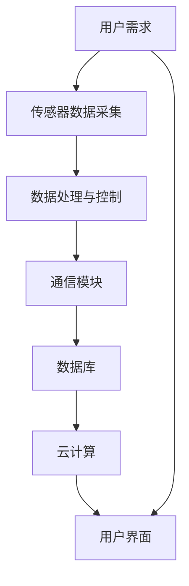

                 

关键字：树莓派、智能家居、机器人、物联网、开源、编程、人工智能、无线通信、传感器、自动化

摘要：本文将探讨如何利用树莓派这一低成本、开源的单板计算机，构建智能家居和机器人项目。通过深入分析核心概念、算法原理、数学模型以及实际项目实践，本文旨在为读者提供完整的指导，帮助其实现智能化的家居生活和创新性的机器人应用。

## 1. 背景介绍

近年来，随着物联网（IoT）技术的快速发展，智能家居和机器人领域迎来了前所未有的机遇。传统家居设备逐渐被智能设备所替代，而机器人则在服务、教育、娱乐等多个领域展现出巨大的潜力。树莓派作为一款性价比极高的单板计算机，凭借其强大的计算能力和丰富的接口，成为智能家居和机器人项目开发的热门选择。

### 1.1 树莓派简介

树莓派（Raspberry Pi）是一款由英国树莓派基金会（Raspberry Pi Foundation）开发的微型计算机。自2012年问世以来，树莓派已经成为全球范围内教育、科研和开源项目的重要工具。其主要特点如下：

- **低成本**：树莓派的价格相对低廉，适合个人和初创企业的开发预算。
- **开源硬件**：树莓派的硬件设计开放，用户可以根据需求进行定制和改进。
- **丰富的接口**：树莓派提供多个GPIO、USB、网络接口，方便连接各种传感器和设备。
- **强大的性能**：树莓派基于ARM架构，具有高性能的处理器和丰富的内存资源。

### 1.2 智能家居与机器人发展趋势

智能家居和机器人技术的发展呈现出以下趋势：

- **智能化**：家居设备将更加智能化，能够通过传感器、人工智能等技术实现自动化控制和交互。
- **互联互通**：设备之间的互联互通将成为智能家居系统的核心，实现数据共享和协同工作。
- **个性化**：智能家居系统将根据用户需求提供个性化的服务和体验。
- **机器人化**：机器人将在服务、教育、医疗等多个领域发挥重要作用，提高生活质量和生产效率。

## 2. 核心概念与联系

### 2.1 核心概念

在家居和机器人项目中，以下核心概念至关重要：

- **传感器**：用于检测环境信息和物理量的设备，如温度传感器、湿度传感器、光线传感器等。
- **通信协议**：用于设备之间数据传输的协议，如Wi-Fi、蓝牙、ZigBee等。
- **控制算法**：用于实现自动化控制和决策的算法，如PID控制、机器学习算法等。
- **数据库**：用于存储设备状态信息和用户数据的数据库系统。
- **云计算**：用于处理和分析大量数据，提供智能化的服务。

### 2.2 原理和架构的 Mermaid 流程图

下面是一个简单的 Mermaid 流程图，展示智能家居系统的基本架构：



### 2.3 核心概念之间的联系

传感器采集的环境信息通过通信协议传输到树莓派，树莓派通过控制算法对数据进行处理，并输出控制信号，实现家居设备的自动化控制。同时，数据被存储在数据库中，供云计算平台进行分析和挖掘，以提供更加智能化的服务。

## 3. 核心算法原理 & 具体操作步骤

### 3.1 算法原理概述

在家居和机器人项目中，核心算法包括以下几种：

- **PID控制算法**：用于实现精准的控制和调节，如温度控制、亮度调节等。
- **机器学习算法**：用于实现智能识别和预测，如人脸识别、行为预测等。
- **状态机算法**：用于实现设备状态的自动化转换，如机器人路径规划。

### 3.2 算法步骤详解

以 PID 控制算法为例，其具体步骤如下：

1. **初始化**：设置控制参数，如比例系数、积分系数和微分系数。
2. **采集数据**：从传感器获取当前状态信息。
3. **计算误差**：计算设定值与实际值之间的差值。
4. **计算控制量**：根据误差值和 PID 参数计算控制量。
5. **输出控制信号**：将控制量输出到执行机构，实现控制目标。
6. **更新参数**：根据控制效果调整 PID 参数，提高控制精度。

### 3.3 算法优缺点

PID 控制算法的优点包括：

- **易于实现**：PID 控制算法结构简单，易于理解和编程。
- **稳定性好**：通过调整 PID 参数，可以实现较好的控制效果。
- **适用范围广**：可以应用于各种控制场景，如温度控制、速度控制等。

缺点包括：

- **对参数调整敏感**：参数调整不当可能导致控制效果不佳。
- **不适合非线性系统**：对于复杂非线性系统，PID 控制算法的效果可能不理想。

### 3.4 算法应用领域

PID 控制算法广泛应用于智能家居领域，如温度控制、照明控制等。此外，在机器人领域中，PID 控制算法也被用于机器人运动控制、路径规划等。

## 4. 数学模型和公式 & 详细讲解 & 举例说明

### 4.1 数学模型构建

在智能家居和机器人项目中，常用的数学模型包括以下几种：

- **线性回归模型**：用于预测变量之间的线性关系。
- **神经网络模型**：用于实现智能识别和预测。
- **模糊控制模型**：用于处理不确定性和模糊性。

### 4.2 公式推导过程

以线性回归模型为例，其公式推导过程如下：

假设自变量 \(x\) 和因变量 \(y\) 之间存在线性关系：

\[ y = \beta_0 + \beta_1 x + \epsilon \]

其中，\(\beta_0\) 和 \(\beta_1\) 分别为截距和斜率，\(\epsilon\) 为误差项。

为了估计 \(\beta_0\) 和 \(\beta_1\)，可以使用最小二乘法：

\[ \min \sum_{i=1}^{n} (y_i - (\beta_0 + \beta_1 x_i))^2 \]

通过求解最小值，可以得到 \(\beta_0\) 和 \(\beta_1\) 的估计值。

### 4.3 案例分析与讲解

假设我们要预测某家庭的用电量，已知自变量为家庭成员的数量 \(x\)，因变量为用电量 \(y\)。根据历史数据，可以建立线性回归模型：

\[ y = \beta_0 + \beta_1 x \]

通过最小二乘法，可以求解出 \(\beta_0\) 和 \(\beta_1\) 的值。然后，根据新家庭成员的数量 \(x\)，可以预测家庭的用电量 \(y\)。

## 5. 项目实践：代码实例和详细解释说明

### 5.1 开发环境搭建

在进行树莓派项目开发之前，需要搭建以下开发环境：

- **硬件设备**：树莓派单板计算机、传感器模块、通信模块等。
- **软件环境**：安装树莓派的操作系统（如Raspbian）、开发工具（如Python IDE）等。

### 5.2 源代码详细实现

以下是一个简单的智能家居项目示例，实现通过树莓派控制室内的灯光：

```python
import RPi.GPIO as GPIO
import time

# 定义 GPIO 引脚
LED_PIN = 18

# 初始化 GPIO
GPIO.setmode(GPIO.BCM)
GPIO.setup(LED_PIN, GPIO.OUT)

def turn_on_light():
    GPIO.output(LED_PIN, GPIO.HIGH)
    print("灯光已开启")

def turn_off_light():
    GPIO.output(LED_PIN, GPIO.LOW)
    print("灯光已关闭")

try:
    while True:
        # 用户输入控制灯光
        command = input("请输入控制灯光的命令（on/off）:")
        if command == "on":
            turn_on_light()
        elif command == "off":
            turn_off_light()
        else:
            print("无效的命令，请重新输入。")
except KeyboardInterrupt:
    pass
finally:
    # 清理 GPIO 资源
    GPIO.cleanup()
```

### 5.3 代码解读与分析

- **GPIO 模块**：用于控制树莓派的GPIO接口。
- **初始化 GPIO**：设置GPIO模式（BCM）和LED引脚为输出模式。
- **定义函数**：`turn_on_light()` 和 `turn_off_light()` 分别用于控制LED灯的开关。
- **主循环**：通过用户输入实现灯光的控制。

### 5.4 运行结果展示

当树莓派启动后，可以通过命令行输入“on”或“off”来控制灯光的开关。例如：

```
$ sudo python light_control.py
请输入控制灯光的命令（on/off）: on
灯光已开启
请输入控制灯光的命令（on/off）: off
灯光已关闭
```

## 6. 实际应用场景

### 6.1 智能家居

智能家居项目可以应用于家庭、酒店、办公场所等，实现以下功能：

- **远程控制**：通过手机、电脑等设备远程控制家居设备。
- **自动化**：根据用户习惯自动调整设备状态，提高生活品质。
- **节能**：根据用户行为数据优化设备使用，降低能耗。

### 6.2 机器人

机器人项目可以应用于服务、教育、娱乐等多个领域，如：

- **家庭服务**：提供家庭清洁、搬运等服务。
- **教育机器人**：用于教学、互动等。
- **娱乐机器人**：用于互动娱乐、表演等。

## 7. 工具和资源推荐

### 7.1 学习资源推荐

- **树莓派官网**：提供树莓派的详细文档、教程和开发工具。
- **Python 官网**：提供 Python 的官方文档和教程。
- **开源社区**：如 GitHub、Stack Overflow 等，提供丰富的项目资源和开发经验。

### 7.2 开发工具推荐

- **Python IDE**：如 PyCharm、VSCode 等，提供代码编辑、调试等功能。
- **硬件开发板**：如树莓派、Arduino 等，提供丰富的接口和开发资源。
- **传感器模块**：如 DHT22、HC-SR04 等，提供多种传感器供选择。

### 7.3 相关论文推荐

- **"Raspberry Pi: A Low-Cost Platform for IoT Applications"**：介绍树莓派在物联网应用中的优势。
- **"Smart Home: State of the Art and Future Trends"**：探讨智能家居的发展趋势和关键技术。
- **"Machine Learning for Smart Homes"**：介绍机器学习在家居应用中的方法和实践。

## 8. 总结：未来发展趋势与挑战

### 8.1 研究成果总结

随着物联网、人工智能、云计算等技术的不断发展，智能家居和机器人领域取得了显著的成果。树莓派等低成本、开源硬件的普及，使得智能家居和机器人项目的开发门槛大大降低。同时，各种传感器、通信协议和算法的不断创新，为智能家居和机器人应用提供了丰富的技术支持。

### 8.2 未来发展趋势

- **智能化**：智能家居和机器人将更加智能化，能够实现更复杂的功能和更智能的交互。
- **互联互通**：设备之间的互联互通将更加紧密，实现数据共享和协同工作。
- **个性化**：智能家居系统将根据用户需求提供更加个性化的服务和体验。
- **机器人化**：机器人将在服务、教育、医疗等多个领域发挥更大的作用。

### 8.3 面临的挑战

- **安全性**：随着智能家居设备的增多，安全问题将日益突出，需要加强对设备的安全防护。
- **数据隐私**：智能家居设备会收集大量用户数据，如何保护用户隐私成为一个重要问题。
- **兼容性**：不同设备之间的兼容性问题需要得到解决，以实现智能家居系统的互联互通。

### 8.4 研究展望

未来，智能家居和机器人领域将继续快速发展。研究人员应关注以下方向：

- **智能算法**：研究更高效的算法，提高智能家居和机器人的智能化水平。
- **安全防护**：加强智能家居设备的安全防护，确保用户数据的安全。
- **标准化**：推动智能家居设备的标准化，提高设备之间的兼容性和互操作性。

## 9. 附录：常见问题与解答

### 9.1 问题1：如何选择合适的传感器？

**解答**：选择传感器时，需要考虑以下因素：

- **检测范围**：根据实际需求选择合适的检测范围。
- **精度**：根据精度要求选择合适的传感器。
- **功耗**：根据设备功耗限制选择合适的传感器。

### 9.2 问题2：如何处理传感器数据？

**解答**：传感器数据可以通过以下步骤进行处理：

- **数据采集**：使用传感器采集环境信息。
- **数据预处理**：对采集到的数据进行滤波、去噪等预处理。
- **数据存储**：将预处理后的数据存储在数据库中，供后续分析。

### 9.3 问题3：如何实现设备的互联互通？

**解答**：实现设备互联互通可以通过以下方式：

- **通信协议**：选择合适的通信协议，如Wi-Fi、蓝牙、ZigBee等。
- **数据格式**：定义统一的数据格式，实现设备之间的数据交换。
- **云平台**：使用云平台实现设备之间的数据共享和协同工作。

作者：禅与计算机程序设计艺术 / Zen and the Art of Computer Programming

----------------------------------------------------------------

以上是《树莓派项目灵感：智能家居和机器人》的完整文章。文章详细介绍了智能家居和机器人领域的核心概念、算法原理、数学模型以及实际项目实践。希望通过这篇文章，为读者提供全面的指导，帮助其实现智能化的家居生活和创新性的机器人应用。在未来，智能家居和机器人领域将继续快速发展，让我们共同期待这个美好未来的到来。

