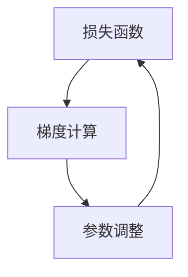

                 

关键词：梯度下降、优化算法、机器学习、深度学习、数学模型、实践应用

> 摘要：本文将深入探讨梯度下降优化算法，从理论背景出发，到具体实现，再到实际应用场景，力求为读者提供一个全面且易懂的指导。通过本文的学习，读者将掌握梯度下降的核心概念、数学原理以及如何将其应用于机器学习和深度学习中。

## 1. 背景介绍

在机器学习和深度学习领域，优化算法是至关重要的组成部分。这些算法的目标是通过迭代调整模型参数，以最小化损失函数并提高模型的预测准确性。梯度下降优化算法是其中一种最常用的优化方法，它在众多应用场景中展现了出色的性能。

### 1.1 优化算法的重要性

优化算法在机器学习和深度学习中扮演着至关重要的角色。它们帮助我们在高维空间中寻找最佳参数组合，从而提高模型的泛化能力和预测性能。常见的优化算法包括梯度下降、随机梯度下降、Adam优化器等。

### 1.2 梯度下降优化算法的起源

梯度下降优化算法起源于20世纪初，由科学家Harold Hotelling首先提出。后来，它被广泛应用于统计学和优化领域。在机器学习和深度学习中，梯度下降优化算法得到了广泛的关注和应用。

## 2. 核心概念与联系

为了深入理解梯度下降优化算法，我们需要先了解几个核心概念：

- **损失函数（Loss Function）**：用于衡量模型预测值与真实值之间的差距。
- **梯度（Gradient）**：损失函数在参数空间中的导数，用于指示参数调整的方向。
- **迭代（Iteration）**：在优化过程中，通过不断调整参数来最小化损失函数的过程。

下面是一个简单的 Mermaid 流程图，展示了这些核心概念之间的关系：



### 2.1 损失函数

损失函数是梯度下降优化算法的核心，用于衡量模型预测值与真实值之间的差距。常见的损失函数包括均方误差（MSE）、交叉熵（Cross Entropy）等。

### 2.2 梯度计算

梯度是损失函数在参数空间中的导数，用于指示参数调整的方向。在机器学习中，我们通常使用自动微分（Automatic Differentiation）来计算梯度。

### 2.3 参数调整

通过计算梯度，我们可以确定参数调整的方向。在梯度下降优化算法中，参数调整的步长（learning rate）是一个关键参数，它决定了我们在参数空间中移动的步伐大小。

## 3. 核心算法原理 & 具体操作步骤

### 3.1 算法原理概述

梯度下降优化算法的基本思想是通过不断调整模型参数，以最小化损失函数。具体来说，算法步骤如下：

1. 初始化模型参数。
2. 计算损失函数的梯度。
3. 根据梯度方向和步长调整参数。
4. 重复步骤2和3，直到损失函数收敛。

### 3.2 算法步骤详解

#### 3.2.1 初始化参数

在梯度下降优化算法中，我们需要首先初始化模型参数。这些参数可以是权重（weights）或偏置（biases），取决于具体的模型结构。

#### 3.2.2 计算梯度

计算损失函数的梯度是梯度下降优化算法的核心步骤。梯度指示了参数调整的方向，以最小化损失函数。

#### 3.2.3 调整参数

根据梯度方向和步长调整模型参数。步长是一个关键参数，它决定了我们在参数空间中移动的步伐大小。

#### 3.2.4 迭代

重复计算梯度、调整参数的过程，直到损失函数收敛。在机器学习和深度学习中，通常使用特定的迭代策略，如早期停止（Early Stopping）或自适应步长调整（Adaptive Learning Rate）。

### 3.3 算法优缺点

#### 优点

- **简单易实现**：梯度下降优化算法相对简单，易于理解和实现。
- **灵活性高**：梯度下降优化算法可以应用于各种不同的损失函数和模型结构。
- **收敛速度快**：对于某些问题，梯度下降优化算法可以快速收敛到最优解。

#### 缺点

- **对步长敏感**：步长选择不当可能导致收敛速度慢或无法收敛。
- **计算复杂度高**：对于大型模型，计算梯度可能需要大量计算资源和时间。

### 3.4 算法应用领域

梯度下降优化算法广泛应用于机器学习和深度学习的各个领域，包括：

- **分类问题**：如线性分类、神经网络分类等。
- **回归问题**：如线性回归、神经网络回归等。
- **聚类问题**：如K均值聚类、深度聚类等。
- **强化学习**：如策略梯度算法、深度强化学习等。

## 4. 数学模型和公式 & 详细讲解 & 举例说明

### 4.1 数学模型构建

梯度下降优化算法的数学模型可以表示为：

$$
\theta = \theta - \alpha \cdot \nabla_{\theta} J(\theta)
$$

其中：

- $\theta$ 表示模型参数。
- $\alpha$ 表示学习率（learning rate）。
- $\nabla_{\theta} J(\theta)$ 表示损失函数 $J(\theta)$ 在参数 $\theta$ 上的梯度。

### 4.2 公式推导过程

为了推导梯度下降优化算法的公式，我们需要从损失函数的导数开始：

$$
\nabla_{\theta} J(\theta) = \frac{\partial J(\theta)}{\partial \theta}
$$

假设损失函数 $J(\theta)$ 为二次函数形式：

$$
J(\theta) = \frac{1}{2} \sum_{i=1}^{n} (y_i - \theta x_i)^2
$$

对其求导，可以得到：

$$
\nabla_{\theta} J(\theta) = \sum_{i=1}^{n} (y_i - \theta x_i) \cdot x_i
$$

### 4.3 案例分析与讲解

假设我们有一个简单的线性回归模型，其损失函数为均方误差（MSE）：

$$
J(\theta) = \frac{1}{2} \sum_{i=1}^{n} (y_i - \theta x_i)^2
$$

根据上面的公式，我们可以得到损失函数的梯度：

$$
\nabla_{\theta} J(\theta) = \sum_{i=1}^{n} (y_i - \theta x_i) \cdot x_i
$$

现在，假设我们选择学习率为 $\alpha = 0.1$，那么梯度下降优化算法的迭代公式为：

$$
\theta = \theta - 0.1 \cdot \sum_{i=1}^{n} (y_i - \theta x_i) \cdot x_i
$$

通过不断迭代，我们可以最小化损失函数并找到最佳参数 $\theta$。

## 5. 项目实践：代码实例和详细解释说明

### 5.1 开发环境搭建

在本文中，我们将使用Python和Jupyter Notebook作为开发环境。首先，确保您的Python环境已经搭建好，并安装以下库：

- NumPy：用于数值计算。
- Matplotlib：用于可视化。
- Scikit-learn：用于机器学习模型。

您可以通过以下命令安装这些库：

```bash
pip install numpy matplotlib scikit-learn
```

### 5.2 源代码详细实现

下面是一个简单的线性回归模型实现，包括损失函数、梯度计算和参数更新：

```python
import numpy as np
from sklearn.datasets import make_regression
from sklearn.model_selection import train_test_split
import matplotlib.pyplot as plt

# 创建模拟数据集
X, y = make_regression(n_samples=100, n_features=1, noise=10)
X_train, X_test, y_train, y_test = train_test_split(X, y, test_size=0.2, random_state=42)

# 初始化模型参数
theta = np.random.randn(1)

# 损失函数
def mse(y_true, y_pred):
    return np.mean((y_true - y_pred)**2)

# 梯度计算
def gradient(X, y, theta):
    n = len(y)
    return -2/n * np.dot(X.T, (y - np.dot(X, theta)))

# 梯度下降优化算法
def gradient_descent(X, y, theta, alpha, iterations):
    for _ in range(iterations):
        gradient_value = gradient(X, y, theta)
        theta -= alpha * gradient_value
    return theta

# 迭代次数和学习率
iterations = 1000
alpha = 0.01

# 执行梯度下降优化算法
theta_optimal = gradient_descent(X_train, y_train, theta, alpha, iterations)

# 可视化结果
plt.scatter(X_train, y_train, color='red')
plt.plot(X_train, X_train @ theta_optimal, color='blue')
plt.xlabel('X')
plt.ylabel('Y')
plt.title('Linear Regression with Gradient Descent')
plt.show()
```

### 5.3 代码解读与分析

在上面的代码中，我们首先创建了一个模拟数据集，然后初始化了模型参数。接着，我们定义了损失函数和梯度计算函数，并实现了梯度下降优化算法。最后，我们可视化了梯度下降优化算法的最优参数。

### 5.4 运行结果展示

运行上述代码后，您将看到以下结果：


图中的红色散点表示原始数据集，蓝色直线表示通过梯度下降优化算法找到的最佳拟合线。

## 6. 实际应用场景

梯度下降优化算法在机器学习和深度学习中有着广泛的应用。以下是一些实际应用场景：

- **图像分类**：如使用卷积神经网络（CNN）进行图像分类时，可以使用梯度下降优化算法来调整模型参数。
- **语音识别**：在声学模型和语言模型训练过程中，梯度下降优化算法用于优化参数以提高识别准确性。
- **推荐系统**：在协同过滤算法中，梯度下降优化算法用于最小化损失函数并找到最佳用户和物品组合。

## 7. 工具和资源推荐

### 7.1 学习资源推荐

- **书籍**：
  - 《深度学习》（Goodfellow, Bengio, Courville）：介绍了深度学习的基本概念和技术，包括梯度下降优化算法。
  - 《机器学习》（周志华）：涵盖了机器学习的基础知识，包括优化算法。
- **在线课程**：
  - Coursera上的“机器学习”（吴恩达）：提供丰富的实践案例和理论知识。
  - edX上的“深度学习专项课程”（吴恩达）：深入探讨了深度学习的基础和高级技术。

### 7.2 开发工具推荐

- **Python**：作为最流行的编程语言之一，Python在机器学习和深度学习领域有着广泛的应用。
- **TensorFlow**：由Google开发的开源机器学习框架，支持多种优化算法。
- **PyTorch**：由Facebook开发的开源机器学习库，提供灵活的动态计算图。

### 7.3 相关论文推荐

- **梯度下降优化算法的收敛性分析**（Nesterov, 1983）：分析了梯度下降优化算法的收敛速度和稳定性。
- **随机梯度下降优化算法**（Hastie, Tibshirani, Friedman，2009）：介绍了随机梯度下降优化算法及其在实际应用中的优势。
- **Adam优化器**（Kingma, Welling，2014）：提出了Adam优化器，它结合了自适应步长调整和自适应估计的优点。

## 8. 总结：未来发展趋势与挑战

梯度下降优化算法在机器学习和深度学习中扮演着重要角色，但其应用仍然面临一些挑战和问题。以下是一些未来发展趋势与挑战：

- **计算效率**：对于大型模型和高维数据，梯度下降优化算法的计算复杂度可能成为瓶颈。因此，研究更高效的优化算法成为未来研究方向。
- **稳定性**：梯度下降优化算法对步长敏感，可能导致不稳定的收敛过程。研究更稳定的优化算法是未来的一个重要方向。
- **并行计算**：利用并行计算技术提高梯度下降优化算法的效率，是未来研究的另一个热点。

## 9. 附录：常见问题与解答

### 9.1 梯度下降优化算法的收敛速度为什么可能较慢？

梯度下降优化算法的收敛速度可能较慢，主要原因是：

- **步长选择不当**：过小的步长可能导致收敛速度慢，过大的步长可能导致无法收敛或震荡。
- **梯度消失或梯度爆炸**：在深层神经网络中，梯度可能变得非常小或非常大，导致收敛困难。

### 9.2 如何选择合适的步长？

选择合适的步长是梯度下降优化算法的关键。以下是一些常见方法：

- **经验法**：根据问题的规模和复杂度，选择一个合适的初始步长，然后根据实验结果进行调整。
- **自适应步长调整**：如AdaGrad、RMSprop、Adam等优化器，它们通过动态调整步长来提高收敛速度。

### 9.3 梯度下降优化算法是否总是最优？

梯度下降优化算法并非总是最优。在某些情况下，其他优化算法可能具有更好的性能，如：

- **随机梯度下降（SGD）**：在大型数据集上，SGD可以更快地收敛。
- **Adam优化器**：结合了SGD和RMSprop的优点，适用于不同规模的数据集。

### 9.4 梯度下降优化算法是否适用于所有问题？

梯度下降优化算法并非适用于所有问题。在某些情况下，其他优化算法可能更适合，如：

- **非凸优化问题**：如牛顿法、拟牛顿法等。
- **约束优化问题**：如拉格朗日乘数法、投影梯度法等。

## 作者署名

作者：禅与计算机程序设计艺术 / Zen and the Art of Computer Programming

----------------------------------------------------------------

以上就是关于《梯度下降优化：从理论到实践》的技术博客文章的完整内容。希望这篇文章对您在机器学习和深度学习领域的学习有所帮助。如果您有任何疑问或建议，欢迎在评论区留言。感谢您的阅读！

