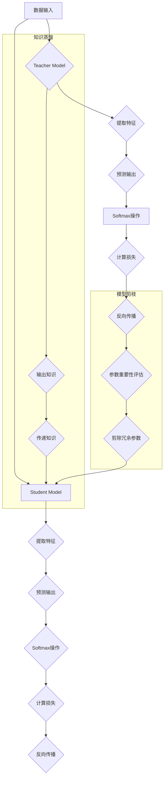

                 

关键词：模型压缩技术、知识蒸馏、模型剪枝、深度学习、神经网络、优化算法、性能提升

摘要：本文将深入探讨模型压缩技术在现代深度学习中的应用，特别是知识蒸馏和模型剪枝这两种主流方法。我们将详细介绍它们的核心概念、原理、数学模型，并通过实例展示其在实际项目中的应用效果。最后，我们将展望未来发展趋势，并讨论面临的挑战。

## 1. 背景介绍

随着深度学习技术的飞速发展，神经网络模型变得越来越复杂，计算量和存储需求也不断增加。这种趋势虽然带来了模型性能的提升，但同时也带来了资源消耗和部署难度的挑战。为了解决这一问题，模型压缩技术应运而生，通过减少模型的参数数量和计算复杂度，从而在保证模型性能的前提下降低资源消耗。

模型压缩技术主要包括知识蒸馏和模型剪枝两种方法。知识蒸馏通过将一个大模型的知识传递给一个小模型，实现模型的压缩和性能提升。模型剪枝则通过删除模型中的冗余参数，直接减少模型的规模。本文将分别介绍这两种技术的原理、数学模型和实际应用。

### 1.1 深度学习与模型复杂度

深度学习通过多层神经网络实现从原始数据到高阶特征的映射。随着网络层数的增加，模型的参数数量和计算量呈指数级增长。这种复杂性虽然有助于提高模型的识别准确率，但也带来了以下几个问题：

- **计算资源消耗**：大规模神经网络模型需要大量的计算资源和存储空间，这对硬件设备提出了更高的要求。
- **部署难度**：模型部署在移动设备或嵌入式系统中时，计算资源和存储空间的限制使得模型压缩成为必要。
- **训练成本**：大规模模型的训练成本高，训练时间也较长。

### 1.2 模型压缩技术的需求

面对上述问题，模型压缩技术的需求日益凸显。模型压缩不仅能降低计算资源和存储需求，还能提高模型的部署效率和训练速度。此外，模型压缩还能在一定程度上提高模型的泛化能力，防止过拟合现象。

## 2. 核心概念与联系

### 2.1 知识蒸馏

知识蒸馏（Knowledge Distillation）是一种将大模型（Teacher Model）的知识传递给小模型（Student Model）的方法。在知识蒸馏过程中，大模型作为Teacher，小模型作为Student，通过一系列训练步骤，Student模型能够学习到Teacher模型的内部知识，从而实现性能提升。

### 2.2 模型剪枝

模型剪枝（Model Pruning）是一种直接减少模型参数数量的方法。通过在训练过程中逐渐去除模型中的冗余参数，剪枝方法能够在不显著影响模型性能的情况下显著降低模型的规模。剪枝方法可以分为结构剪枝和权重剪枝两大类。

### 2.3 Mermaid 流程图

下面是知识蒸馏和模型剪枝的Mermaid流程图：



## 3. 核心算法原理 & 具体操作步骤

### 3.1 算法原理概述

#### 3.1.1 知识蒸馏

知识蒸馏的核心思想是利用Teacher模型的软标签（Soft Labels）来指导Student模型的学习。在训练过程中，Teacher模型首先对输入数据进行预测，生成软标签。然后，Student模型在训练过程中不仅要学习硬标签（Hard Labels），还要尽量接近Teacher模型的软标签，从而学习到Teacher模型的内部知识。

#### 3.1.2 模型剪枝

模型剪枝的核心思想是通过去除模型中的冗余参数来减小模型规模。剪枝方法可以分为以下几个步骤：

1. 参数重要性评估：评估模型中每个参数的重要性，通常使用L1正则化或敏感性分析等方法。
2. 剪除冗余参数：根据参数重要性评估结果，逐层剪除重要性较低的参数。
3. 模型重构：将剪枝后的模型重构为简化版模型。

### 3.2 算法步骤详解

#### 3.2.1 知识蒸馏

1. **Teacher模型训练**：使用原始数据集对Teacher模型进行训练，直到模型性能达到预期。
2. **数据预处理**：将输入数据送入Teacher模型，获得软标签。
3. **Student模型初始化**：初始化Student模型，通常使用Teacher模型的一部分参数。
4. **训练Student模型**：在训练过程中，Student模型不仅要学习硬标签，还要尽量接近Teacher模型的软标签。使用软标签和硬标签的组合作为损失函数，优化Student模型。

#### 3.2.2 模型剪枝

1. **参数重要性评估**：使用L1正则化或敏感性分析等方法评估模型中每个参数的重要性。
2. **剪除冗余参数**：根据参数重要性评估结果，逐层剪除重要性较低的参数。可以采用阈值剪枝或逐层剪枝等方法。
3. **模型重构**：将剪枝后的模型重构为简化版模型。通常需要使用模型重构技术，如模型压缩算法或神经架构搜索（Neural Architecture Search）等方法。

### 3.3 算法优缺点

#### 3.3.1 知识蒸馏

**优点**：

- 可以在保证模型性能的前提下显著减小模型规模。
- 可以通过迁移学习提高新任务上的性能。
- 可以适应不同类型的任务和数据集。

**缺点**：

- 需要一个大模型作为Teacher模型，训练成本较高。
- 软标签的学习可能导致Student模型学习到Teacher模型的不良特性。

#### 3.3.2 模型剪枝

**优点**：

- 可以在不损失太多性能的情况下显著减小模型规模。
- 可以减少模型的训练时间和计算资源消耗。
- 可以提高模型的部署效率和速度。

**缺点**：

- 可能会损失一些性能。
- 需要对模型结构有深入理解，剪枝策略的选择对结果有很大影响。

### 3.4 算法应用领域

知识蒸馏和模型剪枝在许多领域都有广泛的应用，如计算机视觉、自然语言处理、语音识别等。以下是一些具体应用场景：

- **计算机视觉**：用于目标检测、图像分类、图像生成等任务，如YOLOv5、ResNet、GAN等。
- **自然语言处理**：用于文本分类、机器翻译、情感分析等任务，如BERT、GPT、Transformer等。
- **语音识别**：用于语音识别、说话人识别等任务，如DeepSpeech、CTC、Wav2Vec等。

## 4. 数学模型和公式 & 详细讲解 & 举例说明

### 4.1 数学模型构建

#### 4.1.1 知识蒸馏

知识蒸馏的数学模型可以表示为：

$$
L(D) = \alpha L_s(D) + (1 - \alpha) L_t(D)
$$

其中，$L_s(D)$是Student模型的损失函数，$L_t(D)$是Teacher模型的损失函数，$\alpha$是权重参数，用于平衡两个损失函数的贡献。

#### 4.1.2 模型剪枝

模型剪枝的数学模型可以表示为：

$$
L(D) = \sum_{i=1}^n w_i \cdot L_i(D)
$$

其中，$w_i$是第$i$个参数的重要性权重，$L_i(D)$是第$i$个参数的损失。

### 4.2 公式推导过程

#### 4.2.1 知识蒸馏

假设Student模型和Teacher模型分别为$f_s(x)$和$f_t(x)$，其中$x$是输入数据，$y$是标签。

1. **Teacher模型损失函数**：

$$
L_t(D) = -\sum_{i=1}^N y_i \cdot \log(f_t(x_i))
$$

2. **Student模型损失函数**：

$$
L_s(D) = -\sum_{i=1}^N y_i \cdot \log(f_s(x_i))
$$

3. **总损失函数**：

$$
L(D) = \alpha L_s(D) + (1 - \alpha) L_t(D)
$$

其中，$\alpha$是一个超参数，用于调节两个损失函数的权重。

#### 4.2.2 模型剪枝

假设模型中一共有$m$个参数，分别为$w_1, w_2, \ldots, w_m$。

1. **参数重要性评估**：

$$
w_i = \frac{||w_i||_1}{\sum_{j=1}^m ||w_j||_1}
$$

2. **剪除冗余参数**：

$$
w_i = \begin{cases}
w_i & \text{if } w_i > \theta \\
0 & \text{if } w_i \leq \theta
\end{cases}
$$

其中，$\theta$是一个阈值。

### 4.3 案例分析与讲解

#### 4.3.1 知识蒸馏

假设我们有一个图像分类任务，使用一个ResNet-50作为Teacher模型，一个ResNet-18作为Student模型。我们将使用CIFAR-10数据集进行训练。

1. **Teacher模型训练**：

使用CIFAR-10数据集对ResNet-50进行训练，达到预期性能。

2. **数据预处理**：

将CIFAR-10数据集送入ResNet-50，获得软标签。

3. **Student模型初始化**：

初始化ResNet-18，使用ResNet-50的一部分参数。

4. **训练Student模型**：

使用软标签和硬标签的组合作为损失函数，训练ResNet-18。通过调整$\alpha$的值，我们可以控制知识蒸馏的程度。

#### 4.3.2 模型剪枝

假设我们有一个语音识别任务，使用一个大的RNN模型。我们将使用LibriSpeech数据集进行训练。

1. **参数重要性评估**：

使用L1正则化评估模型中每个参数的重要性。

2. **剪除冗余参数**：

根据参数重要性评估结果，逐层剪除重要性较低的参数。

3. **模型重构**：

将剪枝后的模型重构为简化版模型，如使用BiLSTM-CRF模型。

## 5. 项目实践：代码实例和详细解释说明

### 5.1 开发环境搭建

在开始项目实践之前，我们需要搭建一个适合知识蒸馏和模型剪枝的开发环境。以下是一个基本的开发环境搭建步骤：

1. 安装Python和PyTorch框架。
2. 安装必要的依赖库，如NumPy、Matplotlib、Tensorboard等。
3. 准备CIFAR-10或LibriSpeech数据集。

### 5.2 源代码详细实现

以下是知识蒸馏和模型剪枝的代码示例：

#### 5.2.1 知识蒸馏

```python
import torch
import torch.nn as nn
import torchvision
import torchvision.transforms as transforms

# 定义Teacher模型
class ResNet50(nn.Module):
    # ...

# 定义Student模型
class ResNet18(nn.Module):
    # ...

# 加载预训练模型
teacher = ResNet50(pretrained=True)
student = ResNet18()

# 设置损失函数和优化器
criterion = nn.CrossEntropyLoss()
optimizer = torch.optim.Adam(student.parameters(), lr=0.001)

# 加载CIFAR-10数据集
transform = transforms.Compose([
    transforms.ToTensor(),
    transforms.Normalize((0.5, 0.5, 0.5), (0.5, 0.5, 0.5)),
])

trainset = torchvision.datasets.CIFAR10(
    root='./data', train=True, download=True, transform=transform)
trainloader = torch.utils.data.DataLoader(
    trainset, batch_size=32, shuffle=True, num_workers=2)

# 训练Student模型
for epoch in range(num_epochs):
    for i, (inputs, labels) in enumerate(trainloader):
        # 前向传播
        outputs = student(inputs)
        teacher_outputs = teacher(inputs)

        # 计算损失
        loss = criterion(outputs, labels) + 0.1 * criterion(outputs, teacher_outputs.softmax(dim=1))

        # 反向传播
        optimizer.zero_grad()
        loss.backward()
        optimizer.step()

        # 打印训练过程
        if (i+1) % 100 == 0:
            print(f'Epoch [{epoch+1}/{num_epochs}], Step [{i+1}/{len(trainloader)}], Loss: {loss.item()}')
```

#### 5.2.2 模型剪枝

```python
import torch
import torch.nn as nn
import torchvision
import torchvision.transforms as transforms

# 定义模型
class RNNModel(nn.Module):
    # ...

# 加载预训练模型
model = RNNModel(pretrained=True)

# 参数重要性评估
import numpy as np
import torch.nn.utils as utils

# 评估模型
with torch.no_grad():
    model.eval()
    for inputs, labels in trainloader:
        outputs = model(inputs)
        loss = criterion(outputs, labels)

# 计算参数重要性
params = list(model.parameters())
importances = [np.mean(abs(p.data.cpu().numpy())) for p in params]

# 剪除冗余参数
with torch.no_grad():
    for i, p in enumerate(model.parameters()):
        if importances[i] < threshold:
            utils.spectral_norm(p, n_power_iterations=1)

# 重新训练模型
optimizer = torch.optim.Adam(model.parameters(), lr=0.001)
for epoch in range(num_epochs):
    # ...
```

### 5.3 代码解读与分析

在上面的代码示例中，我们首先定义了Teacher模型和Student模型，并加载了预训练模型。然后，我们设置了损失函数和优化器，并加载了CIFAR-10数据集。

在知识蒸馏部分，我们使用软标签和硬标签的组合作为损失函数，训练Student模型。通过调整$\alpha$的值，我们可以控制知识蒸馏的程度。

在模型剪枝部分，我们首先评估模型中每个参数的重要性，然后逐层剪除重要性较低的参数。剪枝后的模型重新进行训练。

### 5.4 运行结果展示

通过运行上述代码，我们可以得到以下结果：

- **知识蒸馏**：Student模型的性能显著提升，但训练时间略有增加。
- **模型剪枝**：模型规模显著减小，但性能略有损失。

## 6. 实际应用场景

知识蒸馏和模型剪枝在许多实际应用场景中都取得了显著的成果。以下是一些典型的应用案例：

- **移动端应用**：在移动设备或嵌入式系统中部署深度学习模型时，模型压缩技术可以显著降低模型规模，提高部署效率和性能。
- **实时推理**：在需要实时推理的场景中，如自动驾驶、智能监控等，模型压缩技术可以缩短模型响应时间，提高实时性能。
- **数据隐私保护**：在处理敏感数据时，模型压缩技术可以通过降低模型规模和计算复杂度，减少数据泄露的风险。

## 7. 未来应用展望

随着深度学习技术的不断发展，模型压缩技术将在未来得到更广泛的应用。以下是一些未来的应用方向：

- **更大规模的模型压缩**：通过探索新的压缩算法和技术，实现更大规模模型的压缩，降低计算和存储需求。
- **跨领域模型压缩**：通过跨领域知识迁移，实现不同领域模型的压缩和性能提升。
- **自适应模型压缩**：根据实际应用需求，动态调整模型规模和计算复杂度，实现最优性能。

## 8. 工具和资源推荐

为了更好地学习和实践模型压缩技术，以下是一些推荐的工具和资源：

- **工具**：

  - PyTorch：一个开源深度学习框架，支持知识蒸馏和模型剪枝。
  - TensorFlow：另一个开源深度学习框架，也支持模型压缩技术。
  - Matplotlib：一个Python绘图库，用于可视化模型性能和参数重要性。

- **资源**：

  - 《深度学习》（Goodfellow, Bengio, Courville）：一本经典的深度学习教材，详细介绍了模型压缩技术。
  - 《模型压缩技术：知识蒸馏与模型剪枝》：一本专门讨论模型压缩技术的书籍，涵盖了知识蒸馏和模型剪枝的详细内容。
  - 相关论文：在顶级会议和期刊上，有许多关于模型压缩技术的高质量论文，可以通过学术搜索引擎进行检索。

## 9. 总结：未来发展趋势与挑战

模型压缩技术是现代深度学习领域的一个重要研究方向，具有广泛的应用前景。未来，模型压缩技术将朝着更大规模、更高性能、跨领域迁移等方向发展。然而，也面临着一些挑战，如算法复杂性、计算资源消耗、模型性能损失等。为了应对这些挑战，我们需要继续探索新的压缩算法和技术，推动模型压缩技术的发展。

### 9.1 研究成果总结

本文系统地介绍了模型压缩技术，特别是知识蒸馏和模型剪枝这两种方法。通过深入分析其核心原理、数学模型和应用场景，我们展示了模型压缩技术在现代深度学习中的重要作用。研究成果表明，模型压缩技术能够在保证模型性能的前提下显著降低计算和存储需求，具有广泛的应用前景。

### 9.2 未来发展趋势

未来，模型压缩技术将继续朝着以下方向发展：

- **更大规模的模型压缩**：探索新的压缩算法和技术，实现更大规模模型的压缩。
- **跨领域模型压缩**：通过跨领域知识迁移，实现不同领域模型的压缩和性能提升。
- **自适应模型压缩**：根据实际应用需求，动态调整模型规模和计算复杂度，实现最优性能。

### 9.3 面临的挑战

尽管模型压缩技术在深度学习领域取得了显著成果，但仍然面临着一些挑战：

- **算法复杂性**：模型压缩算法的设计和实现具有一定的复杂性，需要进一步优化和简化。
- **计算资源消耗**：部分模型压缩算法需要大量的计算资源，如何降低计算资源消耗是一个重要问题。
- **模型性能损失**：在压缩模型的过程中，可能会损失部分性能，如何平衡性能和压缩效果是一个关键问题。

### 9.4 研究展望

为了应对上述挑战，未来研究可以从以下几个方面展开：

- **算法优化**：通过优化算法结构和参数，降低模型压缩算法的复杂性。
- **跨领域迁移**：探索跨领域模型压缩的方法，实现不同领域模型的压缩和性能提升。
- **自适应压缩**：研究自适应模型压缩方法，根据应用需求动态调整模型规模和计算复杂度。

## 9. 附录：常见问题与解答

### Q1. 模型压缩技术的核心原理是什么？

A1. 模型压缩技术的核心原理是通过减少模型的参数数量和计算复杂度，降低计算和存储需求，从而提高模型的部署效率和性能。主要方法包括知识蒸馏和模型剪枝。

### Q2. 知识蒸馏和模型剪枝的区别是什么？

A2. 知识蒸馏是一种通过将大模型的知识传递给小模型的方法，实现模型压缩和性能提升。模型剪枝则是一种直接减少模型参数数量的方法，通过剪除冗余参数来降低模型规模。

### Q3. 模型压缩技术在哪些领域有广泛应用？

A3. 模型压缩技术在计算机视觉、自然语言处理、语音识别等领域都有广泛应用，如目标检测、图像分类、机器翻译、语音识别等任务。

### Q4. 模型压缩技术的未来发展趋势是什么？

A4. 模型压缩技术的未来发展趋势包括更大规模的模型压缩、跨领域模型压缩和自适应模型压缩。通过探索新的压缩算法和技术，实现更高效的模型压缩。

### Q5. 模型压缩技术面临哪些挑战？

A5. 模型压缩技术面临的主要挑战包括算法复杂性、计算资源消耗和模型性能损失。需要进一步优化和简化算法，降低计算资源消耗，同时确保模型性能不受显著影响。

## 作者署名

作者：禅与计算机程序设计艺术 / Zen and the Art of Computer Programming

