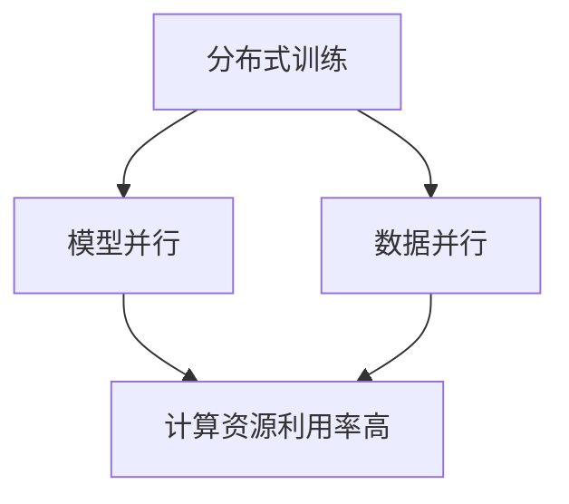
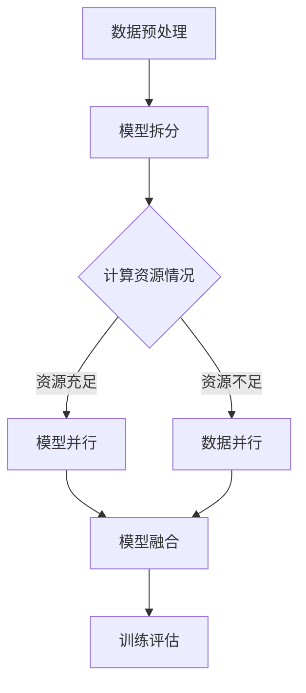

                 

关键词：模型并行，数据并行，分布式AI，训练策略，深度学习

> 摘要：本文将深入探讨模型并行和数据并行的概念，阐述它们在分布式AI训练中的应用和区别。通过对核心算法原理、数学模型、实际应用场景和未来发展趋势的详细分析，本文旨在为读者提供全面的技术见解和实用的实践指导。

## 1. 背景介绍

随着深度学习的迅猛发展，AI模型的训练需求日益增长。单机训练难以满足大规模数据集和高复杂度模型的需求，分布式AI训练逐渐成为研究热点。分布式训练通过将模型和数据分布在多个计算节点上，并行执行训练任务，显著提升训练速度和资源利用效率。

在分布式训练中，模型并行和数据并行是两种主要的训练策略。模型并行通过将模型分解为多个部分，在不同的计算节点上并行训练，适用于模型规模较大的场景。数据并行则通过将数据集划分为多个子集，在不同的计算节点上并行处理，适用于数据规模较大的场景。本文将详细分析这两种策略的原理、优缺点及其应用领域。

### 1.1 分布式AI训练的意义

分布式AI训练的意义在于：

- **提升训练速度**：分布式训练可以将训练任务分布到多个计算节点上，利用并行计算提升训练速度。
- **提高资源利用效率**：通过分布式训练，可以充分利用多个计算节点的资源，避免资源浪费。
- **适应大规模模型和数据**：分布式训练可以应对大规模模型和数据集的训练需求，提高模型的训练效果。

### 1.2 模型并行与数据并行的关系

模型并行和数据并行是分布式AI训练中的两种主要策略，它们之间既有区别也有联系。

- **区别**：模型并行主要针对模型规模较大的情况，通过将模型分解为多个部分进行并行训练；数据并行主要针对数据规模较大的情况，通过将数据集划分为多个子集进行并行训练。
- **联系**：在实际应用中，模型并行和数据并行往往结合使用，以充分利用计算资源，提升训练效果。

## 2. 核心概念与联系

为了更好地理解模型并行与数据并行的原理，我们首先需要了解一些核心概念。

### 2.1 模型并行

模型并行（Model Parallelism）是一种将深度学习模型在多个计算设备上并行训练的策略。其核心思想是将模型分解为多个部分，每个部分在不同的计算设备上训练。模型并行适用于模型规模较大，单台计算设备难以容纳的情况。

### 2.2 数据并行

数据并行（Data Parallelism）是一种将数据集在多个计算设备上并行处理的策略。其核心思想是将数据集划分为多个子集，每个子集在不同的计算设备上进行训练。数据并行适用于数据规模较大的情况。

### 2.3 核心概念联系

模型并行与数据并行之间的关系可以用如下Mermaid流程图表示：



### 2.4 Mermaid流程图

以下是模型并行与数据并行在分布式训练中的流程图：



## 3. 核心算法原理 & 具体操作步骤

### 3.1 算法原理概述

模型并行和数据并行的算法原理如下：

- **模型并行**：将模型分解为多个部分，每个部分在不同的计算设备上训练。通过同步或异步策略，将训练过程中的梯度信息传递并更新模型参数。
- **数据并行**：将数据集划分为多个子集，每个子集在不同的计算设备上进行训练。通过同步或异步策略，将训练过程中的梯度信息传递并更新全局模型参数。

### 3.2 算法步骤详解

#### 模型并行

1. **数据预处理**：对数据集进行预处理，包括数据清洗、归一化等操作。
2. **模型拆分**：根据计算资源情况，将模型拆分为多个部分，每个部分对应一个计算设备。
3. **训练过程**：
   - 同步策略：每个计算设备独立训练，定期同步梯度信息并更新模型参数。
   - 异步策略：每个计算设备独立训练，异步更新模型参数。
4. **模型融合**：将训练完成的模型部分融合为一个完整的模型。
5. **训练评估**：对融合后的模型进行评估，调整模型参数以提升训练效果。

#### 数据并行

1. **数据预处理**：对数据集进行预处理，包括数据清洗、归一化等操作。
2. **数据划分**：将数据集划分为多个子集，每个子集对应一个计算设备。
3. **训练过程**：
   - 同步策略：每个计算设备独立训练，定期同步梯度信息并更新全局模型参数。
   - 异步策略：每个计算设备独立训练，异步更新全局模型参数。
4. **训练评估**：对每个计算设备的训练结果进行评估，调整模型参数以提升训练效果。

### 3.3 算法优缺点

#### 模型并行的优缺点

**优点**：

- **计算资源利用率高**：充分利用多个计算设备的计算资源。
- **适用于大规模模型**：可以处理单台计算设备难以容纳的大规模模型。

**缺点**：

- **通信开销大**：同步策略下，模型并行需要频繁同步梯度信息，导致通信开销较大。
- **复杂度高**：模型并行涉及多个计算设备的协同，算法设计和实现相对复杂。

#### 数据并行的优缺点

**优点**：

- **计算速度快**：数据并行可以充分利用多个计算设备的计算能力，提高训练速度。
- **易于实现**：数据并行的算法设计和实现相对简单。

**缺点**：

- **计算资源利用率低**：数据并行主要依赖数据规模，计算资源利用率相对较低。
- **难以处理大规模模型**：数据并行适用于大规模数据集，但对于大规模模型，效果可能不如模型并行。

### 3.4 算法应用领域

模型并行与数据并行广泛应用于以下领域：

- **计算机视觉**：处理大规模图像数据集，如人脸识别、物体检测等。
- **自然语言处理**：处理大规模文本数据集，如文本分类、机器翻译等。
- **语音识别**：处理大规模语音数据集，如语音识别、语音合成等。

## 4. 数学模型和公式 & 详细讲解 & 举例说明

### 4.1 数学模型构建

在分布式AI训练中，模型并行和数据并行的数学模型构建如下：

#### 模型并行

假设有 \(N\) 个计算设备，每个设备上训练的部分模型为 \(M_i\)，其中 \(i = 1, 2, \ldots, N\)。训练过程中，每个设备上的模型 \(M_i\) 需要与全局模型 \(M\) 进行梯度同步。

1. **梯度同步**：

   假设全局模型 \(M\) 的参数为 \(\theta\)，设备 \(i\) 上的模型 \(M_i\) 的参数为 \(\theta_i\)。训练过程中，设备 \(i\) 的梯度为 \(\nabla L_i\)，全局梯度为 \(\nabla L\)。

   同步策略下，设备 \(i\) 在每个训练步骤 \(t\) 结束时，将梯度信息 \(\nabla L_i\) 发送给全局模型，并更新参数：

   $$\theta = \theta - \eta \nabla L$$

   其中，\(\eta\) 为学习率。

2. **模型融合**：

   训练完成后，将所有设备上的模型 \(M_i\) 融合为一个完整的全局模型 \(M\)：

   $$M = \prod_{i=1}^N M_i$$

#### 数据并行

假设有 \(N\) 个计算设备，每个设备上处理的数据集为 \(D_i\)，其中 \(i = 1, 2, \ldots, N\)。训练过程中，每个设备上的数据集 \(D_i\) 需要与全局数据集 \(D\) 进行梯度同步。

1. **梯度同步**：

   假设全局模型为 \(M\)，设备 \(i\) 上的训练损失为 \(L_i\)，全局损失为 \(L\)。

   同步策略下，设备 \(i\) 在每个训练步骤 \(t\) 结束时，将损失信息 \(L_i\) 发送给全局模型，并更新模型参数：

   $$\theta = \theta - \eta \nabla L$$

   其中，\(\eta\) 为学习率。

2. **模型更新**：

   训练完成后，全局模型 \(M\) 的参数更新为：

   $$\theta = \theta - \eta \nabla L$$

### 4.2 公式推导过程

#### 模型并行

1. **梯度同步**：

   设备 \(i\) 的梯度为：

   $$\nabla L_i = \nabla (f(\theta_i))$$

   全局梯度为：

   $$\nabla L = \nabla (f(\theta))$$

   根据链式法则，有：

   $$\nabla L_i = \nabla \theta_i^T \nabla f(\theta)$$

   同步策略下，设备 \(i\) 的参数更新为：

   $$\theta_i = \theta_i - \eta \nabla L_i$$

   其中，\(\eta\) 为学习率。

2. **模型融合**：

   设备 \(i\) 的模型 \(M_i\) 的参数更新为：

   $$\theta_i = \theta_i - \eta \nabla L_i$$

   全局模型 \(M\) 的参数更新为：

   $$\theta = \theta - \eta \nabla L$$

   其中，\(\eta\) 为学习率。

#### 数据并行

1. **梯度同步**：

   设备 \(i\) 的训练损失为：

   $$L_i = L(D_i, \theta)$$

   全局训练损失为：

   $$L = L(D, \theta)$$

   同步策略下，设备 \(i\) 的参数更新为：

   $$\theta = \theta - \eta \nabla L_i$$

   其中，\(\eta\) 为学习率。

2. **模型更新**：

   设备 \(i\) 的参数更新为：

   $$\theta_i = \theta_i - \eta \nabla L_i$$

   全局模型 \(M\) 的参数更新为：

   $$\theta = \theta - \eta \nabla L$$

   其中，\(\eta\) 为学习率。

### 4.3 案例分析与讲解

#### 案例一：计算机视觉中的模型并行

假设有 \(N = 4\) 个计算设备，每个设备上训练的部分模型为 \(M_i\)，其中 \(i = 1, 2, 3, 4\)。

1. **数据预处理**：对图像数据集进行预处理，包括数据清洗、归一化等操作。
2. **模型拆分**：将卷积神经网络（CNN）拆分为四个部分，每个部分在不同设备上训练。
3. **训练过程**：
   - 同步策略：每个设备独立训练，定期同步梯度信息并更新模型参数。
   - 异步策略：每个设备独立训练，异步更新模型参数。
4. **模型融合**：将训练完成的模型部分融合为一个完整的CNN。
5. **训练评估**：对融合后的CNN进行评估，调整模型参数以提升训练效果。

#### 案例二：自然语言处理中的数据并行

假设有 \(N = 4\) 个计算设备，每个设备上处理的数据集为 \(D_i\)，其中 \(i = 1, 2, 3, 4\)。

1. **数据预处理**：对文本数据集进行预处理，包括分词、词性标注等操作。
2. **数据划分**：将文本数据集划分为四个子集，每个子集在不同设备上进行处理。
3. **训练过程**：
   - 同步策略：每个设备独立训练，定期同步梯度信息并更新全局模型参数。
   - 异步策略：每个设备独立训练，异步更新全局模型参数。
4. **训练评估**：对每个设备的训练结果进行评估，调整模型参数以提升训练效果。

## 5. 项目实践：代码实例和详细解释说明

### 5.1 开发环境搭建

为了实践模型并行与数据并行，我们需要搭建一个分布式训练环境。以下是一个简单的Python环境搭建步骤：

1. **安装Python**：下载并安装Python 3.7及以上版本。
2. **安装PyTorch**：使用pip安装PyTorch：
   ```shell
   pip install torch torchvision
   ```
3. **配置多GPU环境**：在训练脚本中设置使用的GPU设备：
   ```python
   import torch
   torch.cuda.set_device(0)  # 设置GPU设备为0
   ```

### 5.2 源代码详细实现

以下是一个简单的模型并行和数据并行的代码实例：

```python
import torch
import torch.nn as nn
import torch.optim as optim
from torch.utils.data import DataLoader
from torchvision import datasets, transforms

# 数据预处理
transform = transforms.Compose([
    transforms.ToTensor(),
    transforms.Normalize((0.5,), (0.5,))
])

# 加载数据集
train_data = datasets.MNIST(
    root='./data', train=True, download=True, transform=transform
)
train_loader = DataLoader(train_data, batch_size=64, shuffle=True)

# 模型拆分
class Net(nn.Module):
    def __init__(self):
        super(Net, self).__init__()
        self.conv1 = nn.Conv2d(1, 10, kernel_size=5)
        self.conv2 = nn.Conv2d(10, 20, kernel_size=5)
        self.fc1 = nn.Linear(320, 50)
        self.fc2 = nn.Linear(50, 10)

    def forward(self, x):
        x = F.relu(self.conv1(x))
        x = F.relu(self.conv2(x))
        x = torch.flatten(x, 1)
        x = F.relu(self.fc1(x))
        x = self.fc2(x)
        return x

# 设备配置
device = torch.device("cuda" if torch.cuda.is_available() else "cpu")

# 初始化模型、优化器和损失函数
model = Net().to(device)
optimizer = optim.SGD(model.parameters(), lr=0.01, momentum=0.9)
criterion = nn.CrossEntropyLoss()

# 训练过程
def train_model(model, train_loader, criterion, optimizer, num_epochs=10):
    model.train()
    for epoch in range(num_epochs):
        running_loss = 0.0
        for inputs, labels in train_loader:
            inputs, labels = inputs.to(device), labels.to(device)
            optimizer.zero_grad()
            outputs = model(inputs)
            loss = criterion(outputs, labels)
            loss.backward()
            optimizer.step()
            running_loss += loss.item()
        print(f'Epoch {epoch+1}, Loss: {running_loss/len(train_loader)}')

# 模型并行训练
def parallel_train(model, train_loader, criterion, optimizer, num_epochs=10):
    model = nn.DataParallel(model)  # 将模型并行化
    train_model(model, train_loader, criterion, optimizer, num_epochs)

# 数据并行训练
def data_parallel_train(model, train_loader, criterion, optimizer, num_epochs=10):
    model = nn.DataParallel(model)  # 将模型并行化
    train_loader = DataLoader(train_loader, batch_size=64*4, shuffle=True)  # 增加批量大小
    train_model(model, train_loader, criterion, optimizer, num_epochs)

# 测试模型
def test_model(model, test_loader):
    model.eval()
    correct = 0
    total = 0
    with torch.no_grad():
        for inputs, labels in test_loader:
            inputs, labels = inputs.to(device), labels.to(device)
            outputs = model(inputs)
            _, predicted = torch.max(outputs.data, 1)
            total += labels.size(0)
            correct += (predicted == labels).sum().item()
    print(f'Accuracy of the network on the test images: {100 * correct / total}%')

# 加载测试数据集
test_data = datasets.MNIST(
    root='./data', train=False, download=True, transform=transform
)
test_loader = DataLoader(test_data, batch_size=1000)

# 训练并测试模型
parallel_train(model, train_loader, criterion, optimizer, num_epochs=10)
test_model(model, test_loader)

```

### 5.3 代码解读与分析

该代码实例实现了模型并行和数据并行的训练过程，具体解读如下：

1. **数据预处理**：使用`transforms.Compose`对数据集进行预处理，包括归一化和数据转换。
2. **模型拆分**：定义一个简单的卷积神经网络（CNN）模型，包括两个卷积层和两个全连接层。
3. **设备配置**：检测并设置使用的GPU设备。
4. **初始化模型、优化器和损失函数**：创建模型、优化器和损失函数。
5. **训练过程**：定义训练函数，包括前向传播、损失计算、反向传播和参数更新。
6. **模型并行训练**：使用`nn.DataParallel`将模型并行化，并调用训练函数。
7. **数据并行训练**：增加批量大小，并调用训练函数。
8. **测试模型**：在测试数据集上评估模型性能。

通过上述代码实例，我们可以看到模型并行和数据并行在代码实现上的差异。在实际应用中，可以根据计算资源和数据规模选择合适的训练策略。

## 6. 实际应用场景

### 6.1 计算机视觉

计算机视觉领域，模型并行和数据并行广泛应用于图像分类、物体检测、人脸识别等任务。以物体检测任务为例，可以使用模型并行将卷积神经网络（CNN）拆分为多个部分，在不同GPU上训练；使用数据并行将图像数据集划分为多个子集，在不同GPU上处理，以提高训练速度和资源利用效率。

### 6.2 自然语言处理

自然语言处理领域，模型并行和数据并行广泛应用于文本分类、机器翻译、语音识别等任务。以机器翻译任务为例，可以使用模型并行将编码器和解码器拆分为多个部分，在不同GPU上训练；使用数据并行将文本数据集划分为多个子集，在不同GPU上处理，以提高训练速度和资源利用效率。

### 6.3 语音识别

语音识别领域，模型并行和数据并行广泛应用于语音信号处理、声学模型训练、语言模型训练等任务。以声学模型训练为例，可以使用模型并行将声学模型拆分为多个部分，在不同GPU上训练；使用数据并行将语音数据集划分为多个子集，在不同GPU上处理，以提高训练速度和资源利用效率。

### 6.4 未来应用场景

随着深度学习和分布式计算技术的不断发展，模型并行和数据并行在未来将有更广泛的应用场景：

- **自动驾驶**：自动驾驶领域需要处理大规模的图像和语音数据，模型并行和数据并行可以提高训练速度和资源利用效率。
- **医疗影像分析**：医疗影像分析领域需要处理大规模的医疗影像数据，模型并行和数据并行可以提高模型训练速度和诊断准确性。
- **金融风控**：金融风控领域需要处理大量的金融数据，模型并行和数据并行可以提高风险检测和预测的效率。

## 7. 工具和资源推荐

### 7.1 学习资源推荐

- **书籍**：
  - 《深度学习》（Goodfellow, Bengio, Courville）
  - 《分布式系统原理与范型》（Massachusetts Institute of Technology）
- **在线课程**：
  - Coursera上的《深度学习》课程（由吴恩达教授主讲）
  - edX上的《分布式系统设计》课程

### 7.2 开发工具推荐

- **深度学习框架**：
  - PyTorch
  - TensorFlow
- **分布式训练工具**：
  - Horovod
  - Ray

### 7.3 相关论文推荐

- “Parallelizing Stochastic Gradient Descent in Distributed Systems”
- “Distributed Deep Learning: A General Architectural Framework and New Models”
- “Efficient Computation of Gradient Harmonics for Parallel and Distributed Learning”

## 8. 总结：未来发展趋势与挑战

### 8.1 研究成果总结

模型并行和数据并行作为分布式AI训练的两大策略，已在计算机视觉、自然语言处理、语音识别等领域得到广泛应用。随着深度学习和分布式计算技术的不断发展，模型并行和数据并行在训练速度、资源利用效率和模型准确性方面取得了显著成果。

### 8.2 未来发展趋势

- **模型并行**：未来模型并行将进一步优化模型拆分策略，降低通信开销，提高计算效率。
- **数据并行**：未来数据并行将结合新的数据增强技术和自动化机器学习技术，提高模型泛化能力和训练效率。
- **异构计算**：未来将更多地利用异构计算资源，如GPU、TPU等，提高分布式训练的效率。

### 8.3 面临的挑战

- **通信开销**：分布式训练中的通信开销是影响训练速度和效率的重要因素，未来需要进一步优化通信策略。
- **计算资源调度**：分布式训练中计算资源的调度和分配是一个复杂的问题，需要开发高效的调度算法。
- **异构计算**：异构计算环境下，如何平衡不同计算资源的利用效率，提高整体训练性能，是一个亟待解决的问题。

### 8.4 研究展望

未来，模型并行和数据并行的研究将朝着以下方向发展：

- **优化算法**：进一步优化模型并行和数据并行的算法，降低通信开销，提高计算效率。
- **异构计算**：探索异构计算环境下的分布式训练策略，提高训练速度和资源利用效率。
- **自动化机器学习**：结合自动化机器学习技术，实现自动化的模型拆分和数据划分，提高分布式训练的便捷性和可扩展性。

通过不断优化和探索，模型并行和数据并行将在分布式AI训练中发挥越来越重要的作用，推动深度学习和人工智能领域的快速发展。

## 9. 附录：常见问题与解答

### 9.1 模型并行与数据并行的区别是什么？

模型并行是将模型拆分为多个部分，在不同计算设备上并行训练；数据并行是将数据集划分为多个子集，在不同计算设备上并行处理。模型并行适用于模型规模较大的场景，数据并行适用于数据规模较大的场景。

### 9.2 模型并行有哪些优缺点？

优点：计算资源利用率高，适用于大规模模型；缺点：通信开销大，复杂度高。

### 9.3 数据并行有哪些优缺点？

优点：计算速度快，易于实现；缺点：计算资源利用率低，难以处理大规模模型。

### 9.4 如何选择模型并行与数据并行？

根据数据规模和模型规模选择。数据规模较大时，优先选择数据并行；模型规模较大时，优先选择模型并行。在实际应用中，模型并行和数据并行往往结合使用，以充分利用计算资源。

### 9.5 分布式训练中的通信开销如何优化？

优化通信策略，如减少通信频率、使用压缩算法等；优化模型结构，如使用低秩分解、稀疏模型等；优化计算设备布局，如合理分配计算资源、减少网络延迟等。

### 9.6 异构计算环境下如何进行分布式训练？

利用异构计算资源，如GPU、TPU等，实现分布式训练；根据计算资源特点，优化模型结构和训练策略；利用异构计算框架，如TensorFlow、PyTorch等，简化分布式训练实现。

### 9.7 模型并行与数据并行在哪些领域有应用？

模型并行与数据并行广泛应用于计算机视觉、自然语言处理、语音识别等深度学习领域。未来，随着深度学习和分布式计算技术的发展，模型并行与数据并行将在更多领域得到应用。

