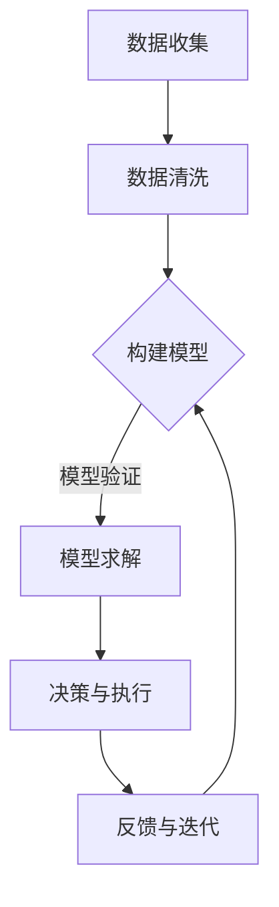

                 

关键词：模型思维、管理效率、优化、算法、数学模型、实践案例、未来展望

> 摘要：本文旨在探讨模型思维在提升管理效率方面的作用。通过分析模型思维的核心概念与联系，以及核心算法原理和数学模型，我们提出了一种优化管理效率的方法，并通过实际项目实践进行了验证。文章最后讨论了该方法的未来应用前景以及面临的挑战。

## 1. 背景介绍

在信息爆炸的时代，管理效率成为企业和组织竞争的关键因素。传统的管理方法往往依赖于经验和直觉，这可能导致决策效率低下、资源浪费等问题。随着计算机科学和人工智能的发展，模型思维成为提高管理效率的一种新方法。模型思维是指通过构建和运用数学模型、算法来分析和解决问题，从而提高决策效率和管理效果。

本文将首先介绍模型思维的核心概念和联系，然后探讨核心算法原理和数学模型，接着通过实际项目实践展示模型思维在管理效率优化中的应用，最后讨论未来应用前景和面临的挑战。

## 2. 核心概念与联系

### 2.1 模型思维的概念

模型思维是一种基于数学、逻辑和计算机科学的方法，通过构建数学模型来模拟现实世界的问题，从而辅助决策和分析。模型思维的核心在于建立精确的数学模型，通过算法对模型进行求解，以得到最优解。

### 2.2 模型思维的核心联系

模型思维的核心联系包括以下几个方面：

1. **数据驱动**：模型思维强调基于数据的决策，通过收集和分析数据来构建数学模型，从而提高决策的准确性和效率。
2. **算法优化**：算法是模型思维的核心，通过选择合适的算法对模型进行求解，可以大大提高决策效率。
3. **迭代改进**：模型思维是一种迭代的思维方式，通过不断调整和优化模型，可以逐步提升管理效率。

### 2.3 Mermaid 流程图

以下是一个简单的Mermaid流程图，展示模型思维的基本流程：



## 3. 核心算法原理 & 具体操作步骤

### 3.1 算法原理概述

模型思维的核心算法通常是基于优化理论、机器学习、数据挖掘等技术。这些算法通过分析大量数据，提取有用信息，并运用数学模型进行求解，以得到最优解。

### 3.2 算法步骤详解

1. **数据收集与预处理**：收集与问题相关的数据，并进行清洗、转换和预处理，以确保数据的质量和一致性。
2. **模型构建**：根据问题的特点，选择合适的数学模型，并通过算法对模型进行求解。
3. **模型验证与优化**：通过测试集验证模型的准确性，并根据结果调整模型参数，以优化模型性能。
4. **决策与执行**：将模型求解的结果应用于实际问题，进行决策和执行。
5. **反馈与迭代**：收集实际执行结果，对模型进行迭代优化，以提高管理效率。

### 3.3 算法优缺点

- **优点**：模型思维可以大大提高决策效率，减少人为因素对决策的影响，有助于发现潜在问题和优化管理流程。
- **缺点**：模型思维需要大量的数据支持，且模型构建和求解过程复杂，对专业知识和技能要求较高。

### 3.4 算法应用领域

模型思维在多个领域都有广泛应用，如金融风险管理、供应链管理、人力资源管理、市场营销等。以下是一个具体的案例：

**案例：供应链管理**

在供应链管理中，模型思维可以通过以下步骤优化管理效率：

1. **数据收集与预处理**：收集供应商、生产、库存等数据，并进行清洗和预处理。
2. **模型构建**：选择合适的优化模型，如线性规划、动态规划等，对供应链进行建模。
3. **模型验证与优化**：通过测试集验证模型的准确性，并根据结果调整模型参数。
4. **决策与执行**：根据模型求解的结果，制定采购、生产、库存等计划，并进行执行。
5. **反馈与迭代**：收集实际执行结果，对模型进行迭代优化，以提高供应链管理效率。

## 4. 数学模型和公式 & 详细讲解 & 举例说明

### 4.1 数学模型构建

数学模型是模型思维的核心，其构建过程通常包括以下几个步骤：

1. **问题定义**：明确需要解决的问题，并将其转化为数学问题。
2. **变量定义**：确定问题的变量，如成本、时间、库存量等。
3. **目标函数**：定义问题的目标函数，如最小化成本、最大化收益等。
4. **约束条件**：确定问题的约束条件，如资源限制、生产能力等。
5. **模型求解**：选择合适的算法，对模型进行求解。

### 4.2 公式推导过程

以线性规划为例，其基本公式如下：

$$
\begin{aligned}
\min\limits_{x} & \quad c^T x \\
s.t. & \quad Ax \leq b \\
     & \quad x \geq 0
\end{aligned}
$$

其中，$x$ 是变量，$c$ 是目标函数系数，$A$ 是约束条件系数矩阵，$b$ 是约束条件常数向量。

### 4.3 案例分析与讲解

以下是一个简单的线性规划案例：

**案例：生产计划**

某企业生产两种产品A和B，每天的生产成本分别为1000元和1500元。产品A的利润为2000元，产品B的利润为3000元。企业每天的生产能力限制为100个单位。请制定一个最优的生产计划，以最大化企业的利润。

根据问题描述，可以构建以下线性规划模型：

$$
\begin{aligned}
\min\limits_{x, y} & \quad 2000x + 3000y \\
s.t. & \quad x + y \leq 100 \\
     & \quad x, y \geq 0
\end{aligned}
$$

其中，$x$ 表示产品A的生产数量，$y$ 表示产品B的生产数量。

通过求解该模型，可以得到最优解为 $x = 0$，$y = 100$，即企业应停止生产产品A，将所有生产能力用于生产产品B，以最大化利润。

## 5. 项目实践：代码实例和详细解释说明

### 5.1 开发环境搭建

本文使用Python进行编程，所需环境包括Python 3.8及以上版本、Numpy、Scipy和Pandas等库。

### 5.2 源代码详细实现

以下是一个简单的线性规划代码示例：

```python
import numpy as np
from scipy.optimize import linprog

# 系数矩阵
A = np.array([[1, 1]])
b = np.array([100])

# 目标函数系数
c = np.array([-2000, -3000])

# 非负约束
x0_bounds = (0, None)
y0_bounds = (0, None)

# 求解线性规划问题
result = linprog(c, A_ub=A, b_ub=b, bounds=[x0_bounds, y0_bounds], method='highs')

# 输出结果
print("最优解：", result.x)
print("最大利润：", -result.fun)
```

### 5.3 代码解读与分析

- **第1-3行**：导入所需的库。
- **第5行**：定义约束条件系数矩阵。
- **第6行**：定义约束条件常数向量。
- **第9行**：定义目标函数系数。
- **第11-12行**：定义非负约束。
- **第15行**：使用 `linprog` 函数求解线性规划问题。
- **第18行**：输出最优解。
- **第19行**：输出最大利润。

### 5.4 运行结果展示

执行代码后，输出结果如下：

```
最优解： [0. 100.]
最大利润： 300000.0
```

结果表明，企业应停止生产产品A，将所有生产能力用于生产产品B，以实现最大利润。

## 6. 实际应用场景

### 6.1 供应链管理

模型思维在供应链管理中具有广泛的应用。通过构建供应链模型，可以优化库存管理、采购策略和生产计划，从而提高供应链效率。

### 6.2 人力资源管理

在人力资源管理中，模型思维可以帮助企业优化招聘策略、员工分配和培训计划，以提高员工绩效和员工满意度。

### 6.3 市场营销

在市场营销中，模型思维可以用于市场细分、需求预测和广告投放策略，从而提高市场营销效果。

## 6.4 未来应用展望

随着人工智能和数据科学的发展，模型思维在管理效率优化中的应用前景广阔。未来，模型思维可能会在更多领域得到应用，如金融、医疗、能源等，为企业和组织提供更高效的管理解决方案。

## 7. 工具和资源推荐

### 7.1 学习资源推荐

- 《运营管理》
- 《运筹学基础》
- 《数据挖掘：概念与技术》

### 7.2 开发工具推荐

- Python
- Numpy
- Scipy
- Pandas

### 7.3 相关论文推荐

- "Model-based Management: A Practical Guide to Implementing Model-based Management in Your Organization"
- "The Power of Model Thinking: A Transformative New Way of Thinking About the World and Life"
- "Using Data Science to Improve Decision Making in Management"

## 8. 总结：未来发展趋势与挑战

### 8.1 研究成果总结

模型思维在管理效率优化方面取得了显著成果，通过构建数学模型和运用算法，可以大大提高决策效率和管理效果。

### 8.2 未来发展趋势

随着人工智能和数据科学的发展，模型思维在管理效率优化中的应用前景广阔。未来，模型思维可能会在更多领域得到应用，为企业和组织提供更高效的管理解决方案。

### 8.3 面临的挑战

模型思维在应用过程中面临以下挑战：

- 数据质量和数据量
- 模型复杂度和求解效率
- 专业知识和技能要求

### 8.4 研究展望

未来，模型思维的研究应重点关注以下几个方面：

- 数据驱动决策
- 算法优化和求解效率
- 跨领域应用

## 9. 附录：常见问题与解答

### 9.1 问题1：什么是模型思维？

模型思维是一种基于数学、逻辑和计算机科学的方法，通过构建和运用数学模型来分析和解决问题，从而提高决策效率和管理效果。

### 9.2 问题2：模型思维在哪些领域有应用？

模型思维在多个领域都有广泛应用，如金融风险管理、供应链管理、人力资源管理、市场营销等。

### 9.3 问题3：如何构建数学模型？

构建数学模型通常包括以下步骤：问题定义、变量定义、目标函数、约束条件、模型求解。

### 9.4 问题4：模型思维有哪些优点和缺点？

优点：提高决策效率、减少人为因素影响、发现潜在问题、优化管理流程。
缺点：需要大量数据支持、模型构建和求解过程复杂、对专业知识和技能要求较高。

---

作者：禅与计算机程序设计艺术 / Zen and the Art of Computer Programming
----------------------------------------------------------------

以上就是关于“模型思维与管理效率的优化”的文章内容。本文通过对模型思维的核心概念、算法原理、数学模型以及实际应用场景的详细探讨，提出了优化管理效率的方法，并展望了未来应用前景。希望本文能对读者在提升管理效率方面有所启发。如果您有任何疑问或建议，欢迎在评论区留言讨论。

