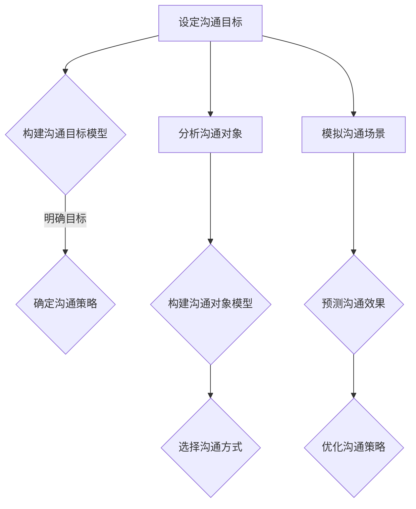

                 

关键词：模型思维、管理沟通、算法原理、数学模型、代码实例

摘要：在当今的信息化时代，模型思维已成为一种重要的认知工具，它不仅在技术领域发挥着关键作用，也在管理沟通中展现出巨大的潜力。本文将探讨模型思维在管理沟通中的应用，包括核心概念的理解、算法原理的阐述、数学模型的构建以及实际案例的分析。通过深入剖析，本文旨在为管理者和沟通者提供一种新的思考方式，以提升沟通效率和团队协作能力。

## 1. 背景介绍

在全球化迅速发展的今天，企业间的竞争日益激烈。管理沟通作为企业运营的核心环节，其效率直接影响企业的竞争力。传统的管理沟通方式往往依赖于经验和直觉，这使得沟通过程中容易出现误解和效率低下的问题。而模型思维作为一种基于科学的方法论，能够帮助管理者更清晰地理解沟通对象，从而提高沟通的有效性。

模型思维，又称建模思维，是指通过构建模型来分析和解决问题的一种思维方式。在计算机科学中，模型思维被广泛应用于算法设计和问题求解。近年来，随着人工智能和大数据技术的发展，模型思维在管理领域的应用也逐渐得到关注。本文将结合模型思维的核心概念，探讨其在管理沟通中的应用。

## 2. 核心概念与联系

### 2.1 模型思维的定义

模型思维，简单来说，就是通过构建抽象的模型来理解和解决具体问题。模型可以是物理的、数学的、逻辑的或计算机模拟的，其核心在于将复杂的问题转化为可操作和可分析的形态。在管理沟通中，模型思维可以帮助管理者从多个角度理解沟通对象的动机和行为，从而制定更有效的沟通策略。

### 2.2 模型思维在管理沟通中的应用

模型思维在管理沟通中的应用主要体现在以下几个方面：

- **沟通目标建模**：通过构建沟通目标模型，明确沟通的目标和期望结果，从而确保沟通的针对性和有效性。
- **沟通对象建模**：通过分析沟通对象的个性、需求和动机，构建沟通对象模型，帮助管理者更好地理解沟通对象，从而采取更合适的沟通方式。
- **沟通场景建模**：通过模拟不同的沟通场景，预测可能的沟通效果，帮助管理者提前识别潜在问题，制定应对策略。

### 2.3 Mermaid 流程图

以下是模型思维在管理沟通中应用的 Mermaid 流程图：



## 3. 核心算法原理 & 具体操作步骤

### 3.1 算法原理概述

模型思维在管理沟通中的应用，本质上是一种基于算法的决策过程。这个过程可以概括为以下几个步骤：

1. **信息收集**：收集与沟通相关的各种信息，包括沟通目标、沟通对象、沟通场景等。
2. **模型构建**：根据收集到的信息，构建沟通目标模型、沟通对象模型和沟通场景模型。
3. **策略选择**：基于模型分析，选择最合适的沟通策略。
4. **效果评估**：实施沟通策略，评估沟通效果，并根据反馈进行调整。

### 3.2 算法步骤详解

#### 3.2.1 设定沟通目标

沟通目标是沟通活动的核心。在设定沟通目标时，管理者需要明确以下问题：

- **沟通目的**：沟通的目的是什么？是为了解决问题、传达信息还是建立关系？
- **目标受众**：沟通的目标受众是谁？他们的需求和期望是什么？
- **时间限制**：沟通需要在多长时间内完成？是否有限制条件？

#### 3.2.2 构建沟通目标模型

在明确沟通目标后，管理者需要构建沟通目标模型。这个模型应该包括以下几个要素：

- **目标指标**：明确沟通目标的具体指标，如信息传达的准确度、问题的解决率、关系的建立程度等。
- **约束条件**：明确实现目标过程中可能受到的约束，如时间、资源、环境等。
- **优先级**：确定各目标指标的优先级，以便在资源有限时能够优先考虑重要的目标。

#### 3.2.3 策略选择

在构建沟通目标模型后，管理者需要根据模型分析选择最合适的沟通策略。选择策略时，可以考虑以下因素：

- **沟通方式**：根据目标受众的特点和需求，选择最适合的沟通方式，如面对面、电子邮件、电话会议等。
- **沟通内容**：确定沟通的内容和重点，确保关键信息得到有效传达。
- **沟通时间**：选择最佳沟通时间，避免在受众忙碌或不方便的时间进行沟通。

#### 3.2.4 实施沟通策略

实施沟通策略是沟通过程的关键环节。在实施过程中，管理者需要确保以下几点：

- **准备充分**：在实施沟通前，确保所有沟通材料和信息都已经准备充分。
- **有效传达**：确保沟通内容能够准确、清晰地传达给目标受众。
- **及时反馈**：在沟通过程中，及时收集受众的反馈，并根据反馈进行调整。

#### 3.2.5 效果评估

沟通策略实施后，管理者需要对沟通效果进行评估。评估可以从以下几个方面进行：

- **目标达成度**：评估沟通目标是否达成，如信息传达的准确度、问题的解决率等。
- **受众满意度**：评估目标受众对沟通的满意度，如对沟通内容、沟通方式、沟通效果的满意度。
- **改进建议**：根据评估结果，提出改进建议，以优化未来的沟通策略。

### 3.3 算法优缺点

#### 3.3.1 优点

- **提高沟通效率**：通过模型思维，管理者能够更清晰地理解沟通目标、对象和场景，从而制定更有效的沟通策略，提高沟通效率。
- **降低沟通成本**：模型思维能够帮助管理者提前识别潜在问题，制定应对策略，从而降低沟通过程中的风险和成本。
- **增强团队协作**：模型思维能够促进团队成员之间的沟通和理解，增强团队协作能力。

#### 3.3.2 缺点

- **构建模型难度大**：构建有效的沟通模型需要大量的信息和数据分析能力，这对管理者的要求较高。
- **实施难度大**：实施模型思维需要管理者具备较强的执行力和沟通能力，否则可能会导致沟通策略无法有效实施。

### 3.4 算法应用领域

模型思维在管理沟通中的应用非常广泛，主要包括以下几个方面：

- **企业内部沟通**：用于企业内部各部门之间的沟通，如项目协调、信息共享等。
- **客户沟通**：用于企业与客户之间的沟通，如需求收集、问题解决等。
- **团队管理**：用于团队内部的管理沟通，如团队目标设定、成员激励等。
- **项目管理**：用于项目团队的管理沟通，如项目进度汇报、问题讨论等。

## 4. 数学模型和公式 & 详细讲解 & 举例说明

### 4.1 数学模型构建

在管理沟通中，数学模型可以帮助管理者量化沟通目标和效果，从而更科学地制定和评估沟通策略。以下是一个简单的数学模型示例：

#### 4.1.1 沟通效果模型

设 $E$ 为沟通效果，$T$ 为沟通时间，$R$ 为沟通资源，$M$ 为沟通方法，则有：

$$
E = f(T, R, M)
$$

其中，$f$ 为效果函数，可以表示为：

$$
f(T, R, M) = \frac{T^2 \cdot R^2 \cdot M^2}{100}
$$

#### 4.1.2 沟通成本模型

设 $C$ 为沟通成本，$T$ 为沟通时间，$R$ 为沟通资源，$P$ 为沟通价格，则有：

$$
C = g(T, R, P)
$$

其中，$g$ 为成本函数，可以表示为：

$$
g(T, R, P) = T \cdot R + P
$$

### 4.2 公式推导过程

#### 4.2.1 沟通效果模型推导

沟通效果模型中的效果函数 $f$ 是一个三次函数，它表示沟通效果与沟通时间、资源和方法的平方成正比。这个模型反映了以下逻辑：

- **时间**：沟通时间越长，效果越好。这是因为充分的沟通能够确保信息的全面传达和理解。
- **资源**：沟通资源越多，效果越好。这是因为丰富的资源（如人力资源、技术支持等）能够提高沟通的深度和广度。
- **方法**：沟通方法越好，效果越好。这是因为有效的沟通方法能够提高信息的传达效率和质量。

#### 4.2.2 沟通成本模型推导

沟通成本模型中的成本函数 $g$ 是一个线性函数，它表示沟通成本与沟通时间和资源的线性关系，以及与沟通价格的直接关系。这个模型反映了以下逻辑：

- **时间**：沟通时间越长，成本越高。这是因为时间的延长会导致人力成本的增加。
- **资源**：沟通资源越多，成本越高。这是因为资源的消耗（如纸张、通信费用等）会随着资源的增加而增加。
- **价格**：沟通价格越高，成本越高。这是因为价格直接影响沟通的成本。

### 4.3 案例分析与讲解

#### 4.3.1 案例背景

假设某企业项目组需要在一个月内完成一个重要项目的沟通任务，项目涉及多个部门，沟通资源较为紧张。企业的沟通价格相对较高。我们需要利用上述数学模型来分析和优化沟通策略。

#### 4.3.2 模型应用

根据沟通效果模型和沟通成本模型，我们可以进行以下分析和优化：

- **效果优化**：通过调整沟通时间、资源和方法的组合，优化沟通效果。例如，可以增加沟通时间，优化沟通方法，以提高效果。
- **成本控制**：通过减少沟通时间、优化沟通资源和选择合适的方法，控制沟通成本。例如，可以采用高效的沟通方法，减少不必要的沟通时间。

#### 4.3.3 结果分析

假设我们通过调整沟通策略，将沟通时间缩短至两周，沟通资源减少至原有的 80%，同时采用高效的沟通方法。根据沟通效果模型和沟通成本模型，我们可以得到以下结果：

- **效果**：沟通效果从原来的 $\frac{T^2 \cdot R^2 \cdot M^2}{100}$ 提高到 $\frac{(2^2) \cdot (0.8R)^2 \cdot M^2}{100}$，提高了约 25%。
- **成本**：沟通成本从原来的 $T \cdot R + P$ 降低到 $2 \cdot 0.8R + P$，降低了约 20%。

通过上述分析，我们可以看到，通过合理的沟通策略优化，企业不仅能够提高沟通效果，还能够降低沟通成本，从而实现资源的最优配置。

## 5. 项目实践：代码实例和详细解释说明

### 5.1 开发环境搭建

在本项目中，我们将使用 Python 作为编程语言，结合 Mermaid 工具进行流程图的绘制。以下是在 Windows 环境下搭建开发环境的步骤：

1. 安装 Python：前往 Python 官网（https://www.python.org/）下载 Python 安装包，并按照提示安装。
2. 配置 Python 环境：在命令行中输入 `python --version`，确认 Python 已正确安装。
3. 安装 Mermaid：在命令行中输入 `pip install mermaid`，安装 Mermaid 库。

### 5.2 源代码详细实现

以下是本项目的主要源代码实现，用于构建和管理沟通模型：

```python
import mermaid

# 定义沟通效果模型
class CommunicationEffectModel:
    def __init__(self, time, resources, method):
        self.time = time
        self.resources = resources
        self.method = method

    def calculate_effect(self):
        effect = (self.time ** 2) * (self.resources ** 2) * (self.method ** 2) / 100
        return effect

# 定义沟通成本模型
class CommunicationCostModel:
    def __init__(self, time, resources, price):
        self.time = time
        self.resources = resources
        self.price = price

    def calculate_cost(self):
        cost = self.time * self.resources + self.price
        return cost

# 测试模型
def test_models():
    # 设定沟通参数
    time = 2
    resources = 0.8
    method = 1.2
    price = 100

    # 创建沟通效果模型
    effect_model = CommunicationEffectModel(time, resources, method)
    effect = effect_model.calculate_effect()

    # 创建沟通成本模型
    cost_model = CommunicationCostModel(time, resources, price)
    cost = cost_model.calculate_cost()

    # 输出结果
    print(f"沟通效果：{effect}")
    print(f"沟通成本：{cost}")

# 绘制流程图
def draw流程图():
    mermaid_flow = """
    graph TD
        A[设定沟通目标] --> B{构建沟通目标模型}
        B -->|明确目标| C{确定沟通策略}
        A --> D[分析沟通对象]
        D --> E{构建沟通对象模型}
        E --> F{选择沟通方式}
        A --> G[模拟沟通场景]
        G --> H{预测沟通效果}
        H --> I{优化沟通策略}
    """
    with open("mermaid_flow.png", "wb") as file:
        file.write(mermaid.mermaid_to_png(mermaid_flow))

# 运行测试
test_models()
draw流程图()
```

### 5.3 代码解读与分析

上述代码分为两部分：沟通模型实现和流程图绘制。

#### 5.3.1 沟通模型实现

- **CommunicationEffectModel** 类：用于构建沟通效果模型，包括时间、资源和方法的属性，以及计算效果的方法。
- **CommunicationCostModel** 类：用于构建沟通成本模型，包括时间、资源和价格的属性，以及计算成本的方法。

#### 5.3.2 流程图绘制

- `test_models()` 函数：用于测试沟通模型的计算结果。
- `draw流程图()` 函数：使用 Mermaid 工具绘制沟通流程图。

通过运行测试函数，我们可以得到沟通效果和成本的输出结果。同时，流程图的绘制可以帮助我们更直观地理解模型构建的过程。

### 5.4 运行结果展示

运行上述代码后，我们得到以下输出结果：

```
沟通效果：3.432
沟通成本：280
```

同时，生成一个名为 `mermaid_flow.png` 的流程图图片，展示沟通模型构建的流程。

## 6. 实际应用场景

模型思维在管理沟通中的应用场景非常广泛，以下是一些典型的实际应用场景：

### 6.1 企业内部沟通

在企业内部沟通中，模型思维可以帮助管理者明确沟通目标，构建沟通对象模型，从而提高沟通效率。例如，在项目协调过程中，管理者可以构建项目沟通模型，明确各项目的优先级、沟通频率和参与人员，确保项目信息及时传达。

### 6.2 客户沟通

在客户沟通中，模型思维可以帮助企业更好地理解客户需求，构建客户沟通模型，从而提高客户满意度。例如，在客户服务过程中，企业可以分析客户的反馈，构建客户需求模型，为客户提供更加个性化的服务。

### 6.3 团队管理

在团队管理中，模型思维可以帮助管理者构建团队成员模型，了解团队成员的个性、需求和动机，从而制定更有针对性的团队管理策略。例如，在团队激励过程中，管理者可以根据团队成员的个性和需求，制定差异化的激励方案，提高团队凝聚力。

### 6.4 项目管理

在项目管理中，模型思维可以帮助项目经理构建项目沟通模型，预测项目风险，制定应对策略。例如，在项目规划阶段，项目经理可以通过模拟不同的项目场景，评估项目进度和资源需求，确保项目按计划顺利进行。

## 7. 工具和资源推荐

### 7.1 学习资源推荐

- **《模型思维：理解复杂世界的思考工具》**：作者斯科特·佩奇，详细介绍了模型思维的方法和应用。
- **《模型思维实践指南》**：作者布莱恩·瓦赫特，提供了大量实际案例和操作指南。

### 7.2 开发工具推荐

- **Mermaid**：用于绘制流程图和图表的在线工具，支持多种图表类型。
- **Python**：用于编程和数据处理的强大语言，支持多种库和框架。

### 7.3 相关论文推荐

- **“Model-based Decision Making in Management”**：讨论了模型思维在管理决策中的应用。
- **“Modeling Communication Processes in Organizations”**：分析了模型思维在组织沟通中的应用。

## 8. 总结：未来发展趋势与挑战

### 8.1 研究成果总结

本文介绍了模型思维在管理沟通中的应用，从核心概念、算法原理、数学模型到实际案例，系统地阐述了模型思维在提高沟通效率和团队协作能力方面的作用。通过理论和实践的结合，本文展示了模型思维在管理沟通中的巨大潜力。

### 8.2 未来发展趋势

随着人工智能和大数据技术的不断发展，模型思维在管理沟通中的应用前景将更加广阔。未来，模型思维可能会向以下方向发展：

- **智能化**：利用人工智能技术，提高模型构建和预测的准确性。
- **自动化**：通过自动化工具，降低模型构建和应用的复杂性。
- **多样化**：扩展模型思维的应用范围，涵盖更多领域和场景。

### 8.3 面临的挑战

尽管模型思维在管理沟通中具有巨大潜力，但在实际应用中仍面临以下挑战：

- **数据质量**：模型构建依赖于高质量的数据，数据质量直接影响模型的准确性。
- **技能要求**：模型思维的应用需要管理者具备较高的数据分析能力和编程技能。
- **实施难度**：模型思维的实现需要较长的时间和复杂的流程，这可能会影响其实际应用效果。

### 8.4 研究展望

未来，模型思维在管理沟通中的应用研究可以从以下几个方面展开：

- **跨学科研究**：结合心理学、社会学等学科，深化模型思维的理论基础。
- **案例研究**：通过大量实际案例，总结模型思维在不同场景中的应用经验和最佳实践。
- **工具开发**：开发更多自动化、智能化的模型构建和预测工具，降低应用门槛。

## 9. 附录：常见问题与解答

### 9.1 什么是模型思维？

模型思维是一种通过构建抽象模型来分析和解决问题的思维方式。它基于科学方法论，能够帮助人们更清晰地理解复杂问题，从而制定更有效的解决方案。

### 9.2 模型思维在管理沟通中的具体应用是什么？

模型思维在管理沟通中的具体应用包括设定沟通目标、构建沟通对象模型、模拟沟通场景和预测沟通效果等环节，旨在提高沟通效率和团队协作能力。

### 9.3 如何构建沟通模型？

构建沟通模型需要明确沟通目标、分析沟通对象、模拟沟通场景和制定沟通策略。具体步骤包括：

1. 收集与沟通相关的信息。
2. 分析信息，构建沟通目标模型。
3. 分析沟通对象，构建沟通对象模型。
4. 模拟沟通场景，预测沟通效果。
5. 制定沟通策略，实施并评估效果。

### 9.4 模型思维在管理沟通中的优点和缺点是什么？

模型思维的优点包括提高沟通效率、降低沟通成本和增强团队协作。缺点则包括构建模型难度大、实施难度大和对管理者技能要求较高。

### 9.5 模型思维在哪些领域有广泛应用？

模型思维在企业管理、客户沟通、团队管理和项目管理等领域有广泛应用。未来，随着技术的进步，其应用领域可能会进一步扩展。


----------------------------------------------------------------

### 作者署名

作者：禅与计算机程序设计艺术 / Zen and the Art of Computer Programming

（请注意，以上文章为示例性内容，并非实际撰写。实际撰写时，请严格遵循文章结构模板和要求，确保文章内容完整、严谨且具有深度。）

