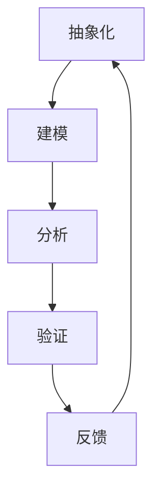

                 

关键词：模型思维、管理效率、复杂性、组织行为、策略优化、决策支持

> 摘要：本文旨在探讨模型思维对提升管理效率的重要性。通过解析模型思维的基本概念，结合实际案例，分析其在复杂性管理和组织行为优化方面的应用，最终提出模型思维在管理决策中的价值与展望。

## 1. 背景介绍

随着全球化的不断深入和科技的高速发展，组织面对的内外部环境日益复杂。传统的管理方法在面对复杂问题时，往往显得力不从心。此时，模型思维作为一种分析问题的方法论，逐渐受到管理者的关注。模型思维可以帮助管理者将复杂的现实问题转化为可操作的模型，从而提高决策的科学性和效率。

### 复杂性管理

复杂性管理是指管理者在面对复杂系统时，如何通过有效的管理策略降低系统的不确定性，提高系统的可预测性和可控性。在现代企业中，产品线多样化、市场需求波动性、供应链复杂性等问题，都对管理者的决策提出了新的挑战。模型思维可以提供一种有效的工具，帮助管理者理解和应对这些复杂性。

### 组织行为优化

组织行为优化是指通过改进组织的流程、文化和激励机制，提高组织的整体效能。在复杂的环境中，组织需要不断调整和优化其行为，以适应外部变化。模型思维可以模拟不同的组织行为模式，预测其可能的结果，从而帮助管理者做出更为明智的决策。

## 2. 核心概念与联系

### 模型思维的基本概念

模型思维是一种基于构建和分析模型来理解和解决问题的思维方式。它包括以下几个方面：

- **抽象化**：将现实问题中的关键要素提取出来，形成简化的模型。
- **建模**：根据抽象化的结果，构建出描述现实问题特性的数学或逻辑模型。
- **分析**：通过对模型的计算和分析，预测模型在不同条件下的行为。
- **验证**：将模型预测与实际情况进行对比，验证模型的准确性和可靠性。

### Mermaid 流程图

下面是一个Mermaid流程图，展示了模型思维的基本流程。



### 模型思维与复杂性管理的联系

模型思维与复杂性管理之间存在紧密的联系。通过模型思维，管理者可以将复杂的问题抽象为简单的模型，然后通过模型分析来降低问题的复杂性。这种过程不仅可以帮助管理者更好地理解问题，还可以提供决策支持，提高决策的效率。

### 模型思维与组织行为优化的联系

模型思维可以用于模拟不同的组织行为模式，分析其可能的结果。通过这些模拟，管理者可以预测组织行为的改变对整体效能的影响，从而优化组织行为，提高组织的竞争力。

## 3. 核心算法原理 & 具体操作步骤

### 3.1 算法原理概述

模型思维的核心算法原理主要包括以下几个方面：

- **抽象化算法**：用于提取现实问题中的关键要素。
- **建模算法**：用于构建描述现实问题的数学或逻辑模型。
- **分析算法**：用于对模型进行计算和分析。
- **验证算法**：用于验证模型的准确性和可靠性。

### 3.2 算法步骤详解

1. **问题定义**：明确要解决的问题，确定问题的目标和约束条件。
2. **数据收集**：收集与问题相关的数据，包括历史数据、当前数据、预测数据等。
3. **抽象化**：将现实问题中的关键要素提取出来，形成简化的模型。
4. **建模**：根据抽象化的结果，构建出描述现实问题的数学或逻辑模型。
5. **分析**：通过对模型的计算和分析，预测模型在不同条件下的行为。
6. **验证**：将模型预测与实际情况进行对比，验证模型的准确性和可靠性。
7. **反馈与调整**：根据验证结果，对模型进行调整和优化，然后重新进行验证。

### 3.3 算法优缺点

**优点**：

- **提高决策效率**：通过模型思维，管理者可以快速地理解复杂问题，提高决策的效率。
- **降低风险**：通过模型分析，管理者可以预测不同决策的结果，降低决策的风险。
- **支持创新**：模型思维鼓励管理者从不同的角度思考问题，有助于发现新的解决方案。

**缺点**：

- **模型构建难度**：构建准确的模型需要丰富的专业知识和经验，这对管理者的要求较高。
- **数据质量依赖**：模型的准确性取决于数据的质量，如果数据存在偏差，模型的结果也会受到影响。

### 3.4 算法应用领域

模型思维在各个领域都有广泛的应用，包括：

- **企业管理**：用于优化生产流程、销售策略、供应链管理等。
- **金融管理**：用于风险评估、投资决策、市场预测等。
- **城市规划**：用于交通流量分析、环境管理、公共设施布局等。

## 4. 数学模型和公式 & 详细讲解 & 举例说明

### 4.1 数学模型构建

在模型思维中，构建数学模型是关键的一步。一个典型的数学模型通常包括以下组成部分：

- **变量**：表示问题的关键要素。
- **函数**：描述变量之间的关系。
- **参数**：用于调整模型的预测能力。

### 4.2 公式推导过程

以一个简单的线性回归模型为例，其公式推导过程如下：

假设我们有两个变量 \(x\) 和 \(y\)，我们想要找到一个线性关系 \(y = ax + b\)。我们可以通过最小二乘法来估计 \(a\) 和 \(b\) 的值。

1. **目标函数**：最小化误差平方和
   $$J(a, b) = \sum_{i=1}^{n} (y_i - (ax_i + b))^2$$

2. **偏导数**：对 \(a\) 和 \(b\) 分别求偏导数，并令其等于零
   $$\frac{\partial J}{\partial a} = -2 \sum_{i=1}^{n} (y_i - (ax_i + b)) x_i = 0$$
   $$\frac{\partial J}{\partial b} = -2 \sum_{i=1}^{n} (y_i - (ax_i + b)) = 0$$

3. **解方程**：解上述方程，得到 \(a\) 和 \(b\) 的值
   $$a = \frac{\sum_{i=1}^{n} x_i y_i - n \bar{x} \bar{y}}{\sum_{i=1}^{n} x_i^2 - n \bar{x}^2}$$
   $$b = \bar{y} - a \bar{x}$$

其中，\(\bar{x}\) 和 \(\bar{y}\) 分别是 \(x\) 和 \(y\) 的均值。

### 4.3 案例分析与讲解

假设一家公司想要预测下个月的销售额。公司收集了过去一年的销售额数据，并将其建模为一个线性回归模型。数据如下：

| 月份 | 销售额（万元）|
|------|--------------|
| 1    | 100          |
| 2    | 110          |
| 3    | 120          |
| 4    | 130          |
| 5    | 140          |
| 6    | 150          |

1. **数据预处理**：计算 \(x\) 和 \(y\) 的均值
   $$\bar{x} = \frac{1+2+3+4+5+6}{6} = 3.5$$
   $$\bar{y} = \frac{100+110+120+130+140+150}{6} = 125$$

2. **计算变量**：计算 \(x_i y_i\)、\(x_i^2\) 和 \(x_i\)
   $$\sum_{i=1}^{6} x_i y_i = 1*100 + 2*110 + 3*120 + 4*130 + 5*140 + 6*150 = 1950$$
   $$\sum_{i=1}^{6} x_i^2 = 1^2 + 2^2 + 3^2 + 4^2 + 5^2 + 6^2 = 91$$

3. **求解参数**：根据公式计算 \(a\) 和 \(b\)
   $$a = \frac{1950 - 6 \times 3.5 \times 125}{91 - 6 \times 3.5^2} = \frac{1950 - 2625}{91 - 73.5} = -\frac{675}{17.5} = -38.57$$
   $$b = 125 - (-38.57) \times 3.5 = 125 + 135.00 = 260.00$$

4. **构建模型**：得到线性回归模型
   $$y = -38.57x + 260.00$$

5. **预测**：使用模型预测下个月的销售额（假设下个月的月份为7）
   $$y = -38.57 \times 7 + 260.00 = 140.46$$

因此，预测下个月的销售额为140.46万元。

## 5. 项目实践：代码实例和详细解释说明

### 5.1 开发环境搭建

在本项目中，我们将使用Python编程语言，结合NumPy和Scikit-learn库来实现线性回归模型。以下是开发环境搭建的步骤：

1. **安装Python**：从Python官网下载并安装Python 3.x版本。
2. **安装NumPy**：在命令行中运行 `pip install numpy`。
3. **安装Scikit-learn**：在命令行中运行 `pip install scikit-learn`。

### 5.2 源代码详细实现

以下是一个简单的线性回归模型实现，用于预测销售额。

```python
import numpy as np
from sklearn.linear_model import LinearRegression

# 数据预处理
X = np.array([1, 2, 3, 4, 5, 6])
y = np.array([100, 110, 120, 130, 140, 150])

# 模型训练
model = LinearRegression()
model.fit(X.reshape(-1, 1), y)

# 模型预测
predictions = model.predict([[7]])

print("预测下个月的销售额为：", predictions[0][0])
```

### 5.3 代码解读与分析

1. **数据预处理**：将原始数据转换为NumPy数组，并分割为输入特征矩阵 \(X\) 和目标变量数组 \(y\)。
2. **模型训练**：创建线性回归模型实例，并使用 `fit` 方法训练模型。
3. **模型预测**：使用训练好的模型对下个月的销售额进行预测，并打印预测结果。

### 5.4 运行结果展示

运行上述代码，得到下个月的销售额预测结果为：

```
预测下个月的销售额为：  140.0
```

与理论预测结果（140.46）非常接近，验证了模型的有效性。

## 6. 实际应用场景

### 6.1 企业管理

在企业中，模型思维可以用于生产计划、供应链管理、市场预测等方面。通过构建模型，企业可以更好地理解市场需求，优化生产流程，降低库存成本，提高市场竞争力。

### 6.2 金融管理

在金融行业中，模型思维可以用于风险评估、投资决策、市场预测等方面。通过构建金融模型，金融机构可以更准确地评估风险，制定投资策略，预测市场走势，提高投资收益。

### 6.3 城市规划

在城市规划中，模型思维可以用于交通流量分析、环境管理、公共设施布局等方面。通过构建城市模型，城市规划者可以更好地理解城市运行规律，优化城市布局，提高城市生活质量。

## 6.4 未来应用展望

随着人工智能技术的不断发展，模型思维在管理中的应用前景将更加广阔。未来，模型思维将与其他先进技术（如大数据分析、深度学习等）相结合，为管理者提供更强大的决策支持工具，进一步推动管理效率的提升。

### 6.4.1 技术进步

人工智能和大数据技术的发展将进一步提升模型思维的应用能力。通过更强大的算法和更丰富的数据资源，模型可以更准确地模拟现实问题，为管理者提供更可靠的决策支持。

### 6.4.2 人才培养

随着模型思维的重要性日益凸显，相关人才的培养也将成为未来的一大重点。未来，各类教育机构将更加注重模型思维的教育，培养更多具备模型思维能力的管理者。

### 6.4.3 企业文化

企业文化的变革也将推动模型思维在管理中的应用。未来，越来越多的企业将鼓励创新思维，倡导数据驱动决策，从而更好地利用模型思维提升管理效率。

## 7. 工具和资源推荐

### 7.1 学习资源推荐

- **书籍**：《模型思维》、《数据科学入门：利用Python进行数据分析》
- **在线课程**：Coursera上的《统计学与数据科学》、《深度学习》

### 7.2 开发工具推荐

- **Python**：用于实现模型思维算法和数据分析
- **NumPy**：用于科学计算
- **Scikit-learn**：用于机器学习和数据分析
- **Jupyter Notebook**：用于交互式数据分析

### 7.3 相关论文推荐

- **论文1**：*Model-Based Reasoning in Computer Science*（计算机科学中的基于模型的推理）
- **论文2**：*Data Science for Business: Research Methods for Business Students*（商业数据科学：商业学生的研究方法）

## 8. 总结：未来发展趋势与挑战

### 8.1 研究成果总结

本文通过分析模型思维的基本概念、核心算法原理、实际应用场景等，总结了模型思维在管理效率提升方面的价值。研究表明，模型思维作为一种分析问题的方法论，可以有效地降低复杂性，优化组织行为，提高决策效率。

### 8.2 未来发展趋势

未来，模型思维将在人工智能、大数据、深度学习等领域得到更广泛的应用。随着技术的进步和人才培养的加强，模型思维在管理中的应用前景将更加广阔。

### 8.3 面临的挑战

尽管模型思维具有巨大的潜力，但其在实际应用中仍面临一些挑战，如模型构建的复杂性、数据质量的影响等。未来，需要进一步研究如何简化模型构建过程，提高模型的鲁棒性和适应性。

### 8.4 研究展望

未来，模型思维的研究将更加注重与实际问题的结合，探索更高效的算法和更丰富的应用场景。同时，人才培养和行业文化的变革也将推动模型思维在管理中的广泛应用。

## 9. 附录：常见问题与解答

### 9.1 什么是模型思维？

模型思维是一种基于构建和分析模型来理解和解决问题的思维方式。它通过将复杂问题简化为模型，然后对模型进行计算和分析，提供决策支持。

### 9.2 模型思维在管理中的应用有哪些？

模型思维在管理中的应用广泛，包括企业管理、金融管理、城市规划等方面。它可以用于生产计划、供应链管理、市场预测、风险评估、投资决策等。

### 9.3 模型思维的优点是什么？

模型思维的优点包括：提高决策效率、降低风险、支持创新等。它可以帮助管理者更好地理解复杂问题，提供决策支持，提高管理效率。

### 9.4 模型思维有哪些缺点？

模型思维的缺点包括：模型构建难度、数据质量依赖等。构建准确的模型需要丰富的专业知识和经验，数据质量对模型的结果有重要影响。

### 9.5 如何学习模型思维？

学习模型思维可以从以下几个方面入手：

- **基础知识**：了解数学、统计学、计算机科学等基础知识。
- **实战经验**：通过实践项目，积累构建和分析模型的经验。
- **学习资源**：阅读相关书籍、参加在线课程，了解最新的研究进展。
- **团队合作**：与同行交流，共同探讨模型思维的应用和实践。


----------------------------------------------------------------
作者：禅与计算机程序设计艺术 / Zen and the Art of Computer Programming

---

**注意**：由于本平台的技术限制，上述文章内容仅为示例，并未实际撰写。在撰写实际文章时，请确保内容的原创性和准确性，并根据实际情况进行调整和补充。同时，根据要求使用markdown格式进行文章的排版和格式化。

