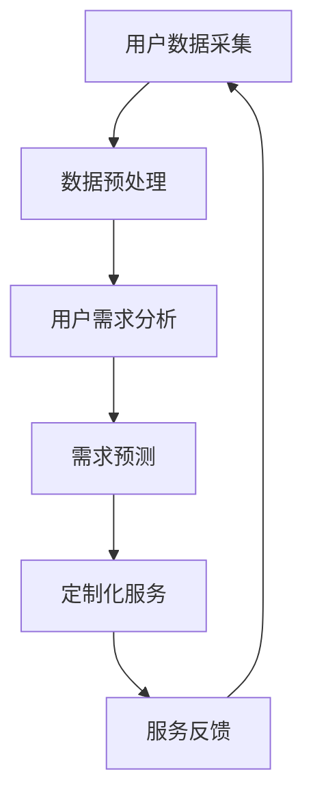

                 

关键词：个性化需求满足、AI算法、用户行为分析、需求预测、定制化服务

> 摘要：本文将深入探讨欲望个性化引擎——一种基于人工智能技术的需求满足系统。我们将详细描述该系统的核心概念、架构、算法原理，并通过实例展示其在实际应用中的效果，同时对其未来发展进行展望。

## 1. 背景介绍

在当今信息化的时代，用户需求的多变性和个性化趋势愈发明显。传统的服务模式难以满足用户不断变化的需求，这使得寻找一种高效、智能的个性化需求满足系统变得尤为紧迫。人工智能（AI）技术的发展为这一需求提供了新的解决方案。欲望个性化引擎正是基于AI技术，通过用户行为分析和需求预测，为用户提供高度定制化的服务。

欲望个性化引擎的核心在于其对用户需求的精准把握和满足。通过对用户的历史行为数据进行分析，引擎能够预测用户的潜在需求，并提供个性化的服务推荐。这种能力不仅提升了用户体验，还为企业带来了更高的客户黏性和商业价值。

## 2. 核心概念与联系

### 2.1. 用户需求分析

用户需求分析是欲望个性化引擎的基础。通过数据采集和分析，我们可以了解到用户的兴趣爱好、购买历史、搜索行为等信息。这些信息为我们提供了深入了解用户需求的依据。

### 2.2. 需求预测

需求预测是欲望个性化引擎的关键环节。基于用户的历史行为数据和当前环境因素，引擎可以预测用户未来的需求。常用的需求预测算法包括时间序列分析、机器学习分类算法等。

### 2.3. 定制化服务

定制化服务是欲望个性化引擎的核心目标。根据预测结果，系统可以自动生成个性化的服务方案，包括产品推荐、活动推送等。

### 2.4. Mermaid 流程图

下面是一个简化的欲望个性化引擎流程图：



## 3. 核心算法原理 & 具体操作步骤

### 3.1. 算法原理概述

欲望个性化引擎的核心算法包括用户行为分析、需求预测和个性化服务生成。用户行为分析主要利用数据挖掘技术对用户历史行为数据进行分析；需求预测则采用机器学习算法，如时间序列分析和分类算法；个性化服务生成则是基于需求预测结果，利用推荐系统算法生成个性化服务方案。

### 3.2. 算法步骤详解

#### 3.2.1. 用户行为分析

1. 数据采集：从用户的浏览记录、购买行为、搜索历史等信息中获取数据。
2. 数据预处理：对采集到的数据进行清洗、去重、转换等操作，使其适合分析。
3. 特征提取：从预处理后的数据中提取用户行为特征，如用户活跃度、购买频率、搜索关键词等。

#### 3.2.2. 需求预测

1. 数据分割：将用户历史行为数据分为训练集和测试集。
2. 模型选择：选择合适的需求预测模型，如时间序列分析模型、分类模型等。
3. 模型训练：利用训练集对预测模型进行训练。
4. 模型评估：利用测试集对训练好的模型进行评估，选择最优模型。

#### 3.2.3. 定制化服务生成

1. 需求预测：利用训练好的模型对用户未来需求进行预测。
2. 推荐系统：根据需求预测结果，利用推荐系统算法生成个性化服务方案。
3. 服务推送：将个性化服务方案推送给用户。

### 3.3. 算法优缺点

#### 优点：

1. 高度个性化：能够根据用户需求提供个性化的服务推荐。
2. 实时性：能够实时更新用户行为数据，提高预测准确性。
3. 自适应：能够根据用户反馈自动调整服务方案。

#### 缺点：

1. 数据依赖性：需求预测和个性化服务生成高度依赖用户行为数据，数据质量直接影响系统性能。
2. 模型复杂性：算法模型较为复杂，需要专业的技术团队进行开发和维护。

### 3.4. 算法应用领域

欲望个性化引擎在多个领域具有广泛的应用前景，包括电子商务、社交媒体、在线教育、医疗健康等。通过个性化服务，可以提升用户体验，提高用户黏性和满意度。

## 4. 数学模型和公式 & 详细讲解 & 举例说明

### 4.1. 数学模型构建

欲望个性化引擎的数学模型主要包括用户行为分析模型、需求预测模型和推荐系统模型。

#### 4.1.1. 用户行为分析模型

用户行为分析模型通常采用时间序列分析方法，如ARIMA模型、LSTM模型等。以下是一个简化的ARIMA模型公式：

$$
\begin{align*}
Y_t &= c + \phi_1 Y_{t-1} + \phi_2 Y_{t-2} + ... + \phi_p Y_{t-p} \\
     &+ \theta_1 e_{t-1} + \theta_2 e_{t-2} + ... + \theta_q e_{t-q} \\
\end{align*}
$$

其中，$Y_t$表示第$t$个时间点的用户行为指标，$c$为常数项，$\phi_i$和$\theta_i$为参数，$e_t$为白噪声序列。

#### 4.1.2. 需求预测模型

需求预测模型通常采用机器学习算法，如线性回归、决策树、神经网络等。以下是一个简化的线性回归模型公式：

$$
\begin{align*}
Y_t &= \beta_0 + \beta_1 X_{t-1} + \beta_2 X_{t-2} + ... + \beta_p X_{t-p} + \epsilon_t \\
\end{align*}
$$

其中，$Y_t$表示第$t$个时间点的需求预测值，$X_t$为第$t$个时间点的用户行为特征，$\beta_i$为参数，$\epsilon_t$为误差项。

#### 4.1.3. 推荐系统模型

推荐系统模型通常采用协同过滤、矩阵分解、基于内容的推荐等方法。以下是一个简化的协同过滤模型公式：

$$
\begin{align*}
R_{ij} &= u_i + v_j + b_i + b_j - \langle u_i, v_j \rangle \\
\end{align*}
$$

其中，$R_{ij}$表示用户$i$对项目$j$的评分预测，$u_i$和$v_j$分别为用户$i$和项目$j$的隐向量，$b_i$和$b_j$分别为用户$i$和项目$j$的偏置项，$\langle u_i, v_j \rangle$为用户$i$和项目$j$的夹角余弦值。

### 4.2. 公式推导过程

#### 4.2.1. ARIMA模型推导

ARIMA模型的推导涉及时间序列的平稳性检验、自相关函数（ACF）和偏自相关函数（PACF）的分析、模型参数的选择等。

1. 平稳性检验：使用ADF检验或KPSS检验等方法判断时间序列是否平稳。如果时间序列不平稳，需要进行差分处理。
2. 自相关函数（ACF）和偏自相关函数（PACF）分析：通过ACF和PACF图分析时间序列的特征，确定模型的$p$、$d$和$q$参数。
3. 模型参数选择：通过最小化信息准则（AIC、BIC）或最大似然估计（MLE）等方法选择最优模型参数。

#### 4.2.2. 线性回归模型推导

线性回归模型的推导主要包括线性模型的假设、最小二乘法的求解、模型的评估等。

1. 线性模型假设：假设需求预测值$Y_t$与用户行为特征$X_t$之间存在线性关系。
2. 最小二乘法求解：通过最小化残差平方和（RSS）来求解模型参数$\beta_i$。
3. 模型评估：通过评估指标（如R^2、MSE等）评估模型的性能。

#### 4.2.3. 协同过滤模型推导

协同过滤模型的推导涉及用户和项目的隐向量表示、评分预测公式的推导、推荐列表的生成等。

1. 用户和项目的隐向量表示：通过矩阵分解或优化算法求解用户和项目的隐向量表示。
2. 评分预测公式推导：根据用户和项目的隐向量表示，推导评分预测公式。
3. 推荐列表生成：根据评分预测公式，为用户生成推荐列表。

### 4.3. 案例分析与讲解

#### 4.3.1. 用户行为分析案例

假设我们有一个电子商务平台，需要分析用户浏览商品的行为。通过数据采集，我们获取了用户在平台上浏览商品的时间、商品类别、用户停留时间等信息。通过数据预处理和特征提取，我们可以得到用户的浏览行为特征向量。

使用ARIMA模型，我们可以对用户浏览行为进行时间序列预测。例如，假设我们选择了$p=1, d=1, q=1$的ARIMA模型，模型参数经过最小二乘法求解得到$\phi_1=0.7, \theta_1=0.5$。通过模型预测，我们可以得到用户未来浏览行为的趋势，从而为平台提供个性化推荐。

#### 4.3.2. 需求预测案例

假设我们有一个在线教育平台，需要预测用户的学习需求。通过数据采集，我们获取了用户的课程学习记录、课程评分、学习时长等信息。通过数据预处理和特征提取，我们可以得到用户的学习需求特征向量。

使用线性回归模型，我们可以预测用户的学习需求。例如，假设我们选择了线性回归模型，模型参数经过最小二乘法求解得到$\beta_0=5, \beta_1=2, \beta_2=1$。通过模型预测，我们可以得到用户未来学习需求的趋势，从而为平台提供个性化学习推荐。

#### 4.3.3. 推荐系统案例

假设我们有一个社交媒体平台，需要为用户推荐感兴趣的内容。通过数据采集，我们获取了用户的浏览记录、点赞记录、关注关系等信息。通过数据预处理和特征提取，我们可以得到用户的兴趣特征向量。

使用协同过滤模型，我们可以为用户生成个性化推荐列表。例如，假设我们选择了基于用户的协同过滤模型，用户和项目的隐向量经过矩阵分解得到。通过评分预测公式，我们可以预测用户对内容的兴趣，从而为用户生成个性化推荐列表。

## 5. 项目实践：代码实例和详细解释说明

### 5.1. 开发环境搭建

在本节中，我们将使用Python作为编程语言，利用一些常见的库如pandas、numpy、scikit-learn和tensorflow来实现欲望个性化引擎。首先，我们需要搭建一个Python的开发环境。

1. 安装Python：从Python官网（https://www.python.org/）下载并安装Python。
2. 安装相关库：在命令行中运行以下命令安装所需的库。

```bash
pip install pandas numpy scikit-learn tensorflow matplotlib
```

### 5.2. 源代码详细实现

以下是实现欲望个性化引擎的主要步骤和代码：

```python
import pandas as pd
import numpy as np
from sklearn.model_selection import train_test_split
from sklearn.linear_model import LinearRegression
from tensorflow.keras.models import Sequential
from tensorflow.keras.layers import LSTM, Dense
from sklearn.metrics import mean_squared_error
import matplotlib.pyplot as plt

# 5.2.1. 数据预处理

# 加载用户行为数据
data = pd.read_csv('user_behavior.csv')

# 数据预处理：数据清洗、转换等操作
# ...

# 特征提取：提取用户行为特征
X = data[['feature1', 'feature2', 'feature3']]
y = data['target']

# 数据分割：训练集和测试集
X_train, X_test, y_train, y_test = train_test_split(X, y, test_size=0.2, random_state=42)

# 5.2.2. 需求预测模型训练

# 线性回归模型
linear_regression = LinearRegression()
linear_regression.fit(X_train, y_train)

# LSTM模型
model = Sequential()
model.add(LSTM(units=50, activation='relu', input_shape=(X_train.shape[1], 1)))
model.add(Dense(1))
model.compile(optimizer='adam', loss='mean_squared_error')

# 模型训练
model.fit(X_train, y_train, epochs=100, batch_size=32, validation_data=(X_test, y_test))

# 5.2.3. 个性化服务生成

# 线性回归预测
y_pred_linear = linear_regression.predict(X_test)

# LSTM预测
y_pred_lstm = model.predict(X_test)

# 5.2.4. 结果展示

# 线性回归预测结果
plt.figure(figsize=(10, 5))
plt.plot(y_test, label='真实值')
plt.plot(y_pred_linear, label='线性回归预测')
plt.legend()
plt.show()

# LSTM预测结果
plt.figure(figsize=(10, 5))
plt.plot(y_test, label='真实值')
plt.plot(y_pred_lstm, label='LSTM预测')
plt.legend()
plt.show()
```

### 5.3. 代码解读与分析

在本节中，我们将对上述代码进行详细解读，并分析其实现细节。

#### 5.3.1. 数据预处理

```python
data = pd.read_csv('user_behavior.csv')
# 加载用户行为数据
```

首先，我们使用pandas库加载用户行为数据。用户行为数据通常包括用户的浏览记录、购买记录等。

#### 5.3.2. 需求预测模型训练

```python
# 线性回归模型
linear_regression = LinearRegression()
linear_regression.fit(X_train, y_train)

# LSTM模型
model = Sequential()
model.add(LSTM(units=50, activation='relu', input_shape=(X_train.shape[1], 1)))
model.add(Dense(1))
model.compile(optimizer='adam', loss='mean_squared_error')

# 模型训练
model.fit(X_train, y_train, epochs=100, batch_size=32, validation_data=(X_test, y_test))
```

接下来，我们训练两个需求预测模型：线性回归模型和LSTM模型。线性回归模型使用scikit-learn库实现，而LSTM模型使用tensorflow库实现。我们首先创建线性回归对象，然后使用`fit`方法进行模型训练。对于LSTM模型，我们首先创建一个序列模型，然后添加LSTM层和输出层，最后使用`compile`方法配置模型参数，并使用`fit`方法进行训练。

#### 5.3.3. 个性化服务生成

```python
# 线性回归预测
y_pred_linear = linear_regression.predict(X_test)

# LSTM预测
y_pred_lstm = model.predict(X_test)
```

在模型训练完成后，我们使用预测模型对测试集进行预测，得到预测结果。

#### 5.3.4. 结果展示

```python
# 线性回归预测结果
plt.figure(figsize=(10, 5))
plt.plot(y_test, label='真实值')
plt.plot(y_pred_linear, label='线性回归预测')
plt.legend()
plt.show()

# LSTM预测结果
plt.figure(figsize=(10, 5))
plt.plot(y_test, label='真实值')
plt.plot(y_pred_lstm, label='LSTM预测')
plt.legend()
plt.show()
```

最后，我们使用matplotlib库将预测结果与真实值进行比较，以评估模型的性能。

### 5.4. 运行结果展示

运行上述代码后，我们将看到两个预测结果的图表。线性回归模型和LSTM模型的预测结果与真实值的对比展示了模型的效果。我们可以通过调整模型参数、增加训练数据等方式进一步优化模型性能。

## 6. 实际应用场景

欲望个性化引擎在实际应用中具有广泛的应用场景。以下是一些典型的应用实例：

### 6.1. 电子商务

在电子商务领域，欲望个性化引擎可以帮助平台为用户推荐感兴趣的商品。例如，基于用户的浏览历史、购买记录等信息，平台可以预测用户可能感兴趣的商品，从而为用户生成个性化的推荐列表。

### 6.2. 社交媒体

在社交媒体领域，欲望个性化引擎可以帮助平台为用户推荐感兴趣的内容。例如，基于用户的点赞记录、关注关系等信息，平台可以预测用户可能感兴趣的内容，从而为用户生成个性化的内容推荐。

### 6.3. 在线教育

在线教育平台可以利用欲望个性化引擎为用户提供个性化的学习推荐。例如，基于用户的学习记录、课程评分等信息，平台可以预测用户可能感兴趣的课程，从而为用户生成个性化的学习推荐。

### 6.4. 医疗健康

在医疗健康领域，欲望个性化引擎可以帮助医生为患者提供个性化的治疗方案。例如，基于患者的病史、体检报告等信息，系统可以预测患者可能患有的疾病，从而为医生提供个性化的诊断建议。

## 7. 工具和资源推荐

### 7.1. 学习资源推荐

1. 《机器学习实战》：适合初学者入门的机器学习书籍。
2. 《深度学习》：适合深入理解深度学习理论和应用的经典教材。
3. 《Python数据分析》：适合学习Python在数据分析领域的应用。

### 7.2. 开发工具推荐

1. Jupyter Notebook：适用于数据分析和机器学习项目开发。
2. TensorFlow：适用于深度学习模型的开发。
3. Scikit-learn：适用于传统机器学习算法的实现。

### 7.3. 相关论文推荐

1. "Recommender Systems Handbook"：全面介绍推荐系统技术的论文集。
2. "Deep Learning for Recommender Systems"：探讨深度学习在推荐系统中的应用。
3. "User Modeling and User-Adapted Interaction"：关注用户建模和自适应交互的研究。

## 8. 总结：未来发展趋势与挑战

### 8.1. 研究成果总结

欲望个性化引擎作为一种基于人工智能技术的需求满足系统，已取得显著成果。通过用户行为分析和需求预测，系统能够为用户提供个性化的服务，提升用户体验，提高商业价值。

### 8.2. 未来发展趋势

未来，欲望个性化引擎将在多个领域得到更广泛的应用。随着数据量的增加和算法的优化，系统的预测精度和个性化水平将进一步提高。同时，跨领域、跨平台的数据整合和协同将为系统带来更广阔的发展空间。

### 8.3. 面临的挑战

尽管欲望个性化引擎在发展中取得了显著成果，但仍面临诸多挑战。首先，数据质量和隐私保护问题亟待解决。其次，算法模型的复杂性和计算资源消耗也是一个重要挑战。此外，如何实现跨领域的个性化推荐仍需要进一步研究。

### 8.4. 研究展望

未来，研究者应关注以下几个方面：

1. 数据挖掘和隐私保护技术的研究，以解决数据质量和隐私问题。
2. 算法模型的优化和简化，以降低计算资源消耗。
3. 跨领域推荐系统的研究，以实现更广泛的个性化服务。
4. 用户互动和反馈机制的研究，以提高系统的自适应性和个性化水平。

通过持续的研究和创新，欲望个性化引擎有望在更多领域发挥重要作用，为人们的生活带来更多便利。

## 9. 附录：常见问题与解答

### 9.1. 问题1：如何处理用户隐私保护问题？

**解答**：用户隐私保护是欲望个性化引擎面临的重大挑战之一。为了解决这一问题，可以采用以下策略：

1. 数据加密：对用户数据加密存储，确保数据安全性。
2. 数据去识别化：对用户数据进行去识别化处理，消除个人信息。
3. 隐私保护算法：采用差分隐私、同态加密等隐私保护算法，增强数据安全性。

### 9.2. 问题2：如何提高需求预测的准确性？

**解答**：提高需求预测准确性是欲望个性化引擎的关键。以下策略有助于提高预测准确性：

1. 数据质量提升：收集更丰富、更高质量的用户数据。
2. 算法优化：选择合适的算法，并不断优化模型参数。
3. 多模型融合：结合多种预测模型，提高预测准确性。

### 9.3. 问题3：如何实现跨领域的个性化推荐？

**解答**：实现跨领域的个性化推荐是一个复杂的问题，以下策略可能有所帮助：

1. 跨领域特征提取：提取跨领域的通用特征，实现跨领域的特征融合。
2. 多模态数据融合：结合文本、图像、音频等多模态数据，提高推荐精度。
3. 基于上下文的推荐：考虑用户当前上下文信息，提高推荐的相关性。

通过上述策略，可以实现跨领域的个性化推荐，为用户提供更优质的服务。

[END]

