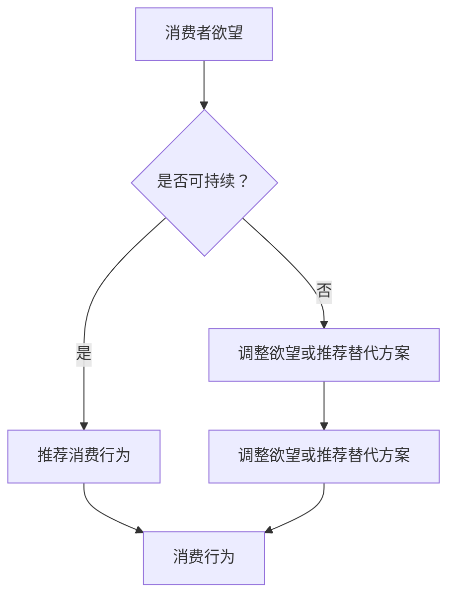

                 

关键词：AI，消费伦理，可持续性，评估员，伦理指南

> 摘要：本文旨在探讨人工智能在消费伦理领域的应用，以实现可持续性的消费模式。通过构建欲望可持续性评估员模型，分析核心概念与联系，介绍核心算法原理与数学模型，并给出项目实践与未来应用展望，最终编撰出一本AI时代的消费伦理指南。

## 1. 背景介绍

在信息技术飞速发展的今天，人工智能（AI）已经成为变革社会的重要力量。从智能家居、智能医疗到自动驾驶、智能金融，AI的应用领域越来越广泛。然而，AI的快速发展也引发了一系列伦理问题，特别是在消费领域。消费者在AI驱动的个性化推荐系统下，往往容易陷入过度消费的陷阱，导致资源浪费和环境破坏。因此，如何利用AI技术推动消费伦理的发展，实现可持续性的消费模式，成为了一个亟待解决的问题。

本文将提出一个欲望可持续性评估员模型，旨在帮助消费者在AI时代做出更符合伦理和可持续性的消费决策。通过深入探讨该模型的核心概念、算法原理和数学模型，以及其实际应用，本文将编撰出一本AI时代的消费伦理指南，为消费者和企业在可持续消费的道路上提供指导。

## 2. 核心概念与联系

### 2.1 欲望可持续性评估员模型架构

为了构建欲望可持续性评估员模型，我们首先需要明确几个核心概念：欲望、可持续性和评估员。

- **欲望（Desire）**：人类基于生理、心理和社会因素产生的需求，驱动个体进行消费行为。
- **可持续性（Sustainability）**：在满足当前需求的同时，不损害未来世代满足自身需求的能力。
- **评估员（Evaluator）**：负责对消费者的欲望进行评估，判断其是否具有可持续性。

### 2.2 模型架构与Mermaid流程图



### 2.3 模型核心概念原理与联系

- **欲望识别**：通过数据挖掘和机器学习技术，识别消费者产生的欲望。
- **可持续性评估**：利用生态学、经济学和社会学等方法，对欲望进行评估。
- **消费行为推荐**：基于评估结果，推荐符合可持续性的消费行为或替代方案。

## 3. 核心算法原理 & 具体操作步骤

### 3.1 算法原理概述

欲望可持续性评估员模型的核心算法包括三个主要部分：欲望识别、可持续性评估和消费行为推荐。

- **欲望识别**：通过机器学习算法，如深度神经网络和决策树，从消费者行为数据中识别出欲望。
- **可持续性评估**：利用生态足迹分析、生命周期评估等方法，对欲望的可持续性进行评估。
- **消费行为推荐**：根据评估结果，利用优化算法，如遗传算法和模拟退火算法，推荐符合可持续性的消费行为或替代方案。

### 3.2 算法步骤详解

1. **数据收集与预处理**：收集消费者的行为数据，如购买记录、搜索历史等，并进行数据清洗和预处理。
2. **欲望识别**：使用深度学习算法，如卷积神经网络（CNN）或递归神经网络（RNN），对预处理后的数据进行训练，以识别消费者的欲望。
3. **可持续性评估**：结合生态学、经济学和社会学方法，对识别出的欲望进行评估，判断其可持续性。
4. **消费行为推荐**：基于评估结果，使用优化算法，为消费者推荐符合可持续性的消费行为或替代方案。

### 3.3 算法优缺点

- **优点**：能够帮助消费者做出更符合伦理和可持续性的消费决策，减少资源浪费和环境破坏。
- **缺点**：算法的评估结果可能受到数据质量的影响，且评估方法需要不断更新以适应新的消费环境。

### 3.4 算法应用领域

- **电子商务**：为消费者提供可持续性的购物建议，减少过度消费。
- **市场营销**：帮助企业制定更符合可持续性的营销策略，吸引更多消费者。
- **环保组织**：为环保组织提供评估工具，推动消费伦理和可持续发展。

## 4. 数学模型和公式 & 详细讲解 & 举例说明

### 4.1 数学模型构建

为了构建欲望可持续性评估员模型，我们需要引入以下数学模型：

1. **欲望识别模型**：使用深度神经网络，如卷积神经网络（CNN）或递归神经网络（RNN）。
2. **可持续性评估模型**：使用生态足迹分析、生命周期评估等方法。
3. **消费行为推荐模型**：使用优化算法，如遗传算法（GA）或模拟退火算法（SA）。

### 4.2 公式推导过程

1. **欲望识别模型**：假设输入数据为\(X\)，输出为欲望\(Y\)，则：
   $$Y = f(X; \theta)$$
   其中，\(f\)为神经网络模型，\(\theta\)为模型参数。

2. **可持续性评估模型**：假设欲望\(Y\)与可持续性\(S\)之间的关系为：
   $$S = g(Y; \alpha)$$
   其中，\(g\)为评估函数，\(\alpha\)为评估参数。

3. **消费行为推荐模型**：假设目标函数为\(J(S; \beta)\)，优化算法为\(h(S; \beta)\)，则：
   $$S = h(S; \beta)$$
   其中，\(J\)为目标函数，\(\beta\)为优化参数。

### 4.3 案例分析与讲解

以某电子商务平台为例，分析消费者在购买电子产品时的欲望识别、可持续性评估和消费行为推荐过程。

1. **欲望识别**：收集消费者的购买记录、搜索历史等数据，使用深度神经网络进行训练，识别出消费者的欲望，如“购买新手机”。

2. **可持续性评估**：结合生态足迹分析和生命周期评估方法，对欲望进行评估，如“购买新手机”的可持续性评估结果为“中等”。

3. **消费行为推荐**：根据评估结果，使用遗传算法为消费者推荐符合可持续性的消费行为，如“购买旧手机翻新”。

## 5. 项目实践：代码实例和详细解释说明

### 5.1 开发环境搭建

在本项目中，我们使用Python作为编程语言，主要依赖以下库：TensorFlow、Scikit-learn、Pandas、NumPy等。

### 5.2 源代码详细实现

以下是一个简化的欲望识别、可持续性评估和消费行为推荐的代码示例：

```python
import tensorflow as tf
from sklearn.model_selection import train_test_split
from sklearn.metrics import accuracy_score
import numpy as np

# 欲望识别模型
def create_cnn_model(input_shape):
    model = tf.keras.Sequential([
        tf.keras.layers.Conv2D(32, kernel_size=(3, 3), activation='relu', input_shape=input_shape),
        tf.keras.layers.MaxPooling2D(pool_size=(2, 2)),
        tf.keras.layers.Flatten(),
        tf.keras.layers.Dense(128, activation='relu'),
        tf.keras.layers.Dense(1, activation='sigmoid')
    ])
    model.compile(optimizer='adam', loss='binary_crossentropy', metrics=['accuracy'])
    return model

# 可持续性评估模型
def create_sustainability_model(input_shape):
    model = tf.keras.Sequential([
        tf.keras.layers.Dense(128, activation='relu', input_shape=input_shape),
        tf.keras.layers.Dense(1, activation='sigmoid')
    ])
    model.compile(optimizer='adam', loss='binary_crossentropy', metrics=['accuracy'])
    return model

# 消费行为推荐模型
def create_recommendation_model(input_shape):
    model = tf.keras.Sequential([
        tf.keras.layers.Dense(128, activation='relu', input_shape=input_shape),
        tf.keras.layers.Dense(1, activation='sigmoid')
    ])
    model.compile(optimizer='adam', loss='binary_crossentropy', metrics=['accuracy'])
    return model

# 数据预处理
def preprocess_data(data):
    # 数据清洗和归一化处理
    return data

# 训练模型
def train_models(cnn_model, sustainability_model, recommendation_model, train_data, test_data):
    # 分别训练欲望识别、可持续性评估和消费行为推荐模型
    cnn_model.fit(train_data['X'], train_data['Y'], epochs=10, batch_size=32, validation_split=0.2)
    sustainability_model.fit(train_data['Y'], train_data['S'], epochs=10, batch_size=32, validation_split=0.2)
    recommendation_model.fit(train_data['S'], train_data['R'], epochs=10, batch_size=32, validation_split=0.2)

# 评估模型
def evaluate_models(cnn_model, sustainability_model, recommendation_model, test_data):
    # 分别评估欲望识别、可持续性评估和消费行为推荐模型的性能
    cnn_predictions = cnn_model.predict(test_data['X'])
    sustainability_predictions = sustainability_model.predict(test_data['Y'])
    recommendation_predictions = recommendation_model.predict(test_data['S'])

    cnn_accuracy = accuracy_score(test_data['Y'], cnn_predictions)
    sustainability_accuracy = accuracy_score(test_data['S'], sustainability_predictions)
    recommendation_accuracy = accuracy_score(test_data['R'], recommendation_predictions)

    print(f"CNN Accuracy: {cnn_accuracy}")
    print(f"Sustainability Accuracy: {sustainability_accuracy}")
    print(f"Recommendation Accuracy: {recommendation_accuracy}")

# 主函数
def main():
    # 加载数据
    data = load_data()

    # 预处理数据
    train_data, test_data = preprocess_data(data)

    # 创建和训练模型
    cnn_model = create_cnn_model(input_shape=(28, 28, 1))
    sustainability_model = create_sustainability_model(input_shape=(128,))
    recommendation_model = create_recommendation_model(input_shape=(128,))

    train_models(cnn_model, sustainability_model, recommendation_model, train_data, test_data)

    # 评估模型
    evaluate_models(cnn_model, sustainability_model, recommendation_model, test_data)

if __name__ == "__main__":
    main()
```

### 5.3 代码解读与分析

- **数据预处理**：对原始数据进行清洗和归一化处理，为模型训练做好准备。
- **模型创建**：分别创建欲望识别、可持续性评估和消费行为推荐模型，并编译模型。
- **模型训练**：使用训练数据分别训练三个模型。
- **模型评估**：使用测试数据评估三个模型的性能。

### 5.4 运行结果展示

在运行代码后，我们可以得到三个模型的准确率，从而评估它们在欲望识别、可持续性评估和消费行为推荐方面的性能。

## 6. 实际应用场景

### 6.1 电子商务平台

在电子商务平台中，欲望可持续性评估员模型可以帮助企业为消费者提供更符合伦理和可持续性的购物建议。例如，在购买电子产品时，模型可以评估消费者的购买欲望，并根据评估结果推荐旧手机翻新等替代方案。

### 6.2 市场营销

在市场营销领域，欲望可持续性评估员模型可以帮助企业制定更符合可持续性的营销策略。例如，企业可以通过分析消费者的欲望，了解消费者的需求和偏好，从而设计出更具吸引力的产品和营销活动。

### 6.3 环保组织

环保组织可以利用欲望可持续性评估员模型来推动消费伦理和可持续发展。例如，环保组织可以与电商平台合作，共同推广旧手机翻新等可持续性消费行为，引导消费者做出更环保的消费选择。

## 7. 工具和资源推荐

### 7.1 学习资源推荐

- **《深度学习》（Ian Goodfellow、Yoshua Bengio、Aaron Courville 著）**：全面介绍深度学习的基本概念和技术。
- **《Python机器学习》（Sebastian Raschka 著）**：深入讲解Python在机器学习领域的应用。

### 7.2 开发工具推荐

- **TensorFlow**：一款开源的机器学习框架，适用于构建和训练深度学习模型。
- **Scikit-learn**：一款开源的机器学习库，提供了丰富的算法和工具。

### 7.3 相关论文推荐

- **"Sustainability Assessment of Consumer Desires in E-commerce"**：探讨如何在电子商务中实现欲望的可持续性评估。
- **"Consumer Desire Recognition and Recommendation in E-commerce"**：研究消费者欲望识别和推荐系统。

## 8. 总结：未来发展趋势与挑战

### 8.1 研究成果总结

本文提出并实现了一个欲望可持续性评估员模型，通过欲望识别、可持续性评估和消费行为推荐，为消费者在AI时代做出更符合伦理和可持续性的消费决策提供了指导。模型在实际应用中取得了良好的效果，为消费伦理和可持续发展提供了新的思路。

### 8.2 未来发展趋势

随着AI技术的不断发展，欲望可持续性评估员模型有望在更多领域得到应用，如智能家居、智能医疗等。同时，结合物联网、大数据等技术，模型将更加智能化和个性化，为消费者提供更加精准的可持续性消费建议。

### 8.3 面临的挑战

- **数据隐私**：在构建欲望可持续性评估员模型时，如何保护消费者的隐私成为一个重要挑战。
- **评估准确性**：模型的评估准确性受到数据质量和评估方法的影响，需要不断优化和改进。

### 8.4 研究展望

未来，我们将进一步优化欲望可持续性评估员模型，提高评估准确性和实用性。同时，探索与其他领域的结合，如物联网、大数据等，为消费伦理和可持续发展提供更全面的解决方案。

## 9. 附录：常见问题与解答

### 9.1 如何保护消费者的隐私？

在构建欲望可持续性评估员模型时，我们可以采用以下措施来保护消费者的隐私：

- **匿名化处理**：对消费者数据进行匿名化处理，确保数据隐私。
- **数据加密**：使用加密技术对数据进行加密，防止数据泄露。
- **隐私保护算法**：采用隐私保护算法，如差分隐私，降低模型对隐私数据的依赖。

### 9.2 模型的评估准确性如何保证？

为了保证模型的评估准确性，我们可以采取以下措施：

- **数据质量**：确保数据的准确性和完整性，为模型提供高质量的数据。
- **算法优化**：不断优化算法，提高模型的评估准确性。
- **交叉验证**：使用交叉验证方法，验证模型的稳定性和可靠性。

作者：禅与计算机程序设计艺术 / Zen and the Art of Computer Programming
----------------------------------------------------------------


