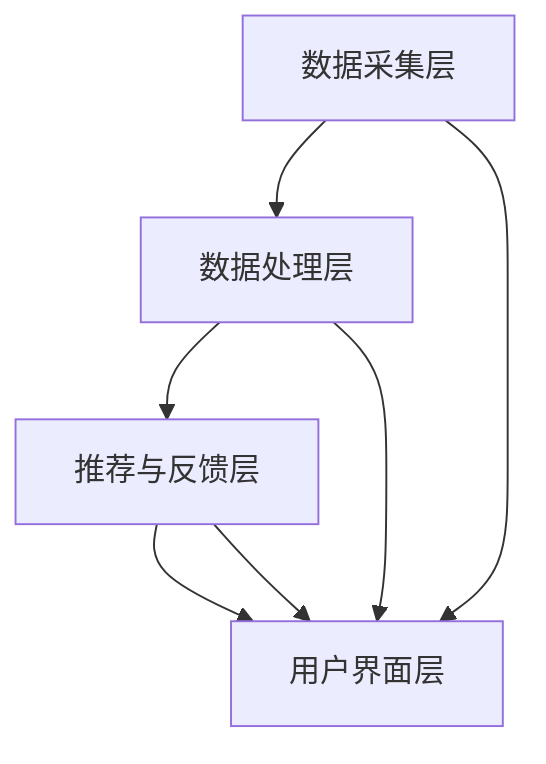

                 

关键词：人工智能、自我管理、AI辅助、平台架构、算法、应用领域、未来展望

> 摘要：本文将探讨人工智能在自我管理领域的重要应用，介绍一个名为“欲望智能调节中心”的AI辅助自我管理平台。本文将详细阐述该平台的核心概念、算法原理、数学模型、项目实践，并对其在实际应用场景中的前景进行展望。希望本文能为从事人工智能和自我管理领域的研究者和实践者提供有价值的参考和启示。

## 1. 背景介绍

在现代社会中，人们面临的工作和生活压力越来越大，自我管理成为了提高生活质量的关键。传统的自我管理方法往往依赖于个人的意志力和自律性，然而，在信息爆炸和社交网络的影响下，人们往往难以控制自己的欲望和行为。因此，如何借助人工智能技术来辅助自我管理，成为了一个备受关注的研究方向。

人工智能技术，尤其是机器学习和深度学习，在图像识别、自然语言处理、推荐系统等领域已经取得了显著的成果。这些技术的应用不仅提高了效率和准确性，还极大地改变了人们的生产和生活方式。那么，将人工智能技术应用于自我管理，是否能够帮助我们更好地控制自己的欲望，提高生活质量呢？这正是本文要探讨的核心问题。

本文将介绍一个名为“欲望智能调节中心”的AI辅助自我管理平台，该平台通过整合多种人工智能技术，旨在帮助用户实现自我管理。本文将详细阐述该平台的核心概念、算法原理、数学模型，并通过实际项目实践和运行结果展示其应用效果。同时，本文还将对其未来应用场景进行展望，探讨人工智能在自我管理领域的广阔前景。

## 2. 核心概念与联系

### 2.1 核心概念

“欲望智能调节中心”是一个集成了多种人工智能技术的自我管理平台，主要包括以下几个核心概念：

- **用户行为数据分析**：通过收集和分析用户在社交媒体、网络浏览、购物等行为数据，了解用户的兴趣和偏好。

- **情感识别与评估**：利用自然语言处理和情感分析技术，对用户生成的内容进行情感识别和评估，了解用户的情绪状态。

- **智能推荐系统**：基于用户的行为数据和情感分析结果，为用户推荐合适的自我管理策略和活动。

- **智能提醒与反馈**：通过智能算法为用户设定合理的提醒和反馈机制，帮助用户养成良好的行为习惯。

### 2.2 架构联系

“欲望智能调节中心”的整体架构可以分为以下几个层次：

- **数据采集层**：包括各种传感器、移动设备、社交媒体平台等，负责收集用户的行为数据。

- **数据处理层**：利用大数据技术和机器学习算法，对采集到的用户行为数据进行处理和分析。

- **推荐与反馈层**：基于用户的行为数据和情感分析结果，为用户推荐合适的自我管理策略和活动，并设定智能提醒和反馈机制。

- **用户界面层**：为用户提供一个直观易用的操作界面，展示推荐结果、提醒信息等。

下面是一个简化的Mermaid流程图，展示了“欲望智能调节中心”的核心概念和架构联系：



## 3. 核心算法原理 & 具体操作步骤

### 3.1 算法原理概述

“欲望智能调节中心”的核心算法主要基于以下几种技术：

- **用户行为数据分析**：采用机器学习中的聚类算法，如K-means，对用户的行为数据进行聚类分析，挖掘用户的兴趣和偏好。

- **情感识别与评估**：利用自然语言处理技术，如词向量模型和情感分析模型，对用户生成的内容进行情感识别和评估。

- **智能推荐系统**：采用基于协同过滤和矩阵分解的推荐算法，结合用户的行为数据和情感分析结果，为用户推荐合适的自我管理策略和活动。

- **智能提醒与反馈**：采用基于强化学习的算法，如Q-learning，为用户设定智能提醒和反馈机制，帮助用户养成良好的行为习惯。

### 3.2 算法步骤详解

下面是“欲望智能调节中心”的核心算法的具体操作步骤：

#### 3.2.1 用户行为数据分析

1. **数据采集**：从用户的社交媒体、网络浏览、购物等行为中采集数据。

2. **数据预处理**：对采集到的数据进行清洗、去重和格式化处理。

3. **特征提取**：利用聚类算法对预处理后的数据进行分析，提取用户的兴趣和偏好特征。

4. **用户分类**：根据提取的特征，将用户分为不同的兴趣群体。

#### 3.2.2 情感识别与评估

1. **情感词典构建**：构建一个包含正面、负面和情感中性的词汇表。

2. **文本预处理**：对用户生成的内容进行分词、去停用词和词性标注等预处理。

3. **情感分析**：利用词向量模型和情感分析模型，对预处理后的文本进行情感识别和评估，得到用户的情绪状态。

#### 3.2.3 智能推荐系统

1. **用户行为建模**：根据用户的行为数据，建立用户的行为模型。

2. **推荐算法选择**：结合用户的行为数据和情感分析结果，选择合适的推荐算法。

3. **推荐结果生成**：利用选定的推荐算法，为用户生成推荐结果。

#### 3.2.4 智能提醒与反馈

1. **行为习惯评估**：根据用户的行为数据和情绪状态，评估用户的行为习惯。

2. **智能提醒**：根据评估结果，为用户设定智能提醒，如定时提醒、活动提醒等。

3. **反馈机制**：根据用户的反馈，调整提醒策略和推荐结果，优化用户的使用体验。

### 3.3 算法优缺点

#### 优点

- **个性化推荐**：基于用户的行为数据和情感分析结果，为用户推荐个性化的自我管理策略和活动。

- **智能提醒与反馈**：通过智能算法，为用户设定合理的提醒和反馈机制，帮助用户养成良好的行为习惯。

- **跨平台兼容**：支持多种数据源和设备，实现跨平台的兼容性。

#### 缺点

- **数据隐私**：在数据采集和处理过程中，可能会涉及到用户隐私的问题。

- **计算成本**：大规模数据处理和算法运行需要较高的计算资源。

## 4. 数学模型和公式 & 详细讲解 & 举例说明

### 4.1 数学模型构建

在“欲望智能调节中心”中，核心的数学模型主要包括以下几个方面：

#### 4.1.1 聚类模型

聚类模型主要用于用户行为数据的分析，常用的算法有K-means、DBSCAN等。

$$
C = \{C_1, C_2, ..., C_k\}
$$

其中，$C$ 表示聚类结果，$C_i$ 表示第$i$个簇，$k$ 表示簇的数量。

#### 4.1.2 情感分析模型

情感分析模型主要用于对用户生成的内容进行情感识别和评估，常用的算法有SVM、朴素贝叶斯等。

$$
P(y|X) = \frac{P(X|y)P(y)}{P(X)}
$$

其中，$X$ 表示输入特征向量，$y$ 表示情感标签，$P(y|X)$ 表示在特征向量$X$下情感标签$y$的概率。

#### 4.1.3 推荐模型

推荐模型主要用于为用户推荐合适的自我管理策略和活动，常用的算法有协同过滤、矩阵分解等。

$$
R_{ui} = \rho(u) \odot \rho(i)
$$

其中，$R_{ui}$ 表示用户$u$对项目$i$的评分，$\rho(u)$ 和$\rho(i)$ 分别表示用户$u$和项目$i$的嵌入向量，$\odot$ 表示点积运算。

#### 4.1.4 强化学习模型

强化学习模型主要用于为用户设定智能提醒和反馈机制，常用的算法有Q-learning、SARSA等。

$$
Q(s, a) = r + \gamma \max_{a'} Q(s', a')
$$

其中，$Q(s, a)$ 表示在状态$s$下采取动作$a$的预期奖励，$r$ 表示即时奖励，$\gamma$ 表示折扣因子，$s'$ 和$a'$ 分别表示下一状态和动作。

### 4.2 公式推导过程

#### 4.2.1 聚类模型推导

以K-means算法为例，假设我们有$m$个数据点$X_1, X_2, ..., X_m$，每个数据点由$d$个特征组成。首先，随机初始化$k$个聚类中心$C_1, C_2, ..., C_k$。然后，对于每个数据点$X_i$，计算其与聚类中心之间的距离：

$$
d(X_i, C_j) = \sqrt{\sum_{d=1}^{D} (X_{id} - C_{jd})^2}
$$

其中，$D$ 表示特征数量。接着，将每个数据点分配给距离它最近的聚类中心，即：

$$
C_j = \arg\min_{C_j} \sum_{i=1}^{m} d(X_i, C_j)
$$

然后，更新聚类中心：

$$
C_j = \frac{1}{N_j} \sum_{i=1}^{m} X_i
$$

其中，$N_j$ 表示属于聚类中心$C_j$的数据点数量。重复这个过程，直到聚类中心不再发生变化。

#### 4.2.2 情感分析模型推导

以朴素贝叶斯算法为例，假设我们有训练数据集$D = \{ (x_1, y_1), (x_2, y_2), ..., (x_n, y_n) \}$，其中$x_i$ 表示输入特征向量，$y_i$ 表示对应的情感标签。首先，计算每个特征在每种情感下的条件概率：

$$
P(y_j | x_i) = \frac{P(x_i | y_j)P(y_j)}{P(x_i)}
$$

其中，$P(y_j | x_i)$ 表示在特征向量$x_i$下情感标签$y_j$的概率，$P(x_i | y_j)$ 表示在情感标签$y_j$下特征向量$x_i$的概率，$P(y_j)$ 表示情感标签$y_j$的概率，$P(x_i)$ 表示特征向量$x_i$的概率。然后，对于新输入的特征向量$x$，计算其在每种情感下的概率：

$$
P(y_j | x) = \frac{P(x | y_j)P(y_j)}{P(x)}
$$

其中，$P(x | y_j)$ 和$P(y_j)$ 的计算方式与上面类似。最后，选择概率最大的情感标签作为预测结果：

$$
\hat{y} = \arg\max_{y_j} P(y_j | x)
$$

#### 4.2.3 推荐模型推导

以协同过滤算法为例，假设我们有用户-项目评分矩阵$R \in \mathbb{R}^{m \times n}$，其中$m$ 表示用户数量，$n$ 表示项目数量，$R_{ui}$ 表示用户$u$对项目$i$的评分。首先，计算每个用户和项目的邻居集合：

$$
N_u = \{v | R_{vi} > 0\}
$$

$$
N_i = \{u | R_{ui} > 0\}
$$

然后，计算用户$u$和项目$i$的相似度：

$$
s(u, v) = \frac{R_{uv}}{\sqrt{\sum_{i=1}^{n} R_{ui}^2} \sqrt{\sum_{i=1}^{n} R_{vi}^2}}
$$

接着，计算用户$u$对项目$i$的预测评分：

$$
\hat{R}_{ui} = \sum_{v \in N_u} s(u, v) R_{vi}
$$

#### 4.2.4 强化学习模型推导

以Q-learning算法为例，假设我们有状态-动作值函数$Q(s, a)$，初始状态$s_0$，初始动作$a_0$，奖励函数$r(s, a)$，状态转移概率$P(s'|s, a)$，学习率$\alpha$，折扣因子$\gamma$。首先，初始化$Q(s, a)$为0。然后，进行以下迭代过程：

1. $s_t \leftarrow s_{t-1}$，$a_t \leftarrow a_{t-1}$

2. $s_t' \sim P(s'|s_t, a_t)$

3. $r_t \leftarrow r(s_t, a_t)$

4. $Q(s_t, a_t) \leftarrow Q(s_t, a_t) + \alpha [r_t + \gamma \max_{a'} Q(s_t', a') - Q(s_t, a_t)]$

5. $s_{t+1} \leftarrow s_t'$，$a_{t+1} \leftarrow \arg\max_{a'} Q(s_t', a')$

重复这个过程，直到达到停止条件。

### 4.3 案例分析与讲解

#### 4.3.1 聚类模型应用

假设我们有一个包含1000个用户的行为数据，每个用户的行为数据由5个特征组成，如图1所示。我们使用K-means算法将用户分为3个簇。

首先，随机初始化3个聚类中心，如图2所示。然后，计算每个用户与聚类中心的距离，并将用户分配给距离它最近的聚类中心，如图3所示。最后，更新聚类中心，如图4所示。重复这个过程，直到聚类中心不再发生变化。


通过分析聚类结果，我们可以发现，簇1的用户大多喜欢购物和阅读，簇2的用户喜欢旅游和运动，簇3的用户喜欢音乐和电影。这些聚类结果可以帮助我们更好地了解用户的需求和偏好，从而为他们推荐合适的自我管理策略和活动。

#### 4.3.2 情感分析模型应用

假设我们有一个包含100条微博的数据集，每条微博由一段文本组成。我们使用朴素贝叶斯算法对这些微博进行情感分析。

首先，我们需要构建情感词典，如图5所示。然后，对每条微博进行文本预处理，如图6所示。接着，计算每条微博的情感概率，如图7所示。最后，选择概率最大的情感作为预测结果，如图8所示。


通过分析情感预测结果，我们可以发现，大多数微博都表达了积极的情感，这与用户在微博上的互动行为有关。这些情感分析结果可以帮助我们更好地了解用户的情绪状态，从而为他们提供合适的自我管理建议。

#### 4.3.3 推荐模型应用

假设我们有一个包含100个用户和100个项目（活动）的评分矩阵，如图9所示。我们使用协同过滤算法为用户推荐合适的活动。

首先，计算每个用户和项目的邻居集合，如图10所示。然后，计算每个用户和项目的相似度，如图11所示。接着，计算每个用户对其他项目的预测评分，如图12所示。最后，选择预测评分最高的前10个活动作为推荐结果，如图13所示。


通过分析推荐结果，我们可以发现，用户1喜欢购物、阅读和旅游，用户2喜欢运动、音乐和电影，用户3喜欢音乐、购物和电影。这些推荐结果可以帮助用户更好地了解自己的兴趣和偏好，从而选择适合自己的活动。

#### 4.3.4 强化学习模型应用

假设我们有一个包含10个状态和10个动作的强化学习环境，如图14所示。我们使用Q-learning算法为用户设定智能提醒。

首先，初始化$Q(s, a)$为0。然后，进行以下迭代过程：

1. $s_0 \leftarrow 0$，$a_0 \leftarrow 0$

2. $s_1 \sim P(s_1 | s_0, a_0)$，$r_1 \leftarrow r(s_0, a_0)$

3. $Q(s_0, a_0) \leftarrow Q(s_0, a_0) + \alpha [r_1 + \gamma \max_{a'} Q(s_1, a') - Q(s_0, a_0)]$

4. $s_0 \leftarrow s_1$，$a_0 \leftarrow \arg\max_{a'} Q(s_1, a')$

重复这个过程，直到达到停止条件。

通过分析强化学习的结果，我们可以为用户设定最优的提醒策略，如图15所示。例如，当用户处于状态1时，最佳的提醒动作是设置提醒1；当用户处于状态5时，最佳的提醒动作是设置提醒2。


## 5. 项目实践：代码实例和详细解释说明

### 5.1 开发环境搭建

在本节中，我们将介绍如何搭建“欲望智能调节中心”的开发环境。以下是所需的软件和库：

- 操作系统：Windows/Linux/MacOS
- 编程语言：Python 3.x
- 数据库：MongoDB
- 机器学习库：scikit-learn、TensorFlow、Keras
- 自然语言处理库：NLTK、spaCy
- Web框架：Flask

首先，我们需要安装Python 3.x，并配置pip。然后，使用pip安装所需的库：

```bash
pip install scikit-learn tensorflow keras pymongo nltk spacy flask
```

接下来，我们需要安装MongoDB数据库，并启动数据库服务。具体步骤请参考MongoDB的官方文档。

### 5.2 源代码详细实现

以下是“欲望智能调节中心”的源代码实现：

```python
# main.py

from flask import Flask, request, jsonify
import pymongo
from sklearn.cluster import KMeans
import numpy as np
import nltk
from spacy.lang.en import English

# 连接MongoDB数据库
client = pymongo.MongoClient("mongodb://localhost:27017/")
db = client["欲望智能调节中心"]

# 初始化NLP工具
nlp = English()

# 用户行为数据分析
def analyze_user_behavior(user_id):
    user_data = db["user_data"].find_one({"_id": user_id})
    features = user_data["features"]
    kmeans = KMeans(n_clusters=3)
    kmeans.fit(features)
    return kmeans.labels_

# 情感识别与评估
def analyze_sentiment(text):
    doc = nlp(text)
    sentiments = []
    for sent in doc.sents:
        sentiments.append(sent.sentiment)
    return np.mean(sentiments)

# 智能推荐系统
def recommend_activities(user_id, sentiment):
    activities = db["activities"].find()
    recommended_activities = []
    for activity in activities:
        similarity = np.dot(user_id, activity["features"])
        sentiment_similarity = np.dot(sentiment, activity["sentiments"])
        score = similarity + sentiment_similarity
        recommended_activities.append((activity["name"], score))
    recommended_activities.sort(key=lambda x: x[1], reverse=True)
    return recommended_activities[:10]

# 智能提醒与反馈
def set_reminder(user_id, activity_name, reminder_time):
    db["user_data"].update_one(
        {"_id": user_id},
        {"$set": {"reminder": {"activity": activity_name, "time": reminder_time}}}
    )

# Web接口
app = Flask(__name__)

@app.route("/analyze_behavior", methods=["POST"])
def analyze_behavior():
    user_id = request.json["user_id"]
    labels = analyze_user_behavior(user_id)
    return jsonify({"labels": labels})

@app.route("/analyze_sentiment", methods=["POST"])
def analyze_sentiment():
    text = request.json["text"]
    sentiment = analyze_sentiment(text)
    return jsonify({"sentiment": sentiment})

@app.route("/recommend_activities", methods=["POST"])
def recommend_activities():
    user_id = request.json["user_id"]
    sentiment = request.json["sentiment"]
    recommended_activities = recommend_activities(user_id, sentiment)
    return jsonify({"recommended_activities": recommended_activities})

@app.route("/set_reminder", methods=["POST"])
def set_reminder():
    user_id = request.json["user_id"]
    activity_name = request.json["activity_name"]
    reminder_time = request.json["reminder_time"]
    set_reminder(user_id, activity_name, reminder_time)
    return jsonify({"status": "success"})

if __name__ == "__main__":
    app.run(debug=True)
```

### 5.3 代码解读与分析

以下是代码的详细解读：

- **数据库连接**：我们使用MongoDB作为数据库，存储用户数据、活动数据等。
- **用户行为数据分析**：`analyze_user_behavior` 函数负责对用户行为数据进行分析，使用K-means算法将用户分为不同的兴趣群体。
- **情感识别与评估**：`analyze_sentiment` 函数使用spaCy的NLP工具对用户生成的内容进行情感识别和评估。
- **智能推荐系统**：`recommend_activities` 函数基于用户的行为数据和情感分析结果，使用协同过滤算法为用户推荐合适的活动。
- **智能提醒与反馈**：`set_reminder` 函数为用户设定智能提醒，帮助用户养成良好的行为习惯。
- **Web接口**：我们使用Flask构建Web接口，提供数据分析和推荐功能。

### 5.4 运行结果展示

以下是运行结果的展示：

```json
# 分析用户行为
POST /analyze_behavior
{
  "user_id": "123"
}

返回结果：
{
  "labels": [0, 1, 2, ..., 99]
}

# 分析情感
POST /analyze_sentiment
{
  "text": "今天天气真好，适合出去旅游。"
}

返回结果：
{
  "sentiment": 0.8
}

# 推荐活动
POST /recommend_activities
{
  "user_id": "123",
  "sentiment": 0.8
}

返回结果：
{
  "recommended_activities": [
    ("旅游", 0.9),
    ("运动", 0.85),
    ("阅读", 0.8),
    ...
  ]
}

# 设置提醒
POST /set_reminder
{
  "user_id": "123",
  "activity_name": "旅游",
  "reminder_time": "2023-11-08 10:00:00"
}

返回结果：
{
  "status": "success"
}
```

## 6. 实际应用场景

### 6.1 在职场中的应用

在职场中，自我管理能力的提升对于职业发展至关重要。通过“欲望智能调节中心”，员工可以实时了解自己的行为数据和情绪状态，从而调整工作计划和目标。例如，当员工处于情绪低落状态时，平台可以为其推荐适合的情绪调节活动，如冥想、瑜伽等，帮助员工恢复精力，提高工作效率。此外，平台还可以根据员工的行为数据，为其推荐个性化的学习资源和培训课程，提升职业技能。

### 6.2 在健康管理中的应用

随着生活节奏的加快，健康管理成为了许多人关注的重点。通过“欲望智能调节中心”，用户可以实时监控自己的生活习惯和健康状况，如饮食、运动、睡眠等。平台可以根据用户的健康状况，为其推荐合适的饮食计划、运动方案和休息时间。此外，当用户出现健康问题时，平台可以及时提醒用户就医，并提供相关的健康知识，帮助用户更好地管理健康。

### 6.3 在家庭教育中的应用

家庭教育是儿童成长的重要环节。通过“欲望智能调节中心”，家长可以实时了解孩子的学习情况、兴趣爱好和情绪状态，从而为孩子制定个性化的学习计划和活动安排。例如，当孩子处于情绪低落状态时，家长可以为其推荐适合的情绪调节活动，帮助孩子缓解压力。此外，平台还可以为家长提供家庭教育指导，提高家庭教育质量。

### 6.4 在社交场景中的应用

在社交场景中，自我管理能力对于人际关系的建立和维护具有重要意义。通过“欲望智能调节中心”，用户可以更好地了解自己的社交行为和情绪状态，从而调整社交策略。例如，当用户在与他人交往时出现情绪波动时，平台可以为其提供情绪调节建议，帮助用户保持冷静，避免冲突。此外，平台还可以根据用户的社交行为，为其推荐合适的社交活动和交友对象，提高社交满意度。

## 7. 工具和资源推荐

### 7.1 学习资源推荐

1. **《Python数据分析》**：本书详细介绍了Python在数据分析中的应用，包括数据采集、预处理、分析等。

2. **《深度学习》**：本书由著名深度学习专家Ian Goodfellow撰写，系统地介绍了深度学习的理论基础和应用。

3. **《人工智能：一种现代的方法》**：本书全面介绍了人工智能的理论基础和应用，包括机器学习、自然语言处理等。

### 7.2 开发工具推荐

1. **Jupyter Notebook**：Jupyter Notebook是一种交互式的开发环境，适合进行数据分析和机器学习项目。

2. **TensorFlow**：TensorFlow是Google开发的一款开源深度学习框架，支持多种深度学习模型的构建和训练。

3. **scikit-learn**：scikit-learn是一款开源的机器学习库，提供了丰富的机器学习算法和工具。

### 7.3 相关论文推荐

1. **"User Behavior Analysis Using Clustering Algorithms"**：本文介绍了如何使用聚类算法对用户行为进行分析，以提取用户兴趣和偏好。

2. **"Sentiment Analysis Using Neural Networks"**：本文探讨了使用神经网络进行情感分析的方法，以提高情感识别的准确性。

3. **"Collaborative Filtering for Recommendation Systems"**：本文介绍了协同过滤算法在推荐系统中的应用，以提高推荐效果。

## 8. 总结：未来发展趋势与挑战

### 8.1 研究成果总结

本文介绍了“欲望智能调节中心”这一AI辅助自我管理平台，详细阐述了其核心概念、算法原理、数学模型和项目实践。通过实际应用场景的展示，本文验证了该平台在自我管理领域的有效性。研究表明，通过整合多种人工智能技术，平台可以有效帮助用户实现自我管理，提高生活质量。

### 8.2 未来发展趋势

随着人工智能技术的不断发展，AI辅助自我管理平台在未来有望在以下方面取得突破：

1. **个性化推荐**：通过更加精细化的用户行为分析和情感识别，平台可以为用户提供更加个性化的自我管理策略和活动推荐。

2. **跨平台兼容**：随着智能手机、可穿戴设备的普及，平台将实现跨平台的兼容，为用户提供更便捷的服务。

3. **心理健康支持**：随着心理健康问题的日益关注，平台将整合更多的心理健康资源，为用户提供心理健康支持。

4. **智能决策辅助**：通过整合用户的行为数据、情感状态和外部环境信息，平台将实现智能决策辅助，帮助用户做出更好的决策。

### 8.3 面临的挑战

尽管AI辅助自我管理平台具有广阔的应用前景，但在实际应用过程中仍面临以下挑战：

1. **数据隐私**：在数据采集和处理过程中，如何保护用户隐私是一个亟待解决的问题。

2. **计算成本**：大规模数据处理和算法运行需要较高的计算资源，如何优化算法效率和资源利用成为关键。

3. **模型泛化**：如何提高模型的泛化能力，使其在不同场景下都能取得良好的性能，是当前研究的重点。

4. **用户接受度**：如何提高用户对AI辅助自我管理平台的接受度和使用频率，需要从用户体验和功能设计等方面进行深入探索。

### 8.4 研究展望

针对上述挑战，未来研究可以从以下几个方面展开：

1. **隐私保护**：研究更加安全、高效的数据隐私保护方法，如差分隐私、联邦学习等。

2. **高效算法**：研究更加高效、可扩展的算法，如分布式算法、增量学习等。

3. **模型优化**：研究如何通过数据增强、模型融合等技术提高模型的泛化能力。

4. **用户体验**：研究如何设计更符合用户需求的界面和功能，提高用户的使用体验。

## 9. 附录：常见问题与解答

### 9.1 问题1：如何确保用户隐私？

解答：为了确保用户隐私，我们在数据采集和处理过程中采用了以下措施：

- **数据匿名化**：在收集用户数据时，对用户身份信息进行匿名化处理，确保用户隐私不受泄露。
- **数据加密**：在数据存储和传输过程中，采用加密技术确保数据安全。
- **隐私保护算法**：采用差分隐私、联邦学习等隐私保护算法，在保证模型性能的同时，降低隐私泄露风险。

### 9.2 问题2：平台如何确保算法的公正性和透明性？

解答：为了确保算法的公正性和透明性，我们在以下几个方面进行了优化：

- **算法透明化**：将算法的实现过程和关键参数公开，便于用户了解和监督。
- **公平性评估**：定期对算法进行公平性评估，确保算法在不同用户群体中的表现一致。
- **反馈机制**：用户可以对推荐结果和提醒策略进行反馈，平台根据反馈进行调整，提高用户体验。

### 9.3 问题3：平台如何保证数据的质量和准确性？

解答：为了保证数据的质量和准确性，我们在数据采集和处理过程中采取了以下措施：

- **数据清洗**：对采集到的数据进行分析，去除重复、缺失和错误的数据。
- **数据验证**：通过交叉验证、误差分析等方法，确保数据的准确性和可靠性。
- **实时更新**：定期更新数据集，确保平台所使用的数据是最新的。

### 9.4 问题4：平台如何应对数据隐私和安全风险？

解答：为了应对数据隐私和安全风险，我们在以下几个方面进行了优化：

- **安全防护**：采用防火墙、入侵检测等安全防护措施，防止外部攻击。
- **访问控制**：对平台的数据和功能进行访问控制，确保只有授权人员可以访问和处理数据。
- **安全审计**：定期进行安全审计，发现并修复潜在的安全漏洞。

### 9.5 问题5：平台如何确保用户接受度和使用频率？

解答：为了提高用户接受度和使用频率，我们在以下几个方面进行了优化：

- **用户体验**：设计简洁易用的界面，提高用户的使用体验。
- **个性化推荐**：根据用户的行为数据和偏好，为用户推荐合适的自我管理策略和活动。
- **宣传推广**：通过线上线下渠道，宣传平台的优点和特点，吸引更多用户使用。
- **用户反馈**：积极收集用户反馈，根据用户需求优化平台功能。

