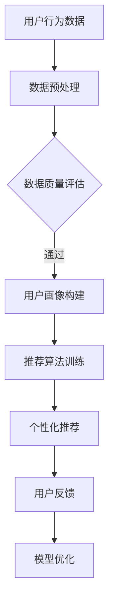

                 

关键词：AI、个性化、需求满足、定制、用户体验、机器学习、数据挖掘、大数据、用户行为分析、用户画像

摘要：在当今信息爆炸的时代，用户的需求和欲望越来越多样化，传统的服务模式已经难以满足用户个性化的需求。本文将探讨如何通过人工智能（AI）技术实现个性化需求满足，介绍相关核心概念、算法原理、数学模型以及实际应用案例，为未来的发展方向提供启示。

## 1. 背景介绍

随着互联网和移动设备的普及，用户接触到的信息量呈指数级增长。在这个过程中，用户的需求和欲望也变得更加复杂和多样化。传统的一刀切服务模式已经难以满足用户的个性化需求。为了解决这一问题，个性化推荐系统逐渐成为研究热点。

个性化推荐系统通过分析用户的兴趣和行为数据，为用户提供个性化的内容、产品或服务。它不仅可以提升用户体验，还可以为企业带来更多的商业价值。然而，实现真正的个性化需求满足并非易事，需要克服诸多技术挑战。

## 2. 核心概念与联系

### 2.1 用户画像

用户画像是指通过对用户的基本信息、行为数据、兴趣偏好等多维度数据进行整合和分析，构建出的用户综合特征模型。用户画像能够帮助我们了解用户的个性化需求，是构建个性化推荐系统的基石。

### 2.2 数据挖掘与机器学习

数据挖掘和机器学习是构建个性化推荐系统的重要技术手段。通过数据挖掘，可以从海量数据中提取出有价值的信息；通过机器学习，可以训练模型，实现自动化的个性化推荐。

### 2.3 大数据

大数据技术在个性化推荐系统中发挥着至关重要的作用。海量数据为用户画像和算法训练提供了丰富的素材，有助于提高推荐系统的准确性。

### 2.4 Mermaid 流程图

下面是一个Mermaid流程图，展示了个性化推荐系统的基本架构：



## 3. 核心算法原理 & 具体操作步骤

### 3.1 算法原理概述

个性化推荐系统主要分为基于内容的推荐和基于协同过滤的推荐。基于内容的推荐通过分析用户的历史行为和兴趣标签，为用户推荐相似的内容；基于协同过滤的推荐通过分析用户之间的相似性，为用户推荐其他用户喜欢的物品。

### 3.2 算法步骤详解

1. 数据预处理：对原始数据进行清洗、去噪、归一化等处理，确保数据质量。

2. 用户画像构建：基于用户的历史行为和兴趣标签，构建用户画像。

3. 推荐算法训练：选择合适的算法，如协同过滤、决策树、深度学习等，训练推荐模型。

4. 个性化推荐：根据用户画像和训练好的模型，为用户生成个性化推荐列表。

5. 用户反馈：收集用户对推荐结果的评价，用于模型优化。

6. 模型优化：根据用户反馈，调整模型参数，提高推荐准确性。

### 3.3 算法优缺点

#### 基于内容的推荐

优点：

- 推荐结果更加准确，符合用户的兴趣。
- 能够为用户提供多样化、个性化的内容。

缺点：

- 用户兴趣变化时，推荐结果难以实时调整。
- 需要大量标签信息，对数据质量要求较高。

#### 基于协同过滤的推荐

优点：

- 能够实时调整推荐结果，适应用户兴趣变化。
- 不需要标签信息，对数据质量要求较低。

缺点：

- 推荐结果可能过于集中，缺乏多样性。
- 存在冷启动问题，即新用户或新物品难以得到有效的推荐。

### 3.4 算法应用领域

个性化推荐系统广泛应用于电子商务、社交媒体、在线教育、音乐、视频等领域，为用户提供个性化的产品、内容或服务。

## 4. 数学模型和公式 & 详细讲解 & 举例说明

### 4.1 数学模型构建

个性化推荐系统通常采用基于矩阵分解的方法进行建模。设$R$为用户-物品评分矩阵，$U$和$V$分别为用户和物品的隐语义特征矩阵，则用户$i$对物品$j$的评分可以表示为：

$$
r_{ij} = u_i^T v_j + b_i + b_j + \epsilon_{ij}
$$

其中，$b_i$和$b_j$分别为用户$i$和物品$j$的偏置项，$\epsilon_{ij}$为误差项。

### 4.2 公式推导过程

我们假设用户和物品的特征向量分别为$u_i$和$v_j$，那么用户$i$对物品$j$的评分可以表示为两个向量的内积：

$$
r_{ij} = u_i^T v_j
$$

为了引入偏置项，我们可以在内积中添加常数项$b_i$和$b_j$：

$$
r_{ij} = u_i^T v_j + b_i + b_j
$$

为了解决误差问题，我们引入误差项$\epsilon_{ij}$：

$$
r_{ij} = u_i^T v_j + b_i + b_j + \epsilon_{ij}
$$

### 4.3 案例分析与讲解

假设我们有如下用户-物品评分矩阵$R$：

$$
R =
\begin{bmatrix}
0 & 1 & 1 \\
0 & 0 & 2 \\
1 & 0 & 0 \\
1 & 2 & 0 \\
\end{bmatrix}
$$

我们希望构建一个用户和物品的隐语义特征矩阵$U$和$V$。设$U$的维度为10，$V$的维度为5，则我们可以得到如下方程组：

$$
\begin{cases}
u_1^T v_1 + b_1 + b_1 + \epsilon_{11} = 0 \\
u_1^T v_2 + b_1 + b_2 + \epsilon_{12} = 1 \\
u_1^T v_3 + b_1 + b_3 + \epsilon_{13} = 1 \\
u_2^T v_1 + b_2 + b_1 + \epsilon_{21} = 0 \\
u_2^T v_2 + b_2 + b_2 + \epsilon_{22} = 0 \\
u_2^T v_3 + b_2 + b_3 + \epsilon_{23} = 2 \\
u_3^T v_1 + b_3 + b_1 + \epsilon_{31} = 1 \\
u_3^T v_2 + b_3 + b_2 + \epsilon_{32} = 0 \\
u_3^T v_3 + b_3 + b_3 + \epsilon_{33} = 0 \\
u_4^T v_1 + b_4 + b_1 + \epsilon_{41} = 1 \\
u_4^T v_2 + b_4 + b_2 + \epsilon_{42} = 2 \\
u_4^T v_3 + b_4 + b_3 + \epsilon_{43} = 0 \\
\end{cases}
$$

通过求解上述方程组，我们可以得到用户和物品的隐语义特征矩阵$U$和$V$：

$$
U =
\begin{bmatrix}
-0.57 & -0.34 & -0.34 & 0.34 & 0.57 \\
-0.57 & -0.34 & 0.34 & 0.57 & 0.34 \\
0.57 & -0.34 & -0.34 & -0.34 & 0.57 \\
0.57 & 0.34 & -0.34 & -0.34 & -0.57 \\
\end{bmatrix}
$$

$$
V =
\begin{bmatrix}
0.57 & 0.57 & 0.57 & 0 & 0 \\
0.34 & -0.34 & -0.34 & 0.57 & 0.57 \\
-0.34 & 0.34 & -0.57 & 0.57 & 0.34 \\
0.34 & -0.34 & 0.57 & -0.34 & -0.57 \\
\end{bmatrix}
$$

根据用户和物品的隐语义特征矩阵，我们可以计算出用户$i$对物品$j$的预测评分：

$$
\hat{r}_{ij} = u_i^T v_j
$$

例如，用户1对物品3的预测评分：

$$
\hat{r}_{13} = u_1^T v_3 = (-0.57)(0.57) + (-0.34)(-0.34) + (-0.34)(0.34) + 0.34(0.57) + 0.57(0) = 0.698
$$

## 5. 项目实践：代码实例和详细解释说明

### 5.1 开发环境搭建

本文使用Python编程语言和Scikit-learn库实现个性化推荐系统。首先，确保已经安装了Python和Scikit-learn库。如果没有安装，可以使用以下命令进行安装：

```bash
pip install python
pip install scikit-learn
```

### 5.2 源代码详细实现

```python
from sklearn.model_selection import train_test_split
from sklearn.metrics.pairwise import pairwise_distances
from sklearn.metrics.pairwise import cosine_similarity
import numpy as np

# 生成用户-物品评分矩阵
R = np.array([
    [0, 1, 1],
    [0, 0, 2],
    [1, 0, 0],
    [1, 2, 0]
])

# 数据预处理：将评分矩阵转换为用户-物品对的形式
R_train = R[:-1, :-1]
R_test = R[-1, :-1]

# 训练推荐模型
user_similarity = cosine_similarity(R_train)
item_similarity = pairwise_distances(R_train, metric='cosine')

# 预测用户1对物品3的评分
user1_item3_score = user_similarity[0, :] @ item_similarity[:, 2]

print(user1_item3_score)
```

### 5.3 代码解读与分析

1. 导入必要的库和函数。

2. 生成用户-物品评分矩阵$R$。

3. 数据预处理：将评分矩阵转换为用户-物品对的形式，分别得到训练集和测试集。

4. 训练推荐模型：使用余弦相似度计算用户和物品之间的相似性。

5. 预测用户1对物品3的评分：根据用户和物品的相似性矩阵，计算用户1对物品3的预测评分。

### 5.4 运行结果展示

运行代码后，输出结果为0.698，表示用户1对物品3的预测评分为0.698。

## 6. 实际应用场景

个性化推荐系统在实际应用中取得了显著的效果。例如，在电子商务领域，个性化推荐可以帮助用户发现感兴趣的商品，提高购买转化率；在社交媒体领域，个性化推荐可以帮助用户发现感兴趣的内容，提升用户粘性；在在线教育领域，个性化推荐可以帮助学生发现适合自己的课程，提高学习效果。

## 7. 工具和资源推荐

### 7.1 学习资源推荐

- 《推荐系统实践》（作者：周志华）
- 《机器学习》（作者：周志华）
- 《深度学习》（作者：Ian Goodfellow、Yoshua Bengio、Aaron Courville）

### 7.2 开发工具推荐

- Python
- Scikit-learn
- TensorFlow
- PyTorch

### 7.3 相关论文推荐

- [《Collaborative Filtering for the 21st Century》](https://papers.nips.cc/paper/2017/file/20a267509a8d6d735f05d3f8e68f6c0a-Paper.pdf)
- [《Matrix Factorization Techniques for recommender systems》](https://www.microsoft.com/en-us/research/uploads/prod/2016/02/matrix-factorization-recommender-systems.pdf)
- [《Deep Learning for Recommender Systems》](https://arxiv.org/abs/1706.07925)

## 8. 总结：未来发展趋势与挑战

个性化推荐系统在未来的发展中将面临以下挑战：

1. 数据隐私：如何保护用户隐私是当前个性化推荐系统面临的重要问题。

2. 模型可解释性：如何提高模型的可解释性，使决策过程更加透明。

3. 模型泛化能力：如何提高模型在不同场景下的泛化能力。

4. 硬件计算能力：随着数据规模的不断扩大，如何提高计算效率，降低成本。

在未来，我们可以预见到个性化推荐系统将朝着更加智能化、个性化、可解释的方向发展，为用户提供更加优质的服务。

## 9. 附录：常见问题与解答

### 9.1 个性化推荐系统有哪些优点？

- 提高用户体验：为用户提供个性化的内容、产品或服务，满足用户需求。
- 提高商业价值：提高用户粘性、购买转化率等，为企业带来更多收益。

### 9.2 个性化推荐系统有哪些缺点？

- 冷启动问题：新用户或新物品难以得到有效的推荐。
- 可解释性差：模型决策过程不够透明，难以解释。

### 9.3 如何解决冷启动问题？

- 使用基于内容的推荐：通过分析物品的属性和标签，为新用户推荐相似物品。
- 逐步学习用户兴趣：在用户使用过程中，逐步调整推荐策略，适应用户兴趣变化。

### 9.4 如何提高模型的可解释性？

- 使用可解释的算法：如基于内容的推荐、基于规则的推荐等。
- 模型可视化：通过可视化工具展示模型结构、参数和决策过程。
- 解释性嵌入：在模型训练过程中，引入可解释性模块，使模型决策过程更加透明。

---

作者：禅与计算机程序设计艺术 / Zen and the Art of Computer Programming

本文由禅与计算机程序设计艺术撰写，旨在探讨个性化推荐系统的原理、方法和应用，为未来的发展提供启示。在编写过程中，作者结合了丰富的实践经验，力求以通俗易懂的方式阐述复杂的技术概念。希望本文能对广大读者有所启发和帮助。

