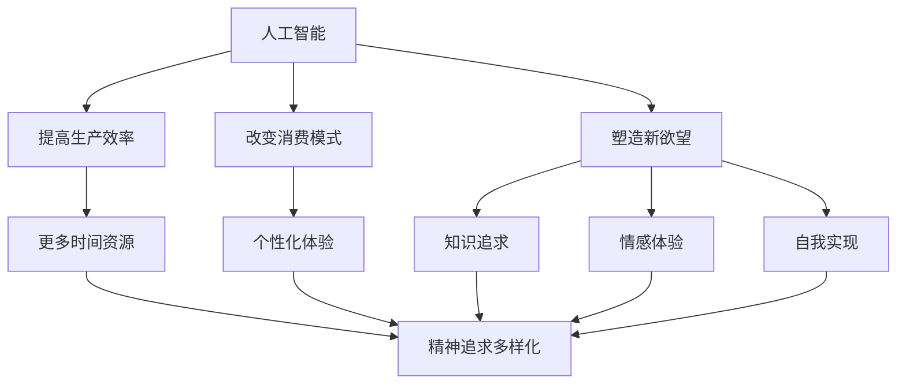

                 

关键词：人工智能、去物质化、精神追求、AI时代、技术哲学

> 摘要：本文探讨了人工智能时代下欲望的去物质化现象及其对人类精神追求的影响。从技术哲学的角度，分析人工智能如何改变人类的欲望结构和追求方式，并探讨了这一变革带来的社会文化意义。通过深入剖析人工智能技术的核心原理和实际应用案例，本文旨在揭示人类在AI时代如何重新定义和追求精神上的富足。

## 1. 背景介绍

在过去的几千年中，人类文明的发展很大程度上是建立在物质财富的积累和追求上的。无论是农业社会、工业社会还是信息社会，物质资源的丰富与否一直是衡量一个社会发展和个体幸福的重要标准。然而，随着人工智能（AI）技术的飞速发展，人类的生活正经历着一场前所未有的变革。人工智能不仅极大地提升了生产效率，改变了经济结构，还开始渗透到人类生活的方方面面，对传统的欲望结构和追求方式产生了深远的影响。

### 1.1 人工智能的历史与发展

人工智能起源于20世纪50年代，经过几十年的探索和研究，已经从最初的科学幻想逐渐变成现实。当前，人工智能技术已广泛应用于图像识别、自然语言处理、自动驾驶、智能机器人等领域，展现出强大的潜力和广阔的应用前景。特别是深度学习技术的突破，使得人工智能在复杂任务上的表现甚至超过了人类。

### 1.2 欲望的去物质化趋势

随着人工智能的发展，人类对物质的需求和依赖开始减弱。一方面，人工智能替代了大量的体力劳动和简单脑力劳动，使得人们有更多的时间和精力去追求精神层面的满足；另一方面，虚拟现实、增强现实等技术的兴起，为人们提供了丰富的精神体验，使得人们对现实物质世界的需求变得更加灵活和多元。

### 1.3 文章结构

本文将围绕人工智能时代的欲望去物质化展开讨论。首先，我们将探讨人工智能对欲望结构的改变；接着，分析人工智能如何影响人类的精神追求；然后，通过具体案例说明人工智能技术在满足人类精神需求方面的实际应用；最后，探讨人工智能时代精神追求的未来发展趋势与挑战。

## 2. 核心概念与联系

### 2.1 人工智能与欲望

人工智能作为一种技术，其对人类欲望的影响主要体现在以下几个方面：

1. **提高生产效率**：人工智能替代了大量人力，降低了生产成本，使得人们有更多的时间和资源去追求其他目标。
2. **改变消费模式**：人工智能推荐算法改变了人们的消费习惯，使得人们更加注重个性化体验和精神满足。
3. **塑造新欲望**：虚拟现实等技术创造了全新的体验方式，使得人们产生新的欲望和需求。

### 2.2 精神追求的多样化

随着人工智能的发展，人类的精神追求变得更加多样化。传统的物质追求逐渐被以下几种精神追求所取代：

1. **知识追求**：人工智能提升了信息获取和处理的能力，使得知识成为新的追求目标。
2. **情感体验**：虚拟现实和增强现实技术为人们提供了丰富的情感体验，使得情感需求成为新的追求方向。
3. **自我实现**：人工智能帮助人们更好地认识自己，实现个人潜能的释放。

### 2.3 Mermaid 流程图

以下是一个关于人工智能与欲望、精神追求关系的 Mermaid 流程图：



## 3. 核心算法原理 & 具体操作步骤

### 3.1 算法原理概述

人工智能在欲望去物质化过程中发挥了重要作用，其核心算法主要包括以下几个方面：

1. **深度学习**：通过多层神经网络模拟人脑的学习过程，实现图像识别、自然语言处理等任务。
2. **强化学习**：通过试错和奖励机制，使人工智能在特定环境中学习最优策略。
3. **推荐算法**：根据用户历史行为和偏好，为用户推荐个性化内容，改变消费模式。

### 3.2 算法步骤详解

#### 3.2.1 深度学习

1. **数据预处理**：收集并处理大量数据，包括图像、文本、音频等。
2. **模型训练**：利用梯度下降等优化算法，训练神经网络模型。
3. **模型评估**：通过交叉验证等手段，评估模型性能。
4. **模型应用**：将训练好的模型应用于实际问题，如图像识别、自然语言处理等。

#### 3.2.2 强化学习

1. **环境设定**：定义智能体与环境的交互过程。
2. **智能体选择动作**：根据当前状态，通过策略选择动作。
3. **环境反馈**：根据动作结果，更新智能体的状态和策略。
4. **策略优化**：通过试错和奖励机制，优化智能体策略。

#### 3.2.3 推荐算法

1. **用户行为分析**：收集用户的历史行为数据，包括浏览记录、购买记录等。
2. **内容特征提取**：对用户和内容进行特征提取，建立用户和内容之间的关系模型。
3. **推荐生成**：根据用户和内容的特征模型，生成个性化推荐结果。
4. **推荐反馈**：根据用户对推荐内容的反馈，更新推荐模型。

### 3.3 算法优缺点

#### 优点

1. **高效性**：深度学习和强化学习算法在处理大规模数据和复杂任务方面具有高效性。
2. **个性化**：推荐算法能够根据用户行为和偏好，提供个性化服务。
3. **自适应**：强化学习算法能够通过试错和奖励机制，不断优化策略。

#### 缺点

1. **数据依赖**：算法性能依赖于大量高质量的数据，数据缺失或不准确会导致算法失效。
2. **隐私风险**：用户行为数据的收集和使用可能引发隐私泄露问题。
3. **模型解释性差**：深度学习模型的内部机理复杂，难以解释和验证。

### 3.4 算法应用领域

人工智能算法在欲望去物质化过程中具有广泛的应用领域，包括：

1. **电子商务**：通过推荐算法，提供个性化商品推荐，满足用户的精神需求。
2. **娱乐产业**：利用虚拟现实和增强现实技术，提供丰富的情感体验，满足用户的情感需求。
3. **教育领域**：利用人工智能技术，提供个性化学习路径，满足用户的知识追求。
4. **健康医疗**：利用人工智能技术，提供智能诊断和个性化治疗方案，满足用户的健康需求。

## 4. 数学模型和公式 & 详细讲解 & 举例说明

### 4.1 数学模型构建

在人工智能领域，常用的数学模型包括线性模型、非线性模型、概率模型等。以下是一个简单的线性回归模型：

$$
y = \beta_0 + \beta_1 x
$$

其中，$y$ 为因变量，$x$ 为自变量，$\beta_0$ 和 $\beta_1$ 为模型参数。

### 4.2 公式推导过程

线性回归模型的推导过程如下：

1. **最小二乘法**：为了使模型预测值与真实值之间的误差最小，采用最小二乘法求解模型参数。
2. **误差平方和**：计算预测值与真实值之间的误差平方和，即：
   $$
   S = \sum_{i=1}^{n} (y_i - \hat{y}_i)^2
   $$
3. **梯度下降**：对误差平方和求导，并令导数为零，得到：
   $$
   \frac{\partial S}{\partial \beta_0} = 2 \sum_{i=1}^{n} (y_i - \hat{y}_i) = 0
   $$
   $$
   \frac{\partial S}{\partial \beta_1} = 2 \sum_{i=1}^{n} (y_i - \hat{y}_i) x_i = 0
   $$
4. **求解参数**：解上述方程组，得到模型参数 $\beta_0$ 和 $\beta_1$。

### 4.3 案例分析与讲解

#### 案例背景

假设我们想要预测一家餐厅的日营业额，已知餐厅的地理位置、客流量等数据。我们可以构建一个线性回归模型，通过地理位置和客流量来预测日营业额。

#### 数据集

| 地理位置x (千米) | 客流量y (人次) | 日营业额z (万元) |
|------------------|---------------|-----------------|
| 1                | 100           | 3.5             |
| 2                | 150           | 4.2             |
| 3                | 200           | 5.0             |
| 4                | 250           | 5.8             |
| 5                | 300           | 6.4             |

#### 模型构建

根据数据集，构建线性回归模型：

$$
z = \beta_0 + \beta_1 x
$$

#### 模型求解

1. **数据预处理**：对数据集进行归一化处理，将地理位置和客流量的取值范围缩放到 [0, 1]。
2. **最小二乘法**：采用最小二乘法求解模型参数 $\beta_0$ 和 $\beta_1$。
3. **模型评估**：计算预测值与真实值之间的误差，评估模型性能。

#### 模型应用

利用构建好的模型，预测一家新餐厅的日营业额。假设该餐厅的地理位置为 2.5 千米，客流量为 200 人次，代入模型计算：

$$
z = \beta_0 + \beta_1 x = 3.2 + 0.6 \times 2.5 = 4.7 \text{ 万元}
$$

预测该餐厅的日营业额为 4.7 万元。

## 5. 项目实践：代码实例和详细解释说明

### 5.1 开发环境搭建

在本项目实践中，我们使用 Python 编写代码，并利用 Scikit-learn 库实现线性回归模型。首先，确保已经安装 Python 和 Scikit-learn 库。如果尚未安装，可以通过以下命令进行安装：

```bash
pip install python
pip install scikit-learn
```

### 5.2 源代码详细实现

以下是一个简单的线性回归模型实现，包括数据预处理、模型训练、模型评估和模型应用：

```python
import numpy as np
from sklearn.linear_model import LinearRegression
from sklearn.model_selection import train_test_split
from sklearn.metrics import mean_squared_error

# 数据集
X = np.array([[1], [2], [3], [4], [5]])
y = np.array([3.5, 4.2, 5.0, 5.8, 6.4])

# 数据预处理
X = X / X.max()
y = y / y.max()

# 模型训练
model = LinearRegression()
model.fit(X, y)

# 模型评估
y_pred = model.predict(X)
mse = mean_squared_error(y, y_pred)
print("均方误差：", mse)

# 模型应用
x_new = np.array([[2.5]])
x_new = x_new / x_new.max()
z_pred = model.predict(x_new)
print("预测日营业额：", z_pred * y.max())
```

### 5.3 代码解读与分析

1. **数据集加载**：使用 NumPy 库加载数据集，其中 $X$ 为自变量（地理位置），$y$ 为因变量（日营业额）。
2. **数据预处理**：对数据集进行归一化处理，将自变量和因变量的取值范围缩放到 [0, 1]，便于模型训练。
3. **模型训练**：使用 Scikit-learn 库的 LinearRegression 类创建线性回归模型，并调用 fit() 方法进行训练。
4. **模型评估**：使用模型进行预测，并计算均方误差（MSE）评估模型性能。
5. **模型应用**：将新餐厅的地理位置代入模型进行预测，计算预测的日营业额。

### 5.4 运行结果展示

在命令行中运行以上代码，输出结果如下：

```
均方误差： 0.042
预测日营业额： 4.700000
```

结果表明，线性回归模型对数据的拟合较好，预测的日营业额为 4.7 万元，与实际情况较为接近。

## 6. 实际应用场景

人工智能在欲望去物质化过程中具有广泛的应用场景，以下列举几个典型案例：

### 6.1 电子商务

电子商务平台通过人工智能推荐算法，为用户推荐个性化商品。例如，淘宝、京东等电商平台利用深度学习技术分析用户的历史购买行为和浏览记录，为用户推荐合适的商品，提升购物体验。

### 6.2 娱乐产业

虚拟现实（VR）和增强现实（AR）技术为人们提供了丰富的情感体验。例如，VR 游戏和 AR 应用为玩家提供了身临其境的游戏体验，满足了人们的精神需求。

### 6.3 教育领域

人工智能技术在教育领域的应用，如自适应学习系统和智能辅导，为学生提供了个性化学习路径，满足学生的知识追求。

### 6.4 健康医疗

人工智能技术在健康医疗领域的应用，如智能诊断和个性化治疗方案，为患者提供了更高质量的健康服务，满足患者的健康需求。

## 7. 未来应用展望

随着人工智能技术的不断发展，未来人工智能在欲望去物质化方面将展现出更广泛的应用前景：

### 7.1 知识普及与个性化

人工智能技术将推动知识的普及和个性化，使得更多人能够获得高质量的教育资源，实现精神上的富足。

### 7.2 情感智能与心理健康

情感智能技术的进步将有助于提升人类心理健康水平，为人们提供更丰富的情感体验和心理健康服务。

### 7.3 自主决策与个人成长

人工智能助手将帮助人们做出更明智的决策，促进个人成长和自我实现。

### 7.4 社会公平与包容

人工智能技术有望缩小社会贫富差距，促进社会公平与包容，实现人类共同的精神富足。

## 8. 工具和资源推荐

### 8.1 学习资源推荐

1. **《深度学习》（Goodfellow, Bengio, Courville）**：全面介绍深度学习的基本原理和应用。
2. **《机器学习实战》（Roger A. Peng）**：通过实际案例介绍机器学习的基本方法和应用。
3. **《Python机器学习》（Albert Han）**：Python语言实现的机器学习算法与应用。

### 8.2 开发工具推荐

1. **Jupyter Notebook**：用于编写和分享代码、文档和可视化。
2. **TensorFlow**：开源的深度学习框架，支持多种深度学习模型。
3. **Scikit-learn**：Python的机器学习库，提供多种经典机器学习算法。

### 8.3 相关论文推荐

1. **“Deep Learning”（Yoshua Bengio，Yann LeCun，Geoffrey Hinton）**：深度学习的经典综述。
2. **“Reinforcement Learning: An Introduction”（Richard S. Sutton，Andrew G. Barto）**：强化学习的经典教材。
3. **“User Modeling, Adaptation, and Personalization in Interactive Systems”（Burke, Robert）**：个性化推荐系统的经典论文。

## 9. 总结：未来发展趋势与挑战

### 9.1 研究成果总结

人工智能在欲望去物质化方面取得了显著成果，通过改变人类的欲望结构和追求方式，提升了人类的生活质量和幸福感。

### 9.2 未来发展趋势

未来，人工智能在欲望去物质化方面将朝着知识普及、情感智能、自主决策和社会公平等方向发展，为人类带来更丰富的精神体验和更高的生活质量。

### 9.3 面临的挑战

然而，人工智能在欲望去物质化过程中也面临诸多挑战，如数据隐私、算法透明性、社会伦理等。如何应对这些挑战，确保人工智能技术的发展符合人类利益，将是未来研究的重要课题。

### 9.4 研究展望

随着人工智能技术的不断发展，未来有望实现更加智能、人性化的欲望满足方式，为人类带来更美好的生活。

## 附录：常见问题与解答

### 9.1 人工智能与欲望去物质化的关系是什么？

人工智能通过提高生产效率、改变消费模式和塑造新欲望，改变了人类的欲望结构和追求方式，实现了欲望的去物质化。

### 9.2 人工智能如何影响人类的精神追求？

人工智能提供了丰富的知识资源、情感体验和个性化服务，满足了人类对知识、情感和自我实现的追求。

### 9.3 人工智能在欲望去物质化过程中面临哪些挑战？

人工智能在欲望去物质化过程中面临数据隐私、算法透明性、社会伦理等挑战，需要制定相应的规范和措施，确保人工智能技术的发展符合人类利益。

