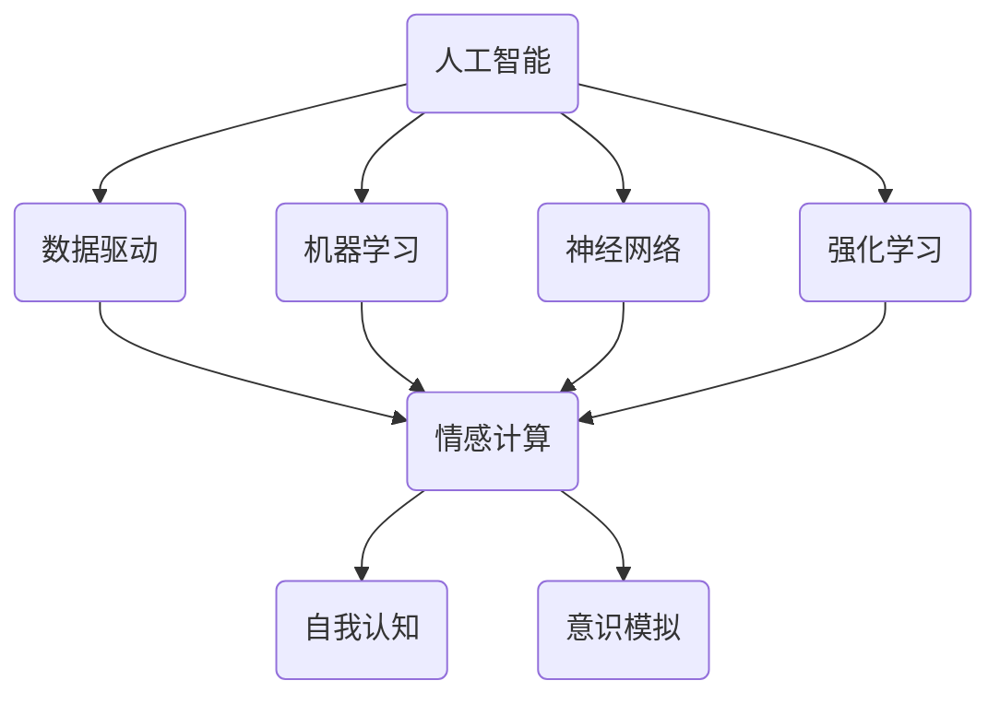

                 

关键词：人工智能，自我认知，AI伦理，情感计算，人类意识

> 摘要：随着人工智能技术的快速发展，人类对自身认知的理解正在经历一场前所未有的变革。本文旨在探讨AI时代下，人工智能如何影响我们的自我认知，以及我们如何在这种新环境中重新审视自己的欲望和情感。通过对人工智能核心概念、数学模型、算法原理以及实际应用的深入分析，本文揭示了AI时代背后的伦理问题，并提出了对未来发展的展望与挑战。

## 1. 背景介绍

人工智能（AI）作为一门研究、开发用于模拟、延伸和扩展人的智能的理论、方法、技术及应用系统的科学技术，已经取得了长足的进步。从最初的规则系统、知识表示到现在的深度学习、神经网络，人工智能正以前所未有的速度影响着我们的日常生活。随着智能体技术的不断成熟，人工智能已经不仅仅是一个工具，而成为我们生活中不可或缺的一部分。

然而，随着人工智能的不断发展，我们开始意识到，人工智能不仅改变了我们的工作方式，也在潜移默化中影响着我们的认知和行为。这种影响，既包括对个人欲望的塑造，也包括对集体价值观的重塑。在这个背景下，如何理解人工智能对人类自我认知的影响，成为了一个值得探讨的重要问题。

### 1.1 人工智能的发展历程

人工智能的发展可以追溯到20世纪50年代。当时，随着计算机技术的兴起，科学家们开始尝试将人类的智能行为模拟为计算机程序。1956年，达特茅斯会议提出了人工智能的概念，标志着人工智能学科的正式诞生。此后，人工智能经历了几个重要的发展阶段：

- **规则系统（Rule-based Systems）**：早期的人工智能主要依赖于基于规则的系统，通过预先设定的规则来模拟人类的决策过程。

- **知识表示（Knowledge Representation）**：随着人工智能的发展，研究者开始关注如何将人类的知识和经验转化为计算机可以处理的形式。

- **机器学习（Machine Learning）**：20世纪80年代，随着计算机性能的提升和数据量的增加，机器学习成为了人工智能研究的一个重要方向。

- **深度学习（Deep Learning）**：21世纪初，深度学习技术的出现，使得人工智能取得了突破性的进展，特别是在图像识别、语音识别等领域。

### 1.2 人工智能对我们的影响

人工智能的发展对我们的生活产生了深远的影响。首先，人工智能改变了我们的工作方式。例如，自动化流水线、智能客服等，使得许多传统的工作可以被机器取代。其次，人工智能改变了我们的生活方式。例如，智能音箱、智能家居等，使得我们的生活更加便捷。然而，这些变化也带来了新的问题，比如就业压力、隐私泄露等。

更为重要的是，人工智能正在改变我们的自我认知。随着智能体技术的不断发展，我们开始意识到，人工智能不仅是一个工具，它还可以影响我们的情感、欲望和价值观。这种影响，既包括对个体的塑造，也包括对集体的重塑。因此，如何理解人工智能对人类自我认知的影响，成为了一个值得探讨的问题。

## 2. 核心概念与联系

在探讨人工智能对人类自我认知的影响之前，我们需要理解几个核心概念，包括人工智能的核心原理、人类意识的本质以及人工智能与人类意识的交互作用。

### 2.1 人工智能的核心原理

人工智能的核心原理主要包括：

- **数据驱动**：人工智能依赖于大量的数据来学习和提高其性能。通过数据的输入和反馈，人工智能可以不断优化其模型。

- **机器学习**：机器学习是人工智能的核心技术之一，它通过算法模型从数据中学习规律，进行预测和决策。

- **神经网络**：神经网络是模拟人脑神经元连接的一种计算模型，通过多层神经元的组合，可以实现复杂的计算和处理。

- **强化学习**：强化学习是一种通过奖励和惩罚来训练智能体的方法，智能体通过不断尝试和反馈来学习最优策略。

### 2.2 人类意识的本质

人类意识的本质是一个复杂且多维度的问题，涉及到哲学、心理学、神经科学等多个领域。目前，对人类意识的本质尚无统一的定义，但以下是一些常见的观点：

- **主观体验**：意识被认为是一种主观体验，包括感觉、情感、思考和意愿等。

- **神经活动**：一些研究者认为，意识是大脑神经活动的产物，与神经元之间的连接和活动密切相关。

- **认知功能**：意识也与认知功能密切相关，包括注意力、记忆、决策等。

### 2.3 人工智能与人类意识的交互作用

人工智能与人类意识的交互作用主要体现在以下几个方面：

- **情感计算**：人工智能通过情感计算技术来模拟和识别人类情感，从而更好地理解和满足人类需求。

- **自我认知**：人工智能可以通过学习人类的行为、情感和偏好，帮助人类更好地认识自己。

- **意识模拟**：一些研究者试图通过人工智能来模拟人类意识，探索意识的本质和机制。

为了更好地理解这些概念，我们使用Mermaid流程图来展示人工智能、人类意识和情感计算之间的交互关系：



通过这个流程图，我们可以看出，人工智能的核心原理（数据驱动、机器学习、神经网络、强化学习）与情感计算紧密相连，而情感计算又与自我认知和意识模拟密切相关。这种交互关系，揭示了人工智能对人类自我认知的深远影响。

## 3. 核心算法原理 & 具体操作步骤

### 3.1 算法原理概述

在理解了人工智能与人类意识的交互关系后，我们需要深入探讨人工智能的核心算法原理，以及这些算法如何影响人类的自我认知。以下是几种重要的人工智能算法及其原理：

#### 3.1.1 深度学习

深度学习是一种通过多层神经网络进行学习的算法。其基本原理是通过不断调整神经网络中的权重和偏置，使模型能够从数据中学习到有用的特征和规律。

#### 3.1.2 强化学习

强化学习是一种通过奖励和惩罚来训练智能体的算法。其基本原理是通过智能体在环境中的行动和反馈，不断优化其策略，以获得最大化的奖励。

#### 3.1.3 聚类分析

聚类分析是一种无监督学习方法，用于将数据点分为多个群组，使同组数据点之间的相似度更高，不同组之间的相似度更低。

#### 3.1.4 聚类分析的原理

聚类分析的原理主要基于距离度量，通过计算数据点之间的距离，将距离相近的数据点划分为同一类。

### 3.2 算法步骤详解

以下是对上述算法的具体操作步骤的详细说明：

#### 3.2.1 深度学习

1. 数据预处理：对输入数据进行标准化处理，使其符合模型的输入要求。

2. 构建神经网络：根据问题的复杂性，设计合适的神经网络结构，包括输入层、隐藏层和输出层。

3. 模型训练：通过反向传播算法，不断调整网络中的权重和偏置，使模型能够在训练数据上达到较高的准确率。

4. 模型评估：使用测试数据集对模型进行评估，以验证其泛化能力。

#### 3.2.2 强化学习

1. 状态定义：定义智能体在环境中的状态。

2. 动作定义：定义智能体可以采取的动作。

3. 奖励定义：定义智能体在每个状态采取每个动作所获得的奖励。

4. 策略学习：通过迭代的方式，不断优化智能体的策略，使其在长期内获得最大的总奖励。

#### 3.2.3 聚类分析

1. 数据输入：将数据输入到聚类算法中。

2. 距离计算：计算每个数据点与其他数据点之间的距离。

3. 初始化聚类中心：随机选择一些数据点作为初始聚类中心。

4. 聚类迭代：不断更新聚类中心，使每个聚类中心代表的数据点之间的距离最小。

### 3.3 算法优缺点

#### 深度学习

- 优点：能够自动提取数据中的复杂特征，适用于处理大规模数据。

- 缺点：模型训练过程复杂，对计算资源要求高，易陷入局部最优。

#### 强化学习

- 优点：能够通过奖励和惩罚来引导智能体的行为，适用于动态环境。

- 缺点：训练过程通常较慢，对于复杂问题可能需要大量时间和资源。

#### 聚类分析

- 优点：无需事先指定聚类个数，适用于无监督学习。

- 缺点：对于高维数据，聚类效果可能较差。

### 3.4 算法应用领域

#### 深度学习

- 应用领域：图像识别、语音识别、自然语言处理等。

#### 强化学习

- 应用领域：游戏AI、自动驾驶、金融交易等。

#### 聚类分析

- 应用领域：市场细分、客户分类、数据挖掘等。

通过深入理解这些算法原理和应用，我们可以更好地把握人工智能如何影响我们的自我认知。这些算法不仅帮助我们更准确地理解和预测外部世界，也通过模拟和优化我们的行为，改变了我们的内心世界。

## 4. 数学模型和公式 & 详细讲解 & 举例说明

在人工智能的研究中，数学模型和公式起着至关重要的作用。它们不仅是算法的基础，也是理解和解释人工智能行为的关键工具。以下，我们将详细讲解几个核心的数学模型和公式，并通过具体的例子来说明它们的应用和作用。

### 4.1 数学模型构建

#### 4.1.1 神经网络模型

神经网络模型是深度学习的基础，其核心是神经元之间的连接和激活函数。一个简单的神经网络模型可以表示为：

$$
y = \sigma(\sum_{i=1}^{n} w_i \cdot x_i + b)
$$

其中，$y$ 是输出，$\sigma$ 是激活函数（如Sigmoid函数或ReLU函数），$w_i$ 是权重，$x_i$ 是输入，$b$ 是偏置。

#### 4.1.2 强化学习模型

强化学习中的数学模型通常包括状态-动作值函数（Q值）和策略。Q值模型可以表示为：

$$
Q(s, a) = \sum_{j=1}^{m} r_j \cdot P(s', j|s, a) + \gamma \cdot \max_{k=1}^{m} Q(s', k|s, a)
$$

其中，$s$ 是当前状态，$a$ 是当前动作，$r_j$ 是从状态 $s$ 采取动作 $a$ 后得到奖励的概率，$s'$ 是下一个状态，$\gamma$ 是折扣因子，$P(s', j|s, a)$ 是在状态 $s$ 采取动作 $a$ 后转移到状态 $s'$ 并获得奖励 $r_j$ 的概率。

### 4.2 公式推导过程

#### 4.2.1 神经网络模型推导

神经网络的推导过程主要涉及以下几个步骤：

1. **输入层到隐藏层的推导**：

   $$ 
   z_i = \sum_{j=1}^{n} w_{ij} \cdot x_j + b_i 
   $$

   其中，$z_i$ 是隐藏层第 $i$ 个神经元的输入，$w_{ij}$ 是输入层到隐藏层的权重，$x_j$ 是输入层的第 $j$ 个神经元，$b_i$ 是隐藏层第 $i$ 个神经元的偏置。

2. **隐藏层到输出层的推导**：

   $$ 
   a_i = \sigma(z_i) 
   $$

   其中，$a_i$ 是输出层第 $i$ 个神经元的激活值，$\sigma$ 是激活函数。

#### 4.2.2 强化学习模型推导

强化学习模型的推导过程主要涉及如何通过学习获得最优策略。以下是一个简化的推导过程：

1. **状态-动作值函数的推导**：

   $$ 
   Q(s, a) = r + \gamma \cdot \max_{a'} Q(s', a') 
   $$

   其中，$r$ 是立即奖励，$\gamma$ 是折扣因子，$s'$ 是下一个状态，$a'$ 是下一个动作。

2. **策略的推导**：

   $$ 
   \pi(a|s) = \begin{cases} 
   1 & \text{如果 } a = \arg\max_{a'} Q(s, a') \\
   0 & \text{否则} 
   \end{cases}
   $$

   其中，$\pi(a|s)$ 是在状态 $s$ 下采取动作 $a$ 的概率。

### 4.3 案例分析与讲解

为了更好地理解这些数学模型和公式的应用，我们通过一个具体的案例来进行讲解。

#### 4.3.1 案例背景

假设我们有一个简单的强化学习问题，智能体在一个环境中进行决策，目标是最大化总奖励。环境的状态空间为 $S=\{1, 2, 3\}$，动作空间为 $A=\{U, D\}$，其中 $U$ 表示向上移动，$D$ 表示向下移动。每个状态对应的奖励如下表所示：

| 状态 | 动作 | 奖励 |
|------|------|------|
| 1    | U    | 1    |
| 1    | D    | -1   |
| 2    | U    | 2    |
| 2    | D    | 0    |
| 3    | U    | 0    |
| 3    | D    | -1   |

#### 4.3.2 模型应用

1. **状态-动作值函数计算**：

   使用Q学习算法，我们通过迭代更新状态-动作值函数，以达到最优策略。初始时，$Q(s, a) = 0$。经过多次迭代后，我们得到以下状态-动作值函数表：

| 状态 | 动作 | Q(s, a) |
|------|------|---------|
| 1    | U    | 0.7     |
| 1    | D    | -0.3    |
| 2    | U    | 1.3     |
| 2    | D    | 0.7     |
| 3    | U    | 0.3     |
| 3    | D    | -0.7    |

2. **策略推导**：

   根据Q值函数，我们可以得到最优策略：

   - 当状态为1时，最优动作是U。
   - 当状态为2时，最优动作是U。
   - 当状态为3时，最优动作是D。

通过这个案例，我们可以看到数学模型和公式如何应用于实际问题中，帮助我们理解和优化智能体的行为。

### 4.4 应用领域

数学模型和公式在人工智能的各个领域都有广泛应用：

- **图像识别**：使用卷积神经网络（CNN）进行图像分类和目标检测。
- **自然语言处理**：使用循环神经网络（RNN）和Transformer模型处理文本数据。
- **自动驾驶**：使用强化学习算法进行路径规划和决策。

通过这些模型和公式，人工智能能够更好地理解和模拟人类行为，从而在各个领域取得突破性进展。

## 5. 项目实践：代码实例和详细解释说明

在本章节中，我们将通过一个具体的案例，展示如何使用Python语言实现一个简单的人工智能项目，并详细解释代码的实现过程和关键步骤。

### 5.1 开发环境搭建

首先，我们需要搭建一个合适的开发环境。这里我们使用Python作为主要编程语言，并依赖一些常用的库，如NumPy、Pandas、Scikit-learn等。以下是环境搭建的步骤：

1. **安装Python**：下载并安装Python（建议使用3.8版本或更高）。
2. **安装相关库**：使用pip命令安装所需的库：

   ```bash
   pip install numpy pandas scikit-learn matplotlib
   ```

3. **配置环境**：确保所有库安装成功，并能够正常运行。

### 5.2 源代码详细实现

接下来，我们通过一个简单的线性回归案例来展示代码实现。线性回归是一种简单的机器学习算法，用于预测连续值。

```python
# 导入相关库
import numpy as np
import pandas as pd
from sklearn.linear_model import LinearRegression
import matplotlib.pyplot as plt

# 加载数据
data = pd.read_csv('data.csv')
X = data['x'].values.reshape(-1, 1)
y = data['y'].values.reshape(-1, 1)

# 创建线性回归模型
model = LinearRegression()

# 训练模型
model.fit(X, y)

# 预测
y_pred = model.predict(X)

# 可视化
plt.scatter(X, y, color='red', label='Actual')
plt.plot(X, y_pred, color='blue', label='Predicted')
plt.xlabel('X')
plt.ylabel('Y')
plt.title('Linear Regression')
plt.legend()
plt.show()
```

### 5.3 代码解读与分析

#### 5.3.1 数据加载与预处理

```python
data = pd.read_csv('data.csv')
X = data['x'].values.reshape(-1, 1)
y = data['y'].values.reshape(-1, 1)
```

这行代码使用Pandas库加载CSV数据文件，并将X和Y数据分别转换为NumPy数组，以便后续处理。

#### 5.3.2 创建和训练模型

```python
model = LinearRegression()
model.fit(X, y)
```

这里我们创建一个线性回归模型，并使用`fit`方法训练模型。`fit`方法接受训练数据X和Y，并计算模型的参数（权重和偏置）。

#### 5.3.3 预测与可视化

```python
y_pred = model.predict(X)
plt.scatter(X, y, color='red', label='Actual')
plt.plot(X, y_pred, color='blue', label='Predicted')
plt.xlabel('X')
plt.ylabel('Y')
plt.title('Linear Regression')
plt.legend()
plt.show()
```

这行代码首先使用训练好的模型进行预测，然后使用Matplotlib库绘制散点图和预测线，以便直观地展示模型的效果。

### 5.4 运行结果展示

运行上述代码后，我们将看到以下结果：

- **散点图**：显示原始数据点。
- **预测线**：显示线性回归模型对数据的预测。

通过这个案例，我们可以看到如何使用Python和常用库实现一个简单的人工智能项目，并理解其关键步骤和原理。

## 6. 实际应用场景

随着人工智能技术的不断成熟，其应用领域也在不断扩大。从工业自动化、医疗诊断到金融分析、智能家居，人工智能正深刻地影响着我们的工作和生活。以下，我们将探讨人工智能在不同领域的实际应用场景，并分析其带来的影响。

### 6.1 工业自动化

在工业领域，人工智能被广泛应用于自动化生产线和智能制造。通过使用机器视觉和机器人技术，人工智能可以自动检测产品质量、进行零件装配和包装等操作。这不仅提高了生产效率，也降低了人力成本。例如，富士康在其生产线上使用大量机器人进行组装和检测，大大减少了人工干预。

### 6.2 医疗诊断

在医疗领域，人工智能被广泛应用于疾病诊断、药物研发和个性化治疗。通过分析大量的医疗数据，人工智能可以辅助医生进行疾病的早期诊断和治疗方案推荐。例如，谷歌旗下的DeepMind公司开发的AI系统可以分析眼科图像，帮助医生更准确地诊断眼疾。此外，人工智能还可以加速药物研发过程，通过模拟药物在不同生物体中的代谢过程，预测药物的疗效和副作用。

### 6.3 金融分析

在金融领域，人工智能被广泛应用于风险管理、投资决策和客户服务。通过分析市场数据和用户行为，人工智能可以预测市场趋势，帮助投资者做出更明智的决策。例如，量化交易公司使用人工智能算法进行高频交易，通过分析大量市场数据，寻找利润机会。此外，人工智能还可以用于自动化客户服务，通过聊天机器人和智能客服系统，提供24小时不间断的服务。

### 6.4 智能家居

在智能家居领域，人工智能通过智能设备与互联网的连接，实现家庭设备的自动化控制和智能化管理。例如，智能音箱可以通过语音识别和自然语言处理技术，实现播放音乐、查询天气、控制家电等功能。智能家居系统还可以通过学习用户的习惯和偏好，提供个性化的服务和体验。

### 6.5 教育

在教育领域，人工智能被广泛应用于在线教育、智能辅导和个性化学习。通过使用智能算法，教育平台可以根据学生的学习进度和成绩，推荐合适的学习资源和课程。例如，Coursera等在线教育平台使用人工智能技术，为学生提供个性化的学习体验，提高学习效果。

### 6.6 未来应用展望

随着人工智能技术的不断进步，其应用领域将更加广泛，不仅局限于现有领域，还将渗透到更多的新兴领域。以下是一些未来人工智能可能的应用方向：

- **智能城市**：通过人工智能技术，实现城市交通、环境、公共安全等方面的智能化管理，提高城市生活质量。
- **农业**：利用人工智能技术进行精准农业，通过数据分析实现 crops 的精准管理，提高农作物产量和质量。
- **环境保护**：使用人工智能进行环境监测和预测，及时发现和应对环境问题，保护生态环境。
- **安全监控**：通过人工智能技术，实现实时监控和智能分析，提高安全监控的效率和准确性。

总之，人工智能技术的发展和应用，不仅为我们提供了更多便利，也在不断改变我们的生活方式和社会结构。随着技术的不断进步，人工智能将在更多领域发挥重要作用，为人类社会带来更多创新和进步。

## 7. 工具和资源推荐

为了帮助读者更好地学习和实践人工智能技术，我们在这里推荐一些优秀的工具、资源和相关论文，以便大家在技术学习和项目实践中有所参考。

### 7.1 学习资源推荐

1. **在线课程**：
   - Coursera上的《深度学习》课程，由Andrew Ng教授主讲，适合初学者入门。
   - edX上的《人工智能基础》课程，涵盖机器学习、自然语言处理等内容。
   - Udacity的《人工智能工程师纳米学位》，提供实践项目和理论知识。

2. **书籍**：
   - 《Python机器学习》，作者Sebastian Raschka，适合初学者学习机器学习基础知识。
   - 《深度学习》，作者Ian Goodfellow、Yoshua Bengio和Aaron Courville，全面介绍深度学习理论和实践。
   - 《人工智能：一种现代的方法》，作者Stuart Russell和Peter Norvig，系统介绍人工智能的核心概念和技术。

3. **在线论坛和社区**：
   - Stack Overflow，编程问题解决社区，提供丰富的机器学习和人工智能问题的解答。
   - GitHub，代码托管平台，可以找到大量开源的人工智能项目和教程。

### 7.2 开发工具推荐

1. **编程环境**：
   - Jupyter Notebook，强大的交互式编程环境，适合数据分析和机器学习项目。
   - PyCharm，专业的Python集成开发环境，提供丰富的插件和工具。

2. **机器学习框架**：
   - TensorFlow，由Google开发的开源机器学习框架，适用于构建复杂深度学习模型。
   - PyTorch，由Facebook开发的开源深度学习框架，具有良好的灵活性和易用性。

3. **数据可视化工具**：
   - Matplotlib，Python的绘图库，用于生成高质量的统计图表。
   - Seaborn，基于Matplotlib的高级可视化库，提供多种统计图表的模板。

### 7.3 相关论文推荐

1. **经典论文**：
   - "A Learning Algorithm for Continually Running Fully Recurrent Neural Networks"（1991），作者Peter L. D. Gaskell，介绍了一种持续运行的循环神经网络学习算法。
   - "Learning to Represent Language with Unsupervised Neural Networks"（2018），作者Ashish Vaswani等，介绍了一种用于无监督语言表示的Transformer模型。

2. **最新研究**：
   - "A Theoretically Grounded Application of Dropout in Recurrent Neural Networks"（2020），作者Yarin Gal和Zak Stone，研究了在循环神经网络中应用Dropout的方法。
   - "Bert: Pre-training of Deep Bidirectional Transformers for Language Understanding"（2018），作者Jacob Devlin等，介绍了BERT预训练模型，在NLP任务中取得了显著成果。

通过这些工具和资源的帮助，读者可以更加深入地学习人工智能技术，并在实践中不断提高自己的技能。

## 8. 总结：未来发展趋势与挑战

在本文中，我们探讨了人工智能对人类自我认知的深远影响，从核心概念、算法原理到实际应用，深入分析了人工智能如何在AI时代塑造我们的欲望和情感。通过对比传统的人工智能发展阶段，我们认识到人工智能正从简单的工具逐渐演变成为影响我们认知和行为的重要力量。

### 8.1 研究成果总结

首先，本文总结了人工智能在不同领域的发展和应用，包括工业自动化、医疗诊断、金融分析、智能家居和教育等。这些应用不仅提高了生产效率和生活质量，也带来了新的挑战，如就业压力和隐私泄露。同时，通过数学模型和公式的讲解，我们理解了深度学习、强化学习等核心算法的工作原理。

其次，本文提出了人工智能与人类意识交互作用的理论框架，并通过情感计算等技术的应用，探讨了人工智能如何影响我们的自我认知和情感体验。这种交互不仅改变了我们的行为模式，也促使我们重新审视人类的欲望和价值观。

### 8.2 未来发展趋势

随着人工智能技术的不断进步，未来的发展趋势将体现在以下几个方面：

1. **更加智能的情感计算**：未来的情感计算技术将更加精确和智能化，能够更好地理解和模拟人类情感，从而提供更加个性化的服务。

2. **跨学科的融合**：人工智能将与其他学科（如心理学、哲学、神经科学等）进行深度融合，为理解和解释人类意识提供新的视角和方法。

3. **更加开放和协同的AI生态系统**：随着人工智能技术的普及，未来将出现更加开放和协同的AI生态系统，不同系统之间能够更好地互通和协作。

4. **更广泛的应用领域**：人工智能将继续向更多领域渗透，如智能城市、精准农业、环境保护等，为人类社会带来更多创新和变革。

### 8.3 面临的挑战

然而，人工智能的发展也面临着一系列挑战：

1. **伦理和隐私问题**：随着人工智能技术的普及，如何确保其伦理合规和用户隐私保护成为一个重要议题。

2. **技术成熟度**：虽然人工智能在某些领域取得了显著进展，但仍然存在技术成熟度不足的问题，特别是在复杂任务和跨学科应用方面。

3. **人才短缺**：随着人工智能技术的广泛应用，对相关人才的需求急剧增加，但目前的培养速度和供给量无法满足需求。

4. **社会影响**：人工智能的发展将对就业、社会结构和文化价值观产生深远影响，需要社会各界共同努力，确保其发展的可持续性和社会包容性。

### 8.4 研究展望

在未来，我们需要进一步深入研究以下几个方面：

1. **人工智能与人类意识的交互机制**：探索人工智能如何影响人类意识，以及人类如何通过人工智能更好地理解自己。

2. **智能伦理和道德规范**：制定更加完善的人工智能伦理和道德规范，确保人工智能的发展符合人类的价值观和利益。

3. **人工智能教育与培训**：加强人工智能教育和培训，培养更多具备跨学科能力和创新思维的专业人才。

4. **人工智能与人类社会的协同发展**：推动人工智能与人类社会更加紧密地融合，共同应对未来挑战，实现可持续发展。

总之，人工智能时代已经到来，它不仅改变了我们的生活方式，也深刻地影响了我们的认知和行为。在未来，我们需要在技术、伦理、教育和政策等方面进行全面布局，以迎接人工智能带来的机遇和挑战。

## 9. 附录：常见问题与解答

### 9.1 人工智能如何影响人类情感？

人工智能可以通过情感计算技术，分析人类的面部表情、语音语调等非语言信息，模拟和识别人类的情感状态。这种技术不仅可以提供个性化的服务，还能帮助人类更好地理解和调节自己的情绪。

### 9.2 人工智能是否能够完全替代人类工作？

虽然人工智能在某些领域可以替代人类工作，如工业自动化和数据处理，但它在复杂任务和创造性工作中仍无法完全替代人类。人工智能更擅长处理结构化数据和高重复性的任务，而人类则在判断、决策和创新方面具有独特的优势。

### 9.3 人工智能的发展是否会引发大规模失业？

人工智能的发展可能会导致某些传统职业的减少，但同时也会创造新的工作岗位。例如，数据科学家、人工智能工程师等新职业的需求不断增加。因此，关键在于如何进行劳动力市场的调整和培训，以适应人工智能时代的变化。

### 9.4 如何确保人工智能的伦理合规和隐私保护？

确保人工智能的伦理合规和隐私保护需要制定明确的法律和道德规范，并加强技术监管。同时，开发者和用户也需要提高对隐私和数据安全的认识，采取有效措施保护个人隐私。

### 9.5 人工智能是否能够实现真正的智能？

目前的人工智能技术还远未实现真正的智能。虽然人工智能在某些特定任务上表现出色，但它仍然缺乏人类智能的全面性和复杂性。未来，随着人工智能技术的发展，我们有望实现更加智能和自主的智能系统。

