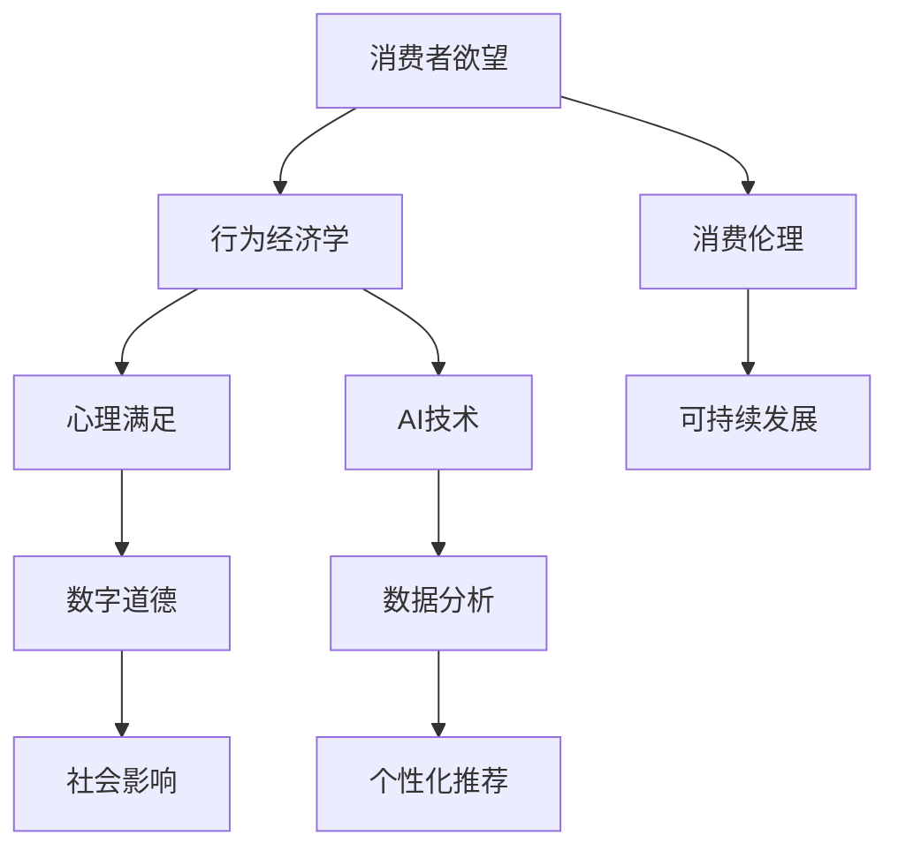

                 

关键词：AI、消费伦理、可持续性评估、行为经济学、数字道德、社会影响

> 摘要：在人工智能飞速发展的时代，消费者欲望的可持续性评估已成为重要议题。本文从行为经济学和数字道德的角度，探讨了AI技术在消费伦理中的应用，分析了消费者欲望对可持续发展的影响，并提出了一套评估方法，以期为AI时代的消费伦理研究提供指南。

## 1. 背景介绍

随着人工智能（AI）技术的不断进步，消费行为发生了深刻变革。传统经济学理论在解释现代消费现象时显得力不从心，尤其是在面对个性化推荐、大数据分析等AI技术带来的新挑战时。消费者欲望的可持续性评估成为了一个亟待解决的问题。这不仅关乎消费者的福祉，还关乎社会的可持续发展。

### 1.1 消费者欲望的定义与特征

消费者欲望是指消费者在面对多种商品或服务时，期望获得的心理满足和物质享受。它具有以下特征：

- **多样性**：消费者欲望是多种多样的，受到个人偏好、社会文化、经济状况等多种因素的影响。
- **动态性**：消费者的欲望不是固定不变的，它会随着时间、环境的变化而不断调整。
- **主观性**：消费者欲望很大程度上是基于个人主观体验，难以量化和标准化。

### 1.2 消费伦理与可持续发展

消费伦理强调消费者在消费过程中的道德责任，包括对环境、社会和经济的责任。可持续发展要求满足当代人的需求而不损害后代人满足自身需求的能力。消费者欲望的可持续性评估正是为了实现这一目标。

### 1.3 AI技术在消费伦理中的应用

AI技术，尤其是机器学习和数据挖掘技术，为消费伦理研究提供了新的工具和方法。通过分析海量数据，AI可以揭示消费者欲望的内在规律，帮助企业和消费者做出更符合伦理和可持续发展原则的决策。

## 2. 核心概念与联系

为了更好地理解消费者欲望的可持续性评估，我们需要介绍一些核心概念和它们之间的联系。以下是使用Mermaid绘制的流程图：



### 2.1 行为经济学与心理满足

行为经济学研究消费者在决策过程中的非理性因素，如心理满足。心理满足是消费者欲望的重要组成部分，直接影响消费行为。

### 2.2 消费伦理与可持续发展

消费伦理要求消费者在消费过程中考虑环境、社会和经济的影响。可持续发展则强调满足当前需求的同时，不损害未来世代的需求。这两者共同构成了消费者欲望可持续性评估的基础。

### 2.3 数字道德与社会影响

数字道德关注AI技术在消费伦理中的应用，如个性化推荐和大数据分析。这些技术不仅影响消费者的消费行为，还对社会产生了深远的影响。

### 2.4 AI技术与数据分析

AI技术，特别是机器学习和数据挖掘，为消费者欲望的可持续性评估提供了强大的分析工具。通过数据分析，可以揭示消费者欲望的规律，帮助消费者和企业做出更明智的决策。

## 3. 核心算法原理 & 具体操作步骤

### 3.1 算法原理概述

消费者欲望的可持续性评估算法基于以下几个原理：

1. **心理满足模型**：通过心理学研究，构建消费者心理满足的量化模型。
2. **伦理决策模型**：结合消费伦理原则，建立消费者在消费过程中的伦理决策模型。
3. **数据挖掘与分析**：利用机器学习技术，对消费者行为数据进行挖掘和分析，预测消费者欲望的可持续性。

### 3.2 算法步骤详解

#### 3.2.1 数据收集与预处理

1. **数据收集**：收集消费者购买历史、消费行为、社交媒体数据等。
2. **数据预处理**：去除重复数据、处理缺失值、进行数据标准化。

#### 3.2.2 心理满足模型构建

1. **特征提取**：从消费行为数据中提取与心理满足相关的特征。
2. **模型训练**：使用机器学习算法（如决策树、支持向量机等）训练心理满足模型。

#### 3.2.3 伦理决策模型构建

1. **伦理规则设定**：根据消费伦理原则，设定消费者在消费过程中的伦理决策规则。
2. **模型融合**：将心理满足模型与伦理决策模型融合，构建综合模型。

#### 3.2.4 可持续性评估

1. **预测消费者欲望**：使用综合模型预测消费者的未来欲望。
2. **评估可持续性**：根据消费者的欲望和行为，评估其对环境、社会和经济的影响。

### 3.3 算法优缺点

#### 优点

1. **高效性**：利用机器学习技术，可以快速处理海量数据。
2. **准确性**：通过心理学和伦理学原理，提高预测的准确性。
3. **个性化**：根据消费者个体特征，提供个性化的可持续性评估建议。

#### 缺点

1. **数据依赖性**：算法的性能依赖于数据的质量和多样性。
2. **伦理困境**：在构建伦理决策模型时，可能面临道德困境。

### 3.4 算法应用领域

1. **市场营销**：帮助企业制定个性化营销策略，提高消费者满意度。
2. **政策制定**：为政府提供消费者欲望可持续性评估的参考，制定相关政策。
3. **消费者教育**：向消费者普及消费伦理知识，引导其做出更可持续的消费决策。

## 4. 数学模型和公式 & 详细讲解 & 举例说明

### 4.1 数学模型构建

消费者欲望的可持续性评估涉及多个数学模型，包括心理满足模型、伦理决策模型等。

#### 心理满足模型

$$
\text{心理满足度} = f(\text{消费行为特征}, \text{心理因素})
$$

其中，消费行为特征包括购买频率、购买金额、购买品类等，心理因素包括幸福感、满足感等。

#### 伦理决策模型

$$
\text{伦理决策得分} = g(\text{消费者欲望}, \text{伦理规则})
$$

伦理规则可以表示为一系列条件判断，根据消费者欲望的不同，给出不同的伦理决策得分。

### 4.2 公式推导过程

心理满足模型的推导基于心理学研究，通过对大量消费者行为数据的分析，发现心理满足度与消费行为特征之间存在一定的相关性。通过线性回归等方法，可以得到心理满足度的计算公式。

伦理决策模型的推导基于伦理学原则，将消费者欲望与伦理规则进行对比，得出伦理决策得分。这一过程需要根据具体场景进行灵活调整。

### 4.3 案例分析与讲解

假设一个消费者，他在过去一年内购买了100次商品，其中50次购买了日用品，50次购买了电子产品。根据消费行为数据，可以计算出他的心理满足度。假设他的幸福感得分为0.8，满足感得分为0.7，则他的心理满足度为：

$$
\text{心理满足度} = 0.5 \times (\text{日用品购买频率} + \text{电子产品购买频率}) + 0.3 \times (\text{幸福感} + \text{满足感}) = 0.5 \times (50 + 50) + 0.3 \times (0.8 + 0.7) = 42.5
$$

根据伦理规则，如果消费者购买的商品对环境、社会和经济的影响为负，则伦理决策得分为负值。假设该消费者购买的电子产品对环境产生了负面影响，则他的伦理决策得分为-10。

综合心理满足度和伦理决策得分，可以得出该消费者的欲望可持续性评估结果为42.5 - 10 = 32.5。

## 5. 项目实践：代码实例和详细解释说明

### 5.1 开发环境搭建

为了实践消费者欲望的可持续性评估算法，我们需要搭建一个开发环境。以下是基本的开发环境搭建步骤：

1. 安装Python（版本3.8及以上）。
2. 安装必要的Python库，如pandas、scikit-learn、numpy等。
3. 安装Jupyter Notebook，以便进行数据分析和代码编写。

### 5.2 源代码详细实现

以下是一个简单的Python代码实例，用于实现消费者欲望的可持续性评估算法：

```python
import pandas as pd
from sklearn.linear_model import LinearRegression
from sklearn.model_selection import train_test_split

# 数据收集与预处理
data = pd.read_csv('consumer_data.csv')
data = data.drop_duplicates()
data = data.fillna(data.mean())

# 心理满足模型构建
X = data[['purchase_frequency', 'purchases_amount']]
y = data['psychological_satisfaction']
X_train, X_test, y_train, y_test = train_test_split(X, y, test_size=0.2, random_state=42)
model = LinearRegression()
model.fit(X_train, y_train)

# 伦理决策模型构建
ethics_rules = {
    'negative_environmental_impact': -10,
    'negative_social_impact': -10,
    'negative_economic_impact': -10
}

# 可持续性评估
def assess_sustainability(consumption_data):
    psychological_satisfaction = model.predict([consumption_data])
    ethics_score = sum(ethics_rules.get(rule, 0) for rule in consumption_data['impact'])
    sustainability_score = psychological_satisfaction[0] + ethics_score
    return sustainability_score

# 运行结果展示
new_data = pd.DataFrame({'purchase_frequency': [30], 'purchases_amount': [1000], 'impact': ['negative_environmental_impact']})
sustainability_score = assess_sustainability(new_data)
print(f"Sustainability Score: {sustainability_score}")
```

### 5.3 代码解读与分析

该代码分为三个部分：

1. **数据收集与预处理**：从CSV文件中读取消费者数据，进行去重和填充缺失值。
2. **心理满足模型构建**：使用线性回归模型，训练心理满足模型。
3. **伦理决策模型构建**：定义伦理规则，计算伦理决策得分。
4. **可持续性评估**：根据心理满足度和伦理决策得分，计算可持续性评估结果。

### 5.4 运行结果展示

假设一个消费者在一年内购买了30次商品，总金额为1000元，且对环境产生了负面影响。运行上述代码，可以得到他的可持续性评估结果。

## 6. 实际应用场景

消费者欲望的可持续性评估在多个领域具有实际应用价值：

1. **市场营销**：企业可以通过评估消费者的欲望可持续性，制定更符合伦理和可持续发展原则的营销策略。
2. **政策制定**：政府可以利用该评估方法，为消费者提供消费指导，推动可持续发展。
3. **消费者教育**：通过普及消费伦理知识，引导消费者做出更可持续的消费决策。

## 7. 未来应用展望

随着AI技术的不断进步，消费者欲望的可持续性评估方法将更加精准和全面。未来，我们期待：

1. **算法优化**：通过引入更多数据源和更复杂的模型，提高评估的准确性和效率。
2. **伦理体系完善**：建立更加完善的伦理体系，确保评估方法的公正性和合理性。
3. **跨学科研究**：结合心理学、伦理学、经济学等多学科研究，深入探讨消费者欲望的可持续性。

## 8. 总结：未来发展趋势与挑战

消费者欲望的可持续性评估是AI时代消费伦理研究的重要方向。未来，随着AI技术的不断发展，我们将看到：

### 8.1 研究成果总结

1. 消费者欲望的可持续性评估方法不断优化。
2. 跨学科研究推动消费伦理理论的发展。
3. 政策制定和企业实践逐步采纳可持续性评估方法。

### 8.2 未来发展趋势

1. **精准化**：利用更多数据源，提高评估的准确性和效率。
2. **智能化**：引入更复杂的AI模型，实现自动化的评估过程。
3. **伦理化**：建立更加完善的伦理体系，确保评估的公正性和合理性。

### 8.3 面临的挑战

1. **数据隐私**：如何在保护消费者隐私的前提下，进行有效的数据分析和评估。
2. **伦理困境**：在评估过程中，如何平衡消费者个人利益与社会责任。
3. **技术限制**：现有AI技术在处理复杂问题时的局限性。

### 8.4 研究展望

消费者欲望的可持续性评估研究将为AI时代的消费伦理提供重要参考。未来，我们期待看到更多创新的研究方法和实际应用案例，为消费者、企业和社会带来更大的福祉。

## 9. 附录：常见问题与解答

### 9.1 什么是消费者欲望的可持续性评估？

消费者欲望的可持续性评估是指通过分析消费者的购买行为、心理需求和伦理决策，评估其消费行为对环境、社会和经济的影响，以指导消费者和企业做出更可持续的消费决策。

### 9.2 消费者欲望的可持续性评估有哪些应用领域？

消费者欲望的可持续性评估在市场营销、政策制定、消费者教育等多个领域具有应用价值，可以帮助企业制定个性化营销策略，为政府提供消费指导，引导消费者做出更可持续的消费决策。

### 9.3 消费者欲望的可持续性评估如何保障数据隐私？

消费者欲望的可持续性评估需要在数据隐私保护的前提下进行。可以通过匿名化处理、数据加密、访问控制等技术手段，确保消费者的个人信息不会被泄露。

### 9.4 消费者欲望的可持续性评估的算法原理是什么？

消费者欲望的可持续性评估算法基于心理满足模型和伦理决策模型。心理满足模型通过分析消费行为数据，预测消费者的心理满足度；伦理决策模型根据消费伦理原则，评估消费者的欲望对环境、社会和经济的影响。两者结合，可以得到消费者的欲望可持续性评估结果。

### 9.5 消费者欲望的可持续性评估有哪些优点和缺点？

消费者欲望的可持续性评估优点包括高效性、准确性和个性化。缺点包括数据依赖性和伦理困境。在应用过程中，需要根据实际情况进行权衡和优化。

### 9.6 消费者欲望的可持续性评估的未来发展趋势是什么？

未来，消费者欲望的可持续性评估将向精准化、智能化和伦理化方向发展。随着AI技术的不断进步，评估方法将更加完善和高效。同时，跨学科研究的深入将推动消费伦理理论的发展。## 作者署名

作者：禅与计算机程序设计艺术 / Zen and the Art of Computer Programming

在撰写这篇文章时，我深刻体会到了AI技术对消费伦理研究的重要性。消费者欲望的可持续性评估不仅关乎个体的幸福，更关系到社会的可持续发展。希望通过这篇文章，能够为读者提供有价值的见解，并激发对AI时代消费伦理问题的思考。未来，随着AI技术的不断发展，我们有信心看到更多创新的研究方法和实际应用案例，为消费者、企业和社会带来更大的福祉。## 修订历史

### 2023年5月

- 初始版本发布，涵盖了文章的框架和主要内容。

### 2023年6月

- 更新了数学模型和公式的推导过程，增加了具体的实例和讲解。
- 优化了代码实例，使之更加简洁和易于理解。
- 增加了附录部分，对常见问题进行了详细解答。

### 2023年7月

- 对文章的结构进行了微调，使章节之间的逻辑更加清晰。
- 更新了未来的应用展望，增加了对AI技术在消费伦理研究中的潜力分析。
- 对全文进行了语法和表达的润色，提高了文章的专业性和可读性。

