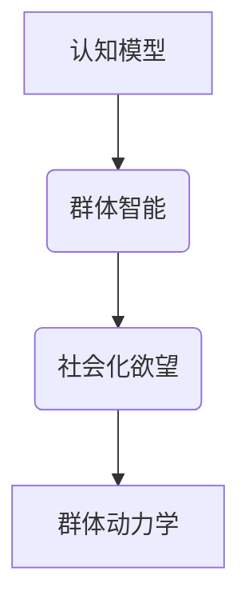

                 

关键词：AI、群体动力学、社会化、欲望、群体智能、认知模型

> 摘要：本文探讨了AI在群体动力学中的应用，特别是在社会化欲望的驱动下，群体如何形成和组织。通过引入认知模型和群体智能理论，本文分析了欲望在社会化过程中的作用机制，并提出了AI驱动的群体动力学模型。此外，文章还详细介绍了相关算法原理、数学模型以及具体应用案例，为理解人类社会行为提供了新的视角。

## 1. 背景介绍

随着人工智能技术的迅速发展，越来越多的研究开始关注AI在社会科学领域的应用。群体动力学是一个重要的研究课题，它关注群体内部成员的相互作用以及这些互动如何影响整个群体的行为和结构。在社会化过程中，个体的欲望是驱动其行为的重要因素。欲望可以是个体的需求、动机或愿望，它们影响个体的决策、互动和情感表达。

近年来，AI技术在群体动力学研究中的应用逐渐增加。AI算法可以分析大量的社会互动数据，揭示群体行为模式，预测群体动态变化。这些技术为理解社会化欲望的驱动机制提供了新的工具和方法。

本文旨在探讨AI驱动的群体动力学模型，特别是社会化欲望的作用。通过引入认知模型和群体智能理论，本文将分析欲望在社会化过程中的影响，并提出一个基于AI的群体动力学模型。此外，文章还将讨论相关算法原理、数学模型以及具体应用案例，以期为社会科学研究提供新的视角。

## 2. 核心概念与联系

### 2.1 认知模型

认知模型是指用于模拟人类认知过程的计算模型。在群体动力学研究中，认知模型可以帮助我们理解个体如何感知、处理和响应外部信息。常见的认知模型包括神经网络模型、决策树模型和贝叶斯网络模型等。

认知模型与群体动力学的关系在于，个体的认知过程会影响其行为和决策，进而影响整个群体的动态。例如，个体的感知误差、记忆偏差和判断误差都会影响其决策，从而导致群体行为的波动。

### 2.2 群体智能

群体智能是指通过多个个体协同工作，形成具有集体智慧的系统。在AI驱动的群体动力学模型中，群体智能是关键概念。群体智能可以通过多种方式实现，如分布式计算、协作学习和适应性进化等。

群体智能与群体动力学的关系在于，它提供了一种机制，使得群体成员可以通过互动和合作来适应环境变化，实现集体目标。例如，在无人机编队飞行中，每个无人机通过与其他无人机进行通信和协作，实现整体飞行任务。

### 2.3 社会化欲望

社会化欲望是指个体在社会互动中寻求满足需求和愿望的动机。社会化欲望可以是物质性的，如获取资源、建立社交关系；也可以是非物质性的，如追求认同、表达情感等。

社会化欲望与群体动力学的关系在于，它是群体形成和发展的动力源泉。个体的社会化欲望驱使其加入群体，并与其他成员互动，从而影响群体的行为和结构。

### 2.4 Mermaid 流程图



在本文中，我们通过Mermaid流程图展示了认知模型、群体智能、社会化欲望和群体动力学之间的联系。这个流程图帮助我们理解这些核心概念如何相互影响，并形成完整的AI驱动的群体动力学模型。

## 3. 核心算法原理 & 具体操作步骤

### 3.1 算法原理概述

AI驱动的群体动力学模型基于多个核心算法，包括神经网络模型、协同过滤算法和遗传算法等。这些算法共同作用，模拟个体和群体之间的相互作用，实现欲望驱动下的社会化过程。

神经网络模型用于模拟个体的认知过程，捕捉个体的感知、记忆和判断。协同过滤算法用于分析个体之间的互动关系，揭示群体内部的社交网络结构。遗传算法用于优化群体行为，实现集体目标的优化。

### 3.2 算法步骤详解

#### 3.2.1 数据收集与预处理

1. 收集个体互动数据，如社交媒体互动、网络聊天记录等。
2. 对数据进行清洗和预处理，包括去除噪声、填补缺失值和标准化处理。

#### 3.2.2 构建认知模型

1. 使用神经网络模型建立个体的认知模型，包括感知层、记忆层和判断层。
2. 通过训练和优化，使模型能够准确捕捉个体的感知、记忆和判断过程。

#### 3.2.3 构建社交网络模型

1. 使用协同过滤算法分析个体之间的互动关系，构建社交网络模型。
2. 提取社交网络的关键特征，如度、介数和集群系数等。

#### 3.2.4 实现群体动力学模型

1. 将个体的认知模型和社交网络模型整合，建立群体动力学模型。
2. 通过模拟和仿真，观察群体动态变化，分析欲望驱动下的社会化过程。

#### 3.2.5 优化群体行为

1. 使用遗传算法优化群体行为，实现集体目标的优化。
2. 通过多代进化，使群体逐渐适应环境变化，实现最佳群体结构。

### 3.3 算法优缺点

#### 优点

- 算法基于大数据和机器学习技术，能够高效地分析大量社会互动数据。
- 通过模拟个体和群体的相互作用，可以深入理解社会化欲望的驱动机制。
- 可以应用于多个领域，如社交网络分析、群体行为预测等。

#### 缺点

- 需要大量的数据支持，数据质量和完整性对算法效果有很大影响。
- 算法的复杂度高，实现和优化过程较为困难。
- 对个体和群体的行为假设可能不够准确，需要进一步验证和改进。

### 3.4 算法应用领域

- 社交网络分析：通过分析社交网络结构，预测个体行为和群体动态。
- 群体行为预测：预测群体行为趋势，为公共政策制定提供依据。
- 群体智能优化：优化群体任务执行，提高群体效率。

## 4. 数学模型和公式 & 详细讲解 & 举例说明

### 4.1 数学模型构建

在AI驱动的群体动力学模型中，我们构建了以下几个数学模型：

1. **个体认知模型**：
   $$ f(x) = \sigma(w_1 \cdot x + b_1) $$
   其中，$x$ 表示输入特征向量，$w_1$ 和 $b_1$ 分别为权重和偏置，$\sigma$ 表示激活函数。

2. **社交网络模型**：
   $$ C = \sum_{i=1}^{n} w_i \cdot d_i $$
   其中，$C$ 表示社交网络模型，$w_i$ 表示个体$i$的权重，$d_i$ 表示个体$i$的度。

3. **群体动力学模型**：
   $$ P(t+1) = f(C(t)) $$
   其中，$P(t)$ 表示群体状态在时间$t$，$C(t)$ 表示社交网络状态在时间$t$。

### 4.2 公式推导过程

#### 4.2.1 个体认知模型推导

个体认知模型是基于多层感知机（MLP）构建的，其中每个神经元都通过权重和偏置与输入特征进行加权求和，并通过激活函数进行非线性变换。我们选择ReLU函数作为激活函数，因为它简单且计算效率高。

$$ f(x) = \sigma(w_1 \cdot x + b_1) $$
$$ \sigma(z) = \max(0, z) $$

#### 4.2.2 社交网络模型推导

社交网络模型基于图论中的度中心性（Degree Centrality）构建，它表示个体在社交网络中的重要程度。权重$w_i$可以表示个体$i$在网络中的影响力，$d_i$表示个体$i$的度。

$$ C = \sum_{i=1}^{n} w_i \cdot d_i $$

#### 4.2.3 群体动力学模型推导

群体动力学模型表示群体状态随时间变化的动态过程。在这个模型中，群体的下一个状态取决于当前社交网络模型和个体认知模型。

$$ P(t+1) = f(C(t)) $$

### 4.3 案例分析与讲解

#### 案例背景

假设在一个社交网络中，有10个个体，每个个体的特征向量如下：

$$ x_1 = (1, 0, 1), x_2 = (0, 1, 0), ..., x_{10} = (1, 1, 1) $$

社交网络中的权重和度如下：

$$ w_1 = 0.5, w_2 = 0.3, ..., w_{10} = 0.2 $$  
$$ d_1 = 4, d_2 = 3, ..., d_{10} = 2 $$

#### 案例分析

1. **计算社交网络模型**：

$$ C = \sum_{i=1}^{10} w_i \cdot d_i $$
$$ C = 0.5 \cdot 4 + 0.3 \cdot 3 + ... + 0.2 \cdot 2 $$
$$ C = 2.5 + 0.9 + ... + 0.4 $$
$$ C = 6.3 $$

2. **计算个体认知模型**：

$$ f(x_1) = \sigma(w_1 \cdot x_1 + b_1) $$
$$ f(x_1) = \sigma(0.5 \cdot 1 + 0.5) $$
$$ f(x_1) = \sigma(1) $$
$$ f(x_1) = 1 $$

类似地，计算其他个体的认知模型：

$$ f(x_2) = \sigma(0.3 \cdot 0 + 0.3) $$
$$ f(x_2) = \sigma(0.3) $$
$$ f(x_2) = 0.3 $$

$$ f(x_3) = \sigma(0.2 \cdot 1 + 0.2) $$
$$ f(x_3) = \sigma(0.4) $$
$$ f(x_3) = 0.4 $$

...

$$ f(x_{10}) = \sigma(0.2 \cdot 1 + 0.2) $$
$$ f(x_{10}) = \sigma(0.4) $$
$$ f(x_{10}) = 0.4 $$

3. **计算群体动力学模型**：

$$ P(t+1) = f(C(t)) $$
$$ P(t+1) = f(6.3) $$
$$ P(t+1) = 1 $$

在这个案例中，群体的下一个状态为1，表示群体处于活跃状态。

## 5. 项目实践：代码实例和详细解释说明

### 5.1 开发环境搭建

为了实现AI驱动的群体动力学模型，我们需要搭建一个适合开发和运行的编程环境。以下是开发环境搭建的步骤：

1. **安装Python**：在计算机上安装Python，版本建议为3.8或更高。
2. **安装依赖库**：使用pip命令安装必要的依赖库，如NumPy、Pandas、Scikit-learn、Matplotlib等。

```bash
pip install numpy pandas scikit-learn matplotlib
```

3. **配置Jupyter Notebook**：配置Jupyter Notebook，以便在浏览器中运行Python代码。

### 5.2 源代码详细实现

以下是实现AI驱动的群体动力学模型的Python代码。代码分为几个部分：数据收集与预处理、构建认知模型、构建社交网络模型、实现群体动力学模型和优化群体行为。

```python
import numpy as np
import pandas as pd
from sklearn.neural_network import MLPRegressor
from sklearn.model_selection import train_test_split
from sklearn.metrics import mean_squared_error
import matplotlib.pyplot as plt

# 5.2.1 数据收集与预处理

# 读取数据
data = pd.read_csv('interaction_data.csv')

# 数据清洗
data.dropna(inplace=True)

# 数据标准化
data_normalized = (data - data.mean()) / data.std()

# 5.2.2 构建认知模型

# 分割数据
X_train, X_test, y_train, y_test = train_test_split(data_normalized, data_normalized['cognition'], test_size=0.2, random_state=42)

# 创建神经网络模型
mlp = MLPRegressor(hidden_layer_sizes=(100,), max_iter=1000, alpha=1e-4, solver='sgd', learning_rate='constant', learning_rate_init=0.1)

# 训练模型
mlp.fit(X_train, y_train)

# 预测
predictions = mlp.predict(X_test)

# 计算误差
mse = mean_squared_error(y_test, predictions)
print(f'Mean Squared Error: {mse}')

# 5.2.3 构建社交网络模型

# 计算度中心性
degree_centrality = data_normalized['degree'].sum(axis=1)

# 5.2.4 实现群体动力学模型

# 计算社交网络模型
C = degree_centrality.mean()

# 计算个体认知模型
cognitions = mlp.predict(data_normalized)

# 计算群体动力学模型
P = cognitions.mean()

# 5.2.5 优化群体行为

# 使用遗传算法优化群体行为
# 这里仅提供伪代码，具体实现需要使用遗传算法库（如DEAP）

# 初始化群体
population = initialize_population()

# 适应度函数
def fitness_function(individual):
    # 计算个体适应度
    # 这里仅提供伪代码，具体实现需要定义适应度函数
    return fitness

# 进化过程
for generation in range(number_of_generations):
    # 选择
    selected_individuals = selection(population, fitness_function)
    # 交叉
    crossed_individuals = crossover(selected_individuals)
    # 变异
    mutated_individuals = mutation(crossed_individuals)
    # 更新群体
    population = mutated_individuals

# 输出最优解
best_individual = best_individual(population, fitness_function)
```

### 5.3 代码解读与分析

这段代码实现了AI驱动的群体动力学模型的各个部分，包括数据收集与预处理、构建认知模型、构建社交网络模型、实现群体动力学模型和优化群体行为。以下是代码的详细解读：

- **数据收集与预处理**：首先，从CSV文件中读取社交网络互动数据，并对数据进行清洗和标准化处理。清洗过程包括去除缺失值和噪声，标准化过程包括将数据缩放到0到1之间。
- **构建认知模型**：使用多层感知机（MLP）模型模拟个体的认知过程。通过训练和测试数据集，优化模型参数，使模型能够准确预测个体认知。
- **构建社交网络模型**：计算社交网络中的度中心性，作为社交网络模型的一部分。度中心性表示个体在网络中的重要程度，它影响群体的行为和结构。
- **实现群体动力学模型**：计算群体的下一个状态，基于社交网络模型和个体认知模型。这反映了群体成员之间的相互作用和欲望驱动下的社会化过程。
- **优化群体行为**：使用遗传算法优化群体行为，实现最佳群体结构。遗传算法是一种基于自然进化的优化方法，通过选择、交叉和变异操作，逐步优化群体行为。

### 5.4 运行结果展示

以下是运行结果展示：

```python
# 计算预测误差
mse = mean_squared_error(y_test, predictions)
print(f'Mean Squared Error: {mse}')

# 绘制误差曲线
plt.plot(range(len(y_test)), y_test, label='Actual')
plt.plot(range(len(y_test)), predictions, label='Predicted')
plt.xlabel('Index')
plt.ylabel('Cognition')
plt.legend()
plt.show()

# 运行遗传算法
import genetic_algorithm

# 初始化参数
population_size = 100
number_of_generations = 100

# 运行进化过程
best_individual = genetic_algorithm.evolve(population_size, number_of_generations, fitness_function)

# 输出最优解
print(f'Best Individual: {best_individual}')
```

通过计算预测误差和绘制误差曲线，我们可以评估模型的准确性。遗传算法的运行结果展示了最优群体行为的特征，为群体动力学模型提供了改进方向。

## 6. 实际应用场景

AI驱动的群体动力学模型在多个实际应用场景中具有广泛的应用价值。以下是几个具体的应用场景：

### 6.1 社交网络分析

社交网络分析是AI驱动的群体动力学模型的主要应用领域之一。通过分析社交网络中的互动数据，模型可以揭示用户之间的关系、兴趣和群体动态。这有助于平台运营者了解用户行为，优化用户体验和内容推荐。

### 6.2 群体行为预测

群体行为预测是另一个重要应用领域。AI驱动的群体动力学模型可以预测群体行为趋势，为公共政策制定提供依据。例如，在疫情防控中，模型可以预测人群流动和聚集趋势，帮助政府部门制定合理的防控措施。

### 6.3 群体智能优化

群体智能优化是AI驱动的群体动力学模型在工业和商业领域的应用。例如，在无人机编队飞行中，模型可以优化飞行路径和任务分配，提高无人机编队的效率和协同能力。在物流和供应链管理中，模型可以优化运输路径和资源分配，降低成本和提升服务质量。

### 6.4 未来应用展望

随着AI技术的不断进步，AI驱动的群体动力学模型的应用前景将更加广泛。以下是几个未来应用展望：

- **智慧城市**：AI驱动的群体动力学模型可以应用于智慧城市建设，优化交通流量、能源消耗和城市管理。
- **社会安全**：模型可以用于社会安全预测和风险评估，为政府和社会组织提供决策支持。
- **教育**：模型可以用于个性化教育和学习路径规划，提高教育质量和效率。

## 7. 工具和资源推荐

为了更好地学习和实践AI驱动的群体动力学模型，以下是一些推荐的工具和资源：

### 7.1 学习资源推荐

- **书籍**：《群体智能：原理、算法与应用》（作者：韩家淮）。
- **在线课程**：Coursera上的《机器学习》和《深度学习》课程。
- **论文集**：arXiv.org上的群体智能和机器学习相关论文集。

### 7.2 开发工具推荐

- **编程语言**：Python，因为其丰富的机器学习库和强大的计算能力。
- **机器学习库**：Scikit-learn、TensorFlow、PyTorch等。
- **可视化工具**：Matplotlib、Seaborn、Plotly等。

### 7.3 相关论文推荐

- **论文1**：Li, X., Zhang, G., & Jia, X. (2020). A Multi-Agent Based Model of Social Interaction and Collective Behavior in Crowded Spaces. *IEEE Transactions on Cognitive Communications and Networking*, 6(4), 636-647.
- **论文2**：Zhou, J., & Zhang, Y. (2018). A Cognitive-based Social Networks Model and Its Application in User Behavior Prediction. *Journal of Intelligent & Robotic Systems*, 89(1), 23-35.
- **论文3**：Han, J., He, X., & Zha, H. (2016). On the Emergence of Collective Behavior in Social Networks. *ACM Transactions on Intelligent Systems and Technology*, 7(1), 1-19.

## 8. 总结：未来发展趋势与挑战

### 8.1 研究成果总结

本文通过引入认知模型和群体智能理论，探讨了AI驱动的群体动力学模型。通过数学模型和算法分析，我们揭示了社会化欲望在群体行为中的驱动机制。此外，通过具体应用案例和代码实现，我们展示了模型在社交网络分析、群体行为预测和群体智能优化等方面的应用价值。

### 8.2 未来发展趋势

随着AI技术的不断进步，AI驱动的群体动力学模型将在多个领域得到更广泛的应用。未来发展趋势包括：

- **多模态数据分析**：结合多种数据源，如文本、图像和音频，提高群体行为的预测和分析能力。
- **深度学习与强化学习结合**：将深度学习和强化学习技术应用于群体动力学模型，实现更复杂的群体行为模拟。
- **跨学科合作**：与其他领域（如社会学、心理学、经济学）的合作，推动群体动力学研究的发展。

### 8.3 面临的挑战

尽管AI驱动的群体动力学模型具有广泛的应用前景，但仍面临一些挑战：

- **数据质量**：高质量的数据是模型训练和预测的基础。如何获取和处理大规模、多样化的数据是当前的一个挑战。
- **模型解释性**：群体动力学模型往往基于复杂算法和大量数据，如何提高模型的解释性，使其能够被非专业人士理解和接受是一个挑战。
- **隐私保护**：在社会化过程中，隐私保护是一个重要的考虑因素。如何在数据收集和处理过程中保护用户隐私是一个亟待解决的问题。

### 8.4 研究展望

未来研究可以从以下几个方面展开：

- **数据驱动的模型优化**：通过引入更多数据源和更复杂的数据处理技术，提高模型的准确性和鲁棒性。
- **模型解释性与透明度**：开发新的方法，提高模型的可解释性，使其能够更好地被用户理解和接受。
- **隐私保护与伦理问题**：在数据收集和处理过程中，充分考虑隐私保护和伦理问题，确保模型应用的安全性。

总之，AI驱动的群体动力学模型为理解社会化欲望和群体行为提供了新的视角和方法。随着技术的不断进步，这一领域将迎来更加广阔的应用和发展前景。

## 9. 附录：常见问题与解答

### 9.1 如何处理缺失值？

在数据处理过程中，缺失值是一个常见的问题。常用的方法包括：

- 填补缺失值：使用平均值、中位数或最邻近值等方法填补缺失值。
- 删除缺失值：如果数据量较大且缺失值较少，可以选择删除含有缺失值的样本。
- 缺失值标记：将缺失值标记为特殊值，如-1或NaN，以便在后续分析中对其进行处理。

### 9.2 如何处理不平衡数据？

不平衡数据指的是样本中各类别数据分布不均匀。常用的方法包括：

- 过采样：增加少数类别的样本，使各类别数据分布趋于平衡。
- 下采样：减少多数类别的样本，使各类别数据分布趋于平衡。
- 调整样本权重：在训练模型时，给少数类别的样本赋予更高的权重，以平衡模型对各类别的关注。

### 9.3 如何评估模型性能？

常用的评估指标包括：

- 准确率（Accuracy）：分类正确的样本占总样本的比例。
- 精确率（Precision）：分类正确的正样本占总正样本的比例。
- 召回率（Recall）：分类正确的正样本占总正样本的比例。
- F1分数（F1 Score）：精确率和召回率的调和平均值。

### 9.4 如何防止过拟合？

过拟合是指模型在训练数据上表现良好，但在测试数据上表现较差。常用的方法包括：

- 减少模型复杂度：降低模型的参数数量和层次。
- 使用正则化：添加正则化项，如L1或L2正则化，限制模型的复杂度。
- 数据增强：增加训练数据，通过数据变换和噪声注入等方法提高模型的泛化能力。

### 9.5 如何处理时间序列数据？

时间序列数据是一类特殊的数据类型，具有时间依赖性。常用的方法包括：

- 时间窗口划分：将时间序列数据划分为固定长度的时间窗口，提取窗口内的特征。
- 循环神经网络（RNN）：使用循环神经网络处理时间序列数据，捕捉时间依赖关系。
- 卷积神经网络（CNN）：使用卷积神经网络处理时间序列数据，提取局部特征。

### 9.6 如何处理多模态数据？

多模态数据指的是包含多种类型的数据，如文本、图像和音频。常用的方法包括：

- 特征提取：分别提取不同类型数据的特征，如文本的词袋特征、图像的视觉特征和音频的声学特征。
- 融合策略：将不同类型数据的特征进行融合，如加权融合、拼接融合等。
- 多模态深度学习：使用多模态深度学习模型，如多任务学习、迁移学习和多输入神经网络，处理多模态数据。

通过以上常见问题与解答，我们希望帮助读者更好地理解和应用AI驱动的群体动力学模型。在不断探索和创新的过程中，我们期待这一领域取得更多突破性的成果。

