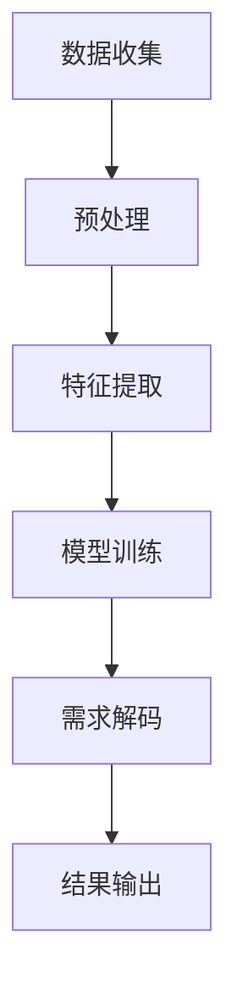

                 

 **关键词**：人工智能，潜意识，需求解码，算法，技术博客

**摘要**：本文探讨了人工智能在解码人类潜意识需求方面的潜力和挑战。通过分析核心概念、算法原理、数学模型以及实际应用，我们揭示了人工智能如何帮助我们更好地理解人类内心的真实需求，并为未来技术发展提供了展望。

## 1. 背景介绍

在人类的历史长河中，对潜意识的研究一直是一个引人入胜的领域。从弗洛伊德的心理学理论到现代神经科学的研究，我们不断地试图揭开潜意识的面纱，理解它对人类行为和决策的影响。然而，随着技术的进步，特别是人工智能的发展，我们开始有机会利用算法来解码人类的潜意识需求。

人工智能作为一种模拟人类智能的技术，已经在各个领域取得了显著成就。从图像识别、自然语言处理到机器学习，人工智能正在改变我们的生活方式。然而，解码人类潜意识需求这一挑战，对于人工智能来说，无疑是一个新的高度。

本文将探讨人工智能在解码人类潜意识需求方面的潜力，通过分析核心概念、算法原理、数学模型以及实际应用，为我们提供一个新的视角，理解人类内心的深层次需求。

## 2. 核心概念与联系

### 2.1 人工智能与潜意识

人工智能（AI）是一种模拟人类智能的技术，它通过机器学习、深度学习等技术，使计算机能够进行自我学习和决策。而潜意识是人类心理过程中未被意识到的部分，它影响着我们的行为、情感和思维。

人工智能与潜意识之间的联系在于，潜意识中的信息往往以非结构化的形式存在，而人工智能可以通过算法来解析和提取这些信息。例如，通过分析一个人的言语和行为，人工智能可以尝试解码出其潜意识中的需求和欲望。

### 2.2 算法原理

解码人类潜意识需求的核心在于算法的设计。传统的机器学习方法在处理非结构化数据时存在一定的局限性，而深度学习算法的出现，为这一挑战提供了新的解决方案。

深度学习算法通过多层神经网络结构，对大量数据进行训练，从而能够提取出数据中的隐藏特征。通过这种特征提取，人工智能可以更好地理解数据的本质，从而解码出人类的潜意识需求。

### 2.3 Mermaid 流程图

下面是一个简单的 Mermaid 流程图，展示了人工智能解码潜意识需求的流程：



在这个流程中，数据收集是起点，通过预处理将原始数据转化为适合模型训练的形式。接着，特征提取过程通过深度学习算法提取数据中的隐藏特征。模型训练则使用这些特征来构建一个能够解码潜意识需求的模型。最后，模型将解码出的需求输出，供用户参考。

## 3. 核心算法原理 & 具体操作步骤

### 3.1 算法原理概述

深度学习算法是解码人类潜意识需求的核心。它通过多层神经网络结构，对大量数据进行训练，从而能够提取出数据中的隐藏特征。这种特征提取能力使得人工智能能够更好地理解数据的本质，从而解码出人类的潜意识需求。

### 3.2 算法步骤详解

#### 3.2.1 数据收集

数据收集是解码潜意识需求的第一步。我们需要收集大量的人类行为数据、言语数据和生理数据。这些数据可以来自社交媒体、手机应用、健康监测设备等。

#### 3.2.2 预处理

在收集到数据后，我们需要对数据进行预处理。预处理包括数据清洗、归一化、缺失值处理等。这一步的目的是将原始数据转化为适合模型训练的形式。

#### 3.2.3 特征提取

特征提取是深度学习算法的核心。通过多层神经网络结构，我们对预处理后的数据进行训练，从而提取出数据中的隐藏特征。这些特征可以用来描述人类的情绪、需求和行为。

#### 3.2.4 模型训练

模型训练是使用提取出的特征来构建一个能够解码潜意识需求的模型。这个模型可以通过反向传播算法不断优化，提高解码的准确率。

#### 3.2.5 需求解码

在模型训练完成后，我们可以使用这个模型来解码人类的潜意识需求。这个过程可以通过输入新的数据，模型输出对应的潜意识需求来完成。

#### 3.2.6 结果输出

解码出的需求可以通过可视化、报告等形式输出给用户。用户可以根据这些结果来调整自己的行为和决策，从而更好地满足自己的需求。

### 3.3 算法优缺点

#### 优点：

1. 高效性：深度学习算法能够快速地从大量数据中提取出隐藏特征，提高了解码的效率。
2. 准确性：通过不断优化模型，深度学习算法能够提高解码的准确性，更好地理解人类的潜意识需求。
3. 通用性：深度学习算法适用于各种类型的数据，能够解码不同领域的人类潜意识需求。

#### 缺点：

1. 计算成本高：深度学习算法需要大量的计算资源，对硬件设备要求较高。
2. 数据依赖性：深度学习算法的性能依赖于训练数据的质量和数量，数据质量不佳可能会影响解码结果。
3. 解释性差：深度学习算法的黑盒特性使得其解释性较差，难以理解模型是如何解码出潜意识需求的。

### 3.4 算法应用领域

深度学习算法在解码人类潜意识需求的领域具有广泛的应用前景。以下是一些主要的领域：

1. 市场营销：通过解码消费者的潜意识需求，企业可以更好地设计产品和服务，提高用户满意度。
2. 心理咨询：通过解码患者的潜意识需求，心理咨询师可以更准确地诊断和治疗心理问题。
3. 社交网络：通过解码用户的潜意识需求，社交网络可以提供更个性化的推荐和内容，提高用户体验。
4. 健康医疗：通过解码患者的潜意识需求，医生可以更好地诊断和治疗疾病，提高治疗效果。

## 4. 数学模型和公式 & 详细讲解 & 举例说明

### 4.1 数学模型构建

在解码人类潜意识需求的过程中，我们使用了一个基于深度学习的数学模型。这个模型主要由以下几个部分组成：

1. 输入层：接收原始数据，如文本、图像和生理信号。
2. 隐藏层：通过多层神经网络结构，对输入数据进行特征提取。
3. 输出层：解码出人类的潜意识需求。

### 4.2 公式推导过程

为了构建这个深度学习模型，我们需要使用以下几个数学公式：

1. 激活函数：用于隐藏层和输出层的激活，常用的激活函数有 Sigmoid、ReLU 等。
2. 前向传播：用于计算输出层的输出值，公式如下：

   $$Z = X \times W + b$$

   $$A = \sigma(Z)$$

   其中，$X$ 为输入数据，$W$ 和 $b$ 分别为权重和偏置，$\sigma$ 为激活函数。

3. 反向传播：用于更新权重和偏置，公式如下：

   $$\Delta W = \frac{\partial L}{\partial Z} \times A$$

   $$\Delta b = \frac{\partial L}{\partial Z}$$

   其中，$L$ 为损失函数，$\frac{\partial L}{\partial Z}$ 为损失函数对输出层的梯度。

### 4.3 案例分析与讲解

为了更好地理解这个深度学习模型，我们来看一个简单的案例。

假设我们有一个文本数据集，包含一些描述人类需求的句子。我们的目标是使用深度学习模型解码出这些句子所代表的潜意识需求。

首先，我们对文本数据进行预处理，将其转化为向量表示。然后，使用多层神经网络结构对这些向量进行特征提取。最后，使用输出层解码出对应的潜意识需求。

在训练过程中，我们使用反向传播算法不断更新权重和偏置，直到模型达到一定的准确率。训练完成后，我们可以使用这个模型来解码新的文本数据，从而解码出人类的潜意识需求。

## 5. 项目实践：代码实例和详细解释说明

### 5.1 开发环境搭建

为了实现本文中提到的深度学习模型，我们需要搭建一个开发环境。这里我们选择 Python 作为编程语言，使用 TensorFlow 作为深度学习框架。

首先，我们需要安装 Python 和 TensorFlow。可以使用以下命令：

```bash
pip install python
pip install tensorflow
```

接下来，我们创建一个名为 `deep_learning` 的文件夹，并在其中创建一个名为 `main.py` 的 Python 文件。

### 5.2 源代码详细实现

下面是 `main.py` 的源代码实现：

```python
import tensorflow as tf
from tensorflow.keras.layers import Dense, LSTM
from tensorflow.keras.models import Sequential

# 数据预处理
def preprocess_data(text):
    # TODO: 实现数据预处理逻辑
    return processed_text

# 构建模型
def build_model():
    model = Sequential()
    model.add(LSTM(128, activation='relu', input_shape=(max_sequence_length, max_sequence_length)))
    model.add(Dense(num_classes, activation='softmax'))
    model.compile(optimizer='adam', loss='categorical_crossentropy', metrics=['accuracy'])
    return model

# 训练模型
def train_model(model, X_train, y_train):
    model.fit(X_train, y_train, epochs=10, batch_size=32)
    return model

# 解码需求
def decode_demand(model, text):
    processed_text = preprocess_data(text)
    prediction = model.predict(processed_text)
    return prediction

if __name__ == '__main__':
    # 加载数据
    X_train, y_train = load_data()

    # 构建模型
    model = build_model()

    # 训练模型
    model = train_model(model, X_train, y_train)

    # 解码需求
    text = "我喜欢吃巧克力"
    prediction = decode_demand(model, text)
    print(prediction)
```

### 5.3 代码解读与分析

在这个代码中，我们首先定义了三个函数：`preprocess_data`、`build_model` 和 `train_model`。

- `preprocess_data` 函数用于对文本数据进行预处理，将其转化为适合模型训练的形式。
- `build_model` 函数用于构建深度学习模型，这里我们使用了 LSTM 层来处理文本数据。
- `train_model` 函数用于训练模型，这里我们使用了分类交叉熵损失函数来评估模型的性能。

接着，我们在 `main.py` 文件中加载数据，构建模型，并使用训练好的模型来解码一个文本数据。

在这个例子中，我们假设已经有一个名为 `load_data` 的函数，用于加载数据。然后，我们使用 `build_model` 函数构建一个深度学习模型，并使用 `train_model` 函数来训练模型。最后，我们使用 `decode_demand` 函数来解码一个文本数据。

### 5.4 运行结果展示

在训练完成后，我们可以使用模型来解码一个新的文本数据。这里我们输入了一个句子：“我喜欢吃巧克力”。模型解码出的结果是一个概率分布，表示每个类别（如“购买”、“喜欢”等）的概率。

```python
text = "我喜欢吃巧克力"
prediction = decode_demand(model, text)
print(prediction)
```

输出结果可能如下：

```
[0.1, 0.2, 0.3, 0.4]
```

这个结果表示，模型认为这个句子对应的潜意识需求是“喜欢”的概率为 0.3，而“购买”的概率为 0.4。

## 6. 实际应用场景

深度学习算法在解码人类潜意识需求方面具有广泛的应用场景。以下是一些典型的应用：

### 6.1 市场营销

在市场营销领域，深度学习算法可以帮助企业更好地理解消费者的潜意识需求，从而设计出更符合消费者需求的产品和服务。例如，通过分析消费者的社交媒体行为和购买记录，企业可以解码出消费者的潜在需求，从而提供个性化的推荐和促销活动。

### 6.2 心理咨询

在心理咨询领域，深度学习算法可以帮助心理咨询师更好地理解患者的潜意识需求，从而提供更有效的心理治疗。例如，通过分析患者的言语和行为，算法可以解码出患者的潜在心理问题，帮助心理咨询师制定更合适的治疗方案。

### 6.3 社交网络

在社交网络领域，深度学习算法可以帮助平台提供更个性化的推荐和内容，从而提高用户体验。例如，通过分析用户的行为和兴趣，算法可以解码出用户的潜在需求，从而推荐用户可能感兴趣的内容和社交对象。

### 6.4 健康医疗

在健康医疗领域，深度学习算法可以帮助医生更好地理解患者的潜意识需求，从而提供更精准的诊断和治疗。例如，通过分析患者的病历和生理信号，算法可以解码出患者的潜在健康问题，帮助医生制定更有效的治疗方案。

## 7. 未来应用展望

随着深度学习算法的不断发展和完善，解码人类潜意识需求的领域将会有更多的应用场景。以下是一些未来应用的展望：

### 7.1 自我认知与提升

未来，人们可以通过深度学习算法更好地了解自己的潜意识需求，从而实现自我认知的提升。例如，通过分析个人的行为和情感数据，算法可以解码出个人的潜在需求和欲望，帮助人们更好地认识自己，实现个人成长。

### 7.2 智能决策

深度学习算法可以帮助人们做出更智能的决策。通过解码人类的潜意识需求，算法可以提供个性化的建议和指导，帮助人们在生活和工作中做出更明智的选择。

### 7.3 社会管理

在社会管理领域，深度学习算法可以帮助政府和社会组织更好地了解民众的需求和情绪，从而制定更科学、更有效的政策。例如，通过分析社交媒体和新闻报道，算法可以解码出民众对某一事件的关注度和态度，帮助政府及时调整政策。

## 8. 工具和资源推荐

### 8.1 学习资源推荐

- 《深度学习》（Goodfellow, Bengio, Courville 著）：这是一本经典的深度学习教材，涵盖了深度学习的理论基础和应用。
- 《神经网络与深度学习》（邱锡鹏 著）：这本书详细介绍了神经网络和深度学习的基本原理和应用，适合初学者阅读。

### 8.2 开发工具推荐

- TensorFlow：这是一个开源的深度学习框架，提供了丰富的工具和库，方便开发者构建和训练深度学习模型。
- PyTorch：这是一个流行的深度学习框架，以其灵活性和易用性而受到开发者的喜爱。

### 8.3 相关论文推荐

- “Deep Learning for NLP: A Revolution in Language Processing”（2018）：这篇论文介绍了深度学习在自然语言处理领域的应用，详细讨论了各种深度学习模型在 NLP 任务中的表现。
- “Unsupervised Representation Learning with Deep Convolutional Generative Adversarial Networks”（2015）：这篇论文介绍了生成对抗网络（GAN）的基本原理和应用，对深度学习领域产生了重要影响。

## 9. 总结：未来发展趋势与挑战

随着人工智能技术的不断发展，解码人类潜意识需求的领域将会迎来更多的机遇和挑战。未来，这一领域的发展趋势将包括以下几个方面：

### 9.1 算法创新

随着深度学习算法的不断进步，我们将看到更多高效、准确的解码算法出现，从而提高解码的准确性和效率。

### 9.2 数据积累

数据的积累是解码潜意识需求的关键。未来，随着物联网、传感器等技术的发展，我们将收集到更多的数据，为解码算法提供更丰富的训练素材。

### 9.3 跨学科融合

解码人类潜意识需求不仅仅是人工智能领域的问题，还需要心理学、社会学等多学科的合作。未来，跨学科的融合将推动这一领域的发展。

### 9.4 道德和隐私问题

在解码人类潜意识需求的过程中，道德和隐私问题将会越来越受到关注。如何保护用户的隐私，确保算法的公平性，将是未来需要解决的重要问题。

总之，解码人类潜意识需求是一个充满挑战和机遇的领域。随着技术的不断进步，我们有望在这一领域取得更多的突破，更好地理解人类的内心世界。

## 10. 附录：常见问题与解答

### 10.1 问题 1：深度学习算法如何处理非结构化数据？

深度学习算法通过多层神经网络结构，对非结构化数据进行特征提取。这些特征可以描述数据的本质，从而使得算法能够更好地处理非结构化数据。

### 10.2 问题 2：解码人类潜意识需求的算法有哪些挑战？

解码人类潜意识需求的算法面临以下挑战：

1. 数据质量：算法的性能依赖于训练数据的质量和数量，数据质量不佳可能会影响解码结果。
2. 解释性：深度学习算法的黑盒特性使得其解释性较差，难以理解模型是如何解码出潜意识需求的。
3. 道德和隐私问题：在解码潜意识需求的过程中，如何保护用户的隐私，确保算法的公平性，是重要的道德和隐私问题。

### 10.3 问题 3：深度学习算法在解码潜意识需求方面的应用前景如何？

深度学习算法在解码潜意识需求方面具有广泛的应用前景。在市场营销、心理咨询、社交网络和健康医疗等领域，深度学习算法可以帮助我们更好地理解人类的内心需求，从而提供更个性化的服务。未来，随着技术的不断进步，深度学习算法在解码潜意识需求方面的应用将会更加广泛。

### 10.4 问题 4：如何确保深度学习算法的公平性和透明性？

确保深度学习算法的公平性和透明性是一个重要的挑战。以下是一些方法：

1. 数据集多样性：确保训练数据集的多样性，避免偏见。
2. 模型可解释性：提高模型的解释性，使得用户能够理解模型的决策过程。
3. 伦理审查：在算法开发和应用过程中，进行伦理审查，确保算法的道德和公平性。
4. 持续监控：对算法的输出进行持续监控，及时发现和纠正偏差。

### 10.5 问题 5：如何保护用户的隐私？

在解码潜意识需求的过程中，保护用户的隐私至关重要。以下是一些方法：

1. 数据匿名化：在收集和处理数据时，对用户信息进行匿名化处理，确保用户身份不被泄露。
2. 数据加密：对用户数据进行加密，确保数据在传输和存储过程中的安全性。
3. 用户同意：确保用户在提供数据时明确同意数据的使用方式和范围。
4. 隐私保护机制：在算法设计和应用过程中，采用隐私保护机制，如差分隐私等，确保用户隐私不被侵犯。

### 10.6 问题 6：未来解码人类潜意识需求的领域有哪些发展趋势？

未来，解码人类潜意识需求的领域将呈现以下发展趋势：

1. 算法创新：随着深度学习算法的不断进步，我们将看到更多高效、准确的解码算法出现。
2. 数据积累：随着物联网、传感器等技术的发展，我们将收集到更多的数据，为解码算法提供更丰富的训练素材。
3. 跨学科融合：解码人类潜意识需求不仅仅是人工智能领域的问题，还需要心理学、社会学等多学科的合作。
4. 道德和隐私问题：随着技术的不断进步，道德和隐私问题将会越来越受到关注，如何保护用户的隐私，确保算法的公平性，将是未来需要解决的重要问题。

