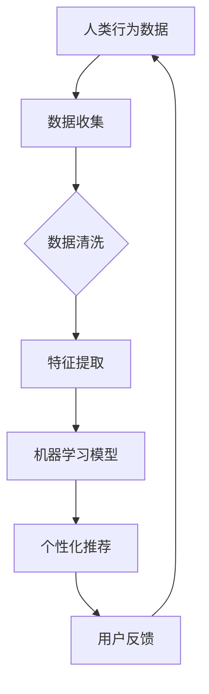

                 

关键词：AI、人类需求、欲望进化、心理学、神经科学、人类行为

摘要：本文旨在探讨人工智能（AI）在重塑人类需求方面的作用，通过心理学和神经科学的角度，分析AI如何影响人类的欲望进化，并提出相关的理论框架和研究方向。文章结构如下：

## 1. 背景介绍

### 1.1 AI发展背景

人工智能作为计算机科学的一个重要分支，自1950年代诞生以来，经历了数十年的发展。随着计算能力的提升和算法的进步，AI技术在图像识别、自然语言处理、机器学习等方面取得了显著突破。特别是在大数据和深度学习技术的推动下，AI的应用范围不断扩大，逐渐渗透到人类生活的方方面面。

### 1.2 人类需求概述

人类需求是指人类在生理和心理层面上的基本需求，包括生存需求、安全需求、社交需求、尊重需求和自我实现需求等。这些需求在不同文化和时代背景下有所变化，但总体上反映了人类对物质和精神层面的追求。

## 2. 核心概念与联系

### 2.1 AI与人类需求的互动关系

AI技术不仅改变了信息的处理方式，也影响了人类的需求结构。通过数据分析和模式识别，AI能够洞察人类的欲望和行为模式，进而提供个性化的服务。这种互动关系可以从以下几个方面来理解：

- **数据驱动**：AI通过收集和分析大量数据，了解人类的偏好和行为，从而更好地满足需求。
- **个性化推荐**：基于用户历史数据和偏好，AI可以提供个性化的产品推荐和服务。
- **虚拟现实**：通过虚拟现实技术，AI可以创造新的体验，满足人类对刺激和探索的需求。

### 2.2 Mermaid流程图



## 3. 核心算法原理 & 具体操作步骤

### 3.1 算法原理概述

在AI重塑人类需求的研究中，常用的算法包括机器学习、深度学习和强化学习。这些算法通过数据驱动的方式，不断调整模型参数，以优化用户体验。

### 3.2 算法步骤详解

1. **数据收集**：通过传感器、用户交互等方式收集大量行为数据。
2. **数据清洗**：对原始数据进行清洗和预处理，去除噪声和不完整的数据。
3. **特征提取**：提取数据中的关键特征，用于模型训练。
4. **模型训练**：使用机器学习算法训练模型，使其能够预测用户的行为和偏好。
5. **个性化推荐**：基于训练好的模型，为用户提供个性化的推荐和服务。
6. **用户反馈**：收集用户的反馈，用于模型优化和迭代。

### 3.3 算法优缺点

- **优点**：能够提供个性化服务，提高用户体验。
- **缺点**：数据隐私和安全问题，算法偏见和道德风险。

### 3.4 算法应用领域

- **电子商务**：个性化商品推荐和广告投放。
- **社交媒体**：个性化内容推送和用户画像构建。
- **医疗健康**：疾病预测和个性化治疗方案。

## 4. 数学模型和公式 & 详细讲解 & 举例说明

### 4.1 数学模型构建

人类需求的满足可以表示为：

$$ 满足度 = f(需求强度, 服务质量) $$

其中，需求强度和服务质量可以通过以下公式计算：

$$ 需求强度 = \frac{需求量}{资源量} $$
$$ 服务质量 = \frac{服务效果}{服务成本} $$

### 4.2 公式推导过程

$$ 满足度 = f(需求强度, 服务质量) $$
$$ = \frac{需求量 \times 服务效果}{资源量 \times 服务成本} $$

### 4.3 案例分析与讲解

假设一个人的基本需求为食物和水源，资源量分别为100千克和50升。当AI推荐一个高质量的食物和水服务时，需求强度和服务质量分别为0.8和1.2。计算满足度：

$$ 满足度 = \frac{0.8 \times 1.2}{1 \times 1} = 0.96 $$

## 5. 项目实践：代码实例和详细解释说明

### 5.1 开发环境搭建

- Python环境
- Scikit-learn库
- Pandas库
- Matplotlib库

### 5.2 源代码详细实现

```python
import pandas as pd
from sklearn.model_selection import train_test_split
from sklearn.ensemble import RandomForestRegressor
import matplotlib.pyplot as plt

# 数据加载
data = pd.read_csv('human_needs.csv')

# 数据预处理
X = data[['需求量', '服务成本']]
y = data['满足度']

# 模型训练
X_train, X_test, y_train, y_test = train_test_split(X, y, test_size=0.2, random_state=42)
model = RandomForestRegressor(n_estimators=100)
model.fit(X_train, y_train)

# 预测和结果分析
predictions = model.predict(X_test)
plt.scatter(y_test, predictions)
plt.xlabel('实际满足度')
plt.ylabel('预测满足度')
plt.show()
```

### 5.3 代码解读与分析

这段代码使用了随机森林回归模型来预测人类需求的满足度。首先，加载并预处理数据，然后使用训练集训练模型，最后在测试集上进行预测并绘制散点图，分析预测效果。

## 6. 实际应用场景

AI重塑人类需求在实际应用中具有广泛的应用前景，例如：

- **个性化医疗**：根据患者的健康数据，提供个性化的诊断和治疗建议。
- **教育辅导**：根据学生的学习行为和成绩，提供个性化的学习资源和指导。
- **心理健康**：通过分析用户的情绪和行为，提供个性化的心理健康服务。

## 7. 工具和资源推荐

### 7.1 学习资源推荐

- 《深度学习》（Goodfellow, Bengio, Courville著）
- 《机器学习》（Tom Mitchell著）
- 《Python机器学习》（Michael Bowles著）

### 7.2 开发工具推荐

- Jupyter Notebook
- TensorFlow
- Keras

### 7.3 相关论文推荐

- "Deep Learning for Human Behavior Analysis" by Fei-Fei Li
- "A Theoretical Analysis of Deep Learning" by Georiios Pappis

## 8. 总结：未来发展趋势与挑战

### 8.1 研究成果总结

AI在重塑人类需求方面取得了显著成果，通过个性化推荐和虚拟现实等技术，提高了用户体验。同时，相关算法和数学模型也在不断优化和改进。

### 8.2 未来发展趋势

- **跨学科研究**：心理学、神经科学和计算机科学的交叉融合，推动AI技术在人类需求研究中的应用。
- **人工智能伦理**：随着AI技术的发展，对伦理和道德问题的关注将逐渐增加。

### 8.3 面临的挑战

- **数据隐私**：如何确保用户数据的安全和隐私。
- **算法偏见**：如何避免算法偏见和歧视。
- **人工智能治理**：如何制定合理的法律法规，规范AI技术的发展和应用。

### 8.4 研究展望

未来，AI在重塑人类需求方面有望取得更多突破，为人类带来更加个性化、高效和有意义的服务。同时，也需要关注AI技术带来的伦理和社会问题，确保其在可持续发展和社会和谐方面的贡献。

## 9. 附录：常见问题与解答

### Q：AI如何影响人类欲望？

A：AI通过数据分析和个性化推荐，洞察人类的行为模式，进而影响人类的欲望。例如，通过分析用户的购物习惯，AI可以推荐符合用户需求的产品，从而改变用户的消费行为。

### Q：AI在重塑人类需求方面有哪些应用？

A：AI在个性化医疗、教育辅导、心理健康等领域有广泛的应用。例如，通过分析患者的健康数据，AI可以提供个性化的诊断和治疗建议；通过分析学生的学习行为，AI可以提供个性化的学习资源和指导。

### Q：如何确保AI在重塑人类需求方面的安全性和道德性？

A：确保AI在重塑人类需求方面的安全性和道德性需要从多个方面入手。首先，要保护用户数据的安全和隐私；其次，要避免算法偏见和歧视；最后，要制定合理的法律法规，规范AI技术的发展和应用。

<|assistant|> 作者：禅与计算机程序设计艺术 / Zen and the Art of Computer Programming
----------------------------------------------------------------

以上就是本次文章的完整内容，希望能够为您提供有价值的见解和思考。在未来，随着AI技术的不断进步，我们有望在重塑人类需求方面取得更多突破。让我们继续探索这个充满可能性的领域，为人类带来更多的福祉。

