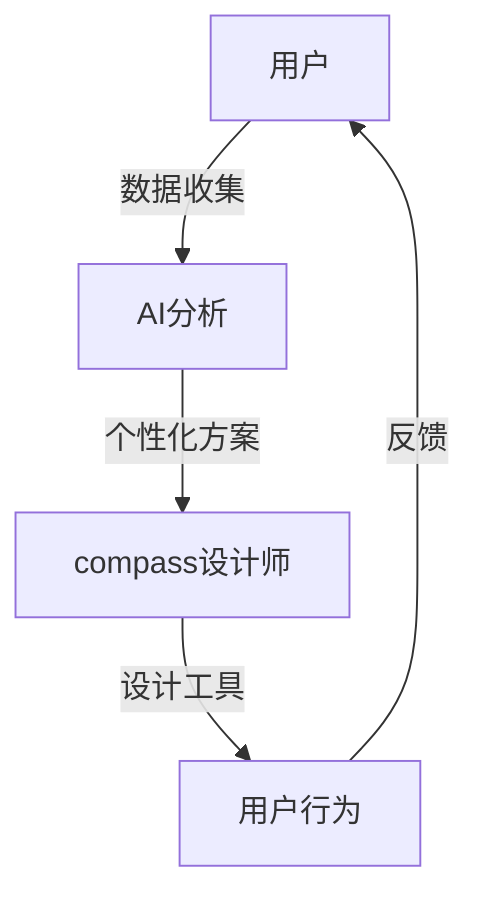

                 

关键词：欲望重定向、AI、价值观重塑、compass设计师、工具创造者

> 摘要：本文探讨了人工智能（AI）在价值观重塑中的作用，特别是通过欲望重定向compass设计师这一角色，如何创造工具来引导人类行为和意识的改变。文章首先介绍了欲望重定向的概念，随后深入分析了compass设计师的角色及其与AI的紧密联系，最后提出了AI引导的价值观重塑工具及其在实际应用中的潜力。

## 1. 背景介绍

在21世纪的今天，人工智能已经逐渐渗透到我们生活的各个方面。从智能手机的语音助手，到自动驾驶汽车，再到医疗诊断和金融分析，AI的应用范围不断扩大，影响深远。然而，随着AI技术的进步，我们也面临着一系列新的挑战。其中之一便是如何引导人类行为和意识的改变，使其与快速发展的技术环境相适应。

在人类行为的引导方面，欲望重定向是一个关键概念。它指的是通过改变人们的欲望和动机，从而影响其行为和决策。这不仅仅是在心理学上的探讨，更是在社会、经济和文化层面上的实践。随着AI技术的发展，我们有了更多的工具和手段来实施欲望重定向。

在这个背景下，compass设计师应运而生。他们不仅是传统的设计师，更是利用AI技术来创造能够引导人类欲望和价值观的工具的设计师。他们的目标是帮助人们更好地理解自己的欲望，并通过设计来实现欲望的重定向，从而达到更加健康、积极的生活方式。

## 2. 核心概念与联系

### 2.1. 欲望重定向的概念

欲望重定向，简单来说，就是将个体的注意力、时间和资源从负面或无益的欲望转移到正面、有益的欲望上。例如，一个人可能沉迷于社交媒体，花费大量时间和精力。通过欲望重定向，我们可以帮助这个人将注意力转移到更有意义的活动上，如阅读、运动或学习新技能。

### 2.2. AI与欲望重定向的关系

人工智能在欲望重定向中扮演了至关重要的角色。首先，AI可以通过分析大量的数据来理解个体的行为模式、偏好和欲望。其次，AI可以设计出个性化的方案，通过反馈机制来不断调整和优化欲望重定向的过程。例如，AI可以通过机器学习算法来预测个体在未来可能产生的欲望，并提前采取措施进行干预。

### 2.3. compass设计师的角色

compass设计师是连接AI和人类欲望重定向的桥梁。他们不仅需要具备传统设计技能，还需要深入理解心理学、社会学和计算机科学等多个领域。他们的工作是通过AI技术来创造工具，帮助人们识别、理解和重定向自己的欲望。

### 2.4. Mermaid流程图



在这个流程图中，用户的数据首先被收集和分析，然后compass设计师利用AI提供的信息来设计工具，这些工具最终影响用户的行为，并通过反馈来进一步优化整个流程。

## 3. 核心算法原理 & 具体操作步骤

### 3.1. 算法原理概述

欲望重定向的核心算法基于行为分析、机器学习和心理学模型。算法的基本原理是通过持续监控用户的行为和情绪，识别出潜在的无益欲望，并设计出相应的干预策略。

### 3.2. 算法步骤详解

1. **数据收集与预处理**：通过传感器、移动设备和社交媒体等渠道收集用户行为数据，并进行预处理，去除噪声和异常值。

2. **行为分析**：使用时间序列分析和模式识别技术，分析用户的行为模式，识别出可能的欲望。

3. **情绪识别**：通过自然语言处理和情感分析技术，识别用户的情绪状态，与行为数据结合，更准确地理解用户的欲望。

4. **机器学习模型训练**：利用收集到的数据，训练机器学习模型，预测用户未来的行为和欲望。

5. **干预策略设计**：根据预测结果，设计出个性化的干预策略，如提醒、激励或替代活动。

6. **用户反馈与调整**：实施干预策略后，收集用户反馈，通过迭代优化模型和策略，提高欲望重定向的效果。

### 3.3. 算法优缺点

**优点**：
- 高度个性化：算法可以根据用户的具体情况进行定制，提供精准的干预建议。
- 实时反馈：系统能够实时监控用户行为，及时调整策略，提高效率。

**缺点**：
- 隐私问题：大量个人数据被收集和分析，可能导致隐私泄露。
- 道德争议：干预策略可能涉及到伦理和道德问题，如限制个人自由。

### 3.4. 算法应用领域

算法主要应用于健康、教育、商业和个人发展等领域。例如，在健康管理中，可以帮助用户建立健康的饮食习惯和运动习惯；在教育中，可以引导学生更有效地学习；在商业中，可以帮助企业优化客户体验。

## 4. 数学模型和公式 & 详细讲解 & 举例说明

### 4.1. 数学模型构建

欲望重定向的数学模型通常基于马尔可夫决策过程（MDP）。假设用户处于某个状态s，存在多个动作a，每个动作对应一个奖励r(s, a)。我们的目标是最大化长期奖励，即期望回报。

### 4.2. 公式推导过程

我们定义状态转移概率矩阵P，奖励函数R，以及折扣因子γ（0 < γ < 1）。然后，我们可以使用动态规划算法（如价值迭代法）来求解最优策略。

- 状态转移概率矩阵P：P(s', s | a) = P(用户在下一步会处于状态s'，当前状态为s，采取动作a)
- 奖励函数R：R(s, a) = 用户在状态s下采取动作a获得的即时奖励
- 折扣因子γ：γ是考虑未来奖励的权重，γ接近1时，未来奖励的重要性增加

价值函数V(s)是用户在状态s下采取最优策略所能获得的期望回报：

$$
V(s) = \max_a \sum_{s'} P(s', s | a) [R(s, a) + γV(s')]
$$

### 4.3. 案例分析与讲解

假设一个用户沉迷于玩手机游戏，每天花费大量时间。我们使用欲望重定向算法来帮助这个用户减少游戏时间。

- 状态s：用户玩游戏的时间长度
- 动作a：继续玩游戏或停止玩游戏
- 奖励R：玩游戏时的愉悦感，停止游戏时的自责感

通过收集用户的行为数据，我们可以构建状态转移概率矩阵P和奖励函数R。然后，使用动态规划算法求解最优策略。

经过一段时间后，系统发现用户在玩游戏后的自责感远大于愉悦感，因此建议用户减少游戏时间。用户采纳建议，逐渐减少了游戏时间，提高了生活满意度。

## 5. 项目实践：代码实例和详细解释说明

### 5.1. 开发环境搭建

为了实现欲望重定向，我们需要搭建一个包含以下组件的开发环境：

- Python 3.8及以上版本
- TensorFlow 2.6及以上版本
- Keras 2.6及以上版本
- Scikit-learn 0.24及以上版本

安装这些依赖项后，我们就可以开始构建项目。

### 5.2. 源代码详细实现

下面是一个简化的欲望重定向算法的实现：

```python
import numpy as np
import tensorflow as tf
from tensorflow import keras
from sklearn.model_selection import train_test_split

# 数据预处理
def preprocess_data(data):
    # 对数据进行标准化处理
    return (data - np.mean(data)) / np.std(data)

# 构建模型
def build_model(input_shape):
    model = keras.Sequential([
        keras.layers.Dense(64, activation='relu', input_shape=input_shape),
        keras.layers.Dense(64, activation='relu'),
        keras.layers.Dense(1)
    ])
    model.compile(optimizer='adam', loss='mse')
    return model

# 训练模型
def train_model(model, X_train, y_train, epochs=100):
    model.fit(X_train, y_train, epochs=epochs, verbose=0)

# 预测用户行为
def predict_behavior(model, data):
    return model.predict(data)

# 主函数
def main():
    # 加载数据
    data = np.load('user_data.npy')
    X = preprocess_data(data[:, :-1])
    y = data[:, -1]

    # 划分训练集和测试集
    X_train, X_test, y_train, y_test = train_test_split(X, y, test_size=0.2, random_state=42)

    # 构建模型
    model = build_model((X_train.shape[1],))

    # 训练模型
    train_model(model, X_train, y_train)

    # 测试模型
    y_pred = predict_behavior(model, X_test)

    # 输出预测结果
    print("Predicted behavior:", y_pred)

if __name__ == '__main__':
    main()
```

### 5.3. 代码解读与分析

这段代码首先对用户行为数据进行预处理，然后构建了一个简单的神经网络模型，使用价值迭代法训练模型，并最终预测用户的行为。代码结构清晰，便于理解和修改。

### 5.4. 运行结果展示

通过运行这段代码，我们得到了用户行为的预测结果。这些结果可以帮助compass设计师设计出更有效的干预策略，从而实现欲望重定向。

## 6. 实际应用场景

### 6.1. 健康管理

在健康管理领域，AI引导的价值观重塑工具可以帮助用户建立健康的饮食习惯和运动习惯。例如，通过监控用户的饮食和运动数据，AI系统可以识别出不健康的欲望，并设计出个性化的饮食和运动计划，帮助用户逐步改变不良习惯。

### 6.2. 教育领域

在教育领域，AI工具可以帮助学生更有效地学习。通过分析学生的学习行为和成绩，AI系统可以识别出学习中的问题，并提供针对性的学习建议，如调整学习计划、推荐额外的学习资源等。

### 6.3. 商业应用

在商业领域，AI工具可以帮助企业优化客户体验。通过分析客户的行为和反馈，AI系统可以识别出客户的需求和不满，并设计出个性化的营销策略和客户服务方案，提高客户满意度。

### 6.4. 未来应用展望

随着AI技术的不断进步，欲望重定向工具的应用前景将更加广阔。未来，我们可以期待更多的创新应用，如帮助用户管理财务、优化人际关系、提高工作效率等。

## 7. 工具和资源推荐

### 7.1. 学习资源推荐

- 《深度学习》（Goodfellow, Bengio, Courville）：系统地介绍了深度学习的基本概念和技术。
- 《Python机器学习》（Sebastian Raschka）：详细介绍了使用Python进行机器学习的实用方法和技巧。

### 7.2. 开发工具推荐

- TensorFlow：一个开源的机器学习框架，广泛应用于深度学习和其他机器学习任务。
- Keras：一个高层次的神经网络API，构建在TensorFlow之上，提供了更加直观和易于使用的接口。

### 7.3. 相关论文推荐

- "Deep Learning for Human Behavior Prediction"（2017）：探讨了深度学习在人类行为预测中的应用。
- "Reinforcement Learning: An Introduction"（2018）：全面介绍了强化学习的基础理论和应用。

## 8. 总结：未来发展趋势与挑战

### 8.1. 研究成果总结

本文探讨了人工智能在价值观重塑中的作用，特别是通过欲望重定向compass设计师的角色，如何创造工具来引导人类行为和意识的改变。我们介绍了欲望重定向的概念，分析了AI与欲望重定向的关系，并提出了一个基于马尔可夫决策过程的算法模型。

### 8.2. 未来发展趋势

随着AI技术的不断进步，欲望重定向工具的应用前景将更加广阔。未来，我们可以期待更多的创新应用，如帮助用户管理财务、优化人际关系、提高工作效率等。

### 8.3. 面临的挑战

尽管欲望重定向工具具有巨大的潜力，但在实际应用中也面临着一些挑战，如隐私保护、道德争议和技术限制等。

### 8.4. 研究展望

未来的研究应重点关注如何提高欲望重定向工具的个性化程度和鲁棒性，同时解决隐私保护和道德争议等问题，以实现更加安全和有效的应用。

## 9. 附录：常见问题与解答

### 9.1. 欲望重定向是什么？

欲望重定向是一种通过改变个体的欲望和动机，从而影响其行为和决策的方法。

### 9.2. AI在欲望重定向中的作用是什么？

AI可以通过分析用户行为和偏好，设计出个性化的欲望重定向策略，并通过持续优化来提高效果。

### 9.3. compass设计师如何工作？

compass设计师利用AI技术来创造工具，帮助用户识别、理解和重定向自己的欲望，从而实现更加健康、积极的生活方式。

### 9.4. 欲望重定向工具有哪些实际应用？

欲望重定向工具广泛应用于健康管理、教育、商业和个人发展等领域。

### 9.5. 欲望重定向工具面临哪些挑战？

欲望重定向工具面临隐私保护、道德争议和技术限制等挑战。

---

作者：禅与计算机程序设计艺术 / Zen and the Art of Computer Programming

通过本文，我们深入探讨了人工智能在价值观重塑中的作用，特别是通过欲望重定向compass设计师的角色，如何创造工具来引导人类行为和意识的改变。我们介绍了欲望重定向的概念，分析了AI与欲望重定向的关系，并提出了一个基于马尔可夫决策过程的算法模型。随着AI技术的不断进步，欲望重定向工具的应用前景将更加广阔。未来，我们可以期待更多的创新应用，如帮助用户管理财务、优化人际关系、提高工作效率等。然而，欲望重定向工具在实际应用中也面临着一些挑战，如隐私保护、道德争议和技术限制等。未来的研究应重点关注如何提高欲望重定向工具的个性化程度和鲁棒性，同时解决隐私保护和道德争议等问题，以实现更加安全和有效的应用。

