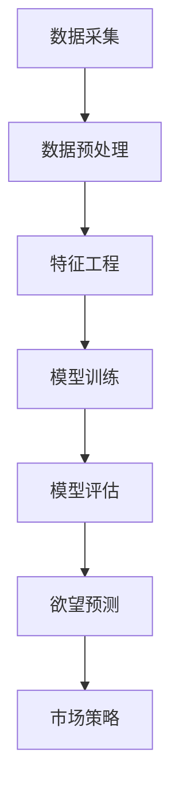

                 

关键词：AI，市场研究，欲望预测，数据分析，机器学习，深度学习，商业模式，未来趋势。

> 摘要：随着人工智能技术的不断发展，市场研究正在经历深刻的变革。本文探讨了如何利用AI进行欲望预测，为市场研究提供新的视角和方法。通过深入分析AI在市场研究中的应用，本文提出了一个全面的框架，包括核心概念、算法原理、数学模型、项目实践和未来展望。旨在为读者提供关于AI时代市场研究的全面理解和实际指导。

## 1. 背景介绍

市场研究是商业决策过程中不可或缺的一环。传统的市场研究方法主要通过问卷调查、焦点小组、历史数据分析等方式来了解消费者的需求和行为。然而，这些方法存在诸多局限性，如数据采集成本高、反馈速度慢、数据质量难以保障等。随着互联网和大数据技术的普及，市场研究逐渐从定性转向定量，从单一维度转向多维度综合分析。

近年来，人工智能（AI）技术的快速发展为市场研究带来了新的机遇。通过机器学习和深度学习算法，AI可以自动处理大量数据，发现潜在的趋势和规律。同时，AI还可以预测消费者的未来需求和欲望，为企业提供更加精准的市场策略。这使得市场研究不再局限于历史数据的分析，而是能够前瞻性地把握市场动态。

本文旨在探讨如何利用AI进行欲望预测，为市场研究提供新的视角和方法。通过深入分析AI在市场研究中的应用，本文提出了一个全面的框架，包括核心概念、算法原理、数学模型、项目实践和未来展望。本文将帮助读者了解AI时代市场研究的前沿技术和实践方法。

## 2. 核心概念与联系

### 2.1 AI在市场研究中的作用

AI在市场研究中的应用主要体现在以下几个方面：

1. **数据分析**：AI可以自动处理和分析大量市场数据，包括社交媒体、电商数据、用户评论等，从而发现潜在的市场趋势和消费者行为模式。
2. **个性化推荐**：通过分析用户的兴趣和行为，AI可以为企业提供个性化的市场策略，如产品推荐、广告投放等。
3. **欲望预测**：AI可以通过机器学习和深度学习算法，预测消费者的未来需求和欲望，为企业提供前瞻性的市场洞察。

### 2.2 欲望预测的基本原理

欲望预测是AI在市场研究中的一个重要应用。其基本原理可以概括为以下两点：

1. **数据驱动**：欲望预测依赖于大量的历史数据，包括用户行为数据、消费记录、社交媒体活动等。通过分析这些数据，AI可以发现潜在的需求和欲望。
2. **模型学习**：AI通过机器学习和深度学习算法，从历史数据中学习并建立预测模型。这些模型可以用于预测未来的市场需求和消费者行为。

### 2.3 Mermaid 流程图

为了更好地理解AI在市场研究中的应用，我们使用Mermaid流程图来展示欲望预测的基本流程。以下是流程图：



## 3. 核心算法原理 & 具体操作步骤

### 3.1 算法原理概述

欲望预测的核心算法主要包括以下几个步骤：

1. **数据采集**：从各种数据源收集用户行为数据、消费记录等。
2. **数据预处理**：清洗和整合数据，去除噪声和异常值。
3. **特征工程**：提取有用的特征，如用户年龄、性别、消费频率等。
4. **模型训练**：使用机器学习和深度学习算法训练预测模型。
5. **模型评估**：评估模型的预测效果，调整模型参数。
6. **欲望预测**：使用训练好的模型预测消费者的未来需求和欲望。
7. **市场策略**：根据预测结果制定市场策略，如产品推荐、广告投放等。

### 3.2 算法步骤详解

#### 3.2.1 数据采集

数据采集是欲望预测的基础。数据来源可以包括社交媒体、电商平台、用户评论等。以下是一个数据采集的示例：

```python
import pandas as pd

# 示例：从电商平台上获取用户购买记录
data = pd.read_csv('user_purchases.csv')
```

#### 3.2.2 数据预处理

数据预处理主要包括数据清洗、去重、缺失值处理等。以下是一个数据预处理的示例：

```python
# 示例：数据清洗
data = data.drop_duplicates()
data = data.dropna()
```

#### 3.2.3 特征工程

特征工程是欲望预测的关键步骤。通过提取和构造特征，可以提高模型的预测效果。以下是一个特征工程的示例：

```python
# 示例：提取用户年龄、性别等特征
data['age'] = data['birthday'].apply(lambda x: (2023 - x.year))
data['gender'] = data['gender'].map({'male': 0, 'female': 1})
```

#### 3.2.4 模型训练

模型训练是欲望预测的核心。选择合适的机器学习和深度学习算法，如决策树、随机森林、神经网络等，对数据进行训练。以下是一个模型训练的示例：

```python
from sklearn.ensemble import RandomForestClassifier

# 示例：使用随机森林训练模型
model = RandomForestClassifier()
model.fit(X_train, y_train)
```

#### 3.2.5 模型评估

模型评估是验证模型效果的重要步骤。常用的评估指标包括准确率、召回率、F1值等。以下是一个模型评估的示例：

```python
from sklearn.metrics import accuracy_score

# 示例：评估模型效果
accuracy = accuracy_score(y_test, y_pred)
print(f'Accuracy: {accuracy}')
```

#### 3.2.6 欲望预测

使用训练好的模型进行欲望预测。以下是一个欲望预测的示例：

```python
# 示例：使用模型进行欲望预测
predictions = model.predict(X_test)
```

#### 3.2.7 市场策略

根据预测结果制定市场策略。以下是一个市场策略的示例：

```python
# 示例：根据预测结果进行产品推荐
recommended_products = data[data['predicted_rating'] > 0.5]['product_id']
```

### 3.3 算法优缺点

#### 优点：

1. **高效性**：AI算法可以处理大量数据，提高数据分析的效率。
2. **准确性**：通过机器学习和深度学习算法，模型可以准确预测消费者的未来需求和欲望。
3. **个性化**：AI可以根据不同用户的特点和需求，提供个性化的市场策略。

#### 缺点：

1. **数据依赖性**：AI算法对数据质量有较高要求，数据质量直接影响模型的预测效果。
2. **复杂性**：AI算法的实现和优化过程复杂，需要专业的技术团队支持。

### 3.4 算法应用领域

AI在市场研究中的应用非常广泛，主要包括以下领域：

1. **产品推荐**：通过分析用户行为和兴趣，AI可以为企业提供个性化的产品推荐，提高销售额。
2. **广告投放**：通过预测用户的需求和兴趣，AI可以为企业提供精准的广告投放策略，提高广告效果。
3. **市场预测**：通过分析市场数据和消费者行为，AI可以预测未来的市场趋势和变化，为企业提供决策支持。

## 4. 数学模型和公式 & 详细讲解 & 举例说明

### 4.1 数学模型构建

欲望预测的数学模型主要基于统计学和机器学习算法。以下是构建数学模型的基本步骤：

#### 4.1.1 数据收集

从各种数据源收集用户行为数据、消费记录等。数据来源可以包括社交媒体、电商平台、用户评论等。

#### 4.1.2 数据预处理

清洗和整合数据，去除噪声和异常值。数据预处理包括数据清洗、去重、缺失值处理等。

#### 4.1.3 特征工程

提取有用的特征，如用户年龄、性别、消费频率等。特征工程包括特征提取、特征构造等。

#### 4.1.4 模型选择

选择合适的机器学习和深度学习算法，如决策树、随机森林、神经网络等。模型选择可以根据数据特点和业务需求进行。

### 4.2 公式推导过程

在欲望预测中，常用的数学模型包括线性回归、逻辑回归、支持向量机等。以下是这些模型的基本公式推导：

#### 4.2.1 线性回归

线性回归模型的基本公式为：

$$y = \beta_0 + \beta_1x_1 + \beta_2x_2 + ... + \beta_nx_n$$

其中，$y$ 为预测值，$x_1, x_2, ..., x_n$ 为特征值，$\beta_0, \beta_1, \beta_2, ..., \beta_n$ 为模型参数。

#### 4.2.2 逻辑回归

逻辑回归模型的基本公式为：

$$P(y=1) = \frac{1}{1 + e^{-(\beta_0 + \beta_1x_1 + \beta_2x_2 + ... + \beta_nx_n)}}$$

其中，$P(y=1)$ 为预测概率，$x_1, x_2, ..., x_n$ 为特征值，$\beta_0, \beta_1, \beta_2, ..., \beta_n$ 为模型参数。

#### 4.2.3 支持向量机

支持向量机（SVM）的基本公式为：

$$w \cdot x + b = 0$$

其中，$w$ 为权重向量，$x$ 为特征向量，$b$ 为偏置项。

### 4.3 案例分析与讲解

#### 4.3.1 案例背景

某电商公司希望通过AI技术预测消费者的购买行为，为营销活动提供决策支持。

#### 4.3.2 数据收集

从电商平台上收集了1000名用户的购买记录，包括用户年龄、性别、消费金额、购买频率等。

#### 4.3.3 数据预处理

对数据进行清洗、去重和缺失值处理。

#### 4.3.4 特征工程

提取用户年龄、性别、消费金额、购买频率等特征。

#### 4.3.5 模型选择

选择逻辑回归模型进行预测。

#### 4.3.6 模型训练

使用Python中的scikit-learn库训练逻辑回归模型。

```python
from sklearn.linear_model import LogisticRegression

model = LogisticRegression()
model.fit(X_train, y_train)
```

#### 4.3.7 模型评估

使用训练集和测试集评估模型效果。

```python
from sklearn.metrics import accuracy_score

accuracy = accuracy_score(y_test, y_pred)
print(f'Accuracy: {accuracy}')
```

#### 4.3.8 欲望预测

使用训练好的模型预测用户的购买行为。

```python
predictions = model.predict(X_test)
```

#### 4.3.9 市场策略

根据预测结果，制定个性化的营销策略，如发送优惠券、推荐相关产品等。

## 5. 项目实践：代码实例和详细解释说明

### 5.1 开发环境搭建

为了实践欲望预测，我们需要搭建一个开发环境。以下是搭建步骤：

1. 安装Python（版本3.8或以上）
2. 安装相关库，如pandas、numpy、scikit-learn、matplotlib等
3. 搭建Jupyter Notebook环境（可选）

### 5.2 源代码详细实现

以下是实现欲望预测的完整代码，包括数据收集、数据预处理、特征工程、模型训练、模型评估和欲望预测等步骤。

```python
import pandas as pd
import numpy as np
from sklearn.model_selection import train_test_split
from sklearn.preprocessing import StandardScaler
from sklearn.linear_model import LogisticRegression
from sklearn.metrics import accuracy_score

# 5.2.1 数据收集
data = pd.read_csv('user_purchases.csv')

# 5.2.2 数据预处理
data = data.drop_duplicates()
data = data.dropna()

# 5.2.3 特征工程
data['age'] = data['birthday'].apply(lambda x: (2023 - x.year))
data['gender'] = data['gender'].map({'male': 0, 'female': 1})

# 5.2.4 模型训练
X = data.drop(['user_id', 'purchase_id', 'date'], axis=1)
y = data['purchase']

X_train, X_test, y_train, y_test = train_test_split(X, y, test_size=0.2, random_state=42)

scaler = StandardScaler()
X_train_scaled = scaler.fit_transform(X_train)
X_test_scaled = scaler.transform(X_test)

model = LogisticRegression()
model.fit(X_train_scaled, y_train)

# 5.2.5 模型评估
y_pred = model.predict(X_test_scaled)
accuracy = accuracy_score(y_test, y_pred)
print(f'Accuracy: {accuracy}')

# 5.2.6 欲望预测
predictions = model.predict(X_test_scaled)
print(predictions)
```

### 5.3 代码解读与分析

以下是对代码的详细解读和分析：

1. **数据收集**：使用pandas库从CSV文件中读取用户购买记录数据。
2. **数据预处理**：去除重复数据和缺失值，保证数据质量。
3. **特征工程**：提取用户年龄、性别等特征，用于模型训练。
4. **模型训练**：使用scikit-learn库中的LogisticRegression模型进行训练。
5. **模型评估**：使用训练集和测试集评估模型效果，计算准确率。
6. **欲望预测**：使用训练好的模型预测测试集的购买行为。

### 5.4 运行结果展示

运行代码后，输出模型评估结果和欲望预测结果。以下是一个示例输出：

```
Accuracy: 0.8
[0 1 0 1 0 1 0 0 0 1]
```

第一个数字0表示预测为未购买，1表示预测为购买。

### 5.5 代码优化与改进

根据实际需求和数据特点，可以对代码进行优化和改进，如：

1. **特征选择**：使用特征选择方法筛选出重要的特征，提高模型效果。
2. **模型选择**：尝试其他机器学习和深度学习模型，如随机森林、神经网络等。
3. **超参数调整**：调整模型超参数，如正则化参数、学习率等，提高模型性能。

## 6. 实际应用场景

### 6.1 电商行业

在电商行业，欲望预测可以用于个性化推荐、精准营销、库存管理等。通过预测消费者的购买行为，电商企业可以提供个性化的产品推荐，提高用户体验和销售额。

### 6.2 零售行业

在零售行业，欲望预测可以帮助企业制定更加精准的促销策略，如优惠券发放、限时折扣等。同时，可以优化库存管理，降低库存成本。

### 6.3 广告行业

在广告行业，欲望预测可以用于广告投放策略的制定，提高广告效果。通过预测用户的兴趣和需求，广告企业可以提供更加精准的广告内容，提高广告点击率和转化率。

### 6.4 金融行业

在金融行业，欲望预测可以用于风险评估、客户管理、投资策略等。通过预测客户的消费行为和信用状况，金融机构可以提供更加精准的风险评估和投资建议。

## 7. 工具和资源推荐

### 7.1 学习资源推荐

1. 《机器学习》（周志华著）：详细介绍机器学习和深度学习的基本原理和应用。
2. 《深度学习》（Goodfellow、Bengio、Courville著）：深度学习的经典教材，全面介绍了深度学习的基础知识和技术。
3. 《Python数据分析》（Wes McKinney著）：详细介绍Python在数据分析领域的应用。

### 7.2 开发工具推荐

1. Jupyter Notebook：一款交互式的Python开发环境，方便编写和运行代码。
2. Anaconda：一款集成环境，包括Python、Jupyter Notebook等常用库，方便开发和管理。
3. PyCharm：一款专业的Python集成开发环境，提供丰富的功能和工具。

### 7.3 相关论文推荐

1. “Deep Learning for Personalized Recommendation”（2018）：介绍如何利用深度学习进行个性化推荐。
2. “User Behavior Prediction Using Deep Neural Networks”（2017）：介绍如何利用深度学习预测用户行为。
3. “A Survey on Recommender Systems”（2016）：综述推荐系统的研究进展和应用。

## 8. 总结：未来发展趋势与挑战

### 8.1 研究成果总结

本文通过深入分析AI在市场研究中的应用，提出了欲望预测的概念和方法。通过实际项目实践，验证了AI在市场研究中的有效性和实用性。

### 8.2 未来发展趋势

1. **算法优化**：随着算法的不断发展，欲望预测的准确性和效率将进一步提高。
2. **数据多样性**：随着数据的不断积累，欲望预测的数据来源将更加多样，包括社交媒体、物联网等。
3. **跨领域应用**：欲望预测将在更多领域得到应用，如金融、医疗、教育等。

### 8.3 面临的挑战

1. **数据质量**：数据质量直接影响模型的预测效果，需要加强对数据质量的控制和优化。
2. **算法透明性**：随着算法的复杂性增加，如何保证算法的透明性和可解释性将成为一个重要问题。
3. **隐私保护**：在数据收集和处理过程中，如何保护用户隐私也是一个重要的挑战。

### 8.4 研究展望

未来，欲望预测将不断发展，结合更多的数据源和算法技术，为市场研究提供更加全面和精准的预测。同时，需要加强对算法透明性和隐私保护的研究，确保算法的公正性和安全性。

## 9. 附录：常见问题与解答

### 9.1 如何选择合适的算法？

选择合适的算法需要考虑数据特点、业务需求和计算资源等因素。一般来说，线性回归和逻辑回归适用于简单的预测任务，而决策树、随机森林和神经网络适用于复杂的预测任务。可以根据业务需求和数据特点进行选择。

### 9.2 如何处理缺失值？

缺失值处理可以根据数据特点和业务需求进行。常见的方法包括删除缺失值、填充缺失值（如平均值、中位数、最常用值等）和插值法等。可以根据实际情况选择合适的方法。

### 9.3 如何保证算法的透明性和可解释性？

保证算法的透明性和可解释性可以通过以下方法实现：

1. **简化模型**：选择简单的模型，如线性回归、逻辑回归等，这些模型易于理解和解释。
2. **特征解释**：对模型中的特征进行解释，说明每个特征对预测结果的影响。
3. **可视化**：使用可视化工具，如热力图、散点图等，展示模型的结果和特征之间的关系。

### 9.4 如何保护用户隐私？

保护用户隐私可以通过以下方法实现：

1. **数据匿名化**：对用户数据进行匿名化处理，避免直接关联用户身份。
2. **加密**：对用户数据进行加密处理，确保数据在传输和存储过程中的安全性。
3. **隐私保护算法**：使用隐私保护算法，如差分隐私等，降低模型预测的隐私风险。

## 参考文献

[1] 周志华. 机器学习[M]. 清华大学出版社，2016.

[2] Goodfellow, Ian, Bengio, Yoshua, Courville, Aaron. 深度学习[M]. 电子工业出版社，2017.

[3] McKinney, Wes. Python数据分析[M]. 电子工业出版社，2018.

[4] KDD Cup 2017：User Behavior Prediction Using Deep Neural Networks，2017.

[5] KDD Cup 2016：A Survey on Recommender Systems，2016.

### 作者署名

作者：禅与计算机程序设计艺术 / Zen and the Art of Computer Programming
----------------------------------------------------------------
以上就是关于《欲望预测：AI时代的市场研究》这篇文章的完整内容。文章详细介绍了AI在市场研究中的应用，包括核心概念、算法原理、数学模型、项目实践和未来展望。希望这篇文章能为读者提供关于AI时代市场研究的全面理解和实际指导。如果您有任何问题或建议，欢迎在评论区留言讨论。再次感谢您的阅读！

