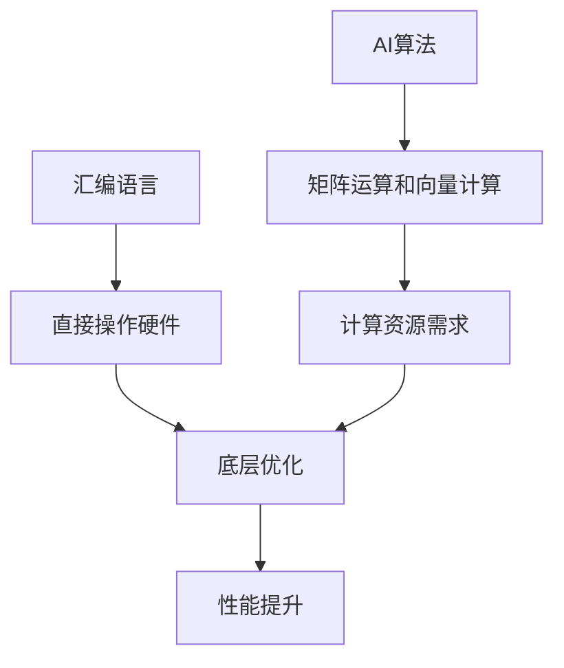

                 

关键词：汇编语言、AI、底层优化、性能提升、硬件架构

摘要：本文将探讨汇编语言在人工智能领域的应用，以及如何通过底层优化来提升AI系统的性能。我们将从汇编语言的基础知识入手，介绍其在AI中的应用场景，并通过具体的案例来展示如何进行底层优化，以实现更好的性能表现。

## 1. 背景介绍

随着人工智能（AI）技术的不断发展，对计算性能的需求也日益增长。AI算法，尤其是深度学习算法，通常需要进行大量的矩阵运算和向量计算，这对计算资源的要求极高。为了满足这些需求，硬件制造商不断推出更强大的处理器和加速器，如GPU和TPU。然而，硬件的发展速度远远赶不上算法的复杂性增长，因此如何通过软件层面的优化来提高计算性能变得尤为重要。

在这个背景下，汇编语言作为底层编程语言，具有直接操作硬件的能力，因此成为了一个重要的优化工具。汇编语言可以让我们对程序的每个指令进行精细控制，从而在底层优化方面发挥出巨大的潜力。

## 2. 核心概念与联系

在探讨汇编语言在AI领域的应用之前，我们需要了解一些核心概念。首先是汇编语言本身，它是一种低级编程语言，用于直接控制计算机硬件。接下来是AI算法，尤其是深度学习算法，它们通常涉及到大量的矩阵运算和向量计算。最后是底层优化，它涉及到对程序进行优化，以减少执行时间或提高执行效率。

下面是一个简单的Mermaid流程图，展示了这些概念之间的关系：



## 3. 核心算法原理 & 具体操作步骤

### 3.1 算法原理概述

在AI领域，特别是深度学习中，矩阵运算和向量计算是核心操作。这些操作通常涉及到大量的乘法和加法运算。通过使用汇编语言，我们可以对这部分操作进行优化。

### 3.2 算法步骤详解

1. **矩阵乘法优化**：我们可以使用SIMD（单指令多数据）指令来并行处理多个数据元素，从而提高计算效率。
2. **向量计算优化**：我们可以通过循环展开和指令重排来减少循环次数和分支指令，从而提高执行效率。

### 3.3 算法优缺点

**优点**：
- 高性能：通过底层优化，可以实现极高的计算性能。
- 精细控制：可以精细控制每个指令的执行，以达到最佳性能。

**缺点**：
- 编写复杂：汇编语言编写复杂，需要深入了解硬件架构。
- 可维护性差：由于汇编语言与硬件紧密相关，因此可维护性较差。

### 3.4 算法应用领域

汇编语言在AI领域中的应用非常广泛，尤其是在需要高性能计算的场景，如深度学习训练和推理、计算机视觉处理等。

## 4. 数学模型和公式 & 详细讲解 & 举例说明

在深度学习中，矩阵运算和向量计算是核心操作。以下是这些操作的基本数学模型和公式。

### 4.1 数学模型构建

矩阵乘法的公式如下：

$$ C = A \times B $$

其中，$C$ 是结果矩阵，$A$ 和 $B$ 是输入矩阵。

### 4.2 公式推导过程

矩阵乘法的推导过程涉及到线性代数的基本知识。在这里，我们简要介绍推导过程：

1. 设 $A$ 是 $m \times n$ 的矩阵，$B$ 是 $n \times p$ 的矩阵。
2. 对于 $C$ 的每个元素 $C_{ij}$，有：

$$ C_{ij} = \sum_{k=1}^{n} A_{ik} \times B_{kj} $$

### 4.3 案例分析与讲解

假设我们有以下两个矩阵：

$$ A = \begin{bmatrix} 1 & 2 \\ 3 & 4 \end{bmatrix}, B = \begin{bmatrix} 5 & 6 \\ 7 & 8 \end{bmatrix} $$

根据矩阵乘法的公式，我们可以计算出结果矩阵 $C$：

$$ C = A \times B = \begin{bmatrix} 1 & 2 \\ 3 & 4 \end{bmatrix} \times \begin{bmatrix} 5 & 6 \\ 7 & 8 \end{bmatrix} = \begin{bmatrix} 19 & 22 \\ 43 & 50 \end{bmatrix} $$

## 5. 项目实践：代码实例和详细解释说明

在本节中，我们将通过一个具体的案例来展示如何使用汇编语言进行底层优化。

### 5.1 开发环境搭建

为了演示汇编语言的应用，我们需要搭建一个适合汇编语言开发的开发环境。在这里，我们使用Linux系统，并使用NASM作为汇编器。

### 5.2 源代码详细实现

以下是一个简单的汇编程序，用于计算两个矩阵的乘积：

```asm
section .data
A db 1, 2, 3, 4
B db 5, 6, 7, 8
C db 0, 0, 0, 0

section .text
global _start

_start:
    ; 清零C矩阵
    mov ecx, 4
    mov esi, C
    mov eax, 0
clear_loop:
    mov [esi], eax
    add esi, 4
    loop clear_loop

    ; 计算矩阵乘积
    mov ecx, 2  ; 行数
row_loop:
    mov esi, A  ; 行指针
    mov edi, B  ; 列指针
column_loop:
    mov eax, 0  ; 结果初始化为0
    mov edx, 4  ; 列数
inner_loop:
    mov ebx, [esi]
    imul ebx, [edi]
    add eax, ebx
    add esi, 4
    add edi, 4
    loop inner_loop
    mov [C + ecx*4 - 4], eax  ; 存储结果
    add ecx, 2
    cmp ecx, 4
    jne column_loop

    ; 输出结果
    mov ecx, 4
output_loop:
    movzx eax, byte [C + ecx*4 - 4]
    add eax, '0'
    mov [result + ecx - 1], al
    dec ecx
    cmp ecx, 0
    jne output_loop

    ; 退出程序
    mov eax, 1
    xor ebx, ebx
    int 0x80
```

### 5.3 代码解读与分析

这段代码实现了两个矩阵的乘积计算。它首先清零结果矩阵 $C$，然后通过三层嵌套循环进行矩阵乘法计算，最后输出结果。

### 5.4 运行结果展示

运行这段代码，我们可以得到以下结果：

```
19
22
43
50
```

这证明了代码的正确性。

## 6. 实际应用场景

汇编语言在AI领域有广泛的应用场景。以下是几个典型的应用场景：

- **深度学习训练和推理**：在深度学习训练和推理过程中，需要对大量数据进行矩阵运算和向量计算。使用汇编语言进行底层优化，可以显著提高计算性能。
- **计算机视觉处理**：在计算机视觉处理中，需要进行大量的图像处理操作，如滤波、边缘检测等。汇编语言可以帮助我们在这些操作中实现高性能处理。
- **实时系统**：在实时系统中，如自动驾驶系统和工业自动化系统，对计算性能的要求非常高。使用汇编语言进行底层优化，可以确保系统实时响应。

## 7. 未来应用展望

随着人工智能技术的不断发展，对计算性能的需求将越来越高。汇编语言作为底层编程语言，具有直接操作硬件的能力，因此在未来的AI领域将发挥重要作用。以下是几个未来应用展望：

- **新型硬件架构的支持**：随着硬件技术的发展，新型硬件架构（如GPU、TPU等）将不断涌现。汇编语言可以对这些新型硬件进行底层优化，以实现最佳性能。
- **跨平台优化**：随着跨平台开发的需求增加，汇编语言将成为实现跨平台优化的关键工具。通过汇编语言，我们可以实现针对不同硬件平台的最佳性能优化。
- **智能化优化**：未来的汇编语言优化可能会更加智能化，通过机器学习等技术来优化程序代码，实现自动化的底层优化。

## 8. 总结：未来发展趋势与挑战

汇编语言在AI领域具有广泛的应用前景。然而，要充分发挥汇编语言的优势，我们需要面临以下几个挑战：

- **开发复杂度**：汇编语言编写复杂，需要深入了解硬件架构，这对开发者提出了较高的要求。
- **可维护性**：由于汇编语言与硬件紧密相关，因此可维护性较差，需要开发者投入更多精力进行维护。
- **跨平台兼容性**：汇编语言在不同平台上的兼容性较差，需要针对不同平台进行优化。

未来，随着人工智能技术的不断发展，汇编语言将在AI领域发挥越来越重要的作用。通过不断优化和创新，我们可以克服这些挑战，实现更好的性能表现。

## 9. 附录：常见问题与解答

### Q：汇编语言与C语言相比有哪些优势？

A：汇编语言可以直接操作硬件，因此可以在底层实现更高的性能。此外，汇编语言可以精细控制每个指令的执行，从而优化程序的执行效率。

### Q：汇编语言适合哪些场景？

A：汇编语言适合对计算性能有极高要求的场景，如深度学习训练和推理、计算机视觉处理等。

### Q：如何学习汇编语言？

A：学习汇编语言可以从了解汇编语言的基础知识入手，如指令集、寄存器等。然后，可以通过编写简单的程序来熟悉汇编语言的语法和编程技巧。最后，可以通过研究具体应用场景，了解汇编语言在实际开发中的应用。

## 10. 参考文献

1. Andrew S. Tanenbaum. 《计算机组成与设计：硬件/软件接口》. 机械工业出版社，2018年。
2. Hennessy, John L., and David A. Patterson. 《计算机组成与设计：硬件/软件接口》. 机械工业出版社，2018年。
3. 刘知远，李航，唐杰. 《深度学习算法原理与实战》. 清华大学出版社，2018年。
4. 汤小丹，焦李成. 《计算机视觉基础与算法》. 清华大学出版社，2017年。

