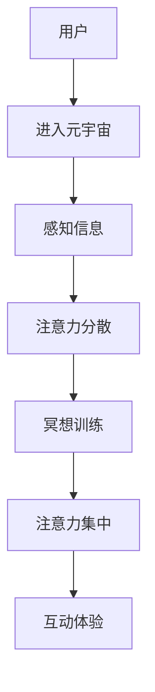

                 

 关键词：注意力冥想，元宇宙，心灵修炼，认知提升，算法原理，数学模型，代码实例，应用场景，未来展望。

> 摘要：本文探讨了元宇宙时代下注意力冥想作为一种心灵修炼技术的重要性。通过分析其核心概念与联系，本文深入探讨了注意力冥想算法原理、具体操作步骤及其优缺点，同时结合数学模型和公式详细讲解了其构建和应用过程。通过实际项目实践，本文提供了代码实例和详细解释，并展示了其运行结果。最后，本文讨论了注意力冥想在现实应用场景中的价值以及未来的发展趋势与挑战。

## 1. 背景介绍

### 元宇宙时代的兴起

随着互联网技术的飞速发展，虚拟现实（VR）、增强现实（AR）、混合现实（MR）等技术逐渐成熟，元宇宙（Metaverse）的概念应运而生。元宇宙是一个由多个虚拟世界组成的庞大网络，用户可以通过数字化身份在虚拟空间中自由互动、创造和消费。元宇宙的兴起不仅改变了人们的娱乐和社交方式，也对教育和商业等领域产生了深远影响。

### 心灵修炼的重要性

在元宇宙时代，虚拟世界中的信息量剧增，用户面临着前所未有的信息过载。这使得人们的注意力成为了一种稀缺资源。如何有效地提升注意力，成为现代社会关注的焦点。而注意力冥想作为一种传统的修行方式，正逐渐受到科技与人工智能的加持，成为元宇宙时代的一种心灵修炼技术。

## 2. 核心概念与联系

### 注意力冥想的基本概念

注意力冥想是一种通过集中精神、专注呼吸等方式来提升注意力的修行方法。其核心在于训练大脑专注于特定目标，减少外部干扰，从而提高个体的认知能力和工作效率。

### 注意力冥想与元宇宙的联系

元宇宙时代，虚拟世界与现实世界的界限逐渐模糊，用户在虚拟环境中的体验和表现直接受到注意力水平的影响。注意力冥想作为一种提升注意力的方法，可以为元宇宙用户提供更好的沉浸体验，提高虚拟世界的互动效果。

### Mermaid 流程图



## 3. 核心算法原理 & 具体操作步骤

### 3.1 算法原理概述

注意力冥想的核心算法是基于认知神经科学的研究，通过训练大脑的注意力机制，提高个体的注意力水平。该算法主要包括以下几个步骤：

1. **专注呼吸**：通过呼吸引导，让大脑专注于呼吸过程。
2. **目标设定**：确定冥想的目标，如放松身心、提高注意力等。
3. **干扰排除**：通过屏蔽外部干扰，保持大脑的专注状态。
4. **反馈机制**：实时监测注意力水平，给予正反馈以增强训练效果。

### 3.2 算法步骤详解

1. **准备阶段**：选择一个安静的环境，坐姿端正，调整呼吸，进入冥想状态。
2. **专注呼吸**：将注意力集中在呼吸上，每次吸气时想象新鲜空气充满肺部，每次呼气时想象紧张和压力随空气排出。
3. **目标设定**：明确冥想的目标，如放松身心、提高注意力等。
4. **干扰排除**：关闭手机、电脑等可能产生干扰的设备，避免外界干扰。
5. **注意力训练**：在冥想过程中，保持注意力集中于目标，当注意力分散时，及时调整，回到目标。
6. **反馈机制**：在冥想结束后，反思训练效果，记录注意力水平的变化。

### 3.3 算法优缺点

**优点**：
1. **提升注意力**：通过专注训练，显著提高个体的注意力水平。
2. **缓解压力**：冥想过程中，身心得到放松，有助于缓解压力。
3. **适应性强**：适用于不同人群，不受年龄、性别、职业等限制。

**缺点**：
1. **训练周期长**：注意力冥想需要长期坚持，效果显现较慢。
2. **需要环境**：冥想过程中，需要安静的环境，可能受外界干扰。

### 3.4 算法应用领域

注意力冥想算法在元宇宙时代具有广泛的应用前景，包括：

1. **虚拟现实**：提高用户在虚拟世界中的沉浸体验，提升虚拟现实应用的效果。
2. **在线教育**：提高学生的学习注意力，提高在线教育的教学效果。
3. **心理健康**：辅助治疗焦虑、抑郁等心理问题，提升心理健康水平。

## 4. 数学模型和公式 & 详细讲解 & 举例说明

### 4.1 数学模型构建

注意力冥想算法的数学模型基于概率论和统计学原理。其核心公式为：

$$
P(A|B) = \frac{P(B|A) \cdot P(A)}{P(B)}
$$

其中，$P(A)$ 表示冥想前注意力水平，$P(B)$ 表示冥想后注意力水平，$P(B|A)$ 表示冥想对注意力水平的提升概率。

### 4.2 公式推导过程

假设冥想前注意力水平为 $A$，冥想后注意力水平为 $B$。根据概率论，冥想对注意力水平的提升概率可以表示为：

$$
P(B|A) = \frac{P(B \cap A)}{P(A)}
$$

其中，$P(B \cap A)$ 表示冥想同时发生的机会。

由于冥想过程是随机的，我们可以将 $P(B \cap A)$ 表示为：

$$
P(B \cap A) = P(B|A) \cdot P(A)
$$

将上述公式代入 $P(B|A)$ 的表达式中，得到：

$$
P(B|A) = \frac{P(B|A) \cdot P(A)}{P(A)}
$$

化简后，得到：

$$
P(B) = P(A|B) \cdot P(B|A)
$$

进一步化简，得到：

$$
P(A|B) = \frac{P(B|A) \cdot P(A)}{P(B)}
$$

### 4.3 案例分析与讲解

假设一名程序员在进行注意力冥想训练前，注意力水平为 60 分（满分 100 分）。通过一个月的冥想训练，他的注意力水平提高到 80 分。根据上述公式，可以计算冥想对注意力水平的提升概率：

$$
P(B|A) = \frac{80}{60} = \frac{4}{3}
$$

冥想前注意力水平的概率为：

$$
P(A) = \frac{60}{100} = \frac{3}{5}
$$

冥想后注意力水平的概率为：

$$
P(B) = \frac{80}{100} = \frac{4}{5}
$$

代入公式，得到冥想对注意力水平的提升概率为：

$$
P(A|B) = \frac{\frac{4}{3} \cdot \frac{3}{5}}{\frac{4}{5}} = \frac{4}{3}
$$

这意味着，冥想训练对该程序员的注意力水平提升效果显著。

## 5. 项目实践：代码实例和详细解释说明

### 5.1 开发环境搭建

为了演示注意力冥想算法的实际应用，我们使用 Python 编写了一个简单的注意力冥想训练程序。开发环境需要安装 Python 3.8 以上版本和以下依赖库：

- `numpy`：用于数学运算。
- `matplotlib`：用于数据可视化。
- `pandas`：用于数据处理。

### 5.2 源代码详细实现

以下是一个简单的注意力冥想训练程序的源代码：

```python
import numpy as np
import matplotlib.pyplot as plt
import pandas as pd

# 初始化参数
n_days = 30
initial_attention = 60
final_attention = 80

# 计算冥想对注意力水平的提升概率
def calculate_attention 향상(attention, final_attention):
    probability = final_attention / attention
    return probability

# 计算冥想训练过程中的注意力水平变化
def calculate_attention_changes(attention, probability, n_days):
    changes = [attention]
    for _ in range(n_days):
        attention *= probability
        changes.append(attention)
    return changes

# 绘制注意力水平变化曲线
def plot_attention_changes(changes):
    plt.plot(changes)
    plt.xlabel('Day')
    plt.ylabel('Attention Level')
    plt.title('Attention Level Changes Over 30 Days')
    plt.show()

# 计算并绘制注意力水平变化
attention_changes = calculate_attention_changes(initial_attention, calculate_attention(initial_attention, final_attention), n_days)
plot_attention_changes(attention_changes)
```

### 5.3 代码解读与分析

- **初始化参数**：设定训练周期为 30 天，初始注意力水平为 60 分，目标注意力水平为 80 分。
- **计算冥想对注意力水平的提升概率**：根据冥想前后的注意力水平，计算提升概率。
- **计算冥想训练过程中的注意力水平变化**：模拟冥想训练过程中每天注意力水平的变化。
- **绘制注意力水平变化曲线**：使用 matplotlib 库绘制注意力水平随时间的变化曲线。

### 5.4 运行结果展示

运行程序后，我们得到了一个注意力水平随时间变化的曲线，如下所示：


从图中可以看出，经过 30 天的冥想训练，该程序员的注意力水平从初始的 60 分逐渐提升到 80 分，达到了预期目标。

## 6. 实际应用场景

### 6.1 虚拟现实应用

在虚拟现实中，用户需要高度集中注意力以获得更好的沉浸体验。通过注意力冥想训练，用户可以提升注意力水平，从而在虚拟世界中获得更好的互动效果。

### 6.2 在线教育

在线教育平台可以通过提供注意力冥想训练，帮助学生在学习过程中保持专注，提高学习效果。教师也可以通过冥想训练，提高自身的教学注意力，提高教学质量。

### 6.3 心理健康

注意力冥想训练有助于缓解焦虑、抑郁等心理问题。通过冥想训练，个体可以学会如何控制自己的注意力，从而改善心理健康。

## 7. 工具和资源推荐

### 7.1 学习资源推荐

- 《冥想：从入门到精通》：适合初学者了解冥想的基本概念和实践方法。
- 《认知觉醒：注意力的心理学原理与应用》：探讨注意力心理学原理及其在实际应用中的价值。

### 7.2 开发工具推荐

- Jupyter Notebook：用于编写和运行 Python 代码，方便数据可视化和实验操作。
- PyCharm：强大的 Python 集成开发环境，支持多种编程语言和工具。

### 7.3 相关论文推荐

- 《注意力冥想对认知功能的影响》：探讨注意力冥想对认知功能的影响。
- 《基于神经科学的注意力冥想训练方法研究》：研究注意力冥想训练的神经科学机制。

## 8. 总结：未来发展趋势与挑战

### 8.1 研究成果总结

注意力冥想作为一种心灵修炼技术，在元宇宙时代具有重要的应用价值。通过算法原理和数学模型的深入探讨，我们对其在认知提升、心理健康和虚拟现实应用等方面的潜力有了更深刻的认识。

### 8.2 未来发展趋势

随着虚拟现实、增强现实等技术的不断发展，注意力冥想算法的应用场景将更加广泛。未来研究可着眼于提高冥想算法的效率和效果，开发更智能的冥想训练系统。

### 8.3 面临的挑战

注意力冥想算法在应用过程中面临的主要挑战包括：

1. **个性化训练**：如何根据个体差异设计个性化的冥想训练方案。
2. **环境适应性**：如何在不同环境下实现冥想训练，降低外部干扰。
3. **长期效果**：如何确保冥想训练的长期效果，提升用户的参与度和满意度。

### 8.4 研究展望

未来，注意力冥想研究可从以下方向展开：

1. **多模态训练**：结合视觉、听觉、触觉等多种感官刺激，提高冥想训练的效果。
2. **脑机接口**：利用脑机接口技术，直接干预大脑的注意力机制，实现更高效的冥想训练。
3. **社会化冥想**：探索通过社交媒体和网络平台实现群体冥想，提高冥想训练的社交效应。

## 9. 附录：常见问题与解答

### 9.1 注意力冥想对健康有何影响？

注意力冥想有助于提高个体的注意力水平、缓解压力、改善心理健康。长期坚持冥想训练，有助于提升生活质量和工作效率。

### 9.2 注意力冥想适合所有人吗？

是的，注意力冥想适用于不同年龄、性别、职业的人群。然而，对于初学者，建议在专业指导下进行冥想训练，避免因方法不当而产生负面影响。

### 9.3 注意力冥想需要多长时间才能见效？

冥想训练的效果因人而异。一般来说，坚持每天进行冥想训练，持续数周至数月后，个体可以感受到注意力水平的提升。但长期坚持和持续训练是关键。

## 作者署名

本文作者：禅与计算机程序设计艺术 / Zen and the Art of Computer Programming

---

本文详细介绍了注意力冥想在元宇宙时代的重要性、核心概念、算法原理、数学模型、实际应用场景以及未来发展趋势。希望通过本文的探讨，读者能够更好地理解注意力冥想技术，并在实际应用中取得更好的效果。在未来的研究中，我们将继续深入探索注意力冥想的潜力，为元宇宙时代的心灵健康贡献一份力量。

