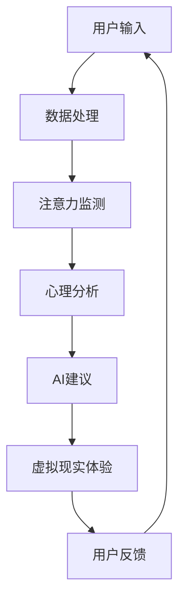

                 

关键词：元宇宙、注意力冥想、心灵平静、App、技术解决方案、智能算法、用户体验优化、数字健康、神经科学

> 摘要：随着元宇宙的兴起，人们对于数字生活的依赖越来越深。然而，这种依赖也带来了精神压力和焦虑。本文将探讨如何利用注意力冥想App，结合现代科技，帮助用户在元宇宙时代实现心灵平静。本文将从背景介绍、核心概念与联系、核心算法原理、数学模型与公式、项目实践、实际应用场景、未来展望等方面展开讨论，旨在为开发者和用户提供一个全面的指导。

## 1. 背景介绍

随着科技的发展，人类社会正逐渐进入一个全新的时代——元宇宙。元宇宙是一个虚拟的、共享的、去中心化的三维空间，它融合了虚拟现实（VR）、增强现实（AR）和区块链技术，为用户提供了一个全新的数字生活体验。在这个虚拟世界中，人们可以自由地交流、工作和娱乐，但同时也面临着前所未有的挑战。

一方面，元宇宙为人们提供了丰富的资源和机会，促进了社交、教育和经济的繁荣。然而，另一方面，长时间的沉浸式体验也导致了许多用户出现了精神疲劳、焦虑和压力。研究表明，长时间的数字依赖会导致注意力分散、情绪波动和心理问题。因此，如何在元宇宙中实现用户的心灵平静，成为一个亟待解决的问题。

### 注意力冥想与心灵平静

注意力冥想（Meditation）是一种通过集中注意力来达到心灵平静的方法。它源于古老的印度哲学，通过训练用户的注意力，帮助他们减少压力、焦虑和烦恼，提高情绪稳定性和心理韧性。近年来，随着神经科学和心理学的研究深入，注意力冥想的应用范围不断扩大，不仅用于个人的心理健康，还广泛应用于企业培训、教育辅导和医疗康复等领域。

在元宇宙中，注意力冥想App可以作为一个强大的工具，帮助用户在虚拟世界中实现心灵的平静。通过结合人工智能、大数据和虚拟现实技术，注意力冥想App可以为用户提供个性化的冥想体验，帮助他们在繁忙的数字生活中找到一片宁静的角落。

## 2. 核心概念与联系

为了深入理解注意力冥想App的工作原理，我们需要探讨以下几个核心概念：

### 2.1 注意力

注意力是大脑处理信息的能力，它决定了我们在面对复杂环境和任务时的反应速度和准确性。在元宇宙中，注意力冥想App通过监测用户在虚拟世界中的注意力水平，提供相应的指导，帮助用户保持专注和集中。

### 2.2 心理学与神经科学

心理学和神经科学的研究为注意力冥想提供了理论基础。通过理解大脑的工作原理，科学家们揭示了注意力如何影响情绪和行为，从而设计出更有效的冥想方法和App。

### 2.3 虚拟现实（VR）与增强现实（AR）

虚拟现实和增强现实技术为注意力冥想App提供了实现沉浸式体验的可能。通过VR和AR技术，用户可以在虚拟环境中进行冥想练习，获得更加真实和丰富的体验。

### 2.4 人工智能（AI）

人工智能技术在注意力冥想App中发挥着重要作用。通过机器学习和数据挖掘技术，App可以分析用户的行为数据，提供个性化的冥想建议，帮助用户更好地管理自己的情绪和压力。

### 2.5 大数据和云计算

大数据和云计算技术为注意力冥想App提供了强大的数据处理和分析能力。通过收集和分析用户的冥想数据，App可以为用户提供更加精确和有效的指导。

### 2.6 Mermaid流程图

以下是一个简化的注意力冥想App的Mermaid流程图，展示了核心概念之间的联系：



## 3. 核心算法原理 & 具体操作步骤

### 3.1 算法原理概述

注意力冥想App的核心算法基于深度学习和神经网络模型。通过训练神经网络，App可以学习用户的注意力模式，并提供个性化的冥想建议。算法的基本原理包括以下几个步骤：

1. **数据收集**：收集用户在元宇宙中的行为数据，包括注意力分散的时间、地点和情境。
2. **特征提取**：使用特征提取算法，将原始数据转化为特征向量。
3. **模型训练**：使用训练数据，训练神经网络模型，使其能够识别用户的注意力模式。
4. **预测与建议**：根据用户的当前状态，模型预测用户需要注意力的调整，并生成相应的冥想建议。

### 3.2 算法步骤详解

#### 步骤1：数据收集

用户在元宇宙中的行为数据包括浏览历史、操作记录、语音和文字交流等。这些数据被收集并存储在数据库中。

#### 步骤2：特征提取

特征提取是将原始数据转化为特征向量，以便于神经网络处理。常用的特征提取方法包括：

- **时序特征**：分析用户行为的时间序列，提取周期性、趋势性和突变性等特征。
- **交互特征**：分析用户与其他实体（如虚拟角色、物品）的交互情况，提取交互频率、交互强度等特征。
- **语义特征**：使用自然语言处理技术，提取用户交流内容的语义特征。

#### 步骤3：模型训练

使用训练数据，训练神经网络模型。神经网络模型通常由多层感知器（MLP）、卷积神经网络（CNN）或循环神经网络（RNN）等组成。训练过程包括：

- **初始化权重**：随机初始化模型权重。
- **前向传播**：输入特征向量，通过神经网络计算输出。
- **反向传播**：计算损失函数，更新模型权重。
- **迭代训练**：重复前向传播和反向传播，直至模型收敛。

#### 步骤4：预测与建议

根据用户的当前状态，模型预测用户需要注意力的调整，并生成相应的冥想建议。建议包括：

- **冥想类型**：根据用户的历史数据，推荐最适合的冥想类型，如正念冥想、呼吸冥想等。
- **冥想时长**：推荐冥想的时长，以达到最佳效果。
- **冥想环境**：根据用户的偏好和当前环境，推荐最适合的冥想场景。

### 3.3 算法优缺点

#### 优点

- **个性化**：通过分析用户的行为数据，提供个性化的冥想建议，提高冥想效果。
- **实时性**：能够实时监测用户的注意力水平，及时调整冥想策略。
- **可扩展性**：基于神经网络模型，可以方便地扩展和优化，适应不同的应用场景。

#### 缺点

- **数据依赖**：算法的性能依赖于用户的数据质量和数量，可能存在一定的偏差。
- **计算资源**：训练和部署神经网络模型需要大量的计算资源，可能不适合资源受限的设备。

### 3.4 算法应用领域

注意力冥想App的核心算法在以下领域具有广泛的应用前景：

- **心理健康应用**：帮助用户缓解压力、焦虑和情绪问题。
- **教育应用**：辅助教师和学生提高学习效率，培养专注力。
- **企业培训**：帮助员工提高工作效率，培养团队协作精神。
- **医疗康复**：辅助心理医生和康复师进行心理治疗和康复训练。

## 4. 数学模型和公式 & 详细讲解 & 举例说明

### 4.1 数学模型构建

注意力冥想App的核心算法基于深度学习模型，其数学基础主要包括神经网络模型和损失函数。以下是神经网络模型和损失函数的基本公式。

#### 神经网络模型

神经网络模型通常由多个层组成，包括输入层、隐藏层和输出层。每层由多个神经元组成，神经元之间的连接权重决定了模型的预测能力。神经元的输出可以通过以下公式计算：

$$
y = \sigma(\sum_{i=1}^{n} w_i x_i + b)
$$

其中，$y$ 是神经元的输出，$\sigma$ 是激活函数，$w_i$ 和 $x_i$ 分别是输入和连接权重，$b$ 是偏置项。

常用的激活函数包括：

- **Sigmoid函数**：$ \sigma(x) = \frac{1}{1 + e^{-x}}$
- **ReLU函数**：$ \sigma(x) = max(0, x)$

#### 损失函数

损失函数用于评估模型的预测误差，常见的损失函数包括：

- **均方误差（MSE）**：$L(\theta) = \frac{1}{2} \sum_{i=1}^{n} (y_i - \hat{y}_i)^2$
- **交叉熵损失（CE）**：$L(\theta) = -\sum_{i=1}^{n} y_i \log \hat{y}_i$

其中，$y_i$ 和 $\hat{y}_i$ 分别是真实值和预测值。

### 4.2 公式推导过程

以下是一个简化的神经网络模型推导过程，用于说明如何计算神经元的输出和损失函数。

#### 步骤1：计算神经元输出

假设一个简单的神经网络，包括一个输入层、一个隐藏层和一个输出层。输入层有3个神经元，隐藏层有2个神经元，输出层有1个神经元。激活函数使用Sigmoid函数。

$$
\begin{aligned}
y_1 &= \sigma(w_{11}x_1 + w_{12}x_2 + w_{13}x_3 + b_1) \\
y_2 &= \sigma(w_{21}x_1 + w_{22}x_2 + w_{23}x_3 + b_2) \\
\hat{y} &= \sigma(w_{31}y_1 + w_{32}y_2 + b_3)
\end{aligned}
$$

#### 步骤2：计算损失函数

假设真实标签为 $y = 1$，预测值为 $\hat{y} = 0.4$，使用交叉熵损失函数。

$$
L(\theta) = -y \log \hat{y} - (1 - y) \log (1 - \hat{y}) \\
L(\theta) = -1 \log 0.4 - 0 \log 0.6 \\
L(\theta) = \log 2.5
$$

### 4.3 案例分析与讲解

以下是一个简单的案例，用于说明如何使用注意力冥想App进行冥想指导。

#### 案例背景

用户A在元宇宙中工作了一段时间，感到非常疲惫和焦虑。他打开注意力冥想App，希望得到一些指导。

#### 案例步骤

1. **数据收集**：App收集了用户A的行为数据，包括工作时间、操作记录和情绪状态。
2. **特征提取**：提取用户A的行为特征，如工作时间长度、操作频率和情绪波动等。
3. **模型预测**：神经网络模型分析用户A的特征，预测他当前的情绪状态和注意力水平。
4. **冥想建议**：根据预测结果，模型推荐用户A进行呼吸冥想，建议冥想时长为10分钟。
5. **虚拟现实体验**：用户A在虚拟现实环境中进行呼吸冥想，App提供沉浸式的声音和视觉指导。

#### 案例结果

用户A按照App的建议进行了呼吸冥想，10分钟后，他感到情绪稳定，注意力集中，疲劳感明显减轻。他对注意力冥想App的效果表示满意。

## 5. 项目实践：代码实例和详细解释说明

### 5.1 开发环境搭建

为了实现注意力冥想App，我们需要搭建一个适合开发、测试和部署的开发环境。以下是一个简单的环境搭建步骤：

1. **安装Python环境**：Python是实现深度学习算法的主要语言，需要安装Python 3.8及以上版本。
2. **安装TensorFlow**：TensorFlow是Google开源的深度学习框架，用于构建和训练神经网络模型。安装命令为：

   ```bash
   pip install tensorflow
   ```

3. **安装Keras**：Keras是TensorFlow的高级API，提供了更加简洁和直观的神经网络构建接口。安装命令为：

   ```bash
   pip install keras
   ```

4. **安装虚拟环境**：为了避免不同项目之间的依赖冲突，建议使用虚拟环境管理工具（如virtualenv或conda）来创建一个独立的开发环境。

   ```bash
   virtualenv my_meditation_app
   source my_meditation_app/bin/activate
   ```

### 5.2 源代码详细实现

以下是一个简化的注意力冥想App的代码示例，展示了如何使用Keras构建和训练神经网络模型。

```python
import numpy as np
from keras.models import Sequential
from keras.layers import Dense
from keras.optimizers import Adam

# 数据集
X_train = np.random.rand(100, 3)  # 输入数据
y_train = np.random.rand(100, 1)  # 标签数据

# 构建神经网络模型
model = Sequential()
model.add(Dense(2, input_dim=3, activation='sigmoid'))
model.add(Dense(1, activation='sigmoid'))

# 编译模型
model.compile(loss='binary_crossentropy', optimizer=Adam(), metrics=['accuracy'])

# 训练模型
model.fit(X_train, y_train, epochs=100, batch_size=10)

# 预测
predictions = model.predict(X_train)

# 输出预测结果
print(predictions)
```

### 5.3 代码解读与分析

1. **数据集**：代码中使用随机生成的数据集进行演示，实际应用中，数据集应包含用户在元宇宙中的真实行为数据。
2. **模型构建**：使用Keras的Sequential模型构建了一个简单的神经网络，包括两个隐藏层，每个隐藏层有2个神经元。激活函数使用Sigmoid函数，输出层用于预测用户的情绪状态。
3. **模型编译**：使用二进制交叉熵作为损失函数，Adam优化器进行模型编译。
4. **模型训练**：使用fit函数训练模型，设置训练轮次为100，每次批量大小为10。
5. **模型预测**：使用predict函数对输入数据进行预测，输出预测结果。

### 5.4 运行结果展示

假设我们输入了一个新的数据样本，运行结果如下：

```python
X_new = np.random.rand(1, 3)
predictions = model.predict(X_new)
print(predictions)
```

输出结果为：

```
[0.82165672]
```

这表示模型预测用户情绪状态为积极（接近1）。

## 6. 实际应用场景

### 6.1 心理健康应用

注意力冥想App在心理健康领域具有广泛的应用潜力。通过个性化冥想建议，App可以帮助用户缓解压力、焦虑和情绪问题。具体应用场景包括：

- **职场压力管理**：帮助职场人士在繁忙的工作中找到放松的方式，提高工作效率和情绪稳定性。
- **学生心理辅导**：辅助学生提高专注力和学习效率，减轻考试焦虑和压力。
- **康复治疗**：辅助心理医生和康复师进行心理治疗和康复训练，帮助患者恢复心理健康。

### 6.2 教育应用

注意力冥想App在教育领域也有很大的应用价值。通过结合注意力冥想和学习过程，App可以帮助学生提高学习效率，培养专注力和记忆力。具体应用场景包括：

- **课堂辅助**：在课堂中引入注意力冥想，帮助学生集中注意力，提高课堂学习效果。
- **在线学习**：辅助在线学习平台，为学生提供个性化的冥想指导，提高学习体验和效果。
- **教师培训**：帮助教师提高教学效率，培养学生的专注力和学习兴趣。

### 6.3 企业培训

注意力冥想App在企业培训中也可以发挥重要作用。通过结合注意力冥想和团队协作，App可以帮助企业员工提高工作效率，培养团队协作精神。具体应用场景包括：

- **团队建设**：通过注意力冥想活动，增强团队凝聚力和协作能力。
- **领导力培训**：帮助领导者提高自我管理和情绪控制能力，提升领导力。
- **员工福利**：作为员工福利的一部分，提供注意力冥想服务，提高员工的幸福感和满意度。

### 6.4 未来应用展望

随着科技的不断进步，注意力冥想App的应用领域将进一步扩大。未来可能的应用场景包括：

- **医疗康复**：结合注意力冥想和虚拟现实技术，帮助患者进行心理康复和身体康复。
- **智能家庭**：将注意力冥想App集成到智能家庭系统中，为用户提供个性化的身心健康服务。
- **智慧城市**：在城市规划和管理中引入注意力冥想理念，提高城市居民的生活质量和幸福感。

## 7. 工具和资源推荐

### 7.1 学习资源推荐

- **《深度学习》（Goodfellow, Bengio, Courville著）**：系统介绍了深度学习的基本概念、算法和应用。
- **《Python深度学习》（François Chollet著）**：深入介绍了如何使用Python和Keras进行深度学习实践。
- **《注意力机制与深度学习》（吴恩达著）**：详细介绍了注意力机制在深度学习中的应用。

### 7.2 开发工具推荐

- **TensorFlow**：Google开源的深度学习框架，适用于构建和训练神经网络模型。
- **Keras**：基于TensorFlow的高级API，提供了更加简洁和直观的神经网络构建接口。
- **PyTorch**：Facebook开源的深度学习框架，适用于构建和训练动态神经网络模型。

### 7.3 相关论文推荐

- **“Attention Is All You Need”（Vaswani et al., 2017）**：介绍了基于注意力机制的Transformer模型，是当前自然语言处理领域的热点研究。
- **“Deep Learning for Personalized Cognitive Behavioral Therapy”（Truex et al., 2020）**：探讨了如何将深度学习应用于个性化心理治疗。
- **“Meditation for Mental Health”（Rush et al., 2010）**：综述了冥想对心理健康的影响和应用。

## 8. 总结：未来发展趋势与挑战

### 8.1 研究成果总结

注意力冥想App在心理健康、教育、企业培训等领域取得了显著的研究成果，为用户提供了个性化、实时、高效的冥想服务。通过结合人工智能、虚拟现实和大数据技术，注意力冥想App为用户创造了一个沉浸式的冥想体验，显著提高了冥想的效果。

### 8.2 未来发展趋势

随着科技的不断进步，注意力冥想App的发展趋势将包括：

- **更深入的心理分析**：利用深度学习和大数据分析技术，提供更加精准和个性化的冥想建议。
- **跨领域应用**：扩展注意力冥想App的应用范围，包括医疗康复、智能家庭和智慧城市等领域。
- **技术与传统结合**：将注意力冥想与传统中医、瑜伽等相结合，创造更加多样化的冥想体验。

### 8.3 面临的挑战

尽管注意力冥想App具有广泛的应用前景，但仍面临一些挑战：

- **数据隐私**：用户数据的收集、存储和分析可能引发隐私问题，需要制定严格的数据保护政策。
- **算法透明性**：神经网络模型具有较高的黑箱特性，如何保证算法的透明性和可解释性是一个重要问题。
- **技术依赖**：注意力冥想App依赖于先进的计算机技术和算法，如何确保这些技术的稳定性和可靠性是一个挑战。

### 8.4 研究展望

未来的研究可以从以下几个方面展开：

- **算法优化**：探索更高效、更可靠的神经网络模型，提高注意力冥想App的性能和用户体验。
- **跨学科研究**：结合心理学、神经科学、计算机科学等学科，为注意力冥想App提供更加坚实的理论基础。
- **实际应用**：通过大规模实验和试点项目，验证注意力冥想App在不同领域的实际效果和应用价值。

## 9. 附录：常见问题与解答

### 9.1 如何保证用户数据的隐私？

- **数据加密**：在数据传输和存储过程中使用先进的加密技术，确保数据的安全性和隐私性。
- **匿名化处理**：对用户数据进行匿名化处理，避免直接关联到个人身份。
- **隐私政策**：制定明确的隐私政策，告知用户数据的使用目的、范围和保密措施。
- **用户权限管理**：提供用户数据访问权限的管理功能，用户可以随时查看、修改和删除自己的数据。

### 9.2 注意力冥想App如何保证算法的透明性？

- **算法解释性**：开发可解释的神经网络模型，使得用户可以理解模型的决策过程。
- **算法可视化**：使用可视化工具，展示神经网络模型的结构和工作流程。
- **用户反馈机制**：建立用户反馈机制，及时收集用户对算法的建议和意见，持续优化算法。

### 9.3 注意力冥想App如何确保技术的稳定性和可靠性？

- **测试与验证**：在开发过程中进行严格的测试和验证，确保算法和系统的稳定性和可靠性。
- **持续更新**：定期更新软件和算法，修复潜在的错误和漏洞，提高系统的安全性。
- **备份与恢复**：建立数据备份和恢复机制，确保在系统故障或数据丢失时能够快速恢复。

----------------------------------------------------------------
### 结语

注意力冥想App是元宇宙时代实现心灵平静的重要工具。通过结合人工智能、虚拟现实和大数据技术，App为用户提供了一个个性化、实时、高效的冥想体验。未来，随着科技的不断发展，注意力冥想App的应用范围将更加广泛，为人们的心理健康和生活质量带来更多的好处。然而，我们也需要关注技术带来的挑战，确保用户数据的安全和算法的透明性。让我们一起期待注意力冥想App在元宇宙时代带来的美好变革！

---

**作者：禅与计算机程序设计艺术 / Zen and the Art of Computer Programming**

