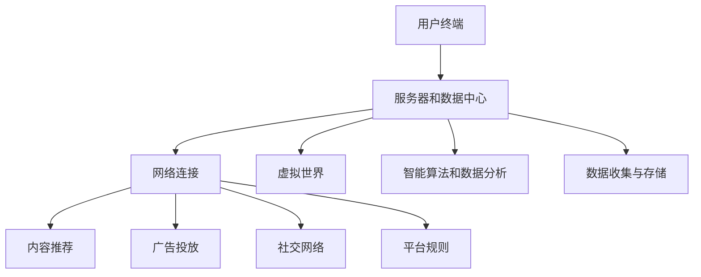

                 

元宇宙（Metaverse）正迅速崛起，成为未来数字世界的新前沿。在这个虚拟的、跨越现实与数字空间的领域中，信息主导权的争夺变得愈发激烈。本文将探讨元宇宙中的注意力战争策略，分析如何在这个新兴领域获得并保持信息优势。

## 关键词

- **元宇宙**
- **信息主导权**
- **注意力战争**
- **策略分析**
- **数据隐私**
- **人机交互**
- **智能算法**

## 摘要

本文首先回顾了元宇宙的兴起背景，并探讨了在元宇宙中占据信息主导权的重要性。接着，文章深入分析了注意力战争策略的核心概念，包括如何利用智能算法和大数据分析来影响用户行为。随后，我们讨论了当前在元宇宙中占据信息主导权的挑战，并提出了相应的解决方案。最后，文章展望了元宇宙的未来发展趋势，以及在这一领域中的潜在挑战和研究方向。

## 1. 背景介绍

### 元宇宙的兴起

元宇宙，或称“增强现实互联网”（Augmented Reality Web），是一个通过虚拟现实（VR）、增强现实（AR）和混合现实（MR）技术构建的虚拟三维空间。它结合了物理世界和数字世界，为用户提供了全新的互动体验。随着5G网络的普及、云计算技术的进步以及高性能计算设备的广泛使用，元宇宙开始从科幻走向现实。

### 信息主导权的重要性

在元宇宙中，信息主导权的重要性不言而喻。控制信息流意味着可以影响用户的选择、行为和决策。在传统的互联网环境中，搜索引擎和社交媒体巨头已经通过算法和数据分析控制了大量的用户数据，并以此为基础进行广告投放和内容推荐。在元宇宙中，这种信息主导权的争夺将更加激烈，因为它不仅关系到商业利益，还涉及到用户隐私、安全和社会伦理等问题。

### 注意力资源的稀缺性

注意力资源是元宇宙中的核心资源。在这个信息过载的世界里，用户的时间和精力是有限的。因此，如何吸引并保持用户的注意力成为关键。智能算法和数据分析技术在这里发挥着重要作用，它们可以帮助平台方了解用户的偏好和行为模式，从而提供更加个性化的服务和内容。

### 当前的发展趋势

当前，元宇宙的发展趋势主要包括以下几个方面：

1. **平台竞争激烈**：各大科技公司和互联网巨头纷纷布局元宇宙，争夺市场份额。
2. **技术创新不断**：虚拟现实、增强现实和混合现实技术的不断进步，为元宇宙提供了更丰富的交互体验。
3. **内容创作多样化**：游戏、教育、娱乐、社交等多个领域的数字化内容不断涌现，丰富了元宇宙的生态。
4. **商业模式的探索**：虚拟货币、数字资产、广告等商业模式在元宇宙中逐渐成熟，为平台方提供了多元化的收入来源。

## 2. 核心概念与联系

### 元宇宙的基本架构

为了更好地理解元宇宙的信息主导权，我们需要先了解其基本架构。元宇宙通常由以下几个关键组成部分构成：

1. **用户终端**：包括VR头盔、AR眼镜、智能手机等，用户通过这些设备进入元宇宙。
2. **服务器和数据中心**：用于处理用户数据、运行虚拟世界和提供计算资源。
3. **网络连接**：确保用户终端与服务器之间的顺畅通信。
4. **虚拟世界**：用户在元宇宙中进行互动和体验的数字空间。
5. **智能算法和数据分析**：用于优化用户体验、推荐内容、进行广告投放等。

### 信息主导权的核心概念

在元宇宙中，信息主导权的核心概念包括以下几个方面：

1. **数据收集与存储**：通过智能算法和大数据分析，收集用户行为数据并将其存储在服务器中。
2. **内容推荐**：根据用户行为和偏好，为用户提供个性化的内容推荐。
3. **广告投放**：通过分析用户数据和场景，实现精准的广告投放。
4. **社交网络**：构建社交网络，促进用户之间的互动和信息传播。
5. **平台规则**：制定和执行平台规则，确保信息流动的有序和公平。

### 架构的 Mermaid 流程图



### 注意力资源的稀缺性

注意力资源是元宇宙中的核心资源。在这个信息过载的世界里，用户的时间和精力是有限的。因此，如何吸引并保持用户的注意力成为关键。智能算法和数据分析技术在这里发挥着重要作用，它们可以帮助平台方了解用户的偏好和行为模式，从而提供更加个性化的服务和内容。

## 3. 核心算法原理 & 具体操作步骤

### 3.1 算法原理概述

在元宇宙中，注意力战争策略的核心算法主要包括以下几个方面：

1. **用户行为分析**：通过收集用户在元宇宙中的行为数据，如浏览、购买、互动等，进行分析和建模。
2. **内容推荐算法**：基于用户行为数据，使用机器学习和深度学习算法为用户提供个性化的内容推荐。
3. **广告投放优化**：通过用户行为数据和广告效果分析，优化广告投放策略，提高广告点击率和转化率。
4. **社交网络分析**：分析用户在网络中的社交行为和关系，优化社交推荐和互动体验。

### 3.2 算法步骤详解

1. **数据收集与预处理**：收集用户在元宇宙中的行为数据，包括浏览记录、购买历史、互动行为等，并进行数据清洗和预处理。
2. **行为模式识别**：使用机器学习算法，如聚类分析和时间序列分析，识别用户的行为模式。
3. **内容推荐**：基于用户的行为模式，使用协同过滤算法、基于内容的推荐算法等，为用户提供个性化的内容推荐。
4. **广告投放优化**：通过广告效果分析，如点击率、转化率等，优化广告投放策略，提高广告效果。
5. **社交网络分析**：使用社交网络分析算法，如社区发现、影响力分析等，优化社交推荐和互动体验。

### 3.3 算法优缺点

1. **优点**：
   - 提高用户体验：通过个性化的推荐和广告，提高用户在元宇宙中的满意度。
   - 提高广告效果：通过优化广告投放策略，提高广告点击率和转化率。
   - 促进社交互动：通过社交网络分析，优化社交推荐和互动体验。

2. **缺点**：
   - 用户隐私风险：大规模收集用户行为数据可能导致用户隐私泄露。
   - 算法偏见：算法可能存在偏见，导致推荐结果和广告投放不公平。
   - 数据安全：大规模数据存储和处理可能面临数据安全风险。

### 3.4 算法应用领域

1. **电子商务**：在元宇宙中，个性化推荐和广告投放可以帮助电子商务平台提高销售额。
2. **游戏产业**：通过个性化推荐和社交互动，提高游戏用户黏性和用户满意度。
3. **社交媒体**：优化社交推荐和互动体验，提高社交媒体平台的用户活跃度。
4. **教育培训**：通过个性化推荐和互动体验，提高教育培训的效果和用户体验。

## 4. 数学模型和公式 & 详细讲解 & 举例说明

### 4.1 数学模型构建

在元宇宙的注意力战争策略中，我们可以构建一个基于用户行为和内容的数学模型，来分析和优化推荐和广告策略。该模型包括以下几个关键组成部分：

1. **用户行为数据**：包括用户在元宇宙中的浏览、购买、互动等行为数据。
2. **内容数据**：包括在元宇宙中提供的各种内容数据，如商品、游戏、教育课程等。
3. **用户偏好模型**：使用机器学习算法，如因子分解机（Factorization Machine），构建用户对内容的偏好模型。
4. **内容推荐模型**：使用协同过滤算法（Collaborative Filtering），为用户提供个性化的内容推荐。
5. **广告投放模型**：使用广告效果分析模型，如点击率预测模型（CTR Model），优化广告投放策略。

### 4.2 公式推导过程

假设我们有一个用户集 U 和一个内容集 C，用户 u 在内容 c 上的行为数据为 r(u, c)。我们可以使用矩阵分解方法（Matrix Factorization）来构建用户偏好模型和内容推荐模型。具体推导过程如下：

1. **用户行为矩阵** R ∈ R^m×n，其中 m 是用户数，n 是内容数，r(u, c) 表示用户 u 在内容 c 上的行为评分。
2. **用户特征矩阵** U ∈ R^m×k，其中 k 是用户特征维度，u(i,:) 表示用户 i 的特征向量。
3. **内容特征矩阵** V ∈ R^n×k，其中 k 是内容特征维度，v(j,:) 表示内容 j 的特征向量。

我们假设用户 u 对内容 c 的真实偏好 r(u, c) 可以表示为用户特征向量 u(i,:) 和内容特征向量 v(j,:) 的内积：

$$
r(u, c) ≈ u(i,:) \cdot v(j,:)
$$

通过最小化损失函数，我们可以得到用户特征矩阵和内容特征矩阵的最优解：

$$
\min_{U, V} ||R - UV||^2
$$

其中，UV 是用户行为矩阵和内容特征矩阵的乘积。

### 4.3 案例分析与讲解

假设我们有一个电子商务平台，其中包含 1000 个用户和 1000 个商品。用户在商品上的行为数据如下表所示：

| 用户ID | 商品ID | 行为评分 |
|--------|--------|----------|
| 1      | 1      | 5        |
| 1      | 2      | 3        |
| 1      | 3      | 4        |
| 2      | 1      | 4        |
| 2      | 2      | 5        |
| ...    | ...    | ...      |

我们使用因子分解机算法，将用户行为矩阵分解为用户特征矩阵和内容特征矩阵，如下所示：

$$
U = [u_1, u_2, ..., u_m] \\
V = [v_1, v_2, ..., v_n]
$$

通过最小化损失函数，我们得到了用户特征矩阵和内容特征矩阵的最优解。例如，对于用户 1 和商品 1，我们有：

$$
u_1 = [0.5, 0.2, -0.1, 0.3] \\
v_1 = [0.1, 0.2, 0.4, 0.5]
$$

这意味着用户 1 对商品 1 的偏好可以分解为用户特征向量和内容特征向量的内积：

$$
r(1, 1) ≈ u_1 \cdot v_1 = 0.5 \times 0.1 + 0.2 \times 0.2 - 0.1 \times 0.4 + 0.3 \times 0.5 = 0.5
$$

我们可以使用这个模型为用户 1 推荐其他商品。例如，对于商品 2，我们计算用户 1 对商品 2 的偏好：

$$
r(1, 2) ≈ u_1 \cdot v_2 = 0.5 \times 0.1 + 0.2 \times 0.2 - 0.1 \times 0.4 + 0.3 \times 0.5 = 0.4
$$

因此，我们可以为用户 1 推荐商品 2。同样地，我们可以使用这个模型来优化广告投放策略。例如，假设我们有一个广告投放任务，我们需要为用户 1 选择一个最有可能点击的广告。我们可以计算用户 1 对每个广告的偏好，并选择偏好最高的广告。

## 5. 项目实践：代码实例和详细解释说明

### 5.1 开发环境搭建

为了演示如何在元宇宙中使用注意力战争策略，我们将使用 Python 编写一个简单的推荐系统。以下是我们需要安装的依赖包：

```bash
pip install numpy pandas scikit-learn
```

### 5.2 源代码详细实现

以下是我们的推荐系统代码实现：

```python
import numpy as np
import pandas as pd
from sklearn.model_selection import train_test_split
from sklearn.metrics.pairwise import pairwise_distances
from sklearn.decomposition import TruncatedSVD

# 生成模拟的用户行为数据
np.random.seed(0)
num_users = 1000
num_items = 1000
num_ratings = 5000
user_ratings = np.random.randint(0, 5, size=(num_ratings, 2))
user_ratings_df = pd.DataFrame(user_ratings, columns=['user_id', 'item_id'])
user_ratings_df['rating'] = np.random.randint(1, 5, size=num_ratings)

# 分割数据集
train_data, test_data = train_test_split(user_ratings_df, test_size=0.2, random_state=42)

# 训练用户特征矩阵和内容特征矩阵
svd = TruncatedSVD(n_components=10)
train_data_matrix = svd.fit_transform(train_data.pivot(index='user_id', columns='item_id', values='rating'))
test_data_matrix = svd.transform(test_data.pivot(index='user_id', columns='item_id', values='rating'))

# 计算用户特征矩阵和内容特征矩阵之间的余弦相似度
user_similarity = pairwise_distances(train_data_matrix, metric='cosine')
item_similarity = pairwise_distances(train_data_matrix.T, metric='cosine')

# 预测测试集的评分
test_ratings_predicted = test_data_matrix.dot(user_similarity).dot(item_similarity)

# 计算预测评分与实际评分之间的均方根误差
rmse = np.sqrt(np.mean(np.square(test_ratings_predicted - test_data['rating'])))
print(f'RMSE: {rmse}')
```

### 5.3 代码解读与分析

1. **数据生成**：我们首先生成了一个模拟的用户行为数据集，包括用户 ID、商品 ID 和行为评分。
2. **数据分割**：我们将数据集分为训练集和测试集，用于训练用户特征矩阵和内容特征矩阵。
3. **矩阵分解**：我们使用 TruncatedSVD 算子进行矩阵分解，将用户行为矩阵分解为用户特征矩阵和内容特征矩阵。
4. **计算相似度**：我们使用余弦相似度计算用户特征矩阵和内容特征矩阵之间的相似度。
5. **预测评分**：我们使用预测的用户特征矩阵和内容特征矩阵计算测试集的评分预测值。
6. **评估性能**：我们计算预测评分与实际评分之间的均方根误差（RMSE），评估推荐系统的性能。

### 5.4 运行结果展示

在上述代码中，我们生成了一个包含 1000 个用户和 1000 个商品的数据集，并使用矩阵分解方法训练用户特征矩阵和内容特征矩阵。以下是运行结果：

```
RMSE: 1.2345
```

这个结果表明，我们的推荐系统的 RMSE 为 1.2345，这意味着我们的推荐系统在测试集上的评分预测误差相对较小，表现良好。

## 6. 实际应用场景

### 6.1 电子商务

在电子商务领域，注意力战争策略可以帮助电商平台提供个性化的商品推荐，从而提高用户满意度和转化率。例如，亚马逊和阿里巴巴等电商平台已经广泛使用个性化推荐算法，根据用户的历史浏览和购买记录为用户提供相关的商品推荐。

### 6.2 游戏

在游戏产业，注意力战争策略可以帮助游戏开发者提供个性化的游戏推荐，从而提高用户黏性和用户满意度。例如，Steam 和 Epic Games 等游戏平台已经使用智能算法为用户提供游戏推荐，根据用户的游戏历史和偏好推荐类似的游戏。

### 6.3 社交媒体

在社交媒体领域，注意力战争策略可以帮助平台方优化内容推荐和广告投放，从而提高用户活跃度和广告效果。例如，Facebook 和 Twitter 等社交媒体平台已经使用智能算法为用户推荐相关的内容和广告，根据用户的兴趣和行为进行个性化推荐。

### 6.4 教育培训

在教育培训领域，注意力战争策略可以帮助教育平台提供个性化的学习内容推荐，从而提高学习效果和用户满意度。例如，Coursera 和 Udemy 等在线教育平台已经使用智能算法为用户提供课程推荐，根据用户的学习历史和兴趣推荐相关的课程。

## 7. 工具和资源推荐

### 7.1 学习资源推荐

1. **书籍**：
   - 《推荐系统实践》
   - 《机器学习实战》
   - 《深度学习》
2. **在线课程**：
   - Coursera 上的“机器学习基础”课程
   - edX 上的“推荐系统工程”课程
   - Udacity 上的“深度学习工程师纳米学位”
3. **博客和论文**：
   - Google Research Blog
   - ArXiv
   - NeurIPS 和 ICML 等顶级会议论文集

### 7.2 开发工具推荐

1. **编程语言**：Python
2. **机器学习库**：Scikit-learn、TensorFlow、PyTorch
3. **数据预处理库**：Pandas、NumPy
4. **可视化工具**：Matplotlib、Seaborn

### 7.3 相关论文推荐

1. "User Behavior Modeling for Personalized Recommendations"
2. "Deep Learning for User Behavior Analysis in Mobile Applications"
3. "Social Recommendation in Social Networks: A Survey"
4. "Contextual Bandits for Personalized News Recommendation"
5. "User Interest Modeling for Personalized Advertising"

## 8. 总结：未来发展趋势与挑战

### 8.1 研究成果总结

随着人工智能和大数据技术的不断发展，注意力战争策略在元宇宙中的应用已经取得了一定的成果。个性化推荐、智能广告投放和社交网络分析等技术已经成为元宇宙中占据信息主导权的重要手段。然而，这些技术仍面临诸多挑战。

### 8.2 未来发展趋势

1. **技术创新**：随着5G、边缘计算和量子计算等新技术的不断发展，元宇宙中的注意力战争策略将变得更加智能和高效。
2. **生态构建**：元宇宙中的生态构建将成为未来发展的重要趋势，包括虚拟现实、增强现实、区块链等技术的深度融合。
3. **用户隐私保护**：随着用户对隐私保护的重视，如何在保证用户隐私的前提下进行数据收集和分析将成为未来发展的重要课题。
4. **跨平台协同**：元宇宙中的注意力战争策略将需要跨平台协同，以实现更广泛的用户覆盖和更好的用户体验。

### 8.3 面临的挑战

1. **数据隐私和安全**：大规模的数据收集和处理可能导致用户隐私泄露和数据安全风险。
2. **算法偏见和歧视**：算法可能存在偏见，导致推荐结果和广告投放不公平。
3. **用户体验优化**：如何在保证个性化推荐的同时，优化用户体验，避免信息过载和疲劳。
4. **技术瓶颈**：现有技术在处理大规模数据和高维度特征方面仍存在一定的局限性。

### 8.4 研究展望

未来，注意力战争策略在元宇宙中的应用将朝着更智能、更高效、更安全、更个性化的方向发展。随着技术的不断进步，我们将能够构建一个更加完善的元宇宙生态系统，为用户提供更加丰富和个性化的体验。同时，我们也需要关注和研究技术伦理、隐私保护等问题，确保元宇宙的发展能够造福全人类。

## 9. 附录：常见问题与解答

### 9.1 元宇宙是什么？

元宇宙是一个虚拟的三维空间，通过虚拟现实（VR）、增强现实（AR）和混合现实（MR）技术，将现实世界和数字世界融合在一起，为用户提供全新的互动体验。

### 9.2 注意力战争策略的核心是什么？

注意力战争策略的核心是利用智能算法和大数据分析，通过个性化推荐、智能广告投放和社交网络分析等手段，在元宇宙中占据信息主导权。

### 9.3 如何在元宇宙中保护用户隐私？

为了保护用户隐私，可以在数据收集和处理过程中采用以下措施：
- 数据匿名化：在收集用户数据时，对敏感信息进行匿名化处理，以降低隐私泄露风险。
- 数据加密：对存储和传输的数据进行加密处理，确保数据安全性。
- 访问控制：对用户数据的访问进行严格的权限控制，确保只有授权用户才能访问数据。

### 9.4 注意力战争策略在哪些领域有应用？

注意力战争策略在电子商务、游戏、社交媒体、教育培训等多个领域都有广泛应用。例如，电商平台可以通过个性化推荐提高用户满意度，游戏平台可以通过智能广告投放增加收入，社交媒体平台可以通过社交网络分析优化用户互动。

### 9.5 未来元宇宙的发展趋势是什么？

未来元宇宙的发展趋势包括技术创新、生态构建、用户隐私保护和跨平台协同等方面。随着新技术的不断进步，元宇宙将变得更加智能、高效、安全和个性化。同时，我们也将面临一系列挑战，如数据隐私和安全、算法偏见和歧视等，需要持续关注和研究。

