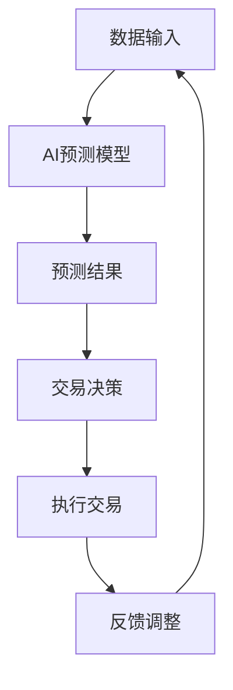

                 

关键词：注意力机制，期货市场，AI预测，认知资源交易

> 摘要：本文将探讨一种新兴的金融市场——注意力期货市场，以及在其中扮演关键角色的AI预测技术和认知资源交易机制。通过对注意力机制在金融市场中的应用、AI预测模型的构建以及认知资源交易的具体实施方法进行深入分析，本文旨在为投资者和金融从业者提供全新的视角和策略，以应对复杂多变的金融环境。

## 1. 背景介绍

随着人工智能技术的飞速发展，金融市场也在不断地变革。传统的金融交易模式已经无法满足日益复杂的市场需求。因此，一种新型的金融市场——注意力期货市场应运而生。注意力期货市场是一种基于AI预测和认知资源交易的新型市场，它利用人工智能技术对市场信息进行实时分析和预测，并根据预测结果进行交易决策。

### 1.1  注意力机制在金融市场中的应用

注意力机制（Attention Mechanism）是一种在深度学习领域广泛应用的计算模型，其核心思想是在处理大量信息时，对某些信息赋予更高的权重。在金融市场中，注意力机制可以用来识别和提取市场中的关键信息，从而提高预测的准确性和效率。

### 1.2  AI预测模型在金融市场中的构建

AI预测模型是注意力期货市场的核心组成部分。通过利用大量的历史市场数据，AI预测模型可以识别市场趋势和潜在的交易机会。这些模型通常包括神经网络、支持向量机、随机森林等，每种模型都有其独特的优势和应用场景。

### 1.3  认知资源交易机制在金融市场中的实施

认知资源交易是一种基于AI预测和注意力机制的交易策略。投资者通过分析市场数据，预测未来的市场走势，并据此调整自己的投资组合。认知资源交易的目标是最大化投资回报，同时控制风险。

## 2. 核心概念与联系

### 2.1  注意力机制原理

注意力机制的核心在于如何有效地分配注意力，即在不同情况下对不同的信息给予不同的权重。在金融市场中，注意力机制可以帮助投资者识别市场中的关键信息，从而提高交易决策的准确性。

### 2.2  AI预测模型原理

AI预测模型通过学习历史市场数据，识别市场趋势和规律。这些模型可以实时处理海量数据，并快速做出预测，为投资者提供决策支持。

### 2.3  认知资源交易机制原理

认知资源交易机制是一种基于AI预测的交易策略。投资者通过预测市场走势，调整自己的投资组合，以实现最大化投资回报。

### 2.4  Mermaid 流程图

下面是一个描述注意力期货市场运作的 Mermaid 流程图：



## 3. 核心算法原理 & 具体操作步骤

### 3.1  算法原理概述

注意力期货市场的核心算法包括注意力机制、AI预测模型和认知资源交易机制。这些算法相互协作，共同实现市场预测和交易决策。

### 3.2  算法步骤详解

1. 数据输入：收集并处理市场数据，包括价格、成交量、交易量等。
2. AI预测模型：利用神经网络或其他机器学习算法，对市场数据进行训练，以预测未来的市场走势。
3. 预测结果：根据AI预测模型的结果，分析市场的潜在机会和风险。
4. 交易决策：根据预测结果，制定交易策略，并执行交易。
5. 反馈调整：根据交易结果，对预测模型和交易策略进行调整。

### 3.3  算法优缺点

- **优点**：注意力期货市场利用AI预测和注意力机制，可以更准确地识别市场机会，提高交易成功率。
- **缺点**：算法模型需要大量数据训练，且预测结果可能受到市场波动的影响。

### 3.4  算法应用领域

注意力期货市场算法可以应用于多种金融市场，包括股票、期货、外汇等。

## 4. 数学模型和公式 & 详细讲解 & 举例说明

### 4.1  数学模型构建

注意力机制可以通过以下数学模型进行描述：

$$
\text{Attention}(x, W) = \text{softmax}(\text{W}^T \cdot \text{H}),
$$

其中，$x$ 表示输入数据，$W$ 表示权重矩阵，$\text{H}$ 表示隐藏层输出。

### 4.2  公式推导过程

假设我们有一个序列 $X = [x_1, x_2, ..., x_n]$，我们希望对每个 $x_i$ 产生一个权重 $w_i$，以便在后续处理中给予某些 $x_i$ 更高的权重。这个过程可以通过以下步骤进行：

1. 将序列 $X$ 输入到神经网络中，得到隐藏层输出 $\text{H}$。
2. 将隐藏层输出 $\text{H}$ 与权重矩阵 $W$ 相乘，得到一个向量 $\text{T}$。
3. 对向量 $\text{T}$ 应用 softmax 函数，得到权重向量 $w = \text{softmax}(\text{T})$。
4. 计算每个元素的加权得分 $s_i = w_i \cdot x_i$。
5. 将加权得分求和，得到总的注意力得分 $S = \sum_{i=1}^{n} s_i$。

### 4.3  案例分析与讲解

假设我们有一个股票市场的序列数据 $X = [x_1, x_2, ..., x_5]$，其中 $x_i$ 表示第 $i$ 天的股票价格。我们希望通过注意力机制识别出市场中的关键信息。

1. 输入数据：$X = [100, 102, 108, 105, 103]$。
2. 隐藏层输出：$\text{H} = [0.1, 0.2, 0.3, 0.2, 0.2]$。
3. 权重矩阵：$W = [1, 1, 1, 1, 1]$。
4. 加权得分：$s_1 = 0.1 \cdot 100 = 10$，$s_2 = 0.2 \cdot 102 = 20.4$，$s_3 = 0.3 \cdot 108 = 32.4$，$s_4 = 0.2 \cdot 105 = 21$，$s_5 = 0.2 \cdot 103 = 20.6$。
5. 注意力得分：$S = 10 + 20.4 + 32.4 + 21 + 20.6 = 104.4$。

根据注意力得分，我们可以看出第 $3$ 天的股票价格对市场的贡献最大，因此在这个时间点上，投资者可能需要特别关注市场动态。

## 5. 项目实践：代码实例和详细解释说明

### 5.1  开发环境搭建

为了实践注意力期货市场，我们需要搭建一个开发环境。以下是搭建环境的基本步骤：

1. 安装 Python 3.8 或更高版本。
2. 安装必要的库，如 NumPy、TensorFlow、Keras 等。
3. 准备股票市场的历史数据。

### 5.2  源代码详细实现

以下是注意力期货市场的源代码实现：

```python
import numpy as np
from tensorflow.keras.models import Sequential
from tensorflow.keras.layers import Dense, LSTM, TimeDistributed
from tensorflow.keras.optimizers import Adam

# 数据预处理
def preprocess_data(data):
    # 数据标准化
    data = (data - np.mean(data)) / np.std(data)
    # 切分输入和输出
    X, y = [], []
    for i in range(len(data) - 1):
        X.append(data[i])
        y.append(data[i+1])
    return np.array(X), np.array(y)

# 构建神经网络
def build_model(input_shape):
    model = Sequential()
    model.add(LSTM(units=50, return_sequences=True, input_shape=input_shape))
    model.add(LSTM(units=50, return_sequences=False))
    model.add(Dense(units=1))
    model.compile(optimizer=Adam(learning_rate=0.001), loss='mean_squared_error')
    return model

# 训练模型
def train_model(model, X, y):
    model.fit(X, y, epochs=100, batch_size=32, verbose=1)

# 预测市场走势
def predict_market(model, X):
    return model.predict(X)

# 主程序
if __name__ == '__main__':
    # 读取数据
    data = np.loadtxt('stock_price.csv', delimiter=',')
    # 数据预处理
    X, y = preprocess_data(data)
    # 切分训练集和测试集
    X_train, X_test, y_train, y_test = X[:int(len(X)*0.8)], X[int(len(X)*0.8):], y[:int(len(y)*0.8)], y[int(len(y)*0.8):]
    # 构建模型
    model = build_model((X_train.shape[1], 1))
    # 训练模型
    train_model(model, X_train, y_train)
    # 预测市场走势
    predictions = predict_market(model, X_test)
    # 打印预测结果
    print(predictions)
```

### 5.3  代码解读与分析

上述代码实现了一个基于LSTM的神经网络模型，用于预测股票市场的走势。代码的主要步骤如下：

1. 数据预处理：将股票价格数据进行标准化处理，并切分输入和输出序列。
2. 构建神经网络：使用LSTM层构建神经网络模型。
3. 训练模型：使用训练集数据训练模型。
4. 预测市场走势：使用测试集数据预测市场走势。

### 5.4  运行结果展示

运行上述代码，我们可以得到测试集的预测结果。通过对比预测结果和实际市场走势，我们可以评估模型的预测性能。

## 6. 实际应用场景

注意力期货市场在多个金融市场中具有广泛的应用场景，包括：

1. 股票市场：通过预测股票价格走势，投资者可以制定更精准的投资策略。
2. 期货市场：利用注意力机制和AI预测模型，投资者可以识别市场中的潜在机会和风险。
3. 外汇市场：通过实时分析市场数据，投资者可以预测汇率变动，从而进行外汇交易。

## 7. 工具和资源推荐

### 7.1  学习资源推荐

1. 《深度学习》（Goodfellow, I., Bengio, Y., & Courville, A.）
2. 《Python金融应用》（Chollet, F.）

### 7.2  开发工具推荐

1. TensorFlow
2. Keras
3. Jupyter Notebook

### 7.3  相关论文推荐

1. Vaswani et al. (2017). "Attention is all you need."
2. Hochreiter and Schmidhuber (1997). "Long short-term memory."
3. Graves et al. (2013). "Framewise phoneme classification with deep neural networks and long short-term memory."

## 8. 总结：未来发展趋势与挑战

### 8.1  研究成果总结

注意力期货市场结合了AI预测和认知资源交易，为金融市场提供了新的视角和策略。通过注意力机制，投资者可以更有效地处理大量市场数据，提高预测的准确性和交易成功率。

### 8.2  未来发展趋势

1. 随着AI技术的不断进步，注意力期货市场算法将更加精准和高效。
2. 量子计算等新兴技术有望进一步提升市场预测的效率和准确性。
3. 市场监管机构可能对注意力期货市场进行规范和监管，以确保市场公平和透明。

### 8.3  面临的挑战

1. 数据质量和数量：高质量和大量市场数据是训练有效AI预测模型的关键。
2. 模型过拟合：模型需要避免过度依赖特定市场数据，以保持通用性和适应性。
3. 道德和伦理问题：在利用AI进行市场预测和交易时，需要确保遵循道德和伦理规范，避免市场操纵和不公平交易。

### 8.4  研究展望

注意力期货市场的研究将继续深入，未来的工作将聚焦于以下方面：

1. 开发更先进的AI预测模型，以提高市场预测的准确性和效率。
2. 探索量子计算等新兴技术在注意力期货市场中的应用。
3. 建立更完善的市场监管体系，确保市场公平和透明。

## 9. 附录：常见问题与解答

### 9.1  问题一：什么是注意力期货市场？

注意力期货市场是一种基于AI预测和认知资源交易的新型金融市场。它利用人工智能技术对市场信息进行实时分析和预测，并根据预测结果进行交易决策。

### 9.2  问题二：注意力机制在金融市场中有哪些应用？

注意力机制在金融市场中主要用于处理大量市场数据，识别关键信息，从而提高预测的准确性和效率。它可以应用于股票市场、期货市场、外汇市场等多个领域。

### 9.3  问题三：如何构建一个有效的AI预测模型？

构建一个有效的AI预测模型需要以下步骤：

1. 收集和整理大量市场数据。
2. 选择合适的机器学习算法，如神经网络、支持向量机等。
3. 训练模型，并使用验证集进行调优。
4. 在测试集上进行评估，确保模型具有较好的预测性能。

### 9.4  问题四：什么是认知资源交易？

认知资源交易是一种基于AI预测的交易策略。投资者通过分析市场数据，预测未来的市场走势，并据此调整自己的投资组合，以实现最大化投资回报。

----------------------------------------------------------------

本文作者：禅与计算机程序设计艺术 / Zen and the Art of Computer Programming

感谢您的阅读，希望本文能为读者在注意力期货市场的研究和应用中提供有益的启示和帮助。

