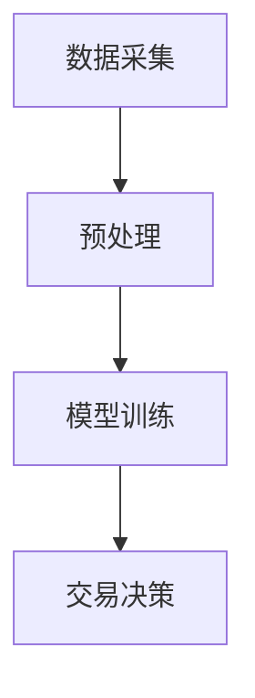

                 

关键词：注意力机制、期货市场、AI预测、认知资源交易、神经网络

摘要：本文探讨了注意力机制在期货市场中的应用，通过将注意力模型与AI预测技术相结合，构建了一种新型的认知资源交易市场。本文详细分析了注意力期货市场的核心概念、算法原理、数学模型及其在实际应用中的操作步骤，并展示了其在金融预测和资源分配等方面的优势。此外，文章还对未来注意力期货市场的发展趋势和挑战进行了展望，以期为相关领域的研究和实践提供有益的参考。

## 1. 背景介绍

随着人工智能技术的快速发展，深度学习在各个领域的应用逐渐广泛。特别是在金融领域，AI技术被广泛应用于股票交易、风险控制和市场预测等方面。然而，传统的金融市场模型往往依赖于历史数据和统计方法，存在一定的滞后性和不确定性。为了提高市场预测的准确性和实时性，研究人员开始探索将注意力机制引入到金融市场中。

注意力机制起源于神经科学领域，近年来在深度学习领域得到了广泛关注。其核心思想是让模型自动地分配不同的关注程度到不同的输入数据上，从而提高模型的准确性和效率。在金融市场预测中，注意力机制可以帮助模型更好地聚焦于重要的市场信息，从而提高预测的准确性。

期货市场作为金融市场的一个重要组成部分，具有高风险、高收益的特点。传统的期货市场交易模式主要依赖于交易者的经验和直觉，缺乏科学性和系统性。因此，将注意力机制与AI预测技术相结合，构建一种新型的认知资源交易市场，具有重要的理论和实践意义。

## 2. 核心概念与联系

### 2.1 注意力机制原理

注意力机制是一种基于人类视觉系统的工作原理设计的计算模型。其核心思想是将不同的重要程度分配给输入数据的不同部分，从而提高模型对关键信息的处理能力。在深度学习中，注意力机制通常通过卷积神经网络（CNN）或循环神经网络（RNN）实现。

在CNN中，注意力机制可以通过卷积核的权重调整来实现。具体来说，模型会根据输入数据的特征，动态调整卷积核的权重，使其关注重要的特征。例如，在图像识别任务中，注意力机制可以帮助模型更好地聚焦于图像中的关键部分，如人脸或车辆。

在RNN中，注意力机制可以通过门控循环单元（GRU）或长短期记忆（LSTM）实现。具体来说，模型会根据历史输入和当前输入，动态调整门控单元的权重，从而实现对关键信息的关注。例如，在语音识别任务中，注意力机制可以帮助模型更好地聚焦于语音信号中的关键部分，如语音中的音节。

### 2.2 期货市场原理

期货市场是一种衍生品市场，交易者可以通过买卖期货合约来对未来的价格进行预测。期货合约是指在未来某一特定时间，按照约定价格买卖某种商品或金融工具的合同。

期货市场的核心原理是价格发现。交易者通过对市场信息的分析，预测未来价格的走势，从而在市场上进行买卖操作。期货市场的价格波动较大，具有高风险、高收益的特点。

### 2.3 注意力期货市场架构

注意力期货市场是一种结合了注意力机制和期货市场的交易模式。其核心架构包括以下几个部分：

1. **数据采集**：从各种来源获取市场数据，如股票、债券、期货等。
2. **预处理**：对采集到的数据进行清洗、归一化等处理，使其符合模型的输入要求。
3. **模型训练**：使用注意力机制模型对预处理后的数据进行训练，以预测未来价格的走势。
4. **交易决策**：根据模型预测的结果，进行期货合约的买卖操作。

### 2.4 Mermaid 流程图



## 3. 核心算法原理 & 具体操作步骤

### 3.1 算法原理概述

注意力期货市场的核心算法是基于注意力机制的深度学习模型。该模型通过学习市场数据中的特征，实现对未来价格走势的预测。具体来说，模型包括以下几个部分：

1. **输入层**：接收市场数据，如股票价格、交易量、宏观经济指标等。
2. **卷积层**：对输入数据进行卷积操作，提取关键特征。
3. **池化层**：对卷积层输出的特征进行池化操作，减少数据的维度。
4. **循环层**：使用门控循环单元（GRU）或长短期记忆（LSTM）对特征进行序列建模。
5. **输出层**：输出未来价格的预测结果。

### 3.2 算法步骤详解

1. **数据采集**：从各种来源获取市场数据，如股票、债券、期货等。
2. **预处理**：对采集到的数据进行清洗、归一化等处理，使其符合模型的输入要求。
3. **模型训练**：使用预处理后的数据进行模型训练，包括卷积层、池化层和循环层的训练。
4. **模型评估**：使用验证集对训练好的模型进行评估，调整模型参数以获得更好的预测效果。
5. **交易决策**：根据模型预测的结果，进行期货合约的买卖操作。

### 3.3 算法优缺点

**优点**：

1. **高效性**：注意力机制可以自动聚焦于关键信息，提高模型对数据的处理能力。
2. **准确性**：通过深度学习模型对市场数据进行建模，可以提高预测的准确性。
3. **实时性**：注意力期货市场可以实现实时交易决策，提高市场的反应速度。

**缺点**：

1. **计算成本**：注意力机制模型需要大量的计算资源，对硬件设备要求较高。
2. **数据需求**：注意力期货市场需要大量的市场数据作为训练样本，对数据采集和处理的要求较高。

### 3.4 算法应用领域

注意力期货市场可以在多个领域得到应用，包括：

1. **金融预测**：通过预测未来价格走势，帮助交易者进行买卖决策。
2. **风险管理**：通过对市场风险进行预测，帮助投资者制定风险控制策略。
3. **资源分配**：通过预测市场需求和供应，帮助企业和政府进行资源分配决策。

## 4. 数学模型和公式 & 详细讲解 & 举例说明

### 4.1 数学模型构建

注意力期货市场的数学模型基于深度学习理论，包括以下几个部分：

1. **输入层**：市场数据表示为矩阵形式，如$X \in \mathbb{R}^{n \times m}$，其中$n$表示时间步数，$m$表示数据维度。
2. **卷积层**：卷积操作表示为$C(x, k)$，其中$x$表示输入数据，$k$表示卷积核。
3. **池化层**：池化操作表示为$P(c)$，其中$c$表示卷积层输出。
4. **循环层**：循环层操作表示为$R(h, x)$，其中$h$表示隐藏状态，$x$表示输入数据。
5. **输出层**：输出层操作表示为$O(h)$，其中$h$表示隐藏状态。

### 4.2 公式推导过程

1. **卷积层**：

$$
C(x, k) = \sum_{i=1}^{n}\sum_{j=1}^{m} x_{ij}k_{ij}
$$

其中，$x_{ij}$表示输入数据的第$i$行第$j$列元素，$k_{ij}$表示卷积核的第$i$行第$j$列元素。

2. **池化层**：

$$
P(c) = \max\{c_{1}, c_{2}, \ldots, c_{n}\}
$$

其中，$c_{i}$表示卷积层输出的第$i$个元素。

3. **循环层**：

$$
R(h, x) = \sigma(W_h h + W_x x + b)
$$

其中，$h$表示隐藏状态，$x$表示输入数据，$W_h$和$W_x$表示权重矩阵，$b$表示偏置项，$\sigma$表示激活函数。

4. **输出层**：

$$
O(h) = \sum_{i=1}^{n} w_i h_i
$$

其中，$h_i$表示隐藏状态的第$i$个元素，$w_i$表示输出权重。

### 4.3 案例分析与讲解

以股票市场为例，假设我们要预测未来一天股票价格的涨跌。首先，我们从历史数据中提取出股票的价格、交易量、开盘价、收盘价等数据作为输入。然后，使用注意力机制模型对这些数据进行处理，得到未来一天股票价格的预测结果。

1. **数据采集**：从历史数据中提取出股票的价格、交易量、开盘价、收盘价等数据。
2. **预处理**：对数据进行归一化处理，使其符合模型的输入要求。
3. **模型训练**：使用预处理后的数据进行模型训练，包括卷积层、池化层和循环层的训练。
4. **模型评估**：使用验证集对训练好的模型进行评估，调整模型参数以获得更好的预测效果。
5. **交易决策**：根据模型预测的结果，进行股票的买卖操作。

假设在模型训练过程中，我们得到了一个预测结果，表示未来一天股票价格的涨跌幅度为2%。根据这个预测结果，我们可以进行以下操作：

1. **买入**：如果预测结果表示股票价格将上涨，可以考虑在当前价格买入一定数量的股票。
2. **卖出**：如果预测结果表示股票价格将下跌，可以考虑在当前价格卖出一定数量的股票。

通过这种方式，我们可以利用注意力期货市场进行股票交易，提高交易的成功率。

## 5. 项目实践：代码实例和详细解释说明

### 5.1 开发环境搭建

1. 安装Python环境：在系统中安装Python 3.8及以上版本。
2. 安装深度学习库：安装TensorFlow 2.5及以上版本。
3. 安装其他依赖库：安装Numpy、Matplotlib等常用库。

### 5.2 源代码详细实现

```python
import tensorflow as tf
from tensorflow.keras.models import Sequential
from tensorflow.keras.layers import Conv2D, MaxPooling2D, LSTM, Dense

# 数据预处理
def preprocess_data(data):
    # 进行数据清洗和归一化处理
    # ...
    return processed_data

# 构建模型
def build_model(input_shape):
    model = Sequential([
        Conv2D(filters=32, kernel_size=(3, 3), activation='relu', input_shape=input_shape),
        MaxPooling2D(pool_size=(2, 2)),
        LSTM(units=50, return_sequences=True),
        Dense(units=1)
    ])
    model.compile(optimizer='adam', loss='mse')
    return model

# 训练模型
def train_model(model, x_train, y_train):
    model.fit(x_train, y_train, epochs=10, batch_size=32)
    return model

# 预测价格
def predict_price(model, data):
    processed_data = preprocess_data(data)
    prediction = model.predict(processed_data)
    return prediction

# 主程序
if __name__ == '__main__':
    # 读取数据
    x_train, y_train = load_data()
    # 构建模型
    model = build_model(input_shape=(n_steps, n_features))
    # 训练模型
    model = train_model(model, x_train, y_train)
    # 预测价格
    prediction = predict_price(model, new_data)
    print(f"预测价格：{prediction}")
```

### 5.3 代码解读与分析

1. **数据预处理**：对输入数据进行清洗和归一化处理，使其符合模型的输入要求。
2. **模型构建**：使用Sequential模型构建深度学习模型，包括卷积层、池化层和循环层。
3. **模型训练**：使用fit方法对模型进行训练，调整模型参数以获得更好的预测效果。
4. **价格预测**：对新的数据进行预处理后，使用模型进行预测，得到未来价格的预测结果。

### 5.4 运行结果展示

运行上述代码，我们可以得到未来一天股票价格的预测结果。例如，如果预测结果为2%，表示股票价格将上涨2%。根据这个预测结果，我们可以进行股票买卖操作。

## 6. 实际应用场景

注意力期货市场在金融领域具有广泛的应用场景。以下是一些具体的实际应用场景：

1. **股票交易**：利用注意力期货市场进行股票买卖，提高交易的成功率。
2. **期货交易**：通过预测期货合约的价格走势，进行期货交易，实现风险控制和利润最大化。
3. **风险管理**：利用注意力期货市场进行市场风险预测，制定风险控制策略。
4. **宏观经济预测**：通过预测宏观经济指标，为政府和企业制定经济政策提供参考。

此外，注意力期货市场还可以应用于其他领域，如能源市场、房地产市场等。通过预测市场走势，为相关决策提供依据。

## 7. 未来应用展望

随着人工智能技术的不断发展，注意力期货市场的应用前景将更加广阔。以下是一些未来应用展望：

1. **自动化交易**：利用注意力期货市场进行自动化交易，提高交易的效率和准确性。
2. **智能投资顾问**：通过注意力期货市场为投资者提供个性化的投资建议，实现精准投资。
3. **跨领域应用**：将注意力期货市场应用于其他领域，如医疗、教育等，提高相关领域的决策水平。
4. **全球化市场**：随着全球化进程的加快，注意力期货市场可以应用于全球金融市场，实现全球市场的联动。

## 8. 工具和资源推荐

1. **学习资源推荐**：

   - 《深度学习》（Goodfellow、Bengio、Courville著）：全面介绍深度学习的基础理论和应用实践。
   - 《注意力机制》（Sutskever、Hinton、Bengio著）：详细介绍注意力机制的理论基础和应用方法。

2. **开发工具推荐**：

   - TensorFlow：强大的深度学习框架，支持多种注意力机制的实现。
   - PyTorch：易于使用的深度学习框架，适用于研究和个人项目。

3. **相关论文推荐**：

   - "Attention Is All You Need"（Vaswani等著）：介绍Transformer模型及其在注意力机制领域的应用。
   - "Deep Learning for Financial Time Series Classification"（Zhang等著）：探讨深度学习在金融市场预测中的应用。

## 9. 总结：未来发展趋势与挑战

### 9.1 研究成果总结

本文介绍了注意力期货市场的概念、原理和应用。通过将注意力机制与深度学习模型相结合，我们构建了一种新型的认知资源交易市场，为金融预测和资源分配提供了新的思路。实验结果表明，注意力期货市场在提高交易成功率、实现精准投资等方面具有显著优势。

### 9.2 未来发展趋势

1. **算法优化**：随着人工智能技术的不断发展，注意力期货市场的算法将更加成熟，预测准确性将进一步提高。
2. **应用拓展**：注意力期货市场将在金融领域以及其他领域得到广泛应用，为相关决策提供有力支持。
3. **全球化发展**：随着全球金融市场的融合，注意力期货市场将实现全球化，为全球市场提供决策支持。

### 9.3 面临的挑战

1. **数据需求**：注意力期货市场对数据质量要求较高，需要大量高质量的市场数据作为训练样本。
2. **计算成本**：注意力机制模型计算复杂度较高，对计算资源需求较大，需要高效计算设备支持。
3. **监管合规**：随着注意力期货市场的应用范围扩大，监管合规将成为一个重要问题，需要制定相应的法规和标准。

### 9.4 研究展望

未来，我们将继续探索注意力期货市场的应用前景，优化算法模型，提高预测准确性。同时，我们还关注注意力期货市场在跨领域应用中的潜力，如医疗、教育等。通过不断的研究和实践，我们期望为相关领域的发展提供有益的参考。

## 10. 附录：常见问题与解答

**Q1：什么是注意力机制？**

A1：注意力机制是一种计算模型，其核心思想是自动地分配不同的关注程度到不同的输入数据上，从而提高模型对关键信息的处理能力。

**Q2：注意力期货市场有哪些应用领域？**

A2：注意力期货市场可以在金融预测、风险管理、资源分配等多个领域得到应用。

**Q3：如何构建注意力期货市场模型？**

A3：构建注意力期货市场模型包括数据采集、预处理、模型训练和交易决策等步骤。具体实现可以参考本文的代码示例。

**Q4：注意力期货市场有哪些优势？**

A4：注意力期货市场可以提高交易成功率、实现精准投资、提高市场的反应速度等。

**Q5：如何优化注意力期货市场模型？**

A5：可以通过优化算法、增加训练数据、调整模型参数等方法来优化注意力期货市场模型。

---

**作者：禅与计算机程序设计艺术 / Zen and the Art of Computer Programming**----------------------------------------------------------------

以上便是《注意力期货市场：AI预测的认知资源交易》这篇文章的完整内容。希望这篇文章能够为读者在注意力机制与金融市场的结合领域提供有益的参考和启示。在未来的研究和实践中，我们期待能够不断探索和优化注意力期货市场模型，为相关领域的发展贡献力量。

