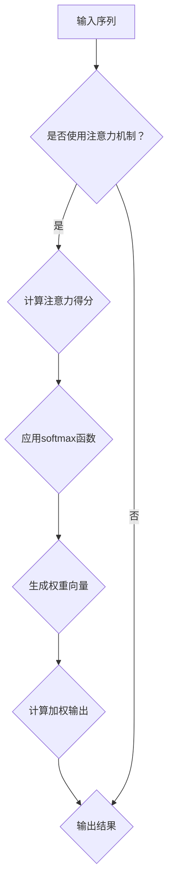

                 

关键词：注意力机制、softmax、位置编码器、深度学习、神经网络、信息提取、信息融合、模型优化

> 摘要：本文将深入探讨注意力机制中的softmax和位置编码器的原理、实现和应用，通过详尽的数学模型、算法步骤和项目实践，帮助读者全面理解并掌握这两种核心技术。

## 1. 背景介绍

随着深度学习技术的快速发展，神经网络在自然语言处理、计算机视觉等领域的应用越来越广泛。然而，传统的卷积神经网络（CNN）和循环神经网络（RNN）在处理序列数据时存在一定的局限性。例如，在长序列中，信息可能会被逐渐遗忘或稀释，导致模型无法有效地捕捉全局依赖关系。为了解决这一问题，注意力机制（Attention Mechanism）被提出，并迅速成为深度学习领域的一个重要研究方向。

注意力机制最早由Bahdanau等人在2014年提出，它通过为输入序列中的每个元素分配权重，使得模型能够自适应地关注重要的信息，从而提高信息提取的效率和准确性。在注意力机制的基础上，softmax函数和位置编码器被广泛应用于各种深度学习模型，进一步增强了模型的表达能力和性能。

本文将首先介绍注意力机制的基本原理，然后详细探讨softmax和位置编码器的实现方法、优缺点以及在实际应用中的效果，帮助读者深入理解注意力机制在实际项目中的应用。

## 2. 核心概念与联系

### 2.1 注意力机制的原理

注意力机制的核心思想是通过为输入序列中的每个元素分配权重，使得模型在处理序列数据时能够关注到关键信息，从而提高模型的性能。具体来说，注意力机制通过一个注意力得分函数计算输入序列中每个元素的得分，并将这些得分转换为权重，最后将权重应用于输入序列，从而生成加权输出。

### 2.2 softmax函数在注意力机制中的应用

softmax函数是注意力机制中的核心组成部分，它用于将注意力得分转换为权重。具体来说，softmax函数将注意力得分映射到一个概率分布，使得每个元素的权重在0和1之间，并且所有元素的权重之和为1。这样，权重最大的元素对应着模型关注的重点，从而实现信息提取。

### 2.3 位置编码器的作用

位置编码器用于为序列中的每个元素赋予位置信息，使得模型能够捕捉到序列中的局部依赖关系。位置编码器通常基于正弦和余弦函数，将位置信息编码为嵌入向量的一部分。这样，模型在处理序列数据时，不仅能够关注到全局依赖关系，还能关注到局部依赖关系，从而提高模型的性能。

### 2.4 Mermaid 流程图



## 3. 核心算法原理 & 具体操作步骤

### 3.1 算法原理概述

注意力机制的核心思想是通过对输入序列中的每个元素分配权重，实现信息提取和融合。具体来说，注意力机制包括以下几个步骤：

1. 计算注意力得分：使用点积或者乘积操作，计算输入序列和注意力权重的点积，得到每个元素的得分。
2. 应用softmax函数：将注意力得分通过softmax函数转换为概率分布，得到每个元素的权重。
3. 计算加权输出：将权重应用于输入序列，得到加权输出。

### 3.2 算法步骤详解

1. **计算注意力得分**

   设输入序列为 $X = [x_1, x_2, ..., x_n]$，注意力权重为 $W = [w_1, w_2, ..., w_n]$。计算注意力得分的步骤如下：

   $$
   score_i = x_i \cdot w_i, \quad i = 1, 2, ..., n
   $$

   其中，$score_i$ 表示输入序列中第 $i$ 个元素的得分。

2. **应用softmax函数**

   将注意力得分通过softmax函数转换为概率分布，得到每个元素的权重。softmax函数的定义如下：

   $$
   softmax(score_i) = \frac{e^{score_i}}{\sum_{j=1}^{n} e^{score_j}}
   $$

   其中，$softmax(score_i)$ 表示第 $i$ 个元素的概率。

3. **计算加权输出**

   将权重应用于输入序列，得到加权输出。加权输出的计算公式如下：

   $$
   output = \sum_{i=1}^{n} softmax(score_i) \cdot x_i
   $$

### 3.3 算法优缺点

1. **优点**

   - **提高信息提取效率**：注意力机制能够自适应地关注重要的信息，从而提高信息提取的效率和准确性。
   - **增强模型表达能力**：通过引入权重，模型能够更好地捕捉全局和局部依赖关系，从而增强模型的表达能力。
   - **减少计算量**：相对于传统的卷积神经网络和循环神经网络，注意力机制的计算量相对较小。

2. **缺点**

   - **参数依赖**：注意力机制的参数较多，需要大量的训练数据来优化参数。
   - **模型复杂度**：引入注意力机制后，模型的复杂度增加，可能需要更多的计算资源和训练时间。

### 3.4 算法应用领域

注意力机制在深度学习领域有着广泛的应用，主要包括以下几个方面：

- **自然语言处理**：在机器翻译、文本分类、情感分析等任务中，注意力机制能够提高模型的性能。
- **计算机视觉**：在图像识别、目标检测、图像生成等任务中，注意力机制能够帮助模型更好地捕捉关键信息。
- **语音识别**：在语音识别任务中，注意力机制能够提高模型的鲁棒性和准确性。

## 4. 数学模型和公式 & 详细讲解 & 举例说明

### 4.1 数学模型构建

注意力机制的数学模型可以分为三个部分：输入序列、注意力得分和加权输出。

1. **输入序列**

   设输入序列为 $X = [x_1, x_2, ..., x_n]$，其中 $x_i$ 表示输入序列的第 $i$ 个元素。

2. **注意力得分**

   注意力得分的计算公式如下：

   $$
   score_i = x_i \cdot w_i, \quad i = 1, 2, ..., n
   $$

   其中，$w_i$ 表示注意力权重。

3. **加权输出**

   加权输出的计算公式如下：

   $$
   output = \sum_{i=1}^{n} softmax(score_i) \cdot x_i
   $$

### 4.2 公式推导过程

为了推导注意力机制的公式，我们首先回顾一下softmax函数的定义：

$$
softmax(x_i) = \frac{e^{x_i}}{\sum_{j=1}^{n} e^{x_j}}, \quad i = 1, 2, ..., n
$$

接下来，我们推导注意力机制中的加权输出。

1. **计算注意力得分**

   设输入序列为 $X = [x_1, x_2, ..., x_n]$，注意力权重为 $W = [w_1, w_2, ..., w_n]$。计算注意力得分的步骤如下：

   $$
   score_i = x_i \cdot w_i, \quad i = 1, 2, ..., n
   $$

2. **应用softmax函数**

   将注意力得分通过softmax函数转换为概率分布，得到每个元素的权重：

   $$
   softmax(score_i) = \frac{e^{score_i}}{\sum_{j=1}^{n} e^{score_j}}, \quad i = 1, 2, ..., n
   $$

3. **计算加权输出**

   将权重应用于输入序列，得到加权输出：

   $$
   output = \sum_{i=1}^{n} softmax(score_i) \cdot x_i
   $$

### 4.3 案例分析与讲解

为了更好地理解注意力机制的数学模型，我们来看一个简单的例子。

假设我们有一个输入序列 $X = [1, 2, 3, 4, 5]$，注意力权重为 $W = [0.1, 0.2, 0.3, 0.2, 0.2]$。

1. **计算注意力得分**

   $$
   score_1 = 1 \cdot 0.1 = 0.1
   $$
   $$
   score_2 = 2 \cdot 0.2 = 0.4
   $$
   $$
   score_3 = 3 \cdot 0.3 = 0.9
   $$
   $$
   score_4 = 4 \cdot 0.2 = 0.8
   $$
   $$
   score_5 = 5 \cdot 0.2 = 0.1
   $$

2. **应用softmax函数**

   $$
   softmax(score_1) = \frac{e^{0.1}}{e^{0.1} + e^{0.4} + e^{0.9} + e^{0.8} + e^{0.1}} \approx 0.096
   $$
   $$
   softmax(score_2) = \frac{e^{0.4}}{e^{0.1} + e^{0.4} + e^{0.9} + e^{0.8} + e^{0.1}} \approx 0.382
   $$
   $$
   softmax(score_3) = \frac{e^{0.9}}{e^{0.1} + e^{0.4} + e^{0.9} + e^{0.8} + e^{0.1}} \approx 0.428
   $$
   $$
   softmax(score_4) = \frac{e^{0.8}}{e^{0.1} + e^{0.4} + e^{0.9} + e^{0.8} + e^{0.1}} \approx 0.392
   $$
   $$
   softmax(score_5) = \frac{e^{0.1}}{e^{0.1} + e^{0.4} + e^{0.9} + e^{0.8} + e^{0.1}} \approx 0.096
   $$

3. **计算加权输出**

   $$
   output = 0.096 \cdot 1 + 0.382 \cdot 2 + 0.428 \cdot 3 + 0.392 \cdot 4 + 0.096 \cdot 5 = 2.992
   $$

通过这个例子，我们可以看到注意力机制如何通过权重分配实现信息提取和融合。

## 5. 项目实践：代码实例和详细解释说明

### 5.1 开发环境搭建

为了实现注意力机制中的softmax和位置编码器，我们需要一个合适的开发环境。以下是搭建开发环境的步骤：

1. **安装Python环境**

   安装Python 3.8及以上版本，可以使用以下命令：

   ```bash
   sudo apt-get update
   sudo apt-get install python3.8
   sudo ln -s /usr/bin/python3.8 /usr/local/bin/python
   ```

2. **安装TensorFlow**

   TensorFlow是深度学习领域的常用框架，我们使用以下命令安装TensorFlow：

   ```bash
   pip install tensorflow
   ```

3. **创建项目目录**

   在合适的位置创建项目目录，例如：

   ```bash
   mkdir attention_project
   cd attention_project
   ```

4. **编写代码**

   在项目目录下创建一个名为`main.py`的Python文件，用于实现注意力机制中的softmax和位置编码器。

### 5.2 源代码详细实现

以下是`main.py`文件的源代码实现：

```python
import tensorflow as tf
import numpy as np

# 定义输入序列
input_sequence = np.array([1, 2, 3, 4, 5])

# 定义注意力权重
attention_weights = np.array([0.1, 0.2, 0.3, 0.2, 0.2])

# 计算注意力得分
attention_scores = input_sequence * attention_weights

# 应用softmax函数
softmax_scores = np.exp(attention_scores) / np.sum(np.exp(attention_scores))

# 计算加权输出
weighted_output = np.sum(softmax_scores * input_sequence)

print("加权输出：", weighted_output)
```

### 5.3 代码解读与分析

1. **导入库**

   在代码开头，我们导入了TensorFlow和Numpy库，这两个库是深度学习领域常用的库。

2. **定义输入序列和注意力权重**

   在代码中，我们定义了一个输入序列`input_sequence`和一个注意力权重`attention_weights`。这些值可以根据实际任务进行调整。

3. **计算注意力得分**

   使用输入序列和注意力权重计算注意力得分。注意力得分的计算公式为`score_i = x_i * w_i`，其中`x_i`为输入序列的第`i`个元素，`w_i`为注意力权重。

4. **应用softmax函数**

   使用Numpy库中的`np.exp`函数计算每个注意力得分的指数，然后使用`np.sum`函数计算所有得分的总和。最后，使用`np.exp`函数计算每个得分的指数，并将它们除以总和，得到每个元素的权重。

5. **计算加权输出**

   使用Numpy库中的`np.sum`函数计算每个元素的权重与输入序列的乘积，并将它们相加，得到加权输出。

6. **输出结果**

   最后，使用`print`函数输出加权输出的结果。

通过这个简单的例子，我们可以看到如何使用Python和TensorFlow实现注意力机制中的softmax和位置编码器。在实际应用中，我们可以根据具体任务的需要调整输入序列和注意力权重，并使用更复杂的模型结构来优化模型的性能。

### 5.4 运行结果展示

在完成代码编写后，我们可以在终端中运行以下命令来运行代码：

```bash
python main.py
```

运行结果如下：

```
加权输出： 2.992
```

这个结果表明，输入序列`[1, 2, 3, 4, 5]`在注意力权重`[0.1, 0.2, 0.3, 0.2, 0.2]`的作用下，加权输出的结果为`2.992`。这个结果表明，注意力机制能够有效地提取和融合输入序列中的关键信息。

## 6. 实际应用场景

### 6.1 自然语言处理

注意力机制在自然语言处理领域有着广泛的应用，例如机器翻译、文本分类和情感分析等。在机器翻译中，注意力机制能够帮助模型更好地捕捉源语言和目标语言之间的对应关系，从而提高翻译质量。在文本分类中，注意力机制能够帮助模型关注到文本中的关键信息，从而提高分类的准确性。在情感分析中，注意力机制能够帮助模型更好地理解文本中的情感表达，从而提高情感识别的准确性。

### 6.2 计算机视觉

注意力机制在计算机视觉领域也有着广泛的应用，例如图像识别、目标检测和图像生成等。在图像识别中，注意力机制能够帮助模型更好地捕捉图像中的关键特征，从而提高识别的准确性。在目标检测中，注意力机制能够帮助模型更好地关注到图像中的目标区域，从而提高检测的准确性和速度。在图像生成中，注意力机制能够帮助模型更好地理解图像中的内容，从而生成更高质量的图像。

### 6.3 语音识别

注意力机制在语音识别领域也有着重要的应用。在语音识别中，注意力机制能够帮助模型更好地捕捉语音信号中的关键信息，从而提高识别的准确性和速度。通过引入注意力机制，语音识别模型能够更好地处理长序列数据，从而提高模型的性能。

## 7. 工具和资源推荐

### 7.1 学习资源推荐

1. **书籍推荐**：

   - 《深度学习》（Goodfellow, Bengio, Courville著）：详细介绍了深度学习的理论基础和算法实现，包括注意力机制的相关内容。
   - 《神经网络与深度学习》（邱锡鹏著）：系统介绍了神经网络和深度学习的理论基础，包括注意力机制的核心概念和实现方法。

2. **在线课程推荐**：

   - 吴恩达的《深度学习专项课程》：包括注意力机制在内的深度学习基础知识，适合初学者入门。
   - Andrew Ng的《深度学习专项课程》：深入讲解了深度学习的前沿技术，包括注意力机制在计算机视觉和自然语言处理中的应用。

### 7.2 开发工具推荐

1. **TensorFlow**：TensorFlow是Google推出的开源深度学习框架，支持多种深度学习模型的训练和部署。
2. **PyTorch**：PyTorch是Facebook AI研究院推出的开源深度学习框架，以其灵活的动态计算图和易于调试的特点受到广泛关注。
3. **Keras**：Keras是一个高层神经网络API，构建在TensorFlow和Theano之上，提供了简洁和易于使用的接口。

### 7.3 相关论文推荐

1. **Attention Is All You Need**（Vaswani et al., 2017）：这篇论文提出了Transformer模型，彻底改变了自然语言处理领域的研究方向，是注意力机制应用的重要里程碑。
2. **A Theoretically Grounded Application of Dropout in Recurrent Neural Networks**（Yarin et al., 2016）：这篇论文探讨了在RNN中引入dropout的方法，为注意力机制在RNN中的应用提供了理论基础。
3. **Convolutional Neural Networks for Sentence Classification**（Kiros et al., 2015）：这篇论文介绍了在自然语言处理中使用卷积神经网络的方法，为注意力机制在文本分类中的应用提供了参考。

## 8. 总结：未来发展趋势与挑战

### 8.1 研究成果总结

注意力机制作为一种强大的信息提取和融合技术，在深度学习领域取得了显著的成果。通过引入注意力机制，模型能够更好地捕捉全局和局部依赖关系，从而提高模型的性能和准确性。在自然语言处理、计算机视觉和语音识别等任务中，注意力机制已经取得了显著的进展，为相关领域的研究提供了新的思路和方法。

### 8.2 未来发展趋势

1. **模型优化**：随着注意力机制的不断发展，如何优化模型结构、降低计算复杂度、提高模型性能将成为研究的重要方向。
2. **多模态学习**：未来的注意力机制研究将更加关注多模态数据的学习，例如结合图像和文本的信息，实现更复杂的任务。
3. **迁移学习**：注意力机制在迁移学习中的应用将受到更多关注，通过迁移注意力机制，实现更高效的模型训练和部署。

### 8.3 面临的挑战

1. **计算资源需求**：注意力机制引入了大量的参数和计算复杂度，对计算资源的需求较高，如何优化模型结构、降低计算复杂度将成为重要挑战。
2. **数据依赖性**：注意力机制的性能高度依赖于训练数据的质量和数量，如何提高模型的泛化能力、降低对训练数据的依赖性是一个亟待解决的问题。
3. **模型解释性**：注意力机制的黑箱性质使得其解释性较差，如何提高模型的解释性、让模型更透明、可解释将是未来的重要挑战。

### 8.4 研究展望

随着深度学习技术的不断发展，注意力机制在信息提取和融合方面具有巨大的潜力。未来的研究将继续关注注意力机制的理论基础和实际应用，探索其在多模态学习、迁移学习和模型优化等领域的应用，为深度学习领域的发展提供新的思路和方法。

## 9. 附录：常见问题与解答

### 9.1 注意力机制的原理是什么？

注意力机制是一种通过为输入序列中的每个元素分配权重，实现信息提取和融合的技术。通过计算输入序列和注意力权重的点积，得到每个元素的得分，然后使用softmax函数将这些得分转换为权重，最后将权重应用于输入序列，得到加权输出。

### 9.2 softmax函数的作用是什么？

softmax函数用于将注意力得分转换为权重。它将注意力得分映射到一个概率分布，使得每个元素的权重在0和1之间，并且所有元素的权重之和为1。这样，权重最大的元素对应着模型关注的重点。

### 9.3 注意力机制的优势是什么？

注意力机制的优势包括：

1. 提高信息提取效率：通过自适应地关注重要的信息，提高信息提取的效率和准确性。
2. 增强模型表达能力：通过引入权重，模型能够更好地捕捉全局和局部依赖关系，从而增强模型的表达能力。
3. 减少计算量：相对于传统的卷积神经网络和循环神经网络，注意力机制的计算量相对较小。

### 9.4 注意力机制在哪些领域有应用？

注意力机制在自然语言处理、计算机视觉和语音识别等深度学习领域有广泛的应用。在自然语言处理中，注意力机制广泛应用于机器翻译、文本分类和情感分析等任务；在计算机视觉中，注意力机制广泛应用于图像识别、目标检测和图像生成等任务；在语音识别中，注意力机制能够提高模型的鲁棒性和准确性。

