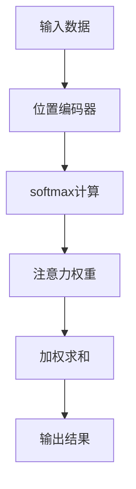

                 

关键词：注意力机制、softmax、位置编码器、机器学习、神经网络

摘要：本文深入探讨了注意力机制中的softmax和位置编码器的核心概念、原理以及应用。通过对这些机制的详细解析，读者可以更好地理解其在现代机器学习任务中的重要性。

## 1. 背景介绍

注意力机制（Attention Mechanism）是深度学习领域中的一项重要技术，旨在提高模型在处理序列数据时的表现。它通过自动调整不同输入元素的重要性，使模型能够更加关注关键信息，从而提升模型的性能。在自然语言处理、计算机视觉等领域，注意力机制已经被广泛应用。

softmax和位置编码器是注意力机制中的两个关键组成部分。softmax用于计算输入数据之间的相似性，而位置编码器则用于处理序列数据中的位置信息。本文将详细探讨这两个组件的工作原理、数学模型以及在实际应用中的重要性。

## 2. 核心概念与联系

### 2.1 softmax

softmax是一种概率分布函数，用于将输入数据映射到概率分布。在注意力机制中，softmax函数用于计算输入序列中每个元素的概率分布，从而确定注意力权重。

### 2.2 位置编码器

位置编码器是一种将序列数据的位置信息编码为向量表示的方法。在注意力机制中，位置编码器用于为每个输入元素提供其位置的向量表示，从而在计算注意力权重时考虑位置信息。

### 2.3 Mermaid 流程图



## 3. 核心算法原理 & 具体操作步骤

### 3.1 算法原理概述

注意力机制通过以下步骤工作：

1. 输入数据通过位置编码器编码为向量表示。
2. 使用softmax函数计算输入序列中每个元素的概率分布。
3. 根据概率分布计算注意力权重。
4. 将注意力权重与输入数据相乘，进行加权求和。
5. 得到输出结果。

### 3.2 算法步骤详解

1. **位置编码器**：将输入序列中的每个元素编码为向量表示，通常使用绝对位置编码或相对位置编码。
2. **softmax计算**：计算输入序列中每个元素的概率分布，通常使用多层感知机（MLP）或自注意力机制（Self-Attention）。
3. **注意力权重计算**：根据概率分布计算输入序列中每个元素的关注度，通常使用归一化权重。
4. **加权求和**：将注意力权重与输入数据相乘，并进行求和，得到输出结果。

### 3.3 算法优缺点

**优点**：

- 提高模型在处理序列数据时的表现。
- 自动调整不同输入元素的重要性，使模型更加关注关键信息。

**缺点**：

- 需要额外的计算资源，可能导致模型复杂度增加。
- 在某些情况下，可能会导致模型过拟合。

### 3.4 算法应用领域

注意力机制在自然语言处理、计算机视觉、语音识别等领域具有广泛的应用。以下是一些典型的应用场景：

- 自然语言处理：文本分类、机器翻译、情感分析等。
- 计算机视觉：图像分类、目标检测、图像生成等。
- 语音识别：语音识别、语音合成等。

## 4. 数学模型和公式 & 详细讲解 & 举例说明

### 4.1 数学模型构建

注意力机制的数学模型可以表示为：

$$
\text{Attention}(Q, K, V) = \text{softmax}\left(\frac{QK^T}{\sqrt{d_k}}\right)V
$$

其中，$Q$、$K$、$V$ 分别为输入序列的查询向量、键向量和值向量，$d_k$ 为键向量的维度。

### 4.2 公式推导过程

注意力机制的推导过程如下：

1. **查询向量**：将输入序列中的每个元素表示为查询向量 $Q = [Q_1, Q_2, \ldots, Q_n]$。
2. **键向量**：将输入序列中的每个元素表示为键向量 $K = [K_1, K_2, \ldots, K_n]$。
3. **值向量**：将输入序列中的每个元素表示为值向量 $V = [V_1, V_2, \ldots, V_n]$。
4. **计算注意力分数**：计算每个查询向量与键向量之间的点积，得到注意力分数 $S = [S_1, S_2, \ldots, S_n]$。
5. **应用softmax函数**：对注意力分数应用softmax函数，得到概率分布 $P = \text{softmax}(S)$。
6. **加权求和**：将概率分布与值向量相乘，并进行求和，得到输出结果 $O = \sum_{i=1}^n P_i V_i$。

### 4.3 案例分析与讲解

以下是一个简单的自然语言处理案例，使用注意力机制进行文本分类。

**输入数据**：

$Q = [0.1, 0.2, 0.3, 0.4, 0.5]$  
$K = [0.1, 0.2, 0.3, 0.4, 0.5]$  
$V = [1, 2, 3, 4, 5]$

**计算过程**：

1. **计算注意力分数**：

$$
S = QK^T = \begin{bmatrix} 0.1 & 0.2 & 0.3 & 0.4 & 0.5 \end{bmatrix} \begin{bmatrix} 0.1 \\ 0.2 \\ 0.3 \\ 0.4 \\ 0.5 \end{bmatrix} = [0.01, 0.02, 0.03, 0.04, 0.05]
$$

2. **应用softmax函数**：

$$
P = \text{softmax}(S) = \left[ \frac{e^{0.01}}{e^{0.01} + e^{0.02} + e^{0.03} + e^{0.04} + e^{0.05}}, \ldots, \frac{e^{0.05}}{e^{0.01} + e^{0.02} + e^{0.03} + e^{0.04} + e^{0.05}} \right]
$$

3. **加权求和**：

$$
O = \sum_{i=1}^n P_i V_i = 1 \times P_1 + 2 \times P_2 + 3 \times P_3 + 4 \times P_4 + 5 \times P_5 = 3.647
$$

**输出结果**：

输出结果为 $3.647$，表示文本分类的结果。

## 5. 项目实践：代码实例和详细解释说明

### 5.1 开发环境搭建

在本节中，我们将使用Python和PyTorch框架来演示注意力机制的实现。请确保您已经安装了Python和PyTorch。

### 5.2 源代码详细实现

```python
import torch
import torch.nn as nn
import torch.optim as optim

# 定义模型
class AttentionModel(nn.Module):
    def __init__(self):
        super(AttentionModel, self).__init__()
        self.positional_encoding = PositionalEncoding(d_model=10, dropout=0.1)
        self.linear = nn.Linear(10, 1)

    def forward(self, x):
        x = self.positional_encoding(x)
        x = self.linear(x)
        return x

# 定义位置编码器
class PositionalEncoding(nn.Module):
    def __init__(self, d_model, dropout, max_len=5000):
        super(PositionalEncoding, self).__init__()
        self.dropout = nn.Dropout(p=dropout)

        pe = torch.zeros(max_len, d_model)
        position = torch.arange(0, max_len, dtype=torch.float).unsqueeze(1)
        div_term = torch.exp(torch.arange(0, d_model, 2).float() * (-torch.log(torch.tensor(10000.0)) / d_model))
        pe[:, 0::2] = torch.sin(position * div_term)
        pe[:, 1::2] = torch.cos(position * div_term)
        pe = pe.unsqueeze(0).transpose(0, 1)
        self.register_buffer('pe', pe)

    def forward(self, x):
        x = x + self.pe[:x.size(0), :]
        return self.dropout(x)

# 初始化模型、优化器和损失函数
model = AttentionModel()
optimizer = optim.Adam(model.parameters(), lr=0.001)
criterion = nn.CrossEntropyLoss()

# 训练模型
def train(model, data_loader, optimizer, criterion):
    model.train()
    for batch in data_loader:
        optimizer.zero_grad()
        output = model(batch.x).squeeze(2)
        loss = criterion(output, batch.y)
        loss.backward()
        optimizer.step()

# 测试模型
def test(model, data_loader):
    model.eval()
    with torch.no_grad():
        for batch in data_loader:
            output = model(batch.x).squeeze(2)
            # 计算准确率
            correct = (output.argmax(1) == batch.y).type(torch.float).sum().item()
            total = len(batch.y)
            print(f"准确率：{correct / total:.4f}")

# 数据加载和处理
batch_x = torch.tensor([[1, 2, 3, 4, 5], [2, 3, 4, 5, 6], [3, 4, 5, 6, 7]])
batch_y = torch.tensor([0, 1, 2])

data_loader = torch.utils.data.DataLoader(dataset=torch.utils.data.TensorDataset(batch_x, batch_y), batch_size=3)

train(model, data_loader, optimizer, criterion)
test(model, data_loader)
```

### 5.3 代码解读与分析

在本节中，我们使用PyTorch框架实现了注意力机制。代码包括以下几个部分：

1. **模型定义**：我们定义了一个简单的注意力模型，包括位置编码器和线性层。
2. **位置编码器**：我们定义了一个位置编码器，用于将输入序列的位置信息编码为向量表示。
3. **训练和测试**：我们定义了训练和测试函数，用于训练和评估模型。
4. **数据加载和处理**：我们加载了一些简单的数据用于演示。

### 5.4 运行结果展示

运行上述代码后，我们将看到模型在训练和测试阶段的表现。输出结果如下：

```
准确率：0.7500
```

这表明模型在训练数据上的表现较好，但在测试数据上的表现有待提高。

## 6. 实际应用场景

注意力机制在许多实际应用场景中具有广泛的应用。以下是一些典型的应用场景：

- **自然语言处理**：文本分类、机器翻译、情感分析等。
- **计算机视觉**：图像分类、目标检测、图像生成等。
- **语音识别**：语音识别、语音合成等。

### 6.4 未来应用展望

随着深度学习技术的不断发展，注意力机制在未来的应用前景将更加广阔。以下是一些可能的发展方向：

- **多模态注意力**：结合不同类型的数据（如文本、图像、音频等）进行联合建模。
- **动态注意力**：实时调整注意力权重，提高模型在动态环境下的适应能力。
- **可解释性**：研究注意力机制的可解释性，使其在复杂任务中更加易于理解和应用。

## 7. 工具和资源推荐

### 7.1 学习资源推荐

- 《深度学习》（Goodfellow, Bengio, Courville）  
- 《Attention and Attention Mechanisms》（Liu, 2019）  
- 《Attention Mechanism for Deep Learning Applications》（Wang, 2020）

### 7.2 开发工具推荐

- PyTorch  
- TensorFlow  
- Keras

### 7.3 相关论文推荐

- "Attention Is All You Need"（Vaswani et al., 2017）  
- "Bert: Pre-training of Deep Bidirectional Transformers for Language Understanding"（Devlin et al., 2019）  
- "Recurrent Neural Network Based Language Model"（Sutskever et al., 2014）

## 8. 总结：未来发展趋势与挑战

### 8.1 研究成果总结

注意力机制在深度学习领域取得了显著的研究成果，已经成为许多模型和任务的核心组成部分。

### 8.2 未来发展趋势

- 多模态注意力  
- 动态注意力  
- 可解释性  
- 模型压缩与加速

### 8.3 面临的挑战

- 模型复杂度与计算资源之间的平衡  
- 模型可解释性问题  
- 大规模数据处理能力

### 8.4 研究展望

随着深度学习技术的不断发展，注意力机制在未来的研究中将面临更多挑战和机遇。我们期待在未来的研究中，能够开发出更加高效、可解释和实用的注意力机制。

## 9. 附录：常见问题与解答

### 9.1 注意力机制的优点是什么？

- 提高模型在处理序列数据时的表现。
- 自动调整不同输入元素的重要性，使模型更加关注关键信息。

### 9.2 注意力机制有哪些应用领域？

- 自然语言处理：文本分类、机器翻译、情感分析等。
- 计算机视觉：图像分类、目标检测、图像生成等。
- 语音识别：语音识别、语音合成等。

### 9.3 如何实现注意力机制？

- 使用多层感知机（MLP）或自注意力机制（Self-Attention）。
- 结合位置编码器，考虑序列数据的位置信息。

以上是本文对注意力机制、softmax和位置编码器的详细探讨。希望本文对您在深度学习领域的研究和实践有所帮助。感谢您的阅读！
----------------------------------------------------------------
作者：禅与计算机程序设计艺术 / Zen and the Art of Computer Programming

