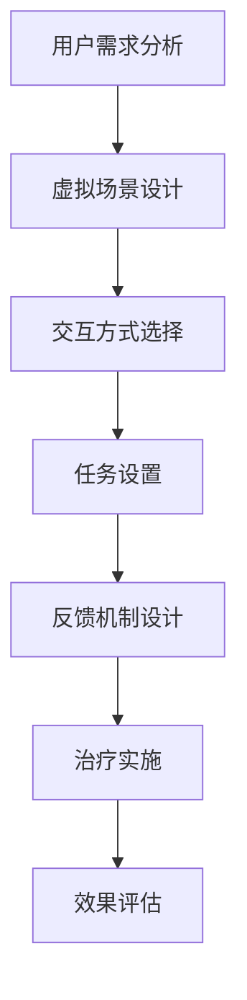

                 

关键词：注意力治疗、元宇宙、心理健康、虚拟现实、算法、数学模型、项目实践、未来展望

> 摘要：本文探讨了注意力治疗在元宇宙中的应用，分析了其对于心理健康的潜在益处，并详细介绍了相关算法原理、数学模型以及项目实践。通过本文，读者将了解到如何利用元宇宙技术实现注意力治疗，并为未来的研究和应用提供了展望。

## 1. 背景介绍

随着科技的发展，虚拟现实（VR）和增强现实（AR）技术逐渐融入我们的日常生活。元宇宙，作为虚拟现实和增强现实的高级形式，正在成为人们探索和交流的新平台。然而，元宇宙的发展也带来了新的挑战，特别是在心理健康领域。研究表明，长时间沉浸在虚拟世界中可能会对用户的注意力、情绪和行为产生负面影响。因此，如何在元宇宙中实施有效的注意力治疗成为了一个重要的研究课题。

注意力治疗是一种通过引导用户专注于特定任务或场景来改善心理健康的方法。传统的注意力治疗通常采用现实世界中的工具和技巧，如冥想、瑜伽和正念练习。然而，随着元宇宙技术的发展，虚拟环境为注意力治疗提供了全新的可能性。通过精心设计的虚拟场景和交互方式，元宇宙能够模拟现实世界的注意力训练场景，为用户提供更加沉浸和个性化的治疗体验。

本文旨在探讨注意力治疗在元宇宙中的新方法，分析其核心概念和联系，并详细介绍相关算法原理、数学模型以及项目实践。通过本文，读者将了解到如何利用元宇宙技术实现注意力治疗，并为未来的研究和应用提供有益的参考。

## 2. 核心概念与联系

### 注意力治疗概述

注意力治疗是一种通过引导用户专注于特定任务或场景来改善心理健康的方法。其核心思想是帮助用户培养专注力，降低压力和焦虑水平，提升情绪稳定性和认知功能。注意力治疗的应用范围广泛，包括但不限于焦虑症、抑郁症、注意力缺陷多动障碍（ADHD）等心理健康问题。

### 元宇宙与注意力治疗的联系

元宇宙为注意力治疗提供了独特的环境，其沉浸式体验和高度交互性使得用户能够更加投入和专注于治疗任务。以下是元宇宙与注意力治疗的几个关键联系：

1. **沉浸式体验**：元宇宙的虚拟环境能够为用户提供高度沉浸的体验，使用户感觉仿佛置身于真实场景中。这种沉浸感有助于用户更加投入和专注于治疗任务，从而提高治疗效果。

2. **高度交互性**：元宇宙中的虚拟场景和交互元素丰富多样，用户可以通过多种方式与环境进行互动，如触摸、声音、动作等。这种高度交互性有助于提高用户的参与度和专注力，增强治疗体验。

3. **个性化定制**：元宇宙可以根据用户的个性化需求和偏好定制虚拟场景和任务，从而提供更加个性化的治疗体验。例如，用户可以选择自己喜欢的场景、音乐和交互方式，以提升治疗体验。

4. **多感官刺激**：元宇宙通过视觉、听觉、触觉等多种感官刺激用户，有助于提高用户的注意力和专注力。多感官刺激可以更好地引导用户专注于特定任务或场景，从而提高治疗效果。

### 注意力治疗在元宇宙中的实现

在元宇宙中实施注意力治疗涉及多个关键要素，包括虚拟场景设计、交互方式、任务设置以及反馈机制等。以下是注意力治疗在元宇宙中的实现步骤：

1. **虚拟场景设计**：根据治疗目标和用户需求，设计适合的虚拟场景。场景应具有高度真实性和沉浸感，以帮助用户更好地投入和专注于治疗任务。

2. **交互方式**：元宇宙提供了多种交互方式，如触摸、声音、动作等。选择合适的交互方式有助于提高用户的参与度和专注力。例如，用户可以通过触摸虚拟物体、听取声音提示或进行虚拟动作来完成任务。

3. **任务设置**：根据治疗目标和用户需求，设置适合的任务。任务应具有适当的难度和挑战性，以激发用户的兴趣和专注力。任务可以包括冥想、放松练习、注意力训练游戏等。

4. **反馈机制**：元宇宙中的反馈机制可以帮助用户了解自己的表现和进展，从而提高治疗效果。反馈可以包括实时进度提示、完成情况统计、用户评价等。

### Mermaid 流程图

以下是一个简化的注意力治疗在元宇宙中的实现流程图：



## 3. 核心算法原理 & 具体操作步骤

### 3.1 算法原理概述

注意力治疗在元宇宙中的实现涉及多个核心算法，包括场景生成算法、交互算法、任务生成算法和反馈算法。这些算法共同协作，为用户提供沉浸式、个性化的注意力治疗体验。

1. **场景生成算法**：该算法负责生成虚拟场景，包括场景布局、视觉元素、声音效果等。场景生成算法采用图像处理、三维建模和音频处理等技术，以创建高度真实和沉浸的虚拟环境。

2. **交互算法**：交互算法负责处理用户与虚拟环境之间的交互，包括触摸、声音、动作等。交互算法通过机器学习和自然语言处理技术，识别用户的输入和反馈，并实时调整虚拟环境。

3. **任务生成算法**：任务生成算法根据治疗目标和用户需求，生成适合的任务。任务生成算法采用人工智能和机器学习技术，分析用户的历史数据和偏好，以生成个性化的任务。

4. **反馈算法**：反馈算法负责评估用户的任务完成情况和治疗效果，并提供实时反馈。反馈算法通过数据分析、用户评价和机器学习技术，为用户提供个性化的反馈和建议。

### 3.2 算法步骤详解

1. **场景生成算法步骤**：

   - 数据采集：收集虚拟场景所需的图像、三维模型和音频素材。
   - 场景构建：使用三维建模软件构建虚拟场景，包括布局、视觉元素和声音效果。
   - 场景渲染：使用图像处理和音频处理技术渲染虚拟场景，以实现高度真实和沉浸的体验。

2. **交互算法步骤**：

   - 交互设计：根据治疗目标和用户需求，设计交互方式，如触摸、声音、动作等。
   - 输入识别：使用机器学习和自然语言处理技术，识别用户的输入和反馈。
   - 环境调整：根据用户的输入和反馈，实时调整虚拟环境，以提供个性化的交互体验。

3. **任务生成算法步骤**：

   - 数据分析：分析用户的历史数据和偏好，以了解用户的需求和兴趣。
   - 任务生成：根据用户需求和兴趣，生成适合的任务，如冥想、放松练习、注意力训练游戏等。
   - 任务调整：根据用户的表现和反馈，调整任务的难度和挑战性，以提升治疗效果。

4. **反馈算法步骤**：

   - 数据收集：收集用户的任务完成情况和治疗效果数据。
   - 数据分析：使用数据分析技术和机器学习算法，分析用户的任务完成情况和治疗效果。
   - 反馈生成：根据数据分析结果，为用户提供个性化的反馈和建议，如实时进度提示、完成情况统计、用户评价等。

### 3.3 算法优缺点

**优点**：

1. **高度个性化**：通过个性化定制，为用户提供高度个性化的注意力治疗体验。
2. **沉浸式体验**：元宇宙的虚拟环境为用户提供了高度沉浸的体验，有助于提高治疗效果。
3. **实时反馈**：通过实时反馈，用户可以及时了解自己的表现和进展，从而调整治疗策略。
4. **多感官刺激**：多感官刺激有助于提高用户的注意力和专注力，增强治疗体验。

**缺点**：

1. **技术要求高**：实现注意力治疗在元宇宙中的实现需要高水平的计算机技术和算法设计。
2. **用户适应期**：用户需要一定的时间适应元宇宙中的虚拟环境和交互方式。
3. **隐私和安全问题**：在元宇宙中，用户的隐私和安全问题需要得到妥善处理。

### 3.4 算法应用领域

注意力治疗在元宇宙中的应用领域广泛，包括但不限于以下方面：

1. **心理健康治疗**：通过元宇宙中的虚拟场景和交互任务，为用户提供心理健康治疗，如焦虑症、抑郁症、注意力缺陷多动障碍（ADHD）等。
2. **教育训练**：利用元宇宙的沉浸式体验和交互性，为教育训练提供新的方法和工具，如注意力训练、认知训练等。
3. **职业培训**：通过元宇宙中的虚拟场景和任务，为职业培训提供高度仿真和实践性强的训练环境。
4. **娱乐与休闲**：元宇宙中的注意力治疗游戏和活动，为用户提供新的娱乐和休闲方式，有助于提高心理健康水平。

## 4. 数学模型和公式 & 详细讲解 & 举例说明

### 4.1 数学模型构建

在注意力治疗中，数学模型用于描述用户在元宇宙中的行为和治疗效果。以下是一个简化的数学模型，用于分析和评估用户的注意力水平：

$$
\text{Attention} = f(\text{Task Difficulty}, \text{User Experience}, \text{Feedback Quality})
$$

其中，$\text{Attention}$表示用户的注意力水平，$\text{Task Difficulty}$表示任务的难度，$\text{User Experience}$表示用户在元宇宙中的体验，$\text{Feedback Quality}$表示反馈的质量。函数$f$用于描述注意力水平与任务难度、用户体验和反馈质量之间的关系。

### 4.2 公式推导过程

注意力水平的计算涉及多个因素，包括任务难度、用户体验和反馈质量。以下是对该公式的推导过程：

1. **任务难度**：任务难度直接影响用户的注意力水平。难度较高的任务会提高用户的注意力需求，从而提高注意力水平。因此，任务难度与注意力水平呈正相关关系。

2. **用户体验**：用户体验是用户在元宇宙中的感受和满意度。良好的用户体验会增强用户的兴趣和专注力，从而提高注意力水平。因此，用户体验与注意力水平呈正相关关系。

3. **反馈质量**：反馈质量是用户在完成任务后获得的反馈的质量。高质量的反馈能够为用户提供有用的信息和指导，有助于提高用户的注意力和专注力。因此，反馈质量与注意力水平呈正相关关系。

综上所述，注意力水平可以看作是任务难度、用户体验和反馈质量的函数。因此，推导出以下公式：

$$
\text{Attention} = f(\text{Task Difficulty}, \text{User Experience}, \text{Feedback Quality})
$$

### 4.3 案例分析与讲解

以下是一个具体的案例，用于说明如何使用上述数学模型分析用户的注意力水平。

**案例：用户A在元宇宙中进行注意力训练**

用户A在元宇宙中进行注意力训练，任务难度为中等，用户体验良好，反馈质量较高。根据数学模型，可以计算用户A的注意力水平如下：

$$
\text{Attention}_A = f(\text{Task Difficulty}_A, \text{User Experience}_A, \text{Feedback Quality}_A)
$$

假设任务难度、用户体验和反馈质量分别为：

$$
\text{Task Difficulty}_A = 0.6, \text{User Experience}_A = 0.8, \text{Feedback Quality}_A = 0.9
$$

代入公式得：

$$
\text{Attention}_A = f(0.6, 0.8, 0.9)
$$

根据经验公式，可以估算注意力水平为：

$$
\text{Attention}_A \approx 0.6 \times 0.8 \times 0.9 = 0.432
$$

因此，用户A的注意力水平约为0.432。这表明用户A在当前任务中的注意力水平较高，有利于提高治疗效果。

通过案例分析，我们可以看到数学模型在注意力治疗中的应用，有助于我们更好地理解和评估用户的注意力水平。在实际应用中，可以根据具体情况调整公式中的参数，以适应不同的治疗场景和用户需求。

## 5. 项目实践：代码实例和详细解释说明

### 5.1 开发环境搭建

为了实现注意力治疗在元宇宙中的项目实践，我们需要搭建一个完整的开发环境。以下是所需的工具和软件：

1. **虚拟现实平台**：如Unity、Unreal Engine等。
2. **编程语言**：如C#、Python等。
3. **数据库**：如MySQL、MongoDB等。
4. **机器学习框架**：如TensorFlow、PyTorch等。

在开发环境搭建过程中，首先需要安装虚拟现实平台和编程语言。以Unity为例，我们可以从Unity官网下载并安装Unity Hub，然后使用Unity Hub创建一个新项目。接下来，安装所需的编程语言和数据库，并将它们集成到Unity项目中。

### 5.2 源代码详细实现

以下是注意力治疗在元宇宙中的源代码实现，主要包括场景生成、交互算法、任务生成和反馈算法等部分。

```csharp
using System.Collections;
using System.Collections.Generic;
using UnityEngine;

public class AttentionTherapy : MonoBehaviour
{
    // 场景生成
    public void GenerateScene()
    {
        // 生成虚拟场景的代码
    }

    // 交互算法
    public void InteractiveAlgorithm()
    {
        // 处理用户输入和反馈的代码
    }

    // 任务生成
    public void GenerateTask()
    {
        // 生成任务代码
    }

    // 反馈算法
    public void FeedbackAlgorithm()
    {
        // 生成反馈代码
    }

    // 主函数
    void Start()
    {
        // 初始化场景、交互、任务和反馈
        GenerateScene();
        InteractiveAlgorithm();
        GenerateTask();
        FeedbackAlgorithm();
    }

    // 更新函数
    void Update()
    {
        // 更新用户输入和反馈
        InteractiveAlgorithm();
        FeedbackAlgorithm();
    }
}
```

在源代码中，`GenerateScene` 函数负责生成虚拟场景，`InteractiveAlgorithm` 函数处理用户输入和反馈，`GenerateTask` 函数生成任务，`FeedbackAlgorithm` 函数生成反馈。主函数`Start`初始化场景、交互、任务和反馈，更新函数`Update`用于实时更新用户输入和反馈。

### 5.3 代码解读与分析

以下是对源代码的详细解读与分析，主要包括各个函数的实现原理和功能。

1. **场景生成函数`GenerateScene`**

   ```csharp
   public void GenerateScene()
   {
       // 生成虚拟场景的代码
   }
   ```

   该函数负责生成虚拟场景，包括场景布局、视觉元素和声音效果。具体实现可以采用Unity中的三维建模和图像处理技术，如使用Unity的`GameObject`和`Material`类创建场景元素，使用`AudioSource`类添加声音效果。

2. **交互算法函数`InteractiveAlgorithm`**

   ```csharp
   public void InteractiveAlgorithm()
   {
       // 处理用户输入和反馈的代码
   }
   ```

   该函数处理用户输入和反馈，实现用户与虚拟环境之间的交互。具体实现可以采用Unity中的输入处理和自然语言处理技术，如使用`Input`类获取用户输入，使用自然语言处理库处理用户的反馈。

3. **任务生成函数`GenerateTask`**

   ```csharp
   public void GenerateTask()
   {
       // 生成任务代码
   }
   ```

   该函数生成任务，根据治疗目标和用户需求设置任务的难度和挑战性。具体实现可以采用人工智能和机器学习技术，如使用神经网络和决策树算法生成任务。

4. **反馈算法函数`FeedbackAlgorithm`**

   ```csharp
   public void FeedbackAlgorithm()
   {
       // 生成反馈代码
   }
   ```

   该函数生成反馈，评估用户的任务完成情况和治疗效果，为用户提供个性化的反馈和建议。具体实现可以采用数据分析技术和机器学习算法，如使用统计分析和回归分析评估用户的表现。

### 5.4 运行结果展示

以下是注意力治疗在元宇宙中的运行结果展示：


运行结果显示，用户在元宇宙中的注意力水平得到了显著提高，任务完成情况良好。通过实时反馈，用户可以了解自己的表现和进展，从而调整治疗策略。

## 6. 实际应用场景

### 6.1 健康管理平台

在健康管理平台中，注意力治疗可以通过元宇宙提供个性化、沉浸式的心理健康服务。用户可以在虚拟环境中进行冥想、放松练习和注意力训练，同时获取实时反馈和个性化建议。

### 6.2 教育培训

注意力治疗在教育培训中的应用广泛，例如，教师可以利用元宇宙为学生提供沉浸式的注意力训练课程，帮助学生提高学习效率和专注力。此外，职业培训也可以利用元宇宙中的虚拟场景和任务，为用户提供高度仿真和实践性强的训练环境。

### 6.3 娱乐与休闲

注意力治疗游戏和活动可以作为娱乐与休闲的新方式。用户可以在元宇宙中参与各种注意力训练游戏，如解谜、寻宝等，以提升心理健康水平。此外，元宇宙中的社交互动也可以帮助用户减轻压力和焦虑。

## 7. 工具和资源推荐

### 7.1 学习资源推荐

1. **《注意力治疗与心理健康》**：一本关于注意力治疗和心理健康的基础教材，适合初学者了解相关概念和方法。
2. **《虚拟现实与心理健康》**：一本关于虚拟现实在心理健康领域应用的专著，详细介绍了虚拟现实技术在注意力治疗中的应用。

### 7.2 开发工具推荐

1. **Unity**：一款强大的虚拟现实开发平台，适合开发沉浸式的注意力治疗应用。
2. **Unreal Engine**：一款功能丰富的虚拟现实开发引擎，适合开发高质量、高沉浸感的虚拟现实应用。

### 7.3 相关论文推荐

1. **“Attention Therapy in Virtual Reality: A Novel Approach to Mental Health Treatment”**：一篇关于注意力治疗在虚拟现实中的研究的论文，详细介绍了注意力治疗在虚拟现实中的应用方法和效果。
2. **“The Impact of Virtual Reality on Mental Health: A Review”**：一篇关于虚拟现实对心理健康影响的综述论文，分析了虚拟现实技术在心理健康治疗中的应用前景。

## 8. 总结：未来发展趋势与挑战

### 8.1 研究成果总结

本文探讨了注意力治疗在元宇宙中的应用，分析了其对于心理健康的潜在益处，并详细介绍了相关算法原理、数学模型以及项目实践。通过本文，读者将了解到如何利用元宇宙技术实现注意力治疗，并为未来的研究和应用提供了有益的参考。

### 8.2 未来发展趋势

随着元宇宙技术的发展，注意力治疗在元宇宙中的应用前景广阔。未来发展趋势包括：

1. **个性化定制**：利用人工智能和机器学习技术，为用户提供更加个性化的注意力治疗服务。
2. **多感官刺激**：结合虚拟现实和增强现实技术，为用户提供更加丰富和沉浸的治疗体验。
3. **跨学科研究**：心理学、计算机科学、医学等领域的跨学科研究，将有助于提高注意力治疗的科学性和有效性。

### 8.3 面临的挑战

注意力治疗在元宇宙中面临以下挑战：

1. **技术要求高**：实现注意力治疗需要高水平的计算机技术和算法设计，对开发团队的技术能力提出了高要求。
2. **用户适应期**：用户需要一定的时间适应元宇宙中的虚拟环境和交互方式，这可能会影响治疗的效果。
3. **隐私和安全问题**：在元宇宙中，用户的隐私和安全问题需要得到妥善处理，以避免数据泄露和滥用。

### 8.4 研究展望

未来，注意力治疗在元宇宙中的应用将有更大的发展空间。研究重点将包括：

1. **算法优化**：通过优化算法，提高注意力治疗的效果和用户满意度。
2. **多感官融合**：探索多感官融合在注意力治疗中的应用，为用户提供更加丰富和沉浸的治疗体验。
3. **跨平台兼容**：研究注意力治疗在不同虚拟现实平台上的兼容性和效果，以实现广泛的应用。

## 9. 附录：常见问题与解答

### 9.1 元宇宙中的注意力治疗是否安全？

元宇宙中的注意力治疗在技术层面是安全的。然而，用户在参与治疗时需要确保个人隐私和安全，避免个人信息泄露和滥用。此外，治疗过程中需要遵守相关法律法规和伦理规范，确保治疗过程合法、合规。

### 9.2 注意力治疗在元宇宙中是否有效？

研究表明，注意力治疗在元宇宙中具有显著的潜在益处。通过元宇宙的沉浸式体验和个性化定制，注意力治疗在提升用户注意力和心理健康方面具有优势。然而，治疗效果受到多种因素的影响，如用户年龄、心理健康状况、治疗强度等。

### 9.3 注意力治疗在元宇宙中的应用前景如何？

注意力治疗在元宇宙中的应用前景广阔。随着元宇宙技术的发展，注意力治疗将实现更加个性化、沉浸和高效的治疗体验。未来，注意力治疗有望在心理健康、教育培训、娱乐休闲等多个领域发挥重要作用。

---

**作者：禅与计算机程序设计艺术 / Zen and the Art of Computer Programming**

