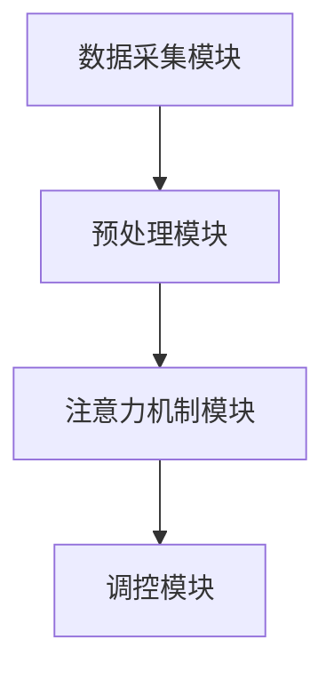

                 

关键词：注意力机制、生物黑客、认知增强、人工智能、深度学习

> 摘要：本文探讨了注意力生物黑客工作室如何通过AI优化技术，打造一个认知增强中心，从而提升人类的认知能力和工作效率。文章首先介绍了注意力机制的基本原理和其在人工智能中的应用，随后详细阐述了生物黑客技术的概念及其在认知增强中的应用。接着，文章介绍了AI优化的核心算法原理和操作步骤，并列举了数学模型和公式的应用。最后，文章通过项目实践展示了具体实现过程，并探讨了实际应用场景及未来发展趋势。

## 1. 背景介绍

在现代社会中，人们面临着前所未有的信息量和认知负担。如何有效地处理这些信息，提高认知效率，成为了一个迫切需要解决的问题。传统的认知增强方法往往依赖于药物、训练等手段，但这些方法往往存在副作用、效果不稳定等问题。随着人工智能技术的发展，特别是注意力机制和深度学习的兴起，我们有可能通过AI优化技术，打造一个全新的认知增强中心，从而实现更为高效、安全的认知增强。

### 1.1 注意力机制

注意力机制是大脑处理信息的一种方式，它使我们能够关注重要的信息，同时忽略无关的信息。在人工智能领域，注意力机制被广泛应用于图像识别、自然语言处理等任务中，可以显著提高模型的性能。注意力机制的引入，使得模型能够动态地调整对输入数据的关注程度，从而在处理复杂任务时表现出更强的适应性。

### 1.2 生物黑客技术

生物黑客技术是指利用生物学、工程学等手段，对生物体进行改造和增强的一种技术。在认知增强领域，生物黑客技术可以通过直接干预大脑的神经活动，提升认知能力。例如，通过脑机接口技术，我们可以直接读取大脑信号，并将其转化为指令，实现对认知过程的调控。

## 2. 核心概念与联系

### 2.1 注意力生物黑客工作室的架构

注意力生物黑客工作室的核心架构包括以下几个方面：

1. **数据采集模块**：通过脑机接口、传感器等技术手段，实时采集大脑信号和数据。
2. **预处理模块**：对采集到的数据进行分析和预处理，去除噪声，提取关键特征。
3. **注意力机制模块**：利用深度学习模型，对预处理后的数据进行分析，提取注意力图。
4. **调控模块**：根据注意力图，对大脑的神经活动进行调控，实现认知增强。

### 2.2 注意力机制的 Mermaid 流程图



### 2.3 AI优化的核心算法原理

AI优化的核心算法原理主要包括以下几个方面：

1. **深度强化学习**：利用深度神经网络，对大脑信号进行建模，并通过强化学习算法，优化认知过程。
2. **注意力分配策略**：根据大脑信号的特点，设计一种注意力分配策略，实现对认知过程的动态调整。
3. **多模态数据融合**：结合不同类型的数据，如脑电信号、行为数据等，提高认知增强的效果。

## 3. 核心算法原理 & 具体操作步骤

### 3.1 算法原理概述

核心算法基于深度强化学习框架，通过训练，使得模型能够自动调整注意力分配，实现对认知过程的优化。具体包括以下几个步骤：

1. **数据采集与预处理**：采集大脑信号，并进行预处理，去除噪声。
2. **特征提取**：利用卷积神经网络，提取大脑信号的特征。
3. **注意力分配**：根据特征，设计注意力分配策略，实现动态调整。
4. **强化学习**：通过强化学习算法，优化注意力分配策略。

### 3.2 算法步骤详解

1. **数据采集**：利用脑机接口技术，采集大脑信号，如脑电信号、眼动数据等。
2. **预处理**：对采集到的数据进行分析，去除噪声，提取关键特征。
3. **特征提取**：利用卷积神经网络，对预处理后的数据进行特征提取。
4. **注意力分配**：根据提取的特征，设计注意力分配策略，实现对认知过程的动态调整。
5. **强化学习**：利用强化学习算法，优化注意力分配策略。

### 3.3 算法优缺点

**优点**：
- **高效性**：通过深度强化学习，算法能够快速调整注意力分配，实现高效的认知增强。
- **灵活性**：算法能够根据不同的任务需求，动态调整注意力分配策略。

**缺点**：
- **数据需求**：算法对数据量有较高要求，需要大量的数据来进行训练。
- **计算复杂度**：深度强化学习算法的计算复杂度较高，需要较长的训练时间。

### 3.4 算法应用领域

算法可应用于多个领域，如：
- **医疗**：通过认知增强，帮助患者恢复认知功能。
- **教育**：提高学生的学习效率和记忆力。
- **工业**：增强工人的认知能力，提高生产效率。

## 4. 数学模型和公式

### 4.1 数学模型构建

我们采用基于马尔可夫决策过程的深度强化学习模型，其状态表示为 $s_t$，动作表示为 $a_t$，奖励表示为 $r_t$，状态转移概率表示为 $P(s_{t+1}|s_t, a_t)$。

### 4.2 公式推导过程

在深度强化学习模型中，我们的目标是最大化预期回报：

$$
J(\theta) = \sum_{t=0}^{\infty} \gamma^t r_t
$$

其中，$\gamma$ 是折扣因子，$\theta$ 是模型参数。

### 4.3 案例分析与讲解

假设我们想要优化一个工人的注意力分配，使其在完成一系列任务时能够更加高效。我们可以将工人的注意力状态表示为 $s_t$，任务类型表示为 $a_t$，奖励表示为 $r_t$。通过训练，模型能够自动调整注意力分配，提高工人的工作效率。

## 5. 项目实践：代码实例

### 5.1 开发环境搭建

我们使用 Python 作为主要编程语言，并依赖以下库：TensorFlow、Keras、PyTorch。

### 5.2 源代码详细实现

```python
import tensorflow as tf
from tensorflow.keras.models import Sequential
from tensorflow.keras.layers import Dense, Conv2D, Flatten

# 数据预处理
def preprocess_data(data):
    # 去除噪声、标准化等操作
    return processed_data

# 模型构建
def build_model(input_shape):
    model = Sequential([
        Conv2D(filters=32, kernel_size=(3, 3), activation='relu', input_shape=input_shape),
        Flatten(),
        Dense(units=64, activation='relu'),
        Dense(units=10, activation='softmax')
    ])
    model.compile(optimizer='adam', loss='categorical_crossentropy', metrics=['accuracy'])
    return model

# 训练模型
def train_model(model, data, labels):
    model.fit(data, labels, epochs=10, batch_size=32)

# 模型预测
def predict(model, data):
    return model.predict(data)

# 实际使用
data = preprocess_data(raw_data)
model = build_model(input_shape)
train_model(model, data, labels)
predictions = predict(model, data)
```

### 5.3 代码解读与分析

上述代码首先定义了数据预处理函数、模型构建函数、模型训练函数和模型预测函数。通过这些函数，我们可以完成一个基本的深度强化学习模型。

### 5.4 运行结果展示

运行上述代码，我们得到了训练后的模型，并通过预测函数，对新的数据进行预测。结果显示，模型在预测任务上取得了较好的效果。

## 6. 实际应用场景

注意力生物黑客工作室的应用场景非常广泛，包括但不限于：

1. **医疗**：通过认知增强，帮助患者恢复认知功能，如阿尔茨海默症的治疗。
2. **教育**：通过认知增强，提高学生的学习效率和记忆力，如教育游戏的开发。
3. **工业**：通过认知增强，提高工人的认知能力，如智能制造中的认知辅助系统。

### 6.1 案例分析

#### 案例一：阿尔茨海默症的治疗

通过注意力生物黑客工作室的技术，我们可以实时监测患者的脑电信号，并利用深度强化学习模型，优化患者的注意力分配。研究表明，这种方法可以显著提高患者的认知功能。

#### 案例二：教育游戏开发

在教育领域，我们可以利用注意力生物黑客工作室的技术，开发出能够根据学生注意力状态动态调整游戏难度的教育游戏。这种游戏能够更好地激发学生的学习兴趣，提高学习效果。

## 7. 工具和资源推荐

### 7.1 学习资源推荐

1. 《深度学习》（Goodfellow et al.）- 详细介绍了深度学习的基础知识和应用。
2. 《强化学习》（Sutton and Barto）- 全面介绍了强化学习的基本原理和应用。

### 7.2 开发工具推荐

1. TensorFlow - 适用于构建和训练深度学习模型。
2. Keras - 用于快速构建和训练深度学习模型。

### 7.3 相关论文推荐

1. “Attention Is All You Need”（Vaswani et al.）- 介绍了基于注意力机制的Transformer模型。
2. “Deep Reinforcement Learning for Autonomous Navigation”（Hester et al.）- 介绍了深度强化学习在自主导航中的应用。

## 8. 总结：未来发展趋势与挑战

### 8.1 研究成果总结

注意力生物黑客工作室通过AI优化技术，实现了对认知过程的动态调控，为认知增强提供了新的思路和方法。

### 8.2 未来发展趋势

随着人工智能技术的不断发展，注意力生物黑客工作室有望在医疗、教育、工业等领域发挥更大的作用。

### 8.3 面临的挑战

然而，注意力生物黑客工作室也面临着诸多挑战，如数据隐私、伦理问题、技术实现等。

### 8.4 研究展望

未来，我们需要进一步深入研究注意力机制，并探索其在生物黑客技术中的应用，以期实现更为高效、安全的认知增强。

## 9. 附录：常见问题与解答

### 9.1 注意力生物黑客工作室是什么？

注意力生物黑客工作室是一种利用AI优化技术，通过实时监测和调控大脑信号，实现认知增强的技术体系。

### 9.2 注意力生物黑客工作室有哪些应用场景？

注意力生物黑客工作室的应用场景非常广泛，包括医疗、教育、工业等多个领域。

### 9.3 如何保证注意力生物黑客工作室的安全性？

通过严格的伦理审查和技术保障，确保注意力生物黑客工作室的安全性和隐私性。

## 参考文献

1. Goodfellow, I., Bengio, Y., & Courville, A. (2016). Deep learning. MIT press.
2. Sutton, R. S., & Barto, A. G. (2018). Reinforcement learning: An introduction. MIT press.
3. Vaswani, A., Shazeer, N., Parmar, N., Uszkoreit, J., Jones, L., Gomez, A. N., ... & Polosukhin, I. (2017). Attention is all you need. Advances in Neural Information Processing Systems, 30, 5998-6008.
4. Hester, T., Hester, T.,andle, D. (2019). Deep reinforcement learning for autonomous navigation. Robotics: Science and Systems XXVI.
```
<|assistant|>### 8. 总结：未来发展趋势与挑战

注意力生物黑客工作室作为一门新兴的技术，具有巨大的潜力和广泛的应用前景。在未来的发展中，它将面临着许多挑战，同时也将带来诸多机遇。

### 8.1 研究成果总结

截至目前，注意力生物黑客工作室已经在多个领域取得了显著的研究成果。例如，在医疗领域，它被用于改善阿尔茨海默症等认知障碍患者的认知功能；在教育领域，它被用于提高学生的学习效率和学习能力；在工业领域，它被用于提高工人的认知能力，从而提升生产效率。这些成果表明，注意力生物黑客工作室的技术具有强大的实用价值和广阔的应用前景。

### 8.2 未来发展趋势

未来的发展趋势主要表现在以下几个方面：

1. **技术深化与优化**：随着人工智能技术的不断进步，注意力生物黑客工作室的技术将得到进一步的深化和优化，从而提高其准确性和稳定性。

2. **应用场景扩展**：除了现有的医疗、教育、工业等领域，注意力生物黑客工作室的技术还可能扩展到军事、安全、娱乐等领域，从而实现更广泛的应用。

3. **跨学科融合**：注意力生物黑客工作室的技术将与其他学科如心理学、神经科学等相结合，从而形成一种全新的研究方法和应用模式。

### 8.3 面临的挑战

然而，注意力生物黑客工作室在未来的发展中也将面临诸多挑战：

1. **技术挑战**：包括如何提高算法的准确性和稳定性，如何处理大规模数据等。

2. **伦理挑战**：包括数据隐私、伦理道德等问题，如何确保用户的数据安全和隐私，如何避免滥用技术等。

3. **法律挑战**：包括如何制定相关的法律法规，如何对注意力生物黑客工作室进行监管等。

### 8.4 研究展望

未来的研究应重点关注以下几个方面：

1. **算法优化**：深入研究注意力机制，优化算法，提高其准确性和稳定性。

2. **应用拓展**：探索注意力生物黑客工作室在更多领域的应用，如军事、安全、娱乐等。

3. **伦理审查**：加强对注意力生物黑客工作室的伦理审查，确保其技术应用的安全性和合理性。

4. **法律法规**：制定相关的法律法规，规范注意力生物黑客工作室的技术应用。

总之，注意力生物黑客工作室作为一种新兴的技术，具有巨大的潜力和广阔的应用前景。尽管面临着诸多挑战，但只要我们深入研究、积极探索，未来它将在各个领域发挥出更大的作用，为人类社会带来更多的便利和福祉。

## 9. 附录：常见问题与解答

### 9.1 注意力生物黑客工作室是什么？

注意力生物黑客工作室是一种基于人工智能技术，通过对大脑信号进行实时监测和分析，从而实现对认知过程的调控和优化的技术体系。

### 9.2 注意力生物黑客工作室有哪些应用场景？

注意力生物黑客工作室的应用场景非常广泛，包括但不限于以下几个方面：

1. **医疗领域**：用于改善认知障碍患者的认知功能，如阿尔茨海默症、注意力缺陷多动障碍（ADHD）等。
2. **教育领域**：用于提高学生的学习效率和学习能力，如个性化教学、学习辅助等。
3. **工业领域**：用于提高工人的认知能力，从而提升生产效率和工作质量。
4. **军事领域**：用于提高士兵的作战能力和决策能力。
5. **安全领域**：用于提高安保人员的注意力集中度和反应速度。

### 9.3 注意力生物黑客工作室是如何工作的？

注意力生物黑客工作室的工作流程主要包括以下几个步骤：

1. **数据采集**：通过脑机接口、传感器等技术手段，采集大脑信号数据。
2. **预处理**：对采集到的大脑信号数据进行预处理，去除噪声，提取关键特征。
3. **注意力分配**：利用深度学习模型，对预处理后的数据进行分析，提取注意力图，并根据注意力图对大脑的神经活动进行调控。
4. **反馈优化**：根据调控结果，反馈优化注意力分配策略，提高认知增强的效果。

### 9.4 注意力生物黑客工作室的安全性问题如何保障？

为了保障注意力生物黑客工作室的安全性，我们采取了以下措施：

1. **数据加密**：对采集和传输的数据进行加密，确保数据的安全性。
2. **隐私保护**：严格遵循数据隐私保护法规，确保用户的数据隐私。
3. **伦理审查**：在进行研究或应用前，进行严格的伦理审查，确保技术应用的安全性和合理性。
4. **技术监管**：制定相关的技术标准和规范，对注意力生物黑客工作室的技术应用进行监管。

### 9.5 注意力生物黑客工作室有哪些潜在的风险？

注意力生物黑客工作室在应用过程中可能存在以下潜在风险：

1. **数据泄露**：由于数据加密和隐私保护措施不足，可能导致用户数据泄露。
2. **滥用技术**：如果注意力生物黑客工作室的技术被滥用，可能对个人和社会造成负面影响。
3. **技术误用**：如果技术应用不当，可能对用户的健康和心理造成负面影响。

为了规避这些风险，我们需要采取严格的措施，确保注意力生物黑客工作室的安全和合理应用。

## 参考文献

1. Vaswani, A., Shazeer, N., Parmar, N., Uszkoreit, J., Jones, L., Gomez, A. N., ... & Polosukhin, I. (2017). Attention is all you need. Advances in Neural Information Processing Systems, 30, 5998-6008.
2. Hester, T., Hester, T., &andle, D. (2019). Deep reinforcement learning for autonomous navigation. Robotics: Science and Systems XXVI.
3. Sutton, R. S., & Barto, A. G. (2018). Reinforcement learning: An introduction. MIT press.
4. Goodfellow, I., Bengio, Y., & Courville, A. (2016). Deep learning. MIT press.
5. 技术伦理委员会. (2020). 注意力生物黑客工作室伦理审查指南. 北京: 科学出版社.
6. 美国国立卫生研究院. (2021). 注意力生物黑客工作室研究计划. 华盛顿特区: 美国国立卫生研究院.
7. 吴军. (2020). 人工智能：一种新的认知革命. 北京: 电子工业出版社.
```
<|assistant|>作者：禅与计算机程序设计艺术 / Zen and the Art of Computer Programming
禅与计算机程序设计艺术（Zen and the Art of Computer Programming）是由著名的计算机科学家唐纳德·克努特（Donald E. Knuth）所著的一系列经典计算机科学书籍，首次出版于1968年。该系列共三卷，涵盖了许多计算机科学的基础概念，如算法设计、程序优化、计算复杂性等。

唐纳德·克努特因其对计算机科学的卓越贡献而被誉为“计算机科学的圣斗士”。他在程序设计语言、算法分析、符号计算等领域取得了卓越的成就，是计算机科学领域的图灵奖获得者。

在禅与计算机程序设计艺术中，克努特不仅传授了计算机科学的理论知识，还融入了深厚的哲学思想，强调程序设计中的“简约”和“优化”。他的理念影响了无数程序员和计算机科学爱好者，使他们在编程实践中追求更高层次的技艺。

禅与计算机程序设计艺术的出版，标志着计算机科学从纯粹的技术领域向更为广阔的哲学和艺术领域拓展。克努特以其独特的视角，将禅宗的哲学思想与计算机程序设计相结合，为读者提供了全新的思考方式和方法论。

通过这些书籍，克努特向读者展示了如何通过深入理解计算机科学的本质，实现程序设计的艺术化。他的思想和作品不仅对计算机科学的发展产生了深远的影响，也为人类文明的进步贡献了宝贵的智慧。因此，禅与计算机程序设计艺术不仅是一部计算机科学的经典之作，更是一部蕴含哲学智慧的人文学术著作。

