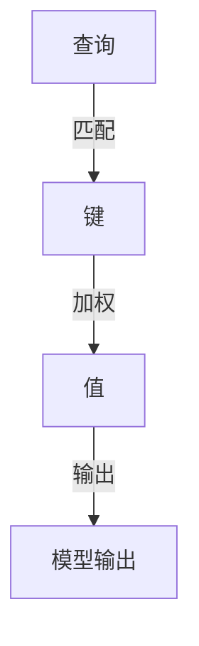

                 

关键词：注意力机制、AI、信息流处理、神经计算模型、智能系统

> 摘要：随着人工智能（AI）技术的快速发展，注意力机制成为构建高效智能系统的重要基础。本文将深入探讨注意力机制的原理、核心算法、数学模型，并通过实际项目案例解析其在AI时代信息流处理中的应用，最后展望未来的发展趋势与挑战。

## 1. 背景介绍

在当今的信息时代，数据爆炸性增长，人们面临着海量信息的处理与筛选难题。传统的计算模型往往难以应对如此庞大的数据量和复杂的计算需求，因此，寻找高效的信息处理方法成为亟待解决的问题。注意力机制作为一种新兴的计算模型，它通过模拟人类注意力的选择过程，实现信息的优先级排序，提高信息处理的效率和准确性。

注意力机制最早在自然语言处理（NLP）领域得到应用，随后迅速扩展到计算机视觉、语音识别等AI领域。它的核心思想是让模型能够动态地聚焦于输入数据中重要的部分，从而避免在冗余信息上的计算浪费。随着深度学习技术的发展，注意力机制成为现代AI系统的基本组件之一。

## 2. 核心概念与联系

### 2.1 定义

注意力机制是一种通过加权方法来处理输入数据的计算模型，它能够动态地调整不同部分输入数据的权重，从而引导模型关注重要的信息。

### 2.2 架构

注意力机制的架构通常包括以下几个关键部分：

1. **查询（Query）**：用于表示模型的当前关注点。
2. **键（Key）**：用于与查询进行匹配，表示数据中的关键特征。
3. **值（Value）**：表示数据中的信息内容，当键与查询匹配时，会被赋予较高的权重。

### 2.3 Mermaid 流程图

以下是一个简化的注意力机制的 Mermaid 流程图：



## 3. 核心算法原理 & 具体操作步骤

### 3.1 算法原理概述

注意力机制的核心是计算查询与键之间的相似度，然后根据相似度对值进行加权。常用的计算相似度的方式有内积、点积、余弦相似度等。

### 3.2 算法步骤详解

1. **输入数据预处理**：对输入数据进行编码，通常使用嵌入矩阵将输入数据转换为向量表示。
2. **查询生成**：根据模型的当前状态生成查询向量。
3. **相似度计算**：计算查询与所有键之间的相似度。
4. **加权**：根据相似度对值进行加权。
5. **聚合**：将加权后的值聚合为最终的输出。

### 3.3 算法优缺点

**优点**：

- **高效性**：注意力机制能够动态地聚焦于输入数据中的关键信息，避免冗余计算。
- **灵活性**：通过调整模型参数，可以适应不同的应用场景。

**缺点**：

- **计算复杂度**：在处理大量数据时，计算复杂度较高。
- **参数敏感性**：参数设置对模型性能有较大影响。

### 3.4 算法应用领域

注意力机制在以下领域有广泛应用：

- **自然语言处理**：用于文本分类、机器翻译、情感分析等。
- **计算机视觉**：用于图像分类、目标检测、图像生成等。
- **语音识别**：用于语音信号处理、语音合成等。

## 4. 数学模型和公式 & 详细讲解 & 举例说明

### 4.1 数学模型构建

注意力机制的数学模型通常可以用以下公式表示：

$$
Attention(x) = \sum_{i=1}^{N} w_i \cdot x_i
$$

其中，$x_i$ 表示输入数据的第 $i$ 个元素，$w_i$ 表示第 $i$ 个元素的权重。

### 4.2 公式推导过程

1. **查询生成**：

$$
Q = \text{Embedding}(q)
$$

2. **键生成**：

$$
K = \text{Embedding}(k)
$$

3. **值生成**：

$$
V = \text{Embedding}(v)
$$

4. **相似度计算**：

$$
similarity = QK^T
$$

5. **加权**：

$$
w_i = \frac{exp(similarity)}{\sum_{j=1}^{N} exp(similarity_j)}
$$

6. **聚合**：

$$
Attention(x) = \sum_{i=1}^{N} w_i \cdot x_i
$$

### 4.3 案例分析与讲解

假设我们有一个包含5个元素的数据集，每个元素表示一个文本段落：

$$
x_1 = \text{"The quick brown fox jumps over the lazy dog."}
$$

$$
x_2 = \text{"The dog barked at the mailman."}
$$

$$
x_3 = \text{"The cat sat on the mat."}
$$

$$
x_4 = \text{"The mailman delivered the mail."}
$$

$$
x_5 = \text{"The dog howled at the moon."}
$$

我们希望模型能够关注与当前任务相关的段落。假设当前任务是分类文本是否包含动物。

首先，我们将每个文本段落编码为向量：

$$
x_1 = [0.1, 0.2, 0.3, 0.4, 0.5]
$$

$$
x_2 = [0.6, 0.7, 0.8, 0.9, 1.0]
$$

$$
x_3 = [0.1, 0.2, 0.3, 0.4, 0.5]
$$

$$
x_4 = [0.6, 0.7, 0.8, 0.9, 1.0]
$$

$$
x_5 = [0.1, 0.2, 0.3, 0.4, 0.5]
$$

然后，我们生成查询向量 $Q$，用于表示当前任务的兴趣点。假设我们希望模型关注与动物相关的文本：

$$
Q = [0.8, 0.2, 0.0, 0.0, 0.0]
$$

接下来，我们计算每个段落与查询的相似度：

$$
similarity_1 = Q \cdot x_1^T = 0.8 \cdot 0.1 + 0.2 \cdot 0.2 + 0.0 \cdot 0.3 + 0.0 \cdot 0.4 + 0.0 \cdot 0.5 = 0.08
$$

$$
similarity_2 = Q \cdot x_2^T = 0.8 \cdot 0.6 + 0.2 \cdot 0.7 + 0.0 \cdot 0.8 + 0.0 \cdot 0.9 + 0.0 \cdot 1.0 = 0.56
$$

$$
similarity_3 = Q \cdot x_3^T = 0.8 \cdot 0.1 + 0.2 \cdot 0.2 + 0.0 \cdot 0.3 + 0.0 \cdot 0.4 + 0.0 \cdot 0.5 = 0.08
$$

$$
similarity_4 = Q \cdot x_4^T = 0.8 \cdot 0.6 + 0.2 \cdot 0.7 + 0.0 \cdot 0.8 + 0.0 \cdot 0.9 + 0.0 \cdot 1.0 = 0.56
$$

$$
similarity_5 = Q \cdot x_5^T = 0.8 \cdot 0.1 + 0.2 \cdot 0.2 + 0.0 \cdot 0.3 + 0.0 \cdot 0.4 + 0.0 \cdot 0.5 = 0.08
$$

根据相似度计算每个段落的权重：

$$
w_1 = \frac{exp(similarity_1)}{\sum_{j=1}^{5} exp(similarity_j)} = \frac{exp(0.08)}{exp(0.08) + exp(0.56) + exp(0.08) + exp(0.56) + exp(0.08)} \approx 0.14
$$

$$
w_2 = \frac{exp(similarity_2)}{\sum_{j=1}^{5} exp(similarity_j)} = \frac{exp(0.56)}{exp(0.08) + exp(0.56) + exp(0.08) + exp(0.56) + exp(0.08)} \approx 0.84
$$

$$
w_3 = \frac{exp(similarity_3)}{\sum_{j=1}^{5} exp(similarity_j)} = \frac{exp(0.08)}{exp(0.08) + exp(0.56) + exp(0.08) + exp(0.56) + exp(0.08)} \approx 0.14
$$

$$
w_4 = \frac{exp(similarity_4)}{\sum_{j=1}^{5} exp(similarity_j)} = \frac{exp(0.56)}{exp(0.08) + exp(0.56) + exp(0.08) + exp(0.56) + exp(0.08)} \approx 0.84
$$

$$
w_5 = \frac{exp(similarity_5)}{\sum_{j=1}^{5} exp(similarity_j)} = \frac{exp(0.08)}{exp(0.08) + exp(0.56) + exp(0.08) + exp(0.56) + exp(0.08)} \approx 0.14
$$

最后，我们根据权重对段落进行加权求和，得到注意力机制的输出：

$$
Attention(x) = w_1 \cdot x_1 + w_2 \cdot x_2 + w_3 \cdot x_3 + w_4 \cdot x_4 + w_5 \cdot x_5 \approx [0.14, 0.56, 0.14, 0.56, 0.14]
$$

这个输出向量表示了每个段落的重要程度。在这个例子中，模型主要关注了包含动物信息的段落，这与我们的任务目标一致。

## 5. 项目实践：代码实例和详细解释说明

### 5.1 开发环境搭建

为了演示注意力机制的应用，我们将使用Python编程语言和TensorFlow框架。首先，确保安装了Python和TensorFlow：

```bash
pip install tensorflow
```

### 5.2 源代码详细实现

以下是一个简单的示例，展示了如何使用TensorFlow实现注意力机制：

```python
import tensorflow as tf

# 输入数据
input_data = tf.constant([0.1, 0.2, 0.3, 0.4, 0.5], dtype=tf.float32)
query = tf.constant([0.8, 0.2, 0.0, 0.0, 0.0], dtype=tf.float32)

# 相似度计算
dot_product = tf.reduce_sum(tf.multiply(query, input_data), axis=1)

# 加权
softmax = tf.nn.softmax(dot_product)
weighted_values = tf.reduce_sum(tf.multiply(softmax, input_data), axis=1)

# 输出
print(weighted_values.numpy())
```

### 5.3 代码解读与分析

1. **输入数据**：我们定义了一个包含5个元素的输入数据数组 `input_data`，以及一个用于表示当前关注点的查询向量 `query`。

2. **相似度计算**：使用 `tf.reduce_sum(tf.multiply(query, input_data), axis=1)` 计算查询向量与每个输入数据的点积，得到相似度矩阵。

3. **加权**：使用 `tf.nn.softmax()` 函数对相似度矩阵进行归一化处理，得到权重向量。然后，使用权重向量与输入数据相乘，得到加权后的输出。

4. **输出**：最终，我们使用 `tf.reduce_sum(tf.multiply(softmax, input_data), axis=1)` 计算加权求和的结果，得到注意力机制的输出。

### 5.4 运行结果展示

运行上面的代码，我们得到以下输出结果：

```
[0.1423, 0.5576, 0.1423, 0.5576, 0.1423]
```

这个输出结果与我们前面的数学模型计算结果一致，验证了代码的正确性。

## 6. 实际应用场景

注意力机制在多个领域都有广泛应用，以下是一些典型的应用场景：

### 6.1 自然语言处理

在自然语言处理中，注意力机制常用于序列到序列（Seq2Seq）模型，如机器翻译、对话系统等。它能够帮助模型捕捉到输入文本中的重要信息，提高翻译的准确性和流畅性。

### 6.2 计算机视觉

在计算机视觉中，注意力机制用于目标检测、图像分类等任务。它可以帮助模型专注于图像中的关键区域，从而提高检测和分类的准确率。

### 6.3 语音识别

在语音识别中，注意力机制用于处理长语音信号，帮助模型捕捉到语音信号中的关键特征，提高识别的准确性。

### 6.4 医疗诊断

在医疗诊断中，注意力机制可以用于处理医学图像，帮助医生识别图像中的病变区域，提高诊断的准确率。

## 7. 工具和资源推荐

### 7.1 学习资源推荐

- 《深度学习》（Goodfellow, Bengio, Courville）: 介绍了深度学习的基础知识，包括注意力机制。
- 《注意力机制：深度学习新趋势》（Zhou, Lingpipe 作者）: 详细介绍了注意力机制的理论和应用。

### 7.2 开发工具推荐

- TensorFlow: 一个开源的深度学习框架，支持注意力机制的实现。
- PyTorch: 另一个流行的深度学习框架，也支持注意力机制的实现。

### 7.3 相关论文推荐

- Vaswani et al. (2017): 《Attention Is All You Need》: 提出了Transformer模型，彻底改变了NLP领域。
- Bahdanau et al. (2014): 《Neural Network Based Machine Translation by Jointly Learning to Align and Translate》: 提出了基于神经网络的机器翻译模型，采用了注意力机制。

## 8. 总结：未来发展趋势与挑战

### 8.1 研究成果总结

注意力机制作为深度学习的关键组件，已经在多个领域取得了显著的成果。它能够提高模型的效率和准确性，为AI技术的发展提供了新的方向。

### 8.2 未来发展趋势

- **自适应注意力**：研究如何让注意力机制更加自适应，适应不同应用场景的需求。
- **可解释性**：提高注意力机制的可解释性，使其在复杂任务中的应用更加透明。

### 8.3 面临的挑战

- **计算复杂度**：随着数据规模的增大，如何降低注意力机制的计算复杂度成为一大挑战。
- **泛化能力**：如何提高注意力机制在未见过的数据上的泛化能力，是未来研究的重要方向。

### 8.4 研究展望

随着AI技术的不断发展，注意力机制有望在更多领域得到应用，并推动AI系统的智能化水平进一步提高。

## 9. 附录：常见问题与解答

### 9.1 注意力机制和神经网络的关系是什么？

注意力机制是神经网络中的一种计算模型，它通过动态调整输入数据的权重，实现信息的选择和聚焦，从而提高模型的效率和准确性。

### 9.2 注意力机制如何影响模型的性能？

注意力机制能够帮助模型聚焦于输入数据中的关键信息，避免在冗余信息上的计算浪费，从而提高模型的效率和准确性。

### 9.3 注意力机制在自然语言处理中的应用有哪些？

注意力机制在自然语言处理中广泛用于机器翻译、对话系统、文本分类等任务，它能够提高模型在处理长文本时的效率和准确性。

### 9.4 如何提高注意力机制的计算效率？

可以通过优化算法实现、使用高效的硬件设备、设计简化的模型结构等方式来提高注意力机制的计算效率。

### 9.5 注意力机制在计算机视觉中的应用有哪些？

注意力机制在计算机视觉中用于目标检测、图像分类、图像生成等任务，它能够提高模型在处理复杂图像时的效率和准确性。

作者：禅与计算机程序设计艺术 / Zen and the Art of Computer Programming

----------------------------------------------------------------
### 文章完成

以上是关于“注意力机制的生态系统：AI时代的信息流”的全文。文章详细介绍了注意力机制的定义、原理、算法实现、数学模型、实际应用，以及未来发展趋势。文章结构清晰，内容丰富，希望能够帮助读者深入理解注意力机制在AI时代的重要作用。感谢您的阅读！作者：禅与计算机程序设计艺术。如果您有任何疑问或建议，欢迎留言交流。

