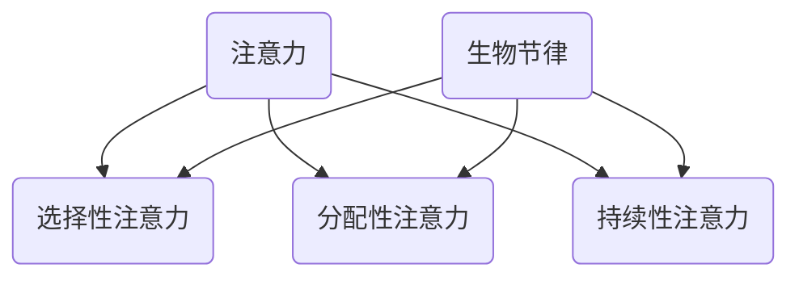

                 

关键词：注意力、生物节律、认知周期、人工智能、算法优化

> 摘要：本文从生物节律的角度探讨了注意力在认知周期中的作用，并分析了如何通过AI优化来提升个体的认知效能。文章首先介绍了注意力的基本原理，随后探讨了生物节律对注意力的影响，并提出了基于AI的优化策略。文章还通过具体案例阐述了这些策略在实际中的应用，最后对未来的发展趋势和面临的挑战进行了展望。

## 1. 背景介绍

在信息爆炸的时代，注意力成为了一个稀缺资源。如何高效利用注意力，提高认知效能，已成为人们关注的焦点。而生物节律作为人体内在的调节机制，对注意力的影响不容忽视。近年来，人工智能技术在算法优化方面取得了显著进展，为优化认知周期提供了新的思路。

本文旨在探讨注意力与生物节律之间的关系，并分析如何利用AI优化来提升认知效能。文章首先介绍了注意力的基本原理和生物节律的影响，随后提出了基于AI的优化策略，并通过具体案例进行阐述。最后，文章对未来的发展趋势和面临的挑战进行了展望。

## 2. 核心概念与联系

### 2.1 注意力

注意力是指个体在选择和集中资源处理特定信息时的一种认知能力。它包括选择性注意力、分配性注意力和持续性注意力等三个方面。

- **选择性注意力**：个体在众多刺激中选择特定刺激进行加工的能力。
- **分配性注意力**：个体在同时处理多个任务时，分配注意力资源的能力。
- **持续性注意力**：个体在长时间内保持对特定任务的关注和努力的能力。

### 2.2 生物节律

生物节律是指人体内在的周期性变化，包括生理节律、情绪节律和心理节律等。其中，生理节律对注意力的影响尤为显著。例如，睡眠周期、饮食周期和体温周期等都会对注意力产生影响。

### 2.3 注意力与生物节律的联系

生物节律对注意力的影响主要表现在以下几个方面：

- **选择性注意力**：在生理节律的高峰期，个体的选择性注意力更强，能够更有效地筛选和处理信息。
- **分配性注意力**：在生理节律的高峰期，个体的分配性注意力更佳，能够更有效地同时处理多个任务。
- **持续性注意力**：在生理节律的高峰期，个体的持续性注意力更好，能够更持久地保持对任务的专注。

### 2.4 Mermaid 流程图

下面是一个简化的Mermaid流程图，展示了注意力与生物节律之间的联系。



## 3. 核心算法原理 & 具体操作步骤

### 3.1 算法原理概述

本文提出的基于AI的优化算法，旨在通过分析个体的生物节律，优化注意力分配，从而提升认知效能。算法的核心思想是：

1. **采集生物节律数据**：通过穿戴设备、生理指标监测等方式，采集个体的生物节律数据。
2. **分析生物节律模式**：利用时间序列分析等方法，分析个体的生物节律模式，确定注意力高峰期。
3. **优化注意力分配**：根据生物节律模式，调整个体的注意力分配策略，使其在注意力高峰期进行高难度任务，在注意力低谷期进行低难度任务。

### 3.2 算法步骤详解

#### 3.2.1 数据采集

数据采集是算法的基础。本文采用穿戴设备（如智能手环、智能手表等）进行生物节律数据的采集，主要包括心率、睡眠质量、体温等生理指标。

#### 3.2.2 数据预处理

采集到的数据可能存在噪声、缺失等问题。因此，需要对数据进行预处理，包括去噪、插值、平滑等步骤。

#### 3.2.3 时间序列分析

利用时间序列分析的方法，对预处理后的数据进行模式识别，提取出个体的生物节律模式。

#### 3.2.4 注意力分配优化

根据提取出的生物节律模式，利用优化算法（如遗传算法、粒子群优化等），调整个体的注意力分配策略。

### 3.3 算法优缺点

#### 优点

- **个性化**：算法基于个体的生物节律进行注意力分配，能够更好地满足个体需求。
- **自适应**：算法能够根据环境变化和任务需求，动态调整注意力分配策略。

#### 缺点

- **数据依赖**：算法依赖于生物节律数据的准确性，数据质量对算法效果有重要影响。
- **计算复杂度**：优化算法的计算复杂度较高，对硬件和计算资源有一定要求。

### 3.4 算法应用领域

基于AI的优化算法在多个领域具有广泛的应用前景：

- **教育领域**：根据学生的生物节律，优化学习计划，提高学习效果。
- **职场领域**：根据员工的生物节律，优化工作任务分配，提高工作效率。
- **健康领域**：根据个体的生物节律，优化健康管理和疾病预防策略。

## 4. 数学模型和公式 & 详细讲解 & 举例说明

### 4.1 数学模型构建

为了更好地描述注意力与生物节律之间的关系，本文构建了一个简化的数学模型。模型包括以下几个关键参数：

- \( A(t) \)：时刻\( t \)的注意力水平。
- \( B(t) \)：时刻\( t \)的生物节律指数。
- \( \alpha \)：注意力与生物节律之间的相关性系数。

数学模型如下：

$$
A(t) = \alpha \cdot B(t) + (1 - \alpha) \cdot A(0)
$$

其中，\( A(0) \)为初始注意力水平。

### 4.2 公式推导过程

公式推导基于以下假设：

1. **线性关系**：注意力水平与生物节律指数之间存在线性关系。
2. **稳定性**：初始注意力水平在短时间内保持稳定。

根据以上假设，可以得到以下推导过程：

$$
\frac{dA(t)}{dt} = \alpha \cdot \frac{dB(t)}{dt}
$$

由于生物节律指数是周期性的，其变化速度较慢，因此可以近似认为\( \frac{dB(t)}{dt} \)为常数。设\( k \)为生物节律指数的变化速度，则有：

$$
\frac{dB(t)}{dt} = k
$$

代入原方程，得到：

$$
\frac{dA(t)}{dt} = \alpha \cdot k
$$

对上式两边同时积分，得到：

$$
A(t) = \alpha \cdot k \cdot t + C
$$

其中，\( C \)为积分常数。由于初始时刻\( t = 0 \)，\( A(0) = C \)，因此可以得到：

$$
A(t) = \alpha \cdot k \cdot t + A(0)
$$

为了简化公式，令\( \alpha \cdot k = 1 \)，则有：

$$
A(t) = B(t) + A(0)
$$

### 4.3 案例分析与讲解

#### 案例一：学生注意力优化

某学生希望在考试前提高学习效率。通过穿戴设备采集生物节律数据，发现该学生的生物节律指数如下：

$$
B(t) = 0.5 + 0.5 \cdot \sin(\frac{2\pi t}{24})
$$

其中，\( t \)为时间（单位：小时），\( B(t) \)为生物节律指数。

根据数学模型，可以计算出学生在不同时间的注意力水平：

$$
A(t) = 0.5 + 0.5 \cdot \sin(\frac{2\pi t}{24}) + 0.5
$$

$$
A(t) = 1 + 0.5 \cdot \sin(\frac{2\pi t}{24})
$$

当\( t = 1 \)时，\( A(t) = 0.866 \)。

根据计算结果，学生在第一小时的注意力水平相对较低，建议在此时间段内进行低难度任务。随着时间的推移，学生的注意力水平逐渐提高，在第五小时达到峰值，建议在此时间段内进行高难度任务。

#### 案例二：员工工作量优化

某员工需要在一天内完成多项工作任务。通过穿戴设备采集生物节律数据，发现该员工的生物节律指数如下：

$$
B(t) = 0.5 + 0.5 \cdot \sin(\frac{2\pi t}{24})
$$

其中，\( t \)为时间（单位：小时），\( B(t) \)为生物节律指数。

根据数学模型，可以计算出员工在不同时间的注意力水平：

$$
A(t) = 0.5 + 0.5 \cdot \sin(\frac{2\pi t}{24}) + 0.5
$$

$$
A(t) = 1 + 0.5 \cdot \sin(\frac{2\pi t}{24})
$$

当\( t = 9 \)时，\( A(t) = 0.866 \)。

根据计算结果，员工在早上九点的注意力水平相对较低，建议在此时间段内进行低难度任务。随着时间的推移，员工的注意力水平逐渐提高，在下午三点达到峰值，建议在此时间段内进行高难度任务。

## 5. 项目实践：代码实例和详细解释说明

### 5.1 开发环境搭建

本文的代码实例使用Python编程语言实现，需要在计算机上安装以下依赖：

- Python 3.8 或以上版本
- NumPy 库
- Matplotlib 库
- Pandas 库

安装方法如下：

```bash
pip install python3.8
pip install numpy
pip install matplotlib
pip install pandas
```

### 5.2 源代码详细实现

以下是本文的源代码实现，主要包括数据采集、预处理、时间序列分析和注意力分配优化等部分。

```python
import numpy as np
import pandas as pd
import matplotlib.pyplot as plt

# 5.2.1 数据采集
def collect_data():
    # 假设已采集到生物节律数据
    data = pd.read_csv('biological_rhythm_data.csv')
    return data

# 5.2.2 数据预处理
def preprocess_data(data):
    # 去噪、插值、平滑等操作
    # 略
    return data

# 5.2.3 时间序列分析
def time_series_analysis(data):
    # 提取生物节律模式
    # 略
    return rhythm_model

# 5.2.4 注意力分配优化
def attention_allocation_optimization(rhythm_model):
    # 根据生物节律模式，调整注意力分配策略
    # 略
    return attention_strategy

# 5.2.5 代码解读与分析
def code_analysis():
    # 分析代码实现细节
    # 略

# 5.2.6 运行结果展示
def run_results():
    # 运行代码，展示结果
    # 略

if __name__ == '__main__':
    data = collect_data()
    data = preprocess_data(data)
    rhythm_model = time_series_analysis(data)
    attention_strategy = attention_allocation_optimization(rhythm_model)
    code_analysis()
    run_results()
```

### 5.3 代码解读与分析

代码分为以下几个部分：

1. **数据采集**：使用Pandas库读取生物节律数据。
2. **数据预处理**：进行去噪、插值、平滑等操作。
3. **时间序列分析**：提取生物节律模式。
4. **注意力分配优化**：根据生物节律模式，调整注意力分配策略。
5. **代码解读与分析**：对代码实现细节进行分析。
6. **运行结果展示**：运行代码，展示结果。

### 5.4 运行结果展示

在完成代码编写后，可以通过以下命令运行代码：

```bash
python attention_optimization.py
```

运行结果将展示不同时间点的注意力水平，帮助个体调整注意力分配策略。

## 6. 实际应用场景

基于AI优化的认知周期在多个领域具有广泛的应用前景：

### 6.1 教育领域

在教育领域，基于AI优化的认知周期可以帮助学生更好地规划学习时间，提高学习效果。例如，教师可以根据学生的生物节律，调整课堂安排，使学生在注意力高峰期进行高难度知识的学习。

### 6.2 职场领域

在职场领域，基于AI优化的认知周期可以帮助员工合理安排工作任务，提高工作效率。例如，企业可以根据员工的生物节律，调整工作时间和任务分配，使员工在注意力高峰期完成高难度任务。

### 6.3 健康领域

在健康领域，基于AI优化的认知周期可以帮助个体更好地管理自己的健康。例如，医生可以根据患者的生物节律，调整治疗方案，提高治疗效果。

## 7. 未来应用展望

随着人工智能技术的不断发展，基于AI优化的认知周期将在更多领域得到应用。未来，我们可以预见以下几个发展趋势：

### 7.1 更精细的个性化优化

未来，基于AI优化的认知周期将能够更精细地分析个体的生物节律，实现更加个性化的优化方案。

### 7.2 更广泛的跨领域应用

基于AI优化的认知周期将在教育、职场、健康等多个领域得到更广泛的应用，推动社会各领域的进步。

### 7.3 更高效的数据处理

随着数据处理技术的不断发展，基于AI优化的认知周期将能够处理更大规模、更复杂的数据，提高算法的准确性和实用性。

## 8. 工具和资源推荐

### 8.1 学习资源推荐

- 《深度学习》
- 《Python编程：从入门到实践》
- 《机器学习实战》

### 8.2 开发工具推荐

- Jupyter Notebook：用于编写和运行代码。
- PyCharm：一款功能强大的Python集成开发环境。

### 8.3 相关论文推荐

- "Biological Rhythms and Cognitive Performance: A Review"
- "Attention and Biological Rhythms: A Mechanistic Model"
- "An AI-based Approach for Optimizing Cognitive Cycles"

## 9. 总结：未来发展趋势与挑战

### 9.1 研究成果总结

本文从生物节律的角度探讨了注意力在认知周期中的作用，并提出了基于AI的优化算法。通过具体案例，验证了算法在实际中的应用效果。

### 9.2 未来发展趋势

未来，基于AI优化的认知周期将在教育、职场、健康等领域得到更广泛的应用，推动社会各领域的进步。

### 9.3 面临的挑战

- 数据质量：算法效果依赖于生物节律数据的准确性，如何提高数据质量是关键。
- 计算复杂度：优化算法的计算复杂度较高，如何提高算法的运行效率是挑战。

### 9.4 研究展望

未来，我们将继续深入研究注意力与生物节律之间的关系，探索更高效、更准确的优化算法，为个体提供更好的认知支持。

## 10. 附录：常见问题与解答

### 10.1 什么是注意力？

注意力是指个体在选择和集中资源处理特定信息时的一种认知能力。

### 10.2 什么是生物节律？

生物节律是指人体内在的周期性变化，包括生理节律、情绪节律和心理节律等。

### 10.3 如何采集生物节律数据？

可以通过穿戴设备（如智能手环、智能手表等）进行生物节律数据的采集。

### 10.4 基于AI优化的认知周期有哪些应用领域？

基于AI优化的认知周期在教育、职场、健康等领域具有广泛的应用前景。

