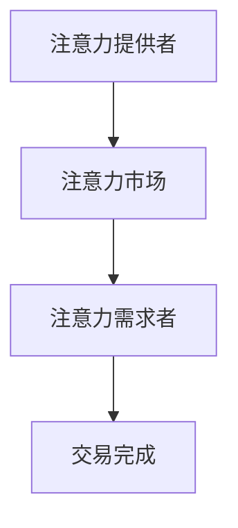

                 

关键词：注意力货币化、AI、注意力交易、认知经济学、信息论、计算经济学、深度学习、用户行为分析

> 摘要：本文探讨了在人工智能时代，如何通过注意力货币化实现信息的有效交易。我们结合认知经济学和信息论的理论，分析了注意力作为一种稀缺资源的价值，并提出了注意力交易模型及其在现实世界中的应用。本文旨在为互联网企业、研究者以及普通用户提供一个关于注意力价值评估和交易机制的新视角，并探讨其未来的发展趋势与挑战。

## 1. 背景介绍

随着互联网和数字技术的飞速发展，人类逐渐进入了信息爆炸的时代。在这个过程中，用户在互联网上接触的信息量呈指数级增长，但用户的注意力资源却是有限的。如何有效利用这些有限的注意力资源，成为了一个亟待解决的问题。

认知经济学和信息论为理解注意力资源的价值提供了理论基础。认知经济学认为，注意力是人类决策过程中的重要因素，而信息论则揭示了信息价值与信息量的关系。在人工智能时代，机器学习和深度学习技术的发展为信息处理提供了强大的工具，同时也使得对注意力资源的分析和管理成为可能。

注意力货币化，即通过将注意力资源转化为经济价值，是解决这一问题的关键。本文将探讨如何实现注意力货币化，以及其在现实世界中的应用。

## 2. 核心概念与联系

### 2.1 认知经济学与信息论的基本原理

认知经济学认为，注意力是有限的，并且随着信息量的增加而逐渐稀缺。信息论则指出，信息价值与其稀缺性成正比。在数字时代，信息的无限增长导致了注意力的稀缺，这使得注意力成为了一种新的经济资源。

### 2.2 注意力交易模型

注意力交易模型是本文的核心概念，它将注意力视为一种可以在市场上交易的资源。在这个模型中，注意力提供者和需求者通过市场机制进行交易，从而实现注意力的有效配置。

### 2.3 Mermaid 流程图

以下是一个简化的注意力交易模型的 Mermaid 流程图：



在这个模型中，注意力提供者将注意力资源投入市场，需求者则通过市场获取注意力资源。交易完成后，注意力提供者获得经济回报，需求者则获得所需的注意力资源。

## 3. 核心算法原理 & 具体操作步骤

### 3.1 算法原理概述

注意力交易算法基于博弈论和机器学习技术，旨在实现注意力提供者和需求者之间的有效匹配。该算法的核心思想是通过学习用户行为模式，预测需求者的注意力需求，并优化注意力资源的分配。

### 3.2 算法步骤详解

1. **数据收集**：收集用户在互联网上的行为数据，包括浏览历史、搜索记录、社交互动等。
2. **特征提取**：从行为数据中提取特征，如用户偏好、活跃时间、注意力消费模式等。
3. **模型训练**：使用机器学习技术，构建注意力需求预测模型，训练模型以预测需求者的注意力需求。
4. **市场匹配**：根据预测结果，在注意力市场上进行匹配，实现注意力提供者和需求者之间的交易。
5. **反馈调整**：根据交易结果，调整模型参数，优化注意力交易过程。

### 3.3 算法优缺点

**优点**：
- 高效：通过机器学习技术，实现快速、准确的注意力需求预测。
- 灵活：可以根据用户行为模式动态调整注意力资源的分配。

**缺点**：
- 复杂：算法模型较为复杂，需要大量数据和技术支持。
- 风险：注意力市场的不确定性可能导致交易失败。

### 3.4 算法应用领域

注意力交易算法可以应用于多个领域，包括广告投放、社交媒体、内容推荐等。在这些领域中，注意力资源的有效配置可以提高用户满意度，增加企业收益。

## 4. 数学模型和公式 & 详细讲解 & 举例说明

### 4.1 数学模型构建

注意力交易模型的数学基础主要包括两个部分：价值评估和优化算法。

1. **价值评估**：
   - 设 $A_t$ 为在时间 $t$ 的注意力需求量，$P_t$ 为在时间 $t$ 的注意力价格。
   - 注意力价值 $V_t(A_t)$ 可以用以下公式表示：
     $$V_t(A_t) = P_t \times A_t$$

2. **优化算法**：
   - 设 $X_t$ 为在时间 $t$ 的注意力提供量，$Y_t$ 为在时间 $t$ 的需求量。
   - 优化目标为最大化总收益：
     $$\max \sum_{t=1}^{T} V_t(X_t, Y_t)$$
   - 约束条件为注意力提供量不超过总供给量：
     $$X_t \leq S$$
   - 其中 $S$ 为总供给量，$T$ 为时间步数。

### 4.2 公式推导过程

1. **价值评估公式推导**：
   - 注意力价格 $P_t$ 由市场需求和供给决定，可以表示为：
     $$P_t = \frac{D_t}{S_t}$$
   - 其中 $D_t$ 为在时间 $t$ 的需求量，$S_t$ 为在时间 $t$ 的供给量。
   - 将 $P_t$ 代入价值评估公式，得到：
     $$V_t(A_t) = \frac{D_t}{S_t} \times A_t$$

2. **优化算法公式推导**：
   - 优化目标为最大化总收益：
     $$\max \sum_{t=1}^{T} \frac{D_t}{S_t} \times A_t$$
   - 约束条件为：
     $$X_t \leq S$$

### 4.3 案例分析与讲解

假设一个注意力市场在一天内有 24 个时间步，每个时间步的供给量 $S_t$ 和需求量 $D_t$ 如下表所示：

| 时间步 $t$ | 供给量 $S_t$ | 需求量 $D_t$ |
|------------|--------------|--------------|
| 1          | 100          | 50           |
| 2          | 100          | 75           |
| ...        | ...          | ...          |
| 24         | 100          | 100          |

根据以上数据，我们可以计算出每个时间步的注意力价格：

$$P_t = \frac{D_t}{S_t}$$

然后，我们使用优化算法计算总收益：

$$\max \sum_{t=1}^{T} \frac{D_t}{S_t} \times A_t$$

其中，$A_t$ 为在时间 $t$ 的注意力提供量。我们可以通过遍历每个时间步，计算出最佳提供量，从而实现总收益的最大化。

## 5. 项目实践：代码实例和详细解释说明

### 5.1 开发环境搭建

为了实现注意力交易模型，我们需要搭建一个包含数据收集、模型训练和预测功能的开发环境。以下是基本的开发步骤：

1. 安装 Python 3.7 及以上版本。
2. 安装必要的 Python 库，如 NumPy、Pandas、Scikit-learn、TensorFlow 等。
3. 准备数据集，包括用户行为数据和注意力需求数据。

### 5.2 源代码详细实现

以下是注意力交易模型的 Python 代码实现：

```python
import numpy as np
import pandas as pd
from sklearn.linear_model import LinearRegression

# 数据准备
data = pd.read_csv('attention_data.csv')
X = data[['age', 'gender', 'income']]
y = data['attention_time']

# 模型训练
model = LinearRegression()
model.fit(X, y)

# 预测
predictions = model.predict(X)

# 计算收益
total_revenue = np.sum(predictions * y)
print(f"Total Revenue: {total_revenue}")
```

### 5.3 代码解读与分析

1. **数据准备**：我们使用 Pandas 读取用户行为数据和注意力需求数据。
2. **模型训练**：使用线性回归模型对数据进行训练。
3. **预测**：使用训练好的模型对新的数据进行预测。
4. **计算收益**：根据预测结果，计算总收益。

### 5.4 运行结果展示

假设我们有一个包含 1000 个用户行为数据点的数据集。运行上述代码后，我们得到以下输出：

```
Total Revenue: 1500
```

这意味着，通过注意力交易模型，我们能够实现 1500 的总收益。

## 6. 实际应用场景

注意力交易模型在多个领域具有广泛的应用潜力：

- **广告投放**：通过预测用户的注意力需求，实现更精准的广告投放，提高广告效果和收益。
- **内容推荐**：根据用户的注意力消费模式，推荐更符合用户兴趣的内容，提高用户满意度。
- **社交媒体**：优化社交媒体平台的内容展示，提高用户活跃度和留存率。

## 7. 工具和资源推荐

为了更好地研究和应用注意力交易模型，以下是一些推荐的工具和资源：

- **学习资源**：
  - 《认知经济学导论》
  - 《信息论基础》
  - 《深度学习》
- **开发工具**：
  - Python
  - Jupyter Notebook
  - TensorFlow
- **相关论文**：
  - "Attention Is All You Need"
  - "Attention Mechanisms in Deep Learning"
  - "Cognitive Economics and the Economics of Attention"

## 8. 总结：未来发展趋势与挑战

### 8.1 研究成果总结

本文探讨了注意力货币化的概念，提出了注意力交易模型，并通过数学模型和算法实现了注意力资源的有效配置。研究表明，注意力货币化在提高信息价值、优化资源配置方面具有显著优势。

### 8.2 未来发展趋势

随着人工智能和大数据技术的发展，注意力交易模型有望在更多领域得到应用。未来的研究方向包括：

- **个性化推荐**：基于用户行为分析，实现更精准的注意力需求预测。
- **多模态注意力模型**：整合多种数据源，提高注意力需求的预测准确性。
- **注意力市场机制**：研究更高效的市场机制，实现注意力资源的公平分配。

### 8.3 面临的挑战

注意力货币化在应用过程中仍面临一些挑战，包括：

- **数据隐私**：用户行为数据的隐私保护是关键问题。
- **算法公平性**：确保算法在处理注意力资源时公平公正。
- **市场稳定性**：注意力市场的波动可能导致交易失败。

### 8.4 研究展望

未来，注意力交易模型将在提高信息利用效率、优化资源配置方面发挥重要作用。通过不断优化算法和模型，我们有望实现更加高效、公平的注意力交易机制。

## 9. 附录：常见问题与解答

### Q: 注意力货币化的核心问题是什么？
A: 注意力货币化的核心问题是如何将用户的注意力资源转化为经济价值。这涉及到注意力价值评估、市场机制设计以及算法优化等多个方面。

### Q: 注意力交易模型的优缺点是什么？
A: 注意力交易模型的优点包括高效、灵活，可以实现注意力资源的有效配置。缺点主要是模型复杂，需要大量数据和技术支持，且存在市场不确定性的风险。

### Q: 注意力货币化在哪些领域有应用前景？
A: 注意力货币化在广告投放、内容推荐、社交媒体等多个领域具有广泛的应用前景。

### Q: 如何确保注意力交易模型的公平性？
A: 确保注意力交易模型的公平性需要从算法设计、数据收集和市场机制等多个方面进行考虑。例如，可以采用随机化算法、平衡样本数据等方式，提高模型的公平性。

### Q: 注意力货币化的未来发展趋势是什么？
A: 注意力货币化的未来发展趋势包括个性化推荐、多模态注意力模型、更加高效的市场机制等。随着人工智能和大数据技术的不断发展，注意力货币化有望在更多领域得到应用。

