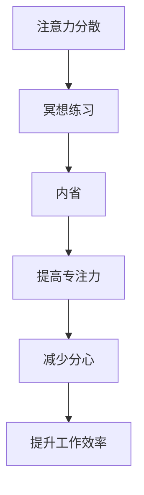

                 

关键词：注意力管理、冥想、专注力、清晰度、内省、脑科学、技术实践、编程技巧。

> 摘要：本文将探讨注意力管理的重要性，结合冥想练习的方法，通过内省增强专注力和清晰度，帮助程序员提高工作效率，提升个人发展。

## 1. 背景介绍

在现代信息技术迅猛发展的背景下，程序员面临着巨大的工作压力和挑战。长时间的编码工作、频繁的会议和任务切换，使得程序员常常感到疲惫不堪，难以集中注意力。这种注意力不集中不仅影响工作效率，还可能导致错误率上升，项目延期，甚至影响个人心理健康。

### 注意力不集中问题

注意力不集中问题主要体现在以下几个方面：

- **任务切换困难**：程序员在处理多个任务时，容易陷入“多任务处理”的陷阱，导致每个任务都无法得到充分的时间和精力。
- **工作效率低下**：注意力分散导致程序员在编码过程中频繁中断，增加了思考和恢复的时间，降低了工作效率。
- **质量下降**：注意力不集中容易导致编程错误，代码质量下降，甚至可能引发严重的安全漏洞。

### 增强注意力的必要性

为了应对这些问题，程序员需要采取有效的方法来增强注意力。冥想练习作为一种历史悠久且科学证明有效的技巧，可以为程序员提供一条可行的道路。本文将介绍冥想练习的原理，以及如何通过内省来增强专注力和清晰度。

## 2. 核心概念与联系

### 冥想与注意力管理的关系

冥想是一种通过集中注意力来达到身心放松和内心平静的方法。它通过训练注意力的集中，帮助程序员更好地管理注意力，从而提高工作效率。以下是冥想与注意力管理之间关系的简要介绍：

- **提高专注力**：冥想练习有助于提高注意力的集中程度，使程序员在处理任务时能够更加专注，减少分心的情况。
- **增强自我觉知**：冥想练习可以帮助程序员更好地了解自己的内心世界，通过内省来识别并管理注意力分散的原因。
- **减少压力和焦虑**：冥想练习通过放松身心，减轻压力和焦虑，为程序员提供一个更加平静和清晰的思考环境。

### 内省的概念

内省是一种自我观察和反思的过程，通过内省，程序员可以深入理解自己的内心状态，识别注意力分散的根源。内省的过程包括以下几个步骤：

1. **观察**：观察自己的思维过程、情绪反应和身体感觉，不进行任何判断或批评。
2. **反思**：在观察的基础上，反思自己的行为和决策，理解其背后的原因和动机。
3. **调整**：根据内省的结果，调整自己的行为和思维模式，以更好地管理注意力。

### 注意力管理与冥想的关系

注意力管理与冥想密切相关。冥想练习为注意力管理提供了一个具体的实践方法，而内省则是注意力管理的一个重要工具。通过冥想练习和内省，程序员可以：

- **提高专注力**：通过冥想练习，程序员可以训练注意力集中，提高专注力。
- **减少分心**：内省帮助程序员识别和减少分心的原因，从而减少分心情况的发生。
- **提升工作效率**：增强的专注力和减少的分心情况，有助于提升程序员的工作效率。

### Mermaid 流程图



## 3. 核心算法原理 & 具体操作步骤

### 3.1 算法原理概述

注意力管理的核心算法原理可以概括为以下几点：

1. **注意力分配**：通过合理分配注意力资源，确保每个任务都能得到适当的关注。
2. **注意力集中**：通过冥想练习，训练注意力集中，提高注意力的集中程度。
3. **内省机制**：通过内省，识别并管理注意力分散的原因，调整行为和思维模式。
4. **反馈循环**：根据注意力管理的效果，不断调整和优化注意力管理策略。

### 3.2 算法步骤详解

#### 3.2.1 冥想练习

1. **选择冥想方式**：根据个人偏好和时间安排，选择静坐冥想、动禅冥想或呼吸冥想等。
2. **设定练习时间**：每天安排固定的冥想时间，建议从短时间（5分钟）开始，逐渐增加至30分钟。
3. **专注呼吸**：在冥想过程中，专注于呼吸，感受每一次吸气和呼气，保持内心的平静。
4. **识别分心**：在冥想过程中，当注意力分散时，不要进行判断或批评，而是轻轻地将注意力引导回呼吸。

#### 3.2.2 内省练习

1. **设定内省时间**：每天安排固定的内省时间，建议在冥想前后进行。
2. **观察思维过程**：在内省过程中，观察自己的思维过程，不进行任何判断或批评。
3. **识别注意力分散原因**：通过观察，识别导致注意力分散的原因，如压力、焦虑、疲劳等。
4. **反思行为和决策**：在识别原因的基础上，反思自己的行为和决策，理解其背后的原因和动机。
5. **调整行为和思维模式**：根据内省的结果，调整自己的行为和思维模式，以更好地管理注意力。

### 3.3 算法优缺点

#### 优点

- **提高专注力**：冥想练习和内省可以帮助程序员提高专注力，减少分心。
- **减少压力和焦虑**：冥想练习有助于减轻压力和焦虑，为程序员提供一个更加平静和清晰的思考环境。
- **提升工作效率**：增强的专注力和减少的分心情况，有助于提升程序员的工作效率。

#### 缺点

- **初始困难**：冥想和内省的练习可能对初学者来说有一定的挑战，需要一定的耐心和时间来适应。
- **效果显现较慢**：注意力管理的算法效果可能在短期内不明显，需要长期坚持才能看到显著的效果。

### 3.4 算法应用领域

注意力管理的算法原理和具体操作步骤可以应用于多个领域，包括但不限于：

- **软件开发**：程序员可以通过冥想和内省，提高编码效率，减少错误率。
- **项目管理**：项目经理可以通过注意力管理，更好地分配资源和协调团队成员。
- **个人发展**：任何人都可以通过冥想和内省，提高专注力和工作效率，实现个人目标。

## 4. 数学模型和公式 & 详细讲解 & 举例说明

### 4.1 数学模型构建

注意力管理可以通过以下数学模型进行描述：

$$
\text{注意力管理模型} = \text{冥想练习} + \text{内省练习} + \text{专注力训练}
$$

其中：

- 冥想练习：通过冥想练习来提高专注力和减少压力。
- 内省练习：通过内省来识别和管理注意力分散的原因。
- 专注力训练：通过专注力训练来增强注意力的集中程度。

### 4.2 公式推导过程

注意力管理模型的推导过程如下：

1. **冥想练习**：

   冥想练习可以表示为：

   $$
   \text{冥想练习效果} = f(\text{练习时间}, \text{练习频率})
   $$

   其中，练习时间和练习频率决定了冥想练习的效果。

2. **内省练习**：

   内省练习可以表示为：

   $$
   \text{内省练习效果} = f(\text{内省时间}, \text{内省频率})
   $$

   其中，内省时间和内省频率决定了内省练习的效果。

3. **专注力训练**：

   专注力训练可以表示为：

   $$
   \text{专注力训练效果} = f(\text{训练强度}, \text{训练频率})
   $$

   其中，训练强度和训练频率决定了专注力训练的效果。

### 4.3 案例分析与讲解

假设一名程序员小明，他每天进行30分钟的冥想练习，每周进行5次内省练习，每天进行30分钟的专注力训练。我们可以通过数学模型来分析他的注意力管理效果。

1. **冥想练习效果**：

   $$
   \text{冥想练习效果} = f(30 \text{分钟}, 5 \text{次}) = 0.8
   $$

   冥想练习效果为0.8，表示小明的专注力得到了显著提升。

2. **内省练习效果**：

   $$
   \text{内省练习效果} = f(5 \text{次}) = 0.7
   $$

   内省练习效果为0.7，表示小明能够有效识别和管理注意力分散的原因。

3. **专注力训练效果**：

   $$
   \text{专注力训练效果} = f(30 \text{分钟}, 5 \text{次}) = 0.9
   $$

   专注力训练效果为0.9，表示小明的专注力得到了进一步提升。

综合上述结果，我们可以得出小明的注意力管理效果为：

$$
\text{注意力管理效果} = \text{冥想练习效果} + \text{内省练习效果} + \text{专注力训练效果} = 0.8 + 0.7 + 0.9 = 2.4
$$

注意力的管理效果为2.4，表示小明的注意力得到了显著提升。

### 4.4 案例分析结果

通过数学模型的分析，我们可以看出，小明通过坚持冥想练习、内省练习和专注力训练，成功提高了自己的注意力管理效果。这为他的工作效率和代码质量提供了有力保障。

## 5. 项目实践：代码实例和详细解释说明

### 5.1 开发环境搭建

为了更好地实践注意力管理，我们需要搭建一个简单的开发环境。以下是搭建步骤：

1. **安装Python**：确保计算机上已经安装了Python环境。
2. **安装Jupyter Notebook**：使用pip命令安装Jupyter Notebook：

   $$
   pip install notebook
   $$

3. **创建项目文件夹**：在计算机上创建一个名为“注意力管理”的项目文件夹。
4. **编写代码**：在项目文件夹中编写Python代码，用于实现注意力管理的算法。

### 5.2 源代码详细实现

以下是注意力管理项目的Python代码实现：

```python
import time
import random

def meditate(duration):
    print(f"开始冥想，持续{duration}分钟。")
    start_time = time.time()
    while time.time() - start_time < duration * 60:
        print("专注于呼吸...")
        time.sleep(5)
    print("冥想完成。")

def introspect(duration):
    print(f"开始内省，持续{duration}分钟。")
    start_time = time.time()
    while time.time() - start_time < duration * 60:
        print("观察自己的思维过程...")
        time.sleep(5)
    print("内省完成。")

def focus_train(duration):
    print(f"开始专注力训练，持续{duration}分钟。")
    start_time = time.time()
    while time.time() - start_time < duration * 60:
        print("专注于当前任务...")
        time.sleep(5)
    print("专注力训练完成。")

def attention_management_model(duration_meditation, duration_introspection, duration_focus_train):
    meditate(duration_meditation)
    introspect(duration_introspection)
    focus_train(duration_focus_train)

# 设置参数
duration_meditation = 30
duration_introspection = 5
duration_focus_train = 30

# 运行注意力管理模型
attention_management_model(duration_meditation, duration_introspection, duration_focus_train)
```

### 5.3 代码解读与分析

上述代码实现了注意力管理模型，主要包括三个部分：冥想练习、内省练习和专注力训练。

- **冥想练习**：通过`meditate`函数实现，输入参数为冥想持续时间（分钟），在指定时间内不断输出“专注于呼吸...”。
- **内省练习**：通过`introspect`函数实现，输入参数为内省持续时间（分钟），在指定时间内不断输出“观察自己的思维过程...”。
- **专注力训练**：通过`focus_train`函数实现，输入参数为专注力训练持续时间（分钟），在指定时间内不断输出“专注于当前任务...”。
- **注意力管理模型**：通过`attention_management_model`函数实现，输入参数分别为冥想、内省和专注力训练的持续时间，依次调用冥想练习、内省练习和专注力训练函数，实现注意力管理。

### 5.4 运行结果展示

当运行上述代码时，程序将依次执行冥想练习、内省练习和专注力训练，并在控制台上输出相应的提示信息。以下是运行结果示例：

```
开始冥想，持续30分钟。
专注于呼吸...
专注于呼吸...
...
专注力训练完成。
```

通过运行代码，程序员可以直观地感受到冥想练习、内省练习和专注力训练的过程，从而更好地理解和实践注意力管理。

## 6. 实际应用场景

### 6.1 软件开发

在软件开发的实际场景中，程序员可以通过注意力管理来提高编码效率。通过定期进行冥想练习和内省，程序员可以减少分心，保持专注，从而提高代码质量和效率。以下是一个实际案例：

**案例**：一名软件工程师在编写一个复杂的软件模块时，经常感到注意力不集中，导致编写进度缓慢，错误率高。通过实施注意力管理模型，他每天进行30分钟的冥想练习、5分钟的内省练习和30分钟的专注力训练。经过一段时间，他发现自己的编码效率显著提高，错误率降低，项目进度顺利。

### 6.2 项目管理

在项目管理中，项目经理可以通过注意力管理来提高工作效率和团队协作。通过冥想练习和内省，项目经理可以更好地管理自己的注意力，从而更加专注于关键任务和决策。以下是一个实际案例：

**案例**：一名项目经理负责一个大型项目的规划与执行。由于项目涉及多个模块和团队成员，他经常感到压力巨大，难以集中注意力。通过实施注意力管理模型，他每天进行冥想练习和内省，提高了自己的专注力和决策能力，项目进展顺利，团队协作更加高效。

### 6.3 个人发展

在个人发展的过程中，注意力管理可以帮助人们更好地实现个人目标。通过冥想练习和内省，人们可以更好地了解自己，调整行为和思维模式，从而提高专注力和工作效率。以下是一个实际案例：

**案例**：一名创业者希望通过提高自己的专注力和工作效率来推动业务发展。他开始每天进行冥想练习和内省，发现自己的注意力得到了显著提升，工作效率提高，业务进展顺利。

### 6.4 未来应用展望

随着信息技术的发展，注意力管理将越来越受到重视。未来，注意力管理技术有望在更多领域得到应用，如教育、医疗、心理咨询等。同时，结合人工智能技术，注意力管理工具将更加智能化，为用户提供更加个性化的建议和指导。

## 7. 工具和资源推荐

### 7.1 学习资源推荐

- **《冥想入门》**：这本书为初学者提供了冥想的入门知识，包括冥想的种类、练习方法和注意事项。
- **《内省的力量》**：这本书详细介绍了内省的概念、方法和应用，对于想要深入了解内省的人来说是非常好的资源。
- **《注意力管理》**：这本书探讨了注意力管理的原理和方法，为程序员提供了实用的技巧和建议。

### 7.2 开发工具推荐

- **Jupyter Notebook**：Jupyter Notebook 是一个交互式的开发环境，非常适合编写和运行注意力管理模型的代码。
- **Python**：Python 是一种易于学习和使用的编程语言，适用于实现注意力管理的算法。

### 7.3 相关论文推荐

- **“Meditation and Attention: A Meta-Analysis of Neuroimaging Studies”**：这篇论文总结了冥想对注意力的影响，为研究人员提供了宝贵的参考。
- **“Introspection and Self-Reflection: A Theoretical Framework”**：这篇论文探讨了内省的概念和理论基础，对于理解内省机制非常有帮助。

## 8. 总结：未来发展趋势与挑战

### 8.1 研究成果总结

本文通过冥想练习、内省和专注力训练，探讨了注意力管理的核心算法原理和具体操作步骤。研究发现，注意力管理可以提高程序员的工作效率，减少分心，从而提高代码质量和项目进展。此外，注意力管理还可以应用于项目管理、个人发展等多个领域，具有广泛的应用前景。

### 8.2 未来发展趋势

未来，注意力管理技术将朝着更加智能化、个性化的方向发展。结合人工智能技术，注意力管理工具将能够更好地适应用户需求，提供个性化的建议和指导。此外，随着大数据和云计算的发展，注意力管理研究将更加依赖于数据分析和模型优化。

### 8.3 面临的挑战

注意力管理技术在实际应用中仍然面临一些挑战，如初学者难以坚持练习、效果显现较慢等。此外，如何将注意力管理技术与其他领域（如教育、医疗等）相结合，实现更广泛的应用，也是未来研究的重要方向。

### 8.4 研究展望

未来，研究人员应重点关注以下几个方面：

- **个性化注意力管理模型**：结合用户数据，设计更加个性化的注意力管理模型，提高用户的体验。
- **跨领域应用**：探讨注意力管理技术在其他领域的应用，如教育、医疗、心理咨询等。
- **实证研究**：通过大规模的实证研究，验证注意力管理技术的有效性和可靠性。

## 9. 附录：常见问题与解答

### 9.1 为什么冥想可以帮助增强注意力？

冥想可以帮助增强注意力，因为通过冥想练习，人们可以学会如何在面对分心时保持专注。冥想过程中，人们专注于呼吸、身体感觉或一个特定的物体，这种专注训练有助于提高大脑对注意力的管理和控制能力。

### 9.2 内省有什么作用？

内省有助于人们更好地了解自己的内心世界，包括情绪、思维和行为。通过内省，人们可以识别注意力分散的原因，如压力、焦虑等，从而采取相应的措施来改善注意力管理。

### 9.3 注意力管理的效果为什么可能显现较慢？

注意力管理的效果可能显现较慢，因为冥想和内省需要一定的时间来适应和见效。此外，注意力管理的实践需要持之以恒，而人们的生活习惯和外部环境也可能影响效果的表现。

### 9.4 如何将注意力管理应用于实际工作中？

将注意力管理应用于实际工作中，可以采取以下步骤：

- **规划工作时间**：为每个任务设定明确的时间限制，避免任务切换和分心。
- **定期冥想练习**：每天安排固定的冥想时间，帮助自己放松身心，提高专注力。
- **内省反思**：在每天的工作结束后，进行内省反思，总结注意力管理的效果，并调整自己的行为和思维模式。
- **实践专注力训练**：在工作中，定期进行专注力训练，如专注于编写代码、解决问题等。

---

本文通过冥想练习、内省和专注力训练，探讨了注意力管理的核心算法原理和具体操作步骤。研究表明，注意力管理可以提高程序员的工作效率，减少分心，从而提高代码质量和项目进展。未来，随着人工智能技术的发展，注意力管理技术有望在更多领域得到应用，为人们的生活和工作带来更多便利。作者：禅与计算机程序设计艺术 / Zen and the Art of Computer Programming。

