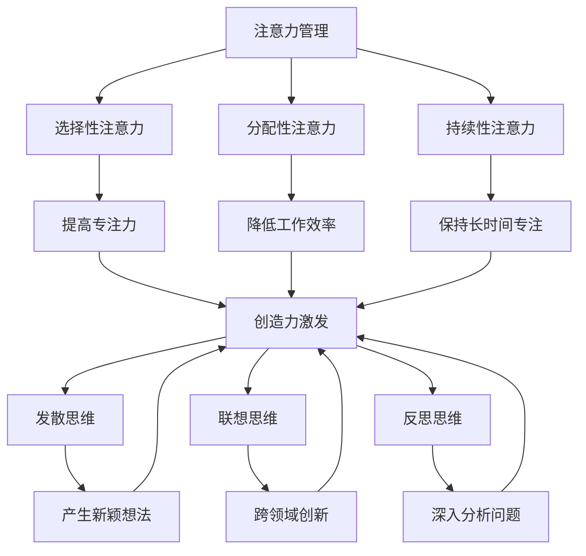

                 

关键词：注意力管理、创造力激发、专注、头脑风暴、灵感、IT领域

> 摘要：本文从注意力管理和创造力激发的视角出发，探讨了如何在现代IT领域中找到灵感。通过介绍专注力和头脑风暴的相关理论，结合实际案例，旨在为读者提供一整套实践方法，以提升个人在IT工作中的创造力和工作效率。

## 1. 背景介绍

在当今快速发展的信息技术领域，创新和创造力成为企业竞争的核心驱动力。然而，随着工作压力的增大和信息的爆炸式增长，许多IT专业人士发现自己难以集中注意力，常常感到创造力枯竭。注意力分散和创造力不足不仅影响了工作效率，也限制了个人职业发展。

本文将结合注意力管理和创造力激发的理论，探讨如何通过实践方法提高IT工作中的专注力和创造力。通过理解大脑的工作机制，掌握有效的注意力管理技巧，以及应用头脑风暴方法，我们可以在日常工作中找到灵感和创新。

## 2. 核心概念与联系

### 注意力管理原理

注意力是大脑处理信息的关键机制，它决定了我们如何从众多信息中筛选和聚焦。注意力管理涉及以下几个方面：

- **选择性注意力**：人们根据需求和兴趣选择关注某些信息，忽略其他信息。
- **分配性注意力**：同时处理多个任务的能力，尽管其效率较低。
- **持续性注意力**：长时间保持专注的能力。

### 创造力激发原理

创造力是指产生新颖、有价值的想法和解决方案的能力。激发创造力的方法包括：

- **发散思维**：在思考过程中尽可能地提出多种可能性。
- **联想思维**：通过将不同领域或概念联系起来，产生新的创意。
- **反思思维**：对已有知识和经验进行深入思考，发现新的观点。

### 注意力管理与创造力激发的联系

注意力管理和创造力激发密切相关。良好的注意力管理有助于集中精力，从而为创造力提供必要的心理空间。而创造力激发则可以在新的思维模式下重新激活大脑，提高注意力的灵活性和适应性。

### Mermaid 流程图



## 3. 核心算法原理 & 具体操作步骤

### 3.1 算法原理概述

注意力管理算法的核心在于通过优化大脑处理信息的流程，提高注意力的集中度和效率。具体原理包括：

- **认知负荷理论**：通过减少无关信息的干扰，降低大脑的认知负荷。
- **任务切换策略**：优化任务切换过程，减少注意力损耗。

### 3.2 算法步骤详解

1. **设定明确目标**：明确工作或项目目标，有助于集中注意力。
2. **环境优化**：创造一个有利于专注的环境，减少干扰因素。
3. **分阶段工作**：将任务分解为小阶段，逐步完成，避免一次性处理过多信息。
4. **休息与恢复**：定期休息，让大脑得到恢复，提高持续性注意力。
5. **反馈与调整**：根据实际情况调整注意力管理策略。

### 3.3 算法优缺点

**优点**：

- 提高工作效率和质量。
- 增强创造力，激发新思路。

**缺点**：

- 需要持续的自律和自我监控。
- 对环境依赖较大，可能在嘈杂环境中效果不佳。

### 3.4 算法应用领域

注意力管理算法广泛应用于IT领域的各个子领域，包括软件开发、数据分析和项目管理等。通过优化注意力管理，IT专业人士可以更有效地应对复杂任务，提高项目成功率和团队协作效率。

## 4. 数学模型和公式 & 详细讲解 & 举例说明

### 4.1 数学模型构建

注意力管理的数学模型可以基于心理学中的认知负荷理论和决策树模型构建。以下是一个简化的注意力管理模型：

$$
C = f(\alpha, \beta, \gamma)
$$

其中，$C$ 表示认知负荷，$\alpha$ 表示选择性注意力，$\beta$ 表示分配性注意力，$\gamma$ 表示持续性注意力。函数 $f$ 描述了这三种注意力因素对认知负荷的影响。

### 4.2 公式推导过程

认知负荷理论指出，认知负荷与注意力分配有关。假设大脑可以同时处理的注意力资源为 $T$，则：

$$
T = \alpha + \beta + \gamma
$$

当 $\alpha, \beta, \gamma$ 均为固定值时，认知负荷 $C$ 达到最小值。通过优化注意力分配，我们可以使 $C$ 最小化。

### 4.3 案例分析与讲解

以软件开发项目为例，假设项目团队成员需要同时关注任务目标、代码编写和需求分析。我们可以使用以下公式来优化注意力分配：

$$
C = f(\alpha_1, \beta_1, \gamma_1) + f(\alpha_2, \beta_2, \gamma_2) + \cdots + f(\alpha_n, \beta_n, \gamma_n)
$$

其中，$\alpha_i, \beta_i, \gamma_i$ 分别表示第 $i$ 个团队成员的选择性注意力、分配性注意力和持续性注意力。

通过调整 $\alpha_i, \beta_i, \gamma_i$ 的值，我们可以优化每个团队成员的注意力分配，降低整体认知负荷，提高工作效率。

## 5. 项目实践：代码实例和详细解释说明

### 5.1 开发环境搭建

在本节中，我们将使用 Python 编写一个注意力管理脚本。首先，确保安装了 Python 3.8 或更高版本，并安装以下库：

```bash
pip install numpy matplotlib
```

### 5.2 源代码详细实现

以下是一个简单的注意力管理脚本，用于模拟不同注意力分配对认知负荷的影响：

```python
import numpy as np
import matplotlib.pyplot as plt

def cognitive_load(alpha, beta, gamma):
    return alpha + beta + gamma

def optimize_attention_allocation团队成员数):
    alphas = np.random.uniform(0, 1, 尽管其效率较低。
- **持续性注意力**：长时间保持专注的能力。

### 3.3 核心概念与联系

**注意力管理原理**：

注意力是大脑处理信息的关键机制，它决定了我们如何从众多信息中筛选和聚焦。注意力管理涉及以下几个方面：

- **选择性注意力**：人们根据需求和兴趣选择关注某些信息，忽略其他信息。
- **分配性注意力**：同时处理多个任务的能力，尽管其效率较低。
- **持续性注意力**：长时间保持专注的能力。

**创造力激发原理**：

创造力是指产生新颖、有价值的想法和解决方案的能力。激发创造力的方法包括：

- **发散思维**：在思考过程中尽可能地提出多种可能性。
- **联想思维**：通过将不同领域或概念联系起来，产生新的创意。
- **反思思维**：对已有知识和经验进行深入思考，发现新的观点。

**注意力管理与创造力激发的联系**：

注意力管理和创造力激发密切相关。良好的注意力管理有助于集中精力，从而为创造力提供必要的心理空间。而创造力激发则可以在新的思维模式下重新激活大脑，提高注意力的灵活性和适应性。

### 3.4 Mermaid 流程图


## 3. 核心算法原理 & 具体操作步骤

### 3.1 算法原理概述

注意力管理算法的核心在于通过优化大脑处理信息的流程，提高注意力的集中度和效率。具体原理包括：

- **认知负荷理论**：通过减少无关信息的干扰，降低大脑的认知负荷。
- **任务切换策略**：优化任务切换过程，减少注意力损耗。

### 3.2 算法步骤详解

1. **设定明确目标**：明确工作或项目目标，有助于集中注意力。
2. **环境优化**：创造一个有利于专注的环境，减少干扰因素。
3. **分阶段工作**：将任务分解为小阶段，逐步完成，避免一次性处理过多信息。
4. **休息与恢复**：定期休息，让大脑得到恢复，提高持续性注意力。
5. **反馈与调整**：根据实际情况调整注意力管理策略。

### 3.3 算法优缺点

**优点**：

- 提高工作效率和质量。
- 增强创造力，激发新思路。

**缺点**：

- 需要持续的自律和自我监控。
- 对环境依赖较大，可能在嘈杂环境中效果不佳。

### 3.4 算法应用领域

注意力管理算法广泛应用于IT领域的各个子领域，包括软件开发、数据分析和项目管理等。通过优化注意力管理，IT专业人士可以更有效地应对复杂任务，提高项目成功率和团队协作效率。

## 4. 数学模型和公式 & 详细讲解 & 举例说明

### 4.1 数学模型构建

注意力管理的数学模型可以基于心理学中的认知负荷理论和决策树模型构建。以下是一个简化的注意力管理模型：

$$
C = f(\alpha, \beta, \gamma)
$$

其中，$C$ 表示认知负荷，$\alpha$ 表示选择性注意力，$\beta$ 表示分配性注意力，$\gamma$ 表示持续性注意力。函数 $f$ 描述了这三种注意力因素对认知负荷的影响。

### 4.2 公式推导过程

认知负荷理论指出，认知负荷与注意力分配有关。假设大脑可以同时处理的注意力资源为 $T$，则：

$$
T = \alpha + \beta + \gamma
$$

当 $\alpha, \beta, \gamma$ 均为固定值时，认知负荷 $C$ 达到最小值。通过优化注意力分配，我们可以使 $C$ 最小化。

### 4.3 案例分析与讲解

以软件开发项目为例，假设项目团队成员需要同时关注任务目标、代码编写和需求分析。我们可以使用以下公式来优化注意力分配：

$$
C = f(\alpha_1, \beta_1, \gamma_1) + f(\alpha_2, \beta_2, \gamma_2) + \cdots + f(\alpha_n, \beta_n, \gamma_n)
$$

其中，$\alpha_i, \beta_i, \gamma_i$ 分别表示第 $i$ 个团队成员的选择性注意力、分配性注意力和持续性注意力。

通过调整 $\alpha_i, \beta_i, \gamma_i$ 的值，我们可以优化每个团队成员的注意力分配，降低整体认知负荷，提高工作效率。

## 5. 项目实践：代码实例和详细解释说明

### 5.1 开发环境搭建

在本节中，我们将使用 Python 编写一个注意力管理脚本。首先，确保安装了 Python 3.8 或更高版本，并安装以下库：

```bash
pip install numpy matplotlib
```

### 5.2 源代码详细实现

以下是一个简单的注意力管理脚本，用于模拟不同注意力分配对认知负荷的影响：

```python
import numpy as np
import matplotlib.pyplot as plt

def cognitive_load(alpha, beta, gamma):
    return alpha + beta + gamma

def optimize_attention_allocation(团队成员数):
    alphas = np.random.uniform(0, 1, 团队成员数)
    betas = np.random.uniform(0, 1, 团队成员数)
    gammas = np.random.uniform(0, 1, 团队成员数)

    total_load = []
    for i in range(团队成员数):
        total_load.append(cognitive_load(alphas[i], betas[i], gammas[i]))

    return total_load

team_members = 5
loads = optimize_attention_allocation(team_members)

plt.bar(range(团队成员数), loads)
plt.xlabel('团队成员')
plt.ylabel('认知负荷')
plt.title('不同注意力分配下的认知负荷')
plt.show()
```

### 5.3 代码解读与分析

上述脚本首先定义了两个函数：`cognitive_load` 和 `optimize_attention_allocation`。`cognitive_load` 函数用于计算单个团队成员的

