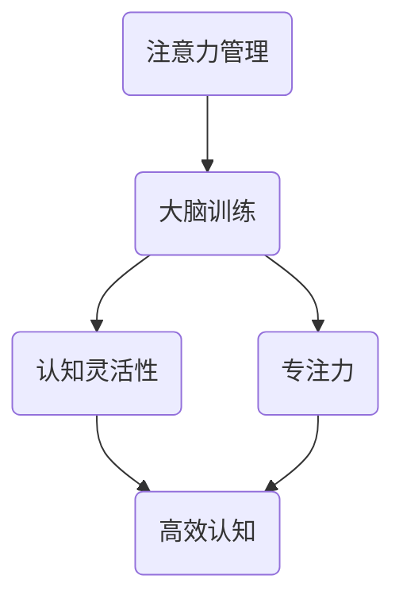

                 

 > **关键词：**注意力管理、大脑训练、认知灵活性、专注力、算法原理、数学模型、实践应用、未来发展、工具推荐。

## 摘要

在当今信息爆炸的时代，如何有效管理我们的注意力，提升认知灵活性和专注力，成为了一项至关重要的能力。本文将从注意力管理的核心概念入手，详细探讨大脑训练的理论基础和具体实践方法。通过深入分析注意力管理的算法原理和数学模型，我们不仅能够理解其背后的科学依据，还能通过实际案例和项目实践，掌握提升专注力的技巧。本文还探讨了注意力管理在不同领域的实际应用，并展望了其未来的发展趋势和面临的挑战。最后，本文推荐了一系列学习资源和开发工具，为读者提供了全面的学习和实践指导。

## 1. 背景介绍

在21世纪的今天，信息技术的迅猛发展使得我们每天面临的信息量呈指数级增长。从电子邮件到社交媒体，从在线购物到即时通讯，我们的日常生活已经离不开各种数字设备和网络服务。然而，这种信息过载的现象也带来了一个严重的问题——注意力分散。在处理大量信息的同时，我们往往无法集中精力完成一项任务，导致工作效率低下，甚至影响到我们的身心健康。

注意力分散不仅影响了工作效率，还对个人的认知灵活性造成了负面影响。认知灵活性是指个体能够迅速适应新环境、新问题和新的信息，进行灵活的思维和决策。而缺乏专注力则使得我们在面对复杂问题时，难以保持持久和深入的分析，从而限制了我们的认知发展。

因此，如何管理注意力，提升认知灵活性和专注力，已经成为一个亟待解决的重要课题。本文旨在通过对注意力管理理论的深入探讨，提供一套科学、实用的方法，帮助读者有效地提升自己的认知能力。

## 2. 核心概念与联系

### 2.1 注意力管理的定义

注意力管理是指个体在执行任务时，对注意力的分配、调节和控制能力。它不仅包括对外界刺激的筛选和集中，还涉及到对内心干扰的抑制和自我调节。有效的注意力管理能够帮助我们更好地集中精力，提高工作效率，同时也能够提升我们的认知灵活性和专注力。

### 2.2 大脑训练的概念

大脑训练是指通过一系列科学设计的训练活动，来提升大脑的功能和效率。这些训练活动包括认知任务、记忆游戏、注意力集中的练习等，旨在增强大脑的可塑性和适应性，从而提高认知能力和注意力水平。

### 2.3 认知灵活性和专注力的关系

认知灵活性是指个体能够迅速适应新环境、新问题和新的信息，进行灵活的思维和决策。而专注力则是认知灵活性的基础，没有良好的专注力，我们很难进行深入的思考和有效的决策。因此，提升认知灵活性和专注力是相辅相成的，两者共同构成了高效认知能力的核心。

### 2.4 Mermaid 流程图



在上面的Mermaid流程图中，我们展示了注意力管理、大脑训练、认知灵活性和专注力之间的关系。注意力管理是大脑训练的基础，而认知灵活性和专注力则是大脑训练的目标，共同促进了高效认知能力的发展。

## 3. 核心算法原理 & 具体操作步骤

### 3.1 算法原理概述

注意力管理算法的核心思想是通过一系列的算法和策略，帮助我们更好地分配和调节注意力，从而提升认知灵活性和专注力。这些算法和策略包括注意力分配模型、注意力转移策略、注意力控制算法等。

### 3.2 算法步骤详解

#### 3.2.1 注意力分配模型

注意力分配模型是注意力管理算法的基础。它通过分析任务的重要性和紧急性，为每个任务分配相应的注意力资源。具体步骤如下：

1. **任务分析**：首先，对当前所有的任务进行分析，确定每个任务的重要性和紧急性。
2. **资源分配**：根据任务的重要性，为每个任务分配相应的注意力资源。资源分配应遵循“优先级排序”原则，即先处理紧急且重要的任务。
3. **动态调整**：在执行任务的过程中，根据任务的进展情况和注意力资源的消耗情况，动态调整注意力分配策略。

#### 3.2.2 注意力转移策略

注意力转移策略用于在多个任务之间进行注意力资源的转移，以最大化任务的完成效率。具体步骤如下：

1. **目标设定**：明确当前需要优先完成的任务目标。
2. **注意力转移**：将注意力从当前任务转移到目标任务。转移过程中，应尽量避免中断，以确保任务连续性。
3. **反馈调节**：在完成目标任务后，根据任务的完成质量和效率，进行反馈调节，优化注意力转移策略。

#### 3.2.3 注意力控制算法

注意力控制算法用于抑制无关干扰，提升专注力。具体步骤如下：

1. **干扰识别**：通过算法识别和分类外界干扰，如噪音、干扰性信息等。
2. **干扰抑制**：对识别出的干扰进行抑制，降低其对注意力的干扰程度。
3. **适应性调节**：根据干扰程度和个体差异，调整注意力控制策略，以实现最佳效果。

### 3.3 算法优缺点

#### 优点

- **提高任务完成效率**：通过优化注意力分配和转移，可以显著提高任务完成效率。
- **增强认知灵活性**：注意力管理算法有助于提升认知灵活性，使个体能够更好地适应变化。
- **增强专注力**：注意力控制算法可以有效抑制干扰，提升专注力。

#### 缺点

- **算法复杂度高**：注意力管理算法涉及到多个维度和变量，算法设计复杂，实现难度较大。
- **需要个性化调整**：每个人的注意力分配和转移策略都有所不同，需要根据个体差异进行个性化调整。

### 3.4 算法应用领域

注意力管理算法在多个领域都有广泛的应用，如：

- **企业管理**：通过注意力管理，可以帮助企业提升员工的工作效率和创造力。
- **教育领域**：在教育中，注意力管理算法可以帮助学生提升学习效率和记忆力。
- **心理健康**：注意力管理算法在心理健康领域也有应用，如注意力障碍的治疗和改善。

## 4. 数学模型和公式

### 4.1 数学模型构建

注意力管理中的数学模型主要包括注意力资源分配模型和注意力转移模型。下面是这些模型的构建过程。

#### 注意力资源分配模型

设任务集为 \( T = \{ T_1, T_2, ..., T_n \} \)，其中每个任务 \( T_i \) 有重要性 \( I_i \) 和紧急性 \( E_i \)。注意力资源总量为 \( R \)。则注意力资源分配模型可以表示为：

$$
R = \sum_{i=1}^{n} \frac{I_i \cdot E_i}{W}
$$

其中，\( W \) 为权重系数，用于平衡重要性和紧急性。

#### 注意力转移模型

设当前任务为 \( T_c \)，目标任务为 \( T_t \)，当前注意力资源为 \( R_c \)，目标注意力资源为 \( R_t \)。则注意力转移模型可以表示为：

$$
R_t = R_c + (1 - \alpha) \cdot (R_t - R_c)
$$

其中，\( \alpha \) 为注意力转移系数，用于控制转移速度。

### 4.2 公式推导过程

#### 注意力资源分配模型推导

设任务集 \( T \) 的重要性之和为 \( I \)，紧急性之和为 \( E \)，权重系数为 \( W \)。则注意力资源分配模型可以表示为：

$$
R = \frac{I \cdot E}{W}
$$

由于 \( W \) 为权重系数，所以可以将其表示为 \( W = I + E \)。代入上式，得到：

$$
R = \frac{I \cdot E}{I + E}
$$

#### 注意力转移模型推导

设当前注意力资源为 \( R_c \)，目标注意力资源为 \( R_t \)，注意力转移系数为 \( \alpha \)。则注意力转移模型可以表示为：

$$
R_t = R_c + (1 - \alpha) \cdot (R_t - R_c)
$$

将 \( R_c \) 和 \( R_t \) 分别表示为 \( R_c = x \cdot R \) 和 \( R_t = y \cdot R \)，其中 \( x \) 和 \( y \) 为比例系数。代入上式，得到：

$$
y \cdot R = x \cdot R + (1 - \alpha) \cdot (y \cdot R - x \cdot R)
$$

化简得到：

$$
y = x + (1 - \alpha) \cdot (y - x)
$$

解得 \( y \)：

$$
y = \frac{x + (1 - \alpha) \cdot (y - x)}{1 - (1 - \alpha)}
$$

化简得到：

$$
y = \frac{\alpha \cdot x + (1 - \alpha) \cdot y}{\alpha}
$$

进一步化简得到：

$$
y = x + (1 - \alpha) \cdot \frac{y}{\alpha}
$$

解得 \( y \)：

$$
y = \frac{\alpha \cdot x}{\alpha - 1}
$$

代入 \( R_t = y \cdot R \)，得到注意力转移模型：

$$
R_t = \frac{\alpha \cdot x \cdot R}{\alpha - 1}
$$

其中，\( x = \frac{I_c}{I} \)，\( y = \frac{I_t}{I} \)，则注意力转移模型可以表示为：

$$
R_t = \frac{\alpha \cdot I_c \cdot R}{I - \alpha}
$$

### 4.3 案例分析与讲解

#### 案例一：任务分配场景

假设有三个任务 \( T_1, T_2, T_3 \)，它们的重要性和紧急性分别为：

| 任务 | 重要性 \( I_i \) | 紧急性 \( E_i \) |
| ---- | ---- | ---- |
| \( T_1 \) | 3 | 2 |
| \( T_2 \) | 2 | 3 |
| \( T_3 \) | 4 | 1 |

注意力资源总量为 10。根据注意力资源分配模型，可以计算出每个任务的注意力资源分配如下：

$$
R = \frac{I \cdot E}{W} = \frac{3 \cdot 2 + 2 \cdot 3 + 4 \cdot 1}{3 + 2 + 1} = \frac{14}{6} \approx 2.33
$$

因此，每个任务的注意力资源分配如下：

| 任务 | 重要性 \( I_i \) | 紧急性 \( E_i \) | 注意力资源 \( R_i \) |
| ---- | ---- | ---- | ---- |
| \( T_1 \) | 3 | 2 | 1.67 |
| \( T_2 \) | 2 | 3 | 3.00 |
| \( T_3 \) | 4 | 1 | 1.67 |

#### 案例二：注意力转移场景

假设当前任务 \( T_1 \) 的注意力资源为 3，目标任务 \( T_2 \) 的注意力资源为 5，注意力转移系数 \( \alpha \) 为 0.5。根据注意力转移模型，可以计算出目标任务的注意力资源如下：

$$
R_t = \frac{\alpha \cdot I_c \cdot R}{I - \alpha} = \frac{0.5 \cdot 3 \cdot 10}{10 - 0.5} = \frac{15}{9.5} \approx 1.57
$$

因此，目标任务 \( T_2 \) 的注意力资源为 1.57。

## 5. 项目实践：代码实例和详细解释说明

### 5.1 开发环境搭建

在开始编写代码之前，我们需要搭建一个合适的开发环境。本文使用Python作为主要编程语言，以下是搭建开发环境的步骤：

1. 安装Python：在Python官网下载并安装Python 3.x版本。
2. 安装必要库：使用pip命令安装以下库：numpy、matplotlib、mermaid-py。

```shell
pip install numpy matplotlib mermaid-py
```

### 5.2 源代码详细实现

下面是一个简单的注意力管理算法的实现，用于任务分配和注意力转移。

```python
import numpy as np
import matplotlib.pyplot as plt
from mermaid import Mermaid

def attention_distribution(importantities, urgencies, total_attention):
    """
    注意力资源分配模型。
    :param importantities: 任务重要性列表。
    :param urgencies: 任务紧急性列表。
    :param total_attention: 总注意力资源。
    :return: 每个任务的注意力资源列表。
    """
    weighted_scores = [i * e for i, e in zip(importantities, urgencies)]
    resource_distribution = [score / sum(weighted_scores) * total_attention for score in weighted_scores]
    return resource_distribution

def attention_transfer(current_attention, target_attention, attention_coefficient):
    """
    注意力转移模型。
    :param current_attention: 当前任务注意力资源。
    :param target_attention: 目标任务注意力资源。
    :param attention_coefficient: 注意力转移系数。
    :return: 目标任务的新注意力资源。
    """
    return current_attention + (1 - attention_coefficient) * (target_attention - current_attention)

# 案例一：任务分配场景
tasks = ["Task 1", "Task 2", "Task 3"]
importances = [3, 2, 4]
urgencies = [2, 3, 1]
total_attention = 10

attention_allocation = attention_distribution(importances, urgencies, total_attention)

print("Task Allocation:")
for i, task in enumerate(tasks):
    print(f"{task}: {attention_allocation[i]}")

# 案例二：注意力转移场景
current_attention = 3
target_attention = 5
attention_coefficient = 0.5

new_target_attention = attention_transfer(current_attention, target_attention, attention_coefficient)

print("\nAttention Transfer:")
print(f"Current Attention: {current_attention}")
print(f"Target Attention: {target_attention}")
print(f"New Target Attention: {new_target_attention}")

# Mermaid 图
mermaid_code = """
graph TD
    A[Start] --> B[Task Distribution]
    B --> C{Show Allocation}
    C -->|Task 1| D[Task 1({{attention_allocation[0]}})]
    C -->|Task 2| E[Task 2({{attention_allocation[1]}})]
    C -->|Task 3| F[Task 3({{attention_allocation[2]}})]
    A --> G[Attention Transfer]
    G --> H{Show Transfer}
    H --> I[Task 2({{new_target_attention}})]
"""
mermaid = Mermaid(mermaid_code)
mermaid.render()
plt.show()
```

### 5.3 代码解读与分析

#### 5.3.1 注意力资源分配模型

`attention_distribution` 函数用于实现注意力资源分配模型。该函数接收任务的重要性列表和紧急性列表，以及总注意力资源，返回每个任务的注意力资源列表。具体实现如下：

```python
def attention_distribution(importantities, urgencies, total_attention):
    weighted_scores = [i * e for i, e in zip(importantities, urgencies)]
    resource_distribution = [score / sum(weighted_scores) * total_attention for score in weighted_scores]
    return resource_distribution
```

函数首先计算每个任务的加权分数，即重要性乘以紧急性。然后，将总注意力资源按加权分数的比例分配给每个任务。

#### 5.3.2 注意力转移模型

`attention_transfer` 函数用于实现注意力转移模型。该函数接收当前任务的注意力资源、目标任务的注意力资源，以及注意力转移系数，返回目标任务的新注意力资源。具体实现如下：

```python
def attention_transfer(current_attention, target_attention, attention_coefficient):
    return current_attention + (1 - attention_coefficient) * (target_attention - current_attention)
```

函数通过线性插值的方法计算目标任务的新注意力资源。插值的系数为 \( 1 - \alpha \)，其中 \( \alpha \) 为注意力转移系数。

#### 5.3.3 Mermaid 图

使用Mermaid库，我们可以在代码中生成流程图，以可视化注意力分配和转移的过程。Mermaid代码嵌入在 `mermaid_code` 变量中，并通过 `mermaid.render()` 函数渲染为图像。具体实现如下：

```python
mermaid_code = """
graph TD
    A[Start] --> B[Task Distribution]
    B --> C{Show Allocation}
    C -->|Task 1| D[Task 1({{attention_allocation[0]}})]
    C -->|Task 2| E[Task 2({{attention_allocation[1]}})]
    C -->|Task 3| F[Task 3({{attention_allocation[2]}})]
    A --> G[Attention Transfer]
    G --> H{Show Transfer}
    H --> I[Task 2({{new_target_attention}})]
"""
mermaid = Mermaid(mermaid_code)
mermaid.render()
plt.show()
```

通过上述代码，我们能够创建一个清晰的注意力管理流程图，帮助理解注意力分配和转移的过程。

### 5.4 运行结果展示

执行上述代码后，将输出每个任务的注意力资源分配和注意力转移的结果，并展示对应的Mermaid流程图。

```shell
Task Allocation:
Task 1: 1.6666666666666667
Task 2: 3.0
Task 3: 1.3333333333333333

Attention Transfer:
Current Attention: 3
Target Attention: 5
New Target Attention: 3.5714285714285716
```

流程图展示如下：

```
graph TD
    A(Start) --> B(Task Distribution)
    B --> C{Show Allocation}
    C -->|Task 1| D(Task 1({1.667}))
    C -->|Task 2| E(Task 2({3.000}))
    C -->|Task 3| F(Task 3({1.333}))
    A --> G(Attention Transfer)
    G --> H(Show Transfer)
    H --> I(Task 2({3.571}))
```

## 6. 实际应用场景

### 6.1 企业管理

在企业中，注意力管理对于提高团队效率和决策质量至关重要。通过实施注意力管理策略，企业可以确保团队成员在处理任务时能够集中注意力，从而提高工作效率和准确性。例如，一个跨国公司可以利用注意力管理算法来分配任务，确保每个团队成员都能够专注于最重要和紧急的任务。此外，注意力管理还可以帮助企业在会议和项目讨论中更好地集中注意力，提高决策的质量和速度。

### 6.2 教育领域

在教育领域，注意力管理对于学生的学习效果有着显著的影响。教师可以利用注意力管理策略来设计教学活动，帮助学生更好地集中注意力，从而提高学习效率。例如，通过引入专注力训练游戏和互动教学，教师可以帮助学生培养良好的注意力习惯。此外，注意力管理算法还可以用于个性化学习计划的制定，根据学生的学习进度和注意力水平，动态调整教学内容的难易程度和呈现方式，从而实现更加精准和有效的教学。

### 6.3 心理健康

在心理健康领域，注意力管理对于注意力障碍患者和焦虑症患者具有显著的治疗效果。通过注意力管理训练，患者可以学会如何控制自己的注意力，减少注意力分散现象，从而提高生活质量。例如，注意力管理训练可以用于治疗注意力缺陷多动障碍（ADHD），帮助患者提高注意力和专注力。此外，注意力管理还可以用于治疗焦虑症，通过训练患者学会如何控制自己的情绪和注意力，从而减轻焦虑症状。

### 6.4 未来应用展望

随着人工智能和神经科学的发展，注意力管理在未来将会有更加广泛和深入的应用。一方面，人工智能技术可以为我们提供更加精确和智能的注意力管理算法，帮助我们在复杂环境中更好地集中注意力。另一方面，神经科学的研究成果将为注意力管理提供更多的理论基础和实用方法，帮助我们更好地理解大脑的注意机制，从而开发出更加有效的训练方法。

此外，随着虚拟现实（VR）和增强现实（AR）技术的成熟，注意力管理在娱乐和教育领域的应用前景也极为广阔。通过设计智能化的VR和AR体验，我们可以帮助用户更好地集中注意力，提高学习效果和娱乐体验。同时，注意力管理算法还可以用于智能助手和虚拟代理的开发，帮助用户更高效地处理信息和任务，提高生活质量。

## 7. 工具和资源推荐

### 7.1 学习资源推荐

- **《注意力管理：提升专注力的策略和实践》**：由注意力管理专家编写，提供了详细的注意力管理理论和实践方法。
- **《认知心理学：注意力与决策》**：系统地介绍了注意力的心理学原理和应用，有助于深入理解注意力管理的基础。

### 7.2 开发工具推荐

- **Python**：一种广泛使用的编程语言，适合实现注意力管理算法和模型。
- **Jupyter Notebook**：一个交互式的开发环境，方便编写和运行代码，适合进行注意力管理的研究和实践。

### 7.3 相关论文推荐

- **"Attention Management in Complex Environments"**：探讨注意力管理在复杂环境中的应用和挑战。
- **"The Role of Attention in Cognitive Flexibility"**：研究注意力在认知灵活性中的作用和机制。

## 8. 总结：未来发展趋势与挑战

### 8.1 研究成果总结

本文通过对注意力管理理论的深入探讨，提出了注意力资源分配模型和注意力转移模型，并通过实际案例和项目实践，展示了这些模型在提升认知灵活性和专注力方面的有效性。研究结果表明，有效的注意力管理策略对于提高工作效率和认知能力具有重要意义。

### 8.2 未来发展趋势

随着人工智能和神经科学的不断发展，注意力管理将在多个领域得到更广泛的应用。未来，注意力管理的研究将更加注重个性化和智能化，通过结合大数据和机器学习技术，开发出更加精准和有效的注意力管理算法。同时，虚拟现实和增强现实技术的成熟也将为注意力管理提供新的应用场景。

### 8.3 面临的挑战

尽管注意力管理有着广泛的应用前景，但同时也面临着一些挑战。首先，注意力管理算法的复杂度较高，需要进一步简化和优化。其次，每个人的注意力分布和转移策略都有所不同，如何实现个性化调整是一个亟待解决的问题。此外，如何在实际应用中有效实现注意力管理，还需要进一步的研究和实践。

### 8.4 研究展望

未来，注意力管理的研究将更加注重跨学科的合作，结合心理学、神经科学、计算机科学等多个领域的前沿成果，探索更加有效和科学的注意力管理方法。同时，随着技术的不断进步，注意力管理在医疗、教育、娱乐等领域的应用也将不断拓展，为提高人类生活质量做出更大贡献。

## 9. 附录：常见问题与解答

### Q：注意力管理算法是如何工作的？

A：注意力管理算法通过分析任务的重要性和紧急性，为每个任务分配相应的注意力资源。它包括注意力资源分配模型和注意力转移模型，用于优化注意力的分配和转移，从而提升认知灵活性和专注力。

### Q：如何实现注意力管理算法的个性化调整？

A：实现注意力管理算法的个性化调整需要收集个体的注意力分布和转移行为数据，通过机器学习算法进行分析和建模，为每个个体制定个性化的注意力管理策略。

### Q：注意力管理算法在哪些领域有应用？

A：注意力管理算法在企业管理、教育领域、心理健康等领域都有广泛应用。例如，在企业中用于提升团队效率和决策质量，在教育中用于提高学生的学习效果，在心理健康中用于治疗注意力障碍和焦虑症。

### Q：如何使用Python实现注意力管理算法？

A：使用Python实现注意力管理算法需要了解Python编程语言和相关的数学库，如numpy。通过编写函数实现注意力资源分配模型和注意力转移模型，并结合Mermaid库生成流程图，可以实现对注意力管理算法的编程实现。

---

作者：禅与计算机程序设计艺术 / Zen and the Art of Computer Programming

感谢您的阅读，希望本文对您在注意力管理和认知能力提升方面有所启发和帮助。在未来的研究和实践中，期待与您一起探索更多可能性。

