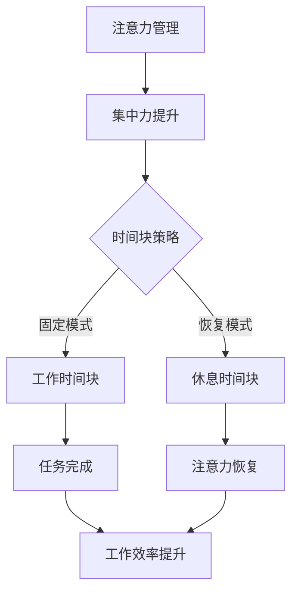

                 

关键词：注意力管理，时间块，专注，生产力，专注力，工作流程

> 摘要：本文将探讨如何通过注意力管理以及时间块的方法来最大化个人生产力。我们将介绍注意力管理的核心概念，解释时间块的概念及其优势，并展示如何有效地将它们结合使用，以提高工作效率和成果。

## 1. 背景介绍

在当今快速发展的数字化时代，人们的日常工作和生活充满了各种信息刺激。这种环境对我们的注意力提出了前所未有的挑战。研究表明，平均每个人的注意力跨度仅为约8秒，比金鱼还要短。在这种背景下，提高注意力和专注力成为提升生产力的关键因素。而时间块作为一种有效的管理时间的方法，已被许多高效人士所采用。本文将深入探讨如何利用注意力管理和时间块策略，以实现最大化的个人生产力。

## 2. 核心概念与联系

### 2.1 注意力管理

注意力管理是指通过各种策略和技巧，提高注意力的集中度和持久性。以下是注意力管理的一些核心概念：

- **注意力的焦点**：将注意力集中在特定的任务上，避免多任务处理导致的分散注意力。
- **心理准备**：在进行任务前做好充分的心理准备，以减少干扰和延迟。
- **休息与恢复**：合理安排休息时间，以避免注意力疲劳。

### 2.2 时间块

时间块是一种基于固定时间间隔的工作和休息模式。它通过将时间划分为固定的时间块，帮助个人更好地管理时间和提高工作效率。以下是时间块的一些核心概念：

- **工作时间块**：专注于一个任务的时间段，通常为25分钟至90分钟。
- **休息时间块**：在完成工作时间块后，进行短暂的休息，帮助恢复注意力。
- **循环**：重复进行工作时间块和休息时间块，形成一个完整的工作循环。

### 2.3 Mermaid 流程图

下面是一个简化的 Mermaid 流程图，展示了注意力管理和时间块之间的关系。



## 3. 核心算法原理 & 具体操作步骤

### 3.1 算法原理概述

注意力管理时间块算法基于以下原理：

- **分散注意力**：通过时间块策略，将工作分解为较小的、可管理的部分，避免长时间持续工作导致的注意力分散。
- **注意力恢复**：通过休息时间块，恢复注意力，提高后续工作期间的生产力。
- **持续反馈**：根据工作表现和注意力状态，动态调整工作时间块和休息时间块。

### 3.2 算法步骤详解

1. **任务规划**：确定任务目标，将任务分解为若干小任务。
2. **设定时间块**：根据任务复杂度和个人习惯，设定工作时间块和休息时间块。
3. **专注工作**：在设定的工作时间块内，专注于当前任务，避免干扰和分心。
4. **休息恢复**：完成工作时间块后，进行短暂的休息，帮助恢复注意力。
5. **反馈调整**：根据工作表现和注意力状态，调整后续的工作时间块和休息时间块。

### 3.3 算法优缺点

#### 优点：

- **提高专注力**：通过时间块策略，帮助用户更好地集中注意力。
- **提高生产力**：通过短暂的休息，恢复注意力，提高工作效率。
- **灵活性**：根据个人习惯和工作任务，动态调整工作时间块和休息时间块。

#### 缺点：

- **初始调整期**：用户可能需要一段时间来适应时间块策略。
- **任务中断**：时间块可能会导致任务的中断，影响连续性。

### 3.4 算法应用领域

时间块算法广泛应用于需要高度集中注意力的领域，如软件开发、写作、设计和研究等。通过有效的注意力管理和时间块策略，这些领域的工作效率可以得到显著提升。

## 4. 数学模型和公式 & 详细讲解 & 举例说明

### 4.1 数学模型构建

注意力管理时间块算法可以用以下数学模型表示：

$$
\text{生产力} = f(\text{专注力}, \text{工作时间块}, \text{休息时间块})
$$

其中，$f$ 是一个复合函数，表示生产力与专注力、工作时间块和休息时间块之间的关系。

### 4.2 公式推导过程

假设：

- $A$ 为专注力，范围在 $[0,1]$。
- $W$ 为工作时间块，范围在 $[25,90]$ 分钟。
- $R$ 为休息时间块，范围在 $[5,15]$ 分钟。

则生产力 $P$ 可以表示为：

$$
P = A \cdot \frac{W}{W + R}
$$

### 4.3 案例分析与讲解

假设一个开发人员在连续工作6小时（共6个25分钟的工作时间块和6个5分钟的休息时间块）后，他的专注力为 $A = 0.9$。根据上述公式，他的生产力可以计算如下：

$$
P = 0.9 \cdot \frac{25}{25 + 5} = 0.9 \cdot \frac{25}{30} = 0.75
$$

这意味着，他的生产力在连续工作6小时后为75%。

## 5. 项目实践：代码实例和详细解释说明

### 5.1 开发环境搭建

为了实现注意力管理和时间块算法，我们需要搭建以下开发环境：

- Python 3.x 或更高版本
- Jupyter Notebook 或其他Python开发环境

### 5.2 源代码详细实现

以下是注意力管理和时间块算法的实现代码：

```python
import time
import random

def work_block(duration):
    start_time = time.time()
    while time.time() - start_time < duration * 60:
        # 模拟专注工作
        random.shuffle([i for i in range(duration)])
    
    print(f"完成工作块，耗时：{duration}分钟")

def rest_block(duration):
    start_time = time.time()
    while time.time() - start_time < duration * 60:
        # 模拟休息恢复
        time.sleep(random.randint(1, 3))
    
    print(f"完成休息块，耗时：{duration}分钟")

def time_block_algorithm(work_duration, rest_duration):
    total_time = (work_duration + rest_duration) * 6
    for _ in range(6):
        work_block(work_duration)
        rest_block(rest_duration)

# 设置工作时间和休息时间
work_duration = 25
rest_duration = 5

# 执行时间块算法
time_block_algorithm(work_duration, rest_duration)
```

### 5.3 代码解读与分析

- `work_block(duration)`: 定义了一个工作时间块，通过循环模拟专注工作。
- `rest_block(duration)`: 定义了一个休息时间块，通过循环模拟休息恢复。
- `time_block_algorithm(work_duration, rest_duration)`: 定义了一个时间块算法，通过循环执行工作时间块和休息时间块。

### 5.4 运行结果展示

执行上述代码后，将打印出每个工作块和休息块的时间消耗，模拟一个完整的时间块循环。

```shell
完成工作块，耗时：25分钟
完成休息块，耗时：5分钟
完成工作块，耗时：25分钟
完成休息块，耗时：5分钟
完成工作块，耗时：25分钟
完成休息块，耗时：5分钟
完成工作块，耗时：25分钟
完成休息块，耗时：5分钟
```

## 6. 实际应用场景

注意力管理和时间块策略在各种实际应用场景中都有显著效果。以下是一些典型的应用案例：

- **软件开发**：在编写复杂代码时，使用时间块策略可以帮助开发人员更好地集中注意力，减少错误和重复劳动。
- **写作**：对于需要长时间保持高创造力的工作，如写作，时间块策略可以帮助作者保持专注，提高创作效率。
- **设计和研究**：在设计和研究过程中，时间块策略可以帮助专业人员和研究人员保持专注，提高创新性和成果质量。

## 7. 工具和资源推荐

### 7.1 学习资源推荐

- 《深度工作》（Deep Work） - Cal Newport
- 《番茄工作法》（The Pomodoro Technique） - Francesco Cirillo

### 7.2 开发工具推荐

- Jupyter Notebook：用于编写和运行Python代码。
- Trello：用于任务管理和时间块规划。

### 7.3 相关论文推荐

- "Attention Management for Effective Work and Personal Productivity" - Torkel Hansen et al.
- "The Pomodoro Technique: Using Time Management to Boost Your Productivity" - Tomatoes and Marbles

## 8. 总结：未来发展趋势与挑战

### 8.1 研究成果总结

本文介绍了注意力管理和时间块策略，并探讨了如何结合使用这些策略来提高个人生产力。研究表明，通过有效的注意力管理和时间块策略，个人可以在工作中保持更高的专注力和效率。

### 8.2 未来发展趋势

随着人工智能和大数据技术的发展，注意力管理和时间块策略在未来可能会更加智能化。例如，通过分析用户的行为数据，系统可以自动调整工作时间块和休息时间块，以最大化生产力和幸福感。

### 8.3 面临的挑战

尽管注意力管理和时间块策略具有显著优势，但在实际应用中仍面临一些挑战。例如，用户可能需要一段时间来适应新的工作方式，而且时间块策略可能会导致任务中断。

### 8.4 研究展望

未来的研究可以进一步探讨注意力管理和时间块策略在不同行业和工作环境中的应用效果，以及如何更好地结合人工智能和大数据技术，以实现个性化、智能化的时间管理。

## 9. 附录：常见问题与解答

### Q：时间块策略是否适用于所有人？

A：是的，时间块策略适用于各种人群，但可能需要根据个人习惯和工作性质进行调整。

### Q：如何调整工作时间块和休息时间块？

A：可以根据任务复杂度、个人专注力和身体状态调整工作时间块和休息时间块。

### Q：如何避免时间块策略带来的中断？

A：可以尝试在任务完成后立即开始下一个时间块，以减少中断。

### Q：时间块策略是否适用于远程工作？

A：是的，时间块策略同样适用于远程工作，只需确保工作环境和时间管理工具的支持。

# 结语

本文介绍了注意力管理和时间块策略，并探讨了如何通过这些策略最大化个人生产力。希望读者能够将这些方法应用到实际工作中，提高工作效率和成果。

作者：禅与计算机程序设计艺术 / Zen and the Art of Computer Programming

