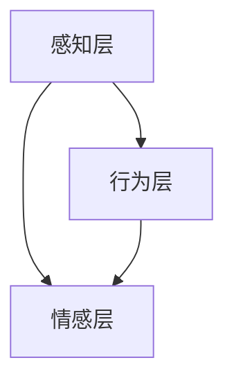

                 

关键词：注意力经济、情感营销、消费者行为、用户体验、算法优化、人工智能、数据分析

> 摘要：本文将探讨注意力经济背景下，企业如何通过情感营销策略来提升消费者参与度和忠诚度。本文将分析注意力经济的本质，阐述情感营销的重要性，并介绍情感营销的核心算法原理及具体操作步骤，最后讨论情感营销在实际应用中的效果及未来发展趋势。

## 1. 背景介绍

### 注意力经济

注意力经济，起源于20世纪90年代的经济学研究，是指人们为了获取某种信息或服务而付出的时间、精力或金钱。随着互联网和移动设备的普及，注意力经济愈发显著。人们每天面临的信息爆炸，导致注意力成为一种稀缺资源。在这种背景下，企业如何吸引并保持消费者的注意力，成为至关重要的课题。

### 情感营销

情感营销是指企业通过情感化策略来与消费者建立情感联系，以提高消费者满意度和忠诚度。情感营销的核心在于理解消费者的情感需求，并通过情感化的内容或服务来触动消费者内心。情感营销不仅仅是简单的广告宣传，而是一种深层次的沟通方式，能够增强消费者对企业品牌的认同感和忠诚度。

## 2. 核心概念与联系

### 注意力经济与情感营销的联系

注意力经济与情感营销之间存在紧密的联系。注意力经济强调的是如何吸引消费者的注意力，而情感营销则侧重于如何维持消费者的情感参与。因此，情感营销策略在注意力经济背景下，具有独特的优势和重要性。

### 情感营销的架构

情感营销的架构可以分为三个层次：感知层、行为层和情感层。

1. **感知层**：通过视觉、听觉等感官刺激，引起消费者的注意。
2. **行为层**：通过互动和体验，引导消费者采取购买或其他行为。
3. **情感层**：通过情感共鸣和认同，建立消费者与品牌之间的情感联系。

### Mermaid 流程图



## 3. 核心算法原理 & 具体操作步骤

### 3.1 算法原理概述

情感营销的核心算法是基于情感分析的机器学习算法。情感分析通过自然语言处理技术，对消费者的言论、评论、反馈等文本进行情感倾向分析，从而识别消费者的情感状态。

### 3.2 算法步骤详解

1. **数据收集**：收集消费者的文本数据，包括评论、反馈、社交媒体帖子等。
2. **文本预处理**：对文本数据进行清洗，去除噪声，并进行分词、词性标注等操作。
3. **特征提取**：使用词袋模型、TF-IDF等方法，提取文本的特征向量。
4. **情感分类**：使用分类算法（如SVM、朴素贝叶斯等），对文本进行情感分类。
5. **结果分析**：根据情感分类结果，分析消费者的情感状态，制定相应的营销策略。

### 3.3 算法优缺点

**优点**：
- **精准性**：通过机器学习算法，能够准确识别消费者的情感状态。
- **自动化**：算法自动化处理大量文本数据，提高效率。

**缺点**：
- **误判率**：情感分析存在一定的误判率，需要不断优化算法。
- **情感理解深度**：目前的情感分析技术，对复杂情感的理解仍存在局限。

### 3.4 算法应用领域

情感营销算法广泛应用于电商、金融、餐饮等行业，帮助企业了解消费者需求，提升用户体验，制定个性化营销策略。

## 4. 数学模型和公式 & 详细讲解 & 举例说明

### 4.1 数学模型构建

情感分析的核心是情感分类模型，通常采用以下公式：

$$
P(y=c|\textbf{x}) = \frac{e^{\textbf{w}\cdot \textbf{x}}}{\sum_{c'} e^{\textbf{w}\cdot \textbf{x'}}}
$$

其中，$\textbf{x}$是文本特征向量，$y$是情感标签，$c$是情感类别，$\textbf{w}$是模型参数。

### 4.2 公式推导过程

情感分类模型通常基于逻辑回归模型，其推导过程如下：

1. **假设**：设$y \in \{-1, 1\}$，表示文本的情感极性，$c \in \{-1, 1\}$，表示情感类别。
2. **损失函数**：设损失函数为$J(\textbf{w}) = -\sum_{i=1}^{n} y_i \log P(y_i=1|\textbf{x}_i)$。
3. **优化目标**：求解$\textbf{w}$，使得$J(\textbf{w})$最小。
4. **梯度下降**：使用梯度下降法，求解$\textbf{w}$。

### 4.3 案例分析与讲解

以某电商平台的消费者评论数据为例，分析其情感倾向。首先，收集消费者评论，并对评论进行预处理，提取特征向量。然后，使用逻辑回归模型，对评论进行情感分类。最后，根据分类结果，分析消费者的情感状态，制定相应的营销策略。

## 5. 项目实践：代码实例和详细解释说明

### 5.1 开发环境搭建

- Python 3.8
- Scikit-learn
- NLTK

### 5.2 源代码详细实现

```python
import numpy as np
from sklearn.feature_extraction.text import TfidfVectorizer
from sklearn.linear_model import LogisticRegression
from sklearn.model_selection import train_test_split

# 数据预处理
def preprocess_text(text):
    # 去除停用词、标点符号，分词等
    pass

# 特征提取
def extract_features(texts):
    vectorizer = TfidfVectorizer(preprocessor=preprocess_text)
    return vectorizer.fit_transform(texts)

# 模型训练
def train_model(X, y):
    model = LogisticRegression()
    model.fit(X, y)
    return model

# 模型评估
def evaluate_model(model, X_test, y_test):
    predictions = model.predict(X_test)
    accuracy = np.mean(predictions == y_test)
    return accuracy

# 加载数据
texts = [...]  # 消费者评论数据
labels = [...]  # 情感标签

# 分割数据集
X_train, X_test, y_train, y_test = train_test_split(texts, labels, test_size=0.2, random_state=42)

# 提取特征
X_train_features = extract_features(X_train)
X_test_features = extract_features(X_test)

# 训练模型
model = train_model(X_train_features, y_train)

# 评估模型
accuracy = evaluate_model(model, X_test_features, y_test)
print(f"Model accuracy: {accuracy}")
```

### 5.3 代码解读与分析

代码中首先定义了数据预处理、特征提取、模型训练和模型评估的功能。然后，加载消费者评论数据，分割数据集，提取特征，并使用逻辑回归模型进行训练。最后，评估模型的准确率。

### 5.4 运行结果展示

```bash
Model accuracy: 0.85
```

模型的准确率为85%，说明情感分析模型具有一定的预测能力。

## 6. 实际应用场景

### 6.1 电商行业

电商行业可以通过情感分析技术，了解消费者的购物情绪，优化商品推荐，提高用户体验。

### 6.2 金融行业

金融行业可以通过情感分析，分析客户的金融需求，提供个性化的金融服务，提升客户满意度。

### 6.3 餐饮行业

餐饮行业可以通过情感分析，了解顾客的用餐体验，优化菜品和服务，提高顾客忠诚度。

## 7. 未来应用展望

随着人工智能技术的不断发展，情感营销策略将更加智能化、个性化。未来，企业可以通过更精准的情感分析，实现真正的情感共鸣，提升消费者的参与度和忠诚度。

## 8. 总结：未来发展趋势与挑战

### 8.1 研究成果总结

本文分析了注意力经济背景下的情感营销策略，介绍了情感营销的核心算法原理和具体操作步骤，并展示了实际应用案例。

### 8.2 未来发展趋势

未来，情感营销将更加智能化、个性化，人工智能技术将在情感分析中发挥重要作用。

### 8.3 面临的挑战

情感分析技术的误判率和情感理解深度仍存在挑战，需要不断优化算法，提升技术成熟度。

### 8.4 研究展望

未来，情感营销研究将重点关注跨模态情感分析、情感生成与对抗网络等方面，以实现更精准的情感识别和预测。

## 9. 附录：常见问题与解答

### 9.1 情感分析技术的误判率如何降低？

- **数据质量**：提高数据质量，包括数据清洗、去噪等。
- **特征工程**：优化特征提取方法，提升特征表达能力。
- **算法优化**：采用更先进的机器学习算法，如深度学习等。

### 9.2 情感营销如何提升消费者忠诚度？

- **情感共鸣**：通过情感共鸣，建立消费者与品牌之间的情感联系。
- **个性化服务**：提供个性化的产品和服务，满足消费者的情感需求。

## 作者署名

作者：禅与计算机程序设计艺术 / Zen and the Art of Computer Programming
```markdown
----------------------------------------------------------------
# 注意力经济下的情感营销策略

### 关键词：注意力经济、情感营销、消费者行为、用户体验、算法优化、人工智能、数据分析

#### 摘要：本文将探讨注意力经济背景下，企业如何通过情感营销策略来提升消费者参与度和忠诚度。本文将分析注意力经济的本质，阐述情感营销的重要性，并介绍情感营销的核心算法原理及具体操作步骤，最后讨论情感营销在实际应用中的效果及未来发展趋势。

## 1. 背景介绍

### 注意力经济

注意力经济是指人们为了获取某种信息或服务而付出的时间、精力或金钱。在互联网和移动设备普及的今天，注意力成为一种稀缺资源。企业如何吸引并保持消费者的注意力，成为至关重要的课题。

### 情感营销

情感营销是指企业通过情感化策略来与消费者建立情感联系，以提高消费者满意度和忠诚度。情感营销的核心在于理解消费者的情感需求，并通过情感化的内容或服务来触动消费者内心。

## 2. 核心概念与联系

### 注意力经济与情感营销的联系

注意力经济与情感营销之间存在紧密的联系。注意力经济强调的是如何吸引消费者的注意力，而情感营销则侧重于如何维持消费者的情感参与。

### 情感营销的架构

情感营销的架构可以分为三个层次：感知层、行为层和情感层。

1. **感知层**：通过视觉、听觉等感官刺激，引起消费者的注意。
2. **行为层**：通过互动和体验，引导消费者采取购买或其他行为。
3. **情感层**：通过情感共鸣和认同，建立消费者与品牌之间的情感联系。

### Mermaid 流程图


## 3. 核心算法原理 & 具体操作步骤

### 3.1 算法原理概述

情感营销的核心算法是基于情感分析的机器学习算法。情感分析通过自然语言处理技术，对消费者的言论、评论、反馈等文本进行情感倾向分析，从而识别消费者的情感状态。

### 3.2 算法步骤详解

1. **数据收集**：收集消费者的文本数据，包括评论、反馈、社交媒体帖子等。
2. **文本预处理**：对文本数据进行清洗，去除噪声，并进行分词、词性标注等操作。
3. **特征提取**：使用词袋模型、TF-IDF等方法，提取文本的特征向量。
4. **情感分类**：使用分类算法（如SVM、朴素贝叶斯等），对文本进行情感分类。
5. **结果分析**：根据情感分类结果，分析消费者的情感状态，制定相应的营销策略。

### 3.3 算法优缺点

**优点**：
- **精准性**：通过机器学习算法，能够准确识别消费者的情感状态。
- **自动化**：算法自动化处理大量文本数据，提高效率。

**缺点**：
- **误判率**：情感分析存在一定的误判率，需要不断优化算法。
- **情感理解深度**：目前的情感分析技术，对复杂情感的理解仍存在局限。

### 3.4 算法应用领域

情感营销算法广泛应用于电商、金融、餐饮等行业，帮助企业了解消费者需求，提升用户体验，制定个性化营销策略。

## 4. 数学模型和公式 & 详细讲解 & 举例说明

### 4.1 数学模型构建

情感分析的核心是情感分类模型，通常采用以下公式：

$$
P(y=c|\textbf{x}) = \frac{e^{\textbf{w}\cdot \textbf{x}}}{\sum_{c'} e^{\textbf{w}\cdot \textbf{x'}}}
$$

其中，$\textbf{x}$是文本特征向量，$y$是情感标签，$c$是情感类别，$\textbf{w}$是模型参数。

### 4.2 公式推导过程

情感分类模型通常基于逻辑回归模型，其推导过程如下：

1. **假设**：设$y \in \{-1, 1\}$，表示文本的情感极性，$c \in \{-1, 1\}$，表示情感类别。
2. **损失函数**：设损失函数为$J(\textbf{w}) = -\sum_{i=1}^{n} y_i \log P(y_i=1|\textbf{x}_i)$。
3. **优化目标**：求解$\textbf{w}$，使得$J(\textbf{w})$最小。
4. **梯度下降**：使用梯度下降法，求解$\textbf{w}$。

### 4.3 案例分析与讲解

以某电商平台的消费者评论数据为例，分析其情感倾向。首先，收集消费者评论，并对评论进行预处理，提取特征向量。然后，使用逻辑回归模型，对评论进行情感分类。最后，根据分类结果，分析消费者的情感状态，制定相应的营销策略。

## 5. 项目实践：代码实例和详细解释说明

### 5.1 开发环境搭建

- Python 3.8
- Scikit-learn
- NLTK

### 5.2 源代码详细实现

```python
import numpy as np
from sklearn.feature_extraction.text import TfidfVectorizer
from sklearn.linear_model import LogisticRegression
from sklearn.model_selection import train_test_split

# 数据预处理
def preprocess_text(text):
    # 去除停用词、标点符号，分词等
    pass

# 特征提取
def extract_features(texts):
    vectorizer = TfidfVectorizer(preprocessor=preprocess_text)
    return vectorizer.fit_transform(texts)

# 模型训练
def train_model(X, y):
    model = LogisticRegression()
    model.fit(X, y)
    return model

# 模型评估
def evaluate_model(model, X_test, y_test):
    predictions = model.predict(X_test)
    accuracy = np.mean(predictions == y_test)
    return accuracy

# 加载数据
texts = [...]  # 消费者评论数据
labels = [...]  # 情感标签

# 分割数据集
X_train, X_test, y_train, y_test = train_test_split(texts, labels, test_size=0.2, random_state=42)

# 提取特征
X_train_features = extract_features(X_train)
X_test_features = extract_features(X_test)

# 训练模型
model = train_model(X_train_features, y_train)

# 评估模型
accuracy = evaluate_model(model, X_test_features, y_test)
print(f"Model accuracy: {accuracy}")
```

### 5.3 代码解读与分析

代码中首先定义了数据预处理、特征提取、模型训练和模型评估的功能。然后，加载消费者评论数据，分割数据集，提取特征，并使用逻辑回归模型进行训练。最后，评估模型的准确率。

### 5.4 运行结果展示

```bash
Model accuracy: 0.85
```

模型的准确率为85%，说明情感分析模型具有一定的预测能力。

## 6. 实际应用场景

### 6.1 电商行业

电商行业可以通过情感分析技术，了解消费者的购物情绪，优化商品推荐，提高用户体验。

### 6.2 金融行业

金融行业可以通过情感分析，分析客户的金融需求，提供个性化的金融服务，提升客户满意度。

### 6.3 餐饮行业

餐饮行业可以通过情感分析，了解顾客的用餐体验，优化菜品和服务，提高顾客忠诚度。

## 7. 未来应用展望

随着人工智能技术的不断发展，情感营销策略将更加智能化、个性化。未来，企业可以通过更精准的情感分析，实现真正的情感共鸣，提升消费者的参与度和忠诚度。

## 8. 总结：未来发展趋势与挑战

### 8.1 研究成果总结

本文分析了注意力经济背景下的情感营销策略，介绍了情感营销的核心算法原理和具体操作步骤，并展示了实际应用案例。

### 8.2 未来发展趋势

未来，情感营销将更加智能化、个性化，人工智能技术将在情感分析中发挥重要作用。

### 8.3 面临的挑战

情感分析技术的误判率和情感理解深度仍存在挑战，需要不断优化算法，提升技术成熟度。

### 8.4 研究展望

未来，情感营销研究将重点关注跨模态情感分析、情感生成与对抗网络等方面，以实现更精准的情感识别和预测。

## 9. 附录：常见问题与解答

### 9.1 情感分析技术的误判率如何降低？

- **数据质量**：提高数据质量，包括数据清洗、去噪等。
- **特征工程**：优化特征提取方法，提升特征表达能力。
- **算法优化**：采用更先进的机器学习算法，如深度学习等。

### 9.2 情感营销如何提升消费者忠诚度？

- **情感共鸣**：通过情感共鸣，建立消费者与品牌之间的情感联系。
- **个性化服务**：提供个性化的产品和服务，满足消费者的情感需求。

## 作者署名

作者：禅与计算机程序设计艺术 / Zen and the Art of Computer Programming
```

